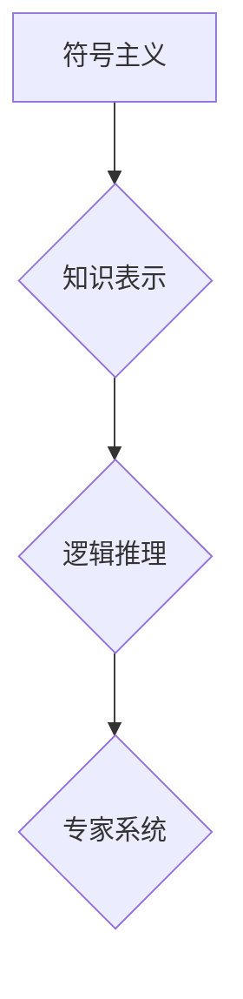

> 人工智能、早期研究、符号主义、专家系统、机器学习、神经网络、逻辑推理、知识表示

## 1. 背景介绍

人工智能（Artificial Intelligence，AI）作为一门跨学科领域，旨在创建能够像人类一样思考、学习和解决问题智能机器。自20世纪50年代诞生以来，AI研究经历了多个发展阶段，早期研究方向主要集中在符号主义和专家系统领域。

早期AI研究者们认为，智能行为本质上是符号操作和逻辑推理的过程。他们试图通过构建一套符号系统和规则，模拟人类的思维方式，从而实现机器的智能化。

## 2. 核心概念与联系

**2.1 符号主义**

符号主义是早期AI研究的核心思想之一，它认为智能行为可以被看作是对符号的处理和操作。符号主义者们试图用符号来表示世界中的知识和概念，并设计算法来处理这些符号，从而实现机器的推理和决策能力。

**2.2 专家系统**

专家系统是基于符号主义的早期AI应用之一。它试图将人类专家的知识和经验编码成计算机程序，从而模拟专家的决策过程。专家系统通常由知识库、推理引擎和用户界面组成。知识库存储专家知识，推理引擎根据知识库中的规则进行推理，用户界面则用于与专家系统交互。

**2.3 逻辑推理**

逻辑推理是符号主义的核心技术之一。它利用逻辑规则和推理方法，从已知知识出发，推导出新的结论。逻辑推理在早期AI系统中被广泛应用，例如用于诊断医学问题、解决数学问题等。

**2.4 知识表示**

知识表示是指将世界中的知识以计算机可理解的形式表示出来。早期AI研究中，常用的知识表示方法包括逻辑表达式、概念图和规则网络等。

**Mermaid 流程图**



## 3. 核心算法原理 & 具体操作步骤

**3.1 算法原理概述**

早期AI研究中，常用的算法包括：

* **规则推理算法:** 根据预先定义的规则，从已知知识出发，推导出新的结论。
* **搜索算法:** 在搜索空间中寻找满足特定条件的解。
* **启发式搜索算法:** 利用启发式函数，引导搜索过程，提高搜索效率。

**3.2 算法步骤详解**

以规则推理算法为例，其具体操作步骤如下：

1. **知识库构建:** 将专家知识以规则的形式存储在知识库中。
2. **问题输入:** 用户输入问题，将其转换为符号形式。
3. **规则匹配:** 系统从知识库中匹配与问题相关的规则。
4. **推理过程:** 根据匹配的规则，系统进行逻辑推理，推导出结论。
5. **结果输出:** 系统将推理结果以文本形式输出给用户。

**3.3 算法优缺点**

* **优点:** 能够处理复杂问题，具有较强的解释性。
* **缺点:** 知识库构建困难，难以处理不确定性问题。

**3.4 算法应用领域**

* **医学诊断:** 根据患者症状和病史，推断疾病诊断。
* **金融分析:** 分析市场数据，预测股票价格走势。
* **法律推理:** 根据法律法规，判断案件结果。

## 4. 数学模型和公式 & 详细讲解 & 举例说明

**4.1 数学模型构建**

在早期AI研究中，常用的数学模型包括：

* **概率模型:** 用于描述随机事件的发生概率。
* **逻辑模型:** 用于描述知识和推理关系。
* **图论模型:** 用于表示知识和关系网络。

**4.2 公式推导过程**

以概率模型为例，假设事件A发生的概率为P(A)，事件B发生的概率为P(B)，事件A和B发生的联合概率为P(A,B)。则事件A在事件B发生的条件下的概率为：

$$P(A|B) = \frac{P(A,B)}{P(B)}$$

**4.3 案例分析与讲解**

假设我们有一个医疗诊断系统，需要根据患者症状预测疾病类型。我们可以使用概率模型来表示疾病类型和症状之间的关系。例如，假设疾病A的发生概率为0.1，症状B的发生概率为0.2，疾病A和症状B发生的联合概率为0.05。则根据公式，我们可以计算出患者出现症状B的条件下患有疾病A的概率：

$$P(A|B) = \frac{0.05}{0.2} = 0.25$$

## 5. 项目实践：代码实例和详细解释说明

**5.1 开发环境搭建**

* 操作系统: Ubuntu 20.04
* 编程语言: Python 3.8
* 开发工具: Jupyter Notebook

**5.2 源代码详细实现**

```python
# 规则推理算法示例代码

# 知识库
knowledge_base = {
    "症状A": ["疾病X", "疾病Y"],
    "症状B": ["疾病Y", "疾病Z"],
}

# 用户输入
symptoms = ["症状A", "症状B"]

# 规则匹配
for symptom in symptoms:
    for disease in knowledge_base[symptom]:
        print(f"根据症状{symptom}, 可能患有疾病{disease}")

```

**5.3 代码解读与分析**

* 代码首先定义了一个知识库，将症状和疾病之间的关系存储在字典中。
* 然后，用户输入症状列表。
* 循环遍历用户输入的症状，并根据知识库中的规则，推导出可能的疾病。

**5.4 运行结果展示**

```
根据症状症状A, 可能患有疾病疾病X
根据症状症状A, 可能患有疾病疾病Y
根据症状症状B, 可能患有疾病疾病Y
根据症状症状B, 可能患有疾病疾病Z
```

## 6. 实际应用场景

早期AI研究成果在多个领域得到了应用，例如：

* **自然语言处理:** 早期自然语言处理系统能够进行简单的文本分析和翻译。
* **图像识别:** 早期图像识别系统能够识别简单的物体，例如数字和字母。
* **游戏人工智能:** 早期游戏人工智能能够控制游戏角色进行简单的决策和行动。

**6.4 未来应用展望**

尽管早期AI研究成果相对有限，但它为现代AI的发展奠定了基础。未来，随着计算能力和算法技术的进步，早期AI研究方向将继续得到发展和应用，例如：

* **知识图谱:** 基于符号主义的知识表示方法将继续发展，构建更庞大、更复杂的知识图谱。
* **逻辑推理增强:** 逻辑推理算法将得到改进，能够处理更复杂、更不确定性的问题。
* **专家系统升级:** 专家系统将结合机器学习和深度学习技术，实现更智能化、更自动化。

## 7. 工具和资源推荐

**7.1 学习资源推荐**

* **书籍:**
    * 《人工智能：现代方法》
    * 《人工智能导论》
* **在线课程:**
    * Coursera: 人工智能
    * edX: 人工智能

**7.2 开发工具推荐**

* **Python:** 广泛应用于AI开发，拥有丰富的库和工具。
* **TensorFlow:** 深度学习框架，用于构建和训练神经网络。
* **PyTorch:** 深度学习框架，灵活易用，适合研究和开发。

**7.3 相关论文推荐**

* **《A Logical Approach to Artificial Intelligence》**
* **《Expert Systems: Principles and Programming》**
* **《The Perceptron: A Probabilistic Model for Information Storage and Organization in the Brain》**

## 8. 总结：未来发展趋势与挑战

**8.1 研究成果总结**

早期AI研究取得了重要的成果，为现代AI的发展奠定了基础。符号主义和专家系统成为早期AI研究的核心方向，并取得了一定的应用成功。

**8.2 未来发展趋势**

未来AI研究将朝着更智能化、更通用化的方向发展，例如：

* **深度学习:** 深度学习算法能够学习更复杂的模式，并取得了在图像识别、自然语言处理等领域的突破。
* **强化学习:** 强化学习算法能够通过与环境交互学习，并解决更复杂的任务。
* **迁移学习:** 迁移学习算法能够将已有的知识迁移到新的任务中，提高学习效率。

**8.3 面临的挑战**

* **数据获取和处理:** AI算法需要大量的训练数据，而获取和处理高质量数据仍然是一个挑战。
* **算法解释性和可解释性:** 许多AI算法是黑箱模型，难以解释其决策过程，这限制了其在安全和可靠性要求高的领域应用。
* **伦理和社会影响:** AI技术的发展可能带来伦理和社会问题，例如就业替代、算法偏见等，需要引起重视和探讨。

**8.4 研究展望**

未来AI研究需要关注以下几个方面:

* **开发更安全、更可靠的AI算法。**
* **提高AI算法的解释性和可解释性。**
* **研究AI技术的伦理和社会影响，并制定相应的政策和规范。**


## 9. 附录：常见问题与解答

**9.1 什么是符号主义？**

符号主义是一种早期AI研究的核心思想，它认为智能行为可以被看作是对符号的处理和操作。

**9.2 专家系统是什么？**

专家系统是一种基于符号主义的早期AI应用，它试图将人类专家的知识和经验编码成计算机程序，从而模拟专家的决策过程。

**9.3 深度学习是什么？**

深度学习是一种机器学习方法，它使用多层神经网络来学习复杂的模式。

**9.4 强化学习是什么？**

强化学习是一种机器学习方法，它通过与环境交互学习，并通过奖励机制来优化行为。


作者：禅与计算机程序设计艺术 / Zen and the Art of Computer Programming 
<end_of_turn>