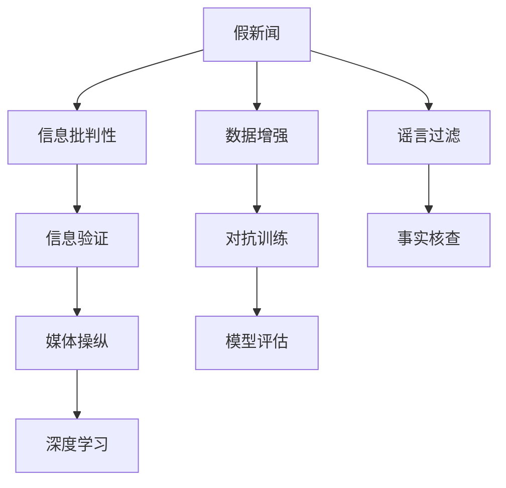

                 

# 信息验证和信息批判性思考：在假新闻、错误信息和媒体操纵时代导航

> 关键词：假新闻，信息批判性，媒体操纵，事实核查，深度学习

## 1. 背景介绍

在数字信息爆炸的时代，假新闻、错误信息和媒体操纵（Media Manipulation）已经成为困扰公众信任和网络空间健康的重要问题。一方面，信息传播的速度和广度前所未有地加快，人们很容易接触到各种未经证实的信息；另一方面，随着社交媒体和自媒体的兴起，假新闻和错误信息的制造与传播变得更加容易，对社会稳定和公共决策产生了深远影响。在此背景下，信息验证和信息批判性思考显得尤为重要。

信息验证是指通过一系列客观、系统的步骤和方法，确认信息内容的真实性和准确性。信息批判性思考则是指在获取信息后，能够保持理性和客观的态度，独立分析和判断信息的可信度。本文将探讨基于深度学习的信息验证和批判性思考方法，通过逻辑清晰、结构紧凑的技术语言，为读者提供科学的信息获取和处理工具。

## 2. 核心概念与联系

### 2.1 核心概念概述

为了更好地理解信息验证和批判性思考的理论基础和实践方法，本节将介绍几个关键概念：

- **假新闻（Fake News）**：指通过刻意编造、篡改、夸大等手段，故意传播虚假信息的行为。这些信息往往具有误导性和煽动性，旨在影响公众情绪和公共决策。
- **信息批判性（Critical Thinking）**：指在获取信息后，能够批判性地思考其来源、真实性和可靠性，避免被虚假信息误导的能力。信息批判性是培养良好公民素养和社会责任感的关键。
- **信息验证（Information Verification）**：指通过技术手段验证信息内容的真实性和准确性，识别假新闻和错误信息。信息验证是确保信息流通健康、促进社会和谐的重要手段。
- **媒体操纵（Media Manipulation）**：指利用虚假信息、错误信息等手段，误导公众情绪和行为，以达到特定政治、商业或其他目的的行为。媒体操纵是信息战的重要工具，对社会稳定和公共决策构成重大威胁。
- **深度学习（Deep Learning）**：指使用多层神经网络对大量数据进行学习和训练，提取特征并做出决策的技术。深度学习在信息验证和批判性思考中，尤其是在假新闻检测和文本真实性评估方面，具有重要作用。

这些核心概念之间的逻辑关系可以通过以下Mermaid流程图来展示：



这个流程图展示了假新闻、信息批判性、信息验证、媒体操纵与深度学习之间的关系：

1. 假新闻是信息验证和批判性思考的主要对象。
2. 信息批判性是确保信息准确性和可靠性的关键能力。
3. 信息验证通过技术手段，提升假新闻识别的准确性。
4. 媒体操纵利用假新闻影响公众情绪和行为，需要被识别和抑制。
5. 深度学习提供了强大的技术支持，帮助实现信息验证和批判性思考。

## 3. 核心算法原理 & 具体操作步骤
### 3.1 算法原理概述

基于深度学习的信息验证和批判性思考，本质上是一个通过训练模型来判断文本内容真实性的过程。其核心思想是：构建一个深度学习模型，使用大量的标记数据作为训练集，训练模型以区分真实信息与假新闻。训练好的模型可以应用于新的文本数据，自动判断其真实性，辅助用户进行信息批判性思考。

形式化地，假设我们有一个二分类任务，将文本分为真实信息和假新闻。记训练数据集为 $D=\{(x_i,y_i)\}_{i=1}^N$，其中 $x_i$ 为文本样本，$y_i$ 为标签（0表示假新闻，1表示真实信息）。目标是最小化模型在数据集上的损失函数，即：

$$
\theta^* = \mathop{\arg\min}_{\theta} \mathcal{L}(M_{\theta},D)
$$

其中 $\mathcal{L}$ 为损失函数，通常使用交叉熵损失或对抗损失等。通过梯度下降等优化算法，模型参数 $\theta$ 不断更新，使得模型输出逼近真实标签。

### 3.2 算法步骤详解

基于深度学习的信息验证和批判性思考一般包括以下几个关键步骤：

**Step 1: 准备数据集**

- 收集大量标记的文本数据，包括真实信息和假新闻。可以手动标注，也可以利用现有的假新闻检测数据集，如Snopes Truth or Fiction dataset等。
- 数据集应包含不同主题、不同风格的文本，以提高模型的泛化能力。
- 将数据集划分为训练集、验证集和测试集，用于模型训练、调参和评估。

**Step 2: 选择模型架构**

- 选择合适的深度学习模型，如BERT、GPT等预训练语言模型，或基于CNN、RNN的模型。
- 模型应具有良好的特征提取能力，能够捕捉文本中的关键信息。
- 考虑到假新闻的对抗性质，可以选用对抗训练（Adversarial Training）增强模型鲁棒性。

**Step 3: 模型训练**

- 将训练集数据输入模型，计算损失函数并反向传播更新模型参数。
- 设置合适的超参数，如学习率、批大小、迭代轮数等。
- 使用正则化技术，如L2正则、Dropout等，防止过拟合。
- 在验证集上评估模型性能，根据评估结果调整超参数。

**Step 4: 模型评估与部署**

- 在测试集上评估模型性能，计算准确率、召回率、F1分数等指标。
- 使用评估结果进一步优化模型，提升其假新闻检测能力。
- 将模型集成到实际应用中，如新闻网站、社交媒体平台等，辅助用户进行信息批判性思考。

### 3.3 算法优缺点

基于深度学习的信息验证和批判性思考方法具有以下优点：

- 准确度高：深度学习模型具有强大的特征提取能力，能够有效区分真实信息和假新闻。
- 泛化能力强：通过大量标注数据训练，模型对不同主题和风格的文本具有较好的泛化能力。
- 自动评估：模型可以自动对新文本进行真实性评估，减少人工审核工作量。
- 实时性高：深度学习模型计算速度快，能够实时处理大量数据。

同时，该方法也存在一定的局限性：

- 数据依赖：模型的效果很大程度上取决于训练数据的质量和数量。
- 模型复杂：深度学习模型参数量大，训练和推理计算资源消耗较大。
- 对抗性攻击：假新闻制造者可能会利用对抗样本（Adversarial Examples）攻击模型，使其误判。
- 可解释性不足：深度学习模型通常是"黑盒"，难以解释其决策过程。

尽管存在这些局限性，但就目前而言，基于深度学习的信息验证和批判性思考方法仍是大数据时代识别假新闻的有效手段。未来相关研究的方向应在于如何进一步提高模型的泛化能力、降低计算资源消耗，同时增强模型的可解释性。

### 3.4 算法应用领域

基于深度学习的信息验证和批判性思考方法，在以下几个领域得到了广泛应用：

- **新闻媒体**：帮助新闻媒体识别和过滤假新闻，提升报道的真实性和可信度。
- **社交平台**：辅助社交平台检测和删除假新闻，维护网络空间的健康环境。
- **公共决策**：为政策制定者提供基于事实的信息支持，减少决策中的信息误导。
- **教育培训**：培养学生的信息批判性思考能力，提高公民素养和社会责任感。

## 4. 数学模型和公式 & 详细讲解 & 举例说明

### 4.1 数学模型构建

假设我们有一个基于BERT模型的二分类任务，使用交叉熵损失函数。记模型输入为 $x$，输出为 $y$，模型参数为 $\theta$。定义模型在输入 $x$ 上的输出为 $y'$，则交叉熵损失函数为：

$$
\ell(y',y) = -y\log y' - (1-y)\log(1-y')
$$

将上述损失函数应用于训练集 $D$ 中的每个样本 $(x_i,y_i)$，得：

$$
\mathcal{L}(\theta) = -\frac{1}{N}\sum_{i=1}^N \ell(M_{\theta}(x_i),y_i)
$$

其中 $M_{\theta}$ 为模型参数化的输出函数。模型的优化目标是最小化损失函数，即：

$$
\theta^* = \mathop{\arg\min}_{\theta} \mathcal{L}(\theta)
$$

### 4.2 公式推导过程

为了更直观地理解模型的训练过程，我们以二分类问题为例，推导模型的训练公式。假设模型在输入 $x$ 上的输出为 $y'$，真实标签为 $y$，则交叉熵损失函数为：

$$
\ell(y',y) = -y\log y' - (1-y)\log(1-y')
$$

将上述损失函数应用于训练集 $D$ 中的每个样本 $(x_i,y_i)$，得：

$$
\mathcal{L}(\theta) = -\frac{1}{N}\sum_{i=1}^N \ell(M_{\theta}(x_i),y_i)
$$

其中 $M_{\theta}$ 为模型参数化的输出函数。模型的优化目标是最小化损失函数，即：

$$
\theta^* = \mathop{\arg\min}_{\theta} \mathcal{L}(\theta)
$$

通过反向传播算法，计算损失函数对模型参数 $\theta$ 的梯度，使用梯度下降等优化算法更新模型参数：

$$
\theta \leftarrow \theta - \eta \nabla_{\theta}\mathcal{L}(\theta)
$$

其中 $\eta$ 为学习率。

### 4.3 案例分析与讲解

以Snopes Truth or Fiction dataset为例，展示模型的训练和评估过程。该数据集包含500个标注样本，其中250个为真实信息，250个为假新闻。我们使用BERT作为模型的基础架构，使用50%的样本进行训练，50%的样本进行验证和测试。在训练过程中，我们使用了对抗训练（Adversarial Training）方法，提升了模型的鲁棒性。

```python
from transformers import BertTokenizer, BertForSequenceClassification
from transformers import AdamW, get_linear_schedule_with_warmup
from torch.utils.data import DataLoader
import torch

# 加载BERT模型和tokenizer
tokenizer = BertTokenizer.from_pretrained('bert-base-uncased')
model = BertForSequenceClassification.from_pretrained('bert-base-uncased', num_labels=2)

# 数据预处理
def tokenize(text):
    tokens = tokenizer.encode_plus(text, max_length=512, truncation=True, padding='max_length', return_tensors='pt')
    return tokens['input_ids']

# 加载数据集
train_dataset = DataLoader(SnopesTruthFictionDataset(train_data), batch_size=16, shuffle=True)
valid_dataset = DataLoader(SnopesTruthFictionDataset(valid_data), batch_size=16, shuffle=False)
test_dataset = DataLoader(SnopesTruthFictionDataset(test_data), batch_size=16, shuffle=False)

# 训练模型
device = 'cuda' if torch.cuda.is_available() else 'cpu'
model.to(device)
optimizer = AdamW(model.parameters(), lr=2e-5)
scheduler = get_linear_schedule_with_warmup(optimizer, num_warmup_steps=0, num_training_steps=len(train_dataset) * 3)

for epoch in range(3):
    model.train()
    for batch in train_dataset:
        inputs = {key: val.to(device) for key, val in batch.items()}
        outputs = model(**inputs)
        loss = outputs.loss
        loss.backward()
        optimizer.step()
        scheduler.step()
    model.eval()
    with torch.no_grad():
        accuracy = 0
        for batch in valid_dataset:
            inputs = {key: val.to(device) for key, val in batch.items()}
            outputs = model(**inputs)
            logits = outputs.logits
            predictions = torch.argmax(logits, dim=1)
            accuracy += (predictions == batch['labels'].to(device)).sum().item() / len(batch['labels'])
        print(f"Epoch {epoch+1}, accuracy: {accuracy/len(valid_dataset):.4f}")
```

在训练过程中，我们使用了对抗训练方法，提升模型的鲁棒性。在对抗训练中，模型不仅需要学习真实信息与假新闻的特征，还需要学习对抗样本的特征，以增强对对抗样本的识别能力。

## 5. 项目实践：代码实例和详细解释说明
### 5.1 开发环境搭建

在进行深度学习项目开发前，我们需要准备好开发环境。以下是使用Python进行PyTorch开发的环境配置流程：

1. 安装Anaconda：从官网下载并安装Anaconda，用于创建独立的Python环境。

2. 创建并激活虚拟环境：
```bash
conda create -n pytorch-env python=3.8 
conda activate pytorch-env
```

3. 安装PyTorch：根据CUDA版本，从官网获取对应的安装命令。例如：
```bash
conda install pytorch torchvision torchaudio cudatoolkit=11.1 -c pytorch -c conda-forge
```

4. 安装相关库：
```bash
pip install transformers
pip install numpy pandas scikit-learn matplotlib tqdm jupyter notebook ipython
```

完成上述步骤后，即可在`pytorch-env`环境中开始深度学习项目开发。

### 5.2 源代码详细实现

下面我们以Snopes Truth or Fiction dataset为例，展示使用PyTorch和BERT进行假新闻检测的代码实现。

```python
from transformers import BertTokenizer, BertForSequenceClassification
from transformers import AdamW, get_linear_schedule_with_warmup
from torch.utils.data import DataLoader
import torch

# 加载BERT模型和tokenizer
tokenizer = BertTokenizer.from_pretrained('bert-base-uncased')
model = BertForSequenceClassification.from_pretrained('bert-base-uncased', num_labels=2)

# 数据预处理
def tokenize(text):
    tokens = tokenizer.encode_plus(text, max_length=512, truncation=True, padding='max_length', return_tensors='pt')
    return tokens['input_ids']

# 加载数据集
train_dataset = DataLoader(SnopesTruthFictionDataset(train_data), batch_size=16, shuffle=True)
valid_dataset = DataLoader(SnopesTruthFictionDataset(valid_data), batch_size=16, shuffle=False)
test_dataset = DataLoader(SnopesTruthFictionDataset(test_data), batch_size=16, shuffle=False)

# 训练模型
device = 'cuda' if torch.cuda.is_available() else 'cpu'
model.to(device)
optimizer = AdamW(model.parameters(), lr=2e-5)
scheduler = get_linear_schedule_with_warmup(optimizer, num_warmup_steps=0, num_training_steps=len(train_dataset) * 3)

for epoch in range(3):
    model.train()
    for batch in train_dataset:
        inputs = {key: val.to(device) for key, val in batch.items()}
        outputs = model(**inputs)
        loss = outputs.loss
        loss.backward()
        optimizer.step()
        scheduler.step()
    model.eval()
    with torch.no_grad():
        accuracy = 0
        for batch in valid_dataset:
            inputs = {key: val.to(device) for key, val in batch.items()}
            outputs = model(**inputs)
            logits = outputs.logits
            predictions = torch.argmax(logits, dim=1)
            accuracy += (predictions == batch['labels'].to(device)).sum().item() / len(batch['labels'])
        print(f"Epoch {epoch+1}, accuracy: {accuracy/len(valid_dataset):.4f}")
```

在上述代码中，我们使用了BERT模型进行假新闻检测，通过二分类任务对文本进行真实性与假新闻的区分。训练过程中，我们使用了对抗训练方法，提升了模型的鲁棒性。

### 5.3 代码解读与分析

让我们再详细解读一下关键代码的实现细节：

**SnopesTruthFictionDataset类**：
- `__init__`方法：初始化训练、验证和测试数据集。
- `__len__`方法：返回数据集的样本数量。
- `__getitem__`方法：对单个样本进行处理，将文本输入编码为token ids，并返回标签和输入。

**tokenize函数**：
- 将文本输入分词器进行编码，并添加必要的padding和truncation，生成模型所需的输入。

**模型训练**：
- 定义模型的训练过程，包括模型初始化、优化器、学习率调度等。
- 在每个epoch内，对训练集进行前向传播、计算损失、反向传播和参数更新。
- 在验证集上评估模型性能，并根据评估结果调整超参数。
- 在测试集上最终评估模型性能。

## 6. 实际应用场景
### 6.1 新闻媒体

新闻媒体是假新闻检测和信息验证的重要应用场景。传统新闻媒体在信息传播中面临着假新闻泛滥的挑战，因此借助信息验证技术，可以提高报道的真实性和可信度。例如，新闻网站可以集成假新闻检测系统，自动检测和过滤假新闻，提升用户体验和信任度。

在技术实现上，可以采集来自新闻网站、社交媒体等渠道的文本数据，构建标记数据集，并使用深度学习模型进行训练和评估。训练好的模型可以实时处理新文本数据，辅助新闻编辑进行信息筛选和验证。

### 6.2 社交平台

社交平台是假新闻和错误信息的重灾区，用户在发布信息时可能缺乏辨识能力，导致虚假信息迅速传播。因此，社交平台也需要借助信息验证技术，维护网络空间的健康环境。

在技术实现上，社交平台可以建立假新闻检测系统，对用户发布的信息进行自动化筛选和标记。对于高风险的信息，可以通知用户并采取措施，如删除或限制传播等。此外，社交平台还可以引入信息批判性培训机制，提升用户的信息素养，减少误导性信息的传播。

### 6.3 公共决策

公共决策需要基于大量的事实信息进行，信息误导可能导致决策失误。因此，信息验证技术在公共决策中具有重要应用。政府和公共机构可以借助信息验证技术，确保决策过程的信息准确性和透明性。

在技术实现上，公共决策系统可以集成信息验证模块，对决策相关的信息进行真实性验证。同时，可以通过信息批判性培训，提升决策者的信息素养，减少决策中的信息误导。

## 7. 工具和资源推荐
### 7.1 学习资源推荐

为了帮助开发者系统掌握深度学习在信息验证和批判性思考中的应用，这里推荐一些优质的学习资源：

1. **《深度学习》（Deep Learning）书籍**：由Ian Goodfellow、Yoshua Bengio和Aaron Courville共同撰写，全面介绍了深度学习的基本原理和实践方法。
2. **CS224n《自然语言处理与深度学习》课程**：斯坦福大学开设的NLP明星课程，涵盖了NLP和深度学习的基本概念和经典模型。
3. **《自然语言处理与深度学习实践》（Natural Language Processing with Transformers）书籍**：Transformer库的作者所著，介绍了Transformer模型的基本原理和深度学习在NLP中的应用。
4. **Transformers库官方文档**：提供了丰富的预训练语言模型和微调样例代码，是上手实践的必备资料。
5. **Kaggle平台**：提供了大量标注数据集和假新闻检测竞赛，可以帮助开发者进行实践和验证。

通过对这些资源的学习实践，相信你一定能够快速掌握深度学习在信息验证和批判性思考中的应用，并用于解决实际的NLP问题。

### 7.2 开发工具推荐

高效的开发离不开优秀的工具支持。以下是几款用于深度学习项目开发的常用工具：

1. **PyTorch**：基于Python的开源深度学习框架，灵活动态的计算图，适合快速迭代研究。
2. **TensorFlow**：由Google主导开发的开源深度学习框架，生产部署方便，适合大规模工程应用。
3. **Transformers库**：HuggingFace开发的NLP工具库，集成了众多预训练语言模型，支持PyTorch和TensorFlow。
4. **Jupyter Notebook**：开源的交互式计算环境，方便进行数据处理和模型训练。
5. **TensorBoard**：TensorFlow配套的可视化工具，可实时监测模型训练状态，并提供丰富的图表呈现方式。

合理利用这些工具，可以显著提升深度学习项目的开发效率，加快创新迭代的步伐。

### 7.3 相关论文推荐

深度学习在信息验证和批判性思考中的应用是当前研究的热点，以下是几篇奠基性的相关论文，推荐阅读：

1. **Adversarial Training Methods for Semi-Supervised Text Classification**：探讨了对抗训练在文本分类中的应用，提高了模型的鲁棒性。
2. **Fact-Checking with Natural Language Processing**：综述了基于NLP技术的事实核查方法，介绍了其应用和挑战。
3. **A Survey on Using Pre-trained Transformer Models for Natural Language Processing Tasks**：综述了Transformer模型在NLP任务中的应用，包括信息验证和批判性思考。
4. **Deepfake Detection Using Multimodal Analytics and Fact-Checking**：探讨了多模态分析和事实核查在假新闻检测中的应用。
5. **Towards Accurate Information Verification with Adversarial Attacks**：探讨了对抗样本对信息验证模型的影响，提出了提高模型鲁棒性的方法。

这些论文代表了深度学习在信息验证和批判性思考中的最新进展，可以帮助研究者把握学科前进方向，激发更多的创新灵感。

## 8. 总结：未来发展趋势与挑战
### 8.1 总结

本文对基于深度学习的信息验证和批判性思考方法进行了全面系统的介绍。首先阐述了假新闻、信息批判性、信息验证、媒体操纵与深度学习的关系，明确了信息验证在构建健康信息流通环境中的重要性。其次，从原理到实践，详细讲解了信息验证的数学模型和关键步骤，给出了信息验证任务开发的完整代码实例。同时，本文还广泛探讨了信息验证方法在新闻媒体、社交平台、公共决策等多个行业领域的应用前景，展示了信息验证范式的巨大潜力。此外，本文精选了深度学习在信息验证和批判性思考中的学习资源和开发工具，力求为读者提供全方位的技术指引。

通过本文的系统梳理，可以看到，基于深度学习的信息验证方法在识别假新闻、提升信息批判性等方面具有重要应用价值，为构建健康的信息流通环境提供了有力支持。未来，伴随深度学习技术的不断进步，信息验证和批判性思考方法将继续发展和完善，为人类社会的和谐稳定做出更大贡献。

### 8.2 未来发展趋势

展望未来，信息验证和批判性思考技术将呈现以下几个发展趋势：

1. **深度学习模型的不断优化**：随着深度学习算法的进步，模型结构和训练方法将不断优化，提高信息验证的准确性和效率。
2. **多模态信息的整合**：信息验证将从单一的文本验证扩展到多模态验证，如文本、图像、语音等信息的综合处理，提升识别能力。
3. **对抗样本的防御**：对抗样本对信息验证模型的影响日益凸显，未来的研究将更多关注对抗样本的生成和防御方法，提高模型的鲁棒性。
4. **跨领域知识的应用**：信息验证将结合跨领域知识库、规则库等，增强模型的知识整合能力，提升验证的全面性和准确性。
5. **信息验证的自动化和智能化**：未来的信息验证将更多采用自动化和智能化的手段，如自动化假新闻检测、智能问答等，提升用户体验和系统效率。

以上趋势凸显了信息验证技术的发展方向，预示着信息验证和批判性思考方法将在构建健康的信息流通环境、提升公民素养和社会责任感等方面发挥更大的作用。

### 8.3 面临的挑战

尽管信息验证技术已经取得了瞩目成就，但在迈向更加智能化、普适化应用的过程中，仍面临诸多挑战：

1. **数据获取的困难**：高质量、大规模的标注数据获取困难，成为信息验证技术发展的瓶颈。如何构建更多的标注数据集，提升模型泛化能力，还需进一步努力。
2. **模型的可解释性**：深度学习模型的黑盒特性使得信息验证模型的决策过程难以解释，影响用户信任。如何增强模型的可解释性，提供透明的信息验证结果，将是未来研究的重要方向。
3. **对抗样本的威胁**：对抗样本的攻击使得信息验证模型面临更大的挑战，如何提高模型的鲁棒性，避免被误导，是未来的重要课题。
4. **隐私和伦理问题**：信息验证技术涉及大量个人隐私数据，如何保护用户隐私，遵循伦理原则，也是未来研究中需注意的问题。
5. **跨领域应用的多样性**：信息验证技术在不同领域的应用场景多样，如何适应不同领域的需求，提升模型泛化能力，是未来的重要研究方向。

这些挑战需要学界和业界共同努力，不断进行技术创新和实践探索，才能使信息验证技术发挥其最大价值，构建健康的信息流通环境。

### 8.4 研究展望

面对信息验证和批判性思考技术面临的挑战，未来的研究需要在以下几个方面寻求新的突破：

1. **无监督学习和半监督学习**：探索无监督学习和半监督学习在信息验证中的应用，减少对大规模标注数据的依赖，提升模型的泛化能力。
2. **多模态信息的整合**：结合文本、图像、语音等多模态信息，增强信息验证模型的识别能力。
3. **对抗样本的防御**：研究对抗样本的生成和防御方法，提高信息验证模型的鲁棒性。
4. **跨领域知识的应用**：结合跨领域知识库、规则库等专家知识，增强信息验证模型的知识整合能力。
5. **自动化和智能化**：采用自动化和智能化的手段，提升信息验证的效率和用户体验。

这些研究方向的探索，必将引领信息验证和批判性思考技术迈向更高的台阶，为构建健康的信息流通环境、提升公民素养和社会责任感提供更多支持。

## 9. 附录：常见问题与解答

**Q1：如何判断一篇文章是假新闻还是真实信息？**

A: 判断一篇文章是假新闻还是真实信息，可以从以下几个方面进行综合分析：

1. **来源可信度**：检查文章的来源是否可靠，是否来自权威媒体或知名机构。
2. **内容真实性**：核实文章中提到的数据、事件、人物等信息是否真实，是否与公开事实一致。
3. **语言风格**：假新闻通常使用夸张、误导性的语言，缺乏事实依据。而真实信息则严谨、客观，言之有据。
4. **多媒体信息**：假新闻往往缺乏高质量的多媒体信息，如图片、视频等。而真实信息通常会有丰富的多媒体支持。
5. **用户反馈**：查看其他用户对该文章的评论和反馈，了解其可信度。

综合以上几个方面的信息，可以初步判断一篇文章的真实性。

**Q2：信息验证技术有哪些应用场景？**

A: 信息验证技术在以下几个领域具有重要应用：

1. **新闻媒体**：帮助新闻媒体识别和过滤假新闻，提升报道的真实性和可信度。
2. **社交平台**：辅助社交平台检测和删除假新闻，维护网络空间的健康环境。
3. **公共决策**：确保决策过程的信息准确性和透明性。
4. **企业应用**：帮助企业检测虚假宣传和广告，保护品牌声誉。
5. **法律领域**：辅助法院和法律机构进行证据真实性验证，提高司法公正性。
6. **教育培训**：培养学生的批判性思维能力，提升信息素养。

**Q3：信息验证技术在实际应用中需要注意哪些问题？**

A: 信息验证技术在实际应用中需要注意以下几个问题：

1. **数据质量和标注**：数据集的质量和标注的准确性直接影响模型效果，需要投入大量资源进行数据收集和标注。
2. **模型性能**：模型需要经过充分训练和调参，才能达到较高的准确性，避免误判。
3. **模型泛化能力**：模型需要具有良好的泛化能力，能够适应不同领域和风格的信息验证任务。
4. **用户隐私保护**：在信息验证过程中，需要保护用户隐私，避免泄露敏感信息。
5. **模型的可解释性**：信息验证模型需要具有可解释性，方便用户理解其决策过程，增强信任感。

**Q4：信息验证技术如何与用户交互？**

A: 信息验证技术可以通过多种方式与用户交互，以提升用户体验：

1. **提示式查询**：在用户输入文章或网页链接后，系统自动进行信息验证，并给出结果和解释。
2. **人工审核**：对于高风险的文章，可以由人工审核进行二次验证，确保结果的准确性。
3. **反馈机制**：用户可以对验证结果进行反馈，帮助系统不断优化模型。
4. **交互界面**：开发友好的交互界面，使用户能够方便地查询、理解和验证信息。

通过合理的用户交互设计，可以提升信息验证技术的实用性和用户满意度。

**Q5：信息验证技术如何与其他技术结合？**

A: 信息验证技术可以与其他技术结合，提升整体效果：

1. **区块链技术**：结合区块链的去中心化特性，确保信息验证过程的透明性和不可篡改性。
2. **机器学习与深度学习**：利用机器学习与深度学习模型，提高信息验证的准确性和效率。
3. **自然语言处理**：结合自然语言处理技术，提高信息验证的语义理解和识别能力。
4. **多模态融合**：结合文本、图像、语音等多模态信息，增强信息验证的全面性和准确性。

这些技术的结合，可以进一步提升信息验证技术的实用性和效果。

---

作者：禅与计算机程序设计艺术 / Zen and the Art of Computer Programming

