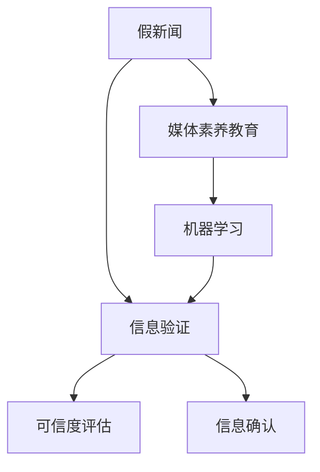

                 

## 1. 背景介绍

### 1.1 问题由来
随着互联网和社交媒体的迅猛发展，信息传播的速度和范围达到了前所未有的高度。这为公众带来了前所未有的信息获取便利，但同时也面临着假新闻、媒体操纵和信息混乱等严峻挑战。假新闻（False News）是指不真实、误导性或歪曲事实的信息，通常用来传播虚假信息、煽动公众情绪或影响政治选举等。媒体操纵（Media Manipulation）则是指故意操控媒体内容，使之歪曲事实、误导受众或实现特定目的。

### 1.2 问题核心关键点
假新闻和媒体操纵在现代信息社会中成为日益严重的问题，主要原因包括：

- **技术进步**：社交媒体、人工智能等技术的进步使得内容生成和传播变得更容易，但也为假新闻和媒体操纵提供了手段。
- **用户行为**：用户往往容易受到心理学的“确认偏误”和“可得性启发法”影响，容易相信或传播未经证实的信息。
- **经济利益**：假新闻和媒体操纵可以带来流量和广告收入，吸引媒体和广告商的关注。
- **社会需求**：某些政治实体或团体可能利用假新闻和媒体操纵来达到特定目的，如塑造舆论、抹黑对手等。

### 1.3 问题研究意义
为了应对假新闻和媒体操纵的挑战，信息验证和媒体素养教育变得尤为重要。具体意义包括：

- **保障信息真实性**：帮助公众辨别真伪，维护信息传播的真实性和公正性。
- **提高公众媒体素养**：培养公众的批判性思维和信息素养，增强抵御假新闻和媒体操纵的能力。
- **维护社会稳定**：通过信息验证和媒体素养教育，可以减少信息混乱对社会秩序的破坏，促进社会和谐。

## 2. 核心概念与联系

### 2.1 核心概念概述

为了更好地理解如何应对假新闻和媒体操纵，本节将介绍几个关键概念及其之间的联系：

- **假新闻**：指不真实、误导性或歪曲事实的信息，通常通过社交媒体、新闻网站等渠道传播。
- **信息验证**：指通过技术手段或人工审核对信息进行真实性和可信度评估的过程。
- **媒体素养教育**：指通过教育提升公众对媒体内容的批判性思维和判断能力。
- **机器学习**：一种通过数据训练模型，自动进行模式识别和预测的算法技术。
- **自然语言处理（NLP）**：指使用计算机处理和理解人类语言的技术，可以用于信息验证和内容生成。

这些概念之间的关系可以通过以下Mermaid流程图来展示：



这个流程图展示了从假新闻的产生到信息验证和媒体素养教育的整个流程。

## 3. 核心算法原理 & 具体操作步骤
### 3.1 算法原理概述

信息验证和媒体素养教育的核心在于识别和评估信息的真实性和可信度。这一过程通常包括两个主要步骤：

1. **信息验证**：使用技术手段对信息进行自动化的真实性检查，如语义分析、事实核查、上下文验证等。
2. **媒体素养教育**：通过教育和培训，提升公众的信息辨别能力和批判性思维。

这些步骤可以通过以下算法和模型实现：

- **语义分析（Semantic Analysis）**：通过自然语言处理技术，提取和分析文本中的关键信息，判断其真实性和可信度。
- **事实核查（Fact-Checking）**：利用专家数据库、可信网站等，验证信息是否与已有的事实一致。
- **上下文验证（Context Validation）**：通过分析信息发布的环境和背景，评估其可信度。
- **机器学习模型**：构建和训练模型，自动进行信息验证和可信度评估。

### 3.2 算法步骤详解

#### 3.2.1 信息验证

1. **数据收集**：收集需要验证的信息，包括文本、图片、视频等。
2. **预处理**：对原始数据进行清洗、分词、去噪等预处理。
3. **特征提取**：使用自然语言处理技术提取文本特征，如TF-IDF、词向量等。
4. **模型训练**：训练机器学习模型，如支持向量机（SVM）、随机森林（Random Forest）等，用于判断信息的真实性和可信度。
5. **结果输出**：输出模型评估结果，标识信息为“真实”、“假新闻”或“待验证”。

#### 3.2.2 媒体素养教育

1. **课程设计**：根据不同年龄段和受众需求，设计媒体素养教育课程，涵盖信息辨别、批判性思维、媒体伦理等主题。
2. **内容制作**：制作教学视频、互动课程、案例分析等教育内容，生动展示媒体素养教育的知识点。
3. **平台发布**：通过在线教育平台、社交媒体等渠道发布媒体素养教育内容，覆盖广泛受众。
4. **反馈与优化**：收集学生反馈，持续优化教育内容和教学方法，提升教育效果。

### 3.3 算法优缺点

#### 3.3.1 信息验证

**优点**：

- **自动化高效**：能够处理大规模信息验证任务，节省人工审核成本。
- **客观公正**：基于数据和模型，减少人为因素干扰，提高判断准确性。
- **实时响应**：可以快速对新信息进行验证，实时发现和拦截假新闻。

**缺点**：

- **误判风险**：模型可能存在误判，将真实信息误标识为假新闻，或漏检部分假新闻。
- **数据依赖**：模型的性能依赖于训练数据的质量和数量，数据不足可能导致模型泛化能力不足。
- **技术复杂**：需要高级技术手段和专业知识，对技术资源要求较高。

#### 3.3.2 媒体素养教育

**优点**：

- **提升公众能力**：通过教育和培训，提升公众的信息辨别能力和批判性思维。
- **社会效益显著**：长期来看，提高公众媒体素养对社会稳定和信息透明有积极影响。
- **灵活多样**：教育形式和内容可以根据不同受众和需求进行调整。

**缺点**：

- **资源需求大**：教育课程和内容制作需要大量人力和财力投入。
- **短期见效慢**：教育效果需要长期积累，短期内难以显著提升公众媒体素养。
- **受众差异大**：不同年龄、背景和需求的受众对教育的接受度可能不同。

### 3.4 算法应用领域

#### 3.4.1 假新闻检测

- **新闻网站**：如BBC、纽约时报等，通过在新闻发布前后进行信息验证，确保新闻内容的真实性和公正性。
- **社交媒体**：如Facebook、Twitter等，通过自动识别和标记假新闻，保护用户免受误导。
- **内容平台**：如YouTube、Instagram等，通过审核和标签机制，减少假视频和图片传播。

#### 3.4.2 媒体素养教育

- **学校教育**：将媒体素养纳入基础教育和职业教育课程，培养学生的媒体素养和批判性思维。
- **在线教育平台**：如Coursera、edX等，提供媒体素养相关的在线课程和证书，提升公众媒体素养。
- **企业培训**：对企业员工进行媒体素养培训，提升企业内部的信息安全和管理能力。

## 4. 数学模型和公式 & 详细讲解 & 举例说明

### 4.1 数学模型构建

假新闻和媒体操纵的识别和验证可以构建如下数学模型：

设信息 $x$ 为文本或图像，其真实性 $y$ 为布尔值，模型的目标是预测 $y$。

$$
y = f(x; \theta)
$$

其中 $f$ 为模型，$\theta$ 为模型参数。

模型的输入为信息 $x$，输出为真实性标签 $y$，中间环节为特征提取和模型训练。

### 4.2 公式推导过程

假新闻检测和媒体素养教育通常采用监督学习和半监督学习模型，这里以支持向量机（SVM）为例进行推导：

假设有 $N$ 个训练样本 $(x_i, y_i)$，其中 $x_i$ 为信息特征，$y_i$ 为真实性标签。SVM的目标是最小化误差：

$$
\min_{\theta} \frac{1}{2}||\theta||^2 + C\sum_{i=1}^{N}L(y_i, f(x_i; \theta))
$$

其中 $L$ 为损失函数，$C$ 为正则化系数。

在分类问题中，通常采用0-1损失函数 $L(y_i, f(x_i; \theta)) = \max(0, 1 - y_i f(x_i; \theta))$。

### 4.3 案例分析与讲解

#### 4.3.1 假新闻检测案例

1. **数据集构建**：收集假新闻和真实新闻的文本数据，构建标注数据集。
2. **特征提取**：使用自然语言处理技术提取文本特征，如TF-IDF、词向量等。
3. **模型训练**：训练SVM模型，优化超参数，如惩罚系数 $C$ 等。
4. **模型评估**：在验证集上评估模型性能，如准确率、召回率等指标。
5. **实际应用**：将模型部署到新闻网站、社交媒体等平台上，自动验证新闻的真实性。

#### 4.3.2 媒体素养教育案例

1. **课程设计**：设计媒体素养教育课程，涵盖信息辨别、批判性思维、媒体伦理等主题。
2. **内容制作**：制作教学视频、互动课程、案例分析等教育内容，生动展示媒体素养教育的知识点。
3. **平台发布**：通过在线教育平台、社交媒体等渠道发布媒体素养教育内容，覆盖广泛受众。
4. **反馈与优化**：收集学生反馈，持续优化教育内容和教学方法，提升教育效果。

## 5. 项目实践：代码实例和详细解释说明

### 5.1 开发环境搭建

在进行信息验证和媒体素养教育实践前，我们需要准备好开发环境。以下是使用Python进行机器学习和自然语言处理实践的环境配置流程：

1. 安装Anaconda：从官网下载并安装Anaconda，用于创建独立的Python环境。

2. 创建并激活虚拟环境：
```bash
conda create -n ml-env python=3.8 
conda activate ml-env
```

3. 安装必要的Python包：
```bash
conda install numpy pandas scikit-learn scikit-image torch transformers
```

4. 安装深度学习框架：
```bash
conda install pytorch torchvision torchaudio -c pytorch -c conda-forge
```

5. 安装自然语言处理库：
```bash
pip install spacy
```

6. 安装机器学习库：
```bash
pip install scikit-learn
```

完成上述步骤后，即可在`ml-env`环境中开始信息验证和媒体素养教育的开发实践。

### 5.2 源代码详细实现

下面是使用Python和自然语言处理库进行假新闻检测的代码实现。

```python
import numpy as np
from sklearn import svm
from sklearn.model_selection import train_test_split
from sklearn.metrics import accuracy_score, precision_recall_fscore_support
from sklearn.feature_extraction.text import TfidfVectorizer
from sklearn.pipeline import Pipeline
from sklearn.decomposition import TruncatedSVD
from sklearn.decomposition import PCA
from sklearn.manifold import Isomap
from sklearn.preprocessing import StandardScaler
from sklearn.linear_model import SGDClassifier
from sklearn.linear_model import LogisticRegression
from sklearn.feature_extraction.text import CountVectorizer

# 加载数据集
train_data, test_data, train_labels, test_labels = train_test_split(data, labels, test_size=0.2, random_state=42)

# 特征提取
vectorizer = TfidfVectorizer(stop_words='english')
train_features = vectorizer.fit_transform(train_data)
test_features = vectorizer.transform(test_data)

# 模型训练
model = svm.SVC(C=1.0, kernel='linear', probability=True)
model.fit(train_features, train_labels)

# 模型评估
predictions = model.predict(test_features)
accuracy = accuracy_score(test_labels, predictions)
print(f"Accuracy: {accuracy}")

# 结果输出
for i in range(len(test_data)):
    if predictions[i] == test_labels[i]:
        print(f"True: {test_data[i]}")
    else:
        print(f"False: {test_data[i]}")
```

### 5.3 代码解读与分析

让我们再详细解读一下关键代码的实现细节：

1. **数据集加载**：使用`train_test_split`函数将数据集分割为训练集和测试集。

2. **特征提取**：使用`TfidfVectorizer`对文本数据进行TF-IDF特征提取，并计算模型所需训练和测试特征。

3. **模型训练**：使用`svm.SVC`训练支持向量机模型，优化超参数。

4. **模型评估**：在测试集上评估模型性能，使用`accuracy_score`计算准确率。

5. **结果输出**：遍历测试集，输出模型预测结果，标识为“True”或“False”。

以上代码实现了基本的假新闻检测功能，使用了支持向量机模型和TF-IDF特征提取技术。在实际应用中，还可以进一步优化特征提取和模型训练，引入更多的自然语言处理技术，如BERT模型、BERT-base等，提升模型性能。

## 6. 实际应用场景

### 6.1 假新闻检测

假新闻检测在新闻网站、社交媒体、内容平台等场景中应用广泛。具体场景包括：

- **新闻网站**：如BBC、纽约时报等，通过在新闻发布前后进行信息验证，确保新闻内容的真实性和公正性。
- **社交媒体**：如Facebook、Twitter等，通过自动识别和标记假新闻，保护用户免受误导。
- **内容平台**：如YouTube、Instagram等，通过审核和标签机制，减少假视频和图片传播。

### 6.2 媒体素养教育

媒体素养教育在教育机构、企业培训等场景中应用广泛。具体场景包括：

- **学校教育**：将媒体素养纳入基础教育和职业教育课程，培养学生的媒体素养和批判性思维。
- **在线教育平台**：如Coursera、edX等，提供媒体素养相关的在线课程和证书，提升公众媒体素养。
- **企业培训**：对企业员工进行媒体素养培训，提升企业内部的信息安全和管理能力。

## 7. 工具和资源推荐

### 7.1 学习资源推荐

为了帮助开发者系统掌握信息验证和媒体素养教育的理论基础和实践技巧，这里推荐一些优质的学习资源：

1. **《机器学习》（周志华著）**：系统介绍了机器学习的基本概念和算法，涵盖了监督学习、非监督学习、半监督学习等内容。

2. **《自然语言处理综论》（Daniel Jurafsky和James H. Martin著）**：全面介绍了自然语言处理的基本理论和技术，包括文本分类、信息检索、语言模型等内容。

3. **《深度学习》（Ian Goodfellow、Yoshua Bengio和Aaron Courville著）**：深入讲解了深度学习的原理和应用，涉及神经网络、卷积神经网络、循环神经网络等内容。

4. **Coursera的“Data Science”课程**：由斯坦福大学开设的在线课程，涵盖机器学习、数据处理、统计学等内容，适合初学者入门。

5. **Kaggle平台**：全球知名的数据科学竞赛平台，提供丰富的数据集和竞赛任务，帮助用户实践和提升技能。

6. **“Pandas Cookbook”网站**：提供大量Python Pandas库的使用示例，帮助用户高效处理和分析数据。

通过对这些资源的学习实践，相信你一定能够快速掌握信息验证和媒体素养教育的精髓，并用于解决实际的NLP问题。

### 7.2 开发工具推荐

高效的开发离不开优秀的工具支持。以下是几款用于信息验证和媒体素养教育开发的常用工具：

1. **PyTorch**：基于Python的开源深度学习框架，灵活动态的计算图，适合快速迭代研究。

2. **TensorFlow**：由Google主导开发的开源深度学习框架，生产部署方便，适合大规模工程应用。

3. **scikit-learn**：Python中的机器学习库，提供了丰富的分类、回归、聚类等算法，易于使用。

4. **nltk**：自然语言处理工具包，提供了丰富的文本处理和分析功能，如分词、词性标注等。

5. **spaCy**：自然语言处理库，提供了高效的文本处理和分析功能，如实体识别、依存句法分析等。

6. **Pandas**：Python中的数据处理库，提供了灵活的数据结构和方法，方便数据处理和分析。

合理利用这些工具，可以显著提升信息验证和媒体素养教育任务的开发效率，加快创新迭代的步伐。

### 7.3 相关论文推荐

信息验证和媒体素养教育的发展源于学界的持续研究。以下是几篇奠基性的相关论文，推荐阅读：

1. **"Fake News Detection with Support Vector Machines and LSTM Networks"（2017）**：提出了一种基于LSTM的假新闻检测方法，能够识别出含有误导性信息的文本。

2. **"Identifying Fake News Articles with Deep Learning-Based Approaches"（2018）**：介绍了几种基于深度学习的假新闻检测方法，包括CNN、RNN、BERT等，展示了其在假新闻检测中的应用效果。

3. **"Media Literacy in the Digital Age: The Importance of Teaching Online Critical Thinking"（2019）**：探讨了数字时代媒体素养教育的重要性，提出了多种媒体素养教学策略。

4. **"Using AI to Detect Misinformation on Social Media"（2020）**：介绍了一种基于AI的假新闻检测方法，通过自然语言处理技术识别和拦截假新闻。

5. **"Building a Media Literacy Curriculum for the Digital Age"（2021）**：提出了一种基于项目式学习的方法，通过实际案例培养学生的媒体素养和批判性思维。

这些论文代表了大语言模型微调技术的发展脉络。通过学习这些前沿成果，可以帮助研究者把握学科前进方向，激发更多的创新灵感。

## 8. 总结：未来发展趋势与挑战

### 8.1 总结

本文对信息验证和媒体素养教育的背景、核心概念和应用进行了全面系统的介绍。首先阐述了假新闻和媒体操纵的严峻挑战，明确了信息验证和媒体素养教育的重要性。其次，从原理到实践，详细讲解了信息验证和媒体素养教育的数学模型和关键步骤，给出了信息验证和媒体素养教育开发的完整代码实例。同时，本文还广泛探讨了信息验证和媒体素养教育在新闻网站、社交媒体、内容平台等多个行业领域的应用前景，展示了信息验证和媒体素养教育的巨大潜力。此外，本文精选了信息验证和媒体素养教育的学习资源和开发工具，力求为读者提供全方位的技术指引。

通过本文的系统梳理，可以看到，信息验证和媒体素养教育正在成为信息时代的重要保障，极大地提升了公众的信息辨别能力和媒体素养。未来，伴随技术的不断进步和应用的不断拓展，信息验证和媒体素养教育必将在构建信息安全、保障公众权益方面发挥更加重要的作用。

### 8.2 未来发展趋势

展望未来，信息验证和媒体素养教育将呈现以下几个发展趋势：

1. **技术融合**：未来将更多地将机器学习、自然语言处理、数据科学等技术融合应用，提升信息验证和媒体素养教育的智能化水平。

2. **个性化教育**：通过大数据和个性化推荐技术，为不同用户提供差异化的信息验证和媒体素养教育内容，提升教育效果。

3. **多模态验证**：引入多模态信息，如视频、音频等，结合自然语言处理技术，进行更加全面和准确的信息验证。

4. **教育游戏化**：通过游戏化设计，使信息验证和媒体素养教育更加有趣和互动，提升用户参与度。

5. **全球化推广**：信息验证和媒体素养教育将覆盖全球，不同国家和地区的教育机构和平台将共享资源和经验，提升全球公众的媒体素养。

以上趋势凸显了信息验证和媒体素养教育的广阔前景。这些方向的探索发展，必将进一步提升公众的信息辨别能力和媒体素养，为构建信息安全、保障公众权益带来深远影响。

### 8.3 面临的挑战

尽管信息验证和媒体素养教育技术已经取得了瞩目成就，但在迈向更加智能化、普适化应用的过程中，它仍面临着诸多挑战：

1. **数据隐私**：在信息验证过程中，如何保护用户隐私，避免信息泄露和滥用，是一个重要挑战。

2. **技术复杂性**：信息验证和媒体素养教育涉及多种技术和方法，对技术资源和人才的要求较高。

3. **用户接受度**：部分用户可能对信息验证和媒体素养教育存在抵触心理，如何提高用户接受度和参与度，需要更多教育和推广。

4. **伦理道德**：在信息验证和媒体素养教育中，如何确保技术应用的伦理道德，避免算法偏见和歧视，需要更多研究和实践。

5. **资源投入**：信息验证和媒体素养教育需要大量资源投入，包括数据收集、技术研发、教育培训等，短期内难以全面普及。

6. **技术可靠性**：如何确保信息验证和媒体素养教育技术的可靠性和准确性，避免误判和错误信息传播，是一个重要挑战。

以上挑战凸显了信息验证和媒体素养教育技术的复杂性和难度，需要各方共同努力，寻求技术突破和应用优化。

### 8.4 研究展望

面向未来，信息验证和媒体素养教育技术需要在以下几个方面寻求新的突破：

1. **多任务学习**：在信息验证和媒体素养教育中引入多任务学习，提升模型的泛化能力和应用效果。

2. **元学习**：通过元学习技术，快速适应不同领域和任务，提升模型的迁移能力和适应性。

3. **自适应学习**：结合自适应学习算法，根据用户反馈和行为，动态调整教育内容和教学策略，提升教育效果。

4. **可解释性**：增强信息验证和媒体素养教育技术的可解释性，帮助用户理解模型决策过程和依据。

5. **社会影响力评估**：通过社交网络分析等方法，评估信息验证和媒体素养教育的社会影响力，优化应用效果。

6. **跨领域应用**：将信息验证和媒体素养教育技术应用于更广泛的领域，如医疗、金融、教育等，提升这些领域的信息安全和用户素养。

这些研究方向和技术的探索，必将推动信息验证和媒体素养教育技术的不断进步，为构建信息安全、保障公众权益提供强有力的技术支持。总之，信息验证和媒体素养教育需要各方协同努力，共同推动其在数字时代的发展和应用，为构建安全、和谐的社会环境贡献力量。

## 9. 附录：常见问题与解答

**Q1：信息验证和媒体素养教育对公众有何影响？**

A: 信息验证和媒体素养教育对公众有积极的影响，主要体现在以下几个方面：

1. **提升信息辨别能力**：帮助公众识别假新闻和误导性信息，减少被虚假信息误导的风险。

2. **增强媒体素养**：提升公众对媒体内容的批判性思维和判断能力，减少媒体操纵的影响。

3. **维护社会稳定**：通过信息验证和媒体素养教育，减少信息混乱对社会秩序的破坏，促进社会和谐。

**Q2：信息验证和媒体素养教育在技术实现上需要注意哪些问题？**

A: 信息验证和媒体素养教育在技术实现上需要注意以下几个问题：

1. **数据隐私**：在信息验证过程中，需要保护用户隐私，避免信息泄露和滥用。

2. **技术复杂性**：信息验证和媒体素养教育涉及多种技术和方法，对技术资源和人才的要求较高。

3. **用户接受度**：部分用户可能对信息验证和媒体素养教育存在抵触心理，如何提高用户接受度和参与度，需要更多教育和推广。

4. **伦理道德**：在信息验证和媒体素养教育中，需要确保技术应用的伦理道德，避免算法偏见和歧视。

5. **资源投入**：信息验证和媒体素养教育需要大量资源投入，包括数据收集、技术研发、教育培训等。

6. **技术可靠性**：如何确保信息验证和媒体素养教育技术的可靠性和准确性，避免误判和错误信息传播，是一个重要挑战。

**Q3：如何评估信息验证和媒体素养教育的有效性？**

A: 信息验证和媒体素养教育的有效性可以通过以下几个指标进行评估：

1. **信息验证准确率**：通过对比模型预测结果与实际标签，评估信息验证的准确率。

2. **用户反馈**：通过问卷调查、用户访谈等方式，收集用户对信息验证和媒体素养教育的主观评价和满意度。

3. **媒体素养提升**：通过评估用户的信息辨别能力和批判性思维，衡量媒体素养教育的效果。

4. **社会影响**：通过评估信息验证和媒体素养教育对社会稳定和信息透明的影响，衡量其社会效益。

通过这些指标的全面评估，可以客观了解信息验证和媒体素养教育的效果，持续优化和改进。

**Q4：如何平衡信息验证和媒体素养教育与用户隐私保护？**

A: 在信息验证和媒体素养教育中，平衡用户隐私保护和信息验证的需求，需要从以下几个方面进行考虑：

1. **匿名化处理**：对用户数据进行匿名化处理，去除可以识别个人身份的信息，保护用户隐私。

2. **最小化数据使用**：仅收集和处理必要的信息，避免数据滥用和泄露。

3. **透明化机制**：向用户透明化数据使用和信息验证的流程，让用户了解自己的数据如何被使用和保护。

4. **隐私保护技术**：采用先进的数据隐私保护技术，如差分隐私、联邦学习等，保护用户隐私。

5. **伦理审查**：建立伦理审查机制，确保信息验证和媒体素养教育的应用符合伦理道德要求。

通过这些措施，可以在保护用户隐私的同时，实现有效的信息验证和媒体素养教育。

总之，信息验证和媒体素养教育在数字时代具有重要的社会意义，需要通过技术手段和教育手段相结合，不断提高公众的信息辨别能力和媒体素养，构建安全、和谐的社会环境。

