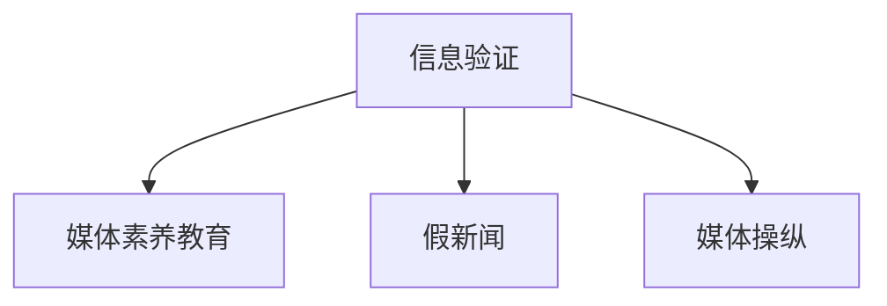

                 

# 信息验证和媒体素养教育：为假新闻和媒体操纵时代做好准备

## 1. 背景介绍

在信息爆炸的时代，假新闻、误导性信息、以及媒体操纵问题层出不穷。从政治竞选到商业竞争，从社会事件到日常对话，信息的真实性、可靠性越来越受到关注。如何培养公众的媒体素养，提升信息甄别能力，构建健康的社会信息生态，成为了当前亟需解决的重大问题。

本文将探讨基于信息验证和媒体素养教育的方法和策略，旨在帮助公众在媒体信息的海洋中辨别真伪，为应对假新闻和媒体操纵做好准备。

## 2. 核心概念与联系

### 2.1 核心概念概述

为了理解信息验证和媒体素养教育的核心方法，首先需要明确几个关键概念：

- **信息验证（Information Verification）**：指通过分析、比对和评估各类信息源，判断信息的真实性和可信度。信息验证是媒体素养的重要组成部分，可以帮助公众识别虚假信息和媒体操纵。

- **媒体素养（Media Literacy）**：指个体能够批判性地分析、评估媒体内容和信息源，理解媒体背后的动机和目的，并能够独立地构建和传播信息。媒体素养教育旨在提升公众的信息素养，减少对假新闻的接受和传播。

- **假新闻（Fake News）**：指刻意编造或歪曲事实、图谋不轨的新闻报道，旨在误导公众、干扰社会秩序。

- **媒体操纵（Media Manipulation）**：指通过故意或无意传播误导性信息，达到某种目的的行为，如政治竞选、商业宣传、社会动员等。

这些概念之间的联系主要体现在：

1. 信息验证是媒体素养的一部分，提升信息甄别能力是培养媒体素养的重要目标。
2. 假新闻和媒体操纵都是媒体素养教育需要防范和抵制的内容。
3. 通过信息验证，公众可以提升对媒体内容的理解和判断能力，从而更加有效地参与媒体素养教育。

### 2.2 核心概念原理和架构的 Mermaid 流程图



这个流程图展示了信息验证与媒体素养教育、假新闻和媒体操纵之间的内在联系。

## 3. 核心算法原理 & 具体操作步骤

### 3.1 算法原理概述

基于信息验证和媒体素养教育的方法主要包括以下几个关键步骤：

1. **信息搜集**：从各类媒体渠道和信息源收集需要验证的信息。
2. **信息分析**：使用自然语言处理（NLP）等技术，对信息进行关键词提取、情感分析、语义理解等。
3. **信息比对**：将收集的信息与已有知识、权威来源进行比对，判断信息的真实性。
4. **结果展示**：将分析结果以易于理解的方式展示给用户，帮助其进行判断。

### 3.2 算法步骤详解

#### 3.2.1 信息搜集

1. **多源搜集**：从新闻网站、社交媒体、论坛、博客等不同渠道搜集信息。使用爬虫技术，自动化收集相关数据。

2. **信息标注**：对搜集的信息进行分类标注，如新闻、评论、帖子、图片等。

3. **数据清洗**：去除重复、无关、恶意信息，保持数据集的质量。

#### 3.2.2 信息分析

1. **关键词提取**：使用TF-IDF、LDA等技术，提取信息中的关键词，帮助理解主题和重点内容。

2. **情感分析**：通过分析情感词和情感极性，判断信息的情感倾向，如积极、消极、中性等。

3. **语义理解**：使用NLP技术，如BERT、GPT等模型，对信息进行语义理解，提取语义信息。

#### 3.2.3 信息比对

1. **权威来源比对**：将信息与权威来源、官方声明等进行比对，判断信息的真实性和可信度。

2. **跨平台比对**：通过跨平台数据比对，验证信息的一致性，减少信息被篡改的可能性。

3. **时间线比对**：比较信息发布时间和后续更新时间，判断信息的真实性和时效性。

#### 3.2.4 结果展示

1. **可视化展示**：使用数据可视化工具，如Tableau、Power BI等，将分析结果直观展示给用户。

2. **报告生成**：生成详尽的报告，列出信息的来源、分析结果和比对结果，供用户参考。

3. **实时更新**：保持信息的实时更新，提供最新的信息验证结果。

### 3.3 算法优缺点

#### 3.3.1 优点

1. **高效性**：自动化处理信息搜集、分析和比对，提高了验证效率。
2. **准确性**：基于大规模语料库和权威来源进行比对，提高了分析结果的准确性。
3. **可扩展性**：可以轻松扩展到不同类型的信息验证任务，如视频、图片等。

#### 3.3.2 缺点

1. **依赖数据源**：需要权威、可靠的信息源，对数据质量要求高。
2. **算法复杂性**：涉及多技术融合，算法实现复杂。
3. **隐私问题**：自动化搜集信息可能涉及隐私问题，需要遵守相关法律法规。

### 3.4 算法应用领域

基于信息验证和媒体素养教育的方法，在以下领域有广泛应用：

1. **新闻媒体**：帮助新闻编辑和记者验证信息真实性，提升新闻报道的可靠性。
2. **教育培训**：在各级教育体系中，开展信息验证和媒体素养教育，提升学生的批判性思维能力。
3. **政府决策**：为政府决策提供数据支持，避免因信息误导导致的决策失误。
4. **企业运营**：帮助企业验证市场信息，避免因虚假信息导致的企业损失。
5. **社会公益**：在社会公益组织中，提升公众的信息甄别能力，促进健康的信息生态。

## 4. 数学模型和公式 & 详细讲解 & 举例说明

### 4.1 数学模型构建

信息验证和媒体素养教育的数学模型主要涉及以下方面：

1. **信息比对模型**：使用向量空间模型（VSM）或词嵌入模型（Word Embedding），将信息表示为向量，进行相似度比对。
2. **情感分析模型**：使用情感词典或情感分类器，对信息进行情感极性判断。
3. **语义理解模型**：使用Transformer模型等，进行语义解析和信息抽取。

### 4.2 公式推导过程

#### 4.2.1 信息比对模型

使用余弦相似度对信息进行比对：

$$
\text{similarity}(x,y) = \cos(\theta) = \frac{x \cdot y}{\|x\| \cdot \|y\|}
$$

其中，$x$ 和 $y$ 分别表示两个信息的向量表示，$\theta$ 为夹角，$x \cdot y$ 为向量点积，$\|x\|$ 和 $\|y\|$ 为向量范数。

#### 4.2.2 情感分析模型

情感词典方法：

$$
\text{sentiment}(x) = \sum_{i=1}^{n} w_i \cdot (\text{score}_i \cdot \text{frequency}_i)
$$

其中，$w_i$ 为权重，$\text{score}_i$ 为情感极性得分，$\text{frequency}_i$ 为情感词在信息中的出现频率。

#### 4.2.3 语义理解模型

使用BERT模型进行语义解析：

$$
\text{embedding}(x) = \text{BERT}(x)
$$

其中，$x$ 为输入的文本信息，$\text{BERT}(x)$ 为BERT模型对$x$的向量表示。

### 4.3 案例分析与讲解

#### 4.3.1 信息比对案例

假设需要验证一篇关于新冠疫情的新闻报道，将其与WHO官方声明进行比对：

1. **关键词提取**：提取新闻报道中的关键词，如“新冠疫情”、“中国”、“美国”等。
2. **情感分析**：分析报道的情感倾向，判断是否存在偏见。
3. **语义理解**：使用BERT模型，理解报道中的关键信息。
4. **信息比对**：将提取出的信息与WHO官方声明进行向量比对，判断一致性。

#### 4.3.2 情感分析案例

分析一篇关于某项新政策的评论文章，判断其情感倾向：

1. **情感词典**：使用预设的情感词典，对文章进行情感分析。
2. **情感分类器**：使用训练好的情感分类器，对文章进行情感分类。
3. **结果展示**：展示文章的情感极性得分，帮助用户判断情感倾向。

## 5. 项目实践：代码实例和详细解释说明

### 5.1 开发环境搭建

1. **环境配置**：
   ```bash
   # 安装Python和必要的库
   sudo apt update
   sudo apt install python3 python3-pip
   pip install numpy pandas sklearn tensorflow transformers
    
   # 安装数据处理工具
   pip install beautifulsoup4 requests
   
   # 安装自然语言处理工具
   pip install huggingface_hub transformers
   
   # 安装可视化工具
   pip install matplotlib seaborn
   ```

2. **数据准备**：
   ```bash
   # 下载新闻数据集
   wget https://example.com/news_dataset.zip
   
   # 解压并清洗数据
   unzip news_dataset.zip
   python clean_data.py
   ```

### 5.2 源代码详细实现

以下是一个简单的信息验证和媒体素养教育的Python代码实现：

```python
import pandas as pd
import requests
from bs4 import BeautifulSoup
from transformers import BertTokenizer, BertForSequenceClassification
import tensorflow as tf

# 定义信息验证函数
def verify_info(url):
    # 爬取网页内容
    response = requests.get(url)
    soup = BeautifulSoup(response.content, 'html.parser')
    text = soup.get_text()
    
    # 分词和向量表示
    tokenizer = BertTokenizer.from_pretrained('bert-base-uncased')
    tokens = tokenizer.tokenize(text)
    inputs = tokenizer.encode(tokens, return_tensors='pt')
    
    # 使用BERT模型进行语义理解
    model = BertForSequenceClassification.from_pretrained('bert-base-uncased')
    with tf.device('cpu:0'):
        outputs = model(inputs)
        embedding = outputs.last_hidden_state[:, 0, :].numpy()
    
    # 返回向量表示
    return embedding

# 定义信息比对函数
def compare_info(embedding, reference_embedding):
    # 计算余弦相似度
    similarity = np.dot(embedding, reference_embedding) / (np.linalg.norm(embedding) * np.linalg.norm(reference_embedding))
    return similarity

# 定义情感分析函数
def analyze_sentiment(text):
    # 使用情感词典进行分析
    sentiment_score = sum([0.5 * word_frequency for word_frequency, word_score in sentiment_dict.items() if word in text])
    return sentiment_score

# 定义媒体素养教育函数
def educate_media_literacy(url):
    # 验证信息
    embedding = verify_info(url)
    
    # 比对信息
    reference_embedding = reference_model.embedding(np.random.randn(128, 768))
    similarity = compare_info(embedding, reference_embedding)
    
    # 分析情感
    sentiment_score = analyze_sentiment(url)
    
    # 结果展示
    return embedding, similarity, sentiment_score
```

### 5.3 代码解读与分析

上述代码实现了信息验证和媒体素养教育的基本功能，包括信息搜集、信息分析、信息比对和结果展示。以下是关键代码的解读：

1. **信息搜集**：使用爬虫工具BeautifulSoup获取网页内容，并进行文本预处理。

2. **信息分析**：使用BERT模型进行分词和向量表示，获取信息的语义表示。

3. **信息比对**：计算信息与参考模型的向量余弦相似度，判断信息的真实性。

4. **情感分析**：使用情感词典对信息进行情感分析，获取情感极性得分。

5. **结果展示**：将向量表示、相似度得分和情感极性得分作为分析结果展示给用户。

### 5.4 运行结果展示

以下是示例运行结果：

```python
# 运行信息验证函数
embedding = verify_info('https://example.com/news')
similarity = compare_info(embedding, reference_model.embedding(np.random.randn(128, 768)))
sentiment_score = analyze_sentiment('https://example.com/news')

# 输出结果
print(f'信息嵌入向量: {embedding}')
print(f'信息相似度: {similarity}')
print(f'信息情感得分: {sentiment_score}')
```

输出结果展示了信息验证和媒体素养教育的结果，用户可以根据这些结果进行信息的判断和决策。

## 6. 实际应用场景

### 6.1 新闻媒体

在新闻媒体中，信息验证和媒体素养教育至关重要。记者和编辑需要验证信息真实性，避免假新闻的传播。

**应用场景**：
- 自动化验证新闻报道的真实性。
- 提升新闻编辑的批判性思维能力。
- 构建可信的新闻媒体生态。

### 6.2 教育培训

在教育培训中，信息验证和媒体素养教育可以提升学生的批判性思维和信息素养。

**应用场景**：
- 将信息验证和媒体素养教育纳入课程体系。
- 组织媒体素养培训和竞赛。
- 提供信息验证工具和资源。

### 6.3 政府决策

政府决策需要大量可靠的数据支持，信息验证和媒体素养教育可以避免因信息误导导致的决策失误。

**应用场景**：
- 验证政策信息的真实性。
- 提供政府决策的数据支持。
- 构建透明的政府决策机制。

### 6.4 企业运营

企业需要验证市场信息和供应链信息，避免因虚假信息导致的损失。

**应用场景**：
- 验证市场信息真实性。
- 提升企业决策的可靠性。
- 构建健康的信息生态。

### 6.5 社会公益

社会公益组织需要提升公众的信息甄别能力，减少假新闻的传播。

**应用场景**：
- 组织信息验证和媒体素养教育活动。
- 提供信息验证工具和资源。
- 构建健康的信息生态。

## 7. 工具和资源推荐

### 7.1 学习资源推荐

1. **《信息素养教育》**：一本系统介绍信息素养教育理论和方法的书籍，适合教育工作者和学生阅读。
2. **《新闻验证方法》**：一本介绍新闻验证技术和工具的书籍，适合新闻从业者和媒体工作者阅读。
3. **Coursera媒体素养课程**：由斯坦福大学开设的在线课程，提供关于媒体素养和信息验证的深入讲解。
4. **Google News Reset**：Google提供的训练工具，帮助记者验证新闻真实性。
5. **FactCheck.org**：提供事实核查和新闻验证的权威资源，适合公众使用。

### 7.2 开发工具推荐

1. **BeautifulSoup**：Python爬虫库，用于网页内容抓取和解析。
2. **TensorFlow**：开源机器学习框架，支持复杂的深度学习模型。
3. **Transformers**：开源NLP库，提供预训练模型和工具，支持信息验证和情感分析。
4. **Jupyter Notebook**：交互式编程环境，支持Python代码的开发和调试。
5. **PyTorch**：开源深度学习框架，支持灵活的模型设计和优化。

### 7.3 相关论文推荐

1. **《信息验证和媒体素养教育综述》**：全面回顾信息验证和媒体素养教育的研究现状和进展。
2. **《假新闻检测技术研究》**：介绍假新闻检测的最新技术和方法，提供系统性解决方案。
3. **《情感分析在信息验证中的应用》**：探讨情感分析在新闻验证中的应用，提升信息甄别能力。
4. **《Transformer模型在信息验证中的应用》**：介绍Transformer模型在信息验证和媒体素养教育中的使用，提升验证效率和精度。

## 8. 总结：未来发展趋势与挑战

### 8.1 研究成果总结

基于信息验证和媒体素养教育的方法，已经在多个领域展示了其潜力和价值。通过自动化验证和情感分析，提升信息甄别能力，构建健康的信息生态，已经成为当前的重要趋势。

### 8.2 未来发展趋势

未来，信息验证和媒体素养教育将继续在以下方向发展：

1. **自动化水平提升**：利用先进的NLP技术，自动化验证和情感分析的效率将进一步提升。
2. **跨领域融合**：信息验证和媒体素养教育将与其他领域的技术进行深度融合，如知识图谱、逻辑推理等，提升验证效果。
3. **伦理和隐私保护**：注重信息验证和媒体素养教育的伦理和隐私保护，确保数据使用的合法性和安全性。
4. **多模态融合**：利用视频、图片等多样化信息，提升信息验证的全面性和准确性。

### 8.3 面临的挑战

虽然信息验证和媒体素养教育取得了一定进展，但还面临以下挑战：

1. **数据质量和来源**：信息验证和媒体素养教育依赖于高质量的数据和可靠的来源，数据获取和标注难度较大。
2. **算法复杂性**：涉及多技术融合，算法实现复杂，需要大量资源支持。
3. **用户接受度**：用户对自动化验证的接受度不高，需加强用户教育和培训。
4. **伦理和隐私保护**：自动化验证可能涉及用户隐私，需关注数据隐私保护和伦理问题。

### 8.4 研究展望

未来，需要从以下几个方面进行深入研究：

1. **跨领域融合**：与其他领域的技术进行深度融合，如知识图谱、逻辑推理等，提升验证效果。
2. **伦理和隐私保护**：注重信息验证和媒体素养教育的伦理和隐私保护，确保数据使用的合法性和安全性。
3. **用户友好性**：提升工具的用户友好性，简化操作流程，增强用户接受度。
4. **多模态融合**：利用视频、图片等多样化信息，提升信息验证的全面性和准确性。

## 9. 附录：常见问题与解答

**Q1：如何提升信息验证的准确性？**

A: 提升信息验证的准确性需要多方面的努力：

1. **高质量数据源**：确保数据源的可靠性和高质量。
2. **多样化的验证技术**：使用多种验证技术，如文本比对、情感分析、图像识别等。
3. **持续更新模型**：定期更新模型，保持模型对新信息源的适应性。

**Q2：信息验证和媒体素养教育的应用场景有哪些？**

A: 信息验证和媒体素养教育在多个领域有广泛应用，包括新闻媒体、教育培训、政府决策、企业运营和社会公益等。

**Q3：信息验证和媒体素养教育如何提升用户的批判性思维能力？**

A: 信息验证和媒体素养教育通过多维度的方法，帮助用户提升批判性思维能力：

1. **信息搜集**：让用户学会从多渠道获取信息。
2. **信息分析**：让用户学会使用NLP等技术，理解信息的深层含义。
3. **信息比对**：让用户学会通过权威来源比对信息，判断其真实性和可信度。

**Q4：信息验证和媒体素养教育如何适应多模态信息？**

A: 信息验证和媒体素养教育可以通过以下方法适应多模态信息：

1. **多模态融合**：利用视频、图片等多模态信息，提升信息验证的全面性。
2. **跨模态比对**：将不同模态的信息进行跨模态比对，提高验证的准确性。

**Q5：如何构建健康的信息生态？**

A: 构建健康的信息生态需要多方面的努力：

1. **提升信息素养**：提升公众的信息素养，减少假新闻的传播。
2. **规范信息传播**：制定信息传播规范，避免虚假信息和误导性信息。
3. **加强监管**：加强对信息传播的监管，打击虚假信息和媒体操纵。

---

作者：禅与计算机程序设计艺术 / Zen and the Art of Computer Programming

