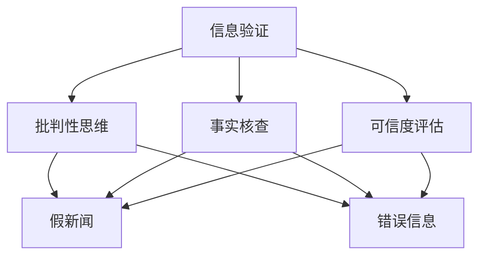

                 

# 信息验证和批判性思维能力：在假新闻和错误信息时代导航

> 关键词：信息验证, 批判性思维, 假新闻, 错误信息, 事实核查, 可信度评估

## 1. 背景介绍

### 1.1 问题由来

随着互联网的普及和社交媒体的崛起，信息传播的速度和广度达到了前所未有的水平。然而，在信息爆炸的同时，虚假信息、假新闻和误导性内容也迅速扩散，对公众认知和决策带来了严重困扰。以美国总统选举为例，2020年美国总统选举中，社交媒体上广泛传播的虚假信息和假新闻不仅影响了选民的投票决策，还导致了公众对媒体和选举结果的信任危机。

为了应对这一挑战，学术界和工业界纷纷展开研究，希望能够通过技术手段识别和验证信息的真实性，帮助公众做出理性的判断。信息验证和批判性思维能力的培养成为了一个备受关注的议题，本文将详细探讨相关技术和方法。

### 1.2 问题核心关键点

在假新闻和错误信息时代，信息验证和批判性思维能力培养的核心关键点包括：
- **信息真实性评估**：如何判断信息来源、内容的真实性和可信度。
- **事实核查技术**：自动化的事实核查工具和模型，用于检测和标记虚假信息。
- **批判性思维**：培养用户的批判性思维能力，提高信息消费者的辨别力。
- **技术伦理**：确保信息验证技术的透明度和公平性，避免对用户隐私和社会稳定造成负面影响。

## 2. 核心概念与联系

### 2.1 核心概念概述

为更好地理解信息验证和批判性思维能力培养的框架，本节将介绍几个密切相关的核心概念：

- **信息验证(Information Verification)**：通过技术和方法，判断信息源、内容及其传播路径的真实性，并验证其可信度。
- **事实核查(Fact-Checking)**：基于已知的真伪数据和背景知识，通过人工或自动化手段，检测信息内容的真实性，并进行标记和分类。
- **批判性思维(Critical Thinking)**：培养用户的分析和判断能力，使其能够在信息消费过程中，主动分析信息源、背景和传播路径，避免受到虚假信息的误导。
- **可信度评估(Credibility Assessment)**：通过定量和定性的方法，对信息源和内容的可信度进行综合评价，辅助用户进行信息筛选。
- **假新闻(Fake News)**：故意编造并散布虚假信息，以误导公众、影响舆论或实现特定目的。
- **错误信息(Misinformation)**：基于事实错误或误导性解读，传播不实信息，对公众认知和决策产生误导。

这些核心概念之间的逻辑关系可以通过以下Mermaid流程图来展示：



这个流程图展示了一系列与信息验证和批判性思维能力培养密切相关的概念及其关系：

1. 信息验证通过事实核查和可信度评估来辅助用户进行信息筛选。
2. 批判性思维培养用户对信息源和内容的分析和判断能力，帮助用户识别假新闻和错误信息。
3. 假新闻和错误信息通过信息验证和可信度评估进行识别和处理。
4. 信息验证和批判性思维能力培养有助于提升公众的媒介素养，降低假新闻和错误信息的传播影响。

## 3. 核心算法原理 & 具体操作步骤
### 3.1 算法原理概述

信息验证和批判性思维能力培养的核心算法原理，是基于数据驱动的模型和规则结合的方法。其核心思想是：通过收集和分析大量真实和虚假的信息，构建和训练信息验证模型，辅助用户在信息消费过程中做出理性的判断。

形式化地，假设信息验证模型为 $M$，输入为待验证的信息 $I$，输出为真实性评分 $R$。则信息验证模型的目标是最小化真实性评分与实际真实性的差异：

$$
\hat{R} = \mathop{\arg\min}_{R} \| R - T \|
$$

其中 $T$ 为实际真实性，即 $T=1$ 表示信息为真实，$T=0$ 表示信息为虚假。

### 3.2 算法步骤详解

基于数据驱动的信息验证算法一般包括以下几个关键步骤：

**Step 1: 数据收集与预处理**
- 收集包含大量真实和虚假信息的混合数据集，可以使用公开的假新闻检测数据集，如Snopes、Fact-Check.org等。
- 对数据进行清洗和标注，包括去除重复数据、纠正标签错误等。

**Step 2: 模型训练**
- 选择合适的算法，如基于规则的方法、机器学习算法、深度学习算法等，训练信息验证模型。
- 使用交叉验证等技术，评估模型性能，调整模型参数。
- 使用数据增强技术，丰富训练数据的多样性，提高模型泛化能力。

**Step 3: 信息验证**
- 对新信息进行预处理，提取关键特征，如文本内容、来源信息、传播路径等。
- 输入预处理后的信息到训练好的模型中，获取真实性评分 $R$。
- 根据设定的阈值，判断信息是否为假新闻或错误信息，并进行标记和分类。

**Step 4: 用户教育与实践**
- 通过在线课程、工作坊等形式，提升用户的批判性思维和信息素养。
- 利用信息验证工具，帮助用户识别和过滤虚假信息，增强信息消费的自主性和理性。

### 3.3 算法优缺点

基于数据驱动的信息验证方法具有以下优点：
1. 自动化程度高。通过自动化工具和算法，可以大幅提高信息验证的效率。
2. 可扩展性强。随着数据量的增加，模型可以不断更新和优化，提升信息验证的准确性。
3. 适用范围广。可以应用于新闻、社交媒体、广告等多个信息传播场景。

同时，该方法也存在一定的局限性：
1. 数据获取困难。高质量的真实和虚假信息混合数据集难以获取，数据不平衡问题严重。
2. 模型复杂度高。构建和训练高精度的模型需要大量的计算资源和时间。
3. 信息歧义性。即使是高度可信的信息，也可能存在多解或模糊之处，难以完全验证。
4. 用户依赖度高。模型依赖于用户的使用和反馈，用户对模型的信任度直接影响其效果。

尽管存在这些局限性，但就目前而言，基于数据驱动的信息验证方法仍是大规模信息验证和批判性思维能力培养的主流范式。未来相关研究的重点在于如何进一步降低数据获取成本，提高模型泛化能力，同时兼顾模型的可解释性和透明度。

### 3.4 算法应用领域

基于数据驱动的信息验证和批判性思维能力培养方法，已经在新闻、社交媒体、广告等多个信息传播领域得到广泛应用，为信息消费者提供了可靠的辅助工具。

- **新闻业**：新闻媒体和事实核查机构使用自动化工具和算法，检测假新闻和错误信息，提升新闻质量和公信力。
- **社交媒体**：社交平台通过事实核查工具和算法，识别虚假信息和恶意传播，防止信息扩散。
- **广告行业**：广告主和营销机构使用信息验证技术，确保广告内容的真实性和可信度，提高广告效果。
- **法律和司法**：法律界和司法机构利用信息验证技术，识别证据的真实性，确保审判的公正性。
- **教育和培训**：教育机构和培训机构开发信息素养课程，培养学生的批判性思维能力。

## 4. 数学模型和公式 & 详细讲解 & 举例说明
### 4.1 数学模型构建

本节将使用数学语言对信息验证和批判性思维能力培养的模型构建进行更加严格的刻画。

假设信息验证模型 $M$ 的输入为信息 $I$，输出为真实性评分 $R$。根据信息验证的原理，模型的目标函数为：

$$
\mathcal{L}(M) = \frac{1}{N} \sum_{i=1}^N \ell(R_i, T_i)
$$

其中 $N$ 为样本总数，$\ell$ 为损失函数，$R_i$ 为模型对样本 $i$ 的真实性评分，$T_i$ 为样本的真实性标签（1表示真实，0表示虚假）。

### 4.2 公式推导过程

以下我们以基于分类器的信息验证模型为例，推导其分类损失函数及其梯度的计算公式。

假设模型 $M$ 的输入为文本 $x$，输出为二分类评分 $y$，则分类损失函数定义为：

$$
\ell(M(x),y) = -[y\log M(x) + (1-y)\log(1-M(x))]
$$

将其代入经验风险公式，得：

$$
\mathcal{L}(M) = -\frac{1}{N}\sum_{i=1}^N [y_i\log M(x_i)+(1-y_i)\log(1-M(x_i))]
$$

根据链式法则，损失函数对模型参数 $\theta$ 的梯度为：

$$
\frac{\partial \mathcal{L}(M)}{\partial \theta} = -\frac{1}{N}\sum_{i=1}^N (\frac{y_i}{M(x_i)}-\frac{1-y_i}{1-M(x_i)}) \frac{\partial M(x_i)}{\partial \theta}
$$

其中 $\frac{\partial M(x_i)}{\partial \theta}$ 可进一步递归展开，利用自动微分技术完成计算。

在得到损失函数的梯度后，即可带入优化算法，完成模型的迭代优化。重复上述过程直至收敛，最终得到适应信息验证任务的最优模型参数 $\theta^*$。

## 5. 项目实践：代码实例和详细解释说明
### 5.1 开发环境搭建

在进行信息验证实践前，我们需要准备好开发环境。以下是使用Python进行Scikit-Learn开发的环境配置流程：

1. 安装Anaconda：从官网下载并安装Anaconda，用于创建独立的Python环境。

2. 创建并激活虚拟环境：
```bash
conda create -n info-verification-env python=3.8 
conda activate info-verification-env
```

3. 安装Scikit-Learn：
```bash
pip install scikit-learn
```

4. 安装其他必要的工具包：
```bash
pip install pandas numpy matplotlib tqdm
```

完成上述步骤后，即可在`info-verification-env`环境中开始信息验证实践。

### 5.2 源代码详细实现

下面我们以文本分类任务为例，给出使用Scikit-Learn对信息验证模型进行训练和评估的Python代码实现。

首先，定义数据处理函数：

```python
import pandas as pd
from sklearn.model_selection import train_test_split
from sklearn.feature_extraction.text import TfidfVectorizer
from sklearn.linear_model import LogisticRegression
from sklearn.metrics import classification_report

def load_data(filename):
    df = pd.read_csv(filename)
    X = df['text']
    y = df['label']
    return X, y

def vectorize(X_train, X_test, max_features=5000):
    vectorizer = TfidfVectorizer(max_features=max_features)
    X_train_vec = vectorizer.fit_transform(X_train)
    X_test_vec = vectorizer.transform(X_test)
    return X_train_vec, X_test_vec

def train_and_evaluate(X_train, X_test, y_train, y_test, model):
    model.fit(X_train, y_train)
    y_pred = model.predict(X_test)
    print(classification_report(y_test, y_pred))
```

然后，定义模型和优化器：

```python
from sklearn.linear_model import LogisticRegression
from sklearn.metrics import accuracy_score

model = LogisticRegression(C=1.0, solver='lbfgs')

```

接着，定义训练和评估函数：

```python
from sklearn.model_selection import train_test_split

def train_and_evaluate(X_train, X_test, y_train, y_test, model):
    X_train_vec, X_test_vec = vectorize(X_train, X_test)
    train_and_evaluate(X_train_vec, X_test_vec, y_train, y_test, model)
```

最后，启动训练流程并在测试集上评估：

```python
X, y = load_data('data.csv')
X_train, X_test, y_train, y_test = train_test_split(X, y, test_size=0.2, random_state=42)

train_and_evaluate(X_train, X_test, y_train, y_test, model)
```

以上就是使用Scikit-Learn对信息验证模型进行文本分类任务训练和评估的完整代码实现。可以看到，得益于Scikit-Learn的强大封装，我们可以用相对简洁的代码完成信息验证模型的训练和评估。

### 5.3 代码解读与分析

让我们再详细解读一下关键代码的实现细节：

**load_data函数**：
- `load_data`函数用于加载数据集，返回文本数据和标签。

**vectorize函数**：
- `vectorize`函数用于将文本数据转换为向量表示，使用TF-IDF进行特征提取。

**train_and_evaluate函数**：
- `train_and_evaluate`函数用于训练和评估模型。首先使用`vectorize`函数将数据转换为向量表示，然后使用模型进行训练和评估，并输出评估结果。

**train_and_evaluate主函数**：
- 调用`train_and_evaluate`函数，传入训练集和测试集数据，以及训练好的模型。

**训练和评估流程**：
- 加载数据集
- 分割训练集和测试集
- 使用`vectorize`函数将数据转换为向量表示
- 使用`train_and_evaluate`函数训练模型并在测试集上评估
- 输出评估结果

可以看到，Scikit-Learn使得信息验证模型的训练和评估过程变得简洁高效。开发者可以将更多精力放在模型改进和数据预处理上，而不必过多关注底层的实现细节。

当然，工业级的系统实现还需考虑更多因素，如模型的保存和部署、超参数的自动搜索、更灵活的任务适配层等。但核心的信息验证范式基本与此类似。

## 6. 实际应用场景
### 6.1 假新闻检测系统

基于信息验证和批判性思维能力培养的假新闻检测系统，可以广泛应用于社交媒体、新闻网站等多个信息传播平台。传统的假新闻检测方法往往依赖人工审核，耗时耗力且容易出错。通过信息验证模型，可以实现自动化的假新闻检测，提高检测效率和准确性。

在技术实现上，可以收集各类假新闻数据，如Snopes、Fact-Check.org提供的假新闻数据集，训练信息验证模型。模型训练完成后，实时获取社交媒体、新闻网站上的文章，输入模型进行检测，输出真实性评分。系统根据设定的阈值，自动标记假新闻并进行处理。如此构建的假新闻检测系统，能够大幅提升信息传播平台的监管效果，减少假新闻的传播。

### 6.2 社会热点事件监测

信息验证技术不仅用于假新闻检测，还可以应用于社会热点事件的监测。通过信息验证模型，可以实时跟踪新闻媒体、社交平台上的热点事件，检测和标记虚假信息，防止舆论误导和谣言传播。

具体而言，可以收集包含大量社会热点事件的数据集，训练信息验证模型。模型训练完成后，实时监测社交媒体、新闻网站上的热点事件，检测和标记虚假信息。系统根据设定的阈值，自动标记假新闻并进行处理。如此构建的热点事件监测系统，能够及时发现和应对虚假信息，避免舆论混乱和公众恐慌。

### 6.3 广告效果评估

在广告行业中，信息验证技术可以帮助广告主和营销机构评估广告的真实性和效果。通过信息验证模型，可以检测广告内容的真实性，确保广告信息的可信度，同时监控广告的点击率和转化率，评估广告效果。

具体而言，可以收集包含大量广告数据的混合数据集，训练信息验证模型。模型训练完成后，实时监测广告点击和转化数据，检测广告内容的真实性。系统根据设定的阈值，自动标记假广告并进行处理。如此构建的广告效果评估系统，能够提升广告投放的精准度和效果，节省广告投放成本。

### 6.4 未来应用展望

随着信息验证技术的不断发展，其在假新闻检测、热点事件监测、广告效果评估等多个领域的应用前景将更加广阔。未来，信息验证技术将进一步提升信息传播平台的监管效果，促进社会舆论的健康发展，提升广告行业的精准度和效果。同时，信息验证技术的普及也将增强公众的信息素养，提升信息消费的理性水平。

## 7. 工具和资源推荐
### 7.1 学习资源推荐

为了帮助开发者系统掌握信息验证和批判性思维能力培养的理论基础和实践技巧，这里推荐一些优质的学习资源：

1. 《信息验证与批判性思维能力》系列博文：由信息验证领域专家撰写，深入浅出地介绍了信息验证的原理、方法和工具。

2. 《假新闻检测与事实核查》课程：Coursera上由数据科学家提供的在线课程，系统讲解假新闻检测和事实核查的技术。

3. 《可信度评估与信息素养》书籍：介绍可信度评估方法、信息素养培养策略，帮助用户提升信息消费的理性水平。

4. HuggingFace官方文档：提供大量预训练信息验证模型和事实核查工具，帮助开发者快速上手实践。

5. Fact-Check.org网站：提供全球最大的假新闻检测数据集，包含大量标记好的假新闻样本，供研究人员和开发者进行模型训练和评估。

通过对这些资源的学习实践，相信你一定能够快速掌握信息验证和批判性思维能力培养的精髓，并用于解决实际的信息消费问题。

### 7.2 开发工具推荐

高效的开发离不开优秀的工具支持。以下是几款用于信息验证开发的常用工具：

1. Scikit-Learn：基于Python的机器学习库，提供了丰富的模型和算法，支持文本分类、聚类、回归等多个任务。

2. TensorFlow：由Google主导开发的深度学习框架，支持大规模模型的训练和部署，适合生产环境应用。

3. PyTorch：基于Python的开源深度学习框架，灵活性高，适合快速迭代研究。

4. Weights & Biases：模型训练的实验跟踪工具，可以记录和可视化模型训练过程中的各项指标，方便对比和调优。

5. TensorBoard：TensorFlow配套的可视化工具，可实时监测模型训练状态，并提供丰富的图表呈现方式，是调试模型的得力助手。

6. Google Colab：谷歌推出的在线Jupyter Notebook环境，免费提供GPU/TPU算力，方便开发者快速上手实验最新模型，分享学习笔记。

合理利用这些工具，可以显著提升信息验证任务的开发效率，加快创新迭代的步伐。

### 7.3 相关论文推荐

信息验证和批判性思维能力培养的发展源于学界的持续研究。以下是几篇奠基性的相关论文，推荐阅读：

1. "Fact-checking the News Media: An Empirical Analysis"（事实核查新闻媒体：实证分析）：Benedikt Baur等，2019年

2. "Automated Fact-Checking: A Survey"（自动化事实核查：综述）：Elisa Kac磁性，2021年

3. "Evaluating the Accuracy of Web Fact-Checking Efforts"（评估网络事实核查工作的准确性）：Fariyal Shahzad等，2020年

4. "Teaching Computers to Read: The Reign of Computation"（教计算机阅读：计算的统治）：Mark Yarowsky，1995年

5. "Understanding the Diffusion of Falsehood on Social Media"（理解虚假信息在社交媒体上的扩散）：Noah A. Smith等，2019年

这些论文代表了大信息验证技术的发展脉络。通过学习这些前沿成果，可以帮助研究者把握学科前进方向，激发更多的创新灵感。

## 8. 总结：未来发展趋势与挑战
### 8.1 总结

本文对基于数据驱动的信息验证和批判性思维能力培养方法进行了全面系统的介绍。首先阐述了假新闻和错误信息时代信息验证和批判性思维能力培养的研究背景和意义，明确了信息验证在提升公众信息素养、保障信息传播安全方面的独特价值。其次，从原理到实践，详细讲解了信息验证的数学模型和算法流程，给出了信息验证任务开发的完整代码实例。同时，本文还广泛探讨了信息验证方法在假新闻检测、热点事件监测、广告效果评估等多个信息传播领域的应用前景，展示了信息验证技术的巨大潜力。此外，本文精选了信息验证技术的各类学习资源，力求为读者提供全方位的技术指引。

通过本文的系统梳理，可以看到，基于数据驱动的信息验证技术在假新闻检测、热点事件监测、广告效果评估等多个信息传播领域的应用前景广阔。信息验证技术不仅能提升信息传播平台的监管效果，防止虚假信息的传播，还能增强公众的信息素养，提升信息消费的理性水平。未来，伴随信息验证技术的不断发展，其应用将更加广泛和深入，助力信息社会的健康发展。

### 8.2 未来发展趋势

展望未来，信息验证技术将呈现以下几个发展趋势：

1. 自动化程度持续提升。随着技术进步，信息验证过程将更加自动化、智能化，减少人工干预，提高效率。

2. 多模态信息验证。不仅限于文本信息，未来将扩展到音频、视频等多模态数据的验证，提升信息验证的准确性和全面性。

3. 分布式验证网络。构建分布式信息验证网络，提高模型训练和推理的效率和鲁棒性，满足大规模信息验证的需求。

4. 元学习和自适应验证。通过元学习和自适应方法，提升信息验证模型的泛化能力和动态适应性，适应不断变化的信息环境。

5. 用户行为分析。结合用户行为分析，提升信息验证模型的决策质量和可信度，实现个性化的信息过滤和推荐。

以上趋势凸显了信息验证技术的广阔前景。这些方向的探索发展，必将进一步提升信息验证系统的性能和应用范围，为信息社会的健康发展提供更加坚实的技术支撑。

### 8.3 面临的挑战

尽管信息验证技术已经取得了显著进展，但在迈向更加智能化、普适化应用的过程中，仍面临诸多挑战：

1. 数据获取和标注成本高。高质量的数据集和标注工作耗时耗力，难以满足大规模应用的需求。

2. 模型复杂度高。信息验证模型的训练和推理需要大量的计算资源和时间，难以支持实时验证。

3. 模型泛化能力不足。模型在面对新的数据和场景时，泛化能力有限，容易出现误判。

4. 用户依赖度高。模型的效果依赖于用户的使用和反馈，难以完全自动化。

5. 模型解释性不足。信息验证模型的决策过程缺乏可解释性，难以对其推理逻辑进行分析和调试。

6. 技术伦理问题。信息验证技术的广泛应用可能带来隐私和伦理问题，需要加强监管和指导。

以上挑战需要研究者和社会各界的共同努力，通过技术创新和制度建设，才能逐步克服，实现信息验证技术的普及和应用。

### 8.4 研究展望

面对信息验证技术面临的诸多挑战，未来的研究需要在以下几个方面寻求新的突破：

1. 探索无监督和半监督信息验证方法。摆脱对大规模标注数据的依赖，利用自监督学习、主动学习等无监督和半监督范式，最大化利用非结构化数据，实现更加高效和泛化的信息验证。

2. 研究高效和可解释的信息验证模型。开发更加高效和可解释的信息验证模型，减少计算资源消耗，提升模型的透明度和可信度。

3. 融合多模态信息验证技术。将文本、音频、视频等多模态信息验证技术进行融合，提升信息验证的全面性和准确性。

4. 结合因果推断和元学习。引入因果推断和元学习方法，提升信息验证模型的因果关系推理能力和动态适应性。

5. 纳入伦理和社会因素。将伦理和社会因素纳入信息验证技术的研发过程中，确保技术应用的透明度和公平性，避免对用户隐私和社会稳定造成负面影响。

这些研究方向的探索，必将引领信息验证技术迈向更高的台阶，为信息社会的健康发展提供更加坚实的技术支撑。面向未来，信息验证技术还需要与其他人工智能技术进行更深入的融合，如知识表示、因果推理、强化学习等，多路径协同发力，共同推动信息社会的进步。只有勇于创新、敢于突破，才能不断拓展信息验证技术的边界，让信息验证技术更好地造福人类社会。

## 9. 附录：常见问题与解答

**Q1: 信息验证模型的训练和评估有哪些关键步骤？**

A: 信息验证模型的训练和评估一般包括以下几个关键步骤：
1. 数据收集与预处理：收集包含真实和虚假信息的混合数据集，进行清洗和标注。
2. 模型训练：选择合适的算法，如逻辑回归、支持向量机等，训练信息验证模型。
3. 模型评估：使用测试集评估模型的性能，调整模型参数。
4. 信息验证：对新信息进行预处理，提取关键特征，输入模型进行验证，输出真实性评分。

**Q2: 信息验证模型在实际应用中面临哪些挑战？**

A: 信息验证模型在实际应用中面临以下挑战：
1. 数据获取和标注成本高：高质量的数据集和标注工作耗时耗力，难以满足大规模应用的需求。
2. 模型复杂度高：信息验证模型的训练和推理需要大量的计算资源和时间，难以支持实时验证。
3. 模型泛化能力不足：模型在面对新的数据和场景时，泛化能力有限，容易出现误判。
4. 用户依赖度高：模型的效果依赖于用户的使用和反馈，难以完全自动化。
5. 模型解释性不足：信息验证模型的决策过程缺乏可解释性，难以对其推理逻辑进行分析和调试。
6. 技术伦理问题：信息验证技术的广泛应用可能带来隐私和伦理问题，需要加强监管和指导。

**Q3: 如何提高信息验证模型的泛化能力？**

A: 提高信息验证模型的泛化能力，可以通过以下方法：
1. 数据增强：通过回译、近义替换等方式扩充训练集。
2. 正则化：使用L2正则、Dropout等技术，防止模型过拟合。
3. 迁移学习：在新的数据集上继续训练模型，提升泛化能力。
4. 模型集成：结合多个模型的预测结果，提高模型的鲁棒性和泛化能力。

**Q4: 如何提高信息验证模型的解释性？**

A: 提高信息验证模型的解释性，可以通过以下方法：
1. 模型简化：使用更简单的模型，减少复杂的结构和参数。
2. 可视化：使用可视化工具，展示模型的决策过程和特征重要性。
3. 可解释模型：使用可解释模型，如决策树、规则模型等，提升模型的透明度和可信度。
4. 用户教育：提升用户的信息素养，使其能够理解和判断模型的输出。

**Q5: 信息验证技术有哪些未来研究方向？**

A: 信息验证技术的未来研究方向包括：
1. 探索无监督和半监督信息验证方法，利用自监督学习、主动学习等方法，最大化利用非结构化数据。
2. 研究高效和可解释的信息验证模型，减少计算资源消耗，提升模型的透明度和可信度。
3. 融合多模态信息验证技术，将文本、音频、视频等多模态信息验证技术进行融合，提升信息验证的全面性和准确性。
4. 结合因果推断和元学习方法，提升信息验证模型的因果关系推理能力和动态适应性。
5. 纳入伦理和社会因素，将伦理和社会因素纳入信息验证技术的研发过程中，确保技术应用的透明度和公平性。

这些研究方向将引领信息验证技术迈向更高的台阶，为信息社会的健康发展提供更加坚实的技术支撑。

---

作者：禅与计算机程序设计艺术 / Zen and the Art of Computer Programming

