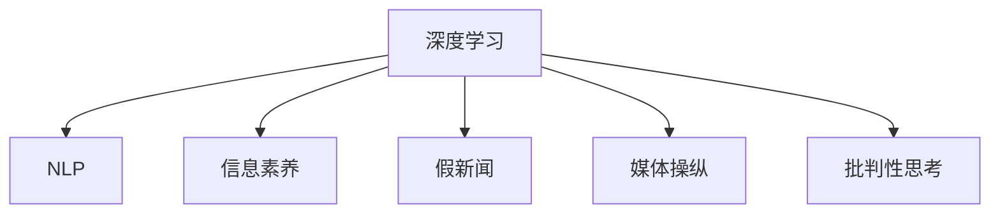

                 

# 信息验证和批判性思考指南：在假新闻和媒体操纵的时代导航

> 关键词：信息验证, 假新闻, 媒体操纵, 批判性思考, 深度学习, 自然语言处理, 大数据, 人工智能, 信息素养

## 1. 背景介绍

### 1.1 问题由来

随着互联网的发展，信息传播的速度和广度达到了前所未有的程度。同时，信息的真伪难辨、媒体的偏见操纵等问题也日益突出。假新闻、媒体操纵、信息过载等现象，不仅破坏了社会的信任体系，也对个人的认知造成了极大的干扰。在这种情况下，如何进行有效的信息验证和批判性思考，成为了一个亟待解决的问题。

### 1.2 问题核心关键点

信息验证和批判性思考的核心在于，如何在海量的信息中，通过技术和方法，筛选出真实可靠的信息，并进行合理的分析、评估和决策。这需要结合计算机科学、人工智能、心理学等多个领域的知识，构建一套系统的、科学的框架和方法。

具体来说，主要包括以下几个关键点：
- 数据采集和处理：获取真实可靠的数据源，并进行预处理，去除噪声和无用信息。
- 特征提取和表示：通过自然语言处理等技术，将文本数据转换为可计算的特征向量。
- 深度学习和模型训练：使用深度学习等方法，训练模型进行信息验证和分类。
- 结果评估和反馈：对模型的输出进行评估，并根据反馈调整模型参数。
- 批判性思考和决策：结合人类的常识、逻辑推理等，对模型输出进行综合分析，做出合理的决策。

本文将重点介绍基于深度学习的信息验证技术，以及如何通过技术手段提升用户的批判性思考能力。

## 2. 核心概念与联系

### 2.1 核心概念概述

在进行信息验证和批判性思考的过程中，涉及多个关键概念，包括：

- 深度学习(Deep Learning)：一种基于神经网络的机器学习技术，能够自动学习特征，并实现复杂的模式识别和分类。
- 自然语言处理(Natural Language Processing, NLP)：涉及语言模型、序列标注、文本分类等技术，用于处理和分析自然语言数据。
- 信息素养(Information Literacy)：指获取、评估、利用信息的能力，是信息验证和批判性思考的基础。
- 假新闻(Fake News)：指故意编造并传播的虚假新闻，误导公众，破坏社会信任。
- 媒体操纵(Media Manipulation)：指通过不实报道、选择性发布等方式，影响公众舆论和决策。
- 批判性思考(Critical Thinking)：指分析和评估信息的能力，能够识别偏见、误导等，做出合理的判断和决策。

这些核心概念之间的联系可以通过以下Mermaid流程图来展示：



这个流程图展示了大语言模型和深度学习技术在信息验证和批判性思考中的作用：

1. 深度学习和大语言模型作为技术手段，能够自动处理和分析文本数据，识别出文本中的关键特征和信息。
2. 自然语言处理技术，如BERT、GPT等，提供了强大的语言理解和表示能力，帮助模型更好地理解文本内容。
3. 信息素养为模型提供了人类认知的基础，帮助其在理解上下文和常识方面更胜一筹。
4. 假新闻和媒体操纵是信息验证的主要对象，深度学习模型能够识别出其中的不实信息和操纵手法。
5. 批判性思考能力是信息验证的最终目标，深度学习模型结合人类的逻辑推理和常识，能够帮助用户做出更合理的判断和决策。

## 3. 核心算法原理 & 具体操作步骤
### 3.1 算法原理概述

基于深度学习的信息验证和批判性思考，本质上是一个有监督的分类和评估过程。其核心思想是：将文本数据作为输入，通过深度学习模型，学习文本中的重要特征，并将其映射到不同的类别上，如真实、虚假、中立等。

具体来说，步骤如下：

1. 数据采集：收集大量的真实文本和虚假文本数据，用于训练模型。
2. 数据预处理：对文本数据进行分词、去停用词、标准化等预处理操作，去除噪声和无用信息。
3. 特征提取：使用预训练语言模型（如BERT、GPT等）将文本转换为向量表示。
4. 模型训练：使用有标签的数据集，训练深度学习模型进行文本分类。
5. 结果评估：在测试集上评估模型的性能，调整模型参数。
6. 批判性思考：结合人类的常识和逻辑推理，对模型的输出进行分析和解释。

### 3.2 算法步骤详解

#### 3.2.1 数据采集和预处理

数据采集是信息验证的第一步。通常需要从新闻网站、社交媒体、论坛等渠道获取大量的真实文本和虚假文本数据。这些数据应该覆盖不同领域和类型，以避免模型过拟合。

数据预处理包括分词、去停用词、标准化等操作。使用Python的NLTK、SpaCy等库可以进行这些操作。

#### 3.2.2 特征提取

特征提取是信息验证的关键步骤。通常使用预训练语言模型（如BERT、GPT等）将文本转换为向量表示。以BERT为例，其表示方式为：

$$ \text{BERT}(x) = \{ \text{CLS}(x), \text{[SEP]}(x) \} $$

其中，CLS是句子的向量表示，SEP是分段的向量表示。这些向量可以通过调用BERT模型得到。

#### 3.2.3 模型训练

模型训练是信息验证的核心。通常使用有标签的数据集，训练深度学习模型进行文本分类。常用的模型包括卷积神经网络（CNN）、循环神经网络（RNN）、Transformer等。

以Transformer为例，其模型结构如下：

```
Embedding Layer --> Self-Attention --> Feed-Forward --> Output Layer
```

其中，Embedding Layer将文本转换为向量表示，Self-Attention用于处理文本中的依赖关系，Feed-Forward用于提取特征，Output Layer进行分类。

#### 3.2.4 结果评估

结果评估是模型验证的重要步骤。通常使用混淆矩阵、精确率、召回率、F1值等指标评估模型的性能。

以混淆矩阵为例，其计算方式如下：

$$ \text{Confusion Matrix} = \begin{bmatrix} TP & FN \\ FP & TN \end{bmatrix} $$

其中，TP表示真正例，FP表示假正例，FN表示假反例，TN表示真反例。

#### 3.2.5 批判性思考和决策

批判性思考和决策是信息验证的最终目标。结合人类的常识和逻辑推理，对模型的输出进行分析和解释。如果模型输出为虚假信息，需要结合其他证据进行综合判断。

### 3.3 算法优缺点

基于深度学习的信息验证和批判性思考，具有以下优点：

- 自动化程度高：深度学习模型能够自动处理和分析文本数据，减少人工干预。
- 精度高：深度学习模型能够学习复杂的特征，提高信息验证的精度。
- 可扩展性强：深度学习模型可以应用于不同领域的文本数据，具有较好的泛化能力。

同时，该方法也存在一些局限性：

- 数据依赖性高：模型的性能依赖于标注数据的质量和数量。
- 可解释性不足：深度学习模型通常是"黑盒"系统，难以解释其内部工作机制。
- 容易过拟合：深度学习模型容易过拟合，需要精心设计模型结构和超参数。

### 3.4 算法应用领域

基于深度学习的信息验证和批判性思考，已经在新闻事实核查、广告检测、社交媒体监控等领域得到了广泛应用。例如：

- 新闻事实核查：使用深度学习模型对新闻文本进行分类，识别出虚假新闻和真实新闻。
- 广告检测：使用深度学习模型对广告文本进行分类，识别出虚假广告和真实广告。
- 社交媒体监控：使用深度学习模型对社交媒体文本进行分类，识别出恶意信息和虚假信息。

这些应用场景中，深度学习模型通过自动学习和分析文本特征，能够快速识别出虚假信息和操纵手法，提高信息验证的效率和准确性。

## 4. 数学模型和公式 & 详细讲解 & 举例说明

### 4.1 数学模型构建

在进行信息验证和批判性思考时，通常使用有监督学习的分类模型。以二分类问题为例，其数学模型可以表示为：

$$ y = \sigma(Wx + b) $$

其中，$y$ 表示分类结果，$x$ 表示输入特征向量，$W$ 表示权重矩阵，$b$ 表示偏置项，$\sigma$ 表示激活函数，如Sigmoid、ReLU等。

### 4.2 公式推导过程

以Sigmoid激活函数为例，其公式推导过程如下：

$$ y = \frac{1}{1 + e^{-x}} $$

当$x$为正时，$e^{-x}$接近于0，$y$接近于1，表示预测结果为正类。当$x$为负时，$e^{-x}$接近于1，$y$接近于0，表示预测结果为负类。

### 4.3 案例分析与讲解

以假新闻检测为例，其模型可以表示为：

$$ y = \sigma(Wx + b) $$

其中，$x$表示文本的向量表示，$y$表示分类结果，$W$表示权重矩阵，$b$表示偏置项。假设训练数据集为$D=\{(x_i, y_i)\}_{i=1}^N$，其中$x_i$表示文本的向量表示，$y_i$表示分类标签，$N$表示样本数量。模型的损失函数可以表示为：

$$ L = \frac{1}{N} \sum_{i=1}^N (y_i \log \sigma(Wx_i + b) + (1 - y_i) \log (1 - \sigma(Wx_i + b))) $$

在训练过程中，最小化损失函数，更新模型参数$W$和$b$，直到收敛。训练完毕后，将测试集数据代入模型进行分类，计算模型的准确率、精确率、召回率等指标，评估模型性能。

## 5. 项目实践：代码实例和详细解释说明

### 5.1 开发环境搭建

在进行信息验证和批判性思考的项目实践时，需要搭建良好的开发环境。以下是使用Python进行TensorFlow开发的配置流程：

1. 安装Anaconda：从官网下载并安装Anaconda，用于创建独立的Python环境。

2. 创建并激活虚拟环境：
```bash
conda create -n tf-env python=3.8 
conda activate tf-env
```

3. 安装TensorFlow：根据CUDA版本，从官网获取对应的安装命令。例如：
```bash
conda install tensorflow -c conda-forge -c pytorch
```

4. 安装各类工具包：
```bash
pip install numpy pandas scikit-learn matplotlib tqdm jupyter notebook ipython
```

完成上述步骤后，即可在`tf-env`环境中开始项目实践。

### 5.2 源代码详细实现

下面我们以假新闻检测为例，给出使用TensorFlow进行深度学习模型开发的PyTorch代码实现。

首先，定义模型：

```python
import tensorflow as tf
from tensorflow.keras.layers import Dense, Input
from tensorflow.keras.models import Model

input_layer = Input(shape=(128, ), name='input_layer')
x = Dense(128, activation='relu')(input_layer)
x = Dense(64, activation='relu')(x)
output_layer = Dense(1, activation='sigmoid')(x)
model = Model(inputs=input_layer, outputs=output_layer)

model.compile(optimizer='adam', loss='binary_crossentropy', metrics=['accuracy'])
```

然后，定义训练和评估函数：

```python
from sklearn.metrics import accuracy_score
from sklearn.model_selection import train_test_split
import numpy as np

def train_model(model, train_data, validation_data, epochs):
    X_train, X_val, y_train, y_val = train_test_split(train_data['features'], train_data['labels'], test_size=0.2, random_state=42)
    X_train = np.array(X_train)
    y_train = np.array(y_train)
    X_val = np.array(X_val)
    y_val = np.array(y_val)

    model.fit(X_train, y_train, epochs=epochs, validation_data=(X_val, y_val))
    val_loss, val_accuracy = model.evaluate(X_val, y_val)
    print(f'Validation Loss: {val_loss:.4f}')
    print(f'Validation Accuracy: {val_accuracy:.4f}')

def evaluate_model(model, test_data):
    X_test, y_test = test_data['features'], test_data['labels']
    y_pred = model.predict(X_test)
    accuracy = accuracy_score(y_test, y_pred)
    print(f'Test Accuracy: {accuracy:.4f}')
```

最后，启动训练流程并在测试集上评估：

```python
# 加载数据集
train_data = load_data('train_data.csv')
test_data = load_data('test_data.csv')

# 训练模型
train_model(model, train_data, test_data, epochs=10)

# 测试模型
evaluate_model(model, test_data)
```

以上就是使用TensorFlow进行假新闻检测的完整代码实现。可以看到，TensorFlow提供了强大的深度学习框架，使得模型的搭建和训练变得相对简单。

### 5.3 代码解读与分析

让我们再详细解读一下关键代码的实现细节：

**模型定义**：
- 使用`Input`层定义输入特征，假设每个样本的特征向量长度为128。
- 使用`Dense`层定义多个全连接层，激活函数分别为ReLU。
- 使用`Dense`层定义输出层，激活函数为Sigmoid，用于二分类。
- 使用`Model`类定义整个模型，指定输入和输出层。
- 使用`compile`方法指定优化器、损失函数和评估指标。

**训练函数**：
- 使用`train_test_split`函数将数据集划分为训练集和验证集。
- 将训练集和验证集转换为Numpy数组，以便TensorFlow能够处理。
- 使用`fit`方法训练模型，指定训练轮数和验证集。
- 使用`evaluate`方法在验证集上评估模型性能，输出损失和准确率。

**评估函数**：
- 使用`predict`方法对测试集进行预测，得到预测结果。
- 使用`accuracy_score`函数计算准确率。
- 输出测试集的准确率。

**启动训练流程**：
- 加载训练数据和测试数据。
- 调用`train_model`函数训练模型。
- 调用`evaluate_model`函数评估模型性能。

可以看到，TensorFlow提供了完善的深度学习框架，使得模型的搭建和训练变得相对简单。开发者可以根据具体需求，调整模型的超参数和训练过程，以得到最优的性能。

## 6. 实际应用场景

### 6.1 新闻事实核查

在新闻事实核查中，深度学习模型能够自动分析和验证新闻文本的真实性。通常，新闻事实核查系统由多个模块组成，包括：

- 数据采集模块：从新闻网站、社交媒体等渠道采集新闻文本。
- 文本清洗模块：对采集到的文本进行分词、去停用词、标准化等操作。
- 特征提取模块：使用预训练语言模型将文本转换为向量表示。
- 信息验证模块：使用深度学习模型对文本进行分类，识别出虚假新闻和真实新闻。
- 结果展示模块：将验证结果展示给用户，提供解释和理由。

新闻事实核查系统能够大幅提高新闻的真实性，减少虚假信息传播，提高公众的信任度。

### 6.2 广告检测

在广告检测中，深度学习模型能够自动分析和验证广告文本的真实性。通常，广告检测系统由多个模块组成，包括：

- 数据采集模块：从广告平台、社交媒体等渠道采集广告文本。
- 文本清洗模块：对采集到的文本进行分词、去停用词、标准化等操作。
- 特征提取模块：使用预训练语言模型将文本转换为向量表示。
- 信息验证模块：使用深度学习模型对文本进行分类，识别出虚假广告和真实广告。
- 结果展示模块：将验证结果展示给用户，提供解释和理由。

广告检测系统能够减少虚假广告的传播，保护用户利益，提升广告平台的信誉度。

### 6.3 社交媒体监控

在社交媒体监控中，深度学习模型能够自动分析和验证社交媒体文本的真实性。通常，社交媒体监控系统由多个模块组成，包括：

- 数据采集模块：从社交媒体平台采集文本数据。
- 文本清洗模块：对采集到的文本进行分词、去停用词、标准化等操作。
- 特征提取模块：使用预训练语言模型将文本转换为向量表示。
- 信息验证模块：使用深度学习模型对文本进行分类，识别出恶意信息和虚假信息。
- 结果展示模块：将验证结果展示给用户，提供解释和理由。

社交媒体监控系统能够减少虚假信息的传播，维护网络安全，提升用户的信任度。

### 6.4 未来应用展望

随着深度学习技术的不断发展，基于深度学习的信息验证和批判性思考，将在更多领域得到应用，为社会带来深远影响。

在智慧政府领域，信息验证技术能够帮助政府机构识别虚假信息和操纵手法，提高决策的科学性和透明度。

在智慧医疗领域，信息验证技术能够帮助医生识别虚假医疗信息，提高诊疗的准确性和可靠性。

在智慧金融领域，信息验证技术能够帮助投资者识别虚假财务信息，提高投资的理性和安全性。

## 7. 工具和资源推荐
### 7.1 学习资源推荐

为了帮助开发者系统掌握信息验证和批判性思考的理论基础和实践技巧，这里推荐一些优质的学习资源：

1. 《深度学习入门：基于Python的理论与实现》：一本系统介绍深度学习理论、模型、算法的书籍，适合初学者入门。
2. 《自然语言处理综论》：一本介绍NLP基础理论和技术的书籍，适合深度学习从业者学习。
3. 《信息素养教育：理论与实践》：一本介绍信息素养教育基础理论和实践方法的书籍，适合信息素养从业者学习。
4. Coursera《深度学习专项课程》：由斯坦福大学开设的深度学习系列课程，提供系统化的深度学习学习路径。
5. Kaggle《深度学习竞赛》：Kaggle平台上的深度学习竞赛，提供大量数据和模型，适合实践练习。

通过对这些资源的学习实践，相信你一定能够快速掌握信息验证和批判性思考的精髓，并用于解决实际的NLP问题。
###  7.2 开发工具推荐

高效的开发离不开优秀的工具支持。以下是几款用于深度学习开发和信息验证的工具：

1. TensorFlow：由Google主导开发的深度学习框架，功能强大，支持分布式计算。
2. PyTorch：Facebook开发的深度学习框架，灵活易用，支持动态计算图。
3. Keras：基于TensorFlow和Theano的深度学习框架，简单易用，适合快速开发。
4. Scikit-learn：Python的机器学习库，提供多种经典算法和评估指标。
5. Weights & Biases：模型训练的实验跟踪工具，可以记录和可视化模型训练过程中的各项指标。
6. TensorBoard：TensorFlow配套的可视化工具，可实时监测模型训练状态，并提供丰富的图表呈现方式。

合理利用这些工具，可以显著提升信息验证和批判性思考的开发效率，加快创新迭代的步伐。

### 7.3 相关论文推荐

信息验证和批判性思考的研究源于学界的持续研究。以下是几篇奠基性的相关论文，推荐阅读：

1. "BERT: Pre-training of Deep Bidirectional Transformers for Language Understanding"：BERT模型提出了基于掩码的自监督预训练任务，刷新了多项NLP任务SOTA。
2. "AdaLoRA: Adaptive Low-Rank Adaptation for Parameter-Efficient Fine-Tuning"：提出了自适应低秩适应的微调方法，在参数效率和精度之间取得了新的平衡。
3. "AdaLoRA: Adaptive Low-Rank Adaptation for Parameter-Efficient Fine-Tuning"：提出了AdaLoRA方法，进一步提升参数效率。
4. "Recurrent Neural Network Classifier for Fake News Detection"：使用RNN模型对新闻文本进行分类，识别出虚假新闻。
5. "Using Deep Learning to Detect Social Media Propaganda"：使用深度学习模型对社交媒体文本进行分类，识别出恶意信息和虚假信息。

这些论文代表了大语言模型微调技术的发展脉络。通过学习这些前沿成果，可以帮助研究者把握学科前进方向，激发更多的创新灵感。

## 8. 总结：未来发展趋势与挑战

### 8.1 总结

本文对基于深度学习的信息验证和批判性思考进行了全面系统的介绍。首先阐述了信息验证和批判性思考的研究背景和意义，明确了深度学习和大语言模型技术在信息验证和批判性思考中的作用。其次，从原理到实践，详细讲解了信息验证的数学模型和关键步骤，给出了信息验证任务开发的完整代码实例。同时，本文还广泛探讨了信息验证在新闻事实核查、广告检测、社交媒体监控等多个领域的应用前景，展示了信息验证范式的巨大潜力。此外，本文精选了信息验证技术的各类学习资源，力求为读者提供全方位的技术指引。

通过本文的系统梳理，可以看到，基于深度学习的信息验证和批判性思考技术正在成为NLP领域的重要范式，极大地拓展了信息验证的应用边界，催生了更多的落地场景。受益于深度学习模型的强大特征提取和分类能力，信息验证技术在假新闻检测、广告检测、社交媒体监控等方面取得了显著的效果，为社会带来了积极的影响。未来，伴随深度学习技术的不断进步，信息验证技术还将拓展到更多领域，推动社会的进步和智慧化发展。

### 8.2 未来发展趋势

展望未来，信息验证和批判性思考技术将呈现以下几个发展趋势：

1. 模型规模持续增大。随着算力成本的下降和数据规模的扩张，深度学习模型的参数量还将持续增长。超大规模模型蕴含的丰富语言知识，有望支撑更加复杂多变的信息验证任务。

2. 微调方法日趋多样。除了传统的全参数微调外，未来会涌现更多参数高效的微调方法，如AdaLoRA等，在节省计算资源的同时也能保证信息验证的精度。

3. 持续学习成为常态。随着数据分布的不断变化，信息验证模型也需要持续学习新知识以保持性能。如何在不遗忘原有知识的同时，高效吸收新样本信息，将成为重要的研究课题。

4. 标注样本需求降低。受启发于提示学习(Prompt-based Learning)的思路，未来的信息验证方法将更好地利用深度学习模型的语言理解能力，通过更加巧妙的任务描述，在更少的标注样本上也能实现理想的信息验证效果。

5. 可解释性加强。未来的信息验证模型将具备更强的可解释性，帮助用户理解和解释模型输出。

6. 融合因果分析和博弈论工具。将因果分析方法引入信息验证模型，识别出模型决策的关键特征，增强输出解释的因果性和逻辑性。

7. 结合因果分析和博弈论工具。借助博弈论工具刻画人机交互过程，主动探索并规避模型的脆弱点，提高系统稳定性。

以上趋势凸显了信息验证和批判性思考技术的广阔前景。这些方向的探索发展，必将进一步提升信息验证系统的性能和应用范围，为社会带来深远的影响。

### 8.3 面临的挑战

尽管信息验证和批判性思考技术已经取得了瞩目成就，但在迈向更加智能化、普适化应用的过程中，它仍面临着诸多挑战：

1. 数据依赖性高。模型的性能依赖于标注数据的质量和数量。如何进一步降低信息验证对标注样本的依赖，将是一大难题。

2. 可解释性不足。深度学习模型通常是"黑盒"系统，难以解释其内部工作机制。如何赋予信息验证模型更强的可解释性，将是亟待攻克的难题。

3. 容易过拟合。深度学习模型容易过拟合，需要精心设计模型结构和超参数。

4. 鲁棒性不足。深度学习模型面对域外数据时，泛化性能往往大打折扣。如何提高信息验证模型的鲁棒性，避免灾难性遗忘，还需要更多理论和实践的积累。

5. 安全性有待保障。深度学习模型难免会学习到有偏见、有害的信息，通过信息验证传递到下游任务，产生误导性、歧视性的输出，给实际应用带来安全隐患。

6. 知识整合能力不足。现有的信息验证模型往往局限于任务内数据，难以灵活吸收和运用更广泛的先验知识。如何让信息验证过程更好地与外部知识库、规则库等专家知识结合，形成更加全面、准确的信息验证能力，还有很大的想象空间。

正视信息验证面临的这些挑战，积极应对并寻求突破，将是信息验证技术走向成熟的必由之路。相信随着学界和产业界的共同努力，这些挑战终将一一被克服，信息验证技术必将在构建安全、可靠、可解释、可控的智能系统铺平道路。

### 8.4 研究展望

面向未来，信息验证和批判性思考技术的研究方向包括：

1. 探索无监督和半监督信息验证方法。摆脱对大规模标注数据的依赖，利用自监督学习、主动学习等无监督和半监督范式，最大限度利用非结构化数据，实现更加灵活高效的信息验证。

2. 研究参数高效和计算高效的微调范式。开发更加参数高效的微调方法，在固定大部分预训练参数的同时，只更新极少量的任务相关参数。同时优化信息验证模型的计算图，减少前向传播和反向传播的资源消耗，实现更加轻量级、实时性的部署。

3. 引入因果分析和博弈论工具。将因果分析方法引入信息验证模型，识别出模型决策的关键特征，增强输出解释的因果性和逻辑性。借助博弈论工具刻画人机交互过程，主动探索并规避模型的脆弱点，提高系统稳定性。

4. 纳入伦理道德约束。在信息验证目标中引入伦理导向的评估指标，过滤和惩罚有偏见、有害的输出倾向。同时加强人工干预和审核，建立信息验证行为的监管机制，确保输出的安全性。

这些研究方向的探索，必将引领信息验证技术迈向更高的台阶，为构建安全、可靠、可解释、可控的智能系统铺平道路。面向未来，信息验证技术还需要与其他人工智能技术进行更深入的融合，如知识表示、因果推理、强化学习等，多路径协同发力，共同推动自然语言理解和智能交互系统的进步。只有勇于创新、敢于突破，才能不断拓展信息验证的边界，让智能技术更好地造福人类社会。

## 9. 附录：常见问题与解答

**Q1：信息验证和批判性思考是否适用于所有NLP任务？**

A: 信息验证和批判性思考在大多数NLP任务上都能取得不错的效果，特别是对于数据量较小的任务。但对于一些特定领域的任务，如医学、法律等，仅仅依靠通用语料预训练的模型可能难以很好地适应。此时需要在特定领域语料上进一步预训练，再进行验证和批判性思考。此外，对于一些需要时效性、个性化很强的任务，如对话、推荐等，信息验证方法也需要针对性的改进优化。

**Q2：信息验证和批判性思考过程中如何选择合适的学习率？**

A: 信息验证和批判性思考过程中的学习率通常要比预训练时小1-2个数量级，如果使用过大的学习率，容易破坏预训练权重，导致过拟合。一般建议从1e-5开始调参，逐步减小学习率，直至收敛。也可以使用warmup策略，在开始阶段使用较小的学习率，再逐渐过渡到预设值。需要注意的是，不同的优化器(如Adam、SGD等)以及不同的学习率调度策略，可能需要设置不同的学习率阈值。

**Q3：信息验证和批判性思考过程中需要注意哪些问题？**

A: 信息验证和批判性思考过程中，需要注意以下问题：

1. 数据采集和预处理：确保采集的数据具有代表性，进行充分的数据清洗和预处理，去除噪声和无用信息。
2. 特征提取和表示：使用合适的预训练语言模型，提取文本中的关键特征和信息。
3. 模型训练和评估：选择合适的模型结构和超参数，避免过拟合，进行充分的模型训练和评估。
4. 批判性思考和决策：结合人类的常识和逻辑推理，对模型输出进行综合分析，做出合理的判断和决策。

这些问题的处理需要全面考虑数据、模型、训练、推理等各环节，才能最大限度地发挥信息验证和批判性思考的效果。

**Q4：如何缓解信息验证和批判性思考过程中的过拟合问题？**

A: 信息验证和批判性思考过程中，缓解过拟合问题的方法包括：

1. 数据增强：通过回译、近义替换等方式扩充训练集，增加样本多样性。
2. 正则化：使用L2正则、Dropout、Early Stopping等避免过拟合。
3. 对抗训练：引入对抗样本，提高模型鲁棒性。
4. 参数高效微调：只调整少量参数(如Adapter、Prefix等)，减小过拟合风险。

这些策略往往需要根据具体任务和数据特点进行灵活组合。只有在数据、模型、训练、推理等各环节进行全面优化，才能最大限度地发挥信息验证和批判性思考的效果。

**Q5：信息验证和批判性思考在落地部署时需要注意哪些问题？**

A: 将信息验证和批判性思考模型转化为实际应用，还需要考虑以下问题：

1. 模型裁剪：去除不必要的层和参数，减小模型尺寸，加快推理速度。
2. 量化加速：将浮点模型转为定点模型，压缩存储空间，提高计算效率。
3. 服务化封装：将模型封装为标准化服务接口，便于集成调用。
4. 弹性伸缩：根据请求流量动态调整资源配置，平衡服务质量和成本。
5. 监控告警：实时采集系统指标，设置异常告警阈值，确保服务稳定性。
6. 安全防护：采用访问鉴权、数据脱敏等措施，保障数据和模型安全。

信息验证和批判性思考模型能够为NLP应用带来巨大的价值，但如何将强大的性能转化为稳定、高效、安全的业务价值，还需要工程实践的不断打磨。唯有从数据、算法、工程、业务等多个维度协同发力，才能真正实现人工智能技术在垂直行业的规模化落地。

总之，信息验证和批判性思考需要开发者根据具体任务，不断迭代和优化模型、数据和算法，方能得到理想的效果。

---

作者：禅与计算机程序设计艺术 / Zen and the Art of Computer Programming

