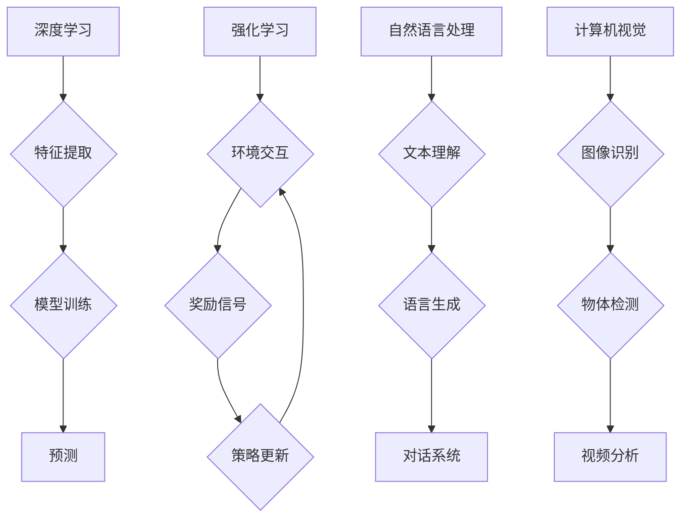

> 人工智能、深度学习、强化学习、自然语言处理、计算机视觉、伦理、可解释性、安全

## 1. 背景介绍

人工智能（AI）正以惊人的速度发展，从简单的规则系统演变为能够学习、适应和解决复杂问题的智能系统。近年来，深度学习的突破性进展推动了 AI 在各个领域的应用，例如图像识别、语音识别、自然语言处理等。然而，AI 发展也面临着诸多挑战，例如可解释性、安全性和伦理问题。

## 2. 核心概念与联系

**2.1 深度学习**

深度学习是一种机器学习的子领域，它利用多层神经网络来模拟人类大脑的学习过程。深度学习模型能够从海量数据中自动提取特征，从而实现更准确的预测和决策。

**2.2 强化学习**

强化学习是一种基于奖励机制的机器学习方法。在强化学习中，智能体通过与环境交互，学习最优的策略来最大化奖励。

**2.3 自然语言处理**

自然语言处理（NLP）是人工智能的一个重要分支，它致力于使计算机能够理解、处理和生成人类语言。NLP 技术广泛应用于聊天机器人、机器翻译、文本摘要等领域。

**2.4 计算机视觉**

计算机视觉是人工智能的一个重要领域，它致力于使计算机能够“看”和理解图像和视频。计算机视觉技术广泛应用于图像识别、物体检测、视频分析等领域。

**2.5 伦理与可解释性**

随着 AI 技术的快速发展，其伦理和可解释性问题也日益受到关注。如何确保 AI 系统的公平、透明和可控性，是人工智能发展面临的重要挑战。

**2.6 安全性**

AI 系统的安全性和可靠性至关重要。攻击者可能利用 AI 系统的漏洞进行恶意攻击，因此需要采取措施确保 AI 系统的安全。

**Mermaid 流程图**



## 3. 核心算法原理 & 具体操作步骤

### 3.1 算法原理概述

深度学习算法的核心是多层神经网络。神经网络由多个层组成，每层包含多个神经元。每个神经元接收来自上一层的输入，并通过权重进行加权求和，然后经过激活函数进行非线性变换，最后输出到下一层。通过训练，神经网络的权重会不断调整，使得网络能够学习到数据的特征和规律。

### 3.2 算法步骤详解

1. **数据预处理:** 将原始数据转换为深度学习模型可以理解的格式，例如归一化、编码等。
2. **网络结构设计:** 根据任务需求设计神经网络的结构，包括层数、神经元数量、激活函数等。
3. **模型训练:** 使用训练数据训练神经网络，通过反向传播算法调整网络权重，使得模型的预测结果与真实值尽可能接近。
4. **模型评估:** 使用测试数据评估模型的性能，例如准确率、召回率等。
5. **模型部署:** 将训练好的模型部署到实际应用场景中。

### 3.3 算法优缺点

**优点:**

* 能够自动提取特征，无需人工特征工程。
* 能够处理海量数据，学习到更复杂的模式。
* 在图像识别、语音识别、自然语言处理等领域取得了突破性进展。

**缺点:**

* 训练数据量大，需要大量的计算资源。
* 模型解释性差，难以理解模型的决策过程。
* 容易受到数据偏差的影响，导致模型存在偏见。

### 3.4 算法应用领域

深度学习算法广泛应用于以下领域:

* **计算机视觉:** 图像识别、物体检测、图像分割、视频分析等。
* **自然语言处理:** 机器翻译、文本摘要、情感分析、聊天机器人等。
* **语音识别:** 语音转文本、语音助手等。
* **推荐系统:** 商品推荐、内容推荐等。
* **医疗诊断:** 疾病诊断、影像分析等。

## 4. 数学模型和公式 & 详细讲解 & 举例说明

### 4.1 数学模型构建

深度学习模型的数学基础是神经网络。神经网络可以看作是一个由多个层组成的图结构，每个节点代表一个神经元，连接代表权重。

**神经元模型:**

$$
y = f(w^T x + b)
$$

其中：

* $y$ 是神经元的输出
* $x$ 是输入向量
* $w$ 是权重向量
* $b$ 是偏置项
* $f$ 是激活函数

**损失函数:**

损失函数用于衡量模型预测结果与真实值的差距。常用的损失函数包括均方误差（MSE）、交叉熵损失等。

**优化算法:**

优化算法用于更新模型参数，使得损失函数最小化。常用的优化算法包括梯度下降、Adam等。

### 4.2 公式推导过程

**反向传播算法:**

反向传播算法用于计算梯度，并更新模型参数。其核心思想是通过链式法则，将损失函数对每个参数的梯度计算出来。

### 4.3 案例分析与讲解

**图像分类:**

假设我们有一个图像分类任务，目标是将图像分类为不同的类别。我们可以使用卷积神经网络（CNN）来解决这个问题。CNN 可以自动学习图像特征，并将其用于分类。

## 5. 项目实践：代码实例和详细解释说明

### 5.1 开发环境搭建

* Python 3.x
* TensorFlow 或 PyTorch
* CUDA 和 cuDNN (可选，用于 GPU 加速)

### 5.2 源代码详细实现

```python
import tensorflow as tf

# 定义模型结构
model = tf.keras.models.Sequential([
    tf.keras.layers.Conv2D(32, (3, 3), activation='relu', input_shape=(28, 28, 1)),
    tf.keras.layers.MaxPooling2D((2, 2)),
    tf.keras.layers.Conv2D(64, (3, 3), activation='relu'),
    tf.keras.layers.MaxPooling2D((2, 2)),
    tf.keras.layers.Flatten(),
    tf.keras.layers.Dense(10, activation='softmax')
])

# 编译模型
model.compile(optimizer='adam',
              loss='sparse_categorical_crossentropy',
              metrics=['accuracy'])

# 训练模型
model.fit(x_train, y_train, epochs=5)

# 评估模型
loss, accuracy = model.evaluate(x_test, y_test)
print('Test loss:', loss)
print('Test accuracy:', accuracy)
```

### 5.3 代码解读与分析

* 代码首先定义了一个卷积神经网络模型，包含卷积层、池化层和全连接层。
* 然后，模型被编译，指定了优化器、损失函数和评估指标。
* 接着，模型使用训练数据进行训练，训练过程会迭代地更新模型参数。
* 最后，模型使用测试数据进行评估，并打印出测试损失和准确率。

### 5.4 运行结果展示

运行结果会显示出模型在测试集上的损失和准确率。

## 6. 实际应用场景

### 6.1 医疗诊断

AI 算法可以用于辅助医生进行疾病诊断，例如分析医学影像、预测患者风险等。

### 6.2 金融风险管理

AI 算法可以用于识别金融欺诈、评估信用风险等。

### 6.3 自动驾驶

AI 算法是自动驾驶汽车的核心技术，用于感知环境、规划路径、控制车辆等。

### 6.4 未来应用展望

AI 技术的未来应用前景广阔，例如：

* **个性化教育:** 根据学生的学习情况提供个性化的学习方案。
* **智能家居:** 通过 AI 算法，实现智能家居的自动化控制和个性化服务。
* **精准医疗:** 基于患者的基因信息和生活习惯，提供个性化的医疗方案。

## 7. 工具和资源推荐

### 7.1 学习资源推荐

* **在线课程:** Coursera、edX、Udacity 等平台提供丰富的 AI 课程。
* **书籍:** 《深度学习》、《人工智能：一种现代方法》等。
* **博客和论坛:** TensorFlow、PyTorch 等框架的官方博客和论坛。

### 7.2 开发工具推荐

* **TensorFlow:** Google 开发的开源机器学习框架。
* **PyTorch:** Facebook 开发的开源机器学习框架。
* **Keras:** TensorFlow 上的深度学习 API。

### 7.3 相关论文推荐

* **《ImageNet Classification with Deep Convolutional Neural Networks》**
* **《Attention Is All You Need》**
* **《Generative Adversarial Networks》**

## 8. 总结：未来发展趋势与挑战

### 8.1 研究成果总结

近年来，AI 技术取得了显著进展，例如深度学习算法的突破、强化学习的应用扩展、自然语言处理的飞速发展等。

### 8.2 未来发展趋势

* **模型规模和能力的提升:** 未来 AI 模型将更加强大，能够处理更复杂的任务。
* **模型解释性和可控性的增强:** 研究者将致力于开发更可解释和可控的 AI 模型。
* **边缘计算和联邦学习的应用:** AI 模型将部署到边缘设备，并通过联邦学习的方式进行训练，提高隐私保护和效率。
* **跨模态学习:** AI 模型将能够处理多种模态数据，例如文本、图像、音频等。

### 8.3 面临的挑战

* **数据获取和隐私保护:** AI 模型需要大量数据进行训练，如何获取高质量数据并保护用户隐私是一个挑战。
* **算法公平性和可解释性:** AI 模型可能存在偏见，难以解释其决策过程，需要解决这些问题。
* **安全性和可靠性:** AI 系统的安全性和可靠性至关重要，需要采取措施防止恶意攻击和意外故障。

### 8.4 研究展望

未来 AI 研究将继续探索新的算法、模型和应用场景，推动 AI 技术的持续发展，并为人类社会带来更多福祉。

## 9. 附录：常见问题与解答

**Q1: 深度学习和机器学习有什么区别？**

**A1:** 机器学习是人工智能的一个子领域，它旨在让计算机从数据中学习，而深度学习是机器学习的一种特殊形式，它使用多层神经网络来模拟人类大脑的学习过程。

**Q2: 如何选择合适的 AI 框架？**

**A2:** TensorFlow 和 PyTorch 是两个流行的 AI 框架，TensorFlow 更适合于生产环境，PyTorch 更适合于研究和开发。

**Q3: 如何解决 AI 模型的偏见问题？**

**A3:** 

* 使用更公平的训练数据。
* 在训练过程中加入公平性约束。
* 对模型进行解释和评估，识别和解决偏见。

**作者：禅与计算机程序设计艺术 / Zen and the Art of Computer Programming**<end_of_turn>

<end_of_turn>