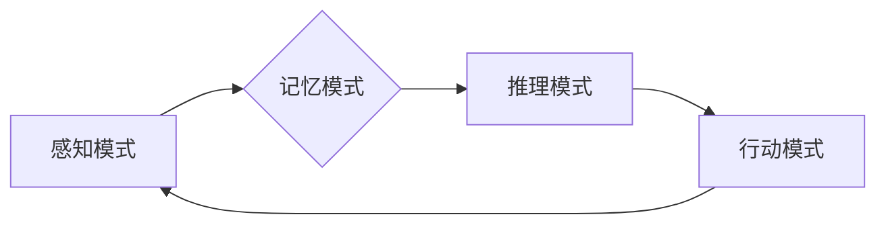

> 人类认知，认知空间，物理空间，模式识别，神经网络，机器学习，深度学习

## 1. 背景介绍

人类认知是一个复杂而迷人的领域，它涉及到感知、记忆、语言、推理和决策等多种高级功能。长期以来，科学家们一直试图揭示人类认知的奥秘，并将其应用于人工智能领域。

传统的人工智能方法主要依赖于符号逻辑和规则系统，但这些方法在处理复杂、模糊和不确定性问题时表现不佳。近年来，随着深度学习技术的兴起，人工智能领域取得了长足的进步，特别是图像识别、自然语言处理等领域。深度学习算法能够从海量数据中学习复杂的模式，从而实现更接近人类认知的智能。

然而，深度学习算法仍然存在一些局限性，例如：

* **缺乏可解释性:** 深度学习模型的决策过程往往是黑箱，难以解释其背后的逻辑。
* **数据依赖性:** 深度学习算法需要大量的训练数据，而获取高质量的训练数据往往成本高昂。
* **泛化能力有限:** 深度学习模型在面对新的数据或场景时，其性能可能下降。

为了克服这些局限性，我们需要深入理解人类认知的机制，并将其应用于人工智能算法的设计和优化。

## 2. 核心概念与联系

人类认知可以被概括为四种基本模式：

1. **感知模式:** 接收来自外部世界的感官信息，并将其转换为大脑可以理解的信号。
2. **记忆模式:** 存储和检索感知到的信息，并将其与过去的经验联系起来。
3. **推理模式:** 分析和解释信息，并做出决策或预测。
4. **行动模式:** 根据决策或预测，执行相应的动作。

这些模式相互关联，共同构成人类认知的完整体系。

**Mermaid 流程图:**



## 3. 核心算法原理 & 具体操作步骤

### 3.1  算法原理概述

为了模拟人类认知的四种基本模式，我们可以设计相应的算法。例如，我们可以使用卷积神经网络来模拟感知模式，循环神经网络来模拟记忆模式，强化学习算法来模拟推理模式，以及机器人控制算法来模拟行动模式。

### 3.2  算法步骤详解

**感知模式:**

1. 收集感官数据，例如图像、音频、文本等。
2. 使用卷积神经网络对数据进行特征提取。
3. 将提取的特征转换为大脑可以理解的信号。

**记忆模式:**

1. 将感知到的信息存储在记忆库中。
2. 使用循环神经网络对记忆库中的信息进行编码和解码。
3. 根据需要检索和利用记忆信息。

**推理模式:**

1. 使用强化学习算法训练一个代理，使其能够在虚拟环境中学习和决策。
2. 代理通过与环境交互，获得奖励和惩罚信号。
3. 代理根据奖励和惩罚信号，调整其策略，以最大化奖励。

**行动模式:**

1. 根据推理结果，生成相应的动作指令。
2. 将动作指令发送到执行器，例如机器人手臂或语音合成器。
3. 执行器执行动作指令，并反馈结果。

### 3.3  算法优缺点

**优点:**

* 可以模拟人类认知的多种功能。
* 能够处理复杂、模糊和不确定性问题。
* 具有较强的学习和适应能力。

**缺点:**

* 算法复杂度高，需要大量的计算资源。
* 训练数据量大，获取成本高昂。
* 缺乏可解释性，难以理解算法的决策过程。

### 3.4  算法应用领域

* **机器人学:** 开发能够自主学习和决策的机器人。
* **自然语言处理:** 理解和生成人类语言。
* **计算机视觉:** 识别和理解图像和视频。
* **医疗诊断:** 辅助医生进行疾病诊断。

## 4. 数学模型和公式 & 详细讲解 & 举例说明

### 4.1  数学模型构建

人类认知可以抽象为一个复杂的数学模型，其中包括感知、记忆、推理和行动等多个模块。每个模块都可以用数学公式来描述其内部机制。例如，感知模块可以使用卷积神经网络的激活函数来描述神经元的兴奋程度，记忆模块可以使用循环神经网络的隐藏状态来表示记忆信息，推理模块可以使用强化学习算法的价值函数来评估不同决策的优劣。

### 4.2  公式推导过程

为了构建完整的数学模型，需要对每个模块的数学公式进行推导。例如，卷积神经网络的激活函数通常是 sigmoid 函数或 ReLU 函数，其表达式分别为：

$$
\sigma(x) = \frac{1}{1 + e^{-x}}
$$

$$
ReLU(x) = max(0, x)
$$

循环神经网络的隐藏状态更新公式通常是基于门控机制的，例如 LSTM 网络的隐藏状态更新公式如下：

$$
h_t = f_t \cdot h_{t-1} + i_t \cdot \tilde{h}_t
$$

其中，$h_t$ 是当前时间步的隐藏状态，$h_{t-1}$ 是上一个时间步的隐藏状态，$f_t$ 是遗忘门，$i_t$ 是输入门，$\tilde{h}_t$ 是候选隐藏状态。

### 4.3  案例分析与讲解

我们可以通过分析具体的案例来理解这些数学模型的应用。例如，在图像识别任务中，卷积神经网络可以提取图像的特征，循环神经网络可以用于识别图像中的物体序列，强化学习算法可以训练一个代理，使其能够在图像中找到目标物体。

## 5. 项目实践：代码实例和详细解释说明

### 5.1  开发环境搭建

为了实现上述算法，我们需要搭建一个合适的开发环境。常用的开发环境包括 Python、TensorFlow、PyTorch 等。

### 5.2  源代码详细实现

以下是一个简单的卷积神经网络代码示例，用于图像分类任务：

```python
import tensorflow as tf

# 定义模型结构
model = tf.keras.models.Sequential([
    tf.keras.layers.Conv2D(32, (3, 3), activation='relu', input_shape=(28, 28, 1)),
    tf.keras.layers.MaxPooling2D((2, 2)),
    tf.keras.layers.Conv2D(64, (3, 3), activation='relu'),
    tf.keras.layers.MaxPooling2D((2, 2)),
    tf.keras.layers.Flatten(),
    tf.keras.layers.Dense(10, activation='softmax')
])

# 编译模型
model.compile(optimizer='adam',
              loss='sparse_categorical_crossentropy',
              metrics=['accuracy'])

# 训练模型
model.fit(x_train, y_train, epochs=5)

# 评估模型
loss, accuracy = model.evaluate(x_test, y_test)
print('Test loss:', loss)
print('Test accuracy:', accuracy)
```

### 5.3  代码解读与分析

这段代码定义了一个简单的卷积神经网络模型，用于图像分类任务。模型包含两个卷积层、两个最大池化层、一个全连接层和一个输出层。

* 卷积层用于提取图像特征。
* 最大池化层用于降低特征图的维度，提高模型的鲁棒性。
* 全连接层用于将提取的特征映射到输出类别。
* 输出层使用 softmax 函数将输出概率分布化。

### 5.4  运行结果展示

训练完成后，我们可以使用测试数据评估模型的性能。

## 6. 实际应用场景

### 6.1  医疗诊断

深度学习算法可以用于分析医学图像，辅助医生进行疾病诊断。例如，可以训练一个模型来识别肺癌、乳腺癌等疾病。

### 6.2  金融风险评估

深度学习算法可以用于分析金融数据，评估投资风险。例如，可以训练一个模型来预测股票价格波动。

### 6.3  智能客服

深度学习算法可以用于开发智能客服系统，自动回答用户问题。例如，可以训练一个模型来理解用户的自然语言输入，并提供相应的回复。

### 6.4  未来应用展望

随着深度学习技术的不断发展，其应用场景将更加广泛。例如，未来可能应用于自动驾驶、个性化教育、精准医疗等领域。

## 7. 工具和资源推荐

### 7.1  学习资源推荐

* **书籍:**
    * 深度学习
    * 人工智能：一种现代方法
* **在线课程:**
    * Coursera 深度学习课程
    * Udacity 深度学习工程师 Nanodegree

### 7.2  开发工具推荐

* **TensorFlow:** 开源深度学习框架
* **PyTorch:** 开源深度学习框架
* **Keras:** 高级深度学习API

### 7.3  相关论文推荐

* **AlexNet:** ImageNet Classification with Deep Convolutional Neural Networks
* **VGGNet:** Very Deep Convolutional Networks for Large-Scale Image Recognition
* **ResNet:** Deep Residual Learning for Image Recognition

## 8. 总结：未来发展趋势与挑战

### 8.1  研究成果总结

近年来，深度学习算法取得了长足的进步，在图像识别、自然语言处理等领域取得了突破性进展。

### 8.2  未来发展趋势

未来，深度学习算法将朝着以下方向发展：

* **更深更广的网络结构:** 探索更深层次、更广阔的网络结构，以提高模型的表达能力和泛化能力。
* **自监督学习:** 利用无标签数据进行自监督学习，降低对标注数据的依赖。
* **联邦学习:** 在保护数据隐私的前提下，实现模型的分布式训练。

### 8.3  面临的挑战

深度学习算法仍然面临一些挑战，例如：

* **可解释性:** 深度学习模型的决策过程难以解释，这限制了其在一些安全关键领域中的应用。
* **数据效率:** 深度学习算法对训练数据的需求量大，获取高质量的训练数据成本高昂。
* **公平性:** 深度学习模型可能存在偏见，导致不公平的结果。

### 8.4  研究展望

未来，我们需要继续深入研究深度学习算法的原理和机制，解决其面临的挑战，并将其应用于更多领域，为人类社会带来更多福祉。

## 9. 附录：常见问题与解答

### 9.1  Q1: 深度学习和传统机器学习有什么区别？

### 9.2  Q2: 如何选择合适的深度学习框架？

### 9.3  Q3: 如何评估深度学习模型的性能？

### 9.4  Q4: 如何解决深度学习模型的过拟合问题？

### 9.5  Q5: 深度学习的未来发展趋势是什么？


作者：禅与计算机程序设计艺术 / Zen and the Art of Computer Programming 
<end_of_turn>