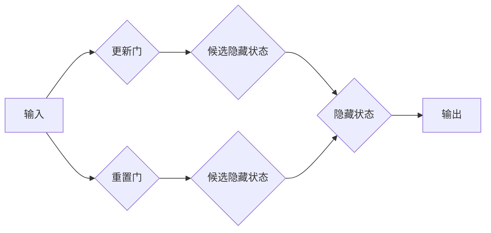

> GRU,循环神经网络,长短期记忆网络,深度学习,自然语言处理

## 1. 背景介绍

在深度学习领域，循环神经网络（RNN）因其能够处理序列数据的能力而备受关注。然而，传统的RNN模型存在梯度消失或爆炸的问题，难以捕捉长序列中的依赖关系。为了解决这个问题，提出了许多改进型RNN结构，其中包括长短期记忆网络（LSTM）和门控循环单元（GRU）。

GRU是一种相对较新的RNN变体，它在结构上比LSTM更简洁，但仍然能够有效地捕捉长序列中的依赖关系。GRU在自然语言处理、语音识别、机器翻译等领域表现出色，并逐渐成为深度学习模型中常用的组件。

## 2. 核心概念与联系

GRU是一种门控循环单元，它通过引入“更新门”和“重置门”来控制信息的流动。

**Mermaid 流程图：**



**核心概念：**

* **更新门：** 控制旧隐藏状态与候选隐藏状态的融合程度。
* **重置门：** 控制当前输入与历史隐藏状态的关联程度。
* **候选隐藏状态：** 基于当前输入和历史隐藏状态计算出的新的隐藏状态。
* **隐藏状态：** GRU网络的记忆单元，存储了序列中已经处理的信息。

## 3. 核心算法原理 & 具体操作步骤

### 3.1  算法原理概述

GRU的算法原理基于门控机制，通过更新门和重置门来控制信息的流动。

* **更新门：** 计算当前输入和历史隐藏状态的线性组合，并通过sigmoid函数将其压缩到0到1之间。更新门的值决定了旧隐藏状态在更新新的隐藏状态中的权重。
* **重置门：** 计算当前输入和历史隐藏状态的线性组合，并通过sigmoid函数将其压缩到0到1之间。重置门的值决定了历史隐藏状态在计算候选隐藏状态中的影响程度。
* **候选隐藏状态：** 计算当前输入和历史隐藏状态的线性组合，并通过tanh函数将其压缩到-1到1之间。候选隐藏状态代表了当前输入和历史信息融合后的新的隐藏状态。
* **隐藏状态：** 将候选隐藏状态与旧隐藏状态进行加权融合，得到新的隐藏状态。

### 3.2  算法步骤详解

1. **输入数据：** 将序列数据输入到GRU网络中。
2. **更新门计算：** 计算更新门的激活值，控制旧隐藏状态在更新新的隐藏状态中的权重。
3. **重置门计算：** 计算重置门的激活值，控制历史隐藏状态在计算候选隐藏状态中的影响程度。
4. **候选隐藏状态计算：** 计算候选隐藏状态，代表了当前输入和历史信息融合后的新的隐藏状态。
5. **隐藏状态更新：** 将候选隐藏状态与旧隐藏状态进行加权融合，得到新的隐藏状态。
6. **输出结果：** 将新的隐藏状态作为输出，用于后续的处理或预测。

### 3.3  算法优缺点

**优点：**

* 结构简单，参数少于LSTM，训练速度更快。
* 能够有效地捕捉长序列中的依赖关系。
* 在许多自然语言处理任务中表现出色。

**缺点：**

* 相比LSTM，表达能力略逊一筹。
* 对于非常长的序列，仍然可能存在梯度消失的问题。

### 3.4  算法应用领域

GRU在以下领域具有广泛的应用：

* **自然语言处理：** 文本分类、情感分析、机器翻译、文本生成等。
* **语音识别：** 语音转文本、语音合成等。
* **时间序列分析：** 股票预测、天气预报等。
* **图像识别：** 视频分析、目标跟踪等。

## 4. 数学模型和公式 & 详细讲解 & 举例说明

### 4.1  数学模型构建

GRU的数学模型可以表示为以下公式：

* 更新门：

$$z_t = \sigma(W_z \cdot [h_{t-1}, x_t] + b_z)$$

* 重置门：

$$r_t = \sigma(W_r \cdot [h_{t-1}, x_t] + b_r)$$

* 候选隐藏状态：

$$\tilde{h}_t = \tanh(W \cdot [r_t \cdot h_{t-1}, x_t] + b)$$

* 隐藏状态：

$$h_t = (1 - z_t) \cdot h_{t-1} + z_t \cdot \tilde{h}_t$$

其中：

* $z_t$：更新门
* $r_t$：重置门
* $\tilde{h}_t$：候选隐藏状态
* $h_t$：隐藏状态
* $h_{t-1}$：上一个时间步的隐藏状态
* $x_t$：当前时间步的输入
* $W_z$、$W_r$、$W$：权重矩阵
* $b_z$、$b_r$、$b$：偏置项
* $\sigma$：sigmoid函数
* $\tanh$：tanh函数

### 4.2  公式推导过程

GRU的公式推导过程基于门控机制和循环神经网络的基本原理。

* 更新门和重置门分别控制旧隐藏状态和历史隐藏状态在更新新的隐藏状态中的权重。
* 候选隐藏状态通过当前输入和历史信息进行线性组合，并通过tanh函数进行压缩。
* 隐藏状态通过更新门和候选隐藏状态进行加权融合，得到新的隐藏状态。

### 4.3  案例分析与讲解

假设我们有一个简单的序列数据：

```
[“我”, “爱”, “学习”, “编程”]
```

我们可以使用GRU模型来预测下一个词。

1. 首先，将序列数据输入到GRU网络中。
2. GRU网络会根据输入数据计算更新门、重置门和候选隐藏状态。
3. 然后，GRU网络会根据更新门和候选隐藏状态更新隐藏状态。
4. 最后，GRU网络会将更新后的隐藏状态作为输出，用于预测下一个词。

## 5. 项目实践：代码实例和详细解释说明

### 5.1  开发环境搭建

* Python 3.6+
* TensorFlow 2.0+
* Keras 2.0+

### 5.2  源代码详细实现

```python
from tensorflow.keras.models import Sequential
from tensorflow.keras.layers import GRU, Dense

# 定义GRU模型
model = Sequential()
model.add(GRU(units=128, return_sequences=True, input_shape=(timesteps, features)))
model.add(GRU(units=64))
model.add(Dense(units=vocab_size, activation='softmax'))

# 编译模型
model.compile(loss='categorical_crossentropy', optimizer='adam', metrics=['accuracy'])

# 训练模型
model.fit(x_train, y_train, epochs=10, batch_size=32)

# 评估模型
loss, accuracy = model.evaluate(x_test, y_test)
print('Loss:', loss)
print('Accuracy:', accuracy)
```

### 5.3  代码解读与分析

* `Sequential()`：定义一个顺序模型，层级结构清晰。
* `GRU(units=128, return_sequences=True)`：添加一个GRU层，units参数指定隐藏单元个数，return_sequences=True表示返回所有时间步的隐藏状态。
* `GRU(units=64)`：添加另一个GRU层，用于进一步提取特征。
* `Dense(units=vocab_size, activation='softmax')`：添加一个全连接层，输出层单元个数等于词汇表大小，使用softmax激活函数进行概率分布输出。
* `compile()`：编译模型，指定损失函数、优化器和评价指标。
* `fit()`：训练模型，输入训练数据和超参数。
* `evaluate()`：评估模型，输入测试数据并计算损失和准确率。

### 5.4  运行结果展示

训练完成后，可以将模型应用于新的文本数据进行预测。

## 6. 实际应用场景

### 6.1  自然语言处理

* **文本分类：** 使用GRU模型对文本进行分类，例如情感分析、主题分类等。
* **机器翻译：** 使用GRU模型将文本从一种语言翻译成另一种语言。
* **文本生成：** 使用GRU模型生成新的文本，例如诗歌、小说等。

### 6.2  语音识别

* **语音转文本：** 使用GRU模型将语音信号转换为文本。
* **语音合成：** 使用GRU模型将文本转换为语音信号。

### 6.3  时间序列分析

* **股票预测：** 使用GRU模型预测股票价格的未来走势。
* **天气预报：** 使用GRU模型预测未来天气状况。

### 6.4  未来应用展望

GRU模型在未来将有更广泛的应用，例如：

* **对话系统：** 使用GRU模型构建更智能的对话系统，能够更好地理解用户的意图。
* **个性化推荐：** 使用GRU模型分析用户的行为数据，提供个性化的推荐。
* **医疗诊断：** 使用GRU模型分析患者的医疗数据，辅助医生进行诊断。

## 7. 工具和资源推荐

### 7.1  学习资源推荐

* **书籍：**
    * 《深度学习》
    * 《自然语言处理》
* **在线课程：**
    * Coursera: 深度学习
    * Udacity: 自然语言处理
* **博客和网站：**
    * TensorFlow Blog
    * Keras Blog

### 7.2  开发工具推荐

* **TensorFlow:** 开源深度学习框架
* **Keras:** 高级API，简化TensorFlow的使用
* **PyTorch:** 另一个流行的深度学习框架

### 7.3  相关论文推荐

* **Learning Phrase Representations using RNN Encoder-Decoder for Statistical Machine Translation**
* **Sequence to Sequence Learning with Neural Networks**
* **Empirical Evaluation of Gated Recurrent Neural Networks on Sequence Modeling**

## 8. 总结：未来发展趋势与挑战

### 8.1  研究成果总结

GRU模型是一种高效的RNN变体，能够有效地捕捉长序列中的依赖关系。它在自然语言处理、语音识别、时间序列分析等领域取得了显著的成果。

### 8.2  未来发展趋势

* **模型架构改进：** 研究更复杂的GRU模型架构，提高模型的表达能力和泛化能力。
* **训练方法优化：** 开发新的训练方法，例如自监督学习、迁移学习，提高模型的训练效率和性能。
* **应用领域拓展：** 将GRU模型应用于更多新的领域，例如医疗诊断、金融预测等。

### 8.3  面临的挑战

* **梯度消失问题：** 对于非常长的序列，GRU模型仍然可能存在梯度消失的问题。
* **计算资源需求：** 训练大型GRU模型需要大量的计算资源。
* **数据标注成本：** 许多应用场景需要大量的标注数据，这会导致数据标注成本较高。

### 8.4  研究展望

未来，GRU模型的研究将继续朝着更强大、更灵活、更易于应用的方向发展。


## 9. 附录：常见问题与解答

**Q1：GRU和LSTM的区别是什么？**

**A1：** GRU和LSTM都是门控循环单元，但GRU的结构更简单，参数更少。LSTM具有更强的表达能力，但训练速度较慢。

**Q2：如何选择GRU的隐藏单元个数？**

**A2：** 隐藏单元个数的选择取决于数据的复杂性和模型的规模。一般来说，可以从较小的隐藏单元个数开始，逐步增加，直到达到最佳性能。

**Q3：如何处理长序列