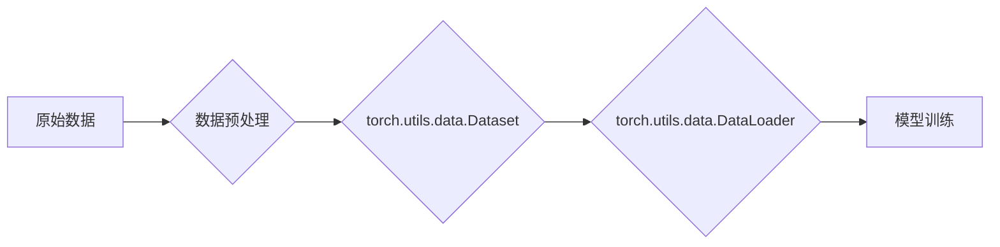

> 大模型开发, 微调, torch.utils.data.Dataset, 自定义数据集, 数据预处理, PyTorch

## 1. 背景介绍

近年来，大模型在自然语言处理、计算机视觉、语音识别等领域取得了突破性进展，展现出强大的学习能力和泛化能力。然而，大模型的训练成本高昂，对算力和数据资源要求极高。因此，如何高效地开发和微调大模型，使其能够在有限资源下发挥最佳性能，成为一个重要的研究方向。

自定义数据集是微调大模型的关键步骤之一。通过对特定领域的文本、图像或音频数据进行预处理和封装，可以帮助模型更好地理解和处理相关任务。PyTorch 提供了 `torch.utils.data.Dataset` 类，用于定义自定义数据集，并提供了丰富的接口，方便数据加载、转换和迭代。

本篇文章将深入探讨如何使用 `torch.utils.data.Dataset` 封装自定义数据集，并结合实际案例，详细介绍大模型开发和微调的流程。

## 2. 核心概念与联系

### 2.1 torch.utils.data.Dataset

`torch.utils.data.Dataset` 是 PyTorch 中用于定义自定义数据集的基类。它提供了一个统一的接口，用于访问和处理数据。

### 2.2 DataLoader

`torch.utils.data.DataLoader` 是 PyTorch 中用于加载和迭代数据集的类。它可以根据指定的 batch size、shuffle 等参数，将数据集分成批次，并提供迭代器接口，方便模型训练和评估。

### 2.3 数据预处理

数据预处理是指对原始数据进行一系列操作，使其更适合模型训练。常见的预处理步骤包括：

* 文本数据：分词、词嵌入、去除停用词等
* 图像数据：裁剪、缩放、归一化等
* 音频数据：采样率转换、降噪等

### 2.4 数据集封装流程



## 3. 核心算法原理 & 具体操作步骤

### 3.1 算法原理概述

`torch.utils.data.Dataset` 的核心原理是提供一个统一的接口，用于访问和处理数据。它通过重写 `__len__` 和 `__getitem__` 方法，实现对数据的访问和迭代。

* `__len__` 方法返回数据集的大小。
* `__getitem__` 方法根据索引返回对应的数据样本。

### 3.2 算法步骤详解

1. **继承 `torch.utils.data.Dataset` 类:** 创建自定义数据集类，并继承 `torch.utils.data.Dataset` 类。
2. **定义 `__init__` 方法:** 在 `__init__` 方法中，初始化数据集的属性，例如数据路径、数据格式等。
3. **实现 `__len__` 方法:** 返回数据集的大小。
4. **实现 `__getitem__` 方法:** 根据索引返回对应的数据样本。
5. **创建 DataLoader:** 使用 `torch.utils.data.DataLoader` 类创建 DataLoader 对象，并指定 batch size、shuffle 等参数。

### 3.3 算法优缺点

**优点:**

* 提供统一的接口，方便数据访问和迭代。
* 支持自定义数据格式和预处理逻辑。
* 可以方便地进行数据增广和随机采样。

**缺点:**

* 需要手动实现数据加载和预处理逻辑。
* 对数据格式和预处理逻辑的定义较为复杂。

### 3.4 算法应用领域

`torch.utils.data.Dataset` 广泛应用于各种深度学习任务，例如：

* 自然语言处理：文本分类、情感分析、机器翻译等
* 计算机视觉：图像分类、目标检测、图像分割等
* 语音识别：语音识别、语音合成等

## 4. 数学模型和公式 & 详细讲解 & 举例说明

### 4.1 数学模型构建

在使用 `torch.utils.data.Dataset` 封装自定义数据集时，需要根据具体任务和数据特点构建相应的数学模型。例如，对于文本分类任务，可以使用词嵌入模型将文本表示为向量，然后使用神经网络进行分类。

### 4.2 公式推导过程

对于文本分类任务，可以使用 softmax 函数计算每个类别的概率分布。

$$
P(y|x) = \frac{e^{s_y}}{\sum_{k=1}^{K} e^{s_k}}
$$

其中：

* $P(y|x)$ 是给定输入 $x$ 的情况下，类别 $y$ 的概率。
* $s_y$ 是类别 $y$ 的得分。
* $K$ 是类别总数。

### 4.3 案例分析与讲解

假设我们有一个文本分类任务，需要将文本分类为正向情感和负向情感。我们可以使用 Word2Vec 模型将文本表示为向量，然后使用一个两层神经网络进行分类。

第一层神经网络使用 ReLU 激活函数，第二层神经网络使用 softmax 激活函数。

## 5. 项目实践：代码实例和详细解释说明

### 5.1 开发环境搭建

* Python 3.7+
* PyTorch 1.7+
* NumPy
* Pandas

### 5.2 源代码详细实现

```python
import torch
from torch.utils.data import Dataset, DataLoader

class CustomDataset(Dataset):
    def __init__(self, data_path):
        self.data = torch.load(data_path)

    def __len__(self):
        return len(self.data)

    def __getitem__(self, idx):
        return self.data[idx]

# 数据路径
data_path = 'data.pt'

# 创建自定义数据集
dataset = CustomDataset(data_path)

# 创建 DataLoader
dataloader = DataLoader(dataset, batch_size=32, shuffle=True)

# 迭代数据
for batch in dataloader:
    print(batch.shape)
```

### 5.3 代码解读与分析

* `CustomDataset` 类继承自 `torch.utils.data.Dataset` 类，实现了 `__len__` 和 `__getitem__` 方法。
* `__len__` 方法返回数据集的大小。
* `__getitem__` 方法根据索引返回对应的数据样本。
* `DataLoader` 类用于加载和迭代数据集，可以指定 batch size、shuffle 等参数。

### 5.4 运行结果展示

运行代码后，会输出每个批次的形状，例如：

```
torch.Size([32, 10])
```

表示每个批次包含 32 个样本，每个样本的维度为 10。

## 6. 实际应用场景

### 6.1 文本分类

使用 `torch.utils.data.Dataset` 封装文本数据，可以用于训练文本分类模型，例如情感分析、主题分类等。

### 6.2 图像识别

使用 `torch.utils.data.Dataset` 封装图像数据，可以用于训练图像识别模型，例如物体检测、图像分割等。

### 6.3 语音识别

使用 `torch.utils.data.Dataset` 封装音频数据，可以用于训练语音识别模型，例如语音转文本等。

### 6.4 未来应用展望

随着大模型的发展，`torch.utils.data.Dataset` 将在更多领域得到应用，例如：

* 医疗诊断
* 金融预测
* 自动驾驶

## 7. 工具和资源推荐

### 7.1 学习资源推荐

* PyTorch 官方文档：https://pytorch.org/docs/stable/index.html
* 深度学习入门教程：https://www.deeplearningbook.org/

### 7.2 开发工具推荐

* Jupyter Notebook
* VS Code

### 7.3 相关论文推荐

* Attention Is All You Need: https://arxiv.org/abs/1706.03762
* BERT: Pre-training of Deep Bidirectional Transformers for Language Understanding: https://arxiv.org/abs/1810.04805

## 8. 总结：未来发展趋势与挑战

### 8.1 研究成果总结

本文介绍了如何使用 `torch.utils.data.Dataset` 封装自定义数据集，并结合实际案例，详细介绍了大模型开发和微调的流程。

### 8.2 未来发展趋势

* 数据集规模和多样性将不断增加。
* 数据预处理和增广技术将更加智能化和自动化。
* 模型训练和微调方法将更加高效和灵活。

### 8.3 面临的挑战

* 数据标注成本高昂。
* 模型训练和部署资源需求大。
* 模型解释性和可解释性不足。

### 8.4 研究展望

未来，我们将继续探索大模型开发和微调的新方法，以提高模型性能、降低训练成本，并使其能够更好地服务于社会。

## 9. 附录：常见问题与解答

### 9.1 如何处理缺失数据？

可以使用多种方法处理缺失数据，例如：

* 删除包含缺失数据的样本。
* 使用均值、中位数或众数填充缺失值。
* 使用机器学习模型预测缺失值。

### 9.2 如何进行数据增广？

数据增广是指对数据进行人工修改，以增加数据集的大小和多样性。常见的增广方法包括：

* 文本数据：词替换、句子重排序等
* 图像数据：旋转、缩放、裁剪等
* 音频数据：添加噪声、改变语速等

### 9.3 如何选择合适的 batch size？

batch size 的选择会影响模型的训练速度和性能。一般来说，较大的 batch size 可以提高训练速度，但可能会导致过拟合。较小的 batch size 可以降低过拟合风险，但训练速度会变慢。

作者：禅与计算机程序设计艺术 / Zen and the Art of Computer Programming


<end_of_turn>