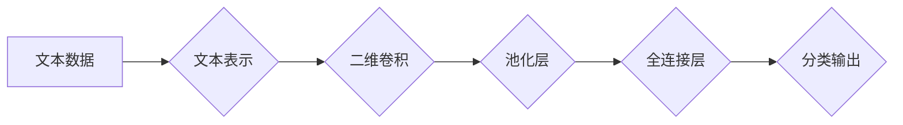

> 大模型开发，微调，卷积神经网络，文本分类，Conv2d，二维卷积，深度学习，自然语言处理

## 1. 背景介绍

在当今数据爆炸的时代，文本数据已成为重要的信息资源。如何有效地理解和处理文本信息，是自然语言处理（NLP）领域的核心问题之一。文本分类作为NLP的基础任务，在信息检索、情感分析、垃圾邮件过滤等领域有着广泛的应用。

传统的文本分类方法通常依赖于手工提取特征，例如词频统计、TF-IDF等。然而，这些方法难以捕捉文本中的语义关系和上下文信息，效果有限。随着深度学习的兴起，卷积神经网络（CNN）凭借其强大的特征提取能力，在文本分类任务中取得了显著的成果。

本文将从零开始，介绍如何使用Conv2d（二维卷积）构建一个文本分类模型。我们将深入探讨CNN的原理、算法步骤、数学模型以及代码实现，并结合实际应用场景，帮助读者理解和应用CNN在文本分类领域的应用。

## 2. 核心概念与联系

### 2.1 卷积神经网络（CNN）

CNN是一种专门用于处理图像数据的深度学习网络结构。其核心思想是利用卷积操作提取图像特征。卷积操作通过一个称为卷积核（filter）的模板，在图像上滑动，计算每个位置的特征响应。通过多个卷积层和池化层，CNN可以逐层提取图像的抽象特征，最终实现图像分类、目标检测等任务。

### 2.2 二维卷积（Conv2d）

二维卷积是CNN的核心操作之一。它将卷积核应用于图像的二维数据，提取图像局部特征。卷积核的尺寸和步长决定了卷积操作的感受野，即卷积核能够覆盖的图像区域。

### 2.3 文本表示

在CNN中，文本需要先转换为数字形式才能进行处理。常用的文本表示方法包括：

* **词向量（Word Embedding）：** 将每个词映射到一个低维向量空间，捕捉词语之间的语义关系。
* **词袋模型（Bag-of-Words）：** 将文本表示为词频向量，忽略词语的顺序信息。

### 2.4 文本分类任务

文本分类任务的目标是将文本数据分类到预定义的类别中。例如，情感分析任务的目标是将文本分类为正向情感、负向情感或中性情感。

**Mermaid 流程图**



## 3. 核心算法原理 & 具体操作步骤

### 3.1 算法原理概述

CNN文本分类模型的基本原理是：

1. 将文本数据转换为数字形式，例如词向量表示。
2. 使用二维卷积层提取文本特征。
3. 使用池化层降低特征维度，提高模型鲁棒性。
4. 使用全连接层进行分类决策。

### 3.2 算法步骤详解

1. **文本预处理:** 清洗文本数据，去除停用词、标点符号等，并将文本转换为词向量表示。
2. **二维卷积层:** 使用卷积核在文本向量上滑动，提取局部特征。每个卷积核对应一个特征通道，多个卷积核可以提取不同类型的特征。
3. **池化层:** 对卷积层的输出进行池化操作，例如最大池化，降低特征维度，提高模型鲁棒性。
4. **全连接层:** 将池化层的输出连接到全连接层，进行分类决策。全连接层输出的每个节点对应一个类别，通过softmax函数将输出转换为概率分布。

### 3.3 算法优缺点

**优点:**

* 能够有效地提取文本特征，捕捉语义关系和上下文信息。
* 鲁棒性强，对文本噪声和变动不敏感。
* 训练效率高，可以利用GPU加速训练。

**缺点:**

* 参数量较大，需要大量的训练数据。
* 对长文本的处理效果可能不如其他模型。

### 3.4 算法应用领域

CNN在文本分类任务中有着广泛的应用，例如：

* **情感分析:** 分析文本的情感倾向，例如正向、负向或中性。
* **垃圾邮件过滤:** 识别垃圾邮件，并将其过滤掉。
* **主题分类:** 将文本分类到预定义的主题类别中。
* **文本摘要:** 生成文本的简短摘要。

## 4. 数学模型和公式 & 详细讲解 & 举例说明

### 4.1 数学模型构建

假设输入文本序列长度为T，词向量维度为D。卷积核的尺寸为F，步长为S。则二维卷积操作可以表示为：

$$
y_{i,j} = \sum_{m=0}^{F-1} \sum_{n=0}^{F-1} x_{i+m,j+n} * w_{m,n} + b
$$

其中：

* $y_{i,j}$ 是卷积层的输出特征图上的第(i,j)个元素。
* $x_{i+m,j+n}$ 是输入文本序列的第(i+m,j+n)个词向量。
* $w_{m,n}$ 是卷积核的第(m,n)个元素。
* $b$ 是卷积层的偏置项。

### 4.2 公式推导过程

卷积操作本质上是将卷积核在输入数据上滑动，计算每个位置的特征响应。公式推导过程可以参考相关深度学习教材。

### 4.3 案例分析与讲解

假设输入文本序列为“我爱学习”，词向量维度为100。卷积核尺寸为3，步长为1。则卷积操作会生成一个特征图，其中每个元素代表了文本序列中对应位置的特征响应。

## 5. 项目实践：代码实例和详细解释说明

### 5.1 开发环境搭建

* Python 3.6+
* TensorFlow 2.0+
* Keras 2.0+
* Jupyter Notebook

### 5.2 源代码详细实现

```python
import tensorflow as tf
from tensorflow.keras.models import Sequential
from tensorflow.keras.layers import Embedding, Conv2D, MaxPooling2D, Flatten, Dense

# 定义模型
model = Sequential()
model.add(Embedding(input_dim=10000, output_dim=128, input_length=100))
model.add(Conv2D(filters=64, kernel_size=(3, 3), activation='relu'))
model.add(MaxPooling2D(pool_size=(2, 2)))
model.add(Flatten())
model.add(Dense(units=10, activation='softmax'))

# 编译模型
model.compile(optimizer='adam', loss='sparse_categorical_crossentropy', metrics=['accuracy'])

# 训练模型
model.fit(x_train, y_train, epochs=10, batch_size=32)

# 评估模型
loss, accuracy = model.evaluate(x_test, y_test)
print('Loss:', loss)
print('Accuracy:', accuracy)
```

### 5.3 代码解读与分析

* **Embedding层:** 将词向量表示转换为固定长度的向量。
* **Conv2D层:** 使用二维卷积提取文本特征。
* **MaxPooling2D层:** 对卷积层的输出进行最大池化，降低特征维度。
* **Flatten层:** 将多维特征转换为一维向量。
* **Dense层:** 全连接层，进行分类决策。

### 5.4 运行结果展示

训练完成后，可以评估模型的性能，例如准确率。

## 6. 实际应用场景

CNN文本分类模型在实际应用场景中有着广泛的应用，例如：

* **社交媒体监控:** 识别负面评论和恶意内容。
* **客户服务自动化:** 自动分类客户服务请求，提高响应效率。
* **新闻分类:** 将新闻文章分类到不同的类别，例如政治、体育、财经等。

### 6.4 未来应用展望

随着深度学习技术的不断发展，CNN文本分类模型的性能将不断提升，应用场景也将更加广泛。例如：

* **个性化推荐:** 根据用户的阅读历史和偏好，推荐相关的文章和内容。
* **机器翻译:** 利用CNN的特征提取能力，提高机器翻译的准确率。
* **文本生成:** 利用CNN的文本表示能力，生成高质量的文本内容。

## 7. 工具和资源推荐

### 7.1 学习资源推荐

* **深度学习书籍:**
    * 《深度学习》
    * 《动手学深度学习》
* **在线课程:**
    * Coursera: 深度学习
    * Udacity: 深度学习工程师

### 7.2 开发工具推荐

* **TensorFlow:** 开源深度学习框架
* **Keras:** 高级API，简化TensorFlow的使用
* **PyTorch:** 开源深度学习框架

### 7.3 相关论文推荐

* **AlexNet:** ImageNet Classification with Deep Convolutional Neural Networks
* **VGGNet:** Very Deep Convolutional Networks for Large-Scale Image Recognition
* **GoogLeNet:** Inception-v1: Going Deeper with Convolutions

## 8. 总结：未来发展趋势与挑战

### 8.1 研究成果总结

CNN文本分类模型在文本分类任务中取得了显著的成果，其强大的特征提取能力和鲁棒性使其成为文本分类领域的主流模型。

### 8.2 未来发展趋势

* **模型深度和复杂度:** 随着计算资源的提升，CNN模型的深度和复杂度将不断提高，从而提升模型的性能。
* **注意力机制:** 将注意力机制引入CNN模型，可以提高模型对文本中重要信息的关注度，从而提升模型的准确率。
* **迁移学习:** 利用预训练模型进行迁移学习，可以减少模型训练所需的数据量和时间。

### 8.3 面临的挑战

* **数据稀缺:** 一些领域的数据稀缺，难以训练出高性能的模型。
* **计算资源:** 训练大型CNN模型需要大量的计算资源。
* **可解释性:** CNN模型的决策过程难以解释，这限制了其在一些应用场景中的使用。

### 8.4 研究展望

未来研究方向包括：

* 开发更有效的文本表示方法。
* 设计更有效的CNN模型架构。
* 提高CNN模型的可解释性。


## 9. 附录：常见问题与解答

* **Q: 如何选择合适的卷积核尺寸和步长？**
* **A:** 卷积核尺寸和步长的选择取决于文本序列的长度和特征提取的需求。一般来说，较小的卷积核尺寸和步长可以提取更精细的特征，而较大的卷积核尺寸和步长可以提取更全局的特征。

* **Q: 如何处理文本中的长序列？**
* **A:** 可以使用滑动窗口或自注意力机制来处理文本中的长序列。

* **Q: 如何评估CNN文本分类模型的性能？**
* **A:** 可以使用准确率、召回率、F1-score等指标来评估模型的性能。


作者：禅与计算机程序设计艺术 / Zen and the Art of Computer Programming 
<end_of_turn>