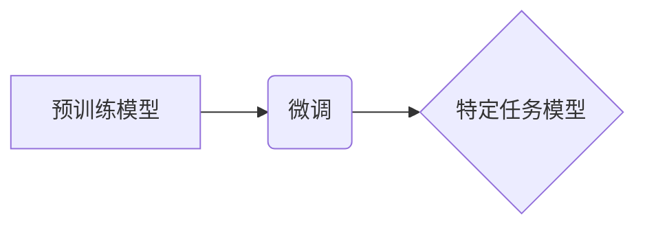

> 大模型、深度学习、模型训练、微调、Transformer、BERT、GPT、LLM

## 1. 背景介绍

近年来，深度学习技术取得了飞速发展，尤其是大模型的涌现，为人工智能领域带来了革命性的变革。大模型是指参数规模庞大、训练数据海量的人工智能模型，其强大的学习能力和泛化能力使其在自然语言处理、计算机视觉、语音识别等多个领域取得了突破性进展。

然而，大模型的开发和训练也面临着诸多挑战，例如：

* **海量数据需求:** 大模型的训练需要大量的训练数据，这对于数据获取和存储提出了巨大的挑战。
* **高昂的计算成本:** 大模型的训练需要大量的计算资源，这使得训练成本非常高昂。
* **模型复杂度:** 大模型的结构复杂，训练过程难以控制，容易陷入过拟合等问题。

为了降低大模型开发和训练的门槛，微调技术应运而生。微调是指在预训练的大模型基础上，针对特定任务进行少量数据训练，从而提升模型在特定任务上的性能。微调技术可以有效利用预训练模型的知识，降低训练成本和时间，同时提高模型的性能。

## 2. 核心概念与联系

### 2.1 预训练模型

预训练模型是指在大量通用数据上进行训练，学习到通用语言表示和知识的模型。这些模型通常具有强大的泛化能力，可以应用于多种下游任务。常见的预训练模型包括 BERT、GPT、T5 等。

### 2.2 微调

微调是指在预训练模型的基础上，针对特定任务进行少量数据训练，从而提升模型在特定任务上的性能。微调过程通常包括以下步骤：

1. 选择合适的预训练模型。
2. 对预训练模型进行冻结，只训练特定层或参数。
3. 使用特定任务的数据进行训练。
4. 评估模型在特定任务上的性能。

### 2.3 核心概念关系



## 3. 核心算法原理 & 具体操作步骤

### 3.1 算法原理概述

微调算法的核心思想是利用预训练模型已经学习到的知识，通过对特定任务数据进行少量训练，从而提升模型在特定任务上的性能。

微调算法通常采用以下策略：

* **参数冻结:** 将预训练模型的大部分参数冻结，只训练特定层或参数。
* **学习率衰减:** 将微调阶段的学习率设置得比预训练阶段低，以防止模型过拟合。
* **数据增强:** 对训练数据进行增强，例如文本扰动、数据扩增等，以提高模型的鲁棒性。

### 3.2 算法步骤详解

1. **选择预训练模型:** 根据任务需求选择合适的预训练模型。
2. **数据预处理:** 对训练数据进行预处理，例如文本清洗、分词、编码等。
3. **模型加载:** 加载预训练模型，并根据任务需求进行修改。
4. **参数冻结:** 将预训练模型的大部分参数冻结，只训练特定层或参数。
5. **学习率设置:** 设置微调阶段的学习率。
6. **训练模型:** 使用训练数据对模型进行微调训练。
7. **评估模型:** 使用验证数据评估模型的性能。
8. **调参优化:** 根据评估结果，调整模型参数和训练策略，以提高模型性能。

### 3.3 算法优缺点

**优点:**

* **降低训练成本:** 利用预训练模型的知识，减少训练数据和训练时间。
* **提高模型性能:** 在特定任务上可以取得更好的性能。
* **简化模型开发:** 降低模型开发的门槛，方便开发者快速构建模型。

**缺点:**

* **数据依赖:** 微调效果依赖于训练数据的质量和数量。
* **过拟合风险:** 如果训练数据不足，容易导致模型过拟合。
* **模型可解释性:** 微调后的模型的可解释性可能降低。

### 3.4 算法应用领域

微调技术广泛应用于以下领域:

* **自然语言处理:** 文本分类、情感分析、机器翻译、问答系统等。
* **计算机视觉:** 图像分类、目标检测、图像分割等。
* **语音识别:** 语音转文本、语音合成等。
* **推荐系统:** 商品推荐、用户画像等。

## 4. 数学模型和公式 & 详细讲解 & 举例说明

### 4.1 数学模型构建

微调算法的核心是基于梯度下降优化算法，目标函数通常是交叉熵损失函数。

**交叉熵损失函数:**

$$
L = -\sum_{i=1}^{N} y_i \log(\hat{y}_i)
$$

其中:

* $N$ 是样本数量。
* $y_i$ 是真实标签。
* $\hat{y}_i$ 是模型预测的概率。

### 4.2 公式推导过程

微调算法的目标是通过优化模型参数，最小化交叉熵损失函数。

使用梯度下降算法，更新模型参数:

$$
\theta = \theta - \alpha \nabla L(\theta)
$$

其中:

* $\theta$ 是模型参数。
* $\alpha$ 是学习率。
* $\nabla L(\theta)$ 是交叉熵损失函数对模型参数的梯度。

### 4.3 案例分析与讲解

假设我们使用预训练的BERT模型进行文本分类任务。

1. 将BERT模型的输出层替换为分类层。
2. 使用文本分类数据集进行微调训练。
3. 优化模型参数，最小化交叉熵损失函数。
4. 评估模型在测试集上的准确率。

## 5. 项目实践：代码实例和详细解释说明

### 5.1 开发环境搭建

* Python 3.7+
* PyTorch 1.7+
* Transformers 4.0+

### 5.2 源代码详细实现

```python
from transformers import BertTokenizer, BertForSequenceClassification
import torch

# 加载预训练模型和词典
tokenizer = BertTokenizer.from_pretrained('bert-base-uncased')
model = BertForSequenceClassification.from_pretrained('bert-base-uncased', num_labels=2)

# 定义训练数据
train_data = [
    ("This is a positive sentence.", 1),
    ("This is a negative sentence.", 0),
]

# 转换数据为模型输入格式
train_encodings = tokenizer(
    [sent for sent, label in train_data],
    padding=True,
    truncation=True,
    return_tensors="pt",
)

# 设置训练参数
learning_rate = 2e-5
epochs = 3

# 训练模型
optimizer = torch.optim.AdamW(model.parameters(), lr=learning_rate)
for epoch in range(epochs):
    for batch in train_encodings:
        input_ids = batch["input_ids"]
        attention_mask = batch["attention_mask"]
        labels = torch.tensor([label for sent, label in train_data])

        outputs = model(input_ids=input_ids, attention_mask=attention_mask, labels=labels)
        loss = outputs.loss
        loss.backward()
        optimizer.step()
        optimizer.zero_grad()

# 评估模型
# ...

```

### 5.3 代码解读与分析

* 代码首先加载预训练的BERT模型和词典。
* 然后定义训练数据，并将其转换为模型输入格式。
* 设置训练参数，例如学习率和训练轮数。
* 使用AdamW优化器对模型进行训练。
* 最后评估模型在测试集上的性能。

### 5.4 运行结果展示

训练完成后，可以评估模型在测试集上的准确率。

## 6. 实际应用场景

微调技术在各个领域都有广泛的应用场景，例如：

* **医疗领域:** 微调模型可以用于疾病诊断、药物研发等。
* **金融领域:** 微调模型可以用于欺诈检测、风险评估等。
* **教育领域:** 微调模型可以用于个性化学习、智能问答等。

### 6.4 未来应用展望

随着大模型技术的不断发展，微调技术将有更广泛的应用场景，例如：

* **自动代码生成:** 微调模型可以用于根据自然语言描述自动生成代码。
* **个性化推荐:** 微调模型可以根据用户的兴趣和偏好进行个性化推荐。
* **跨语言理解:** 微调模型可以用于跨语言的文本理解和生成。

## 7. 工具和资源推荐

### 7.1 学习资源推荐

* **Hugging Face Transformers:** https://huggingface.co/docs/transformers/index
* **OpenAI GPT-3:** https://openai.com/blog/gpt-3/
* **Google BERT:** https://ai.googleblog.com/2018/11/open-sourcing-bert-state-of-art-pre.html

### 7.2 开发工具推荐

* **PyTorch:** https://pytorch.org/
* **TensorFlow:** https://www.tensorflow.org/

### 7.3 相关论文推荐

* **BERT: Pre-training of Deep Bidirectional Transformers for Language Understanding**
* **GPT: Generative Pre-trained Transformer**
* **T5: Text-to-Text Transfer Transformer**

## 8. 总结：未来发展趋势与挑战

### 8.1 研究成果总结

微调技术为大模型的开发和应用提供了新的思路和方法，有效降低了模型开发的门槛，并取得了显著的成果。

### 8.2 未来发展趋势

未来，微调技术将朝着以下方向发展:

* **自动化微调:** 自动化微调流程，降低用户门槛。
* **高效微调:** 探索更有效的微调算法和策略，降低训练成本和时间。
* **跨模态微调:** 将微调技术应用于跨模态任务，例如文本-图像、文本-音频等。

### 8.3 面临的挑战

微调技术也面临着一些挑战:

* **数据稀缺:** 许多领域的数据稀缺，难以进行有效的微调训练。
* **模型可解释性:** 微调后的模型的可解释性可能降低，难以理解模型的决策过程。
* **公平性与偏见:** 微调模型可能继承预训练模型的公平性与偏见问题。

### 8.4 研究展望

未来，需要进一步研究以下问题:

* 如何解决数据稀缺问题，提高微调效果。
* 如何提高微调模型的可解释性，增强用户信任。
* 如何 mitigate 微调模型的公平性与偏见问题，确保模型的公平性和公正性。

## 9. 附录：常见问题与解答

* **Q: 如何选择合适的预训练模型？**

A: 选择预训练模型需要根据任务需求和数据特点进行选择。例如，对于文本分类任务，可以使用BERT、RoBERTa等预训练模型。

* **Q: 如何设置微调参数？**

A: 微调参数的设置需要根据任务需求和数据特点进行调整。学习率、训练轮数、批处理大小等参数都需要进行调优。

* **Q: 如何评估微调模型的性能？**

A: 微调模型的性能可以使用准确率、F1-score等指标进行评估。

作者：禅与计算机程序设计艺术 / Zen and the Art of Computer Programming


<end_of_turn>