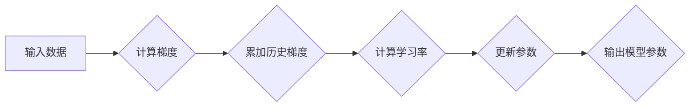

> Adagrad, 梯度下降, 优化算法, 机器学习, 深度学习, 梯度更新, 学习率

## 1. 背景介绍

在机器学习和深度学习领域，优化算法是训练模型的核心环节。优化算法的目标是找到模型参数的最佳值，从而使模型在给定数据集上达到最佳性能。梯度下降算法是机器学习中最常用的优化算法之一，它通过不断更新模型参数，朝着梯度下降的方向进行迭代，最终找到最优解。然而，传统的梯度下降算法存在一些缺点，例如学习率难以选择，容易陷入局部最优解等。

Adagrad 算法是一种基于梯度下降的优化算法，它通过对每个参数的历史梯度进行累加，动态调整学习率，从而克服了传统梯度下降算法的缺点。Adagrad 算法在处理稀疏数据和文本分类等任务中表现出色，并且在许多深度学习模型中得到广泛应用。

## 2. 核心概念与联系

Adagrad 算法的核心思想是根据每个参数的历史梯度信息，动态调整学习率。

**Adagrad 算法流程图:**



**核心概念:**

* **梯度:** 梯度表示模型参数变化对损失函数的影响方向和大小。
* **历史梯度:** Adagrad 算法会记录每个参数的历史梯度信息，并将其累加起来。
* **学习率:** 学习率控制着参数更新的步长。Adagrad 算法会根据每个参数的历史梯度信息，动态调整学习率。

## 3. 核心算法原理 & 具体操作步骤

### 3.1  算法原理概述

Adagrad 算法的核心原理是通过对每个参数的历史梯度进行累加，动态调整学习率。

Adagrad 算法的学习率公式如下：

$$
\eta_t = \frac{\eta}{\sqrt{\sum_{i=1}^{t} g_i^2 + \epsilon}}
$$

其中：

* $\eta$ 是初始学习率。
* $t$ 是当前迭代次数。
* $g_i$ 是第 $i$ 次迭代时参数 $w$ 的梯度。
* $\epsilon$ 是一个小的常数，用于避免分母为零。

从公式可以看出，Adagrad 算法的学习率随着迭代次数的增加而逐渐减小。这是因为历史梯度累加项 $\sum_{i=1}^{t} g_i^2$ 会随着迭代次数的增加而增大，从而导致学习率减小。

### 3.2  算法步骤详解

Adagrad 算法的具体操作步骤如下：

1. 初始化学习率 $\eta$ 和参数 $w$。
2. 对于每个训练样本，计算梯度 $g$。
3. 更新历史梯度累加项：

$$
G_t = G_{t-1} + g^2
$$

4. 计算当前学习率：

$$
\eta_t = \frac{\eta}{\sqrt{G_t + \epsilon}}
$$

5. 更新参数：

$$
w = w - \eta_t \cdot g
$$

6. 重复步骤 2-5，直到模型收敛。

### 3.3  算法优缺点

**优点:**

* **自动调整学习率:** Adagrad 算法可以自动根据每个参数的历史梯度信息，动态调整学习率，从而避免了手动选择学习率的困难。
* **处理稀疏数据效果好:** Adagrad 算法对稀疏数据表现出色，因为它的学习率调整机制可以有效地处理不同参数的梯度信息。

**缺点:**

* **学习率衰减过快:** Adagrad 算法的学习率会随着迭代次数的增加而逐渐减小，如果学习率衰减过快，可能会导致模型训练速度变慢，甚至无法收敛。

### 3.4  算法应用领域

Adagrad 算法在许多机器学习和深度学习任务中得到广泛应用，例如：

* **文本分类:** Adagrad 算法在处理文本分类任务中表现出色，因为它可以有效地处理文本数据中的稀疏性。
* **推荐系统:** Adagrad 算法可以用于训练推荐系统的模型，例如协同过滤模型。
* **图像识别:** Adagrad 算法也可以用于训练图像识别模型，例如卷积神经网络。

## 4. 数学模型和公式 & 详细讲解 & 举例说明

### 4.1  数学模型构建

Adagrad 算法的核心数学模型是梯度累加和学习率调整公式。

**梯度累加公式:**

$$
G_t = G_{t-1} + g_t^2
$$

其中：

* $G_t$ 是第 $t$ 次迭代时所有参数梯度的平方和。
* $G_{t-1}$ 是第 $t-1$ 次迭代时所有参数梯度的平方和。
* $g_t$ 是第 $t$ 次迭代时参数 $w$ 的梯度。

**学习率调整公式:**

$$
\eta_t = \frac{\eta}{\sqrt{G_t + \epsilon}}
$$

其中：

* $\eta_t$ 是第 $t$ 次迭代时的学习率。
* $\eta$ 是初始学习率。
* $G_t$ 是第 $t$ 次迭代时所有参数梯度的平方和。
* $\epsilon$ 是一个小的常数，用于避免分母为零。

### 4.2  公式推导过程

Adagrad 算法的学习率调整公式的推导过程如下：

1. 为了避免参数更新过大，Adagrad 算法将学习率与每个参数的历史梯度信息相关联。
2. 历史梯度信息可以表示为所有参数梯度的平方和，即 $G_t$。
3. 为了避免分母为零，在 $G_t$ 中添加一个小的常数 $\epsilon$。
4. 将学习率 $\eta$ 与 $\sqrt{G_t + \epsilon}$ 的倒数相乘，可以得到动态调整后的学习率 $\eta_t$。

### 4.3  案例分析与讲解

假设我们有一个简单的线性回归模型，目标是预测房价。模型参数为权重 $w$，输入特征为房屋面积 $x$。

Adagrad 算法的学习过程如下：

1. 初始化学习率 $\eta$ 和权重 $w$。
2. 对于每个训练样本，计算梯度 $g$。
3. 更新历史梯度累加项 $G_t$。
4. 计算当前学习率 $\eta_t$。
5. 更新权重 $w$。

随着迭代次数的增加，$G_t$ 会逐渐增大，从而导致 $\eta_t$ 逐渐减小。这意味着Adagrad 算法会逐渐降低参数更新的步长，从而避免参数更新过大，导致模型训练不稳定。

## 5. 项目实践：代码实例和详细解释说明

### 5.1  开发环境搭建

* Python 3.6+
* TensorFlow 2.0+
* NumPy
* Matplotlib

### 5.2  源代码详细实现

```python
import tensorflow as tf

# 定义模型
model = tf.keras.models.Sequential([
    tf.keras.layers.Dense(units=1, input_shape=[1])
])

# 定义损失函数和优化器
optimizer = tf.keras.optimizers.Adagrad(learning_rate=0.1)
loss_fn = tf.keras.losses.MeanSquaredError()

# 训练数据
x_train = tf.constant([1.0, 2.0, 3.0, 4.0, 5.0])
y_train = tf.constant([2.0, 4.0, 6.0, 8.0, 10.0])

# 训练模型
for epoch in range(100):
    with tf.GradientTape() as tape:
        y_pred = model(x_train)
        loss = loss_fn(y_train, y_pred)
    gradients = tape.gradient(loss, model.trainable_variables)
    optimizer.apply_gradients(zip(gradients, model.trainable_variables))

    if epoch % 10 == 0:
        print(f"Epoch {epoch}, Loss: {loss.numpy()}")

# 预测
y_pred = model(tf.constant([6.0]))
print(f"Prediction: {y_pred.numpy()}")
```

### 5.3  代码解读与分析

* **模型定义:** 代码中定义了一个简单的线性回归模型，包含一个全连接层。
* **损失函数和优化器:** 使用均方误差作为损失函数，使用 Adagrad 优化器进行模型训练。
* **训练数据:** 使用了五个样本点进行训练。
* **训练过程:** 训练过程使用循环迭代的方式，每次迭代计算梯度，并根据梯度更新模型参数。
* **预测:** 训练完成后，使用模型预测新的数据点。

### 5.4  运行结果展示

运行代码后，会输出训练过程中的损失值，以及对新数据点的预测结果。

## 6. 实际应用场景

Adagrad 算法在许多实际应用场景中得到广泛应用，例如：

* **自然语言处理:** Adagrad 算法可以用于训练词嵌入模型，例如 Word2Vec 和 GloVe。
* **机器翻译:** Adagrad 算法可以用于训练机器翻译模型，例如 seq2seq 模型。
* **语音识别:** Adagrad 算法可以用于训练语音识别模型，例如 recurrent neural networks (RNNs)。

### 6.4  未来应用展望

随着深度学习技术的不断发展，Adagrad 算法在未来将有更广泛的应用前景。例如：

* **强化学习:** Adagrad 算法可以用于训练强化学习模型，例如 Q-learning 和 Deep Q-Network (DQN)。
* **自动机器学习:** Adagrad 算法可以用于自动搜索最佳模型参数，从而提高机器学习模型的性能。

## 7. 工具和资源推荐

### 7.1  学习资源推荐

* **书籍:**
    * Deep Learning by Ian Goodfellow, Yoshua Bengio, and Aaron Courville
    * Hands-On Machine Learning with Scikit-Learn, Keras & TensorFlow by Aurélien Géron
* **在线课程:**
    * Coursera: Deep Learning Specialization by Andrew Ng
    * Udacity: Deep Learning Nanodegree

### 7.2  开发工具推荐

* **TensorFlow:** https://www.tensorflow.org/
* **PyTorch:** https://pytorch.org/
* **Keras:** https://keras.io/

### 7.3  相关论文推荐

* Adagrad: A Fast Online Gradient Descent Method by Duchi, Hazan, and Singer (2011)

## 8. 总结：未来发展趋势与挑战

### 8.1  研究成果总结

Adagrad 算法是一种有效的优化算法，它可以自动调整学习率，并对稀疏数据表现出色。Adagrad 算法在许多机器学习和深度学习任务中得到广泛应用，并取得了显著的成果。

### 8.2  未来发展趋势

Adagrad 算法的未来发展趋势包括：

* **结合其他优化算法:** 将 Adagrad 算法与其他优化算法结合，例如 RMSprop 和 Adam，以提高模型训练效率。
* **应用于更复杂的任务:** 将 Adagrad 算法应用于更复杂的任务，例如自然语言处理和计算机视觉。
* **研究 Adagrad 算法的理论性质:** 深入研究 Adagrad 算法的理论性质，例如收敛性、稳定性和泛化能力。

### 8.3  面临的挑战

Adagrad 算法也面临一些挑战，例如：

* **学习率衰减过快:** Adagrad 算法的学习率会随着迭代次数的增加而逐渐减小，如果学习率衰减过快，可能会导致模型训练速度变慢，甚至无法收敛。
* **内存占用:** Adagrad 算法需要存储