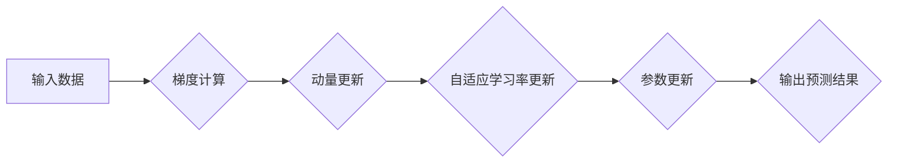

> Adam 优化算法，梯度下降，深度学习，机器学习，优化器，梯度更新，学习率

## 1. 背景介绍

在深度学习领域，模型的训练过程离不开优化算法。优化算法的作用是通过不断调整模型参数，使得模型在训练数据上的损失函数最小化，从而提高模型的预测精度。梯度下降算法是深度学习中常用的优化算法，但它存在一些缺点，例如学习率难以选择，容易陷入局部最优等。为了解决这些问题，学者们提出了许多改进的优化算法，其中Adam 优化算法是近年来非常流行的一种算法。

Adam 优化算法结合了动量法和自适应学习率的优点，能够有效地加速模型训练，并提高模型的收敛速度。它通过维护动量和自适应学习率，能够更好地适应不同参数的学习需求，从而提高模型的训练效率。

## 2. 核心概念与联系

Adam 优化算法的核心概念包括：动量、自适应学习率、梯度累积和指数衰减平均值。

**动量法**：动量法可以看作是梯度下降算法的一种改进，它在更新参数时，不仅考虑当前梯度，还考虑了之前梯度的累积，从而能够加速模型的收敛速度，并避免在梯度变化剧烈的区域中震荡。

**自适应学习率**：自适应学习率是指根据参数的梯度信息，动态调整学习率的大小。这样可以使得模型在训练过程中，对不同参数的学习速度更加灵活，从而提高模型的训练效率。

**梯度累积**：梯度累积是指将多个梯度值累加起来，然后根据累积的梯度值更新参数。这可以使得模型在训练过程中，能够更好地学习到数据的整体特征，从而提高模型的预测精度。

**指数衰减平均值**：指数衰减平均值是一种用来计算历史梯度信息的技巧，它可以根据历史梯度值的权重进行加权平均，从而得到一个更加平滑的梯度信息。

**Mermaid 流程图**



## 3. 核心算法原理 & 具体操作步骤

### 3.1  算法原理概述

Adam 优化算法的核心思想是结合动量法和自适应学习率，通过维护动量和自适应学习率，来加速模型训练，并提高模型的收敛速度。

Adam 算法的具体步骤如下：

1. 初始化动量项和自适应学习率项。
2. 计算梯度。
3. 更新动量项。
4. 更新自适应学习率项。
5. 更新参数。

### 3.2  算法步骤详解

**1. 初始化动量项和自适应学习率项**

Adam 算法需要维护两个变量：动量项 $v_t$ 和自适应学习率项 $s_t$。这两个变量的初始值通常设置为 0。

**2. 计算梯度**

计算模型参数的梯度，即损失函数对参数的偏导数。

**3. 更新动量项**

动量项 $v_t$ 的更新公式为：

$$v_t = \beta_1 v_{t-1} + (1 - \beta_1) \nabla_t$$

其中：

* $\beta_1$ 是动量衰减系数，通常设置为 0.9。
* $v_{t-1}$ 是上一个时间步的动量项。
* $\nabla_t$ 是当前时间步的梯度。

**4. 更新自适应学习率项**

自适应学习率项 $s_t$ 的更新公式为：

$$s_t = \beta_2 s_{t-1} + (1 - \beta_2) \nabla_t^2$$

其中：

* $\beta_2$ 是自适应学习率衰减系数，通常设置为 0.999。
* $s_{t-1}$ 是上一个时间步的自适应学习率项。
* $\nabla_t^2$ 是当前时间步梯度的平方。

**5. 更新参数**

参数的更新公式为：

$$\theta_t = \theta_{t-1} - \frac{\alpha \hat{v}_t}{\sqrt{\hat{s}_t} + \epsilon}$$

其中：

* $\theta_t$ 是当前时间步的参数值。
* $\theta_{t-1}$ 是上一个时间步的参数值。
* $\alpha$ 是学习率。
* $\hat{v}_t$ 是动量项 $v_t$ 的指数衰减平均值。
* $\hat{s}_t$ 是自适应学习率项 $s_t$ 的指数衰减平均值。
* $\epsilon$ 是一个小的常数，用于防止分母为零。

### 3.3  算法优缺点

**优点：**

* 收敛速度快，能够有效地加速模型训练。
* 自适应学习率，能够更好地适应不同参数的学习需求。
* 对超参数设置的灵活性较高。

**缺点：**

* 计算量较大，需要维护动量项和自适应学习率项。
* 对于一些特殊的模型，可能存在收敛问题。

### 3.4  算法应用领域

Adam 优化算法广泛应用于深度学习领域，例如：

* 自然语言处理
* 图像识别
* 语音识别
* 机器翻译

## 4. 数学模型和公式 & 详细讲解 & 举例说明

### 4.1  数学模型构建

Adam 优化算法的核心数学模型是动量项和自适应学习率项的更新公式。

### 4.2  公式推导过程

动量项和自适应学习率项的更新公式的推导过程可以参考 Adam 论文中的详细推导过程。

### 4.3  案例分析与讲解

假设我们有一个简单的线性回归模型，目标是预测房价。我们使用 Adam 优化算法来训练这个模型。

在训练过程中，Adam 算法会根据梯度信息，不断更新模型参数，使得模型在训练数据上的损失函数最小化。

## 5. 项目实践：代码实例和详细解释说明

### 5.1  开发环境搭建

为了实现 Adam 优化算法，我们需要使用 Python 语言和 TensorFlow 或 PyTorch 等深度学习框架。

### 5.2  源代码详细实现

```python
import tensorflow as tf

# 定义模型
model = tf.keras.models.Sequential([
    tf.keras.layers.Dense(units=1, input_shape=[1])
])

# 定义损失函数和优化器
optimizer = tf.keras.optimizers.Adam(learning_rate=0.01)
loss_fn = tf.keras.losses.MeanSquaredError()

# 训练模型
for epoch in range(100):
    for x, y in train_data:
        with tf.GradientTape() as tape:
            predictions = model(x)
            loss = loss_fn(y, predictions)
        gradients = tape.gradient(loss, model.trainable_variables)
        optimizer.apply_gradients(zip(gradients, model.trainable_variables))

    print(f"Epoch {epoch+1}, Loss: {loss.numpy()}")
```

### 5.3  代码解读与分析

这段代码首先定义了一个简单的线性回归模型，然后定义了损失函数和 Adam 优化器。

在训练模型的过程中，我们使用梯度下降算法来更新模型参数。Adam 优化器会根据梯度信息，动态调整学习率，从而加速模型训练。

### 5.4  运行结果展示

训练完成后，我们可以使用测试数据来评估模型的性能。

## 6. 实际应用场景

Adam 优化算法在深度学习领域有着广泛的应用场景，例如：

* **图像分类:** Adam 优化算法可以用于训练卷积神经网络，用于识别图像中的物体。
* **自然语言处理:** Adam 优化算法可以用于训练循环神经网络，用于处理自然语言文本数据，例如机器翻译、文本摘要等。
* **语音识别:** Adam 优化算法可以用于训练循环神经网络，用于识别语音信号中的单词和句子。

### 6.4  未来应用展望

随着深度学习技术的不断发展，Adam 优化算法的应用场景将会更加广泛。

## 7. 工具和资源推荐

### 7.1  学习资源推荐

* **Adam 论文:** https://arxiv.org/abs/1412.6980
* **TensorFlow 官方文档:** https://www.tensorflow.org/
* **PyTorch 官方文档:** https://pytorch.org/

### 7.2  开发工具推荐

* **TensorFlow:** https://www.tensorflow.org/
* **PyTorch:** https://pytorch.org/
* **Jupyter Notebook:** https://jupyter.org/

### 7.3  相关论文推荐

* **RMSprop:** https://arxiv.org/abs/1308.0850
* **Momentum:** https://www.deeplearning.ai/blog/momentum-optimization/

## 8. 总结：未来发展趋势与挑战

### 8.1  研究成果总结

Adam 优化算法是深度学习领域中非常重要的优化算法之一，它能够有效地加速模型训练，并提高模型的收敛速度。

### 8.2  未来发展趋势

未来，Adam 优化算法将会继续发展，例如：

* **更加高效的算法:** 研究更加高效的优化算法，能够进一步加速模型训练。
* **自适应学习率的改进:** 研究更加智能的自适应学习率算法，能够更好地适应不同模型和数据集的特性。
* **多任务学习:** 研究将 Adam 优化算法应用于多任务学习场景，提高模型的泛化能力。

### 8.3  面临的挑战

Adam 优化算法也面临一些挑战，例如：

* **参数选择:** Adam 优化算法的超参数选择仍然是一个比较困难的问题。
* **收敛问题:** 对于一些特殊的模型，Adam 优化算法可能存在收敛问题。
* **计算量:** Adam 优化算法的计算量较大，对于一些资源有限的设备，可能难以使用。

### 8.4  研究展望

未来，我们将继续研究 Adam 优化算法，并尝试解决上述挑战，从而提高 Adam 优化算法的性能和应用范围。

## 9. 附录：常见问题与解答

**问题 1:** Adam 优化算法的超参数如何选择？

**解答:** Adam 优化算法的超参数包括学习率、动量衰减系数和自适应学习率衰减系数。

学习率通常设置为 0.001 到 0.01 之间。动量衰减系数和自适应学习率衰减系数通常设置为 0.9 和 0.999。

**问题 2:** Adam 优化算法为什么比梯度下降算法更快？

**解答:** Adam 优化算法比梯度下降算法更快的原因是它结合了动量法和自适应学习率。

动量法可以加速模型的收敛速度，而自适应学习率可以更好地适应不同参数的学习需求。

**问题 3:** Adam 优化算法有哪些缺点？

**解答:** Adam 优化算法的缺点包括：

* 计算量较大
* 对于一些特殊的模型，可能存在收敛问题
* 超参数选择仍然是一个比较困难的问题


作者：禅与计算机程序设计艺术 / Zen and the Art of Computer Programming 
<end_of_turn>