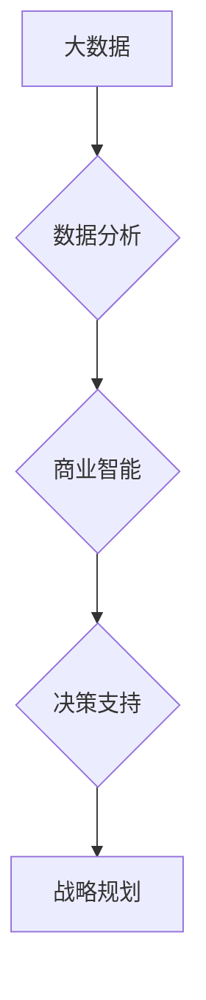

> 大数据、战略规划、信息差、数据分析、商业智能、机器学习、预测模型、决策支持

## 1. 背景介绍

在当今数据爆炸的时代，企业面临着前所未有的机遇和挑战。海量数据蕴藏着丰富的商业价值，但如何有效地挖掘和利用这些数据，转化为战略优势，成为企业发展的关键。信息差正在成为企业竞争的决定性因素，而大数据分析技术为企业提供了弥合信息差、洞察市场趋势、制定精准战略的强大工具。

传统的战略规划往往依赖于经验、直觉和有限的数据，容易受到主观判断和认知偏差的影响。而大数据分析则能够提供更客观、更全面的数据支撑，帮助企业更深入地了解市场、客户和竞争对手，从而制定更科学、更有效的战略决策。

## 2. 核心概念与联系

**2.1 大数据**

大数据是指规模庞大、结构复杂、更新速度快、类型多样化的数据。其特征通常被概括为“五V”：

* **Volume (体积)**：数据量巨大，难以用传统方法处理。
* **Velocity (速度)**：数据生成和更新速度快，需要实时处理。
* **Variety (多样性)**：数据类型多样，包括结构化数据、非结构化数据和半结构化数据。
* **Veracity (真实性)**：数据质量参差不齐，需要进行清洗和验证。
* **Value (价值)**：数据蕴藏着潜在的商业价值，需要进行挖掘和分析。

**2.2 战略规划**

战略规划是指企业在长远目标的基础上，制定实现目标的行动计划，并进行资源配置和风险管理的过程。其核心目标是确定企业的发展方向，并制定相应的行动策略，以实现企业的长期可持续发展。

**2.3 信息差**

信息差是指企业在获取、处理和利用信息方面存在差异，导致对市场、客户和竞争对手的理解不同，从而影响决策和竞争力的情况。

**2.4 数据分析与商业智能**

数据分析是指通过对数据进行收集、清洗、转换、分析和挖掘，以发现数据中的规律、趋势和模式，从而为决策提供支持的过程。商业智能 (BI) 是利用数据分析技术，帮助企业更好地了解市场、客户和竞争对手，从而做出更明智的决策。

**2.5 机器学习与预测模型**

机器学习是一种人工智能技术，通过算法训练，使计算机能够从数据中学习，并进行预测和决策。预测模型是利用机器学习算法，根据历史数据预测未来趋势的一种工具。

**2.6 决策支持系统**

决策支持系统 (DSS) 是利用数据分析、商业智能和机器学习等技术，为企业决策者提供决策支持的软件系统。

**2.7 流程图**



## 3. 核心算法原理 & 具体操作步骤

**3.1 算法原理概述**

大数据分析中常用的算法包括：

* **分类算法**: 用于将数据点分类到不同的类别，例如决策树、支持向量机、随机森林等。
* **回归算法**: 用于预测连续数值，例如线性回归、逻辑回归、支持向量回归等。
* **聚类算法**: 用于将数据点根据相似性进行分组，例如k-means聚类、层次聚类等。
* **关联规则挖掘**: 用于发现数据中存在的关联关系，例如Apriori算法、FP-Growth算法等。

**3.2 算法步骤详解**

以决策树算法为例，其步骤如下：

1. 选择特征作为划分依据，根据特征值将数据点分成不同的子集。
2. 对于每个子集，重复步骤1，直到满足停止条件。
3. 生成决策树，树的每个节点代表一个特征，每个分支代表一个特征值，叶子节点代表最终的分类结果。

**3.3 算法优缺点**

* **优点**: 易于理解和解释，可处理混合数据类型，具有较高的准确率。
* **缺点**: 容易过拟合，对数据特征选择敏感。

**3.4 算法应用领域**

* **客户关系管理 (CRM)**: 预测客户流失、个性化营销等。
* **欺诈检测**: 识别异常交易、预防欺诈行为等。
* **医疗诊断**: 辅助医生诊断疾病、预测患者风险等。

## 4. 数学模型和公式 & 详细讲解 & 举例说明

**4.1 数学模型构建**

决策树算法可以构建数学模型来表示决策规则。例如，假设有一个决策树用于预测客户是否会购买产品，其决策规则可以表示为以下数学表达式：

```latex
P(购买) = f(年龄, 性别, 收入, 兴趣)
```

其中：

* $P(购买)$ 表示客户购买产品的概率。
* $年龄, 性别, 收入, 兴趣$ 表示客户的特征变量。
* $f$ 表示决策树算法构建的决策规则函数。

**4.2 公式推导过程**

决策树算法的决策规则函数 $f$ 是通过训练数据学习得到的。训练过程通常使用信息增益或基尼系数等指标来评估特征的划分效果，选择最优特征进行划分，直到满足停止条件。

**4.3 案例分析与讲解**

假设有一个数据集包含客户的年龄、性别、收入和兴趣等特征，以及是否购买产品的标签。可以使用决策树算法对这个数据集进行训练，构建一个预测客户是否购买产品的决策树模型。

例如，决策树模型可能首先根据年龄进行划分，将客户分为不同年龄段，然后根据每个年龄段的性别、收入和兴趣进行进一步划分，最终得到每个叶子节点的购买概率。

## 5. 项目实践：代码实例和详细解释说明

**5.1 开发环境搭建**

* 操作系统：Windows/macOS/Linux
* Python 版本：3.6+
* 必要的库：pandas, scikit-learn, matplotlib, seaborn

**5.2 源代码详细实现**

```python
import pandas as pd
from sklearn.tree import DecisionTreeClassifier
from sklearn.model_selection import train_test_split
from sklearn.metrics import accuracy_score

# 加载数据
data = pd.read_csv('customer_data.csv')

# 划分特征和目标变量
X = data.drop('购买', axis=1)
y = data['购买']

# 将数据划分为训练集和测试集
X_train, X_test, y_train, y_test = train_test_split(X, y, test_size=0.2, random_state=42)

# 创建决策树模型
model = DecisionTreeClassifier()

# 训练模型
model.fit(X_train, y_train)

# 对测试集进行预测
y_pred = model.predict(X_test)

# 计算模型准确率
accuracy = accuracy_score(y_test, y_pred)
print(f'模型准确率: {accuracy}')
```

**5.3 代码解读与分析**

* 首先，加载数据并划分特征和目标变量。
* 然后，将数据划分为训练集和测试集。
* 创建决策树模型并训练模型。
* 对测试集进行预测，并计算模型准确率。

**5.4 运行结果展示**

运行代码后，会输出模型的准确率。

## 6. 实际应用场景

**6.1 市场营销**

* **客户细分**: 根据客户的特征，将客户分为不同的细分市场，制定针对性的营销策略。
* **精准营销**: 利用客户数据，预测客户的购买意愿，进行精准的营销推广。
* **广告投放**: 根据用户画像，优化广告投放，提高广告效果。

**6.2 产品开发**

* **需求分析**: 分析用户数据，了解用户需求，为产品开发提供参考。
* **产品优化**: 根据用户反馈和使用数据，优化产品功能和体验。
* **新产品开发**: 利用市场趋势和用户需求数据，开发新的产品。

**6.3 风险管理**

* **欺诈检测**: 利用机器学习算法，识别异常交易，预防欺诈行为。
* **信用风险评估**: 分析客户的信用数据，评估客户的信用风险。
* **投资风险管理**: 利用市场数据和预测模型，评估投资风险。

**6.4 未来应用展望**

随着大数据技术的不断发展，其在战略规划中的应用将更加广泛和深入。例如：

* **人工智能驱动的战略规划**: 利用人工智能技术，自动分析数据，生成战略建议。
* **实时战略规划**: 利用实时数据流，进行动态调整和优化。
* **个性化战略规划**: 根据不同客户的特征和需求，制定个性化的战略规划。

## 7. 工具和资源推荐

**7.1 学习资源推荐**

* **书籍**:
    * 《数据科学实战》
    * 《Python数据分析手册》
    * 《机器学习实战》
* **在线课程**:
    * Coursera: 数据科学、机器学习
    * edX: 数据分析、人工智能
    * Udemy: Python编程、数据分析

**7.2 开发工具推荐**

* **Python**: 数据分析和机器学习的常用编程语言。
* **pandas**: 数据处理和分析库。
* **scikit-learn**: 机器学习库。
* **matplotlib, seaborn**: 数据可视化库。

**7.3 相关论文推荐**

* 《数据挖掘: 概念与技术》
* 《机器学习》
* 《深度学习》

## 8. 总结：未来发展趋势与挑战

**8.1 研究成果总结**

大数据分析技术在战略规划领域取得了显著的成果，为企业提供了更科学、更有效的决策支持。

**8.2 未来发展趋势**

* **人工智能驱动的战略规划**: 人工智能技术将更加深入地融入战略规划，自动分析数据，生成战略建议。
* **实时战略规划**: 利用实时数据流，进行动态调整和优化。
* **个性化战略规划**: 根据不同客户的特征和需求，制定个性化的战略规划。

**8.3 面临的挑战**

* **数据质量**: 大数据往往存在质量问题，需要进行清洗和处理。
* **算法复杂性**: 一些大数据分析算法非常复杂，需要专业的技术人员进行操作和维护。
* **隐私保护**: 大数据分析涉及到大量个人信息，需要做好隐私保护工作。

**8.4 研究展望**

未来，大数据分析技术将继续发展，在战略规划领域发挥更大的作用。需要进一步研究更有效的算法和模型，提高数据分析的准确性和效率，同时也要关注数据隐私和安全问题。

## 9. 附录：常见问题与解答

**9.1 如何选择合适的算法？**

选择合适的算法取决于具体的业务需求和数据特征。例如，如果需要预测连续数值，可以使用回归算法；如果需要分类数据，可以使用分类算法。

**9.2 如何处理数据质量问题？**

数据清洗和处理是数据分析的前提。需要对数据进行缺失值处理、异常值处理、数据标准化等操作，以提高数据质量。

**9.3 如何保证数据隐私？**

在进行大数据分析时，需要采取措施保护用户隐私，例如匿名化处理、数据加密等。


作者：禅与计算机程序设计艺术 / Zen and the Art of Computer Programming 
<end_of_turn>