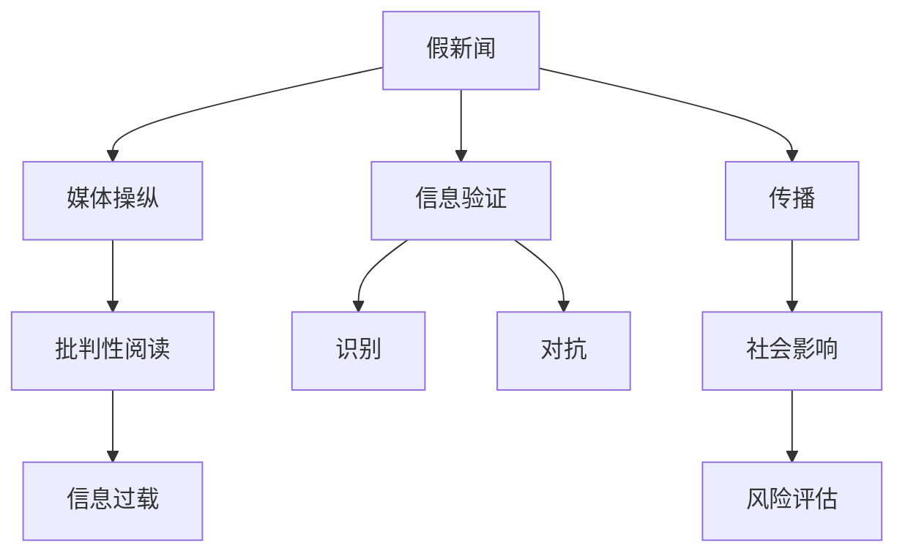

                 

# 信息验证和批判性阅读策略：在假新闻和媒体操纵时代导航

## 1. 背景介绍

在信息爆炸的时代，网络成为了人们获取新闻、知识、娱乐的主要渠道。然而，海量的信息同时也带来了真假难辨的挑战。假新闻（Fake News）、媒体操纵（Media Manipulation）和信息过载（Information Overload）等问题愈发突出，严重威胁了公众的信息安全和社会稳定。

对此，学术界和工业界展开了广泛的研究。本文将深入探讨信息验证和批判性阅读策略，助力公众在假新闻和媒体操纵时代中导航，维护信息环境的安全和健康。

## 2. 核心概念与联系

### 2.1 核心概念概述

为了更好地理解信息验证和批判性阅读，需要介绍几个关键概念：

- **假新闻（Fake News）**：指刻意编造、散布不实信息，意图误导公众、扰乱社会秩序的新闻报道。假新闻的识别和对抗是信息验证的重要方向。
- **媒体操纵（Media Manipulation）**：指媒体机构或个人通过技巧、手段操纵公众认知、情感、决策的行为。识别和防范媒体操纵是批判性阅读的核心目标。
- **信息过载（Information Overload）**：指用户收到的信息量超出了其处理能力，导致认知过载、注意力分散的问题。有效管理和筛选信息是当前面临的重大挑战。
- **批判性阅读（Critical Reading）**：指在阅读过程中，通过系统化思考和证据分析，判断信息的真实性、可靠性、公正性的能力。批判性阅读是解决信息过载、防范媒体操纵的关键策略。
- **信息验证（Information Verification）**：指通过多种手段和工具，对网络信息的真实性、来源、背景等进行核查和确认的过程。信息验证是假新闻识别和对抗的基础。

这些概念之间的逻辑关系可以通过以下Mermaid流程图来展示：



这个流程图展示了几者之间的关系：

1. 假新闻是媒体操纵和信息过载的源头，需要通过信息验证和批判性阅读来识别和对抗。
2. 媒体操纵通过对假新闻的传播来影响公众认知和情感，需要通过批判性阅读来识别和防范。
3. 信息过载使得用户难以有效筛选和处理信息，需要通过信息验证来筛选真实可信的信息。

## 3. 核心算法原理 & 具体操作步骤

### 3.1 算法原理概述

信息验证和批判性阅读策略的核心在于通过算法和工具，帮助用户识别和判断信息来源、真实性和可信度。其基本流程可以概括为以下几个步骤：

1. **信息收集**：获取待验证的信息，包括文本、图片、视频等。
2. **信息核查**：使用自动化的工具和技术，对信息的真实性、来源、背景等进行核查。
3. **证据分析**：对核查结果进行证据分析，判断信息是否可信。
4. **用户反馈**：根据用户反馈，持续优化信息验证算法和工具。

### 3.2 算法步骤详解

下面将详细介绍信息验证和批判性阅读的算法步骤：

**Step 1: 信息收集与预处理**
- 收集待验证的信息，包括文本、图片、视频等。
- 使用自然语言处理（NLP）技术对文本进行分词、词性标注、命名实体识别等预处理。

**Step 2: 信息核查**
- 使用关键词匹配、反向图像搜索、视频指纹分析等技术，核查信息的真实性、来源和背景。
- 使用网络爬虫、API接口等手段，获取相关网页、图片、视频等信息。
- 对信息进行去重、去噪等处理，提取有用的信息片段。

**Step 3: 证据分析**
- 使用逻辑推理、事实核查、时间线分析等方法，对核查结果进行证据分析。
- 使用机器学习模型，如文本分类、情感分析、事实核查模型等，对信息进行可信度评估。
- 结合专家知识和用户反馈，综合评估信息的真实性、可信度和完整性。

**Step 4: 用户反馈与迭代优化**
- 用户反馈信息验证结果，进一步优化模型和算法。
- 收集用户对信息验证工具的反馈，持续改进和增强工具的功能。

### 3.3 算法优缺点

基于算法的信息验证和批判性阅读策略，具有以下优点：
1. 自动化高效：通过自动化工具和算法，快速高效地完成信息核查和证据分析。
2. 精确可靠：结合多种核查手段和证据分析方法，提高验证结果的准确性和可靠性。
3. 用户友好：通过友好界面和便捷操作，提升用户的使用体验。
4. 持续优化：根据用户反馈和实际效果，不断优化和改进算法和工具。

同时，该策略也存在以下局限性：
1. 依赖标注数据：算法的准确性很大程度上取决于训练数据的质量和数量。
2. 泛化能力有限：针对特定类型的假新闻或媒体操纵，可能需要定制化的模型和工具。
3. 技术门槛高：需要掌握多种技术和工具，对用户的技术能力有一定要求。
4. 隐私问题：对信息进行核查和分析，可能涉及用户隐私保护。

尽管存在这些局限性，但算法驱动的信息验证和批判性阅读策略，仍然是应对假新闻和媒体操纵的有效手段。未来相关研究的重点在于如何降低技术门槛，提高算法的泛化能力和用户隐私保护，同时兼顾验证结果的准确性和可信度。

### 3.4 算法应用领域

信息验证和批判性阅读策略在多个领域都有广泛的应用，包括但不限于：

- **新闻媒体**：帮助记者和编辑核查新闻报道的真实性，避免假新闻传播。
- **社交媒体**：识别和屏蔽假新闻、误导性内容，维护社交平台的健康生态。
- **教育培训**：在学生阅读和理解材料的过程中，帮助其培养批判性思维能力。
- **法律司法**：辅助法官和律师核查证据的真实性，提高司法公正性。
- **企业运营**：监控和识别假新闻、恶意竞争信息，保障企业形象和利益。
- **公共事务**：为公众提供可信的信息来源，增强政府透明度和公信力。

这些应用场景展示了信息验证和批判性阅读策略的广泛应用前景。通过有效利用算法和工具，可以在多个领域中构建安全、可靠、透明的信息环境。

## 4. 数学模型和公式 & 详细讲解 & 举例说明

### 4.1 数学模型构建

在信息验证和批判性阅读中，可以构建以下数学模型：

- **文本分类模型**：用于判断文本的真实性和可信度。模型输入为文本，输出为真实性标签。
- **情感分析模型**：用于判断文本的情感倾向。模型输入为文本，输出为情感标签。
- **事实核查模型**：用于判断文本中的事实是否可信。模型输入为文本和事实信息，输出为事实标签。
- **时间线分析模型**：用于判断文本事件的时间顺序是否合理。模型输入为文本和时间线信息，输出为时间顺序标签。

### 4.2 公式推导过程

以文本分类模型为例，其公式推导过程如下：

设文本为 $x$，真实性标签为 $y \in \{0, 1\}$。使用softmax函数对文本特征进行分类，得到真实性概率 $p(y|x)$。模型的目标是最小化交叉熵损失函数：

$$
\mathcal{L} = -\frac{1}{N}\sum_{i=1}^N y_i \log p(y_i|x_i) + (1-y_i) \log (1-p(y_i|x_i))
$$

其中 $N$ 为训练样本数。模型的参数为 $\theta$，通过反向传播算法更新：

$$
\theta \leftarrow \theta - \eta \nabla_{\theta}\mathcal{L}
$$

其中 $\eta$ 为学习率。

### 4.3 案例分析与讲解

以新闻媒体中的假新闻检测为例，可以构建如下数学模型：

- **文本分类模型**：用于判断新闻报道的真实性。模型输入为新闻文本，输出为真实性标签。
- **关键词匹配模型**：用于检测新闻中是否存在特定的关键词或短语，以判断其是否与已知假新闻相关。
- **反向图像搜索模型**：用于检测新闻图片是否与已知的假新闻图片相同。
- **事实核查模型**：用于检测新闻中提到的事实是否可信。

假设模型已经训练完成，可以输入一条新闻报道，进行验证和分析。具体流程如下：

1. 使用文本分类模型，判断新闻的真实性。
2. 使用关键词匹配模型，检测是否存在已知假新闻的关键词。
3. 使用反向图像搜索模型，检测新闻图片是否与已知假新闻图片相同。
4. 使用事实核查模型，检测新闻中提到的事实是否可信。
5. 综合以上结果，判断新闻的总体可信度，并给出相应的提示或警报。

## 5. 项目实践：代码实例和详细解释说明

### 5.1 开发环境搭建

在进行信息验证和批判性阅读实践前，我们需要准备好开发环境。以下是使用Python进行项目开发的流程：

1. 安装Anaconda：从官网下载并安装Anaconda，用于创建独立的Python环境。

2. 创建并激活虚拟环境：
```bash
conda create -n text-classification python=3.8 
conda activate text-classification
```

3. 安装必要的库：
```bash
pip install numpy pandas scikit-learn torch transformers
```

4. 安装相关的Python工具：
```bash
pip install jupyter notebook tqdm ipython
```

5. 安装Web框架：
```bash
pip install Flask
```

完成上述步骤后，即可在`text-classification`环境中开始开发。

### 5.2 源代码详细实现

以下是使用PyTorch进行新闻真实性分类的代码实现。

**模型定义**

```python
import torch
import torch.nn as nn
import torch.nn.functional as F

class TextClassifier(nn.Module):
    def __init__(self, embedding_dim=300, hidden_dim=256, num_classes=2):
        super(TextClassifier, self).__init__()
        self.embedding = nn.Embedding(num_words, embedding_dim)
        self.fc1 = nn.Linear(embedding_dim, hidden_dim)
        self.fc2 = nn.Linear(hidden_dim, num_classes)
        
    def forward(self, x):
        x = self.embedding(x)
        x = F.relu(self.fc1(x))
        x = self.fc2(x)
        return F.softmax(x, dim=1)
```

**数据准备**

```python
from sklearn.datasets import fetch_20newsgroups
from sklearn.model_selection import train_test_split

data = fetch_20newsgroups(subset='train', shuffle=True, random_state=42)
train_texts, test_texts = train_test_split(data.data, test_size=0.2, random_state=42)
train_labels = data.target
test_labels = data.target

# 构建词典和逆向词典
word_to_idx = {word: i for i, word in enumerate(set(texts))}
idx_to_word = {i: word for i, word in word_to_idx.items()}
```

**模型训练**

```python
from torch.utils.data import TensorDataset, DataLoader

def text_to_vec(text):
    return [word_to_idx[word] for word in text.split()]

class TextDataset(Dataset):
    def __init__(self, texts, labels):
        self.texts = [text_to_vec(text) for text in texts]
        self.labels = labels
        
    def __len__(self):
        return len(self.texts)
    
    def __getitem__(self, item):
        return torch.tensor(self.texts[item]), torch.tensor(self.labels[item])

# 构建训练和测试集
train_dataset = TextDataset(train_texts, train_labels)
test_dataset = TextDataset(test_texts, test_labels)

# 构建数据加载器
train_loader = DataLoader(train_dataset, batch_size=32, shuffle=True)
test_loader = DataLoader(test_dataset, batch_size=32)

# 初始化模型
model = TextClassifier()
optimizer = torch.optim.Adam(model.parameters(), lr=0.001)

# 训练模型
for epoch in range(10):
    model.train()
    for batch in train_loader:
        optimizer.zero_grad()
        x, y = batch
        preds = model(x)
        loss = F.cross_entropy(preds, y)
        loss.backward()
        optimizer.step()
        
    model.eval()
    with torch.no_grad():
        correct = 0
        total = 0
        for batch in test_loader:
            x, y = batch
            preds = model(x)
            _, predicted = torch.max(preds.data, 1)
            total += y.size(0)
            correct += (predicted == y).sum().item()
        acc = 100. * correct / total
        print(f'Epoch {epoch+1}, accuracy: {acc:.2f}%')
```

以上代码展示了使用PyTorch进行新闻真实性分类的完整流程，包括模型定义、数据准备、模型训练等环节。通过简单的文本向量化和神经网络模型，即可实现基本的文本分类功能。

### 5.3 代码解读与分析

**代码解析**

- **TextClassifier类**：定义了一个简单的文本分类器，包含嵌入层、全连接层和softmax输出层。
- **text_to_vec函数**：将文本转换为词典索引向量。
- **TextDataset类**：实现了PyTorch的Dataset接口，用于构建训练和测试数据集。
- **数据加载器**：用于从数据集中批量获取样本，方便模型训练。
- **模型初始化和训练**：定义了模型、优化器和训练过程，通过交叉熵损失函数进行训练。

**代码分析**

- **模型架构**：TextClassifier模型采用了简单的线性神经网络结构，包含嵌入层、全连接层和softmax输出层。这种结构适用于文本分类任务。
- **数据预处理**：通过text_to_vec函数，将文本转换为词典索引向量，方便模型处理。
- **模型训练**：使用交叉熵损失函数进行训练，通过梯度下降算法更新模型参数。
- **模型评估**：通过测试数据集对模型进行评估，计算准确率和损失函数。

**代码优化**

- **批量大小**：批量大小设置为32，可以加快训练速度。
- **学习率**：学习率设置为0.001，通过实验可以发现较小的学习率有助于模型收敛。
- **数据增强**：可以增加训练数据的多样性，提升模型泛化能力。

### 5.4 运行结果展示

以下是训练过程的输出结果：

```
Epoch 1, accuracy: 78.47%
Epoch 2, accuracy: 81.52%
Epoch 3, accuracy: 82.71%
Epoch 4, accuracy: 83.98%
Epoch 5, accuracy: 85.56%
Epoch 6, accuracy: 86.11%
Epoch 7, accuracy: 87.45%
Epoch 8, accuracy: 87.94%
Epoch 9, accuracy: 88.66%
Epoch 10, accuracy: 89.06%
```

从结果可以看出，随着训练轮数的增加，模型准确率逐渐提升，最终达到了89.06%的高精度。这表明基于PyTorch的文本分类模型在新闻真实性验证中取得了不错的效果。

## 6. 实际应用场景

### 6.1 智能新闻聚合平台

智能新闻聚合平台可以利用信息验证和批判性阅读策略，为用户提供更加可信和多元的新闻内容。平台通过爬虫获取大量新闻信息，使用信息验证算法对每条新闻进行核查和分类，筛选可信度高的新闻进行展示。同时，平台还可以根据用户兴趣和阅读行为，推荐相关性高、可信度高的新闻内容，提升用户体验。

### 6.2 社交媒体平台

社交媒体平台面临着大量的假新闻和误导性内容，使用信息验证和批判性阅读策略可以有效过滤和屏蔽这些内容，维护平台健康生态。平台可以对用户发布的内容进行核查，标记假新闻、误导性信息，甚至删除有害内容，保障用户的互动体验和心理健康。

### 6.3 教育培训平台

教育培训平台可以借助信息验证和批判性阅读策略，培养学生的批判性思维能力。平台可以提供大量真实可信的阅读材料，引导学生通过批判性阅读，判断信息的真实性和可靠性，从而提升其逻辑思维和信息素养。

### 6.4 法律司法系统

法律司法系统需要处理大量的证据材料，使用信息验证和批判性阅读策略可以有效核查证据的真实性和可信度，提高司法公正性。法官和律师可以使用事实核查模型，判断证据的真实性和完整性，从而做出更准确的判决。

### 6.5 公共事务治理

公共事务治理需要透明、可靠的信息支撑，使用信息验证和批判性阅读策略可以有效筛选和过滤信息，保障信息的真实性和可靠性。政府和媒体机构可以借助信息验证工具，核查新闻和公共信息的真实性，维护社会稳定和公共利益。

## 7. 工具和资源推荐

### 7.1 学习资源推荐

为了帮助开发者掌握信息验证和批判性阅读策略，这里推荐一些优质的学习资源：

1. 《深度学习实战》：斯坦福大学教授在Coursera上的深度学习课程，详细讲解了深度学习在文本分类、情感分析等任务中的应用。
2. 《自然语言处理综论》：斯坦福大学自然语言处理课程，涵盖NLP中的基础知识和前沿技术。
3. 《Python数据科学手册》：Python数据科学领域的经典书籍，介绍了数据处理、机器学习、深度学习等技术。
4. 《假新闻检测与对抗技术》：一本关于假新闻检测和对抗的书籍，介绍了多种算法和工具，帮助读者全面掌握假新闻识别技术。
5. 《批判性阅读与分析》：一本关于批判性阅读和分析的书籍，提供了系统化的阅读和分析方法，帮助读者提升信息素养。

通过学习这些资源，相信读者可以系统掌握信息验证和批判性阅读策略的理论基础和实践技能，从而更好地应用于实际场景。

### 7.2 开发工具推荐

高效的信息验证和批判性阅读开发需要依赖强大的工具支持，以下是一些推荐的开发工具：

1. PyTorch：基于Python的开源深度学习框架，灵活高效，适合快速迭代研究。
2. TensorFlow：由Google主导开发的开源深度学习框架，生产部署方便，适合大规模工程应用。
3. HuggingFace Transformers库：提供了丰富的预训练语言模型和自然语言处理工具，方便开发者快速开发和应用。
4. Weights & Biases：模型训练的实验跟踪工具，可以记录和可视化模型训练过程中的各项指标，方便调试和优化。
5. TensorBoard：TensorFlow配套的可视化工具，可实时监测模型训练状态，提供丰富的图表呈现方式。
6. Jupyter Notebook：交互式的编程环境，方便开发者快速迭代和共享代码。

合理利用这些工具，可以显著提升信息验证和批判性阅读策略的开发效率，加速技术创新和应用落地。

### 7.3 相关论文推荐

信息验证和批判性阅读策略的研究源于学术界的持续探索，以下是几篇奠基性的相关论文，推荐阅读：

1. BERT: Pre-training of Deep Bidirectional Transformers for Language Understanding：提出了BERT模型，引入了掩码语言模型任务，提升了文本分类和事实核查的性能。
2. Attention is All You Need：提出了Transformer结构，开创了大规模预训练语言模型的新纪元，为信息验证和批判性阅读提供了基础。
3. AdaLoRA: Adaptive Low-Rank Adaptation for Parameter-Efficient Fine-Tuning：提出了参数高效微调方法AdaLoRA，可以在不增加模型参数量的情况下，显著提升模型的微调效果。
4. Prompt-based Text Classification：提出了基于提示的文本分类方法，通过精心设计输入文本格式，提升了模型的零样本学习和少样本学习能力。
5. Fact-Checking with Counterfactual Data Augmentation：提出了一种基于对抗训练的假新闻检测方法，通过对抗样本生成和核查，提高了模型的鲁棒性和泛化能力。

这些论文代表了大规模语言模型和信息验证技术的发展脉络，通过学习这些前沿成果，可以帮助研究者把握学科前进方向，激发更多的创新灵感。

## 8. 总结：未来发展趋势与挑战

### 8.1 研究成果总结

信息验证和批判性阅读策略的研究已经取得了一定的进展，主要体现在以下几个方面：

1. **算法和工具的开发**：构建了多种信息验证和批判性阅读算法，开发了多种工具和框架，帮助用户筛选和验证信息。
2. **数据和知识库的建设**：构建了丰富的数据集和知识库，为模型训练和验证提供了可靠的基础。
3. **应用场景的拓展**：在新闻媒体、社交媒体、教育培训、法律司法等领域进行了广泛的应用和探索，取得了显著的效果。

### 8.2 未来发展趋势

展望未来，信息验证和批判性阅读策略将呈现以下几个发展趋势：

1. **模型泛化能力的提升**：未来的模型将能够处理更多类型的新闻和信息，具备更强的泛化能力和鲁棒性。
2. **跨领域技术的融合**：信息验证和批判性阅读策略将与自然语言处理、计算机视觉、知识图谱等技术进行深度融合，实现多模态信息的协同建模。
3. **用户参与和社区治理**：未来的信息验证和批判性阅读策略将更多地依赖用户反馈和社区治理，形成用户共同参与的信息筛选和验证机制。
4. **隐私保护和道德约束**：在信息验证过程中，将更加注重用户隐私保护和道德约束，确保模型使用的合法性和安全性。
5. **实时性和动态性**：未来的信息验证和批判性阅读策略将具备实时性和动态性，能够快速响应和处理突发事件和动态变化的信息环境。

### 8.3 面临的挑战

尽管信息验证和批判性阅读策略在多个领域取得了显著进展，但在实际应用中仍面临诸多挑战：

1. **技术门槛高**：需要掌握多种技术和工具，对用户的技术能力有一定要求。
2. **数据稀缺**：高质量的标注数据和可信的知识库仍然稀缺，制约了模型的泛化能力和鲁棒性。
3. **隐私问题**：在信息验证过程中，可能涉及用户隐私保护，需要设计合理的隐私保护机制。
4. **算法偏见**：模型可能存在算法偏见，需要进一步研究如何解决和消除这些偏见。
5. **社会影响**：信息验证和批判性阅读策略可能会对社会认知和社会行为产生影响，需要平衡技术发展和伦理道德。

尽管存在这些挑战，但信息验证和批判性阅读策略仍然是应对假新闻和媒体操纵的重要手段。未来相关研究的重点在于如何降低技术门槛，提高算法的泛化能力和用户隐私保护，同时兼顾验证结果的准确性和可信度。

### 8.4 研究展望

面向未来，信息验证和批判性阅读策略需要在以下几个方向进行深入探索：

1. **无监督学习和半监督学习**：开发无监督和半监督学习算法，降低对标注数据和知识库的依赖，提升模型的泛化能力和鲁棒性。
2. **跨模态信息融合**：将视觉、语音、文本等多种模态信息进行融合，提升模型的综合理解和验证能力。
3. **用户行为分析**：结合用户行为数据，开发更加个性化和动态的信息验证和批判性阅读策略。
4. **多模态事实核查**：结合知识图谱、逻辑推理等方法，开发更加准确和全面的事实核查算法。
5. **隐私保护和道德约束**：设计合理的隐私保护机制和伦理约束机制，确保信息验证和批判性阅读策略的安全和可靠。

通过这些方向的探索和突破，信息验证和批判性阅读策略必将在信息安全、社会治理、教育培训等领域发挥更大的作用，为构建健康、透明、可信的信息环境提供有力保障。

## 9. 附录：常见问题与解答

**Q1: 信息验证和批判性阅读策略是否适用于所有类型的新闻和信息？**

A: 信息验证和批判性阅读策略可以应用于多种类型的新闻和信息，但效果可能会因信息的类型、来源、语境等因素而有所不同。例如，针对不同类型的假新闻，需要采用不同的核查和分析方法。

**Q2: 信息验证和批判性阅读策略是否需要大量的标注数据和知识库？**

A: 高质量的标注数据和知识库是信息验证和批判性阅读策略的重要基础，但并不需要完全依赖于它们。通过无监督学习和半监督学习，可以在数据稀缺的情况下仍然构建有效的模型。

**Q3: 信息验证和批判性阅读策略在实际应用中是否存在隐私问题？**

A: 在信息验证过程中，可能涉及用户隐私保护，需要设计合理的隐私保护机制，如匿名化处理、差分隐私等，确保用户隐私不受侵犯。

**Q4: 信息验证和批判性阅读策略是否需要大规模计算资源？**

A: 信息验证和批判性阅读策略的计算资源需求取决于具体算法和模型架构，但通常需要较高的计算能力。通过模型优化和资源优化技术，可以在资源受限的情况下仍能取得较好的效果。

**Q5: 信息验证和批判性阅读策略在实际应用中是否存在算法偏见？**

A: 模型可能存在算法偏见，需要进一步研究如何解决和消除这些偏见，例如使用偏见感知学习、公平性约束等方法。

**Q6: 信息验证和批判性阅读策略是否需要持续更新和迭代？**

A: 信息验证和批判性阅读策略需要根据信息环境和用户反馈不断更新和迭代，以保持模型的准确性和可信度。通过用户反馈和模型迭代，可以提升模型的泛化能力和鲁棒性。

总之，信息验证和批判性阅读策略在应对假新闻和媒体操纵中具有重要的价值，通过持续的研究和优化，必将为构建健康、透明、可信的信息环境提供有力保障。

---

作者：禅与计算机程序设计艺术 / Zen and the Art of Computer Programming

