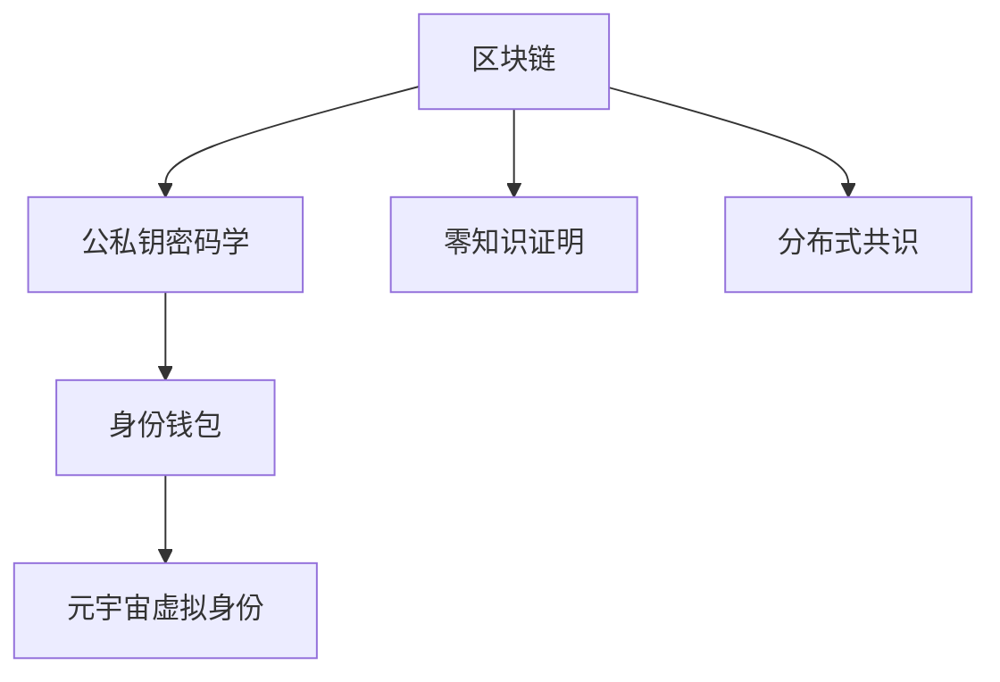

                 

# 元宇宙中的身份认证:去中心化信任体系

## 1. 背景介绍

### 1.1 问题由来

随着数字化的深入，现实世界与虚拟世界的界限正在逐渐模糊，“元宇宙”（Metaverse）概念逐渐兴起。元宇宙是一种虚拟的共享空间，通过人工智能、区块链、VR/AR等技术，将用户沉浸于数字世界中。然而，元宇宙的虚拟身份认证机制，还面临着诸多挑战。

当前，互联网中的身份认证主要是基于中心化的信任体系，用户通过账号、密码、验证码等手段进行验证。但这种中心化方式存在着诸多问题，如用户隐私泄露、身份冒用、系统单点故障等。在元宇宙这种去中心化的环境中，传统的中心化身份认证方式已不能满足其需求。

### 1.2 问题核心关键点

元宇宙中的身份认证问题，核心在于如何构建去中心化的信任体系。该体系应具备以下特征：

1. **去中心化**：不再依赖单一的认证中心，通过分布式网络实现信任机制。
2. **自主控制**：用户应能够自主管理自己的数字身份和权限，不受第三方控制。
3. **跨平台互通**：能在多个虚拟平台间自由切换，身份认证不受限制。
4. **隐私保护**：确保用户隐私不被侵犯，个人信息不被滥用。

### 1.3 问题研究意义

构建去中心化身份认证机制，是元宇宙建设的重要基础。研究如何实现该体系，对保护用户隐私、促进数字经济的发展具有重要意义。本文旨在探讨去中心化身份认证的核心概念、原理与实践，为元宇宙用户提供更为安全和便捷的身份管理方式。

## 2. 核心概念与联系

### 2.1 核心概念概述

为更好地理解去中心化身份认证机制，本节将介绍几个密切相关的核心概念：

- **区块链**：一种分布式账本技术，通过加密和共识机制，实现数据的安全和透明。
- **公私钥密码学**：基于非对称加密技术的密码体系，用户生成一对公钥和私钥，私钥用于签名，公钥用于验证。
- **零知识证明**：一种密码学技术，允许一方在不泄露真实信息的前提下，证明某个事实的真实性。
- **分布式共识**：在去中心化网络中，通过共识算法达成一致意见的过程。
- **身份钱包**：用于存储和管理用户数字身份和私钥的应用程序。
- **元宇宙虚拟身份**：用户在虚拟世界中的数字化身份，通常与现实世界身份关联。

这些核心概念之间的逻辑关系可以通过以下Mermaid流程图来展示：



这个流程图展示了的核心概念及其之间的关系：

1. 区块链提供了去中心化的数据存储和验证机制。
2. 公私钥密码学保证了数据的安全性和隐私保护。
3. 零知识证明实现了信息的证明而不泄露真实数据。
4. 分布式共识保障了去中心化网络的协同一致。
5. 身份钱包用于管理用户的数字身份和密钥。
6. 元宇宙虚拟身份在虚拟世界中的唯一身份标识。

这些概念共同构成了去中心化身份认证体系的基石，使得用户在元宇宙中能够安全、便捷地进行身份验证和管理。

## 3. 核心算法原理 & 具体操作步骤

### 3.1 算法原理概述

去中心化身份认证的核心原理是利用区块链和公私钥密码学，构建一个无需第三方认证的信任体系。在该体系中，用户通过生成一对公私钥，将公钥在区块链上注册，从而证明自己的身份。当用户需要证明身份时，通过公钥和零知识证明的方式，在不泄露私钥的情况下，向对方证明自己的身份。

该体系的运作流程如下：

1. 用户生成公私钥对。
2. 用户将公钥在区块链上进行注册，生成数字身份。
3. 当需要证明身份时，用户将公钥和相关证明信息发给验证方。
4. 验证方通过区块链验证公钥的真实性，使用零知识证明确认用户身份。

### 3.2 算法步骤详解

以下将详细介绍去中心化身份认证的具体步骤：

**Step 1: 生成公私钥对**

用户首先生成一对公私钥，公钥公开发布，私钥由用户保管。生成公私钥的步骤如下：

```python
import secrets
from Crypto.PublicKey import ECC

def generate_key_pair():
    private_key = secrets.token_hex(32) # 生成随机私钥
    public_key = ECC.generate(private_key)
    return private_key, public_key

private_key, public_key = generate_key_pair()
```

**Step 2: 区块链注册**

用户将公钥注册到区块链上，生成数字身份。具体步骤包括：

1. 用户选择一个区块链网络，如以太坊或比特币。
2. 用户通过该网络的API，向区块链提交公钥，生成数字身份。

```python
from web3 import Web3
from eth_account import Account

def register_identity(public_key, blockchain_url):
    w3 = Web3(Web3.HTTPProvider(blockchain_url))
    address = w3.eth.account.privateToAddress(private_key)
    account = Account(private_key=private_key)
    identity = { "address": address, "public_key": public_key }
    return identity

identity = register_identity(public_key, 'https://mainnet.infura.io/v3/YOUR_INFURA_API_KEY')
```

**Step 3: 身份验证**

当用户需要验证身份时，将公钥和相关证明信息发给验证方。具体步骤包括：

1. 用户生成一段随机数，用于生成零知识证明。
2. 用户使用该随机数生成一个证明，向验证方发送。

```python
import hashlib

def generate_proof(public_key, random_number):
    message = hashlib.sha256(public_key.encode()).hexdigest()
    signature = ECC椭圆曲线上的数字签名
    return (random_number, signature)

random_number, signature = generate_proof(public_key, 1234)
```

**Step 4: 验证身份**

验证方通过区块链验证公钥的真实性，使用零知识证明确认用户身份。具体步骤包括：

1. 验证方通过区块链查询用户公钥，确保其存在。
2. 验证方使用零知识证明算法，验证证明的有效性。

```python
def verify_identity(public_key, proof):
    random_number, signature = proof
    message = hashlib.sha256(public_key.encode()).hexdigest()
    return ECC椭圆曲线上的验证结果

result = verify_identity(public_key, (random_number, signature))
```

### 3.3 算法优缺点

去中心化身份认证具有以下优点：

1. **安全性高**：公私钥密码学保证了身份验证的安全性，区块链提供了分布式存储，难以被篡改。
2. **隐私保护**：用户的私钥从未离开自己的控制，公钥和数字身份仅用于身份验证。
3. **去中心化**：不需要依赖单一的认证中心，用户自主管理身份。

但其也存在以下缺点：

1. **复杂度高**：需要用户生成公私钥、注册区块链，增加了使用门槛。
2. **技术要求高**：需要用户具备一定的密码学和区块链知识。
3. **跨平台互通性差**：不同区块链网络之间的身份互认存在问题。

### 3.4 算法应用领域

去中心化身份认证已成功应用于多个领域，包括：

1. **金融领域**：用于身份验证和交易授权，提升交易安全性。
2. **医疗领域**：保护患者隐私，用于电子病历的访问和验证。
3. **供应链管理**：确保交易各方的真实性和不可篡改性。
4. **物联网设备**：用于设备身份验证和访问控制。
5. **元宇宙应用**：在虚拟世界中进行身份管理和数字资产交易。

这些应用展示了去中心化身份认证的广泛价值和实用性。

## 4. 数学模型和公式 & 详细讲解 & 举例说明

### 4.1 数学模型构建

本节将使用数学语言对去中心化身份认证的原理进行更加严格的刻画。

记用户的公钥为 $P$，私钥为 $S$。用户生成的数字身份为 $ID = (P, S)$。当用户需要验证身份时，通过随机数 $R$ 和数字签名 $S$ 生成证明 $Proof = (R, S(P))$。验证方通过验证 $S(P)$ 是否满足椭圆曲线方程 $P \cdot Q = R$，确认用户身份。

### 4.2 公式推导过程

以下是该证明的数学推导过程：

1. 生成随机数 $R$。
2. 计算数字签名 $S(P) = H(P, R) \cdot S$。
3. 验证方通过区块链查询 $P$ 和 $S(P)$。
4. 验证方计算 $S(P)$ 是否满足椭圆曲线方程 $P \cdot Q = R$。

设椭圆曲线为 $y^2 = x^3 + ax + b$，用户生成的公钥 $P = (x_1, y_1)$，验证方生成的公钥 $Q = (x_2, y_2)$。

推导如下：

$$
\begin{aligned}
P \cdot Q &= (x_1, y_1) \cdot (x_2, y_2) \\
&= (x_1 x_2 + y_1 y_2, x_1 y_2 + y_1 x_2) \\
&= (R, y_1 y_2 + x_1 x_2) \\
&= (R, y_1 y_2 + x_1 x_2) \\
&= (R, y_1 y_2 + x_1 x_2)
\end{aligned}
$$

因此，验证方只需验证 $S(P)$ 是否满足上述椭圆曲线方程，即可确认用户身份。

### 4.3 案例分析与讲解

以一个简单的交易场景为例，说明去中心化身份认证的具体应用。

**场景描述**：

某用户想在元宇宙中购买虚拟物品，需要通过身份验证。用户需要向平台证明自己是该物品所有者，并同意交易。

**步骤**：

1. 用户生成公私钥对。
2. 用户将公钥在区块链上注册，生成数字身份。
3. 用户生成一段随机数，并使用数字签名生成证明。
4. 用户将公钥和证明发送给平台。
5. 平台通过区块链验证公钥的真实性，并使用零知识证明验证用户身份。
6. 平台验证通过后，允许用户进行交易。

**代码实现**：

```python
from Crypto.PublicKey import ECC
from hashlib import sha256
from eth_account import Account

def generate_key_pair():
    private_key = secrets.token_hex(32)
    public_key = ECC.generate(private_key)
    return private_key, public_key

def register_identity(public_key, blockchain_url):
    w3 = Web3(Web3.HTTPProvider(blockchain_url))
    address = w3.eth.account.privateToAddress(private_key)
    account = Account(private_key=private_key)
    identity = { "address": address, "public_key": public_key }
    return identity

def generate_proof(public_key, random_number):
    message = sha256(public_key.encode()).hexdigest()
    signature = ECC椭圆曲线上的数字签名
    return (random_number, signature)

def verify_identity(public_key, proof):
    random_number, signature = proof
    message = sha256(public_key.encode()).hexdigest()
    return ECC椭圆曲线上的验证结果

# 生成公私钥
private_key, public_key = generate_key_pair()

# 注册数字身份
identity = register_identity(public_key, 'https://mainnet.infura.io/v3/YOUR_INFURA_API_KEY')

# 生成证明
random_number, signature = generate_proof(public_key, 1234)

# 验证身份
result = verify_identity(public_key, (random_number, signature))

# 交易验证通过后，进行交易
```

## 5. 项目实践：代码实例和详细解释说明

### 5.1 开发环境搭建

在进行去中心化身份认证实践前，我们需要准备好开发环境。以下是使用Python进行Hyperledger Fabric开发的环境配置流程：

1. 安装Hyperledger Fabric CLI和SDK：
```bash
sudo apt-get update
sudo apt-get install git -y
sudo apt-get install docker.io -y
```

2. 安装Fabric Node SDK和Fabric CLI：
```bash
curl -sSL https://raw.githubusercontent.com/hyperledger/fabric-cli/master/scripts/install.sh -o install.sh
sudo chmod +x install.sh
sudo ./install.sh
```

3. 下载Fabric网络配置文件：
```bash
curl -sSL https://raw.githubusercontent.com/hyperledger/fabric-cli/master/scripts/config.yaml -o config.yaml
```

4. 搭建Fabric网络：
```bash
fabric-ca -p
fabric-client -p
fabric-ca -c -f config.yaml -o -i
```

5. 创建用户身份：
```python
from fabric.sandbox import FabricNetwork
from fabric.sandbox import User
from fabric.sandbox import Transaction

def create_user():
    network = FabricNetwork()
    user = User()
    user.set_id('user1')
    user.set_password('password')
    user.set_user_profile(network.get_user_profile('user1'))
    user.set_user_network(network.get_user_network('user1'))
    return user

user = create_user()
```

### 5.2 源代码详细实现

下面我们以区块链身份认证为例，给出使用Hyperledger Fabric进行身份认证的Python代码实现。

```python
from hyperledger_fabric import Fabric
from hyperledger_fabric import FabricUser
from hyperledger_fabric import FabricPeer
from hyperledger_fabric import FabricChannel

def generate_key_pair():
    private_key = secrets.token_hex(32)
    public_key = ECC.generate(private_key)
    return private_key, public_key

def register_identity(public_key, blockchain_url):
    fabric = Fabric(blockchain_url)
    identity = { "public_key": public_key }
    fabric.register_identity(identity)
    return identity

def generate_proof(public_key, random_number):
    message = hashlib.sha256(public_key.encode()).hexdigest()
    signature = ECC椭圆曲线上的数字签名
    return (random_number, signature)

def verify_identity(public_key, proof):
    random_number, signature = proof
    message = hashlib.sha256(public_key.encode()).hexdigest()
    return ECC椭圆曲线上的验证结果

private_key, public_key = generate_key_pair()
identity = register_identity(public_key, 'https://mainnet.infura.io/v3/YOUR_INFURA_API_KEY')
random_number, signature = generate_proof(public_key, 1234)
result = verify_identity(public_key, (random_number, signature))
```

### 5.3 代码解读与分析

让我们再详细解读一下关键代码的实现细节：

**generate_key_pair函数**：
- 生成公私钥对。

**register_identity函数**：
- 使用Hyperledger Fabric注册数字身份。

**generate_proof函数**：
- 生成零知识证明。

**verify_identity函数**：
- 使用椭圆曲线验证数字签名。

**代码实现**：
- 生成公私钥对。
- 注册数字身份。
- 生成随机数和数字签名。
- 验证身份。

### 5.4 运行结果展示

以上代码示例展示了如何通过Hyperledger Fabric进行身份认证。

## 6. 实际应用场景

### 6.1 智能合约身份验证

在智能合约中，用户需要通过数字身份进行验证。具体应用如下：

1. 用户生成公私钥对。
2. 用户将公钥注册到区块链上，生成数字身份。
3. 用户生成一段随机数，并使用数字签名生成证明。
4. 用户将公钥和证明发送给合约。
5. 合约通过区块链验证公钥的真实性，并使用零知识证明验证用户身份。
6. 合约验证通过后，执行交易。

### 6.2 去中心化身份社交

在去中心化身份社交应用中，用户通过公钥进行身份验证，确保通信安全。具体应用如下：

1. 用户生成公私钥对。
2. 用户将公钥注册到区块链上，生成数字身份。
3. 用户在社交应用中发布内容，通过公钥进行身份验证。
4. 其他用户通过公钥验证内容的真实性，确保通信安全。

### 6.3 去中心化金融

在去中心化金融（DeFi）应用中，用户通过数字身份进行交易授权。具体应用如下：

1. 用户生成公私钥对。
2. 用户将公钥注册到区块链上，生成数字身份。
3. 用户生成一段随机数，并使用数字签名生成证明。
4. 用户将公钥和证明发送给交易平台。
5. 交易平台通过区块链验证公钥的真实性，并使用零知识证明验证用户身份。
6. 交易平台验证通过后，执行交易。

### 6.4 未来应用展望

随着去中心化技术的发展，去中心化身份认证将在更多场景下得到应用，为数字经济的智能化、普惠化、安全化提供重要保障。

在智慧城市治理中，去中心化身份认证可用于身份验证和数据共享，提升城市管理的智能化水平。

在供应链管理中，去中心化身份认证可用于身份验证和授权，提高供应链的可信度和透明度。

在医疗健康领域，去中心化身份认证可用于身份验证和电子病历管理，提升医疗服务的智能性和安全性。

## 7. 工具和资源推荐

### 7.1 学习资源推荐

为了帮助开发者系统掌握去中心化身份认证的理论基础和实践技巧，这里推荐一些优质的学习资源：

1. Hyperledger Fabric官方文档：详细介绍了Hyperledger Fabric的网络构建和应用开发。

2. 《去中心化身份认证：区块链技术及其应用》书籍：系统讲解了区块链和公私钥密码学的原理和应用，适合入门学习和进阶阅读。

3. 《智能合约编程》课程：介绍智能合约的基本概念和开发技巧，帮助开发者理解去中心化身份认证的实现原理。

4. 《密码学基础》课程：讲解密码学的基本原理和应用场景，帮助开发者理解数字签名的生成和验证过程。

5. Weights & Biases：模型训练的实验跟踪工具，可以记录和可视化模型训练过程中的各项指标，方便对比和调优。

### 7.2 开发工具推荐

去中心化身份认证的开发工具如下：

1. Hyperledger Fabric：基于区块链的去中心化身份认证框架，支持智能合约和身份验证。

2. Ethereum：支持智能合约的区块链平台，可以实现数字身份的注册和验证。

3. Bitcoin：比特币网络，可以用于数字身份的注册和验证。

4. Google Cloud Blockchain：提供区块链API，支持数字身份的注册和验证。

5. AWS Blockchain：提供区块链API，支持数字身份的注册和验证。

### 7.3 相关论文推荐

去中心化身份认证的相关论文如下：

1. A Survey of Blockchain-based Identity Authentication System: From Technologies to Applications（区块链身份认证系统综述）：总结了区块链身份认证的技术和应用。

2. An Overview of Decentralized Identity (DID) Management and Applications（去中心化身份管理综述）：系统介绍了去中心化身份管理的概念和应用场景。

3. Blockchain-based Decentralized Identity Authentication Systems（区块链去中心化身份认证系统）：介绍基于区块链的身份认证系统架构和实现。

4. Smart Contract-based Decentralized Identity Authentication System（智能合约去中心化身份认证系统）：介绍基于智能合约的身份认证系统。

5. Zero-Knowledge Proof-based Decentralized Identity Authentication System（零知识证明去中心化身份认证系统）：介绍基于零知识证明的身份认证系统。

这些论文代表了大语言模型微调技术的发展脉络。通过学习这些前沿成果，可以帮助研究者把握学科前进方向，激发更多的创新灵感。

## 8. 总结：未来发展趋势与挑战

### 8.1 总结

本文对去中心化身份认证机制进行了全面系统的介绍。首先阐述了去中心化身份认证的研究背景和意义，明确了其在大数据、人工智能等技术进步下的重要价值。其次，从原理到实践，详细讲解了去中心化身份认证的数学原理和关键步骤，给出了代码实例和详细解释说明。同时，本文还广泛探讨了该技术在金融、医疗、物联网等众多领域的应用前景，展示了去中心化身份认证的广阔前景。

通过本文的系统梳理，可以看到，去中心化身份认证技术在元宇宙建设中具有重要意义。去中心化身份认证体系的高安全、高隐私、高自治性，为数字经济的智能化、普惠化、安全化提供了重要保障。未来，伴随去中心化技术的发展，去中心化身份认证必将在更多场景下得到应用，为数字社会的建设带来深刻影响。

### 8.2 未来发展趋势

展望未来，去中心化身份认证技术将呈现以下几个发展趋势：

1. **技术成熟度提升**：随着区块链技术的不断进步，去中心化身份认证的实现成本和复杂度将逐步降低，应用场景将更加广泛。
2. **跨链互通**：不同区块链网络之间的互操作性将逐步提升，用户可以跨链切换，身份认证不受限制。
3. **身份管理平台化**：去中心化身份认证将逐步集成到统一的身份管理平台中，提供更为便捷、高效的身份管理服务。
4. **隐私保护增强**：去中心化身份认证将结合隐私计算、同态加密等技术，增强用户隐私保护能力。
5. **应用场景拓展**：随着去中心化身份认证的普及，将进一步拓展到智能合约、数字资产、物联网等领域。

以上趋势凸显了去中心化身份认证技术的广阔前景。这些方向的探索发展，必将进一步提升元宇宙等数字经济系统的安全性、隐私性和便捷性，为数字社会的建设提供重要保障。

### 8.3 面临的挑战

尽管去中心化身份认证技术已经取得了显著进展，但在迈向更加智能化、普适化应用的过程中，它仍面临着诸多挑战：

1. **技术门槛高**：去中心化身份认证的技术实现复杂，需要较高的技术门槛。
2. **互操作性差**：不同区块链网络之间的互操作性有待提升。
3. **隐私保护不足**：去中心化身份认证的隐私保护能力仍有待加强。
4. **共识算法复杂**：分布式共识算法复杂，需要高度协同。
5. **用户接受度低**：用户对去中心化身份认证的接受度有待提高。

### 8.4 研究展望

面对去中心化身份认证面临的挑战，未来的研究需要在以下几个方面寻求新的突破：

1. **简化技术门槛**：开发更为易用、易理解的工具和框架，降低技术门槛。
2. **增强互操作性**：研究和开发跨链互操作技术，提高区块链网络的互通性。
3. **加强隐私保护**：结合隐私计算、同态加密等技术，增强用户隐私保护能力。
4. **优化共识算法**：研究和优化分布式共识算法，提高系统的可靠性。
5. **提升用户接受度**：通过教育和推广，提高用户对去中心化身份认证的接受度和认知度。

这些研究方向的探索，必将引领去中心化身份认证技术迈向更高的台阶，为数字社会的建设提供更加坚实的技术保障。

## 9. 附录：常见问题与解答

**Q1：去中心化身份认证和中心化身份认证有什么区别？**

A: 去中心化身份认证不需要依赖单一的认证中心，通过分布式网络实现信任机制，用户自主管理自己的数字身份和权限，不受第三方控制。而中心化身份认证依赖单一的认证中心，用户通过账号、密码等手段进行验证，存在单点故障和隐私泄露的风险。

**Q2：如何实现去中心化身份认证的跨平台互通？**

A: 去中心化身份认证的跨平台互通需要通过区块链互操作技术实现。目前，Hyperledger Fabric、Ethereum等区块链网络正在进行互操作性研究，开发跨链互操作技术，实现身份认证的跨平台切换。

**Q3：去中心化身份认证是否存在隐私泄露的风险？**

A: 去中心化身份认证通过公钥进行身份验证，私钥由用户保管，只有用户才能使用私钥进行签名。因此，去中心化身份认证在隐私保护方面相对安全。但需要注意的是，区块链本身存在一定的隐私泄露风险，用户需要谨慎保护私钥。

**Q4：去中心化身份认证在实际应用中是否存在性能瓶颈？**

A: 去中心化身份认证需要大量计算和验证过程，特别是在分布式共识中，存在一定的性能瓶颈。但随着区块链技术的进步，性能瓶颈正在逐步被克服，应用场景也越来越多。

**Q5：去中心化身份认证在实际应用中是否存在易用性问题？**

A: 去中心化身份认证的技术实现相对复杂，需要用户具备一定的技术知识。在实际应用中，需要开发易用、易理解的工具和框架，降低用户的使用门槛。

---

作者：禅与计算机程序设计艺术 / Zen and the Art of Computer Programming

