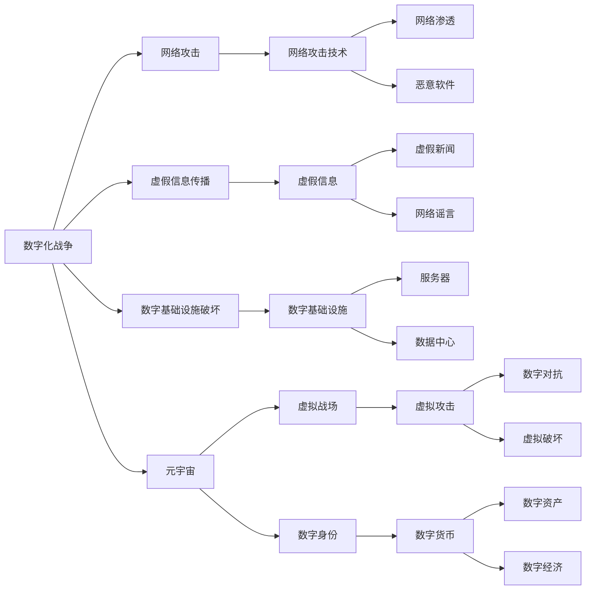

                 

# 元宇宙军备竞赛:数字化战争中的国际关系新态势

> 关键词：元宇宙,数字化战争,国际关系,军事科技,网络安全

## 1. 背景介绍

随着互联网技术不断成熟和普及，数字世界的边界正在向现实世界逐步拓展，形成了一个高度互动、全景映射的“元宇宙”概念。元宇宙不仅仅是一个虚拟空间，它更是一个集成了现实世界的经济、社会、政治和文化等多重维度的数字仿真环境。在这样的背景下，数字化战争也正在悄然演变，利用虚拟空间进行网络攻击、信息战、虚拟对抗成为新的趋势。因此，围绕元宇宙的军备竞赛，正在成为国际关系领域的新热点。

### 1.1 数字化战争的兴起

数字化战争与传统的机械化、热战等相比，具有全新的形式与特点：

1. **信息不对称优势**：数字化战争中，信息是核心资源，信息优势的一方可以借助数据、算法、网络等技术手段，对敌对国家实施全方位的信息渗透与操控。
2. **无实际物理损害**：数字化战争中，攻击方的目标往往不是造成实际的物理损害，而是通过网络攻击、虚假信息传播等方式，破坏敌对国家的数字基础设施，影响其社会稳定与经济安全。
3. **快速、高效**：数字化战争的攻击与防御可以在瞬间完成，具有高度的实时性和高效性，传统战争模式难以适应。

### 1.2 元宇宙的兴起

元宇宙是一个高度仿真的数字空间，它利用先进的AI、VR/AR、区块链等技术，构建了一个超越物理限制的虚拟世界。在元宇宙中，数字身份、数字资产、数字货币等概念得以广泛应用，形成了一个全新的数字生态系统。元宇宙的崛起，为数字化战争提供了新的平台和手段。

## 2. 核心概念与联系

### 2.1 核心概念概述

在数字化战争与元宇宙的语境下，涉及的核心概念包括：

1. **数字化战争**：通过数字化手段，在网络空间进行的战争，目标是削弱敌对国家的数字能力和基础设施。
2. **元宇宙**：高度仿真的数字空间，涵盖经济、政治、社会、文化等多个维度，成为数字化战争的新战场。
3. **AI与机器学习**：用于构建智能化网络攻击与防御系统，提升数字化战争的效率和智能化水平。
4. **网络安全**：涉及保护网络空间的隐私、数据安全、系统防护等多个方面，是数字化战争的重要组成部分。
5. **国际关系**：数字化战争和元宇宙的竞争，不仅是技术和能力上的较量，更是国际政治和意识形态的博弈。

### 2.2 核心概念原理和架构的 Mermaid 流程图



这张图展示了数字化战争和元宇宙的架构与联系，可以看出，数字化战争和元宇宙是紧密相连的，它们通过AI与机器学习、网络安全等技术手段，形成了一个相互作用的整体。

## 3. 核心算法原理 & 具体操作步骤

### 3.1 算法原理概述

基于数字化战争和元宇宙的背景，涉及的核心算法包括：

1. **网络攻击算法**：用于生成和执行网络攻击的算法，如网络渗透、木马植入等。
2. **信息传播算法**：用于生成和传播虚假信息的算法，如生成对抗网络（GAN）、自然语言处理（NLP）等。
3. **基础设施破坏算法**：用于破坏数字基础设施的算法，如DDoS攻击、勒索软件等。
4. **防御算法**：用于防御网络攻击和虚假信息的算法，如入侵检测系统（IDS）、数字水印等。

这些算法的核心在于，通过AI和机器学习技术，提升攻击和防御的效率与智能化水平。

### 3.2 算法步骤详解

1. **数据收集与预处理**：
    - 收集敌对国家的数字化资产信息，如服务器、数据中心等。
    - 使用数据挖掘技术，收集公开的防御措施与漏洞信息。

2. **算法训练**：
    - 使用机器学习算法，训练网络攻击算法，生成各种恶意软件和网络漏洞。
    - 使用自然语言处理技术，训练虚假信息传播算法，生成各种虚假新闻和网络谣言。
    - 使用深度学习算法，训练基础设施破坏算法，生成各种DDoS攻击和勒索软件。
    - 使用异常检测技术，训练防御算法，识别和防御网络攻击和虚假信息。

3. **攻击实施与防御响应**：
    - 根据收集到的信息，实施网络攻击和虚假信息传播。
    - 使用防御算法，实时监测和响应攻击行为。

### 3.3 算法优缺点

#### 优点：
- **高效性**：通过AI和机器学习算法，可以大大提升攻击和防御的效率，实现实时响应和智能化处理。
- **灵活性**：基于元宇宙的虚拟空间，攻击和防御可以灵活调整，适应不同的环境和目标。
- **精确性**：AI和机器学习算法可以实现对攻击和防御行为的精确控制，避免误伤和误报。

#### 缺点：
- **复杂性**：算法涉及多个技术领域，开发和维护复杂。
- **依赖性**：对AI和机器学习技术的依赖较大，需要不断更新和升级算法。
- **安全性**：攻击和防御算法本身可能存在漏洞，被对手利用。

### 3.4 算法应用领域

基于数字化战争和元宇宙的核心算法，可以应用于以下领域：

1. **网络安全**：防御DDoS攻击、勒索软件等网络威胁。
2. **虚假信息治理**：识别和过滤虚假新闻、网络谣言等。
3. **网络战策略**：制定网络战策略，模拟和演练网络攻击与防御。
4. **数字经济保护**：保护数字资产、数字货币等数字经济的核心元素。
5. **国际关系分析**：分析数字化战争和元宇宙的国际竞争态势，制定应对策略。

## 4. 数学模型和公式 & 详细讲解 & 举例说明

### 4.1 数学模型构建

在数字化战争和元宇宙的背景下，涉及的数学模型包括：

1. **网络流量模型**：描述网络攻击和防御的流量变化。
2. **信息传播模型**：描述虚假信息的生成、传播和影响。
3. **防御响应模型**：描述防御算法对攻击行为的响应。

### 4.2 公式推导过程

以下以虚假信息传播模型为例，推导其数学公式：

设虚假信息为 $I$，信息传播速度为 $v$，传播范围为 $r$，受影响群体为 $G$，信息影响强度为 $e$，则虚假信息传播模型可表示为：

$$
\begin{aligned}
I(t+1) &= I(t) + v \times r(t) \times e(t) \times G(t) \\
r(t) &= r_0 - k \times r(t-1) \\
e(t) &= e_0 - l \times e(t-1) \\
G(t) &= G_0 + m \times (I(t) - I_{thres})
\end{aligned}
$$

其中，$t$ 表示时间，$I(t)$ 表示时刻 $t$ 的虚假信息数量，$r(t)$ 表示传播范围，$e(t)$ 表示信息影响强度，$G(t)$ 表示受影响群体数量，$v$ 表示传播速度，$r_0$ 表示初始传播范围，$k$ 表示传播衰减系数，$e_0$ 表示初始信息影响强度，$l$ 表示影响强度衰减系数，$G_0$ 表示初始受影响群体数量，$m$ 表示信息传播增长系数，$I_{thres}$ 表示信息阈值。

### 4.3 案例分析与讲解

假设有国家 $A$ 和 $B$，国家 $A$ 利用虚假信息传播算法，通过社交媒体向国家 $B$ 传播虚假信息，假设每个虚假信息能影响 $1000$ 个用户，传播速度为 $10$，传播范围衰减系数为 $0.9$，信息影响强度衰减系数为 $0.8$，初始受影响群体为 $10000$，虚假信息阈值为 $100$。根据上述模型，计算国家 $A$ 的虚假信息传播过程如下：

1. 初始时刻 $t=0$，虚假信息 $I(0)=0$，传播范围 $r(0)=10000$，信息影响强度 $e(0)=10000$，受影响群体 $G(0)=10000$。
2. 在时刻 $t=1$，虚假信息传播 $1000 \times 10 \times 0.9 \times 0.8 \times 10000 = 7200$ 个，影响范围变为 $10000-9000=1000$，信息影响强度变为 $10000-7200=2800$，受影响群体变为 $10000+7200=17200$。
3. 在时刻 $t=2$，虚假信息传播 $7200 \times 10 \times 0.9 \times 0.8 \times 1000 = 51840$ 个，影响范围变为 $1000-9000=-8000$（不合理，说明虚假信息传播已经超出阈值，不再衰减），信息影响强度变为 $2800-51840=-49040$（不合理，说明虚假信息传播已经超出阈值，不再衰减），受影响群体变为 $17200+51840=69040$。

因此，国家 $A$ 的虚假信息传播过程为 $I(t) = 7200 \times 10^t$，受影响群体增长速度为 $51840 \times 10^t$。

## 5. 项目实践：代码实例和详细解释说明

### 5.1 开发环境搭建

在数字化战争和元宇宙的背景下，开发环境搭建包括：

1. **硬件要求**：高性能计算机，具备计算能力和存储能力，支持虚拟仿真和AI计算。
2. **软件要求**：Python、PyTorch、TensorFlow、Jupyter Notebook 等开发环境。
3. **网络要求**：稳定、高速的网络连接，支持虚拟仿真和AI训练。

### 5.2 源代码详细实现

以下是一个简单的虚假信息传播模型的Python代码实现：

```python
import numpy as np

# 初始化虚假信息参数
I = 0
r = 10000
e = 10000
G = 10000
v = 10
k = 0.9
l = 0.8
m = 1
I_thres = 100

# 传播模型
def spread_model(t):
    I_new = I + v * r * e * G
    r_new = r * (1 - k)
    e_new = e * (1 - l)
    G_new = G + m * (I - I_thres)
    return I_new, r_new, e_new, G_new

# 虚假信息传播过程
timesteps = 10
I_list = [I]
r_list = [r]
e_list = [e]
G_list = [G]

for t in range(timesteps):
    I_new, r_new, e_new, G_new = spread_model(t)
    I = I_new
    r = r_new
    e = e_new
    G = G_new
    I_list.append(I)
    r_list.append(r)
    e_list.append(e)
    G_list.append(G)

# 绘制传播过程
import matplotlib.pyplot as plt

plt.plot(range(timesteps+1), I_list, label='I')
plt.plot(range(timesteps+1), r_list, label='r')
plt.plot(range(timesteps+1), e_list, label='e')
plt.plot(range(timesteps+1), G_list, label='G')
plt.xlabel('Time')
plt.ylabel('Value')
plt.legend()
plt.show()
```

### 5.3 代码解读与分析

这段代码实现了虚假信息传播模型，通过迭代计算每个时刻的虚假信息数量、传播范围、信息影响强度和受影响群体数量，并绘制出虚假信息传播过程的曲线图。通过可视化结果，可以直观地看到虚假信息传播的增长趋势和受影响群体的变化。

## 6. 实际应用场景

### 6.1 网络安全

在数字化战争中，网络安全是一个重要领域。国家可以利用虚假信息传播算法，通过社交媒体向敌对国家传播虚假信息，造成恐慌和混乱，从而削弱其网络安全防护能力。例如，假设敌对国家公开其网络防御系统存在的漏洞，国家可以通过模拟攻击，验证漏洞的真实性，然后迅速封堵，同时在社交媒体上传播虚假信息，称敌对国家已被攻击，造成其社会恐慌和网络安全防护能力的下降。

### 6.2 虚假信息治理

在数字化战争中，虚假信息的治理也是一项重要任务。国家可以利用虚假信息传播算法，及时识别和过滤虚假信息，保护民众免受虚假信息的侵害。例如，假设敌对国家通过社交媒体传播虚假信息，国家可以利用虚假信息检测算法，实时监测社交媒体上的信息传播情况，一旦发现虚假信息，迅速采取措施进行过滤和删除。

### 6.3 网络战策略

在数字化战争中，制定网络战策略也是一项重要任务。国家可以利用虚假信息传播算法，模拟和演练网络攻击与防御，优化网络战策略。例如，国家可以模拟敌对国家的虚假信息传播过程，分析其攻击手段和策略，然后制定相应的防御策略，提升自身的网络防御能力。

### 6.4 未来应用展望

在数字化战争和元宇宙的背景下，未来的应用场景将更加广阔：

1. **智能防御系统**：利用AI和机器学习技术，构建智能化的网络防御系统，实时监测和响应网络攻击。
2. **虚拟仿真训练**：利用虚拟仿真技术，构建数字化战争训练平台，模拟和演练各种网络攻击与防御场景，提升应对能力。
3. **跨领域融合**：与其他技术领域融合，如人工智能、区块链等，构建更加全面和复杂的网络安全体系。
4. **伦理与法规**：制定网络安全伦理与法规，规范数字化战争和元宇宙的行为，避免滥用和危害。

## 7. 工具和资源推荐

### 7.1 学习资源推荐

为了帮助开发者系统掌握数字化战争和元宇宙的核心技术，这里推荐一些优质的学习资源：

1. **《网络安全与元宇宙：理论与实践》系列课程**：由知名网络安全专家主讲，深入浅出地介绍了数字化战争和元宇宙的基本概念和前沿技术。
2. **《数字战争与元宇宙》书籍**：全面介绍了数字化战争和元宇宙的战略、战术和应用，提供了丰富的案例分析。
3. **《AI与机器学习在网络安全中的应用》书籍**：介绍了AI和机器学习在网络安全中的各种应用，包括网络攻击与防御、虚假信息传播等。
4. **《网络安全伦理与法规》课程**：深入分析了网络安全中的伦理和法规问题，提供了丰富的实践案例和思考。

通过对这些资源的学习实践，相信你一定能够快速掌握数字化战争和元宇宙的核心技术，并用于解决实际的NLP问题。

### 7.2 开发工具推荐

为了支持数字化战争和元宇宙的开发，以下是几款常用的开发工具：

1. **PyTorch**：Python深度学习框架，支持Tensor、GPU等高性能计算，适合构建复杂的网络模型。
2. **TensorFlow**：由Google开发的深度学习框架，支持分布式计算，适合大规模工程应用。
3. **TensorBoard**：TensorFlow配套的可视化工具，实时监测和展示模型训练状态，便于调试和优化。
4. **Jupyter Notebook**：免费的交互式编程环境，支持多种编程语言，方便开发和共享。
5. **WeChat**：全球领先的社交平台，适合通过社交媒体传播虚假信息。

合理利用这些工具，可以显著提升数字化战争和元宇宙的开发效率，加速创新迭代的步伐。

### 7.3 相关论文推荐

数字化战争和元宇宙的研究涉及多个学科领域，以下是几篇经典的研究论文，推荐阅读：

1. **《网络攻击与防御技术：原理与实践》**：详细介绍了网络攻击与防御的各种技术和方法，包括入侵检测系统、DDoS攻击等。
2. **《虚假信息传播模型及其应用》**：研究了虚假信息的生成、传播和影响，提出了多种虚假信息检测和过滤方法。
3. **《元宇宙与数字化战争：未来战争的新形式》**：分析了元宇宙对数字化战争的影响，提出了基于元宇宙的虚拟战争策略。
4. **《AI在网络安全中的应用》**：介绍了AI和机器学习在网络安全中的各种应用，包括网络攻击检测、异常行为分析等。

这些论文代表了大语言模型微调技术的发展脉络。通过学习这些前沿成果，可以帮助研究者把握学科前进方向，激发更多的创新灵感。

## 8. 总结：未来发展趋势与挑战

### 8.1 研究成果总结

本文对数字化战争和元宇宙的核心技术进行了全面系统的介绍。首先阐述了数字化战争和元宇宙的兴起背景，明确了网络攻击、虚假信息传播等核心概念和其对国际关系的影响。其次，从原理到实践，详细讲解了网络攻击和虚假信息传播的算法原理和操作步骤，给出了代码实现和案例分析。同时，本文还探讨了数字化战争和元宇宙的实际应用场景，展示了其广阔的应用前景。最后，本文精选了相关学习资源和开发工具，力求为读者提供全方位的技术指引。

通过本文的系统梳理，可以看到，数字化战争和元宇宙正在成为国际关系领域的新热点，为人类社会带来了前所未有的挑战和机遇。未来，伴随网络技术的不断进步，数字化战争和元宇宙的应用将更加广泛和深入，对国际关系的重塑作用也将更加显著。

### 8.2 未来发展趋势

展望未来，数字化战争和元宇宙的技术发展将呈现以下几个趋势：

1. **技术融合**：数字化战争和元宇宙将与其他技术领域进行更深入的融合，如AI、区块链、物联网等，构建更加全面和复杂的技术体系。
2. **伦理与法规**：数字化战争和元宇宙的发展需要制定相应的伦理与法规，规范其行为，避免滥用和危害。
3. **全球合作**：数字化战争和元宇宙的威胁是全球性的，需要各国共同合作，制定统一的应对策略。
4. **实战演练**：数字化战争和元宇宙的演练将成为各国军事实战的重要手段，提升实战能力。
5. **伦理与道德**：数字化战争和元宇宙的开发需要考虑伦理与道德问题，避免对人类社会造成负面影响。

以上趋势凸显了数字化战争和元宇宙的广泛前景和深远影响。这些方向的探索发展，必将引领数字化战争和元宇宙技术迈向更高的台阶，为人类社会带来更多的机遇与挑战。

### 8.3 面临的挑战

尽管数字化战争和元宇宙的技术发展已经取得了显著进展，但在迈向更加智能化、普适化应用的过程中，它仍面临着诸多挑战：

1. **安全问题**：网络安全威胁和虚假信息传播是数字化战争和元宇宙的主要挑战，需要不断提升安全防护能力。
2. **伦理问题**：数字化战争和元宇宙的开发需要考虑伦理和道德问题，避免滥用和危害。
3. **法律法规**：需要制定相应的法律法规，规范数字化战争和元宇宙的行为，确保其健康发展。
4. **资源消耗**：数字化战争和元宇宙的开发需要大量计算资源和数据资源，成本较高。
5. **国际合作**：数字化战争和元宇宙是全球性的问题，需要国际合作才能解决。

这些挑战凸显了数字化战争和元宇宙技术发展的复杂性和艰巨性。需要各方共同努力，才能实现其健康、可持续的发展。

### 8.4 研究展望

面对数字化战争和元宇宙所面临的种种挑战，未来的研究需要在以下几个方面寻求新的突破：

1. **技术创新**：开发更加高效、智能化的网络攻击与防御算法，提升防御能力。
2. **伦理与道德**：研究数字化战争和元宇宙的伦理与道德问题，制定相应的伦理标准。
3. **法律法规**：制定数字化战争和元宇宙的法律法规，规范其行为，避免滥用。
4. **国际合作**：推动各国在数字化战争和元宇宙领域的合作，共同应对全球性问题。
5. **安全保障**：构建全球性的网络安全保障体系，提升应对网络威胁的能力。

这些研究方向的探索，必将引领数字化战争和元宇宙技术迈向更高的台阶，为人类社会带来更多的机遇与挑战。面向未来，数字化战争和元宇宙技术还需要与其他人工智能技术进行更深入的融合，共同推动数字化战争和元宇宙技术的进步。

## 9. 附录：常见问题与解答

**Q1: 数字化战争和元宇宙的区别是什么？**

A: 数字化战争主要是通过网络空间进行的攻击与防御，目标是通过破坏敌对国家的数字基础设施，影响其社会稳定与经济安全；元宇宙则是一个高度仿真的数字空间，涵盖经济、政治、社会、文化等多个维度，成为数字化战争的新战场。

**Q2: 网络攻击算法有哪些？**

A: 网络攻击算法包括网络渗透、木马植入、DDoS攻击、勒索软件等，这些算法通过AI和机器学习技术，提升了攻击的效率和智能化水平。

**Q3: 虚假信息传播算法的核心是什么？**

A: 虚假信息传播算法的核心是生成和传播虚假信息，利用AI和机器学习技术，提升了虚假信息的生成和传播速度和范围。

**Q4: 元宇宙对国际关系的影响是什么？**

A: 元宇宙的崛起，为数字化战争提供了新的平台和手段，改变了传统的国际关系格局，成为各国争夺的新焦点。

**Q5: 如何应对数字化战争和元宇宙的挑战？**

A: 应对数字化战争和元宇宙的挑战，需要不断提升网络安全防护能力，制定相应的法律法规，推动国际合作，提升应对能力。

---

作者：禅与计算机程序设计艺术 / Zen and the Art of Computer Programming

