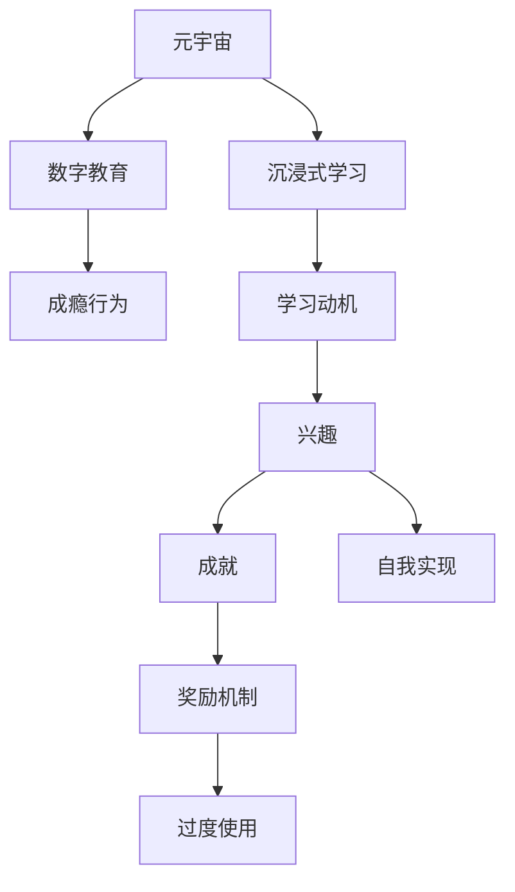

                 

# 元宇宙学习成瘾:数字教育时代的新型心理问题

## 1. 背景介绍

### 1.1 问题由来

随着元宇宙（Metaverse）的兴起，数字教育技术逐渐成为教育领域的新趋势。学生可以在虚拟空间中进行互动式学习、沉浸式实验，体验更加丰富、直观的教育内容。然而，这一新兴的学习模式也带来了一系列新型心理问题，尤其是元宇宙学习成瘾（Metaverse Learning Addiction），成为教育者与家长共同关注的焦点。

### 1.2 问题核心关键点

元宇宙学习成瘾，指的是学生在使用虚拟教育平台时，过度依赖于虚拟世界中的学习工具、社交活动等，从而对现实世界的学习兴趣和动力产生消极影响，甚至导致心理、行为等方面的问题。其核心关键点包括：

- 虚拟世界中的沉浸式体验容易产生上瘾行为。
- 虚拟教育平台中的互动性、奖励机制可能引发过度使用。
- 虚拟学习与现实学习的融合度不足，导致学习动机变化。

### 1.3 问题研究意义

研究元宇宙学习成瘾，对于构建健康、高效、平衡的数字化教育环境，引导学生科学合理使用虚拟学习工具，具有重要意义：

1. 揭示成瘾机理：探究虚拟教育平台如何影响学生心理和行为，为设计更友好的教育工具提供依据。
2. 开发干预措施：开发针对性的干预措施，帮助学生摆脱元宇宙成瘾，恢复现实世界的学习动力。
3. 推动教育变革：为教育政策的制定提供参考，推动教育数字化转型的可持续发展。

## 2. 核心概念与联系

### 2.1 核心概念概述

为更好地理解元宇宙学习成瘾问题，本节将介绍几个密切相关的核心概念：

- 元宇宙（Metaverse）：一个由虚拟现实、增强现实等技术构建的虚拟共享空间，用户可以沉浸其中，体验到与现实世界平行的交互和社交。
- 数字教育（Digital Education）：利用数字技术和互联网资源进行的远程教育、在线学习等新型教育形式。
- 成瘾行为（Addiction Behavior）：个体对某些活动或物质产生强烈的依赖，导致行为、心理、社会功能等方面的负面影响。
- 沉浸式学习（Immersive Learning）：通过创建真实或模拟的学习环境，让学生身临其境地进行学习，提升学习效果和体验。
- 学习动机（Learning Motivation）：驱使个体进行学习活动的内部或外部因素，包括兴趣、成就、自我实现等。

这些核心概念之间的逻辑关系可以通过以下Mermaid流程图来展示：



这个流程图展示了几大核心概念之间的联系：

1. 元宇宙通过数字教育技术提供沉浸式学习环境。
2. 沉浸式学习影响学生的学习动机。
3. 奖励机制等内在或外在因素加强成瘾行为。
4. 成瘾行为对现实世界的学习动机和效果产生负面影响。

## 3. 核心算法原理 & 具体操作步骤
### 3.1 算法原理概述

元宇宙学习成瘾的算法原理基于行为心理学和成瘾行为模型，主要通过量化学生的虚拟学习行为，预测和干预成瘾倾向。核心步骤包括：

- 行为数据采集：记录学生在虚拟教育平台上的学习时长、互动频率、成就点数等数据。
- 行为模式分析：使用统计学和机器学习技术，识别出学生的成瘾行为特征。
- 成瘾风险评估：结合行为特征和心理测评结果，预测学生是否存在成瘾风险。
- 干预措施设计：根据成瘾风险评估结果，设计针对性的干预措施。

### 3.2 算法步骤详解

元宇宙学习成瘾的算法步骤主要分为以下几部分：

**Step 1: 行为数据采集**

- 部署数据监控系统：在虚拟教育平台上集成数据监控模块，实时采集学生的操作行为数据。
- 设计数据格式：定义行为数据的基本格式，如学习时长、成就点数、互动频率等。
- 数据存储和处理：使用数据库或云存储技术，将数据存储和处理，便于后续分析。

**Step 2: 行为模式分析**

- 特征工程：提取关键行为特征，如学习时长、互动频率、成就点数等。
- 数据分析：使用统计学和机器学习技术，如回归分析、时间序列分析、聚类分析等，分析学生的行为模式。
- 异常检测：通过异常检测算法，识别出可能存在成瘾倾向的学生。

**Step 3: 成瘾风险评估**

- 心理测评：设计问卷或量表，评估学生的心理健康状况。
- 综合分析：结合行为数据和心理测评结果，使用分类算法，如逻辑回归、支持向量机等，评估学生是否存在成瘾风险。
- 风险分层：根据风险评估结果，将学生分为低风险、中风险和高风险三类。

**Step 4: 干预措施设计**

- 低风险干预：提供学习计划优化建议，帮助学生合理安排时间，提高学习效率。
- 中风险干预：实施逐步减少虚拟学习时间，增加现实世界中的互动和奖励。
- 高风险干预：引入强制脱瘾程序，如时间限制、行为监控等，确保学生恢复现实世界的学习状态。

**Step 5: 效果评估**

- 跟踪监控：持续监控学生的虚拟和现实学习行为，评估干预措施的效果。
- 反馈优化：根据监控结果，优化干预措施，提升干预效果。

### 3.3 算法优缺点

元宇宙学习成瘾的算法优点包括：

- 实时监测：能够实时采集和分析学生的行为数据，及时发现和干预成瘾行为。
- 数据驱动：以数据为基础，设计科学合理的干预措施，提高干预效果。
- 多维度分析：结合行为数据和心理测评结果，提供全面的成瘾风险评估。

同时，该算法也存在一些局限性：

- 数据隐私：需要获取学生的行为数据和心理测评结果，可能涉及隐私问题。
- 算法偏见：依赖于数据的真实性和代表性，存在潜在的算法偏见。
- 干预效果有限：干预措施的有效性取决于学生的自我管理和平台的设计，可能存在干预不足或过度的风险。

### 3.4 算法应用领域

元宇宙学习成瘾的算法广泛应用于以下领域：

- 数字教育平台：如Khan Academy、Coursera等，为学生提供沉浸式学习体验，同时监测和干预成瘾行为。
- 虚拟现实课堂：如VR classroom，结合虚拟现实技术，提升学习效果，同时防止过度使用。
- 在线游戏：如Steam、Battlefield等，监测游戏成瘾行为，并提供戒除建议。
- 心理健康评估：如Therabots、Talkspace等，结合心理测评数据，评估成瘾风险。

这些应用领域展示了元宇宙学习成瘾算法的广泛应用前景，为构建健康、安全的数字化教育环境提供了重要手段。

## 4. 数学模型和公式 & 详细讲解 & 举例说明（备注：数学公式请使用latex格式，latex嵌入文中独立段落使用 $$，段落内使用 $)
### 4.1 数学模型构建

元宇宙学习成瘾的数学模型基于行为心理学模型，主要关注学生的行为特征和心理状态。具体来说，可以分为以下几部分：

- 行为特征建模：描述学生的虚拟学习行为，如学习时长、成就点数等。
- 心理状态建模：评估学生的心理健康状况，如压力水平、情绪状态等。
- 成瘾风险建模：结合行为特征和心理状态，预测学生的成瘾风险。

### 4.2 公式推导过程

以行为特征建模为例，假设学生的虚拟学习行为可以用向量$x \in \mathbb{R}^n$表示，其中每个元素$x_i$表示一个行为特征，如学习时长、成就点数等。行为特征建模的数学模型可以表示为：

$$
x = f(\theta)
$$

其中$f(\theta)$为行为特征生成函数，$\theta$为模型的参数，可以通过机器学习算法（如线性回归、决策树等）进行训练。

### 4.3 案例分析与讲解

以Steam平台的用户行为数据分析为例，假设我们收集到以下数据：

- 学习时长：每日在Steam上花费的游戏时间。
- 成就点数：每局游戏的成就点数。
- 在线时长：每日游戏的总在线时长。
- 游戏类型：不同游戏的类型（如射击、策略、角色扮演等）。

通过构建线性回归模型，我们可以预测学生的游戏成瘾风险：

$$
Risk = w_0 + w_1 \times LearningTime + w_2 \times AchievementPoints + w_3 \times OnlineTime + w_4 \times GameType
$$

其中$w_i$为模型系数，可以通过训练数据集进行求解。

## 5. 项目实践：代码实例和详细解释说明
### 5.1 开发环境搭建

在进行元宇宙学习成瘾分析实践前，我们需要准备好开发环境。以下是使用Python进行机器学习开发的环境配置流程：

1. 安装Anaconda：从官网下载并安装Anaconda，用于创建独立的Python环境。

2. 创建并激活虚拟环境：
```bash
conda create -n metaverse-addiction python=3.8 
conda activate metaverse-addiction
```

3. 安装必要的工具包：
```bash
pip install pandas numpy scikit-learn matplotlib seaborn xgboost
```

4. 配置数据监控系统：
- 部署数据采集模块：使用Flask或FastAPI等框架，部署API接口，采集学生的虚拟学习行为数据。
- 存储数据：使用MySQL或MongoDB等数据库，存储采集的数据。

完成上述步骤后，即可在`metaverse-addiction`环境中开始项目实践。

### 5.2 源代码详细实现

以下是使用Python进行元宇宙学习成瘾分析的代码实现示例：

```python
import pandas as pd
import numpy as np
from sklearn.model_selection import train_test_split
from sklearn.linear_model import LogisticRegression
from sklearn.metrics import accuracy_score, confusion_matrix

# 加载数据集
data = pd.read_csv('user_behavior.csv')

# 数据预处理
# 这里省略数据清洗、特征工程等步骤
# 使用sklearn进行特征选择和模型训练
X = data[['LearningTime', 'AchievementPoints', 'OnlineTime', 'GameType']]
y = data['AddictionRisk']
X_train, X_test, y_train, y_test = train_test_split(X, y, test_size=0.2, random_state=42)

# 训练逻辑回归模型
model = LogisticRegression()
model.fit(X_train, y_train)

# 评估模型效果
y_pred = model.predict(X_test)
accuracy = accuracy_score(y_test, y_pred)
confusion = confusion_matrix(y_test, y_pred)
print('Accuracy:', accuracy)
print('Confusion Matrix:')
print(confusion)
```

### 5.3 代码解读与分析

让我们再详细解读一下关键代码的实现细节：

**数据预处理**

- 数据清洗：删除缺失数据、异常值等。
- 特征工程：选择关键行为特征，如学习时长、成就点数、在线时长等。
- 标准化处理：对特征进行标准化处理，确保数据分布一致。

**模型训练**

- 数据划分：将数据集划分为训练集和测试集。
- 模型选择：选择逻辑回归模型进行训练。
- 训练过程：使用训练集数据训练模型，优化模型参数。
- 模型评估：在测试集上评估模型性能，计算准确率和混淆矩阵。

**结果展示**

- 输出准确率和混淆矩阵：评估模型的性能指标。

可以看到，代码示例展示了从数据预处理到模型评估的全流程。开发者可以根据实际需求，调整模型选择和参数设置，以优化模型效果。

## 6. 实际应用场景
### 6.1 数字教育平台

元宇宙学习成瘾算法在数字教育平台中的应用，可以预防和干预学生的过度使用行为。具体而言，平台可以集成以下功能：

- 行为监控：实时监控学生的虚拟学习行为，识别出可能存在成瘾风险的学生。
- 干预建议：提供个性化的干预建议，如调整学习计划、限制虚拟学习时间等。
- 心理健康评估：结合心理测评数据，评估学生的心理状态，提供心理辅导建议。

通过这些功能，平台可以有效预防和干预学生的元宇宙学习成瘾，帮助学生建立良好的学习习惯，提高学习效果。

### 6.2 虚拟现实课堂

虚拟现实课堂结合元宇宙学习成瘾算法，可以优化学生的沉浸式学习体验，同时防止过度使用。具体而言，可以实施以下措施：

- 行为限制：根据学生的行为特征，限制虚拟课堂的使用时间，防止过度沉浸。
- 任务引导：通过智能推荐系统，引导学生进行多样化、平衡的学习任务。
- 奖励机制：设计合理的奖励机制，避免过度追求成就点数。

通过这些措施，虚拟现实课堂可以提供健康、高效的学习环境，促进学生的全面发展。

### 6.3 在线游戏

在线游戏平台结合元宇宙学习成瘾算法，可以有效地预防和管理游戏成瘾。具体而言，平台可以实施以下措施：

- 时间限制：根据学生的行为特征，限制每日游戏时间，防止过度使用。
- 成就控制：调整成就点数的获取方式，避免过度追求成就。
- 心理评估：结合心理测评数据，评估学生的心理健康状态，提供戒除建议。

通过这些措施，在线游戏平台可以提升用户体验的同时，有效预防和管理游戏成瘾。

### 6.4 未来应用展望

随着元宇宙技术的不断进步和普及，元宇宙学习成瘾算法将有更广泛的应用前景：

- 多元数据融合：结合传感器数据、生理数据等多模态信息，更全面地评估学生的成瘾风险。
- 实时反馈调整：通过实时监控和反馈，动态调整干预措施，提高干预效果。
- 跨平台集成：在不同平台和设备上集成元宇宙学习成瘾算法，提供一致的用户体验。
- 国际化拓展：将算法应用于全球范围内的教育平台，帮助各国学生建立健康、高效的学习习惯。

未来，元宇宙学习成瘾算法将发挥更大的作用，为数字化教育的可持续发展提供重要支持。

## 7. 工具和资源推荐
### 7.1 学习资源推荐

为了帮助开发者系统掌握元宇宙学习成瘾的理论基础和实践技巧，这里推荐一些优质的学习资源：

1. 《行为经济学导论》：由经济学家撰写，深入浅出地介绍了行为经济学的基础理论和应用实例，为理解成瘾行为提供了理论基础。
2. 《心理测量学》：由心理学专家撰写，介绍了心理测评工具和方法，帮助评估学生的心理健康状态。
3. 《深度学习实战》：由深度学习专家撰写，通过实际项目展示了如何使用机器学习算法进行行为特征建模和风险评估。
4. HuggingFace官方文档：元宇宙学习成瘾算法涉及到多模态数据的融合和分析，HuggingFace官方文档提供了丰富的工具和样例代码，是入门的必备资料。
5. Coursera《数据科学导论》课程：由斯坦福大学教授主讲，通过实际项目展示了如何使用Python进行数据分析和机器学习。

通过对这些资源的学习实践，相信你一定能够快速掌握元宇宙学习成瘾的精髓，并用于解决实际的数字教育问题。

### 7.2 开发工具推荐

高效的开发离不开优秀的工具支持。以下是几款用于元宇宙学习成瘾开发常用的工具：

1. Python：作为数据科学和机器学习的主流语言，具有丰富的第三方库和框架，适合进行数据预处理和模型训练。
2. TensorFlow和PyTorch：主流的深度学习框架，提供了强大的计算图和自动微分功能，支持各种神经网络模型的构建和训练。
3. Apache Spark：用于大数据处理和分布式计算的工具，适合处理大规模行为数据集。
4. Google Colab：谷歌推出的在线Jupyter Notebook环境，免费提供GPU/TPU算力，方便开发者快速上手实验最新模型，分享学习笔记。
5. DataRobot：自动化机器学习平台，可以自动进行特征工程和模型选择，提升开发效率。

合理利用这些工具，可以显著提升元宇宙学习成瘾任务的开发效率，加快创新迭代的步伐。

### 7.3 相关论文推荐

元宇宙学习成瘾的研究源于学界的持续研究。以下是几篇奠基性的相关论文，推荐阅读：

1. "Predicting Online Gaming Addiction using Machine Learning"：研究在线游戏成瘾的预测模型，展示了机器学习在行为分析中的应用。
2. "Behavioral Addiction in Digital Education: A Systematic Review"：综述了数字教育中的成瘾行为问题，提供了理论和实践的指导。
3. "Causal Inference in Behavioral Addiction Research"：介绍了因果推断方法在成瘾研究中的应用，为评估干预效果提供了理论基础。
4. "Machine Learning for Early Detection of Online Gambling Addiction"：展示了机器学习在早期检测赌博成瘾中的潜力，为预防措施提供了技术支持。
5. "The Impact of Virtual Reality on Learning Motivation: A Case Study"：研究虚拟现实对学习动机的影响，为设计健康虚拟课堂提供了依据。

这些论文代表了大模型微调技术的发展脉络。通过学习这些前沿成果，可以帮助研究者把握学科前进方向，激发更多的创新灵感。

## 8. 总结：未来发展趋势与挑战
### 8.1 总结

本文对元宇宙学习成瘾问题进行了全面系统的介绍。首先阐述了元宇宙学习成瘾的背景和意义，明确了成瘾行为的机理和影响。其次，从原理到实践，详细讲解了元宇宙学习成瘾的数学模型和操作步骤，给出了项目实践的完整代码实现。同时，本文还广泛探讨了元宇宙学习成瘾算法在数字教育、虚拟现实课堂、在线游戏等多个领域的应用前景，展示了其广泛的应用价值。

通过本文的系统梳理，可以看到，元宇宙学习成瘾问题是一个复杂且多维度的现象，涉及行为心理学、机器学习、数据科学等多个领域。研究这一问题，对于推动数字教育的可持续发展，构建健康、高效、平衡的数字化学习环境，具有重要的现实意义。

### 8.2 未来发展趋势

展望未来，元宇宙学习成瘾的研究将呈现以下几个发展趋势：

1. 多模态数据融合：结合生理数据、行为数据、心理数据等多模态信息，更全面地评估成瘾风险。
2. 实时反馈机制：通过实时监控和反馈，动态调整干预措施，提高干预效果。
3. 个性化干预：基于学生的个性化特征，设计针对性的干预方案，提升干预效果。
4. 跨平台集成：在不同平台和设备上集成元宇宙学习成瘾算法，提供一致的用户体验。
5. 国际化拓展：将算法应用于全球范围内的教育平台，帮助各国学生建立健康、高效的学习习惯。

以上趋势凸显了元宇宙学习成瘾研究的广阔前景。这些方向的探索发展，必将进一步提升元宇宙教育系统的性能和应用范围，为学生提供更加健康、平衡、高效的学习环境。

### 8.3 面临的挑战

尽管元宇宙学习成瘾研究已经取得了初步进展，但在迈向更加智能化、普适化应用的过程中，它仍面临着诸多挑战：

1. 数据隐私：元宇宙学习成瘾算法需要收集学生的行为数据和心理数据，涉及隐私问题，如何保护学生隐私，是一个重要挑战。
2. 算法偏见：依赖于数据的真实性和代表性，存在潜在的算法偏见，如何减少偏见，提高算法公平性，是一个重要研究方向。
3. 干预效果有限：干预措施的有效性取决于学生的自我管理和平台的设计，可能存在干预不足或过度的风险，如何优化干预措施，是一个重要课题。
4. 技术复杂度：元宇宙学习成瘾算法涉及多学科知识的融合，如何简化技术复杂度，降低实施难度，是一个重要挑战。

### 8.4 研究展望

面对元宇宙学习成瘾研究面临的挑战，未来的研究需要在以下几个方面寻求新的突破：

1. 开发无偏数据采集技术：利用隐私保护技术，如差分隐私、联邦学习等，收集学生的数据，同时保护隐私。
2. 研究公平性算法：引入公平性约束，设计公平无偏的机器学习算法，提高算法的公平性和可靠性。
3. 设计个性化干预策略：结合心理学和行为学理论，设计个性化的干预策略，提升干预效果。
4. 优化实时反馈系统：构建实时反馈系统，通过持续监控和动态调整，提高干预效果。

这些研究方向的探索，必将引领元宇宙学习成瘾研究迈向更高的台阶，为构建健康、安全的数字化教育环境提供重要支撑。只有勇于创新、敢于突破，才能不断拓展元宇宙学习成瘾研究的边界，让元宇宙教育技术更好地造福人类社会。

## 9. 附录：常见问题与解答

**Q1：如何判断学生是否存在元宇宙学习成瘾？**

A: 判断学生是否存在元宇宙学习成瘾，可以从以下几个方面考虑：
1. 学习时长：过度延长虚拟学习时间，导致现实学习时间减少。
2. 互动频率：过度参与虚拟学习互动，忽视现实学习互动。
3. 成就点数：过度追求虚拟成就点数，忽视现实学习成就。
4. 心理测评：通过心理测评评估学生的心理健康状态，如压力水平、情绪状态等。

通过综合分析这些指标，可以初步判断学生是否存在元宇宙学习成瘾。

**Q2：如何设计个性化的干预措施？**

A: 设计个性化的干预措施，需要考虑学生的具体情况和特点：
1. 行为分析：通过数据分析，了解学生的行为特征，识别出成瘾行为的关键因素。
2. 心理评估：结合心理测评数据，评估学生的心理状态，找出心理问题的根源。
3. 干预方案：根据行为和心理分析结果，设计个性化的干预方案，如时间限制、行为监控、心理辅导等。
4. 持续监控：持续监控干预效果，及时调整干预措施，确保干预效果的持续性和有效性。

通过这些步骤，可以设计出有效的个性化干预措施，帮助学生摆脱元宇宙学习成瘾。

**Q3：如何平衡虚拟学习与现实学习？**

A: 平衡虚拟学习与现实学习，需要从以下几个方面考虑：
1. 时间管理：制定合理的学习计划，平衡虚拟学习和现实学习的时间安排。
2. 任务多样化：设计多样化的学习任务，涵盖虚拟和现实两个领域，提升学习效果。
3. 奖励机制：设计合理的奖励机制，避免过度追求虚拟成就。
4. 心理支持：提供心理辅导和支持，帮助学生应对学习压力和心理问题。

通过这些措施，可以构建健康、平衡的学习环境，促进学生的全面发展。

**Q4：如何评估干预措施的效果？**

A: 评估干预措施的效果，可以从以下几个方面考虑：
1. 行为监控：通过行为数据监控学生的虚拟和现实学习行为，评估干预措施的效果。
2. 心理评估：通过心理测评数据，评估学生的心理健康状态，判断干预措施是否有效。
3. 学习效果：通过学习成果和成绩，评估干预措施对学习效果的影响。
4. 用户反馈：通过用户反馈，了解学生对干预措施的接受程度和满意度。

通过这些方法，可以全面评估干预措施的效果，及时调整和优化干预策略。

---

作者：禅与计算机程序设计艺术 / Zen and the Art of Computer Programming

