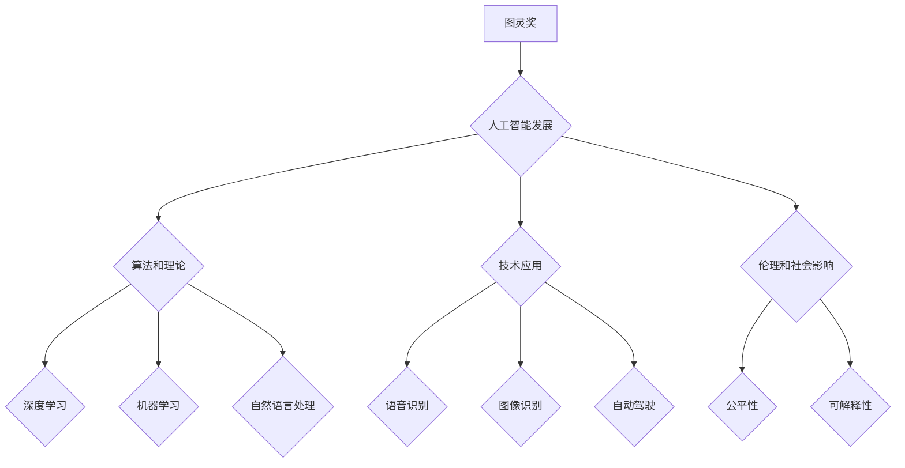

> 图灵奖，人工智能，深度学习，机器学习，自然语言处理，计算机视觉，算法，模型，应用

## 1. 背景介绍

人工智能（AI）作为科技发展的重要方向，近年来取得了令人瞩目的进展。从语音识别到图像识别，从自动驾驶到医疗诊断，AI技术正在深刻地改变着我们的生活。而图灵奖，作为计算机科学领域的最高荣誉，也见证了AI技术的不断发展和突破。

图灵奖得主们，作为计算机科学领域的领军人物，他们的研究成果和思想对AI的发展产生了深远的影响。他们不仅提出了许多重要的理论和算法，也为AI技术的应用提供了新的思路和方向。

## 2. 核心概念与联系

**2.1  图灵奖与人工智能**

图灵奖是美国计算机协会（ACM）设立的最高荣誉，旨在表彰在计算机科学领域做出杰出贡献的人员。自1966年设立以来，已有超过60位科学家和工程师获得了图灵奖。其中，许多获奖者都与人工智能领域密切相关。

**2.2  人工智能的发展历程**

人工智能的发展历程可以大致分为以下几个阶段：

* **早期阶段（1950s-1970s）：** 这一阶段是人工智能的萌芽期，许多奠基性工作在此期间完成，例如图灵测试、专家系统等。
* **知识表示与推理阶段（1980s-1990s）：** 这一阶段，研究者们开始关注如何将知识表示出来，并进行推理和决策。
* **机器学习阶段（2000s-至今）：** 这一阶段，机器学习成为人工智能研究的热点，许多基于数据驱动的算法取得了突破性进展。

**2.3  图灵奖得主对人工智能的影响**

图灵奖得主们在人工智能领域做出了许多重要贡献，例如：

* **提出新的算法和理论：** 例如，Geoffrey Hinton的深度学习算法，Yann LeCun的卷积神经网络算法，Yoshua Bengio的语言模型等。
* **推动人工智能技术的应用：** 例如，Demis Hassabis的DeepMind公司开发了AlphaGo，击败了世界围棋冠军；Fei-Fei Li的ImageNet数据集推动了计算机视觉的发展。
* **提出人工智能伦理和社会影响问题：** 例如，Yoshua Bengio呼吁关注人工智能的公平性和可解释性。

**2.4  Mermaid 流程图**



## 3. 核心算法原理 & 具体操作步骤

### 3.1  算法原理概述

深度学习算法是一种基于多层神经网络的机器学习算法。它能够从海量数据中学习复杂的特征，并进行预测或分类。深度学习算法的灵感来源于人脑的神经网络结构，它由多个神经元组成，这些神经元相互连接，并通过权重进行信息传递。

### 3.2  算法步骤详解

1. **数据预处理:** 将原始数据进行清洗、转换和特征提取，使其适合深度学习算法的训练。
2. **网络结构设计:** 根据任务需求设计深度神经网络的结构，包括神经元的数量、连接方式和激活函数等。
3. **参数初始化:** 为神经网络中的权重和偏置赋予初始值。
4. **前向传播:** 将输入数据通过神经网络进行传递，计算输出结果。
5. **反向传播:** 计算输出结果与真实值的误差，并根据误差反向传播，更新神经网络的权重和偏置。
6. **训练迭代:** 重复前向传播和反向传播的过程，直到模型的性能达到预期的水平。
7. **模型评估:** 使用测试数据评估模型的性能，并进行调优。

### 3.3  算法优缺点

**优点:**

* 能够学习复杂的特征，并取得较高的准确率。
* 对大规模数据的处理能力强。
* 能够应用于多种任务，例如图像识别、语音识别、自然语言处理等。

**缺点:**

* 训练时间长，需要大量的计算资源。
* 模型解释性差，难以理解模型的决策过程。
* 对数据质量要求高，容易受到噪声数据的影响。

### 3.4  算法应用领域

深度学习算法已广泛应用于以下领域：

* **计算机视觉:** 图像识别、物体检测、图像分割、人脸识别等。
* **语音识别:** 语音转文本、语音助手、语音搜索等。
* **自然语言处理:** 机器翻译、文本摘要、情感分析、对话系统等。
* **医疗诊断:** 疾病预测、图像分析、药物研发等。
* **自动驾驶:** 路线规划、物体检测、决策控制等。

## 4. 数学模型和公式 & 详细讲解 & 举例说明

### 4.1  数学模型构建

深度学习算法的核心是神经网络模型。神经网络模型可以看作是一个多层结构，每个层包含多个神经元。神经元之间通过连接进行信息传递，每个连接都有一个权重。

**4.1.1  感知机模型**

感知机是深度学习算法的基础模型，它是一个单层神经网络，用于二分类问题。感知机的数学模型如下：

$$
y = f(w^T x + b)
$$

其中：

* $y$ 是输出结果，为0或1。
* $x$ 是输入向量。
* $w$ 是权重向量。
* $b$ 是偏置项。
* $f$ 是激活函数，例如阶跃函数。

**4.1.2  多层感知机模型**

多层感知机（MLP）是深度学习算法的一种常见模型，它由多个隐藏层组成。每个隐藏层都包含多个神经元，神经元之间通过连接进行信息传递。MLP模型的数学模型可以表示为：

$$
h_l = f(W_l h_{l-1} + b_l)
$$

$$
y = f(W_o h_L + b_o)
$$

其中：

* $h_l$ 是第$l$层的隐藏层输出。
* $W_l$ 是第$l$层的权重矩阵。
* $b_l$ 是第$l$层的偏置向量。
* $h_L$ 是最后一层的隐藏层输出。
* $W_o$ 是输出层的权重矩阵。
* $b_o$ 是输出层的偏置向量。

### 4.2  公式推导过程

深度学习算法的训练过程是通过优化模型参数来最小化损失函数的过程。损失函数通常定义为预测结果与真实值的差值。

**4.2.1  梯度下降法**

梯度下降法是一种常用的优化算法，它通过计算损失函数的梯度来更新模型参数。梯度下降法的更新公式如下：

$$
\theta = \theta - \alpha \nabla L(\theta)
$$

其中：

* $\theta$ 是模型参数。
* $\alpha$ 是学习率。
* $\nabla L(\theta)$ 是损失函数的梯度。

**4.2.2  反向传播算法**

反向传播算法是一种用于计算梯度的算法，它通过链式法则将损失函数的梯度反向传播到每个神经元。

### 4.3  案例分析与讲解

**4.3.1  图像分类案例**

假设我们有一个图像分类任务，目标是将图像分类为不同的类别，例如猫、狗、鸟等。我们可以使用深度学习算法，例如卷积神经网络（CNN），来解决这个问题。

CNN模型能够学习图像的特征，并将其表示为向量。然后，我们可以使用多层感知机模型来对图像特征进行分类。

**4.3.2  文本生成案例**

假设我们有一个文本生成任务，目标是生成一段符合特定风格的文本。我们可以使用深度学习算法，例如循环神经网络（RNN），来解决这个问题。

RNN模型能够处理序列数据，例如文本。我们可以训练RNN模型，使其能够生成符合特定风格的文本。

## 5. 项目实践：代码实例和详细解释说明

### 5.1  开发环境搭建

为了进行深度学习项目实践，我们需要搭建一个开发环境。常用的开发环境包括：

* **Python:** 深度学习框架的主要编程语言。
* **深度学习框架:** 例如TensorFlow、PyTorch、Keras等。
* **GPU:** 加速深度学习训练的硬件。

### 5.2  源代码详细实现

以下是一个使用TensorFlow框架实现图像分类的简单代码示例：

```python
import tensorflow as tf

# 定义模型结构
model = tf.keras.models.Sequential([
    tf.keras.layers.Conv2D(32, (3, 3), activation='relu', input_shape=(28, 28, 1)),
    tf.keras.layers.MaxPooling2D((2, 2)),
    tf.keras.layers.Conv2D(64, (3, 3), activation='relu'),
    tf.keras.layers.MaxPooling2D((2, 2)),
    tf.keras.layers.Flatten(),
    tf.keras.layers.Dense(10, activation='softmax')
])

# 编译模型
model.compile(optimizer='adam',
              loss='sparse_categorical_crossentropy',
              metrics=['accuracy'])

# 训练模型
model.fit(x_train, y_train, epochs=5)

# 评估模型
loss, accuracy = model.evaluate(x_test, y_test)
print('Test loss:', loss)
print('Test accuracy:', accuracy)
```

### 5.3  代码解读与分析

这段代码定义了一个简单的卷积神经网络模型，用于图像分类任务。

* **模型结构:** 模型由两个卷积层、两个最大池化层、一个全连接层和一个输出层组成。
* **激活函数:** 使用ReLU激活函数，可以提高模型的表达能力。
* **损失函数:** 使用稀疏类别交叉熵损失函数，适合多分类问题。
* **优化器:** 使用Adam优化器，可以加速模型训练。

### 5.4  运行结果展示

训练完成后，我们可以使用测试数据评估模型的性能。

## 6. 实际应用场景

### 6.1  医疗诊断

深度学习算法可以用于辅助医生进行疾病诊断，例如：

* **图像分析:** 分析X光片、CT扫描和MRI图像，识别肿瘤、骨折和其他异常。
* **病理学诊断:** 分析病理切片，识别癌细胞和其他病变。
* **基因组分析:** 分析基因组数据，预测疾病风险和治疗效果。

### 6.2  金融风险管理

深度学习算法可以用于识别金融风险，例如：

* **欺诈检测:** 检测信用卡欺诈、网络钓鱼和其他金融欺诈行为。
* **信用评分:** 评估借款人的信用风险，决定是否授予贷款。
* **市场预测:** 分析市场数据，预测股票价格、汇率和利率等。

### 6.3  自动驾驶

深度学习算法是自动驾驶的关键技术，例如：

* **物体检测:** 检测道路上的车辆、行人、交通信号灯等物体。
* **路径规划:** 规划自动驾驶车辆行驶的路径。
* **决策控制:** 控制自动驾驶车辆的加速、减速和转向。

### 6.4  未来应用展望

深度学习算法的应用前景广阔，未来将应用于更多领域，例如：

* **个性化教育:** 根据学生的学习情况，提供个性化的学习内容和教学方法。
* **智能家居:** 通过语音识别、图像识别等技术，实现智能家居的控制和管理。
* **医疗机器人:** 开发能够辅助医生进行手术、护理等任务的医疗机器人。

## 7. 工具和资源推荐

### 7.