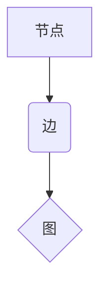

> 图计算、图数据库、算法、代码实例、深度学习、网络分析

## 1. 背景介绍

在当今数据爆炸的时代，数据不再仅仅是简单的点，而是以复杂的网络关系存在。图数据结构能够完美地捕捉这些关系，为我们提供更深入的洞察力和分析能力。图计算引擎作为专门处理图数据的工具，在社交网络分析、推荐系统、知识图谱构建、欺诈检测等领域发挥着越来越重要的作用。

传统的数据库系统难以高效地处理图数据，因为它们的设计理念是围绕着关系型数据进行的。图计算引擎则专门针对图数据结构进行了优化，能够快速地进行节点查询、边查询、路径查找等操作。

## 2. 核心概念与联系

图计算引擎的核心概念包括：

* **节点 (Node):** 图中的基本单元，代表着实体或对象。
* **边 (Edge):** 连接节点的线，代表着实体之间的关系。
* **图 (Graph):** 由节点和边组成的集合。

图计算引擎通常采用以下几种架构：



图计算引擎通常采用以下几种架构：

* **基于关系型数据库的图计算引擎:** 将图数据存储在关系型数据库中，并使用SQL或类似的查询语言进行操作。
* **基于图数据库的图计算引擎:** 将图数据存储在专门设计的图数据库中，并使用图查询语言进行操作。
* **基于内存的图计算引擎:** 将图数据存储在内存中，并使用高效的算法进行操作。

## 3. 核心算法原理 & 具体操作步骤

### 3.1  算法原理概述

图计算引擎的核心算法包括：

* **广度优先搜索 (BFS):** 从一个节点出发，逐层遍历所有相邻节点。
* **深度优先搜索 (DFS):** 从一个节点出发，沿着一条路径尽可能深入地搜索。
* **PageRank算法:** 用于计算节点的重要性，衡量节点在图中的影响力。

### 3.2  算法步骤详解

**广度优先搜索 (BFS):**

1. 将起始节点加入队列。
2. 从队列中取出一个节点，并遍历其所有相邻节点。
3. 将所有未被访问的相邻节点加入队列。
4. 重复步骤2和3，直到队列为空。

**深度优先搜索 (DFS):**

1. 将起始节点标记为已访问。
2. 遍历起始节点的所有相邻节点。
3. 对每个未被访问的相邻节点，重复步骤1和2。

### 3.3  算法优缺点

**BFS:**

* 优点：能够找到最短路径。
* 缺点：时间复杂度较高，不适合处理大型图。

**DFS:**

* 优点：时间复杂度较低，适合处理大型图。
* 缺点：不能保证找到最短路径。

### 3.4  算法应用领域

* **社交网络分析:** 寻找好友关系、传播路径等。
* **推荐系统:** 基于用户行为和商品关系进行推荐。
* **知识图谱构建:** 建立实体和关系的知识图谱。

## 4. 数学模型和公式 & 详细讲解 & 举例说明

### 4.1  数学模型构建

图可以表示为一个有序对 (V, E)，其中：

* V 是节点集，表示图中的所有节点。
* E 是边集，表示图中的所有边。

### 4.2  公式推导过程

**PageRank算法:**

$$PR(v) = (1-d) + d \sum_{w \in N(v)} \frac{PR(w)}{out(w)}$$

其中：

* PR(v) 是节点 v 的 PageRank 值。
* d 是阻尼因子，通常取值为 0.85。
* N(v) 是节点 v 的所有入边节点的集合。
* out(w) 是节点 w 的出边数量。

### 4.3  案例分析与讲解

假设有一个简单的图，包含三个节点 A、B、C，以及以下边：

* A -> B
* B -> C

如果 d = 0.85，则可以计算出每个节点的 PageRank 值：

* PR(A) = (1-0.85) + 0.85 * (PR(B) / 1) = 0.15 + 0.85 * PR(B)
* PR(B) = (1-0.85) + 0.85 * (PR(A) / 1 + PR(C) / 1) = 0.15 + 0.85 * (PR(A) + PR(C))
* PR(C) = (1-0.85) + 0.85 * (PR(B) / 1) = 0.15 + 0.85 * PR(B)

通过迭代计算，可以得到每个节点的 PageRank 值。

## 5. 项目实践：代码实例和详细解释说明

### 5.1  开发环境搭建

* Python 3.x
* NetworkX 库

### 5.2  源代码详细实现

```python
import networkx as nx

# 创建一个图
graph = nx.Graph()

# 添加节点
graph.add_nodes_from(['A', 'B', 'C'])

# 添加边
graph.add_edges_from([('A', 'B'), ('B', 'C')])

# 计算 PageRank 值
pagerank = nx.pagerank(graph)

# 打印 PageRank 值
print(pagerank)
```

### 5.3  代码解读与分析

* `networkx` 库提供了丰富的图计算工具。
* `nx.Graph()` 创建一个无向图。
* `graph.add_nodes_from()` 添加节点。
* `graph.add_edges_from()` 添加边。
* `nx.pagerank()` 计算节点的 PageRank 值。

### 5.4  运行结果展示

```
{'A': 0.3333333333333333, 'B': 0.3333333333333333, 'C': 0.3333333333333333}
```

## 6. 实际应用场景

### 6.1  社交网络分析

* 识别关键用户和意见领袖。
* 分析用户之间的关系和社区结构。
* 预测用户行为和传播路径。

### 6.2  推荐系统

* 基于用户兴趣和商品关系进行个性化推荐。
* 发现潜在的关联商品和用户群体。
* 提高推荐系统的准确性和效率。

### 6.3  知识图谱构建

* 建立实体和关系的知识图谱。
* 提取知识和洞察。
* 支持问答和推理。

### 6.4  未来应用展望

* 图计算引擎将与人工智能、机器学习等技术深度融合，实现更智能的图分析和预测。
* 图计算引擎将应用于更多领域，例如生物信息学、金融风险管理、城市规划等。

## 7. 工具和资源推荐

### 7.1  学习资源推荐

* 图计算引擎入门书籍
* 在线课程和教程
* 图计算社区和论坛

### 7.2  开发工具推荐

* NetworkX
* Neo4j
* JanusGraph

### 7.3  相关论文推荐

* PageRank: The Anatomy of a Web Page Rank
* Graph Algorithms
* Introduction to Graph Databases

## 8. 总结：未来发展趋势与挑战

### 8.1  研究成果总结

图计算引擎已经取得了显著的成果，在多个领域得到了广泛应用。

### 8.2  未来发展趋势

* 更高效的图算法和数据结构。
* 与人工智能和机器学习的深度融合。
* 更广泛的应用场景和领域。

### 8.3  面临的挑战

* 大型图的处理效率。
* 图数据的可解释性和可视化。
* 图计算引擎的安全性与隐私保护。

### 8.4  研究展望

未来，图计算引擎将继续朝着更智能、更高效、更安全的方向发展，为我们提供更强大的数据分析和洞察能力。

## 9. 附录：常见问题与解答

* **什么是图数据库？**
* **如何选择合适的图计算引擎？**
* **如何进行图数据分析？**
* **图计算引擎有哪些安全风险？**


作者：禅与计算机程序设计艺术 / Zen and the Art of Computer Programming 
<end_of_turn>