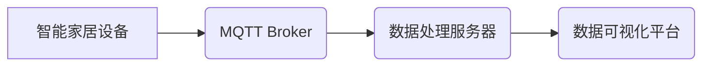

> MQTT, RESTful API, 智能家居, 用户行为分析, 数据采集, 数据处理, 数据可视化

## 1. 背景介绍

随着物联网技术的快速发展，智能家居已成为现代生活的重要组成部分。智能家居系统通过传感器、 actuators 和网络连接，能够自动控制和管理家居环境，为用户提供更加舒适、便捷的生活体验。然而，智能家居系统的核心价值在于对用户行为的理解和分析。通过分析用户的行为模式，我们可以更好地了解用户的需求，从而提供更个性化、更智能化的服务。

传统的智能家居系统往往缺乏对用户行为的深入分析能力。数据采集分散，数据处理方式单一，缺乏有效的可视化工具。这使得智能家居系统难以挖掘用户行为背后的价值，难以实现真正意义上的智能化。

为了解决这些问题，本文提出了一种基于MQTT协议和RESTful API的智能家居用户行为分析系统。该系统采用MQTT协议进行数据采集，利用RESTful API实现数据处理和可视化，能够高效地收集、处理和分析用户的行为数据，为智能家居系统提供更强大的分析能力。

## 2. 核心概念与联系

### 2.1 MQTT协议

MQTT（Message Queuing Telemetry Transport）是一种轻量级的消息传输协议，专门设计用于物联网应用场景。它具有以下特点：

* 轻量级：MQTT协议本身非常小巧，占用资源少，适合资源受限的设备使用。
* 可靠性：MQTT协议提供消息确认机制，确保消息的可靠传输。
* 灵活：MQTT协议支持多种发布/订阅模式，可以灵活地构建消息传递关系。

### 2.2 RESTful API

RESTful API（Representational State Transfer Application Programming Interface）是一种基于HTTP协议的软件架构风格，用于构建Web服务。它具有以下特点：

* 简单易用：RESTful API使用标准的HTTP方法（GET、POST、PUT、DELETE）进行操作，易于理解和使用。
* 可扩展性：RESTful API可以轻松地扩展和维护，可以添加新的资源和操作。
* 无状态性：每个请求都是独立的，服务器不需要记住之前的请求状态。

### 2.3 系统架构

本系统采用MQTT协议进行数据采集，RESTful API实现数据处理和可视化。系统架构如下：



**系统架构说明：**

* 智能家居设备通过MQTT协议发布数据到MQTT Broker。
* 数据处理服务器订阅MQTT Broker上的主题，接收设备发布的数据。
* 数据处理服务器对接收到的数据进行处理，例如过滤、聚合、分析等。
* 数据可视化平台通过RESTful API获取数据处理服务器处理后的数据，并进行可视化展示。

## 3. 核心算法原理 & 具体操作步骤

### 3.1  算法原理概述

本系统采用基于机器学习的算法进行用户行为分析。具体来说，我们将使用聚类算法将用户的行为数据进行分组，从而识别出不同的用户行为模式。

### 3.2  算法步骤详解

1. **数据采集:** 智能家居设备通过MQTT协议发布数据到MQTT Broker。
2. **数据预处理:** 数据处理服务器接收设备发布的数据，进行清洗、转换、归一化等预处理操作。
3. **特征提取:** 从预处理后的数据中提取用户行为特征，例如设备使用频率、使用时间、使用场景等。
4. **聚类分析:** 使用聚类算法将用户行为特征进行分组，识别出不同的用户行为模式。
5. **模式识别:** 对聚类结果进行分析，识别出每个用户行为模式的特征和代表性行为。
6. **可视化展示:** 数据可视化平台通过RESTful API获取聚类结果，并进行可视化展示，例如用户行为趋势图、用户行为分布图等。

### 3.3  算法优缺点

**优点:**

* 能够识别出用户的隐性行为模式。
* 可以根据用户的行为模式提供个性化的服务。
* 算法模型可以不断学习和更新，提高分析精度。

**缺点:**

* 需要大量的用户行为数据进行训练。
* 算法模型的复杂度较高，需要一定的专业知识进行维护。

### 3.4  算法应用领域

本系统中的用户行为分析算法可以应用于以下领域：

* 智能家居场景：根据用户的行为模式，提供个性化的家居控制方案，例如自动调节灯光、温度、窗帘等。
* 电商场景：根据用户的浏览和购买行为，推荐个性化的商品和服务。
* 教育场景：根据学生的学习行为，提供个性化的学习方案和辅导。

## 4. 数学模型和公式 & 详细讲解 & 举例说明

### 4.1  数学模型构建

本系统采用K-Means聚类算法进行用户行为分析。K-Means算法是一种常用的无监督学习算法，用于将数据点划分为K个簇。

**数学模型:**

* **目标函数:** 
$$
J(C) = \sum_{i=1}^{K} \sum_{x \in C_i} ||x - \mu_i||^2
$$

其中：

* $J(C)$ 是目标函数，表示所有数据点到其所属簇中心的距离平方和。
* $K$ 是簇的数量。
* $C_i$ 是第i个簇。
* $x$ 是一个数据点。
* $\mu_i$ 是第i个簇的中心点。

* **算法步骤:**

1. 随机选择K个数据点作为初始簇中心。
2. 将每个数据点分配到距离其最近的簇中心。
3. 计算每个簇的新的中心点。
4. 重复步骤2和步骤3，直到目标函数收敛。

### 4.2  公式推导过程

目标函数的最小化可以通过迭代更新簇中心点来实现。

**簇中心点的更新公式:**

$$
\mu_i = \frac{\sum_{x \in C_i} x}{|C_i|}
$$

其中：

* $\mu_i$ 是第i个簇的中心点。
* $C_i$ 是第i个簇。
* $x$ 是一个数据点。
* $|C_i|$ 是第i个簇中数据点的数量。

### 4.3  案例分析与讲解

假设我们有以下用户行为数据：

| 用户ID | 设备 | 使用时间 |
|---|---|---|
| 1 | 灯光 | 18:00-19:00 |
| 2 | 电视 | 20:00-22:00 |
| 3 | 空调 | 14:00-16:00 |
| 4 | 灯光 | 18:00-19:00 |
| 5 | 电视 | 20:00-22:00 |

我们使用K-Means算法将这些数据进行聚类，假设我们设定K=2。

经过算法迭代，最终得到以下聚类结果：

* 簇1: 用户ID 1, 4，设备: 灯光，使用时间: 18:00-19:00
* 簇2: 用户ID 2, 5，设备: 电视，使用时间: 20:00-22:00

我们可以看到，K-Means算法将用户根据他们的设备使用时间进行分组，识别出两个不同的用户行为模式。

## 5. 项目实践：代码实例和详细解释说明

### 5.1  开发环境搭建

本系统使用Python语言开发，需要安装以下软件：

* Python 3.x
* MQTT Broker (例如Mosquitto)
* RESTful API框架 (例如Flask)
* 数据可视化库 (例如Matplotlib)

### 5.2  源代码详细实现

```python
# 数据处理服务器代码示例

from flask import Flask, request, jsonify
import paho.mqtt.client as mqtt

app = Flask(__name__)

# MQTT Broker连接信息
mqtt_broker = "mqtt.example.com"
mqtt_port = 1883

# 创建MQTT客户端
client = mqtt.Client()
client.connect(mqtt_broker, mqtt_port)

# 订阅主题
client.subscribe("smart_home/data")

# 数据处理函数
def process_data(data):
    # 对数据进行处理，例如过滤、聚合、分析等
    # ...
    return processed_data

# RESTful API接口
@app.route('/data', methods=['GET'])
def get_data():
    # 获取MQTT Broker上的数据
    client.loop_start()
    while True:
        # 接收MQTT Broker上的消息
        message = client.loop_forever(timeout=1)
        if message:
            data = message.payload.decode()
            processed_data = process_data(data)
            return jsonify(processed_data)

if __name__ == '__main__':
    app.run(debug=True)
```

### 5.3  代码解读与分析

* **MQTT Broker连接:** 代码首先连接到MQTT Broker，并订阅主题"smart_home/data"。
* **数据处理函数:** `process_data()`函数负责对接收到的数据进行处理，例如过滤、聚合、分析等。
* **RESTful API接口:** `/data`接口提供数据获取服务，通过循环接收MQTT Broker上的消息，并调用`process_data()`函数处理数据，最终返回处理后的数据。

### 5.4  运行结果展示

运行上述代码后，数据处理服务器将启动，并监听`/data`接口。数据可视化平台可以通过RESTful API获取处理后的数据，并进行可视化展示。

## 6. 实际应用场景

### 6.1 智能家居场景

本系统可以用于智能家居场景，例如：

* **个性化灯光控制:** 根据用户的行为模式，自动调节灯光亮度和颜色，营造舒适的氛围。
* **智能温度控制:** 根据用户的行为模式，自动调节空调温度，节省能源。
* **场景联动:** 根据用户的行为模式，自动触发场景联动，例如打开电视、调节灯光、关闭窗帘等。

### 6.2 电商场景

本系统可以用于电商场景，例如：

* **个性化商品推荐:** 根据用户的浏览和购买行为，推荐个性化的商品和服务。
* **用户画像分析:** 分析用户的行为模式，构建用户画像，以便更好地进行营销推广。
* **用户行为分析:** 分析用户的行为数据，了解用户的购物习惯和偏好，以便优化电商平台的运营策略。

### 6.3 教育场景

本系统可以用于教育场景，例如：

* **个性化学习方案:** 根据学生的学习行为，提供个性化的学习方案和辅导。
* **学习效果评估:** 分析学生的学习行为，评估学生的学习效果。
* **教学策略优化:** 分析学生的学习行为，优化教学策略。

### 6.4 未来应用展望

随着物联网技术的不断发展，本系统将有更广泛的应用场景。例如：

* **医疗健康:** 分析用户的健康行为，提供个性化的健康建议。
* **交通出行:** 分析用户的出行行为，优化交通出行路线。
* **城市管理:** 分析用户的城市行为，优化城市管理策略。

## 7. 工具和资源推荐

### 7.1 学习资源推荐

* **MQTT协议:** https://mqtt.org/
* **RESTful API:** https://restfulapi.net/
* **K-Means聚类算法:** https://en.wikipedia.org/wiki/K-means_clustering

### 7.2 开发工具推荐

* **Python:** https://www.python.org/
* **MQTT Broker (Mosquitto):** https://mosquitto.org/
* **RESTful API框架 (Flask):** https://flask.palletsprojects.com/en/2.2.x/

### 7.3 相关论文推荐

* **A Survey on MQTT Protocol for Internet of Things Applications:** https://ieeexplore.ieee.org/document/8909708
* **REST