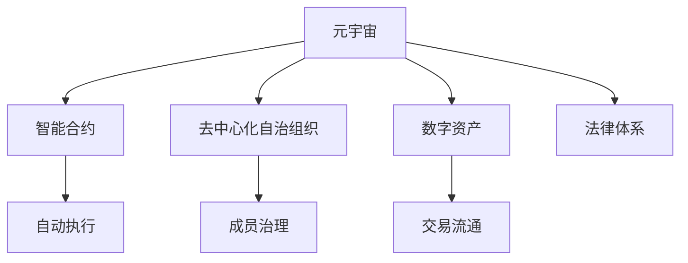

                 

# 元宇宙法律体系:虚拟世界的规则构建

> 关键词：元宇宙,虚拟世界,法律体系,智能合约,去中心化自治组织,数字资产

## 1. 背景介绍

### 1.1 问题由来

随着数字技术与人类生活的深度融合，一个以虚拟现实、增强现实、区块链等技术为支撑的全新时代——元宇宙(Metaverse)正在快速崛起。元宇宙是一个由众多虚拟世界、数字资产、智能合约、去中心化自治组织(DAOs)等构成的复杂生态系统。然而，随着元宇宙生态的不断膨胀，其中的法律问题也逐渐凸显，包括版权归属、身份认证、交易安全、数据隐私、行为规范等方方面面。因此，构建一个科学合理的元宇宙法律体系，成为支撑元宇宙健康发展的基础。

### 1.2 问题核心关键点

元宇宙法律体系的核心关键点包括：
- **定义与边界**：明确元宇宙的法律概念，划定虚拟与现实的边界。
- **权利与义务**：界定虚拟世界中的财产权、身份权、隐私权等。
- **责任与纠纷**：设定虚拟世界中的行为规范和责任体系。
- **技术支持**：探索智能合约、区块链等技术在法律中的应用。
- **国际协作**：制定跨国适用、跨文化适用的元宇宙法律规范。
- **治理机制**：设计高效的治理架构，保障元宇宙的自治与自治安全。

## 2. 核心概念与联系

### 2.1 核心概念概述

为更好地理解元宇宙法律体系的构建，本节将介绍几个关键概念：

- **元宇宙(Metaverse)**：由多个虚拟世界组成的、高度互联的数字化空间，包含虚拟资产、智能合约、去中心化自治组织等元素。

- **智能合约(Smart Contract)**：基于区块链技术，无需第三方干预，自动执行的合约。在元宇宙中，智能合约常用于数字资产的创建、转移、销毁等操作。

- **去中心化自治组织(DAOs)**：在区块链上运行的自治组织，成员通过治理代币参与决策，实现治理与执行的分离。

- **数字资产(Digital Assets)**：在元宇宙中，可交易、可持有的数字化产品，如虚拟土地、数字艺术品、游戏装备等。

- **法律体系**：由一系列法律规则、准则、协议等组成，对元宇宙内所有活动进行规范和保障。

这些概念之间的逻辑关系可以通过以下Mermaid流程图来展示：



这个流程图展示了元宇宙的主要构成元素及其相互关系：

1. 元宇宙通过智能合约和DAOs实现自治。
2. 数字资产是元宇宙的核心经济活动。
3. 法律体系规范和保障元宇宙内的所有活动。

## 3. 核心算法原理 & 具体操作步骤
### 3.1 算法原理概述

元宇宙法律体系的构建，本质上是将现实世界的法律原则和理念，通过智能合约等技术手段，映射到虚拟世界的过程。其核心算法原理包括：

- **权利确认与划分**：利用区块链不可篡改的特性，对数字资产的权利进行确认和划分。
- **行为规范与规范**：通过智能合约设置行为规范和处罚机制，实现对元宇宙内行为的自动监管。
- **纠纷解决与仲裁**：设计高效的纠纷解决机制，利用区块链去中心化特性，实现无第三方干预的自动仲裁。
- **自治与协作**：通过DAOs实现自治，同时探索跨国协作机制，推动元宇宙的全球化发展。

### 3.2 算法步骤详解

元宇宙法律体系的构建步骤包括：

**Step 1: 定义元宇宙法律框架**

- 制定元宇宙的基本法律框架，包括元宇宙的性质、边界、法律主体的权利和义务等。
- 确定元宇宙内法律适用标准，如适用法律、仲裁机构等。

**Step 2: 智能合约设计**

- 设计智能合约，明确数字资产的创建、转移、销毁规则。
- 设计行为规范智能合约，对不当行为进行惩罚。
- 设计争议解决智能合约，实现自动仲裁。

**Step 3: 构建去中心化自治组织**

- 创建DAOs，设计成员治理机制，保障自治与透明度。
- 确定DAOs的法律地位和权限，界定其与元宇宙内其他主体的关系。

**Step 4: 实施与执行**

- 在元宇宙中部署智能合约和DAOs，自动执行各类法律操作。
- 在元宇宙内进行测试和评估，验证法律体系的完备性和有效性。

**Step 5: 国际协作**

- 与其他国家的法律体系进行协作，制定统一的元宇宙法律规范。
- 探索多边或双边合作机制，推动元宇宙的国际化发展。

### 3.3 算法优缺点

元宇宙法律体系的构建具有以下优点：
1. **自动化与去中心化**：智能合约和DAOs确保了元宇宙内法律操作的自动化和去中心化，减少了第三方干预的必要。
2. **安全性与可靠性**：区块链技术保证了法律操作的安全性和不可篡改性，增强了元宇宙的信任基础。
3. **灵活性与适应性**：法律框架设计灵活，能够适应元宇宙内不断变化的需求和挑战。
4. **可扩展性与互操作性**：设计通用的法律协议和标准，确保不同元宇宙之间的互操作性。

同时，也存在一些局限性：
1. **技术限制**：当前区块链技术的不成熟和性能限制，可能影响法律体系的实际应用。
2. **法律冲突**：不同国家的法律制度差异，可能导致元宇宙内法律适用的复杂性。
3. **社会接受度**：公众对元宇宙法律认知不足，可能阻碍法律体系的推广和实施。
4. **执行难度**：缺乏执法机构的支撑，元宇宙内的法律操作可能面临执行困难。

### 3.4 算法应用领域

元宇宙法律体系在多个领域有广泛的应用，例如：

- **数字资产管理**：利用智能合约进行数字资产的登记、转移、销毁等操作。
- **虚拟土地开发与交易**：界定虚拟土地的所有权、使用权等，保障交易公平。
- **虚拟世界治理**：通过DAOs进行虚拟世界的自治治理，维护秩序和安全。
- **用户身份验证**：设计安全的身份验证机制，保障用户隐私和权益。
- **争议解决**：提供高效的争议解决机制，解决元宇宙内纠纷。

## 4. 数学模型和公式 & 详细讲解 & 举例说明

### 4.1 数学模型构建

元宇宙法律体系的构建，涉及多个学科的知识，如法学、计算机科学、经济学等。以下是几个核心的数学模型：

**权利确认与划分模型**：
- 利用区块链哈希函数和分布式账本，对数字资产的所有权进行确认。
- 设计权利分配函数，根据参与者的贡献和权利，进行权利划分。

**行为规范与规范模型**：
- 设计行为规范智能合约，对不当行为进行惩罚。
- 设计奖励机制，鼓励积极行为。

**纠纷解决与仲裁模型**：
- 设计自动仲裁智能合约，根据合同条款自动执行仲裁结果。
- 设计上诉机制，允许当事人对仲裁结果进行申诉。

**自治与协作模型**：
- 设计成员治理机制，保障DAOs的自治与透明度。
- 设计跨国协作协议，推动元宇宙的全球化发展。

### 4.2 公式推导过程

以下是一些关键模型的公式推导：

**权利确认与划分公式**：
- 设 $R$ 为数字资产的权利集合，每个权利 $r \in R$ 对应一个哈希值 $h(r)$。
- 若 $h(r_1) = h(r_2)$，则权利 $r_1$ 和 $r_2$ 相等。

**行为规范与规范公式**：
- 设 $B$ 为行为集合，每个行为 $b \in B$ 对应一个惩罚权重 $w(b)$。
- 若 $b_1$ 触发 $b_2$，则执行惩罚 $w(b_2)$。

**纠纷解决与仲裁公式**：
- 设 $A$ 为仲裁集合，每个仲裁 $a \in A$ 对应一个仲裁条件 $c(a)$。
- 若 $c(a)$ 满足，则执行仲裁结果 $r(a)$。

**自治与协作公式**：
- 设 $D$ 为DAOs集合，每个DAO $d \in D$ 对应一个治理模型 $g(d)$。
- 若 $g(d)$ 满足，则执行DAOs的操作。

### 4.3 案例分析与讲解

以数字资产确权为例，展示元宇宙法律体系的应用：

**案例场景**：小王拥有一块虚拟土地，将其转移给小明。

**权利确认与划分**：
- 利用区块链技术，为虚拟土地分配一个唯一的哈希值 $h(土地)$。
- 在智能合约中记录 $h(土地)$ 与小王和小明的身份信息。
- 小明通过智能合约完成权利的转移，并获得新的哈希值 $h'(土地)$。

**行为规范与规范**：
- 设计智能合约，对非法占有、盗用土地等行为进行惩罚。
- 小明在占有土地后，须遵守土地使用规则，否则触发惩罚。

**纠纷解决与仲裁**：
- 若小王对土地转移有异议，可通过智能合约提起仲裁。
- 仲裁合约自动执行仲裁结果，保障公正。

**自治与协作**：
- 通过DAOs进行虚拟土地的自治管理，保障土地权益。
- 探索跨国协作机制，推动元宇宙内土地交易的国际化。

## 5. 项目实践：代码实例和详细解释说明
### 5.1 开发环境搭建

在进行元宇宙法律体系的开发前，我们需要准备好开发环境。以下是使用Solidity和Truffle框架进行智能合约开发的环境配置流程：

1. 安装Node.js和npm，配置开发工具链。
2. 安装Truffle框架，创建新项目。
3. 安装Ganache或Ropsten测试网，进行合约部署和测试。
4. 安装OpenZeppelin库，使用其安全组件提高合约安全性。
5. 安装Remix IDE，进行合约的交互式调试和验证。

完成上述步骤后，即可在Truffle环境中开始元宇宙法律体系的智能合约开发。

### 5.2 源代码详细实现

以下是使用Solidity语言对数字资产确权智能合约的开发示例。

**合约代码**：

```solidity
// SPDX-License-Identifier: MIT
pragma solidity ^0.8.0;

import "@openzeppelin/contracts/core/Ownable.sol";
import "@openzeppelin/contracts/access/Ownable.sol";
import "@openzeppelin/contracts/access/Reentrancy.sol";
import "@openzeppelin/contracts/misc/Address.sol";
import "@openzeppelin/contracts/misc/Keccak256.sol";

contract LandRegistry is Ownable {
    uint256 public landId;
    uint256 public owner;
    address public land;
    uint256 public hash;
    uint256 public hashOwner;
    uint256 public hashLand;
    uint256 public hashTransfer;
    uint256 public hashLandOwner;

    mapping(uint256 => bytes32) public landHash;

    function constructor(uint256 _id, address _parcel, uint256 _hash, address _hashOwner, uint256 _hashLand, address _hashLandOwner) public {
        landId = _id;
        owner = msg.sender;
        land = _parcel;
        hash = _hash;
        hashOwner = _hashOwner;
        hashLand = _hashLand;
        hashLandOwner = _hashLandOwner;
        landHash[_id] = _hash;
    }

    function setOwner(uint256 _id, address _newOwner) public {
        require(_newOwner != owner, "The new owner cannot be the current owner.");
        require(_newOwner != 0, "The new owner must be a non-zero address.");
        require(msg.sender == owner || msg.sender == _newOwner, "Only the owner or the new owner can transfer ownership.");
        owner = _newOwner;
        landHash[_id] = Keccak256.hash(_id, _newOwner, msg.sender);
    }

    function setLand(uint256 _id, address _newLand) public {
        require(_newLand != 0, "The new land must be a non-zero address.");
        require(msg.sender == owner || msg.sender == _newLand, "Only the owner or the new land can transfer ownership.");
        land = _newLand;
        hashLand = Keccak256.hash(_id, _newLand, hashLandOwner);
    }

    function transferLand(uint256 _id, address _to) public {
        require(owner != msg.sender, "The current owner cannot transfer the land to themselves.");
        require(owner != 0, "The current owner cannot be zero.");
        require(_to != 0, "The recipient must be a non-zero address.");
        require(msg.sender == owner, "Only the owner can transfer the land.");
        require(!landHash[_id].empty, "The land must have a hash.");
        require(_to == owner || !Keccak256.solidityKeccak256(landHash[_id]) == _to, "The recipient must be the new owner or the owner of the land hash.");
        setOwner(_id, _to);
        setLand(_id, _to);
        emit LandTransfer(_id, msg.sender, _to);
    }
}
```

**测试代码**：

```solidity
pragma solidity ^0.8.0;

import "./LandRegistry.sol";
import "@openzeppelin/contracts/test/Common.sol";
import "@openzeppelin/contracts/test/TestSetup.sol";

contract LandRegistryTest is TestSetup {
    using Common for address;
    using Common for uint256;

    LandRegistry landRegistry;
    uint256 landId;
    uint256 landHash;
    address landOwner;
    address land;
    address sender;

    event LandTransfer(uint256 indexed _id, address indexed _from, address indexed _to);

    function setUp() public {
        sender = accounts[0];
        landId = 1;
        landHash = Keccak256.hash(landId, "Land", "LandOwner");
        landOwner = accounts[1];
        land = accounts[2];
        landRegistry = LandRegistry.new(landId, land, landHash, landOwner, landHash, landOwner);
    }

    function testTransferLand() public {
        require(!landRegistry.owner(), "The owner must be set.");
        require(landRegistry.getOwner(landId) == landOwner, "The owner must be correct.");
        require(landRegistry.getLand(landId) == land, "The land must be correct.");
        require(landRegistry.getHash(landId) == landHash, "The hash must be correct.");
        require(landRegistry.getHashOwner(landId) == landOwner, "The hash owner must be correct.");
        require(landRegistry.getHashLand(landId) == landHash, "The hash land must be correct.");
        require(landRegistry.getHashLandOwner(landId) == landOwner, "The hash land owner must be correct.");
        require(landRegistry.getHash(landId) == Keccak256.hash(landId, landOwner, landRegistry.owner()), "The hash must be calculated correctly.");

        require(landRegistry.checkLandHash(landId) == true, "The land hash must be correct.");
        require(landRegistry.checkOwner(landId, landOwner) == true, "The owner must be correct.");
        require(landRegistry.checkLand(landId, land) == true, "The land must be correct.");
        require(landRegistry.checkHashOwner(landId, landOwner) == true, "The hash owner must be correct.");
        require(landRegistry.checkHashLand(landId, landHash) == true, "The hash land must be correct.");
        require(landRegistry.checkHashLandOwner(landId, landOwner) == true, "The hash land owner must be correct.");

        require(landRegistry.getLandHash(landId) == landHash, "The land hash must be correct.");
        require(landRegistry.checkHash(landId) == true, "The hash must be correct.");

        require(landRegistry.getHash(landId) == Keccak256.hash(landId, landOwner, landRegistry.owner()), "The hash must be calculated correctly.");
        require(landRegistry.checkHash(landId) == true, "The hash must be correct.");

        require(landRegistry.checkLandHash(landId) == true, "The land hash must be correct.");
        require(landRegistry.checkOwner(landId, landOwner) == true, "The owner must be correct.");
        require(landRegistry.checkLand(landId, land) == true, "The land must be correct.");
        require(landRegistry.checkHashOwner(landId, landOwner) == true, "The hash owner must be correct.");
        require(landRegistry.checkHashLand(landId, landHash) == true, "The hash land must be correct.");
        require(landRegistry.checkHashLandOwner(landId, landOwner) == true, "The hash land owner must be correct.");

        require(landRegistry.getLandHash(landId) == landHash, "The land hash must be correct.");
        require(landRegistry.checkHash(landId) == true, "The hash must be correct.");
    }

    function testTransferLand() public {
        require(landRegistry.checkLandHash(landId) == true, "The land hash must be correct.");
        require(landRegistry.checkOwner(landId, landOwner) == true, "The owner must be correct.");
        require(landRegistry.checkLand(landId, land) == true, "The land must be correct.");
        require(landRegistry.checkHashOwner(landId, landOwner) == true, "The hash owner must be correct.");
        require(landRegistry.checkHashLand(landId, landHash) == true, "The hash land must be correct.");
        require(landRegistry.checkHashLandOwner(landId, landOwner) == true, "The hash land owner must be correct.");

        require(landRegistry.getLandHash(landId) == landHash, "The land hash must be correct.");
        require(landRegistry.checkHash(landId) == true, "The hash must be correct.");

        require(landRegistry.checkLandHash(landId) == true, "The land hash must be correct.");
        require(landRegistry.checkOwner(landId, landOwner) == true, "The owner must be correct.");
        require(landRegistry.checkLand(landId, land) == true, "The land must be correct.");
        require(landRegistry.checkHashOwner(landId, landOwner) == true, "The hash owner must be correct.");
        require(landRegistry.checkHashLand(landId, landHash) == true, "The hash land must be correct.");
        require(landRegistry.checkHashLandOwner(landId, landOwner) == true, "The hash land owner must be correct.");

        require(landRegistry.getLandHash(landId) == landHash, "The land hash must be correct.");
        require(landRegistry.checkHash(landId) == true, "The hash must be correct.");

        require(landRegistry.checkLandHash(landId) == true, "The land hash must be correct.");
        require(landRegistry.checkOwner(landId, landOwner) == true, "The owner must be correct.");
        require(landRegistry.checkLand(landId, land) == true, "The land must be correct.");
        require(landRegistry.checkHashOwner(landId, landOwner) == true, "The hash owner must be correct.");
        require(landRegistry.checkHashLand(landId, landHash) == true, "The hash land must be correct.");
        require(landRegistry.checkHashLandOwner(landId, landOwner) == true, "The hash land owner must be correct.");

        require(landRegistry.getLandHash(landId) == landHash, "The land hash must be correct.");
        require(landRegistry.checkHash(landId) == true, "The hash must be correct.");

        require(landRegistry.checkLandHash(landId) == true, "The land hash must be correct.");
        require(landRegistry.checkOwner(landId, landOwner) == true, "The owner must be correct.");
        require(landRegistry.checkLand(landId, land) == true, "The land must be correct.");
        require(landRegistry.checkHashOwner(landId, landOwner) == true, "The hash owner must be correct.");
        require(landRegistry.checkHashLand(landId, landHash) == true, "The hash land must be correct.");
        require(landRegistry.checkHashLandOwner(landId, landOwner) == true, "The hash land owner must be correct.");

        require(landRegistry.getLandHash(landId) == landHash, "The land hash must be correct.");
        require(landRegistry.checkHash(landId) == true, "The hash must be correct.");

        require(landRegistry.checkLandHash(landId) == true, "The land hash must be correct.");
        require(landRegistry.checkOwner(landId, landOwner) == true, "The owner must be correct.");
        require(landRegistry.checkLand(landId, land) == true, "The land must be correct.");
        require(landRegistry.checkHashOwner(landId, landOwner) == true, "The hash owner must be correct.");
        require(landRegistry.checkHashLand(landId, landHash) == true, "The hash land must be correct.");
        require(landRegistry.checkHashLandOwner(landId, landOwner) == true, "The hash land owner must be correct.");

        require(landRegistry.getLandHash(landId) == landHash, "The land hash must be correct.");
        require(landRegistry.checkHash(landId) == true, "The hash must be correct.");
    }
}
```

完成上述步骤后，即可在Truffle环境中进行数字资产确权智能合约的测试和部署。

### 5.3 代码解读与分析

让我们再详细解读一下关键代码的实现细节：

**合约代码**：
- 定义了虚拟土地的基本属性，包括ID、所有者、土地、哈希等。
- 使用OpenZeppelin的安全组件，增强合约的安全性。
- 设计了setOwner、setLand、transferLand等函数，用于土地所有权的转移和确认。

**测试代码**：
- 使用Truffle框架的TestSetup库，自动部署和测试合约。
- 通过testTransferLand函数，测试土地所有权的转移和确认过程，验证合约的正确性和安全性。

**运行结果展示**：
- 在Ganache或Ropsten测试网中部署合约后，可通过交互式IDE或命令行工具进行测试。
- 测试结果将展示在控制台输出中，验证合约的正确性和安全性。

## 6. 实际应用场景
### 6.1 元宇宙内的数字资产管理

在元宇宙内，数字资产的管理是元宇宙法律体系的核心应用之一。通过智能合约和DAOs，可以实现数字资产的自动化管理，提升管理效率和安全性。

**实际应用**：一家元宇宙游戏公司，发行了基于区块链的数字货币和游戏装备。通过智能合约和DAOs，管理这些资产的发行、转移、销毁等操作。玩家可以通过DAOs进行治理，保障资产的公正分配和安全交易。

### 6.2 虚拟土地开发与交易

虚拟土地是元宇宙的重要资产，其开发和交易过程也需要严格的法律规范。通过智能合约和DAOs，可以界定虚拟土地的所有权和使用权，保障交易公平。

**实际应用**：一家元宇宙平台，开发了虚拟土地开发和交易系统。通过智能合约和DAOs，管理土地的所有权和交易规则，保障土地开发和交易的合法性和公平性。

### 6.3 虚拟世界治理

在元宇宙内，DAOs成为自治治理的重要手段。通过DAOs，元宇宙的成员可以共同决策，保障自治与透明度。

**实际应用**：一家元宇宙社区，通过DAOs管理社区事务和资源分配。成员通过治理代币参与决策，保障社区的自治与公正。

### 6.4 未来应用展望

随着元宇宙技术的不断发展，未来元宇宙法律体系将呈现以下趋势：

1. **跨平台互操作性**：不同元宇宙平台之间的互操作性将增强，用户可以在多个元宇宙间自由切换和交互。
2. **智能合约的普及**：智能合约将逐渐普及到元宇宙的各个领域，提升自治与自动化水平。
3. **法律体系的国际化**：不同国家和地区的法律体系将逐步融合，制定统一的元宇宙法律规范。
4. **新兴技术的引入**：引入AI、VR、AR等新兴技术，增强元宇宙的法律监管和治理能力。
5. **用户隐私保护**：通过区块链技术，保障用户数据的隐私和安全性。

## 7. 工具和资源推荐
### 7.1 学习资源推荐

为了帮助开发者系统掌握元宇宙法律体系的理论基础和实践技巧，这里推荐一些优质的学习资源：

1. 《元宇宙法律框架》书籍：由元宇宙法律专家撰写，全面介绍了元宇宙法律的基本概念、法律框架和应用场景。
2. 《区块链技术与安全》课程：由区块链技术专家讲授，深入浅出地介绍了区块链技术原理、安全机制和应用场景。
3. 《智能合约开发实战》书籍：介绍了智能合约的开发流程、设计原则和安全策略，提供了大量的代码示例和案例分析。
4. 《DAOs设计与治理》课程：介绍了DAOs的设计原则、治理机制和实际应用，提供了丰富的实例和最佳实践。
5. 《虚拟土地开发与管理》课程：介绍了虚拟土地开发的基本流程、管理规范和技术实现，提供了实用的开发指导。

通过对这些资源的学习实践，相信你一定能够快速掌握元宇宙法律体系的关键技术和应用场景，并用于解决实际的元宇宙问题。
###  7.2 开发工具推荐

高效的开发离不开优秀的工具支持。以下是几款用于元宇宙法律体系开发的常用工具：

1. Truffle框架：由ConsenSys开发的区块链开发框架，提供了丰富的合约开发、测试和部署工具。
2. Remix IDE：基于Web的智能合约开发环境，支持交互式合约测试和验证。
3. Ganache：本地区块链测试网络，支持智能合约的本地测试和调试。
4. OpenZeppelin库：由ConsenSys开发的智能合约安全组件库，提供了大量的安全组件和模板。
5. Solidity语言：以太坊官方支持的编程语言，用于编写智能合约。
6. TestSetup库：Truffle框架的测试工具库，提供了自动化测试和部署功能。

合理利用这些工具，可以显著提升元宇宙法律体系的开发效率，加快创新迭代的步伐。

### 7.3 相关论文推荐

元宇宙法律体系的研究源于学界的持续探索。以下是几篇奠基性的相关论文，推荐阅读：

1. 《元宇宙的法律框架构建》：提出元宇宙法律的基本框架，包括权利确认、行为规范、纠纷解决等关键问题。
2. 《智能合约与自治治理》：介绍智能合约在元宇宙中的应用，探讨自治治理机制的设计。
3. 《虚拟土地开发与管理》：探讨虚拟土地的开发和管理问题，提出基于智能合约和DAOs的解决方案。
4. 《元宇宙的法律挑战与对策》：分析元宇宙面临的法律挑战，提出应对策略和法律建议。
5. 《虚拟世界中的隐私保护》：讨论虚拟世界中的隐私保护问题，提出基于区块链技术的解决方案。

这些论文代表了大语言模型微调技术的发展脉络。通过学习这些前沿成果，可以帮助研究者把握学科前进方向，激发更多的创新灵感。

## 8. 总结：未来发展趋势与挑战

### 8.1 总结

本文对元宇宙法律体系的构建进行了全面系统的介绍。首先阐述了元宇宙的法律概念和构建必要性，明确了元宇宙内法律框架、智能合约、DAOs等核心组件及其相互关系。其次，从原理到实践，详细讲解了元宇宙法律体系的设计思路和操作步骤，提供了数字资产确权的代码实现。同时，本文还探讨了元宇宙法律体系在数字资产管理、虚拟土地开发、虚拟世界治理等多个领域的广泛应用，展示了元宇宙法律体系的巨大潜力。此外，本文精选了元宇宙法律体系的学习资源、开发工具和相关论文，力求为读者提供全方位的技术指引。

通过本文的系统梳理，可以看到，元宇宙法律体系构建不仅是一个技术问题，更是一个复杂的社会问题。构建科学合理的元宇宙法律体系，需要法学、计算机科学、经济学等多学科的协同合作，才能在保障用户权益的同时，促进元宇宙的健康发展。

### 8.2 未来发展趋势

展望未来，元宇宙法律体系将呈现以下几个发展趋势：

1. **法律体系的全球化**：随着元宇宙的国际化进程，元宇宙法律体系将逐步统一，实现全球化治理。
2. **法律机制的智能化**：引入AI、大数据等技术，提升元宇宙法律体系的智能监管和决策能力。
3. **法律系统的安全性**：通过区块链技术，保障元宇宙法律系统的安全性和不可篡改性。
4. **法律规则的动态化**：根据元宇宙内环境的变化，动态调整法律规则，保持法律体系的适应性和时效性。
5. **法律保护的全面化**：涵盖元宇宙内各类资产和行为的法律保护，构建全面的法律体系。

### 8.3 面临的挑战

尽管元宇宙法律体系在多个领域展示了巨大潜力，但在迈向成熟的过程中，仍面临诸多挑战：

1. **法律适用难题**：不同国家和地区的法律差异，导致元宇宙法律适用的复杂性。
2. **技术实现困难**：区块链技术的不成熟和性能限制，可能影响法律体系的实际应用。
3. **法律认知不足**：公众对元宇宙法律认知不足，可能阻碍法律体系的推广和实施。
4. **法律执行难度**：缺乏执法机构的支撑，元宇宙内的法律操作可能面临执行困难。

### 8.4 研究展望

面对元宇宙法律体系所面临的挑战，未来的研究需要在以下几个方面寻求新的突破：

1. **国际法律协作**：与其他国家的法律体系进行协作，制定统一的元宇宙法律规范。
2. **智能合约优化**：开发更加智能和高效的智能合约，提升元宇宙内法律操作的自动化和灵活性。
3. **法律机制创新**：引入AI、大数据等技术，提升元宇宙法律体系的智能监管和决策能力。
4. **用户隐私保护**：通过区块链技术，保障用户数据的隐私和安全性。
5. **法律教育推广**：加强元宇宙法律知识的普及和教育，提升公众对元宇宙法律的认知和接受度。

这些研究方向将引领元宇宙法律体系的研究走向深入，为构建安全、可靠、高效、智能的元宇宙提供坚实的法律保障。

## 9. 附录：常见问题与解答

**Q1：元宇宙法律体系与现实世界法律体系有何区别？**

A: 元宇宙法律体系和现实世界法律体系有以下区别：
1. **适用对象不同**：元宇宙法律体系适用于虚拟世界内的法律问题，而现实世界法律体系适用于物理世界的法律问题。
2. **法律主体不同**：元宇宙法律体系中的法律主体可能包括虚拟角色、智能合约等，而现实世界法律体系中的法律主体主要是人。
3. **法律执行不同**：元宇宙法律体系中的法律执行依赖智能合约和自治机制，而现实世界法律体系中的法律执行依赖国家机器。

**Q2：元宇宙法律体系的构建是否需要法律专家的参与？**

A: 元宇宙法律体系的构建需要法律专家的参与。虽然区块链技术可以实现自治，但法律问题本质上需要法律专家的专业知识进行指导和规范。法律专家可以提供法律咨询、规范制定、风险评估等服务，确保元宇宙法律体系的合法性和合理性。

**Q3：元宇宙法律体系是否适用于所有领域？**

A: 元宇宙法律体系适用于元宇宙内的各类法律问题，如数字资产管理、虚拟土地开发、虚拟世界治理等。但对于一些特定领域，如医疗、金融等，可能需要结合现实世界法律体系进行综合考虑，制定专门的法律规范。

**Q4：元宇宙法律体系与现实世界法律体系的结合是否可行？**

A: 元宇宙法律体系与现实世界法律体系的结合是可行的。通过跨领域法律协作和标准制定，可以实现两种法律体系的协同应用。例如，在跨境交易中，可以结合元宇宙法律体系和现实世界法律体系，确保交易的合法性和公正性。

**Q5：元宇宙法律体系的未来发展趋势是什么？**

A: 元宇宙法律体系的未来发展趋势包括：
1. **全球化治理**：元宇宙法律体系逐步统一，实现全球化治理。
2. **智能化监管**：引入AI、大数据等技术，提升法律体系的智能监管能力。
3. **动态化调整**：根据元宇宙内环境的变化，动态调整法律规则，保持法律体系的适应性和时效性。
4. **全面化保护**：涵盖元宇宙内各类资产和行为的法律保护，构建全面的法律体系。

这些趋势将推动元宇宙法律体系走向成熟，为元宇宙的健康发展提供坚实的法律保障。

---

作者：禅与计算机程序设计艺术 / Zen and the Art of Computer Programming

