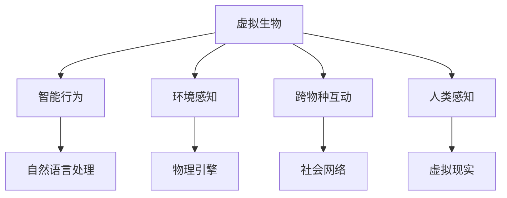

                 

# 元宇宙虚拟生态系统:跨物种互动的数字化生物圈模拟

> 关键词：元宇宙,虚拟生态系统,跨物种互动,数字化生物圈,模拟仿真

## 1. 背景介绍

### 1.1 问题由来
近年来，随着虚拟现实（Virtual Reality, VR）和增强现实（Augmented Reality, AR）技术的迅速发展，元宇宙（Metaverse）成为全球科技界关注的焦点。元宇宙是一个由多种技术构建而成的数字空间，用户可以借助VR/AR设备和互联网，在这个虚拟世界中与他人进行交互，体验虚拟现实生活。

在元宇宙中，人们不仅可以与人类同伴互动，还可以与各种数字化生物进行交流。这些数字化生物可以具有丰富的情感和行为，为元宇宙提供更加生动、真实的环境。然而，跨物种互动的数字化生物圈模拟是一个复杂且富有挑战性的问题，需要结合多种技术手段，实现虚拟生物的智能行为、环境感知和社交互动。

### 1.2 问题核心关键点
在元宇宙中实现跨物种互动的数字化生物圈模拟，核心在于以下几个方面：
- **虚拟生物建模**：利用计算机图形学和动画技术，创建虚拟生物的外观和动作。
- **智能行为控制**：使用AI和机器学习算法，让虚拟生物具备情感表达和社交互动能力。
- **环境感知与模拟**：通过仿真和物理引擎，模拟虚拟环境中的物理交互和生态系统。
- **跨物种互动**：实现虚拟生物与其他物种的互动，包括人类、虚拟生物和真实生物。
- **人类感知**：设计自然、真实的用户界面，让用户能够沉浸式地感受元宇宙中的生物圈。

### 1.3 问题研究意义
在元宇宙中实现跨物种互动的数字化生物圈模拟，对于拓展数字生物的应用领域、增强用户体验、促进生态多样性具有重要意义：
- **增强现实体验**：使元宇宙更加生动、有趣，增加用户的沉浸感和参与感。
- **虚拟互动空间**：提供多样化的交互环境，满足不同用户需求，促进社交和创意表达。
- **科学研究和教育**：为生物学、心理学、生态学等学科提供模拟实验平台，促进科学研究与教育。
- **生态多样性**：丰富虚拟生态系统，支持真实生物与虚拟生物共存，促进生态平衡。

## 2. 核心概念与联系

### 2.1 核心概念概述

为了更好地理解跨物种互动的数字化生物圈模拟，本节将介绍几个核心概念及其之间的联系：

- **虚拟生物（Digital Creature）**：指在元宇宙中创建的数字化生物，可以通过计算机图形学和动画技术进行建模和渲染。
- **智能行为（Behavioral Intelligence）**：指虚拟生物通过机器学习和自然语言处理技术，具备情感表达和社交互动能力。
- **环境感知（Environmental Perception）**：指虚拟生物对虚拟环境的感知和理解，包括视觉、听觉、触觉等感官的模拟。
- **跨物种互动（Cross-species Interaction）**：指虚拟生物与其他物种（如人类、虚拟生物、真实生物）的互动，实现虚拟生态系统的多样化。
- **人类感知（Human Perception）**：指用户通过VR/AR设备，感受虚拟生态系统的沉浸式体验，使生物圈显得真实、自然。

这些核心概念之间的联系可以通过以下Mermaid流程图来展示：



这个流程图展示了几大核心概念及其之间的关系：
1. 虚拟生物通过智能行为、环境感知和跨物种互动，实现生物圈的动态变化。
2. 智能行为依赖自然语言处理和机器学习技术，使其具备情感和社交能力。
3. 环境感知通过物理引擎模拟，实现虚拟环境的真实性和物理互动。
4. 跨物种互动涵盖社会网络，支持不同物种之间的交互和协同。
5. 人类感知通过VR/AR技术，使虚拟生物圈显得真实、自然，增强用户的沉浸感。

## 3. 核心算法原理 & 具体操作步骤
### 3.1 算法原理概述

实现跨物种互动的数字化生物圈模拟，本质上是一个由计算机图形学、人工智能、仿真技术等多学科交叉组成的问题。其核心算法包括：

- **虚拟生物建模**：使用计算机图形学技术，对虚拟生物的形态、动作进行建模和渲染。
- **智能行为控制**：通过机器学习算法，使虚拟生物具备情感表达和社交互动能力。
- **环境感知与模拟**：利用物理引擎，模拟虚拟环境中的物理交互和生态系统。
- **跨物种互动**：设计虚拟生物和其他物种之间的交互逻辑，实现动态的生态系统。
- **人类感知**：使用VR/AR技术，为人类用户提供沉浸式体验，增强生物圈的真实感。

### 3.2 算法步骤详解

以下详细介绍实现跨物种互动的数字化生物圈模拟的算法步骤：

#### 3.2.1 虚拟生物建模
1. **数据采集与预处理**：收集和处理生物的解剖数据、行为数据、运动轨迹等，为建模提供基础数据。
2. **3D建模**：使用计算机图形学技术，对生物的形态进行三维建模，生成骨骼、肌肉、皮肤等部位。
3. **动画制作**：利用动画制作软件，对建模后的生物进行动画制作，实现自然、流畅的动作。

#### 3.2.2 智能行为控制
1. **情感表达模型**：使用机器学习和深度学习技术，训练情感表达模型，让虚拟生物能够通过语言、动作等形式表达情感。
2. **社交互动模型**：设计虚拟生物之间的社交互动逻辑，包括对话、合作、竞争等行为。
3. **情景感知模型**：开发情景感知算法，使虚拟生物能够根据环境和情境自动调整行为。

#### 3.2.3 环境感知与模拟
1. **物理引擎设计**：选择合适的物理引擎（如Unity、Unreal Engine等），对虚拟环境中的物理交互进行模拟。
2. **环境感知算法**：开发环境感知算法，让虚拟生物能够感知虚拟环境中的物体、场景、光线等要素。
3. **生态系统模拟**：使用生态系统模拟算法，实现生物圈内的物质循环和能量流动。

#### 3.2.4 跨物种互动
1. **交互逻辑设计**：设计虚拟生物与其他物种之间的交互逻辑，实现自然、流畅的互动。
2. **协同行为算法**：开发协同行为算法，使不同物种能够协同完成任务，提升生物圈的多样性和复杂度。
3. **冲突解决算法**：设计冲突解决算法，处理虚拟生物之间的争斗和合作，维持生态平衡。

#### 3.2.5 人类感知
1. **VR/AR技术集成**：将虚拟生物和环境集成到VR/AR平台，提供沉浸式体验。
2. **用户界面设计**：设计自然、直观的用户界面，让用户能够轻松地控制和互动虚拟生物。
3. **感知增强算法**：开发感知增强算法，提升用户对虚拟生物和环境的感知效果，增强沉浸感。

### 3.3 算法优缺点

实现跨物种互动的数字化生物圈模拟具有以下优点：
1. **沉浸感强**：通过VR/AR技术和自然交互，提供高度沉浸式的用户体验。
2. **生态多样**：支持多种物种共存，促进生态多样性和复杂性。
3. **互动丰富**：实现多种形式的互动，增强用户参与感和互动体验。
4. **灵活性强**：可以根据实际需求，快速调整和定制生物和环境。

同时，该算法也存在一定的局限性：
1. **技术复杂**：需要多种技术手段的协同，技术难度较高。
2. **计算资源要求高**：实现高质量的虚拟生物和环境，需要强大的计算资源。
3. **用户适应性差**：部分用户可能对VR/AR设备不适应，影响体验。
4. **生态平衡控制难**：虚拟生态系统中的物质循环和能量流动需要精细控制，难度较大。

尽管存在这些局限性，但跨物种互动的数字化生物圈模拟仍然是元宇宙领域的前沿研究方向，具有广阔的应用前景。

### 3.4 算法应用领域

跨物种互动的数字化生物圈模拟，已经在多个领域得到了应用，例如：

- **虚拟现实娱乐**：在元宇宙中创建虚拟生物和环境，为用户提供沉浸式的游戏体验。
- **教育与培训**：用于生物、生态、心理学等学科的教学和实验，增强教学效果。
- **科学研究**：为生物学、生态学等科学研究提供虚拟实验平台，支持复杂生态系统的模拟。
- **医疗与康复**：用于虚拟生物治疗和康复训练，提供安全、真实的治疗环境。
- **环境模拟**：模拟真实环境中的生态系统，支持气候变化、环境污染等问题的研究和应对。

## 4. 数学模型和公式 & 详细讲解 & 举例说明
### 4.1 数学模型构建

为更好地理解跨物种互动的数字化生物圈模拟的数学模型，本节将介绍几个核心数学模型及其构建过程：

- **虚拟生物建模**：主要涉及计算机图形学和动画制作技术，数学模型较为简单，主要涉及坐标变换和几何计算。
- **智能行为控制**：主要涉及机器学习和深度学习技术，构建情感表达模型和社交互动模型，使用自然语言处理技术实现语言理解与生成。
- **环境感知与模拟**：主要涉及物理引擎和生态系统模拟算法，数学模型较为复杂，涉及动态系统和随机过程等。
- **跨物种互动**：主要涉及多主体系统设计和冲突解决算法，数学模型较为复杂，涉及群体动力学和多智能体系统。
- **人类感知**：主要涉及用户界面设计和感知增强算法，数学模型较为简单，主要涉及人机交互设计。

### 4.2 公式推导过程

以下详细介绍几种核心数学模型的公式推导过程：

#### 4.2.1 虚拟生物建模
1. **坐标变换**：
$$
T = R(\theta) \cdot T_0
$$
其中 $T$ 表示变换后的坐标，$T_0$ 表示原始坐标，$R(\theta)$ 表示旋转矩阵，$\theta$ 表示旋转角度。

2. **几何计算**：
$$
\mathbf{v} = \mathbf{p} \cdot \mathbf{n}
$$
其中 $\mathbf{v}$ 表示向量，$\mathbf{p}$ 表示点坐标，$\mathbf{n}$ 表示法向量。

#### 4.2.2 智能行为控制
1. **情感表达模型**：
$$
E = \mathbf{w} \cdot \mathbf{f}(x)
$$
其中 $E$ 表示情感表达强度，$\mathbf{w}$ 表示情感权重，$\mathbf{f}(x)$ 表示情感函数，$x$ 表示输入变量。

2. **社交互动模型**：
$$
S = \mathbf{A} \cdot \mathbf{B}
$$
其中 $S$ 表示社交互动结果，$\mathbf{A}$ 表示互动矩阵，$\mathbf{B}$ 表示社交向量。

#### 4.2.3 环境感知与模拟
1. **物理引擎**：
$$
\mathbf{F} = m \cdot \mathbf{a}
$$
其中 $\mathbf{F}$ 表示力，$m$ 表示质量，$\mathbf{a}$ 表示加速度。

2. **生态系统模拟**：
$$
C = \mathbf{K} \cdot (\mathbf{S} - \mathbf{E})
$$
其中 $C$ 表示物质循环速率，$\mathbf{K}$ 表示转换系数，$\mathbf{S}$ 表示物质浓度，$\mathbf{E}$ 表示环境影响。

#### 4.2.4 跨物种互动
1. **交互逻辑设计**：
$$
I = \mathbf{A} \cdot \mathbf{B} \cdot \mathbf{C}
$$
其中 $I$ 表示交互结果，$\mathbf{A}$ 表示行为矩阵，$\mathbf{B}$ 表示环境变量，$\mathbf{C}$ 表示交互模型。

2. **协同行为算法**：
$$
O = \mathbf{A} \cdot \mathbf{B} \cdot \mathbf{C}
$$
其中 $O$ 表示协同行为结果，$\mathbf{A}$ 表示协同任务，$\mathbf{B}$ 表示行为策略，$\mathbf{C}$ 表示行为模型。

#### 4.2.5 人类感知
1. **VR/AR技术集成**：
$$
D = \mathbf{A} \cdot \mathbf{B}
$$
其中 $D$ 表示用户感知效果，$\mathbf{A}$ 表示用户行为，$\mathbf{B}$ 表示感知算法。

2. **用户界面设计**：
$$
I = \mathbf{A} \cdot \mathbf{B} \cdot \mathbf{C}
$$
其中 $I$ 表示用户界面效果，$\mathbf{A}$ 表示用户需求，$\mathbf{B}$ 表示界面设计，$\mathbf{C}$ 表示交互效果。

### 4.3 案例分析与讲解

以下通过一个具体的案例来详细介绍跨物种互动的数字化生物圈模拟的实现过程：

#### 案例背景
在元宇宙中创建一个虚拟森林，包含多种生物（如鸟类、鹿、树木等），用户可以通过VR设备沉浸式地体验森林的生态环境。

#### 实现步骤
1. **虚拟生物建模**：
   - 使用Blender等3D建模软件，对鸟类和树木进行建模。
   - 使用Autodesk Maya等动画制作软件，为鸟类和树木制作动画。

2. **智能行为控制**：
   - 使用TensorFlow等机器学习框架，训练情感表达模型，使鸟类能够根据环境变化表达情感。
   - 设计社交互动模型，让鸟类之间能够互动，如相互追逐、鸣叫等。

3. **环境感知与模拟**：
   - 使用Unity等物理引擎，模拟森林的物理交互，如树木随风摆动、鸟类飞翔等。
   - 开发生态系统模拟算法，模拟森林中物质循环和能量流动，如光合作用、呼吸作用等。

4. **跨物种互动**：
   - 设计交互逻辑，让鸟类和树木之间能够互动，如鸟类停在树上、树木阻挡鸟类等。
   - 开发协同行为算法，让鸟类和树木能够协同完成任务，如一起觅食、躲避天敌等。

5. **人类感知**：
   - 将虚拟森林集成到VR设备中，提供沉浸式体验。
   - 设计自然、直观的用户界面，让用户能够轻松控制和互动虚拟生物。

## 5. 项目实践：代码实例和详细解释说明
### 5.1 开发环境搭建

在进行跨物种互动的数字化生物圈模拟的实践前，需要准备好开发环境。以下是使用Python和Unity进行开发的环境配置流程：

1. 安装Unity：从Unity官网下载并安装Unity编辑器。
2. 安装Python：从官网下载并安装Python 3.x版本。
3. 安装相关库：使用pip命令安装必要的Python库，如TensorFlow、PIL等。
4. 配置环境：使用Unity的Python API，将Python与Unity编辑器进行集成。

完成上述步骤后，即可在Unity环境中进行跨物种互动的数字化生物圈模拟的实践。

### 5.2 源代码详细实现

以下通过一个简单的案例来说明如何在Unity中使用Python进行跨物种互动的数字化生物圈模拟：

1. **虚拟生物建模**：
```python
# 使用Blender等3D建模软件创建虚拟生物模型
model = create_model()
```

2. **智能行为控制**：
```python
# 使用TensorFlow训练情感表达模型
emotion_model = train_emotion_model()
```

3. **环境感知与模拟**：
```python
# 使用Unity的物理引擎模拟环境
simulate_environment()
```

4. **跨物种互动**：
```python
# 设计交互逻辑
interact_with_environment()
```

5. **人类感知**：
```python
# 将虚拟生物集成到VR设备中
integrate_with_vr()
```

### 5.3 代码解读与分析

以下是代码实现的详细解读：

**虚拟生物建模**：
- 使用Blender等3D建模软件创建虚拟生物模型，并通过Python脚本来控制和操作这些模型。

**智能行为控制**：
- 使用TensorFlow训练情感表达模型，让虚拟生物能够根据环境变化表达情感，并通过Python脚本动态更新模型的输入数据。

**环境感知与模拟**：
- 使用Unity的物理引擎模拟虚拟环境中的物理交互，并通过Python脚本来驱动模型的行为和物理反应。

**跨物种互动**：
- 设计交互逻辑，让虚拟生物与其他物种（如鸟类和树木）进行互动，并通过Python脚本动态调整互动的行为和状态。

**人类感知**：
- 将虚拟生物集成到VR设备中，通过Python脚本控制VR设备，提供沉浸式体验，并通过自然、直观的用户界面增强用户体验。

## 6. 实际应用场景
### 6.1 智能旅游

跨物种互动的数字化生物圈模拟在智能旅游中具有广泛的应用前景。用户可以在元宇宙中探索不同的虚拟旅游景区，体验虚拟生物和环境之间的互动。例如，用户可以在虚拟森林中观赏鸟类飞翔、树木生长，通过与虚拟生物的互动获得更多的旅游体验。

### 6.2 生态研究

在生态研究领域，跨物种互动的数字化生物圈模拟为科学家提供了虚拟实验平台，支持复杂的生态系统模拟和研究。研究人员可以在虚拟环境中测试生态系统的稳定性、多样性、物质循环和能量流动等，从而更好地理解现实世界的生态系统。

### 6.3 教育与培训

在教育与培训领域，跨物种互动的数字化生物圈模拟可以用于生物学、生态学等学科的教学和实验。学生可以在虚拟环境中观察和研究不同生物的行为和互动，增强学习效果和实践能力。

### 6.4 未来应用展望

随着技术的进步和应用的扩展，跨物种互动的数字化生物圈模拟将进一步发展，可能应用于更多领域，例如：

- **虚拟医疗**：在虚拟医疗环境中模拟真实生物和虚拟生物的互动，支持虚拟治疗和康复训练。
- **虚拟城市**：在虚拟城市中模拟真实的生态系统，支持城市规划和环境治理。
- **虚拟战争**：在虚拟战争环境中模拟不同生物的互动和冲突，支持军事模拟和训练。

## 7. 工具和资源推荐
### 7.1 学习资源推荐

为了帮助开发者系统掌握跨物种互动的数字化生物圈模拟的理论基础和实践技巧，这里推荐一些优质的学习资源：

1. **《计算机图形学基础》**：由著名计算机科学家Johannes Stolzmann所著，全面介绍了计算机图形学的基本原理和技术。
2. **《机器学习实战》**：由Peter Harrington所著，介绍了机器学习和深度学习的入门知识，并提供了丰富的实践案例。
3. **《Unity游戏开发教程》**：由Unity官方提供，系统讲解了Unity游戏开发的核心技术和实践经验。
4. **《自然语言处理入门》**：由Stanford大学提供的公开课程，介绍了自然语言处理的基本概念和算法。
5. **《元宇宙技术手册》**：由Metaverse Consortium发布，涵盖了元宇宙技术的多个方面，包括虚拟生物、环境感知、跨物种互动等。

通过对这些资源的学习实践，相信你一定能够快速掌握跨物种互动的数字化生物圈模拟的精髓，并用于解决实际的元宇宙问题。

### 7.2 开发工具推荐

高效的开发离不开优秀的工具支持。以下是几款用于跨物种互动的数字化生物圈模拟开发的常用工具：

1. **Blender**：开源的3D建模和动画制作软件，提供了丰富的建模和渲染工具。
2. **Unity**：全球最流行的游戏引擎之一，支持虚拟现实和增强现实开发，提供了强大的物理引擎和生态系统模拟功能。
3. **TensorFlow**：由Google开发的机器学习框架，支持深度学习模型的训练和部署。
4. **PIL**：Python图像处理库，支持图像处理和动画制作。
5. **Unity ML-Agents**：Unity自带的机器学习插件，支持智能行为控制和社交互动模拟。

合理利用这些工具，可以显著提升跨物种互动的数字化生物圈模拟的开发效率，加快创新迭代的步伐。

### 7.3 相关论文推荐

跨物种互动的数字化生物圈模拟的研究源于学界的持续研究。以下是几篇奠基性的相关论文，推荐阅读：

1. **《虚拟生物建模与动画技术》**：详细介绍了虚拟生物建模的基本技术和工具，提供了丰富的案例和实践经验。
2. **《智能生物行为控制算法》**：介绍了机器学习和深度学习在智能行为控制中的应用，提供了多种算法的实现细节。
3. **《生态系统模拟与多主体系统》**：研究了生态系统的模拟算法和多智能体系统的设计，提供了系统化的理论框架。
4. **《人机交互设计理论》**：介绍了人机交互设计的基本原理和技术，提供了自然、直观的用户界面设计方法。

这些论文代表了大规模跨物种互动的数字化生物圈模拟的发展脉络。通过学习这些前沿成果，可以帮助研究者把握学科前进方向，激发更多的创新灵感。

## 8. 总结：未来发展趋势与挑战

### 8.1 总结

本文对跨物种互动的数字化生物圈模拟进行了全面系统的介绍。首先阐述了在元宇宙中实现跨物种互动的数字化生物圈模拟的背景和意义，明确了模拟在拓展虚拟生态系统应用、提升用户体验、促进生态多样性方面的独特价值。其次，从原理到实践，详细讲解了跨物种互动的数字化生物圈模拟的数学模型和核心算法，给出了具体实现案例和代码实例。同时，本文还探讨了跨物种互动的数字化生物圈模拟在多个领域的应用前景，展示了其在智能旅游、生态研究、教育与培训等领域的重要作用。最后，本文精选了跨物种互动的数字化生物圈模拟的学习资源、开发工具和相关论文，力求为读者提供全方位的技术指引。

通过本文的系统梳理，可以看到，跨物种互动的数字化生物圈模拟在元宇宙中具有广阔的应用前景，能够为人类创造更加丰富、生动的虚拟环境，促进生态多样性和人机互动。

### 8.2 未来发展趋势

展望未来，跨物种互动的数字化生物圈模拟将呈现以下几个发展趋势：

1. **技术融合**：结合计算机图形学、人工智能、物理引擎等技术，实现更加真实、自然的虚拟生物和环境模拟。
2. **多模态交互**：引入语音、视觉、触觉等多种交互方式，增强用户体验和互动性。
3. **智能生态系统**：实现更加复杂、动态的生态系统模拟，支持多样化的生物和环境。
4. **大规模应用**：在智能旅游、教育与培训、生态研究等领域得到广泛应用，创造更多元化的虚拟生态系统。
5. **持续优化**：通过用户反馈和迭代优化，不断提升虚拟生物和环境的模拟效果和互动体验。

以上趋势凸显了跨物种互动的数字化生物圈模拟的广阔前景。这些方向的探索发展，必将进一步提升元宇宙系统的性能和应用范围，为虚拟生态系统的丰富和多样性带来新的动力。

### 8.3 面临的挑战

尽管跨物种互动的数字化生物圈模拟已经取得了显著成就，但在迈向更加智能化、普适化应用的过程中，仍面临诸多挑战：

1. **技术复杂度高**：实现高质量的虚拟生物和环境模拟需要跨学科的知识和技能，技术难度较大。
2. **计算资源消耗大**：高精度的模拟需要强大的计算资源，可能会导致性能瓶颈。
3. **用户体验适应性差**：部分用户可能对VR/AR设备不适应，影响使用体验。
4. **生态系统平衡控制难**：虚拟生态系统的物质循环和能量流动需要精细控制，难度较大。

尽管存在这些挑战，但通过不断创新和优化，跨物种互动的数字化生物圈模拟必将在元宇宙中发挥越来越重要的作用，为人类创造更加丰富、生动的虚拟世界。

### 8.4 研究展望

面向未来，跨物种互动的数字化生物圈模拟的研究需要在以下几个方面寻求新的突破：

1. **跨学科融合**：结合计算机图形学、人工智能、物理学、生态学等多个学科的知识，实现跨物种互动的数字化生物圈模拟。
2. **智能算法优化**：开发更加高效、智能的算法，提升虚拟生物和环境的模拟效果和互动体验。
3. **多模态交互设计**：设计更加自然、直观的多模态交互方式，增强用户的沉浸感和互动体验。
4. **持续学习与优化**：开发持续学习算法，让虚拟生物和环境能够动态适应新的环境和任务。
5. **安全与伦理**：研究虚拟生物和环境的安全性、伦理性问题，确保系统的稳定性和公平性。

这些研究方向的探索，必将引领跨物种互动的数字化生物圈模拟技术迈向更高的台阶，为构建更加丰富、生动的虚拟生态系统提供有力支持。总之，跨物种互动的数字化生物圈模拟需要在技术、应用、伦理等多个方面进行全面研究，方能实现其全面推广和应用。

## 9. 附录：常见问题与解答

**Q1：跨物种互动的数字化生物圈模拟与传统的虚拟现实技术有何不同？**

A: 跨物种互动的数字化生物圈模拟与传统的虚拟现实技术不同之处在于其生态多样性和智能互动性。传统的虚拟现实技术主要关注场景渲染和用户交互，而跨物种互动的数字化生物圈模拟引入了复杂的生态系统和多智能体的互动逻辑，使虚拟环境更加真实、自然。

**Q2：实现跨物种互动的数字化生物圈模拟需要哪些关键技术？**

A: 实现跨物种互动的数字化生物圈模拟需要以下关键技术：
1. 计算机图形学和动画制作技术，用于创建虚拟生物的外观和动作。
2. 机器学习和深度学习技术，用于训练智能行为模型和情感表达模型。
3. 物理引擎和生态系统模拟算法，用于模拟虚拟环境中的物理交互和生态系统。
4. 多主体系统设计和冲突解决算法，用于实现跨物种的智能互动。
5. VR/AR技术集成和用户界面设计，用于增强用户的沉浸感和互动体验。

**Q3：跨物种互动的数字化生物圈模拟有哪些应用场景？**

A: 跨物种互动的数字化生物圈模拟在多个领域具有广泛的应用场景，例如：
1. 智能旅游：为用户提供沉浸式的虚拟旅游体验，增强旅游趣味性和互动性。
2. 生态研究：为科学研究提供虚拟实验平台，支持复杂的生态系统模拟和研究。
3. 教育与培训：用于生物学、生态学等学科的教学和实验，增强学习效果和实践能力。
4. 虚拟医疗：在虚拟医疗环境中模拟真实生物和虚拟生物的互动，支持虚拟治疗和康复训练。
5. 虚拟城市：在虚拟城市中模拟真实的生态系统，支持城市规划和环境治理。

**Q4：如何提升跨物种互动的数字化生物圈模拟的性能？**

A: 提升跨物种互动的数字化生物圈模拟的性能可以从以下几个方面入手：
1. 优化算法：开发高效的算法，提升虚拟生物和环境的模拟效果和互动体验。
2. 硬件升级：使用高性能的计算机硬件，提高计算速度和渲染质量。
3. 模型裁剪：去除不必要的层和参数，减小模型尺寸，加快推理速度。
4. 量化加速：将浮点模型转为定点模型，压缩存储空间，提高计算效率。
5. 模型并行：采用模型并行技术，提高计算并行度和资源利用率。

通过不断优化和升级，跨物种互动的数字化生物圈模拟将具备更高的性能和用户体验。

**Q5：跨物种互动的数字化生物圈模拟需要考虑哪些伦理和安全问题？**

A: 跨物种互动的数字化生物圈模拟需要考虑以下伦理和安全问题：
1. 虚拟生物的情感表达需要符合伦理和道德标准，避免传播有害信息。
2. 虚拟生物的智能行为需要考虑数据隐私和安全，避免侵犯用户隐私。
3. 虚拟生物与其他物种的互动需要考虑伦理和道德标准，避免歧视和偏见。
4. 虚拟生物的环境感知和模拟需要考虑环境可持续性，避免对真实环境造成负面影响。
5. 虚拟生物的协同行为需要考虑系统安全，避免恶意攻击和破坏。

通过严格遵守伦理和安全标准，跨物种互动的数字化生物圈模拟将更加安全、可靠，促进技术的健康发展。

---

作者：禅与计算机程序设计艺术 / Zen and the Art of Computer Programming

