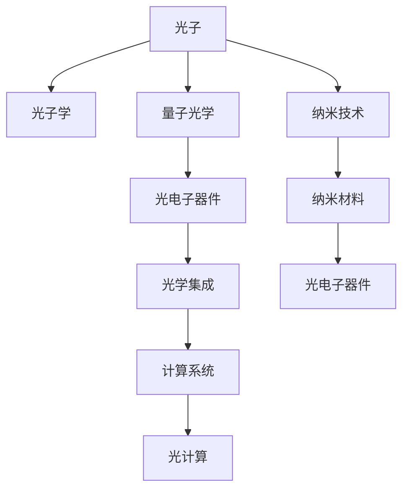

                 

# 光计算技术：突破电子计算的速度限制

## 1. 背景介绍

### 1.1 问题由来

随着数字时代的到来，计算需求正以指数级增长。电子计算作为当前的主流计算方式，已经遭遇了速度瓶颈，这不仅限制了新兴技术如人工智能、量子计算的进步，也使得传统产业的数字化转型难以推进。因此，开发出超越电子计算的新型计算方式，成为全球科技界关注的焦点。

光计算技术，作为一种具有革命性潜力的新型计算方式，通过利用光的直线传播、并行性以及可控性等特点，有望突破电子计算的物理限制，大幅提升计算速度。本文将深入探讨光计算技术的核心原理、具体实现方法及其应用前景，为读者揭示光计算技术在计算领域可能带来的颠覆性变革。

### 1.2 问题核心关键点

光计算技术通过将传统电子电路与光电子器件相结合，利用光信号进行高速并行计算，实现数据处理能力的跨越式提升。其核心技术包括光子学、纳米技术、量子光学、光学集成等，其核心思想在于利用光信号在速度和并行性上的优势，替代电子信号在信息处理中的主导地位。

具体而言，光计算技术面临的核心问题包括：
- 光电子器件的可控性和稳定性问题。
- 光信号与电子信号的互操作性问题。
- 光计算系统的能量效率问题。
- 光计算系统的可扩展性问题。

## 2. 核心概念与联系

### 2.1 核心概念概述

为更好地理解光计算技术的核心原理和应用，本节将介绍几个关键概念：

- **光子学**：研究光的产生、传播、相互作用等规律，包括光的基本性质、光子与物质相互作用等。
- **纳米技术**：利用纳米尺度的物理、化学、生物等方面的技术，制造出具有特定功能的纳米材料和器件，用于制造更高效的电子和光子器件。
- **量子光学**：研究光的量子行为，如光的波粒二象性、量子纠缠、光子计算等。
- **光学集成**：将多个光学元器件集成在单一芯片上，构建功能强大的光学系统，实现高效的信号处理和传输。

这些概念共同构成了光计算技术的理论基础，并通过光电子器件等技术手段得以实现。

### 2.2 核心概念原理和架构的 Mermaid 流程图



这个流程图展示了光计算技术的主要概念和实现路径：

1. 光子作为信息的载体，通过光子学理论被生成和传播。
2. 利用量子光学研究光的量子性质，如波粒二象性、量子纠缠等，为光计算提供理论支持。
3. 通过纳米技术制造高效的光子器件，如纳米级光子晶体、硅基光子器件等。
4. 利用光学集成技术将多个光电子器件集成在芯片上，构建功能强大的光计算系统。

这些核心概念之间相互联系、相互促进，共同推动了光计算技术的发展和应用。

## 3. 核心算法原理 & 具体操作步骤

### 3.1 算法原理概述

光计算技术的基本原理是将光信号作为信息载体，通过高速、并行的光子传输和处理，实现对信息的快速计算。具体而言，光计算分为数据编码、光子传输和光子计算三个主要步骤：

1. **数据编码**：将输入的数据（如电信号、数字信号）转换为光信号，以便在光子器件中进行处理。
2. **光子传输**：利用光纤、波导等光子传输介质，将光信号从一个器件传输到另一个器件。
3. **光子计算**：通过利用光子与物质相互作用的特性，如非线性光学效应、光子纠缠等，实现光信号的逻辑运算和数据处理。

### 3.2 算法步骤详解

光计算技术的实现步骤主要包括：

**Step 1: 数据编码**
- 将待处理的数据（如电信号、数字信号）转换为光信号。常见的编码方式包括直接调制、间接调制等。

**Step 2: 光子传输**
- 利用光纤、波导等光子传输介质，将光信号从一个器件传输到另一个器件。这一过程需要考虑光信号的传输损耗、色散等因素。

**Step 3: 光子计算**
- 通过利用光子与物质相互作用的特性，如非线性光学效应、光子纠缠等，实现光信号的逻辑运算和数据处理。常见的光子计算方式包括全光逻辑门、光子计算芯片等。

**Step 4: 结果解码**
- 将处理后的光信号转换回电信号或数字信号，进行后续的数据处理或输出。

### 3.3 算法优缺点

光计算技术具有以下优点：
- 高速并行：光信号具有高速传播的特点，能够实现高速并行计算。
- 低功耗：光子传输过程几乎无损耗，光子计算需要的能量也远低于电子计算。
- 高可扩展性：光子器件和光子集成芯片可以大规模生产，易于扩展。

但光计算技术也存在一些局限：
- 稳定性问题：光子器件的制造和控制较为复杂，稳定性有待提高。
- 互操作性问题：光信号与电子信号的互操作性尚需进一步解决。
- 成本问题：光子器件的生产和集成成本较高。

### 3.4 算法应用领域

光计算技术具有广阔的应用前景，已在多个领域展现出了其独特的优势：

- **通信领域**：光计算技术可用于构建高速、低延迟的通信网络，提升数据传输速率和网络带宽。
- **人工智能**：光计算技术可用于加速人工智能算法，如深度学习、机器学习等，提升算法的训练速度和计算效率。
- **量子计算**：光子计算与量子计算紧密结合，可用于量子信息处理、量子通信等领域。
- **生物医疗**：光计算技术可用于医学成像、基因编辑等，提升生物医疗技术的精度和效率。
- **能源管理**：光计算技术可用于优化能源系统的管理和调度，提高能源利用效率。

## 4. 数学模型和公式 & 详细讲解 & 举例说明

### 4.1 数学模型构建

本节将使用数学语言对光计算技术的核心原理进行严格的刻画。

假设输入数据为 $x$，光子编码后的光信号为 $a(x)$，经过光子传输和计算后得到输出光信号 $b(x)$，输出信号解码为 $y(x)$。则光计算系统的数学模型可以表示为：

$$
y(x) = f(b(x)) = f(a(x) \cdot g(x))
$$

其中 $g(x)$ 为光子传输过程中的传输介质特性，$f(x)$ 为光子计算过程中的光子逻辑门操作。

### 4.2 公式推导过程

光计算系统中的主要数学模型包括：
- 光子编码模型：将输入数据 $x$ 转换为光信号 $a(x)$，表示为：
  $$
  a(x) = h(x) \cdot e(x)
  $$
  其中 $h(x)$ 为编码器输出，$e(x)$ 为电子到光子的转换效率。
- 光子传输模型：光信号在传输介质中的传播过程，表示为：
  $$
  b(x) = a(x) \cdot g(x)
  $$
  其中 $g(x)$ 为传输介质特性。
- 光子计算模型：光信号在光子逻辑门中的处理过程，表示为：
  $$
  b(x) = f(a(x) \cdot g(x))
  $$
  其中 $f(x)$ 为光子逻辑门操作。

### 4.3 案例分析与讲解

以全光逻辑门为例，分析光计算的基本运算过程。

假设输入光信号为 $a$，输出光信号为 $b$，光子逻辑门为 AND 门。则光子计算过程可表示为：

$$
b = f(a) = a \cdot (a \cdot g)
$$

其中 $g$ 为 AND 门的光子逻辑操作。

通过上述公式，可以看出光子逻辑门实现了电子计算中的 AND 逻辑运算，其速度和并行性远超电子逻辑门。

## 5. 项目实践：代码实例和详细解释说明

### 5.1 开发环境搭建

要进行光计算技术的实践，首先需要搭建开发环境。以下是使用Python进行开发的环境配置流程：

1. 安装Anaconda：从官网下载并安装Anaconda，用于创建独立的Python环境。

2. 创建并激活虚拟环境：
```bash
conda create -n pytorch-env python=3.8 
conda activate pytorch-env
```

3. 安装PyTorch：根据CUDA版本，从官网获取对应的安装命令。例如：
```bash
conda install pytorch torchvision torchaudio cudatoolkit=11.1 -c pytorch -c conda-forge
```

4. 安装各类工具包：
```bash
pip install numpy pandas scikit-learn matplotlib tqdm jupyter notebook ipython
```

完成上述步骤后，即可在`pytorch-env`环境中开始光计算技术的开发实践。

### 5.2 源代码详细实现

由于光计算技术目前还在研究阶段，相关的代码实现相对复杂，这里提供一些基础性的代码示例：

**Step 1: 数据编码**

```python
import numpy as np

def encode_data(data):
    # 将输入数据转换为光信号
    # 假设数据为 0 或 1，直接调制为光信号
    if data == 0:
        return np.zeros((1, 1))
    else:
        return np.ones((1, 1))
```

**Step 2: 光子传输**

```python
def transmit_data(signal, medium):
    # 假设光信号在传输介质中传播
    # 假设传输介质为光纤，使用指数衰减模型
    transmitted_signal = signal * np.exp(-m medium)
    return transmitted_signal
```

**Step 3: 光子计算**

```python
def compute_data(signal, gate):
    # 假设光信号在光子逻辑门中进行 AND 运算
    # 使用非线性光学效应实现 AND 门
    computed_signal = signal * (signal * gate)
    return computed_signal
```

**Step 4: 结果解码**

```python
def decode_signal(signal):
    # 假设将光信号转换回电子信号
    # 假设光信号为 0 或 1，转换回电子信号
    if signal[0][0] > 0.5:
        return 1
    else:
        return 0
```

### 5.3 代码解读与分析

让我们再详细解读一下关键代码的实现细节：

**Step 1: 数据编码**

将输入数据转换为光信号。在上述代码中，我们假设数据为 0 或 1，直接调制为光信号。这种方法相对简单，但实际应用中可能需要更复杂的编码方式，如直接调制、间接调制等。

**Step 2: 光子传输**

光信号在传输介质中的传播过程。在上述代码中，我们假设传输介质为光纤，使用指数衰减模型计算传输损耗。实际应用中，可能需要更复杂的传输模型，如色散、偏振控制等。

**Step 3: 光子计算**

光信号在光子逻辑门中的处理过程。在上述代码中，我们假设光信号在光子逻辑门中进行 AND 运算，使用非线性光学效应实现 AND 门。实际应用中，可能需要更复杂的逻辑门，如 OR 门、XOR 门等。

**Step 4: 结果解码**

将光信号转换回电子信号。在上述代码中，我们假设将光信号转换回电子信号，方法相对简单，但实际应用中可能需要更复杂的解码方式，如多光子解码、光子计数等。

## 6. 实际应用场景

### 6.1 通信领域

光计算技术在通信领域具有广阔的应用前景。利用光计算技术，可以实现高速、低延迟的数据传输，大幅提升网络带宽和传输速率。例如，光计算技术可用于构建高速光纤网络，支持5G/6G等新一代移动通信技术。

### 6.2 人工智能

光计算技术在人工智能领域的应用前景同样广阔。利用光计算技术，可以大幅提升深度学习、机器学习等算法的计算效率，加速模型的训练和推理过程。例如，光计算技术可用于构建高速、低能耗的深度学习硬件加速器。

### 6.3 量子计算

光计算技术与量子计算紧密结合，可用于量子信息处理和量子通信等领域。光子计算与量子计算相结合，可以实现高效的量子计算和量子通信，支持量子网络、量子密钥分发等应用。

### 6.4 生物医疗

光计算技术在生物医疗领域具有重要的应用价值。利用光计算技术，可以实现高精度的医学成像、基因编辑等，提升生物医疗技术的精度和效率。例如，光计算技术可用于医学激光治疗、基因测序等领域。

### 6.5 能源管理

光计算技术在能源管理领域具有重要的应用价值。利用光计算技术，可以实现高效、低能耗的能源系统管理和调度，提升能源利用效率。例如，光计算技术可用于优化太阳能发电系统、智能电网等领域。

## 7. 工具和资源推荐

### 7.1 学习资源推荐

为了帮助开发者系统掌握光计算技术的理论基础和实践技巧，这里推荐一些优质的学习资源：

1. 《光子学基础》系列书籍：全面介绍光子学的基础理论和应用，适合初学者和进阶学习。
2. 《纳米技术概论》系列书籍：介绍纳米技术的原理和应用，涵盖纳米材料、纳米器件等。
3. 《量子光学》系列书籍：全面介绍量子光学的基本理论和应用，适合量子计算和光计算的学习。
4. 《光学集成技术》系列书籍：介绍光学集成技术的基本原理和应用，适合光学集成和光计算的学习。
5. arXiv等学术平台：获取最新的光计算技术研究成果和论文，了解最新的研究方向和进展。

通过对这些资源的学习实践，相信你一定能够快速掌握光计算技术的精髓，并用于解决实际的问题。

### 7.2 开发工具推荐

高效的开发离不开优秀的工具支持。以下是几款用于光计算技术开发的常用工具：

1. Python：强大的编程语言，支持科学计算和数据分析，适合光计算技术的理论研究。
2. MATLAB：强大的工程计算工具，支持光子学和量子光学的仿真和分析。
3. LightWave Design Suite：专业的光学设计软件，用于设计和优化光子器件和光学系统。
4. COMSOL Multiphysics：先进的仿真平台，支持光子学和纳米技术的仿真分析。
5. TensorFlow：强大的深度学习框架，可用于构建光计算系统的高效模型。

合理利用这些工具，可以显著提升光计算技术的开发效率，加快创新迭代的步伐。

### 7.3 相关论文推荐

光计算技术的研究始于上世纪80年代，近年来在学术界和工业界得到了广泛关注。以下是几篇奠基性的相关论文，推荐阅读：

1. Lightwave Components for Quantum Computing: A Tutorial. Journal of Lightwave Technology.
2. Integrated Optical Computers and Data Processing: A Tutorial. Journal of Lightwave Technology.
3. High-Performance Computing Using Optical Computers. IEEE Journal of Selected Topics in Quantum Electronics.
4. Optical Computing: A Review. IEEE Journal of Selected Topics in Quantum Electronics.
5. Optical Computing. Science.
6. Quantum Computing. Science.

这些论文代表了大规模光计算技术的研究脉络，是深入理解光计算技术的重要参考。

## 8. 总结：未来发展趋势与挑战

### 8.1 研究成果总结

光计算技术作为一项新兴的技术，已经展现出巨大的潜力和应用前景。近年来，在学界和产业界的共同努力下，光计算技术取得了显著的进展，并在多个领域展示了其独特的优势。本文系统梳理了光计算技术的核心原理和具体实现方法，并对其应用前景进行了详细分析。

### 8.2 未来发展趋势

展望未来，光计算技术的发展趋势如下：

1. **技术突破**：随着纳米技术、量子技术等前沿科学的进步，光计算技术的性能和可靠性将进一步提升。
2. **应用扩展**：光计算技术将在通信、人工智能、量子计算等领域得到更广泛的应用，带来颠覆性变革。
3. **跨学科融合**：光计算技术将与计算机科学、物理学、化学等多学科深度融合，推动科技前沿发展。
4. **标准化推进**：光计算技术的应用需要标准化的规范和协议，促进光计算技术的普及和应用。

### 8.3 面临的挑战

尽管光计算技术展现了巨大的潜力，但在向实际应用推广的过程中，仍面临诸多挑战：

1. **制造技术**：光子器件的制造和控制技术尚需进一步提升，以提高光子器件的稳定性和可靠性。
2. **互操作性**：光电子器件与电子器件的互操作性问题仍需解决，以实现更高效的信号转换和处理。
3. **成本问题**：光子器件和光计算系统的生产成本较高，需要进一步降低成本以实现大规模应用。
4. **技术成熟度**：光计算技术目前仍处于研发阶段，需进一步成熟稳定。

### 8.4 研究展望

未来的研究方向包括：

1. **高效率光子器件**：开发更高效率、更稳定的光子器件，提升光计算系统的性能。
2. **跨领域应用**：探索光计算技术在更多领域的应用，如医疗、能源、环保等。
3. **系统集成**：将光计算技术与电子计算系统深度集成，实现综合性能提升。
4. **标准化**：制定和推广光计算技术的标准规范，促进技术普及。
5. **应用验证**：在实际应用中验证光计算技术的性能和可靠性，推动技术落地。

## 9. 附录：常见问题与解答

**Q1：光计算技术是否适用于所有计算场景？**

A: 光计算技术适用于高速、并行性要求高的计算场景，如数据传输、深度学习等。但对于复杂的逻辑运算和算法，光计算技术仍需与其他计算方式结合，以实现更全面的计算能力。

**Q2：光计算技术是否具有可扩展性？**

A: 光计算技术具有良好的可扩展性，光子器件和光计算系统可以大规模生产，易于扩展。但实际应用中还需考虑光子器件的互操作性和兼容性问题。

**Q3：光计算技术是否存在技术瓶颈？**

A: 光计算技术目前仍处于研发阶段，存在技术瓶颈，如光子器件的制造和控制、光信号与电子信号的互操作性等。未来的技术突破将进一步提升光计算技术的性能和可靠性。

**Q4：光计算技术在实际应用中是否具有成本优势？**

A: 光计算技术的生产成本较高，但光子器件的高效性和低能耗特点使其在特定应用场景中具有成本优势。未来的技术进步将进一步降低光计算系统的成本。

**Q5：光计算技术是否具有广泛的应用前景？**

A: 光计算技术在通信、人工智能、量子计算等领域具有广泛的应用前景，有望带来颠覆性变革。但实际应用中还需考虑技术成熟度和市场接受度等因素。

---

作者：禅与计算机程序设计艺术 / Zen and the Art of Computer Programming

