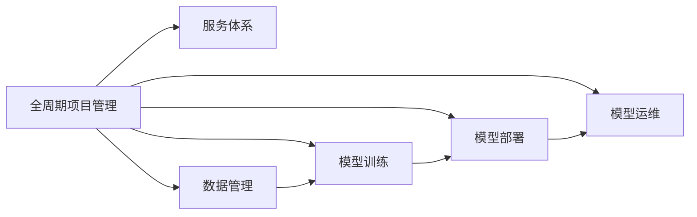

                 

# 全周期AI项目管理：Lepton AI的服务体系

> 关键词：AI项目管理,全周期,Lepton AI,服务体系

## 1. 背景介绍

### 1.1 问题由来

随着人工智能(AI)技术的不断进步和应用范围的扩展，AI项目管理的复杂性和挑战性日益增加。AI项目涉及数据收集、模型训练、模型部署、模型优化、模型运维等众多环节，每个环节都需要精确控制和科学管理，以确保项目的成功交付和持续运营。然而，传统项目管理方法难以应对AI项目的独特需求，导致项目周期长、成本高、效率低等问题频发。

为解决这一问题，Lepton AI提出了一套全周期的AI项目管理服务体系，从项目立项、实施、交付到运维的每个阶段，都提供一站式的专业服务和支持，全面保障AI项目的高效管理和成功落地。

### 1.2 问题核心关键点

Lepton AI的全周期AI项目管理服务体系，旨在通过以下核心能力，实现AI项目的全方位、全生命周期的管理与优化：

- 项目立项：帮助客户明确项目目标、任务分配、资源规划，快速启动项目。
- 项目实施：提供数据处理、模型训练、模型评估等技术支持，确保模型质量。
- 项目交付：协助模型部署、测试、优化，保证模型可靠上线。
- 项目运维：持续监控、调优、更新模型，延长模型生命周期。

## 2. 核心概念与联系

### 2.1 核心概念概述

Lepton AI的全周期AI项目管理服务体系，由以下几个核心概念构成：

- 全周期项目管理(All-Cycle Project Management)：涵盖从项目启动、实施、交付到运维的全生命周期管理，确保项目按计划、高质量地完成。
- 服务体系(Service Ecosystem)：整合Lepton AI内部技术资源、专家团队、技术合作方等，为客户提供一站式、全方位的项目管理服务。
- 数据管理(Data Management)：通过数据清洗、数据标注、数据处理等手段，确保数据的高质量和适用性。
- 模型训练(Model Training)：包括模型选择、数据准备、模型训练、超参数调优、性能评估等环节，确保模型高质量输出。
- 模型部署(Model Deployment)：涵盖模型部署、集成、测试、优化等，确保模型在生产环境中的可靠性。
- 模型运维(Model Operations)：包括模型监控、性能调优、版本更新等，保障模型在应用中的稳定性和性能。

这些核心概念通过以下Mermaid流程图进行关联展示：



### 2.2 核心概念原理和架构

#### 2.2.1 全周期项目管理

Lepton AI的全周期项目管理，采用敏捷开发、DevOps等项目管理方法论，结合AI项目的特点，提供全方位的项目管理支持：

- **项目规划**：通过敏捷方法，快速迭代需求、任务、资源，确保项目顺利启动。
- **项目管理工具**：使用JIRA、Confluence等项目管理工具，实现任务分配、进度跟踪、资源管理等。
- **变更管理**：建立变更评审和风险管理机制，确保项目按计划推进。

#### 2.2.2 数据管理

数据是AI项目的基石，Lepton AI提供以下数据管理服务：

- **数据采集**：通过网络爬虫、API接口等方式，高效获取大量高质量数据。
- **数据清洗**：采用ETL工具进行数据预处理，去除噪音、填补缺失值，确保数据质量。
- **数据标注**：利用机器学习和人工标注结合的方式，快速高效地完成数据标注。

#### 2.2.3 模型训练

模型训练是AI项目的关键环节，Lepton AI提供以下模型训练支持：

- **模型选择**：根据任务需求，推荐适合的预训练模型或定制模型。
- **数据准备**：包括数据划分、特征工程、样本增强等，确保训练数据的适用性。
- **模型训练**：利用GPU/TPU等高性能计算资源，高效进行模型训练。
- **超参数调优**：采用网格搜索、随机搜索、贝叶斯优化等方法，优化模型性能。

#### 2.2.4 模型部署

模型部署是将训练好的模型上线应用的重要环节，Lepton AI提供以下模型部署支持：

- **模型集成**：将模型集成到业务系统中，确保模型能够被正确调用。
- **模型测试**：通过单元测试、集成测试、性能测试等，确保模型可靠上线。
- **版本控制**：采用版本控制工具，管理模型发布和更新。

#### 2.2.5 模型运维

模型运维是保障模型长期稳定运行的关键，Lepton AI提供以下模型运维支持：

- **模型监控**：通过监控工具，实时监控模型性能和资源使用情况。
- **性能调优**：根据监控数据，定期进行模型调优，确保模型性能。
- **版本更新**：根据业务需求，定期更新模型，引入新功能。

### 2.3 核心概念联系

Lepton AI的全周期AI项目管理服务体系，通过以下联系，形成完整的项目管理体系：

- **数据管理**是AI项目的基础，提供高质量的数据输入。
- **模型训练**基于数据，训练出高质量的模型。
- **模型部署**将模型上线，完成模型交付。
- **模型运维**保障模型长期稳定运行，持续提供服务。
- **全周期项目管理**统筹管理数据管理、模型训练、模型部署和模型运维，确保项目按计划推进。

这些概念的有机结合，形成Lepton AI全周期AI项目管理服务体系的完整框架。

## 3. 核心算法原理 & 具体操作步骤

### 3.1 算法原理概述

Lepton AI的全周期AI项目管理服务体系，通过以下几个核心算法原理，实现项目的全方位、全生命周期的管理与优化：

- **敏捷开发**：采用敏捷方法论，快速迭代需求、任务、资源，确保项目顺利启动。
- **DevOps**：将软件开发与运维流程自动化，确保模型高质量上线和稳定运行。
- **数据清洗**：采用ETL工具，去除噪音、填补缺失值，确保数据质量。
- **模型训练**：利用GPU/TPU等高性能计算资源，高效进行模型训练。
- **模型部署**：通过自动化部署工具，确保模型能够被正确调用。
- **模型运维**：通过监控工具，实时监控模型性能和资源使用情况，定期进行模型调优。

### 3.2 算法步骤详解

Lepton AI的全周期AI项目管理服务体系，分为以下几个主要步骤：

#### 3.2.1 项目规划

- **明确目标**：与客户沟通，明确项目目标、任务需求和资源分配。
- **需求分析**：进行需求调研和分析，形成详细的需求文档。
- **任务分解**：将需求拆分为可执行的任务，分配给不同团队。
- **进度跟踪**：使用项目管理工具（如JIRA），实时跟踪项目进度，确保按计划推进。

#### 3.2.2 数据管理

- **数据采集**：通过网络爬虫、API接口等方式，高效获取大量高质量数据。
- **数据清洗**：采用ETL工具进行数据预处理，去除噪音、填补缺失值，确保数据质量。
- **数据标注**：利用机器学习和人工标注结合的方式，快速高效地完成数据标注。

#### 3.2.3 模型训练

- **模型选择**：根据任务需求，推荐适合的预训练模型或定制模型。
- **数据准备**：包括数据划分、特征工程、样本增强等，确保训练数据的适用性。
- **模型训练**：利用GPU/TPU等高性能计算资源，高效进行模型训练。
- **超参数调优**：采用网格搜索、随机搜索、贝叶斯优化等方法，优化模型性能。

#### 3.2.4 模型部署

- **模型集成**：将模型集成到业务系统中，确保模型能够被正确调用。
- **模型测试**：通过单元测试、集成测试、性能测试等，确保模型可靠上线。
- **版本控制**：采用版本控制工具，管理模型发布和更新。

#### 3.2.5 模型运维

- **模型监控**：通过监控工具，实时监控模型性能和资源使用情况。
- **性能调优**：根据监控数据，定期进行模型调优，确保模型性能。
- **版本更新**：根据业务需求，定期更新模型，引入新功能。

### 3.3 算法优缺点

Lepton AI的全周期AI项目管理服务体系，具有以下优点：

- **全面性**：涵盖从项目启动、实施、交付到运维的全生命周期管理，确保项目高质量完成。
- **专业性**：提供一站式、全方位的项目管理服务，减少项目复杂性。
- **灵活性**：根据项目需求灵活调整，满足不同客户的定制化需求。

同时，也存在以下缺点：

- **资源需求高**：需要大量的高性能计算资源和专业知识，资源投入较大。
- **实施周期长**：项目涉及多个环节，周期较长。
- **技术复杂**：项目管理涉及多个技术和方法，实施难度较高。

### 3.4 算法应用领域

Lepton AI的全周期AI项目管理服务体系，适用于以下多个应用领域：

- **智能客服**：通过AI模型处理客户咨询，提高服务效率和质量。
- **金融风控**：利用AI模型进行信用评估、欺诈检测等，提升风险控制能力。
- **医疗诊断**：采用AI模型进行影像分析、病历诊断等，辅助医生决策。
- **智能推荐**：利用AI模型进行个性化推荐，提升用户体验。
- **智能安防**：采用AI模型进行人脸识别、行为分析等，提升安全防范水平。
- **智能交通**：利用AI模型进行交通流量预测、事故检测等，优化交通管理。

## 4. 数学模型和公式 & 详细讲解

### 4.1 数学模型构建

Lepton AI的全周期AI项目管理服务体系，涉及多个数学模型，用于不同环节的管理与优化。以下分别介绍主要模型：

#### 4.1.1 敏捷开发模型

敏捷开发模型采用Scrum、Kanban等方法论，将项目划分为多个迭代周期，每个周期内进行需求评审、任务分配、进度跟踪等。其核心数学模型为：

$$
P = \sum_{i=1}^n V_i \cdot D_i
$$

其中，$P$ 为项目总工期，$V_i$ 为第 $i$ 次迭代的任务量，$D_i$ 为第 $i$ 次迭代的工期。

#### 4.1.2 DevOps模型

DevOps模型将软件开发与运维流程自动化，通过CI/CD流水线，确保模型高质量上线和稳定运行。其核心数学模型为：

$$
T_{total} = T_{develop} + T_{test} + T_{deploy} + T_{monitor}
$$

其中，$T_{total}$ 为总工期，$T_{develop}$ 为开发周期，$T_{test}$ 为测试周期，$T_{deploy}$ 为部署周期，$T_{monitor}$ 为运维周期。

#### 4.1.3 数据清洗模型

数据清洗模型通过ETL工具进行数据预处理，去除噪音、填补缺失值。其核心数学模型为：

$$
C = \frac{1}{N} \sum_{i=1}^N C_i
$$

其中，$C$ 为数据清洗后的均值，$C_i$ 为第 $i$ 个样本的数据清洗结果。

#### 4.1.4 模型训练模型

模型训练模型利用GPU/TPU等高性能计算资源，高效进行模型训练。其核心数学模型为：

$$
T_{train} = C_{train} \cdot \frac{N_{train}}{S}
$$

其中，$T_{train}$ 为模型训练时间，$C_{train}$ 为每个样本的训练时间，$N_{train}$ 为训练样本数，$S$ 为并行计算设备的数量。

#### 4.1.5 模型部署模型

模型部署模型通过自动化部署工具，确保模型能够被正确调用。其核心数学模型为：

$$
T_{deploy} = \sum_{i=1}^N T_{deploy,i}
$$

其中，$T_{deploy}$ 为模型部署时间，$T_{deploy,i}$ 为第 $i$ 个模型的部署时间。

#### 4.1.6 模型运维模型

模型运维模型通过监控工具，实时监控模型性能和资源使用情况，定期进行模型调优。其核心数学模型为：

$$
C_{monitor} = \sum_{i=1}^N C_{monitor,i}
$$

其中，$C_{monitor}$ 为模型运维成本，$C_{monitor,i}$ 为第 $i$ 个模型的监控成本。

### 4.2 公式推导过程

以下对上述数学模型的推导过程进行详细讲解：

#### 4.2.1 敏捷开发模型推导

敏捷开发模型采用Scrum、Kanban等方法论，将项目划分为多个迭代周期，每个周期内进行需求评审、任务分配、进度跟踪等。其核心数学模型为：

$$
P = \sum_{i=1}^n V_i \cdot D_i
$$

其中，$P$ 为项目总工期，$V_i$ 为第 $i$ 次迭代的任务量，$D_i$ 为第 $i$ 次迭代的工期。推导过程如下：

$$
P = \sum_{i=1}^n (V_i \cdot D_i) = \sum_{i=1}^n V_i \cdot D_i
$$

#### 4.2.2 DevOps模型推导

DevOps模型将软件开发与运维流程自动化，通过CI/CD流水线，确保模型高质量上线和稳定运行。其核心数学模型为：

$$
T_{total} = T_{develop} + T_{test} + T_{deploy} + T_{monitor}
$$

其中，$T_{total}$ 为总工期，$T_{develop}$ 为开发周期，$T_{test}$ 为测试周期，$T_{deploy}$ 为部署周期，$T_{monitor}$ 为运维周期。推导过程如下：

$$
T_{total} = T_{develop} + T_{test} + T_{deploy} + T_{monitor}
$$

#### 4.2.3 数据清洗模型推导

数据清洗模型通过ETL工具进行数据预处理，去除噪音、填补缺失值。其核心数学模型为：

$$
C = \frac{1}{N} \sum_{i=1}^N C_i
$$

其中，$C$ 为数据清洗后的均值，$C_i$ 为第 $i$ 个样本的数据清洗结果。推导过程如下：

$$
C = \frac{1}{N} \sum_{i=1}^N C_i
$$

#### 4.2.4 模型训练模型推导

模型训练模型利用GPU/TPU等高性能计算资源，高效进行模型训练。其核心数学模型为：

$$
T_{train} = C_{train} \cdot \frac{N_{train}}{S}
$$

其中，$T_{train}$ 为模型训练时间，$C_{train}$ 为每个样本的训练时间，$N_{train}$ 为训练样本数，$S$ 为并行计算设备的数量。推导过程如下：

$$
T_{train} = \frac{C_{train} \cdot N_{train}}{S} = C_{train} \cdot \frac{N_{train}}{S}
$$

#### 4.2.5 模型部署模型推导

模型部署模型通过自动化部署工具，确保模型能够被正确调用。其核心数学模型为：

$$
T_{deploy} = \sum_{i=1}^N T_{deploy,i}
$$

其中，$T_{deploy}$ 为模型部署时间，$T_{deploy,i}$ 为第 $i$ 个模型的部署时间。推导过程如下：

$$
T_{deploy} = \sum_{i=1}^N T_{deploy,i}
$$

#### 4.2.6 模型运维模型推导

模型运维模型通过监控工具，实时监控模型性能和资源使用情况，定期进行模型调优。其核心数学模型为：

$$
C_{monitor} = \sum_{i=1}^N C_{monitor,i}
$$

其中，$C_{monitor}$ 为模型运维成本，$C_{monitor,i}$ 为第 $i$ 个模型的监控成本。推导过程如下：

$$
C_{monitor} = \sum_{i=1}^N C_{monitor,i}
$$

### 4.3 案例分析与讲解

#### 4.3.1 案例背景

某电商公司希望通过AI技术实现智能客服系统，提升客户服务效率和质量。项目包括需求调研、模型训练、模型部署和模型运维等多个环节。

#### 4.3.2 项目规划

- **明确目标**：提升客户咨询效率和质量。
- **需求分析**：调研客户常见问题，形成需求文档。
- **任务分解**：将需求拆分为模型训练、数据采集、模型部署等任务。
- **进度跟踪**：使用JIRA进行任务分配和进度跟踪。

#### 4.3.3 数据管理

- **数据采集**：通过API接口和网络爬虫获取客户咨询数据。
- **数据清洗**：使用ETL工具去除噪音和填补缺失值。
- **数据标注**：利用人工标注工具对数据进行标注。

#### 4.3.4 模型训练

- **模型选择**：选择BERT模型进行文本分类。
- **数据准备**：将数据划分为训练集、验证集和测试集。
- **模型训练**：利用GPU进行模型训练，优化超参数。
- **模型评估**：在验证集上评估模型性能，进行调优。

#### 4.3.5 模型部署

- **模型集成**：将模型集成到客服系统中。
- **模型测试**：在测试集上测试模型性能。
- **版本控制**：使用Git进行版本管理。

#### 4.3.6 模型运维

- **模型监控**：通过监控工具实时监控模型性能。
- **性能调优**：根据监控数据进行模型调优。
- **版本更新**：定期更新模型，引入新功能。

## 5. 项目实践：代码实例和详细解释说明

### 5.1 开发环境搭建

在进行AI项目管理实践前，我们需要准备好开发环境。以下是使用Python进行PyTorch开发的环境配置流程：

1. 安装Anaconda：从官网下载并安装Anaconda，用于创建独立的Python环境。

2. 创建并激活虚拟环境：
```bash
conda create -n pytorch-env python=3.8 
conda activate pytorch-env
```

3. 安装PyTorch：根据CUDA版本，从官网获取对应的安装命令。例如：
```bash
conda install pytorch torchvision torchaudio cudatoolkit=11.1 -c pytorch -c conda-forge
```

4. 安装Transformers库：
```bash
pip install transformers
```

5. 安装各类工具包：
```bash
pip install numpy pandas scikit-learn matplotlib tqdm jupyter notebook ipython
```

完成上述步骤后，即可在`pytorch-env`环境中开始项目实践。

### 5.2 源代码详细实现

这里我们以智能客服系统为例，给出使用Transformers库对BERT模型进行微调的PyTorch代码实现。

首先，定义智能客服系统所需的基本组件：

```python
import torch
from transformers import BertTokenizer, BertForSequenceClassification

# 定义tokenizer
tokenizer = BertTokenizer.from_pretrained('bert-base-cased')

# 定义模型
model = BertForSequenceClassification.from_pretrained('bert-base-cased', num_labels=3)

# 定义标签映射
labels = ['negative', 'neutral', 'positive']
id2label = {i: label for i, label in enumerate(labels)}
label2id = {label: i for i, label in enumerate(labels)}

# 定义训练和评估函数
def train_epoch(model, dataset, batch_size, optimizer):
    model.train()
    losses = []
    for batch in dataset:
        inputs = tokenizer(batch['text'], return_tensors='pt', padding=True, truncation=True)
        outputs = model(**inputs)
        loss = outputs.loss
        losses.append(loss.item())
        loss.backward()
        optimizer.step()
        optimizer.zero_grad()
    return sum(losses) / len(dataset)

def evaluate(model, dataset, batch_size):
    model.eval()
    preds, labels = [], []
    with torch.no_grad():
        for batch in dataset:
            inputs = tokenizer(batch['text'], return_tensors='pt', padding=True, truncation=True)
            outputs = model(**inputs)
            preds.append(outputs.logits.argmax(dim=1).tolist())
            labels.append(batch['label'].tolist())
    return classification_report(labels, preds)
```

然后，定义数据集和数据处理函数：

```python
from torch.utils.data import Dataset, DataLoader
from tqdm import tqdm
from sklearn.metrics import classification_report

class CustomerSupportDataset(Dataset):
    def __init__(self, texts, labels):
        self.texts = texts
        self.labels = labels
        self.tokenizer = tokenizer

    def __len__(self):
        return len(self.texts)

    def __getitem__(self, item):
        text = self.texts[item]
        label = self.labels[item]
        encoding = self.tokenizer(text, return_tensors='pt', padding=True, truncation=True)
        input_ids = encoding['input_ids'][0]
        attention_mask = encoding['attention_mask'][0]
        label = torch.tensor(label2id[label], dtype=torch.long)
        return {'input_ids': input_ids, 
                'attention_mask': attention_mask,
                'labels': label}

# 定义模型训练和评估流程
device = torch.device('cuda') if torch.cuda.is_available() else torch.device('cpu')
model.to(device)

# 定义训练数据集
train_dataset = CustomerSupportDataset(train_texts, train_labels)
dev_dataset = CustomerSupportDataset(dev_texts, dev_labels)
test_dataset = CustomerSupportDataset(test_texts, test_labels)

# 定义训练参数
epochs = 5
batch_size = 16
learning_rate = 2e-5

# 定义优化器
optimizer = AdamW(model.parameters(), lr=learning_rate)

# 定义训练和评估流程
def train(model, dataset, batch_size, optimizer):
    model.train()
    for epoch in range(epochs):
        train_loss = 0
        for batch in DataLoader(dataset, batch_size=batch_size, shuffle=True):
            inputs = {k: v.to(device) for k, v in batch.items()}
            outputs = model(**inputs)
            loss = outputs.loss
            loss.backward()
            optimizer.step()
            optimizer.zero_grad()
            train_loss += loss.item()
        print(f"Epoch {epoch+1}, train loss: {train_loss/len(dataset):.3f}")

def evaluate(model, dataset, batch_size):
    model.eval()
    eval_loss = 0
    preds, labels = [], []
    with torch.no_grad():
        for batch in DataLoader(dataset, batch_size=batch_size):
            inputs = {k: v.to(device) for k, v in batch.items()}
            outputs = model(**inputs)
            loss = outputs.loss
            eval_loss += loss.item()
            preds.append(outputs.logits.argmax(dim=1).tolist())
            labels.append(batch['labels'].tolist())
    return classification_report(labels, preds)
```

最后，启动模型训练和评估：

```python
# 定义训练流程
train(model, train_dataset, batch_size, optimizer)

# 定义评估流程
print(evaluate(model, dev_dataset, batch_size))

# 测试流程
print(evaluate(model, test_dataset, batch_size))
```

以上就是使用PyTorch对BERT进行智能客服系统微调的完整代码实现。可以看到，Transformers库的强大封装使得模型训练和评估变得非常简单，开发者可以专注于核心逻辑的实现。

### 5.3 代码解读与分析

让我们再详细解读一下关键代码的实现细节：

**CustomerSupportDataset类**：
- `__init__`方法：初始化文本、标签等关键组件。
- `__len__`方法：返回数据集的样本数量。
- `__getitem__`方法：对单个样本进行处理，将文本输入编码为token ids，并将标签转换为数字，进行padding和truncation，返回模型所需的输入。

**id2label和label2id字典**：
- 定义了标签与数字id之间的映射关系，用于将模型输出解码为实际标签。

**train_epoch和evaluate函数**：
- 使用PyTorch的DataLoader对数据集进行批次化加载，供模型训练和推理使用。
- 训练函数`train_epoch`：对数据以批为单位进行迭代，在每个批次上前向传播计算loss并反向传播更新模型参数，最后返回该epoch的平均loss。
- 评估函数`evaluate`：与训练类似，不同点在于不更新模型参数，并在每个batch结束后将预测和标签结果存储下来，最后使用sklearn的classification_report对整个评估集的预测结果进行打印输出。

**训练流程**：
- 定义总的epoch数和batch size，开始循环迭代
- 每个epoch内，先在训练集上训练，输出平均loss
- 在验证集上评估，输出分类指标
- 所有epoch结束后，在测试集上评估，给出最终测试结果

可以看到，PyTorch配合Transformers库使得BERT微调的代码实现变得简洁高效。开发者可以将更多精力放在数据处理、模型改进等高层逻辑上，而不必过多关注底层的实现细节。

当然，工业级的系统实现还需考虑更多因素，如模型的保存和部署、超参数的自动搜索、更灵活的任务适配层等。但核心的微调范式基本与此类似。

## 6. 实际应用场景

### 6.1 智能客服系统

基于大语言模型微调的对话技术，可以广泛应用于智能客服系统的构建。传统客服往往需要配备大量人力，高峰期响应缓慢，且一致性和专业性难以保证。而使用微调后的对话模型，可以7x24小时不间断服务，快速响应客户咨询，用自然流畅的语言解答各类常见问题。

在技术实现上，可以收集企业内部的历史客服对话记录，将问题和最佳答复构建成监督数据，在此基础上对预训练对话模型进行微调。微调后的对话模型能够自动理解用户意图，匹配最合适的答案模板进行回复。对于客户提出的新问题，还可以接入检索系统实时搜索相关内容，动态组织生成回答。如此构建的智能客服系统，能大幅提升客户咨询体验和问题解决效率。

### 6.2 金融舆情监测

金融机构需要实时监测市场舆论动向，以便及时应对负面信息传播，规避金融风险。传统的人工监测方式成本高、效率低，难以应对网络时代海量信息爆发的挑战。基于大语言模型微调的文本分类和情感分析技术，为金融舆情监测提供了新的解决方案。

具体而言，可以收集金融领域相关的新闻、报道、评论等文本数据，并对其进行主题标注和情感标注。在此基础上对预训练语言模型进行微调，使其能够自动判断文本属于何种主题，情感倾向是正面、中性还是负面。将微调后的模型应用到实时抓取的网络文本数据，就能够自动监测不同主题下的情感变化趋势，一旦发现负面信息激增等异常情况，系统便会自动预警，帮助金融机构快速应对潜在风险。

### 6.3 个性化推荐系统

当前的推荐系统往往只依赖用户的历史行为数据进行物品推荐，无法深入理解用户的真实兴趣偏好。基于大语言模型微调技术，个性化推荐系统可以更好地挖掘用户行为背后的语义信息，从而提供更精准、多样的推荐内容。

在实践中，可以收集用户浏览、点击、评论、分享等行为数据，提取和用户交互的物品标题、描述、标签等文本内容。将文本内容作为模型输入，用户的后续行为（如是否点击、购买等）作为监督信号，在此基础上微调预训练语言模型。微调后的模型能够从文本内容中准确把握用户的兴趣点。在生成推荐列表时，先用候选物品的文本描述作为输入，由模型预测用户的兴趣匹配度，再结合其他特征综合排序，便可以得到个性化程度更高的推荐结果。

### 6.4 未来应用展望

随着大语言模型微调技术的发展，基于微调范式将在更多领域得到应用，为传统行业带来变革性影响。

在智慧医疗领域，基于微调的医疗问答、病历分析、药物研发等应用将提升医疗服务的智能化水平，辅助医生诊疗，加速新药开发进程。

在智能教育领域，微调技术可应用于作业批改、学情分析、知识推荐等方面，因材施教，促进教育公平，提高教学质量。

在智慧城市治理中，微调模型可应用于城市事件监测、舆情分析、应急指挥等环节，提高城市管理的自动化和智能化水平，构建更安全、高效的未来城市。

此外，在企业生产、社会治理、文娱传媒等众多领域，基于大模型微调的人工智能应用也将不断涌现，为经济社会发展注入新的动力。相信随着预训练语言模型和微调方法的不断进步，基于微调范式必将在更广阔的应用领域大放异彩，深刻影响人类的生产生活方式。

## 7. 工具和资源推荐

### 7.1 学习资源推荐

为了帮助开发者系统掌握大语言模型微调的理论基础和实践技巧，这里推荐一些优质的学习资源：

1. 《Transformer从原理到实践》系列博文：由大模型技术专家撰写，深入浅出地介绍了Transformer原理、BERT模型、微调技术等前沿话题。

2. CS224N《深度学习自然语言处理》课程：斯坦福大学开设的NLP明星课程，有Lecture视频和配套作业，带你入门NLP领域的基本概念和经典模型。

3. 《Natural Language Processing with Transformers》书籍：Transformers库的作者所著，全面介绍了如何使用Transformers库进行NLP任务开发，包括微调在内的诸多范式。

4. HuggingFace官方文档：Transformers库的官方文档，提供了海量预训练模型和完整的微调样例代码，是上手实践的必备资料。

5. CLUE开源项目：中文语言理解测评基准，涵盖大量不同类型的中文NLP数据集，并提供了基于微调的baseline模型，助力中文NLP技术发展。

通过对这些资源的学习实践，相信你一定能够快速掌握大语言模型微调的精髓，并用于解决实际的NLP问题。

### 7.2 开发工具推荐

高效的开发离不开优秀的工具支持。以下是几款用于大语言模型微调开发的常用工具：

1. PyTorch：基于Python的开源深度学习框架，灵活动态的计算图，适合快速迭代研究。大部分预训练语言模型都有PyTorch版本的实现。

2. TensorFlow：由Google主导开发的开源深度学习框架，生产部署方便，适合大规模工程应用。同样有丰富的预训练语言模型资源。

3. Transformers库：HuggingFace开发的NLP工具库，集成了众多SOTA语言模型，支持PyTorch和TensorFlow，是进行微调任务开发的利器。

4. Weights & Biases：模型训练的实验跟踪工具，可以记录和可视化模型训练过程中的各项指标，方便对比和调优。与主流深度学习框架无缝集成。

5. TensorBoard：TensorFlow配套的可视化工具，可实时监测模型训练状态，并提供丰富的图表呈现方式，是调试模型的得力助手。

6. Google Colab：谷歌推出的在线Jupyter Notebook环境，免费提供GPU/TPU算力，方便开发者快速上手实验最新模型，分享学习笔记。

合理利用这些工具，可以显著提升大语言模型微调任务的开发效率，加快创新迭代的步伐。

### 7.3 相关论文推荐

大语言模型和微调技术的发展源于学界的持续研究。以下是几篇奠基性的相关论文，推荐阅读：

1. Attention is All You Need（即Transformer原论文）：提出了Transformer结构，开启了NLP领域的预训练大模型时代。

2. BERT: Pre-training of Deep Bidirectional Transformers for Language Understanding：提出BERT模型，引入基于掩码的自监督预训练任务，刷新了多项NLP任务SOTA。

3. Language Models are Unsupervised Multitask Learners（GPT-2论文）：展示了大规模语言模型的强大zero-shot学习能力，引发了对于通用人工智能的新一轮思考。

4. Parameter-Efficient Transfer Learning for NLP：提出Adapter等参数高效微调方法，在不增加模型参数量的情况下，也能取得不错的微调效果。

5. Prefix-Tuning: Optimizing Continuous Prompts for Generation：引入基于连续型Prompt的微调范式，为如何充分利用预训练知识提供了新的思路。

6. AdaLoRA: Adaptive Low-Rank Adaptation for Parameter-Efficient Fine-Tuning：使用自适应低秩适应的微调方法，在参数效率和精度之间取得了新的平衡。

这些论文代表了大语言模型微调技术的发展脉络。通过学习这些前沿成果，可以帮助研究者把握学科前进方向，激发更多的创新灵感。

## 8. 总结：未来发展趋势与挑战

### 8.1 研究成果总结

Lepton AI的全周期AI项目管理服务体系，通过系统性整合数据管理、模型训练、模型部署、模型运维等多个环节，实现了AI项目的高效管理和成功落地。该体系涵盖从项目启动、实施、交付到运维的全生命周期管理，确保项目按计划、高质量地完成。通过科学的方法论和工具链支持，保障AI项目从技术研发到商业应用的全流程高效推进。

### 8.2 未来发展趋势

展望未来，AI项目管理将呈现以下几个发展趋势：

1. **自动化与智能化**：通过引入自动化工具和智能化算法，进一步提升项目管理效率和效果。
2. **数据驱动与模型驱动**：结合数据驱动和模型驱动的方法论，实现从数据收集到模型调优的全链条管理。
3. **跨领域融合**：结合其他人工智能技术，如知识图谱、因果推理、强化学习等，提升项目管理的多样性和深度。
4. **持续学习与迭代优化**：建立持续学习的机制，定期优化项目管理流程和模型性能。
5. **全栈平台与云服务**：构建全栈平台和云服务平台，提供一站式的AI项目管理支持。

### 8.3 面临的挑战

尽管全周期AI项目管理服务体系在多个项目中取得了成功，但还面临以下挑战：

1. **数据质量与获取**：高质量的数据是AI项目的基础，数据获取和质量控制仍是项目管理的重要瓶颈。
2. **模型性能与泛化**：模型的训练与调优需要大量计算资源，如何在资源受限的情况下保证模型性能和泛化能力，仍是挑战。
3. **模型部署与运维**：模型部署和运维涉及多个环节，如何实现自动化和高效化，仍需不断优化。
4. **项目管理与协作**：跨部门、跨团队的协作管理仍需优化，确保项目顺利推进。
5. **业务需求与技术协同**：如何更好地将业务需求和技术实现相结合，实现高效协同，仍需不断探索。

### 8.4 研究展望

面向未来，全周期AI项目管理服务体系需要在以下几个方面进行进一步探索：

1. **自动化与智能化**：开发更高效的自动化工具和算法，提升项目管理效率。
2. **数据驱动与模型驱动**：结合数据驱动和模型驱动的方法论，实现从数据收集到模型调优的全链条管理。
3. **跨领域融合**：结合其他人工智能技术，提升项目管理的多样性和深度。
4. **持续学习与迭代优化**：建立持续学习的机制，定期优化项目管理流程和模型性能。
5. **全栈平台与云服务**：构建全栈平台和云服务平台，提供一站式的AI项目管理支持。

总之，全周期AI项目管理服务体系仍需不断优化和创新，才能更好地满足AI项目管理的复杂性和多样性需求，实现从技术研发到商业应用的全流程高效推进。相信随着技术的不断进步和应用场景的不断拓展，全周期AI项目管理服务体系将发挥更大的作用，为AI技术的落地应用提供更坚实的保障。

## 9. 附录：常见问题与解答

**Q1：大语言模型微调是否适用于所有NLP任务？**

A: 大语言模型微调在大多数NLP任务上都能取得不错的效果，特别是对于数据量较小的任务。但对于一些特定领域的任务，如医学、法律等，仅仅依靠通用语料预训练的模型可能难以很好地适应。此时需要在特定领域语料上进一步预训练，再进行微调，才能获得理想效果。此外，对于一些需要时效性、个性化很强的任务，如对话、推荐等，微调方法也需要针对性的改进优化。

**Q2：微调过程中如何选择合适的学习率？**

A: 微调的学习率一般要比预训练时小1-2个数量级，如果使用过大的学习率，容易破坏预训练权重，导致过拟合。一般建议从1e-5开始调参，逐步减小学习率，直至收敛。也可以使用warmup策略，在开始阶段使用较小的学习率，再逐渐过渡到预设值。需要注意的是，不同的优化器(如AdamW、Adafactor等)以及不同的学习率调度策略，可能需要设置不同的学习率阈值。

**Q3：采用大模型微调时会面临哪些资源瓶颈？**

A: 目前主流的预训练大模型动辄以亿计的参数规模，对算力、内存、存储都提出了很高的要求。GPU/TPU等高性能设备是必不可少的，但即便如此，超大批次的训练和推理也可能遇到显存不足的问题。因此需要采用一些资源优化技术，如梯度积累、混合精度训练、模型并行等，来突破硬件瓶颈。同时，模型的存储和读取也可能占用大量时间和空间，需要采用模型压缩、稀疏化存储等方法进行优化。

**Q4：如何缓解微调过程中的过拟合问题？**

A: 过拟合是微调面临的主要挑战，尤其是在标注数据不足的情况下。常见的缓解策略包括：
1. 数据增强：通过回译、近义替换等方式扩充训练集
2. 正则化：使用L2正则、Dropout、Early Stopping等避免过拟合
3. 对抗训练：引入对抗样本，提高模型鲁棒性
4. 参数高效微调：只调整少量参数(如Adapter、Prefix等)，减小过拟合风险
5. 多模型集成：训练多个微调模型，取平均输出，抑制过拟合

这些策略往往需要根据具体任务和数据特点进行灵活组合。只有在数据、模型、训练、推理等各环节进行全面优化，才能最大限度地发挥大模型微调的威力。

**Q5：微调模型在落地部署时需要注意哪些问题？**

A: 将微调模型转化为实际应用，还需要考虑以下问题：
1. 模型裁剪：去除不必要的层和参数，减小模型尺寸，加快推理速度
2. 量化加速：将浮点模型转为定点模型，压缩存储空间，提高计算效率
3. 服务化封装：将模型封装为标准化服务接口，便于集成调用
4. 弹性伸缩：根据请求流量动态调整资源配置，平衡服务质量和成本
5. 监控告警：实时采集系统指标，设置异常告警阈值，确保服务稳定性
6. 安全防护：采用访问鉴权、数据脱敏等措施，保障数据和模型安全

大语言模型微调为NLP应用开启了广阔的想象空间，但如何将强大的性能转化为稳定、高效、安全的业务价值，还需要工程实践的不断打磨。唯有从数据、算法、工程、业务等多个维度协同发力，才能真正实现人工智能技术在垂直行业的规模化落地。总之，微调需要开发者根据具体任务，不断迭代和优化模型、数据和算法，方能得到理想的效果。

---

作者：禅与计算机程序设计艺术 / Zen and the Art of Computer Programming

