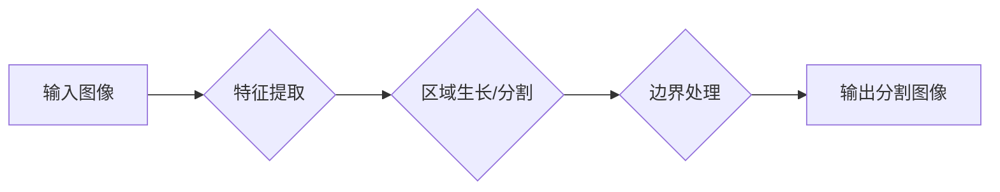

> OpenCV, 图像分割, 深度学习, 算法原理, 代码实现, 实际应用

## 1. 背景介绍

图像分割是计算机视觉领域的核心技术之一，它旨在将图像划分为多个相互独立的区域，每个区域包含具有相同或相似的特征的像素点。图像分割技术在众多领域有着广泛的应用，例如：

* **医学图像分析:** 用于识别和分割人体器官、肿瘤等，辅助医生进行诊断和治疗。
* **自动驾驶:** 用于识别道路、行人、车辆等，为自动驾驶系统提供感知能力。
* **机器人视觉:** 用于识别物体、场景，帮助机器人进行导航和操作。
* **遥感图像分析:** 用于识别地物类型、土地利用等，支持地理信息系统和环境监测。

传统的图像分割方法主要依赖于手工设计的特征和规则，但这些方法难以应对复杂图像场景的挑战。近年来，随着深度学习技术的快速发展，基于深度学习的图像分割方法取得了显著的进展，其性能和鲁棒性得到了大幅提升。

## 2. 核心概念与联系

图像分割的核心概念包括：

* **像素:** 图像的基本单位，每个像素代表图像中一个点的颜色或灰度值。
* **区域:** 图像中具有相同或相似的特征的像素点集合。
* **边界:** 区域之间的分界线。
* **特征:** 用于描述图像像素或区域的属性，例如颜色、纹理、形状等。

**架构流程图:**



## 3. 核心算法原理 & 具体操作步骤

### 3.1  算法原理概述

本文将介绍基于OpenCV的图像分割系统，主要采用**区域生长算法**和**阈值分割算法**。

* **区域生长算法:** 从种子点开始，根据像素之间的相似性，逐步扩展区域，直到满足终止条件。
* **阈值分割算法:** 根据图像像素的灰度值，将图像分割成前景和背景两部分。

### 3.2  算法步骤详解

**区域生长算法:**

1. **选择种子点:** 从图像中选择一个像素点作为种子点。
2. **相似性判断:** 对于种子点相邻的像素点，根据颜色、纹理等特征进行相似性判断。
3. **区域扩展:** 如果像素点与种子点相似，则将其加入到区域中。
4. **终止条件:** 当区域扩展到满足终止条件时，停止扩展。

**阈值分割算法:**

1. **选择阈值:** 根据图像的特性，选择一个合适的阈值。
2. **像素分类:** 将图像中的每个像素点根据其灰度值，分类为前景或背景。
3. **区域提取:** 将前景像素点连接起来，得到分割后的图像。

### 3.3  算法优缺点

**区域生长算法:**

* **优点:** 能够处理复杂图像场景，分割结果较为自然。
* **缺点:** 容易受到噪声和图像质量的影响，选择种子点对结果有较大影响。

**阈值分割算法:**

* **优点:** 简单易实现，计算速度快。
* **缺点:** 难以处理复杂图像场景，对图像的灰度分布要求较高。

### 3.4  算法应用领域

* **区域生长算法:** 用于医学图像分割、遥感图像分析等领域。
* **阈值分割算法:** 用于工业缺陷检测、文档图像分割等领域。

## 4. 数学模型和公式 & 详细讲解 & 举例说明

### 4.1  数学模型构建

**区域生长算法:**

* **相似性度量:** 使用欧氏距离、颜色差值等度量像素之间的相似性。

**阈值分割算法:**

* **灰度直方图:** 使用灰度直方图分析图像的灰度分布，选择合适的阈值。

### 4.2  公式推导过程

**欧氏距离:**

$$
d = \sqrt{(x_2 - x_1)^2 + (y_2 - y_1)^2}
$$

其中，$(x_1, y_1)$ 和 $(x_2, y_2)$ 分别是两个像素点的坐标。

**颜色差值:**

$$
C = \sqrt{(R_2 - R_1)^2 + (G_2 - G_1)^2 + (B_2 - B_1)^2}
$$

其中，$(R_1, G_1, B_1)$ 和 $(R_2, G_2, B_2)$ 分别是两个像素点的RGB颜色值。

### 4.3  案例分析与讲解

**区域生长算法:**

假设图像中有一个红色区域，我们可以选择一个红色像素点作为种子点，然后根据颜色相似性，逐步扩展区域，最终得到完整的红色区域。

**阈值分割算法:**

假设图像是一个黑白图像，我们可以根据灰度直方图分析，选择一个合适的阈值，将图像分割成前景和背景两部分。

## 5. 项目实践：代码实例和详细解释说明

### 5.1  开发环境搭建

* 操作系统: Ubuntu 20.04
* Python 版本: 3.8
* OpenCV 版本: 4.5.5

### 5.2  源代码详细实现

```python
import cv2
import numpy as np

# 读取图像
image = cv2.imread('image.jpg')

# 转换为灰度图像
gray = cv2.cvtColor(image, cv2.COLOR_BGR2GRAY)

# 阈值分割
ret, thresh = cv2.threshold(gray, 127, 255, cv2.THRESH_BINARY)

# 区域生长分割
# 选择种子点
seed_point = (100, 100)
# 设置相似性阈值
similarity_threshold = 10

# 区域生长分割
mask = np.zeros_like(image)
cv2.floodFill(mask, None, seed_point, 255)

# 显示分割结果
cv2.imshow('Original Image', image)
cv2.imshow('Threshold Segmentation', thresh)
cv2.imshow('Region Growing Segmentation', mask)
cv2.waitKey(0)
cv2.destroyAllWindows()
```

### 5.3  代码解读与分析

* **读取图像:** 使用 `cv2.imread()` 函数读取图像文件。
* **转换为灰度图像:** 使用 `cv2.cvtColor()` 函数将彩色图像转换为灰度图像。
* **阈值分割:** 使用 `cv2.threshold()` 函数对灰度图像进行阈值分割，将图像分割成前景和背景两部分。
* **区域生长分割:** 使用 `cv2.floodFill()` 函数进行区域生长分割，从种子点开始，根据相似性阈值扩展区域。
* **显示分割结果:** 使用 `cv2.imshow()` 函数显示分割结果。

### 5.4  运行结果展示

运行代码后，将显示原始图像、阈值分割结果和区域生长分割结果。

## 6. 实际应用场景

### 6.1  医学图像分析

* **肿瘤分割:** 用于识别和分割肿瘤区域，辅助医生进行诊断和治疗。
* **器官分割:** 用于分割人体器官，例如心脏、肺、肝脏等，用于医学研究和临床诊断。

### 6.2  自动驾驶

* **道路分割:** 用于识别道路区域，帮助自动驾驶系统规划路径。
* **行人检测:** 用于检测行人，避免自动驾驶车辆发生碰撞。

### 6.3  机器人视觉

* **物体识别:** 用于识别物体类型，帮助机器人进行抓取和操作。
* **场景理解:** 用于理解机器人周围的环境，帮助机器人进行导航和决策。

### 6.4  未来应用展望

随着深度学习技术的不断发展，基于深度学习的图像分割方法将更加智能化、自动化，在更多领域得到应用。例如：

* **智能医疗:** 用于辅助医生进行诊断、治疗和手术。
* **智能制造:** 用于自动检测缺陷、识别零件和进行机器人操作。
* **智能家居:** 用于识别家庭成员、控制家电和提供个性化服务。

## 7. 工具和资源推荐

### 7.1  学习资源推荐

* **书籍:**
    * "Computer Vision: Algorithms and Applications" by Richard Szeliski
    * "OpenCV 3 Computer Vision Application Programming Cookbook" by Satya Mallick
* **在线课程:**
    * Coursera: "Computer Vision" by Stanford University
    * Udacity: "Intro to Computer Vision"

### 7.2  开发工具推荐

* **OpenCV:** 一个开源的计算机视觉库，提供丰富的图像处理和分析功能。
* **Python:** 一个流行的编程语言，广泛用于计算机视觉开发。
* **PyTorch:** 一个开源的深度学习框架，支持图像分割任务。

### 7.3  相关论文推荐

* "Fully Convolutional Networks for Semantic Segmentation" by Long et al. (2015)
* "DeepLab: Semantic Image Segmentation with Deep Convolutional Nets, Atrous Convolution, and Fully Connected CRFs" by Chen et al. (2016)
* "Mask R-CNN" by He et al. (2017)

## 8. 总结：未来发展趋势与挑战

### 8.1  研究成果总结

基于OpenCV的图像分割系统能够有效地分割图像，并应用于多个领域。

### 8.2  未来发展趋势

* **更准确的分割结果:** 通过改进算法和模型，提高图像分割的准确性和鲁棒性。
* **更快的分割速度:** 通过优化算法和硬件加速，提高图像分割的速度。
* **更广泛的应用场景:** 将图像分割技术应用于更多领域，例如医疗、自动驾驶、机器人等。

### 8.3  面临的挑战

* **复杂图像场景:** 复杂图像场景下，图像分割仍然面临着挑战，例如遮挡、重叠、模糊等。
* **数据标注:** 深度学习模型需要大量的标注数据，数据标注成本高昂。
* **模型解释性:** 深度学习模型的决策过程难以解释，这限制了其在一些领域应用的推广。

### 8.4  研究展望

未来，图像分割研究将继续朝着更准确、更快速、更智能的方向发展。

## 9. 附录：常见问题与解答

* **Q1: 如何选择合适的阈值？**

* **A1:** 可以使用图像的灰度直方图分析，选择一个合适的阈值。

* **Q2: 如何处理复杂图像场景？**

* **A2:** 可以使用更复杂的分割算法，例如深度学习方法。

* **Q3: 如何提高分割速度？**

* **A3:** 可以使用硬件加速，例如GPU加速。


作者：禅与计算机程序设计艺术 / Zen and the Art of Computer Programming 
<end_of_turn>