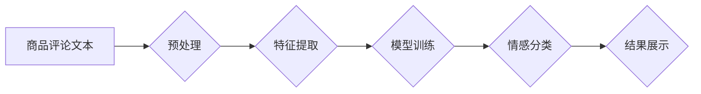

> 商品评论，情感分析，自然语言处理，Python，机器学习，深度学习，文本分类

## 1. 背景介绍

在当今数据爆炸的时代，商品评论文本作为消费者表达意见和体验的重要渠道，蕴藏着丰富的商业价值。通过对商品评论文本的情感分析，企业可以洞察消费者对产品的真实感受，及时了解市场趋势，改进产品质量，提升客户满意度。

传统的商品评论分析主要依赖人工标注和阅读，效率低下且容易产生主观偏差。随着人工智能技术的快速发展，基于机器学习和深度学习的文本情感分析方法逐渐成为主流，能够自动识别和分类文本的情感倾向，并提供更客观、更精准的分析结果。

## 2. 核心概念与联系

**2.1 自然语言处理 (NLP)**

自然语言处理 (NLP) 是人工智能的一个分支，旨在使计算机能够理解、处理和生成人类语言。文本情感分析的核心是利用 NLP 技术对商品评论文本进行分析。

**2.2 情感分析 (Sentiment Analysis)**

情感分析是指通过计算机程序自动识别文本中表达的情感倾向，并将其分类为正向、负向或中性。

**2.3 文本分类 (Text Classification)**

文本分类是将文本数据按照预定义的类别进行分类。情感分析本质上是一种文本分类任务，将评论文本分类为正向、负向或中性。

**2.4 机器学习 (Machine Learning)**

机器学习是人工智能的一种实现方式，通过训练模型学习数据中的规律，从而实现对新数据的预测和分类。

**2.5 深度学习 (Deep Learning)**

深度学习是机器学习的一个子领域，利用多层神经网络模拟人类大脑的学习过程，能够学习更复杂的特征，从而提高情感分析的准确率。

**2.6 流程图**



## 3. 核心算法原理 & 具体操作步骤

**3.1 算法原理概述**

文本情感分析算法通常包括以下步骤：

1. **文本预处理:** 清洗和格式化文本数据，去除停用词、标点符号等无用信息，并将文本转换为适合模型输入的格式。
2. **特征提取:** 从文本中提取情感相关的特征，例如单词、词组、语法结构等。
3. **模型训练:** 使用机器学习或深度学习算法训练模型，将提取的特征与情感标签进行关联，学习情感分类的规律。
4. **情感分类:** 将新文本输入到训练好的模型中，预测其情感倾向。

**3.2 算法步骤详解**

**3.2.1 文本预处理**

* **去除停用词:** 停用词是指一些常见的词语，例如“是”、“的”、“在”等，这些词语对情感分析没有太大意义，需要进行去除。
* **去除标点符号:** 标点符号例如“，”、“。”、“？”等，也需要进行去除，因为它们不会提供情感信息。
* **词干化:** 将词语还原到其基本形式，例如“跑步”和“跑”归为同一个词干。
* **分词:** 将文本分割成一个个独立的词语或短语。

**3.2.2 特征提取**

* **词袋模型 (Bag-of-Words):** 将文本表示为一个词语频率的向量，忽略词语的顺序。
* **TF-IDF:** 统计词语在整个文档集中的重要性，权重更高的词语对情感分析更有帮助。
* **Word2Vec:** 将词语映射到一个低维向量空间，捕捉词语之间的语义关系。
* **BERT:** 基于 Transformer 架构的预训练语言模型，能够学习更深层的语义特征。

**3.2.3 模型训练**

* **朴素贝叶斯:** 基于贝叶斯定理的分类算法，简单易用，但假设特征之间相互独立。
* **支持向量机 (SVM):** 通过寻找最佳的分隔超平面，将数据点分类。
* **随机森林:** 结合多个决策树，提高分类准确率。
* **深度学习:** 使用多层神经网络，例如卷积神经网络 (CNN) 和循环神经网络 (RNN)，学习更复杂的特征。

**3.3 算法优缺点**

不同的算法具有不同的优缺点，需要根据具体任务和数据特点选择合适的算法。

**3.4 算法应用领域**

文本情感分析算法广泛应用于以下领域：

* **电商:** 分析商品评论，了解消费者对产品的评价，改进产品质量。
* **社交媒体:** 分析用户对品牌、产品和事件的看法，了解市场趋势。
* **金融:** 分析市场情绪，预测股票价格走势。
* **医疗:** 分析患者对疾病和治疗方案的感受，提高医疗服务质量。

## 4. 数学模型和公式 & 详细讲解 & 举例说明

**4.1 数学模型构建**

文本情感分析模型通常采用分类模型，将文本分类为正向、负向或中性。

**4.2 公式推导过程**

假设我们使用朴素贝叶斯算法进行情感分析，其核心公式如下：

$$P(C|X) = \frac{P(X|C)P(C)}{P(X)}$$

其中：

* $P(C|X)$: 文本 $X$ 属于类别 $C$ 的概率。
* $P(X|C)$: 类别 $C$ 下文本 $X$ 的概率。
* $P(C)$: 类别 $C$ 的先验概率。
* $P(X)$: 文本 $X$ 的概率。

**4.3 案例分析与讲解**

假设我们有一个商品评论数据集，包含正向、负向和中性评论。我们可以使用朴素贝叶斯算法训练模型，学习每个类别下词语出现的概率。

例如，如果“很好”是正向评论中频繁出现的词语，那么 $P("很好"|正向)$ 会比较高。

当我们输入一个新的评论文本时，模型会根据每个词语在不同类别下的概率，计算出该文本属于每个类别的概率，并选择概率最高的类别作为最终预测结果。

## 5. 项目实践：代码实例和详细解释说明

**5.1 开发环境搭建**

* Python 3.x
* Jupyter Notebook
* NLTK
* Scikit-learn
* TensorFlow 或 PyTorch

**5.2 源代码详细实现**

```python
import nltk
from nltk.corpus import stopwords
from sklearn.feature_extraction.text import TfidfVectorizer
from sklearn.model_selection import train_test_split
from sklearn.naive_bayes import MultinomialNB
from sklearn.metrics import accuracy_score

# 下载停用词列表
nltk.download('stopwords')

# 加载商品评论数据集
data = [
    ("这件衣服真漂亮！", "正向"),
    ("质量很差，不推荐购买。", "负向"),
    ("还可以吧，价格比较实惠。", "中性"),
    # ...
]

# 文本预处理
def preprocess_text(text):
    # 1. 去除停用词
    stop_words = set(stopwords.words('english'))
    words = [word for word in text.split() if word not in stop_words]
    # 2. 词干化
    # ...
    # 3. 其他预处理步骤
    return " ".join(words)

# 特征提取
vectorizer = TfidfVectorizer()
X = [preprocess_text(text) for text, label in data]
y = [label for text, label in data]

# 数据分割
X_train, X_test, y_train, y_test = train_test_split(X, y, test_size=0.2)

# 模型训练
model = MultinomialNB()
model.fit(X_train, y_train)

# 模型预测
y_pred = model.predict(X_test)

# 评估模型性能
accuracy = accuracy_score(y_test, y_pred)
print(f"模型准确率: {accuracy}")

```

**5.3 代码解读与分析**

* 代码首先导入必要的库，并下载停用词列表。
* 然后加载商品评论数据集，并进行文本预处理，包括去除停用词、词干化等操作。
* 使用 TF-IDF 特征提取器将文本转换为数值向量。
* 将数据分割为训练集和测试集。
* 使用朴素贝叶斯算法训练模型。
* 使用训练好的模型对测试集进行预测，并计算模型准确率。

**5.4 运行结果展示**

运行代码后，会输出模型的准确率。

## 6. 实际应用场景

**6.1 电商平台**

电商平台可以利用文本情感分析技术分析用户对商品的评论，了解用户对商品的满意度，及时发现产品质量问题，并根据用户反馈改进产品。

**6.2 社交媒体监测**

社交媒体平台可以利用文本情感分析技术监测用户对品牌、产品和事件的看法，了解市场趋势，及时应对负面舆情。

**6.3 客户服务**

客户服务部门可以利用文本情感分析技术分析客户的反馈，识别客户的潜在问题，并提供更精准的解决方案。

**6.4 市场调研**

市场调研公司可以利用文本情感分析技术分析用户对产品的评价，了解市场需求，为企业提供决策支持。

**6.4 未来应用展望**

随着人工智能技术的不断发展，文本情感分析技术将应用于更多领域，例如：

* **个性化推荐:** 根据用户的评论情感，推荐更符合用户需求的产品。
* **自动客服:** 利用文本情感分析技术，开发更智能的自动客服系统，能够理解用户的需求，并提供更精准的回复。
* **情感营销:** 利用文本情感分析技术，进行情感营销，更好地与用户沟通，提升品牌形象。

## 7. 工具和资源推荐

**7.1 学习资源推荐**

* **书籍:**
    * 自然语言处理与情感分析
    * 深度学习
* **在线课程:**
    * Coursera: Natural Language Processing Specialization
    * edX: Deep Learning
* **博客:**
    * Jay Alammar's Blog
    * Analytics Vidhya

**7.2 开发工具推荐**

* **Python:** 
    * NLTK
    * SpaCy
    * Gensim
* **深度学习框架:**
    * TensorFlow
    * PyTorch
* **数据可视化工具:**
    * Matplotlib
    * Seaborn

**7.3 相关论文推荐**

* **Sentiment Analysis and Opinion Mining**
* **Deep Learning for Natural Language Processing**

## 8. 总结：未来发展趋势与挑战

**8.1 研究成果总结**

文本情感分析技术近年来取得了显著进展，模型准确率不断提高，应用场景也越来越广泛。

**8.2 未来发展趋势**

* **更深层的语义理解:** 研究更深层的语义关系，例如隐含情感、讽刺和幽默。
* **跨语言情感分析:** 研究跨语言情感分析，能够处理不同语言的文本数据。
* **多模态情感分析:** 将文本与其他模态数据，例如图像和音频，进行融合分析，获得更全面的情感信息。

**8.3 面临的挑战**

* **数据标注问题:** 高质量的标注数据是训练情感分析模型的关键，但数据标注成本高，效率低。
* **情感表达的多样性:** 人类情感表达非常丰富多样，难以用简单的分类模型完全捕捉。
* **对抗样本攻击:** 攻击者可以构造对抗样本，欺骗情感分析模型，导致模型预测错误。

**8.4 研究展望**

未来，文本情感分析技术将继续朝着更智能、更精准、更鲁棒的方向发展，为社会带来更多价值。

## 9. 附录：常见问题与解答

**9.1 如何选择合适的文本情感分析算法？**

选择合适的算法需要根据具体任务和数据特点进行