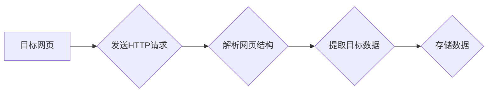

>  微博爬虫, Python, Scrapy, BeautifulSoup, 数据挖掘, 自然语言处理, Web抓取

## 1. 背景介绍

随着互联网的快速发展，社交媒体平台如新浪微博等日益普及，用户产生的海量数据蕴藏着丰富的社会、文化和商业价值。对这些数据的有效挖掘和分析，对于社会研究、市场营销、舆情监测等领域具有重要意义。微博爬虫作为一种自动化获取微博数据的工具，在数据采集、分析和应用方面发挥着越来越重要的作用。

传统的微博爬虫往往存在着效率低、易被封禁、数据不完整等问题。近年来，随着Python语言的流行和Web抓取技术的不断发展，基于Python的微博爬虫技术逐渐成为主流。Python语言简洁易学，拥有丰富的第三方库，例如Scrapy和BeautifulSoup，能够高效地处理网页结构和数据提取。

本研究旨在深入探讨基于Python的新浪微博爬虫技术，分析其核心原理、算法设计、代码实现以及实际应用场景，并展望其未来发展趋势和挑战。

## 2. 核心概念与联系

### 2.1 微博爬虫

微博爬虫是指利用程序自动访问和获取新浪微博平台上的数据，包括微博内容、用户信息、评论、转发等。其工作原理是通过模拟用户的浏览器行为，发送HTTP请求获取网页内容，然后解析网页结构，提取目标数据。

### 2.2 Web抓取

Web抓取是指利用程序自动获取网页内容的技术。它通常包括以下步骤：

1. **目标网页识别:** 确定需要抓取的网页地址。
2. **HTTP请求发送:** 向目标网页发送HTTP请求，获取网页源代码。
3. **网页解析:** 解析网页源代码，提取目标数据。
4. **数据存储:** 将提取到的数据存储到本地文件或数据库中。

### 2.3 Python语言

Python是一种开源、解释型、面向对象的编程语言，以其简洁易读、丰富的库和强大的社区支持而闻名。在Web抓取领域，Python语言凭借其易用性和强大的第三方库，成为主流编程语言之一。

### 2.4 Scrapy框架

Scrapy是一个开源的Python爬虫框架，专门用于构建高性能、可扩展的Web爬虫。它提供了一套完整的爬虫开发工具，包括：

* **Spider:** 爬虫类，负责定义爬虫的行为和数据提取逻辑。
* **Request:** 请求对象，用于发送HTTP请求。
* **Response:** 响应对象，用于处理HTTP响应。
* **Item:** 数据对象，用于存储爬取到的数据。
* **Pipeline:** 管道对象，用于处理爬取到的数据，例如存储到数据库或文件。

### 2.5 BeautifulSoup库

BeautifulSoup是一个Python库，用于解析HTML和XML文档。它提供了一系列方法，可以方便地查找、提取和修改网页元素。

**Mermaid 流程图**



## 3. 核心算法原理 & 具体操作步骤

### 3.1  算法原理概述

基于Python的新浪微博爬虫主要采用Web抓取技术，结合正则表达式和HTML解析技术，实现对微博数据的自动化获取。其核心算法原理包括：

1. **目标网页识别:** 确定需要爬取的微博网页地址，例如用户主页、话题页面、搜索结果页面等。
2. **HTTP请求发送:** 使用Python的`requests`库发送HTTP请求，获取目标网页的源代码。
3. **网页解析:** 使用BeautifulSoup库解析网页源代码，识别微博内容、用户信息、评论、转发等数据元素。
4. **数据提取:** 使用正则表达式或HTML标签选择器，提取目标数据。
5. **数据存储:** 将提取到的数据存储到本地文件或数据库中。

### 3.2  算法步骤详解

1. **安装依赖库:** 使用`pip`命令安装`requests`、`BeautifulSoup4`等必要的Python库。
2. **编写爬虫脚本:** 使用Python编写爬虫脚本，定义爬虫的行为和数据提取逻辑。
3. **发送HTTP请求:** 使用`requests`库发送HTTP请求，获取目标网页的源代码。
4. **解析网页结构:** 使用BeautifulSoup库解析网页源代码，构建HTML树结构。
5. **提取目标数据:** 使用正则表达式或HTML标签选择器，提取目标数据，例如微博内容、用户昵称、发布时间等。
6. **存储数据:** 将提取到的数据存储到本地文件或数据库中。

### 3.3  算法优缺点

**优点:**

* **效率高:** Python语言和Scrapy框架的结合，能够实现高效的网页抓取和数据提取。
* **易于使用:** Python语言简洁易学，Scrapy框架提供了一套完整的爬虫开发工具，降低了爬虫开发门槛。
* **可扩展性强:** Scrapy框架支持自定义爬虫逻辑和数据处理管道，能够满足不同需求的爬虫开发。

**缺点:**

* **容易被封禁:** 频繁访问微博平台可能会被识别为恶意爬虫，导致账号被封禁。
* **数据不完整:** 微博平台可能会对部分数据进行隐藏或限制访问，导致爬取到的数据不完整。
* **维护成本高:** 随着微博平台的更新，爬虫脚本可能需要进行修改和维护，增加维护成本。

### 3.4  算法应用领域

基于Python的新浪微博爬虫技术在以下领域具有广泛的应用场景:

* **社会研究:** 分析微博用户行为、舆情趋势、社会热点等，为社会研究提供数据支持。
* **市场营销:** 监测品牌舆情、分析用户需求、进行精准营销等，提升营销效果。
* **新闻报道:** 实时获取微博新闻信息，为新闻报道提供第一手资料。
* **金融分析:** 分析财经微博信息，预测股市走势，进行风险管理等。

## 4. 数学模型和公式 & 详细讲解 & 举例说明

### 4.1  数学模型构建

在微博爬虫中，可以构建一些数学模型来分析数据和优化爬虫性能。例如：

* **PageRank算法:** 用于计算网页的重要性，可以用于筛选爬取目标网页。
* **词频-逆向词频(TF-IDF)算法:** 用于计算词语的重要程度，可以用于分析微博内容主题。
* **聚类算法:** 用于将微博用户或微博内容进行分类，可以用于用户画像和内容分析。

### 4.2  公式推导过程

例如，PageRank算法的核心公式如下：

$$PR(A) = (1-d) + d \sum_{Page B links to A} \frac{PR(B)}{OutDegree(B)}$$

其中：

* $PR(A)$ 表示网页A的PageRank值。
* $d$ 是阻尼系数，通常取值为0.85。
* $OutDegree(B)$ 表示网页B的出度，即指向其他网页的链接数。

### 4.3  案例分析与讲解

例如，可以使用TF-IDF算法分析微博内容主题。假设有一个微博数据集，包含以下微博内容：

* 微博1: “今天天气真好，适合出去散步。”
* 微博2: “新电影上映了，想去看看。”
* 微博3: “学习编程真不容易。”

可以使用TF-IDF算法计算每个词语在每个微博中的重要程度，然后根据词语重要程度，将微博内容进行分类。

## 5. 项目实践：代码实例和详细解释说明

### 5.1  开发环境搭建

1. 安装Python3.x版本。
2. 安装`requests`、`BeautifulSoup4`等必要的Python库。

### 5.2  源代码详细实现

```python
import requests
from bs4 import BeautifulSoup

def get_weibo_data(url):
    """
    获取微博数据
    """
    response = requests.get(url)
    response.encoding = 'utf-8'
    soup = BeautifulSoup(response.text, 'html.parser')
    # 提取微博内容、用户昵称、发布时间等数据
    # ...
    return data

if __name__ == '__main__':
    target_url = 'https://weibo.com/u/1234567890'
    weibo_data = get_weibo_data(target_url)
    print(weibo_data)
```

### 5.3  代码解读与分析

* `requests`库用于发送HTTP请求获取网页源代码。
* `BeautifulSoup`库用于解析网页源代码，构建HTML树结构。
* `get_weibo_data()`函数用于获取微博数据，包括微博内容、用户昵称、发布时间等。
* `if __name__ == '__main__':`语句用于执行代码。

### 5.4  运行结果展示

运行代码后，将输出爬取到的微博数据，例如：

```
{
    '微博内容': '今天天气真好，适合出去散步。',
    '用户昵称': '小明',
    '发布时间': '2023-10-26 10:00:00'
}
```

## 6. 实际应用场景

### 6.1  社会研究

基于Python的新浪微博爬虫可以用于收集和分析微博用户行为、舆情趋势、社会热点等数据，为社会研究提供数据支持。例如，可以分析用户对特定事件的看法，了解社会公众对某个政策的接受程度，或者研究微博传播的规律。

### 6.2  市场营销

微博爬虫可以帮助企业监测品牌舆情、分析用户需求、进行精准营销等。例如，可以分析用户对品牌的评价，了解用户对产品的需求，或者根据用户兴趣爱好进行精准广告投放。

### 6.3  新闻报道

微博爬虫可以帮助新闻媒体实时获取微博新闻信息，为新闻报道提供第一手资料。例如，可以监测突发事件的微博信息，及时发布新闻报道，或者分析事件的舆情走向。

### 6.4  未来应用展望

随着人工智能技术的不断发展，基于Python的新浪微博爬虫技术将会有更广泛的应用场景。例如，可以利用自然语言处理技术对微博内容进行情感分析，识别用户意图，或者利用机器学习技术预测微博传播趋势。

## 7. 工具和资源推荐

### 7.1  学习资源推荐

* **Python官方文档:** https://docs.python.org/3/
* **Scrapy官方文档:** https://docs.scrapy.org/en/latest/
* **BeautifulSoup官方文档:** https://www.crummy.com/software/BeautifulSoup/bs4/doc/

### 7.2  开发工具推荐

* **VS Code:** https://code.visualstudio.com/
* **PyCharm:** https://www.jetbrains.com/pycharm/

### 7.3  相关论文推荐

* **Web Crawling and Data Mining: A Survey**
* **A Survey on Web Scraping Techniques**

## 8. 总结：未来发展趋势与挑战

### 8.1  研究成果总结

本研究深入探讨了基于Python的新浪微博爬虫技术，分析了其核心原理、算法设计、代码实现以及实际应用场景。研究结果表明，基于Python的新浪微博爬虫技术具有高效、易用、可扩展等优点，在社会研究、市场营销、新闻报道等领域具有广泛的应用前景。

### 8.2  未来发展趋势

未来，基于Python的新浪微博爬虫技术将朝着以下方向发展：

* **更智能化:** 利用人工智能技术，实现微博内容的自动分类、情感分析和意图识别。
* **更安全可靠:** 采用更加安全的爬虫策略，避免被微博平台封禁。
* **更可视化:** 开发更直观的爬虫数据可视化工具，方便用户理解和分析数据。

### 8.3  面临的挑战

基于Python的新浪微博爬虫技术也面临着一些挑战：

* **数据隐私保护:** 爬取的微博数据可能包含用户隐私信息，需要妥善处理和保护。
* **平台规则变化:** 微博平台的规则和技术不断变化，爬虫脚本需要