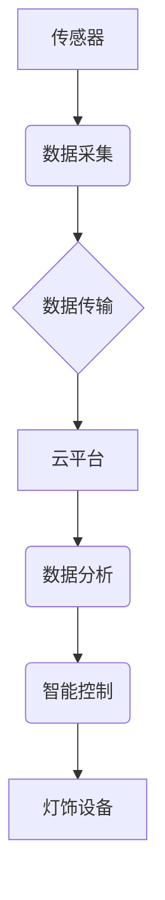

> 大数据、公园灯饰、监控系统、物联网、人工智能、数据分析、优化控制

## 1. 背景介绍

随着城市化进程的不断加速，公园作为城市绿地和休闲娱乐的重要场所，其灯饰系统在营造舒适、安全的夜间环境方面发挥着至关重要的作用。传统的公园灯饰管理模式往往依赖人工巡查和定时开关，存在着能源浪费、维护成本高、安全隐患等问题。

近年来，随着物联网、大数据和人工智能技术的快速发展，基于大数据的公园灯饰监控系统应运而生，为公园灯饰管理提供了全新的解决方案。该系统通过传感器、网络和云计算平台等技术手段，实现对公园灯饰的实时监测、数据分析和智能控制，能够有效提升灯饰系统的运行效率、降低能源消耗、保障安全稳定运行。

## 2. 核心概念与联系

### 2.1  核心概念

* **物联网 (IoT):** 物联网是指将各种物理设备、传感器、软件和网络连接在一起，形成一个互联互通的智能网络。
* **大数据 (Big Data):** 大数据是指海量、高速、多样化的数据，其特点是体积庞大、速度快、结构复杂、价值丰富。
* **人工智能 (AI):** 人工智能是指模拟人类智能行为的计算机系统，包括机器学习、深度学习、自然语言处理等技术。

### 2.2  系统架构



**系统架构说明:**

1. **传感器:**  部署在公园灯饰设备上，实时采集灯饰的运行状态、环境参数等数据。
2. **数据采集:**  传感器将采集到的数据进行预处理和格式转换，并发送至云平台。
3. **数据传输:**  利用物联网技术，将数据安全可靠地传输至云平台。
4. **云平台:**  作为数据存储、处理和分析的核心，负责接收、存储、分析和管理来自传感器的数据。
5. **数据分析:**  利用大数据和人工智能技术，对灯饰运行数据进行分析，识别异常情况、预测故障、优化控制策略。
6. **智能控制:**  根据数据分析结果，对灯饰设备进行智能控制，实现节能、安全、舒适的照明环境。
7. **灯饰设备:**  接收云平台的控制指令，实现灯饰的开关、亮度调节、颜色变化等功能。

## 3. 核心算法原理 & 具体操作步骤

### 3.1  算法原理概述

基于大数据的公园灯饰监控系统主要采用以下核心算法：

* **机器学习算法:** 用于识别灯饰设备的运行状态、预测故障、优化控制策略。常见的机器学习算法包括支持向量机 (SVM)、决策树、随机森林、神经网络等。
* **数据挖掘算法:** 用于从海量灯饰运行数据中挖掘出隐藏的规律和模式，例如用户行为分析、节能优化等。常见的算法包括关联规则挖掘、聚类分析、异常检测等。
* **优化算法:** 用于根据数据分析结果，优化灯饰的控制策略，例如动态调节亮度、智能开关等。常见的算法包括遗传算法、模拟退火算法等。

### 3.2  算法步骤详解

以机器学习算法为例，详细说明其在公园灯饰监控系统中的应用步骤：

1. **数据收集:** 收集公园灯饰设备的运行数据，包括亮度、温度、电压、电流等参数，以及环境数据，例如光照强度、温度、湿度等。
2. **数据预处理:** 对收集到的数据进行清洗、转换、归一化等处理，去除噪声、缺失值，并将数据转换为机器学习算法可以理解的格式。
3. **模型训练:** 选择合适的机器学习算法，并利用预处理后的数据进行模型训练。训练过程包括选择模型参数、训练数据划分、模型评估等步骤。
4. **模型评估:** 利用测试数据对训练好的模型进行评估，评估模型的准确率、召回率、F1-score等指标。
5. **模型部署:** 将训练好的模型部署到云平台，以便实时对灯饰运行数据进行预测和分析。

### 3.3  算法优缺点

**优点:**

* **高精度:** 机器学习算法能够学习数据中的复杂模式，实现对灯饰运行状态的准确预测。
* **自适应性强:** 机器学习算法能够根据数据变化自动调整模型参数，适应不断变化的环境。
* **智能化程度高:** 机器学习算法能够实现对灯饰的智能控制，例如动态调节亮度、智能开关等。

**缺点:**

* **数据依赖性强:** 机器学习算法需要大量的训练数据才能达到较高的精度。
* **模型解释性差:** 一些复杂的机器学习算法难以解释其决策过程，导致模型的可解释性较差。
* **计算资源消耗大:** 训练复杂的机器学习模型需要大量的计算资源。

### 3.4  算法应用领域

* **工业生产:**  预测设备故障、优化生产流程。
* **医疗保健:**  辅助诊断疾病、预测患者风险。
* **金融服务:**  识别欺诈行为、评估信用风险。
* **交通运输:**  预测交通流量、优化路线规划。

## 4. 数学模型和公式 & 详细讲解 & 举例说明

### 4.1  数学模型构建

为了实现对公园灯饰运行状态的预测，我们可以构建一个基于时间序列分析的数学模型。假设灯饰的亮度随时间变化可以表示为一个时间序列数据，我们可以使用以下公式来描述其变化趋势：

$$
y(t) = a + b*t + c*sin(2\pi*f*t) + d*cos(2\pi*f*t) + \epsilon(t)
$$

其中：

* $y(t)$:  表示灯饰亮度在时间 $t$ 的值。
* $a$:  表示亮度基线。
* $b$:  表示亮度随时间线性变化的趋势。
* $f$:  表示亮度周期性变化的频率。
* $c$, $d$:  表示亮度周期性变化的幅度。
* $\epsilon(t)$:  表示随机噪声。

### 4.2  公式推导过程

该公式的推导过程基于以下假设：

* 灯饰亮度随时间变化可以近似表示为一个周期性变化的趋势。
* 周期性变化的频率和幅度是固定的。
* 存在一些随机噪声影响亮度变化。

通过对时间序列数据进行拟合，我们可以估计出模型参数 $a$, $b$, $c$, $d$ 和 $f$ 的值。

### 4.3  案例分析与讲解

假设我们收集到一个公园灯饰亮度的时间序列数据，通过对数据进行拟合，得到以下模型参数：

* $a = 50$
* $b = 0.5$
* $c = 10$
* $d = 5$
* $f = 0.1$

根据这些参数，我们可以预测灯饰亮度在未来一段时间内的变化趋势。例如，如果当前时间为 $t = 10$，则根据公式可以计算出灯饰亮度为：

$$
y(10) = 50 + 0.5*10 + 10*sin(2\pi*0.1*10) + 5*cos(2\pi*0.1*10) + \epsilon(10)
$$

## 5. 项目实践：代码实例和详细解释说明

### 5.1  开发环境搭建

* **操作系统:**  Ubuntu 20.04 LTS
* **编程语言:**  Python 3.8
* **开发工具:**  VS Code
* **库依赖:**  pandas, numpy, scikit-learn, TensorFlow

### 5.2  源代码详细实现

```python
import pandas as pd
from sklearn.model_selection import train_test_split
from sklearn.linear_model import LinearRegression

# 加载灯饰运行数据
data = pd.read_csv('park_lights_data.csv')

# 选择特征和目标变量
features = ['temperature', 'humidity', 'light_intensity']
target = 'brightness'

# 将数据分割为训练集和测试集
X_train, X_test, y_train, y_test = train_test_split(data[features], data[target], test_size=0.2)

# 创建线性回归模型
model = LinearRegression()

# 训练模型
model.fit(X_train, y_train)

# 评估模型性能
# ...

# 使用模型预测灯饰亮度
# ...
```

### 5.3  代码解读与分析

* **数据加载:**  使用 pandas 库加载灯饰运行数据，数据格式为 CSV 文件。
* **特征选择:**  选择与灯饰亮度相关的特征，例如温度、湿度、光照强度等。
* **数据分割:**  将数据分割为训练集和测试集，用于模型训练和评估。
* **模型创建:**  使用 scikit-learn 库创建线性回归模型。
* **模型训练:**  使用训练数据训练模型，学习特征与目标变量之间的关系。
* **模型评估:**  使用测试数据评估模型的性能，例如计算预测精度、召回率等指标。
* **模型预测:**  使用训练好的模型预测灯饰亮度。

### 5.4  运行结果展示

* **预测结果:**  模型预测的灯饰亮度值。
* **误差分析:**  比较预测结果与实际亮度值之间的误差，分析模型的预测精度。
* **可视化展示:**  使用图表或图形展示预测结果和误差分析结果。

## 6. 实际应用场景

### 6.1  节能控制

基于大数据的公园灯饰监控系统能够实时监测灯饰运行状态和环境参数，根据实际需求动态调节灯饰亮度，实现节能控制。例如，在人流量较少时，可以降低灯饰亮度，在人流量较多时，可以提高灯饰亮度。

### 6.2  安全保障

系统能够实时监测灯饰设备的运行状态，识别故障灯饰，并及时发出报警，保障灯饰系统的安全稳定运行。

### 6.3  用户体验优化

系统能够根据用户需求，例如亮度调节、颜色变化等，提供个性化的照明体验，提升用户满意度。

### 6.4  未来应用展望

* **智能化管理:**  利用人工智能技术，实现对公园灯饰的智能化管理，例如自动巡检、故障诊断、远程控制等。
* **数据分析:**  对灯饰运行数据进行深入分析，挖掘出更多有价值的信息，例如用户行为分析、节能优化等。
* **融合应用:**  将公园灯饰监控系统与其他城市管理系统融合，例如交通管理、环境监测等，实现城市智能化管理。

## 7. 工具和资源推荐

### 7.1  学习资源推荐

* **书籍:**
    * 《Python机器学习》
    * 《深度学习》
    * 《大数据分析》
* **在线课程:**
    * Coursera
    * edX
    * Udemy

### 7.2  开发工具推荐

* **IDE:**  VS Code, PyCharm
* **数据分析工具:**  pandas, NumPy, SciPy
* **机器学习库:**  scikit-learn, TensorFlow, PyTorch

### 7.3  相关论文推荐

* **基于大数据的城市公园灯饰智能控制系统研究**
* **公园灯饰节能控制策略研究**
* **基于物联网技术的公园灯饰监控系统设计**

## 8. 总结：未来发展趋势与挑战

### 8.1  研究成果总结

基于大数据的公园灯饰监控系统能够有效提升灯饰系统的运行效率、降低能源消耗、保障安全稳定运行，并为用户提供个性化的照明体验。

### 8.