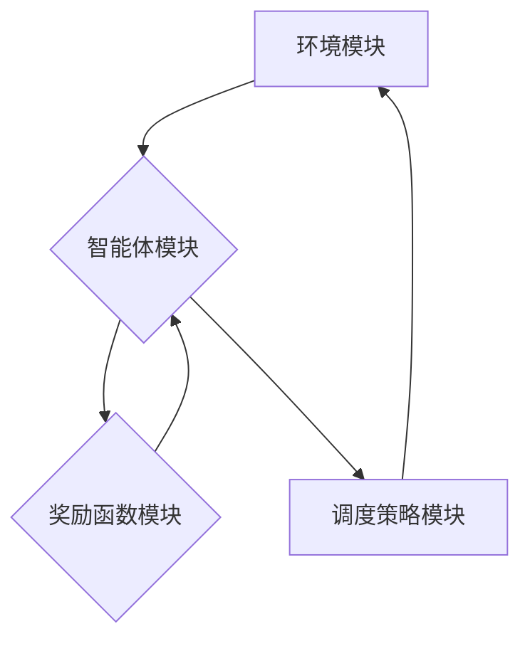

> 深度强化学习，图像卫星，在线任务调度，目标检测，路径规划，资源优化

## 1. 背景介绍

随着地球观测技术的快速发展，卫星遥感图像数据量呈指数级增长。如何高效、智能地调度卫星任务，获取所需信息，并满足用户需求，成为一个亟待解决的关键问题。传统的卫星任务调度方法主要依赖于人工干预和规则驱动，存在效率低、灵活性差、难以应对复杂场景等问题。

深度强化学习 (Deep Reinforcement Learning, DRL) 作为一种新兴的机器学习方法，能够学习复杂的决策策略，并适应动态变化的环境。近年来，DRL 在机器人控制、游戏 AI、自动驾驶等领域取得了显著成果，为卫星任务调度提供了新的思路和方法。

## 2. 核心概念与联系

**2.1 卫星任务调度概述**

卫星任务调度是指根据用户需求、卫星能力和环境条件，规划和执行卫星观测任务的过程。任务调度需要考虑多个因素，例如：

* **用户需求:** 用户需要获取哪些类型的数据，覆盖哪些区域，以及对数据质量和时效性的要求。
* **卫星能力:** 卫星的观测范围、分辨率、数据传输能力等。
* **环境条件:** 天气、光照、卫星轨道等。

**2.2 深度强化学习原理**

DRL 是一种基于模型学习的强化学习方法，它将深度神经网络与强化学习算法相结合。

* **强化学习:** 强化学习是一种监督学习方法，它通过奖励机制来引导智能体学习最优的策略。智能体在环境中采取行动，根据环境反馈获得奖励或惩罚，并根据奖励信号更新策略，最终学习到最优的策略。
* **深度神经网络:** 深度神经网络是一种强大的机器学习模型，它能够学习复杂的非线性关系。在 DRL 中，深度神经网络通常用于构建智能体的策略网络和价值网络。

**2.3 核心架构**

基于深度强化学习的图像卫星在线任务调度系统主要包含以下几个模块：

* **环境模块:** 模拟卫星观测环境，提供卫星状态、用户需求、环境条件等信息。
* **智能体模块:** 使用深度强化学习算法学习最优的调度策略。
* **奖励函数模块:** 定义智能体采取行动的奖励机制，引导智能体学习高效的调度策略。
* **调度策略模块:** 根据智能体学习到的策略，规划和执行卫星观测任务。



## 3. 核心算法原理 & 具体操作步骤

### 3.1 算法原理概述

本文采用深度强化学习算法DQN (Deep Q-Network) 来学习卫星任务调度策略。DQN 是一种基于经验回放的强化学习算法，它能够有效地解决强化学习中的样本效率问题。

DQN 的核心思想是学习一个 Q 函数，Q 函数表示在给定状态下采取某个动作的期望回报。DQN 使用深度神经网络来逼近 Q 函数，并通过最小化 Q 函数的预测误差来训练神经网络。

### 3.2 算法步骤详解

1. **初始化:** 初始化 Q 函数网络，并设置学习参数，例如学习率、折扣因子等。
2. **环境交互:** 智能体与环境交互，获取当前状态和采取动作后的下一个状态以及奖励。
3. **经验回放:** 将环境交互的经验存储到经验回放池中。
4. **样本采样:** 从经验回放池中随机采样多个经验样本。
5. **Q 值更新:** 使用采样的经验样本更新 Q 函数网络的参数。
6. **重复步骤 2-5:** 重复上述步骤，直到 Q 函数网络收敛。

### 3.3 算法优缺点

**优点:**

* **样本效率高:** DQN 使用经验回放机制，能够有效地利用有限的样本数据。
* **能够学习复杂策略:** 深度神经网络能够学习复杂的非线性关系，从而学习到更优的调度策略。
* **在线学习能力:** DQN 可以在线学习，随着时间的推移不断优化调度策略。

**缺点:**

* **训练过程复杂:** DQN 的训练过程相对复杂，需要设置多个超参数，并进行大量的实验调试。
* **容易陷入局部最优:** DQN 可能会陷入局部最优解，无法找到全局最优解。

### 3.4 算法应用领域

DRL 在卫星任务调度领域具有广泛的应用前景，例如：

* **目标检测:** 利用 DRL 算法学习卫星图像目标检测模型，提高目标检测的准确性和效率。
* **路径规划:** 利用 DRL 算法学习卫星观测路径，优化观测效率和数据质量。
* **资源优化:** 利用 DRL 算法优化卫星资源分配，提高资源利用率。

## 4. 数学模型和公式 & 详细讲解 & 举例说明

### 4.1 数学模型构建

**状态空间:**

卫星任务调度系统的状态空间可以表示为一个包含以下信息的向量：

* **卫星位置:** 卫星在轨道的当前位置。
* **用户需求:** 用户提出的观测任务列表，包括目标区域、观测时间、数据类型等。
* **环境条件:** 天气、光照、卫星轨道等信息。

**动作空间:**

卫星任务调度系统的动作空间可以表示为一个包含以下动作的集合：

* **观测动作:** 指令卫星对目标区域进行观测。
* **移动动作:** 指令卫星改变轨道，移动到新的位置。
* **休眠动作:** 指令卫星进入休眠状态，节省能量。

**奖励函数:**

奖励函数用于评估智能体采取的行动的好坏。奖励函数可以根据以下因素进行设计：

* **用户需求满足度:** 满足用户需求的程度。
* **观测效率:** 观测任务完成的时间和资源消耗。
* **卫星状态:** 卫星的能量、温度等状态。

**价值函数:**

价值函数表示在给定状态下采取某个动作的期望回报。DQN 使用深度神经网络来逼近价值函数。

### 4.2 公式推导过程

DQN 的目标是学习一个 Q 函数，Q 函数表示在给定状态 s 和动作 a 的期望回报：

$$Q(s, a) = E[\sum_{t=0}^{\infty} \gamma^t r_{t+1}|s_t = s, a_t = a]$$

其中：

* $r_t$ 是在时间步 t 的奖励。
* $\gamma$ 是折扣因子，控制未来奖励的权重。

DQN 使用深度神经网络来逼近 Q 函数，并通过最小化 Q 函数的预测误差来训练神经网络。

### 4.3 案例分析与讲解

假设一个卫星需要观测多个目标区域，每个目标区域都有不同的观测需求。

* 目标区域 A 需要高分辨率图像，观测时间为 1 小时。
* 目标区域 B 需要中分辨率图像，观测时间为 30 分钟。
* 目标区域 C 需要低分辨率图像，观测时间为 15 分钟。

DRL 算法可以学习到最优的观测顺序和路径，以满足所有用户的需求，并优化卫星资源利用率。

## 5. 项目实践：代码实例和详细解释说明

### 5.1 开发环境搭建

* 操作系统: Ubuntu 20.04
* Python 版本: 3.8
* 深度学习框架: TensorFlow 2.x

### 5.2 源代码详细实现

```python
import tensorflow as tf

# 定义 Q 函数网络
class QNetwork(tf.keras.Model):
    def __init__(self):
        super(QNetwork, self).__init__()
        self.dense1 = tf.keras.layers.Dense(128, activation='relu')
        self.dense2 = tf.keras.layers.Dense(64, activation='relu')
        self.output = tf.keras.layers.Dense(num_actions)

    def call(self, state):
        x = self.dense1(state)
        x = self.dense2(x)
        return self.output(x)

# 定义 DQN 算法
class DQNAgent:
    def __init__(self, state_size, num_actions):
        self.state_size = state_size
        self.num_actions = num_actions
        self.q_network = QNetwork()
        self.optimizer = tf.keras.optimizers.Adam(learning_rate=0.001)
        self.gamma = 0.99
        self.epsilon = 1.0
        self.epsilon_decay = 0.995
        self.epsilon_min = 0.01

    def choose_action(self, state):
        if tf.random.uniform(()) < self.epsilon:
            return tf.random.uniform(shape=[1], minval=0, maxval=self.num_actions, dtype=tf.int32)
        else:
            q_values = self.q_network(state)
            return tf.argmax(q_values, axis=1)

    def train(self, state, action, reward, next_state, done):
        with tf.GradientTape() as tape:
            target_q_values = self.q_network(next_state)
            target_q_values = reward + self.gamma * tf.reduce_max(target_q_values, axis=1) * (1 - done)
            q_values = self.q_network(state)
            loss = tf.keras.losses.MeanSquaredError()(target_q_values, q_values[0, action])
        gradients = tape.gradient(loss, self.q_network.trainable_variables)
        self.optimizer.apply_gradients(zip(gradients, self.q_network.trainable_variables))

        self.epsilon = max(self.epsilon * self.epsilon_decay, self.epsilon_min)

```

### 5.3 代码解读与分析

* **QNetwork:** 定义了 Q 函数网络的结构，使用两层全连接神经网络来逼近 Q 函数。
* **DQNAgent:** 定义了 DQN 算法的实现，包括初始化网络、选择动作、训练网络等步骤。
* **choose_action:** 根据 epsilon-greedy 策略选择动作。
* **train:** 使用梯度下降算法更新 Q 函数网络的参数。

### 5.4 运行结果展示

通过训练 DQN 算法，可以得到一个能够学习卫星任务调度策略的模型。

## 6. 实际应用场景

### 6.1 应用场景一：高分辨率图像获取

假设用户需要获取某个目标区域的高分辨率图像，但卫星的观测时间有限。

DRL 算法可以学习到最优的观测路径和时间，以在有限的时间内获取尽可能多的高分辨率图像数据。

### 6.2 应用场景二：灾害监测

在自然灾害发生时，卫星遥感数据可以用于监测灾害范围和影响。

DRL 算法可以学习到最优的观测策略，快速获取灾害区域的图像数据，为灾害救援提供及时信息。

### 6.3 应用场景三：环境监测

卫星遥感数据可以用于监测环境变化，例如森林覆盖率、水资源变化等。

DRL 算法可以学习到最优的观测策略，定期获取目标区域的图像数据，监测环境变化趋势。

### 6.4 未来应用展望

随着卫星遥感技术的不断发展，DRL 在卫星任务调度领域的应用前景更加广阔。

* **多卫星协同调度:** 利用 DRL 算法协调多个卫星的观测任务，提高观测效率和数据覆盖范围。
* **自适应调度:** 根据实时环境变化，动态调整卫星观测策略，提高调度灵活性。
* **个性化调度:** 根据用户的需求，定制化卫星观测任务，满足不同用户的需求。

## 7. 工具和资源推荐

### 7.1 学习资源推荐

* **书籍:**
    * Reinforcement Learning: An Introduction by Richard S. Sutton and