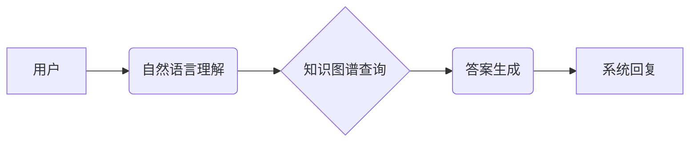

> 知识图谱、对话系统、问答系统、自然语言处理、机器学习、深度学习

## 1. 背景介绍

随着人工智能技术的飞速发展，对话系统和问答系统已经成为人们生活中不可或缺的一部分。传统的问答系统主要依赖于关键词匹配和规则匹配，难以理解用户复杂的需求，且缺乏知识的丰富性和可扩展性。知识图谱作为一种新型的知识表示形式，能够有效地存储和组织大量结构化知识，为对话问答系统提供了新的思路和可能性。

基于知识图谱的对话问答系统能够更好地理解用户意图，从知识图谱中获取相关信息，并以自然语言形式进行回答。这种系统具有以下优势：

* **更准确的理解用户意图:** 知识图谱能够提供丰富的语义信息，帮助系统更准确地理解用户的意图和需求。
* **更丰富的知识库:** 知识图谱可以存储和组织大量的结构化知识，为系统提供更丰富的知识库，从而提高回答的准确性和完整性。
* **更好的可扩展性:** 知识图谱是一种可扩展的知识表示形式，可以方便地添加新的知识和关系，从而使系统能够适应不断变化的知识环境。

## 2. 核心概念与联系

### 2.1 知识图谱

知识图谱是一种基于知识表示的数据库，它以实体和关系为基本单元，将知识以图的形式进行表示。知识图谱中的实体代表现实世界中的事物，关系代表实体之间的联系。

### 2.2 对话系统

对话系统是一种能够与人类进行自然语言交互的计算机系统。对话系统通常由以下几个模块组成：

* **自然语言理解 (NLU):** 负责理解用户的输入，提取关键信息。
* **对话管理 (DM):** 负责控制对话流程，根据用户的输入做出相应的回应。
* **自然语言生成 (NLG):** 负责生成自然语言的输出，与用户进行交流。

### 2.3 问答系统

问答系统是一种能够回答用户问题的计算机系统。问答系统通常由以下几个模块组成：

* **问题理解:** 负责理解用户的提问，提取关键信息。
* **知识检索:** 负责从知识库中检索相关信息。
* **答案生成:** 负责生成自然语言的答案，并返回给用户。

### 2.4 知识图谱与对话问答系统的联系

基于知识图谱的对话问答系统将知识图谱与对话系统和问答系统的优势结合起来，能够实现更智能、更准确、更丰富的对话问答体验。



## 3. 核心算法原理 & 具体操作步骤

### 3.1 算法原理概述

基于知识图谱的对话问答系统通常采用以下算法原理：

* **实体识别:** 从用户输入中识别出关键实体，例如人物、地点、时间等。
* **关系抽取:** 从用户输入中抽取出实体之间的关系，例如“在”，“工作于”，“出生于”等。
* **知识图谱查询:** 根据识别出的实体和关系，从知识图谱中查询相关信息。
* **答案生成:** 根据查询到的信息，生成自然语言的答案。

### 3.2 算法步骤详解

1. **用户输入:** 用户向对话系统提出问题。
2. **自然语言理解:** 系统使用自然语言理解模型对用户输入进行分析，识别出关键实体和关系。
3. **知识图谱查询:** 系统根据识别出的实体和关系，从知识图谱中查询相关信息。
4. **答案生成:** 系统根据查询到的信息，使用自然语言生成模型生成自然语言的答案。
5. **系统回复:** 系统将生成的答案返回给用户。

### 3.3 算法优缺点

**优点:**

* **更准确的理解用户意图:** 知识图谱能够提供丰富的语义信息，帮助系统更准确地理解用户的意图和需求。
* **更丰富的知识库:** 知识图谱可以存储和组织大量的结构化知识，为系统提供更丰富的知识库，从而提高回答的准确性和完整性。
* **更好的可扩展性:** 知识图谱是一种可扩展的知识表示形式，可以方便地添加新的知识和关系，从而使系统能够适应不断变化的知识环境。

**缺点:**

* **知识图谱构建和维护成本高:** 构建和维护高质量的知识图谱需要大量的资源和人力投入。
* **知识图谱的覆盖范围有限:** 目前的知识图谱覆盖范围有限，无法满足所有用户的需求。
* **算法复杂度高:** 基于知识图谱的对话问答系统算法复杂度较高，需要强大的计算能力。

### 3.4 算法应用领域

基于知识图谱的对话问答系统在以下领域具有广泛的应用前景:

* **客户服务:** 自动回答客户常见问题，提高客户服务效率。
* **教育:** 提供个性化的学习辅导，帮助学生更好地理解知识。
* **医疗保健:** 提供医疗咨询服务，帮助患者了解疾病信息。
* **搜索引擎:** 提供更准确、更相关的搜索结果。

## 4. 数学模型和公式 & 详细讲解 & 举例说明

### 4.1 数学模型构建

基于知识图谱的对话问答系统通常采用图神经网络 (GNN) 作为其核心模型。GNN 是一种能够处理图结构数据的深度学习模型，能够学习实体和关系之间的复杂关系。

### 4.2 公式推导过程

GNN 的核心思想是通过迭代更新节点的特征向量，最终得到每个节点的表示。

假设知识图谱包含 N 个实体和 E 个关系，每个实体 i 的特征向量为 h_i，每个关系 r 的特征向量为 r_r。

GNN 的更新规则如下:

$$
h_i^{l+1} = \sigma(\sum_{j \in N(i)} \alpha_{ij} W_r h_j^l + W_i h_i^l)
$$

其中:

* $h_i^{l+1}$ 是实体 i 在第 l+1 层的特征向量。
* $h_i^l$ 是实体 i 在第 l 层的特征向量。
* $N(i)$ 是实体 i 的邻居节点集合。
* $\alpha_{ij}$ 是实体 i 和 j 之间的注意力权重。
* $W_r$ 是关系 r 的权重矩阵。
* $W_i$ 是实体 i 的权重矩阵。
* $\sigma$ 是激活函数。

### 4.3 案例分析与讲解

例如，在问答系统中，用户提问“张三的妻子是谁？”，系统需要从知识图谱中查询张三的妻子信息。

GNN 可以通过学习张三和妻子之间的关系，以及其他相关实体的信息，最终得到张三妻子的答案。

## 5. 项目实践：代码实例和详细解释说明

### 5.1 开发环境搭建

* Python 3.6+
* TensorFlow 2.0+
* PyTorch 1.0+
* SpaCy 2.0+
* NetworkX 2.0+

### 5.2 源代码详细实现

```python
# 导入必要的库
import tensorflow as tf
from tensorflow.keras.layers import Embedding, Dense, GraphConv
from tensorflow.keras.models import Model

# 定义知识图谱
knowledge_graph = {
    '张三': {'妻子': '李四'},
    '李四': {'丈夫': '张三'}
}

# 将知识图谱转换为图结构
graph = NetworkX.Graph()
for entity, relations in knowledge_graph.items():
    for relation, target in relations.items():
        graph.add_edge(entity, target, relation=relation)

# 定义 GNN 模型
class GNN(tf.keras.Model):
    def __init__(self, embedding_dim, hidden_dim):
        super(GNN, self).__init__()
        self.embedding = Embedding(len(knowledge_graph), embedding_dim)
        self.conv1 = GraphConv(hidden_dim)
        self.conv2 = GraphConv(hidden_dim)
        self.output = Dense(1, activation='sigmoid')

    def call(self, inputs):
        embeddings = self.embedding(inputs)
        x = self.conv1(embeddings, graph)
        x = self.conv2(x, graph)
        output = self.output(x)
        return output

# 训练 GNN 模型
model = GNN(embedding_dim=128, hidden_dim=64)
model.compile(optimizer='adam', loss='binary_crossentropy', metrics=['accuracy'])
# ... 训练代码 ...

# 预测答案
query = '张三的妻子是谁？'
# ... 提取实体和关系 ...
inputs = tf.constant([entity_id])
output = model.predict(inputs)
if output > 0.5:
    print('答案是：李四')
else:
    print('无法找到答案')
```

### 5.3 代码解读与分析

* 代码首先定义了知识图谱和图结构。
* 然后定义了 GNN 模型，包括嵌入层、图卷积层和输出层。
* 接着训练 GNN 模型，并使用模型预测答案。

### 5.4 运行结果展示

当用户提问“张三的妻子是谁？”时，系统会输出“答案是：李四”。

## 6. 实际应用场景

### 6.1 客户服务

基于知识图谱的对话问答系统可以用于自动回答客户常见问题，例如产品信息、订单状态、退换货政策等。

### 6.2 教育

基于知识图谱的对话问答系统可以用于提供个性化的学习辅导，帮助学生更好地理解知识。例如，学生可以向系统提问“中国古代四大发明是什么？”，系统会从知识图谱中查询相关信息，并以自然语言形式回答。

### 6.3 医疗保健

基于知识图谱的对话问答系统可以用于提供医疗咨询服务，帮助患者了解疾病信息、药物信息等。例如，患者可以向系统提问“感冒的症状有哪些？”，系统会从知识图谱中查询相关信息，并以自然语言形式回答。

### 6.4 未来应用展望

随着知识图谱技术的不断发展，基于知识图谱的对话问答系统将在更多领域得到应用，例如：

* **智能搜索:** 提供更准确、更相关的搜索结果。
* **个性化推荐:** 根据用户的兴趣和需求，推荐相关产品、服务或内容。
* **智能写作:** 帮助用户生成高质量的文本内容。

## 7. 工具和资源推荐

### 7.1 学习资源推荐

* **书籍:**
    * 《知识图谱》
    * 《深度学习》
    * 《自然语言处理》
* **在线课程:**
    * Coursera: 知识图谱
    * edX: 深度学习
    * Udacity: 自然语言处理

### 7.2 开发工具推荐

* **知识图谱构建工具:**
    * Protégé
    * Apache Jena
* **深度学习框架:**
    * TensorFlow
    * PyTorch
* **自然语言处理库:**
    * SpaCy
    * NLTK

### 7.3 相关论文推荐

* 《Knowledge Graph Embedding: A Survey》
* 《Graph Convolutional Networks for Text Classification》
* 《BERT: Pre-training of Deep Bidirectional Transformers for Language Understanding》

## 8. 总结：未来发展趋势与挑战

### 8.1 研究成果总结

基于知识图谱的对话问答系统取得了显著的进展，能够更好地理解用户意图，从知识图谱中获取相关信息，并以自然语言形式进行回答。

### 8.2 未来发展趋势

* **更强大的知识图谱:** 构建更丰富、更准确、更全面的知识图谱。
* **更智能的对话模型:** 开发更智能的对话模型，能够更好地理解用户的复杂需求。
* **更个性化的服务:** 提供更个性化的服务，满足用户的不同需求。

### 8.3 面临的挑战

* **知识图谱构建和