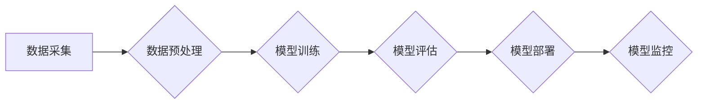

> 基础模型、人工智能、社会影响、伦理、可解释性、公平性、隐私

## 1. 背景介绍

基础模型（Foundation Models）是近年来人工智能领域备受关注的热点技术。它们通常是指在海量数据上预训练的大规模模型，能够在多种下游任务中表现出强大的泛化能力。例如，GPT-3、DALL-E 2 等模型在文本生成、图像生成、代码生成等领域取得了令人瞩目的成果。

基础模型的出现标志着人工智能技术迈向了一个新的阶段，但也引发了广泛的社会讨论。其强大的能力带来了巨大的机遇，但也可能带来一些潜在的风险。因此，我们需要认真评估基础模型的社会影响，并制定相应的应对措施，确保其安全、可控、可持续地发展。

## 2. 核心概念与联系

**2.1 基础模型的定义**

基础模型是指在海量数据上进行预训练的强大通用模型，能够在多种下游任务中表现出良好的泛化能力。它们通常具有以下特点：

* **规模庞大:** 基础模型通常拥有数十亿甚至数千亿个参数，需要大量的计算资源进行训练。
* **数据驱动:** 基础模型的训练依赖于海量的数据，数据质量和数量直接影响模型的性能。
* **通用性强:** 基础模型能够在多种下游任务中进行微调，例如文本分类、机器翻译、图像识别等。
* **可迁移性高:** 基础模型可以迁移到不同的领域和应用场景，降低了模型开发的成本和时间。

**2.2 基础模型与传统机器学习模型的对比**

传统机器学习模型通常针对特定任务进行训练，需要大量的特征工程和模型调优。而基础模型则通过在海量数据上进行预训练，学习了更底层的语义和知识表示，从而能够在多种任务中表现出更好的泛化能力。

**2.3 基础模型的架构**

基础模型的架构通常基于深度神经网络，例如 Transformer、BERT 等。这些架构能够有效地捕捉文本和图像中的长距离依赖关系，从而学习到更丰富的语义信息。

**Mermaid 流程图**



## 3. 核心算法原理 & 具体操作步骤

**3.1 算法原理概述**

基础模型的训练主要基于自监督学习和迁移学习的原理。

* **自监督学习:** 在海量未标记数据上训练模型，通过设计特定的预训练任务，例如语言建模、图像分类等，让模型学习到底层的语义和知识表示。
* **迁移学习:** 将预训练好的基础模型迁移到下游任务中进行微调，利用模型已经学习到的知识，快速适应新的任务。

**3.2 算法步骤详解**

1. **数据收集和预处理:** 收集海量文本或图像数据，并进行清洗、格式化等预处理操作。
2. **模型选择:** 选择合适的深度神经网络架构，例如 Transformer、BERT 等。
3. **模型预训练:** 在预处理好的数据上进行模型训练，使用自监督学习的策略，例如语言建模、图像分类等。
4. **模型微调:** 将预训练好的模型迁移到下游任务中进行微调，使用少量标记数据进行训练，适应新的任务需求。
5. **模型评估:** 使用测试集评估模型的性能，并进行必要的调整和优化。

**3.3 算法优缺点**

**优点:**

* **泛化能力强:** 基于海量数据的预训练，基础模型能够在多种下游任务中表现出良好的泛化能力。
* **效率高:** 模型预训练完成后，只需对下游任务进行微调，可以显著降低模型开发的时间和成本。
* **可迁移性高:** 基础模型可以迁移到不同的领域和应用场景，提高了模型的通用性。

**缺点:**

* **计算资源需求高:** 基础模型的训练需要大量的计算资源，成本较高。
* **数据依赖性强:** 模型的性能直接依赖于训练数据的质量和数量。
* **可解释性差:** 深度神经网络的决策过程较为复杂，难以解释模型的决策结果。

**3.4 算法应用领域**

基础模型在各个领域都有广泛的应用，例如：

* **自然语言处理:** 文本生成、机器翻译、问答系统、情感分析等。
* **计算机视觉:** 图像识别、物体检测、图像生成等。
* **语音识别:** 语音转文本、语音合成等。
* **代码生成:** 代码自动完成、代码翻译等。

## 4. 数学模型和公式 & 详细讲解 & 举例说明

**4.1 数学模型构建**

基础模型的训练通常基于最大似然估计（Maximum Likelihood Estimation，MLE）的原理。目标函数是模型输出与真实值的差距，通过优化目标函数，使得模型输出与真实值尽可能接近。

**4.2 公式推导过程**

假设模型输出为 $y$, 真实值 $y^*$, 损失函数为 $L(y, y^*)$, 则目标函数为：

$$
J(θ) = -\frac{1}{N} \sum_{i=1}^{N} log p(y_i^* | x_i, θ)
$$

其中：

* $θ$ 为模型参数
* $N$ 为训练样本数量
* $x_i$ 为第 $i$ 个样本的输入
* $p(y_i^* | x_i, θ)$ 为模型输出 $y_i$ 的概率分布

通过梯度下降算法，不断更新模型参数 $θ$, 使得目标函数 $J(θ)$ 最小化。

**4.3 案例分析与讲解**

例如，在语言建模任务中，模型需要预测下一个词的概率。假设输入序列为 "The cat sat on the", 则模型需要预测下一个词的概率分布，例如 "mat", "chair", "table" 等。

通过训练模型，学习到每个词出现的概率分布，并根据输入序列的上下文信息，预测下一个词的概率。

## 5. 项目实践：代码实例和详细解释说明

**5.1 开发环境搭建**

使用 Python 语言和深度学习框架 TensorFlow 或 PyTorch 进行开发。

**5.2 源代码详细实现**

```python
import tensorflow as tf

# 定义模型架构
model = tf.keras.Sequential([
    tf.keras.layers.Embedding(input_dim=vocab_size, output_dim=embedding_dim),
    tf.keras.layers.LSTM(units=hidden_size),
    tf.keras.layers.Dense(units=vocab_size, activation='softmax')
])

# 编译模型
model.compile(optimizer='adam', loss='sparse_categorical_crossentropy', metrics=['accuracy'])

# 训练模型
model.fit(x_train, y_train, epochs=epochs)

# 评估模型
loss, accuracy = model.evaluate(x_test, y_test)
print('Loss:', loss)
print('Accuracy:', accuracy)
```

**5.3 代码解读与分析**

* 使用 Embedding 层将词向量化，将每个词映射到一个低维向量空间。
* 使用 LSTM 层捕捉文本序列中的长距离依赖关系。
* 使用 Dense 层输出每个词的概率分布。
* 使用 Adam 优化器优化模型参数。
* 使用 sparse_categorical_crossentropy 作为损失函数，计算模型输出与真实值的差距。
* 使用 accuracy 作为评估指标，衡量模型的预测准确率。

**5.4 运行结果展示**

训练完成后，可以将模型应用于文本生成、机器翻译等下游任务中，并评估模型的性能。

## 6. 实际应用场景

基础模型在各个领域都有广泛的应用，例如：

* **自然语言处理:**

    * **聊天机器人:** 基于基础模型的聊天机器人能够进行更自然、更流畅的对话。
    * **文本摘要:** 基于基础模型的文本摘要系统能够自动生成文本的简洁摘要。
    * **机器翻译:** 基于基础模型的机器翻译系统能够实现更高质量的文本翻译。

* **计算机视觉:**

    * **图像识别:** 基于基础模型的图像识别系统能够识别各种物体和场景。
    * **图像生成:** 基于基础模型的图像生成系统能够生成逼真的图像。
    * **视频分析:** 基于基础模型的视频分析系统能够自动识别视频中的事件和行为。

* **语音识别:**

    * **语音转文本:** 基于基础模型的语音转文本系统能够将语音转换为文本。
    * **语音合成:** 基于基础模型的语音合成系统能够生成逼真的语音。

**6.4 未来应用展望**

基础模型的应用前景广阔，未来可能在以下领域发挥更大的作用：

* **个性化推荐:** 基于用户行为和偏好，提供个性化的商品、服务和内容推荐。
* **医疗诊断:** 基于患者的病历和影像数据，辅助医生进行疾病诊断。
* **科学研究:** 基于海量数据，加速科学发现和技术创新。

## 7. 工具和资源推荐

**7.1 学习资源推荐**

* **书籍:**
    * 《深度学习》
    * 《自然语言处理》
    * 《计算机视觉》
* **在线课程:**
    * Coursera
    * edX
    * Udacity

**7.2 开发工具推荐**

* **深度学习框架:** TensorFlow, PyTorch
* **编程语言:** Python
* **云计算平台:** AWS, Azure, GCP

**7.3 相关论文推荐**

* 《BERT: Pre-training of Deep Bidirectional Transformers for Language Understanding》
* 《GPT-3: Language Models are Few-Shot Learners》
* 《DALL-E 2: Hierarchical Text-Conditional Image Generation with CLIP Latents》

## 8. 总结：未来发展趋势与挑战

**8.1 研究成果总结**

基础模型在人工智能领域取得了显著的进展，展现出强大的泛化能力和应用潜力。

**8.2 未来发展趋势**

* **模型规模进一步扩大:** 随着计算资源的不断发展，基础模型的规模将进一步扩大，学习能力将得到提升。
* **多模态学习:** 基础模型将融合文本、图像、音频等多模态数据，实现更全面的知识表示。
* **可解释性增强:** 研究人员将致力于提高基础模型的可解释性，使得模型的决策过程更加透明。

**8.3 面临的挑战**

* **数据安全和隐私:** 基础模型的训练依赖于海量数据，如何保护数据安全和隐私是一个重要挑战。
* **算法偏见:** 基础模型可能存在算法偏见，导致模型输出不公平或不准确。
* **伦理问题:** 基础模型的强大能力可能带来伦理风险，例如被用于生成虚假信息或进行恶意攻击。

**8.4 研究展望**

未来研究将重点关注以下几个方面:

* 开发更安全、更可靠、更可解释的基础模型。
* 探索基础模型在更多领域和应用场景的应用潜力。
* 制定相应的政策和规范，引导基础模型的健康发展。

## 9. 附录：常见问题与解答

**9.1 如何选择合适的基础模型？**

选择合适的基础模型需要根据具体的应用场景和任务需求进行考虑。例如，对于文本生成任务，可以选择 GPT-3 等语言模型；对于图像识别任务，可以选择 Vision Transformer 等视觉模型。

**9.2 如何评估基础模型的性能？**

基础模型的性能可以通过多种指标进行评估，例如准确率、召回率、F1-score 等。具体的评估指标需要根据任务需求进行选择。

**9.3 如何解决基础模型的算法偏见问题？**

解决基础模型的算法偏见问题需要从多个方面入手，例如：

* 使用更加公平、更加代表性的训练数据。
* 在模型训练过程中加入公平性约束。
* 对模型输出进行公平性评估和校正。


作者：禅与计算机程序设计艺术 / Zen and the Art of Computer Programming 
<end_of_turn>