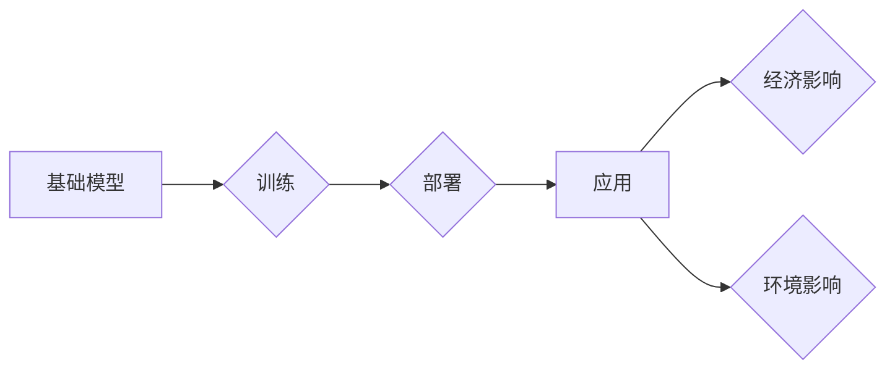

> 基础模型、经济影响、环境影响、计算资源、可持续发展、AI伦理

## 1. 背景介绍

基础模型（Foundation Models）是近年来人工智能领域备受关注的热点技术。它们是规模庞大、训练数据海量、能力广泛的通用人工智能模型，能够在各种下游任务中表现出惊人的性能，例如文本生成、图像识别、机器翻译等。基础模型的出现标志着人工智能发展进入了一个新的阶段，其强大的能力和广泛的应用前景，为人类社会带来了巨大的机遇和挑战。

然而，基础模型的训练和部署也带来了不容忽视的经济和环境影响。本文将深入探讨基础模型的经济与环境影响，分析其背后的机制，并提出一些应对措施，以促进基础模型的可持续发展。

## 2. 核心概念与联系

**2.1 基础模型的概念**

基础模型是指在海量数据上进行预训练的通用人工智能模型，其目标是学习到底层语言、视觉、音频等多模态知识表示。这些模型通常具有以下特点：

* **规模庞大:** 基础模型的参数数量通常在数十亿甚至数千亿级别。
* **训练数据海量:** 基础模型的训练需要大量的文本、图像、音频等数据。
* **能力广泛:** 基础模型能够在各种下游任务中表现出良好的泛化能力。

**2.2 基础模型的训练与部署**

基础模型的训练是一个耗时、耗能的复杂过程，需要大量的计算资源和电力。训练完成后，基础模型需要部署到服务器或云端，以便为用户提供服务。

**2.3 基础模型的经济与环境影响**

基础模型的训练和部署对经济和环境都产生了深远的影响。

* **经济影响:** 基础模型的训练和部署需要大量的计算资源，这会带来高昂的成本。同时，基础模型的应用也可能导致某些行业面临失业风险。
* **环境影响:** 基础模型的训练和部署会消耗大量的电力，产生大量的碳排放。

**2.4 核心概念原理和架构的 Mermaid 流程图**



## 3. 核心算法原理 & 具体操作步骤

**3.1 算法原理概述**

基础模型的训练通常采用深度学习算法，例如Transformer模型。Transformer模型利用注意力机制，能够有效地捕捉文本序列中的长距离依赖关系，从而学习到更深层的语义表示。

**3.2 算法步骤详解**

基础模型的训练过程可以概括为以下步骤：

1. **数据预处理:** 将原始数据进行清洗、格式化和编码。
2. **模型初始化:** 初始化模型参数。
3. **预训练:** 使用大量的未标记数据对模型进行预训练，学习到底层知识表示。
4. **微调:** 使用少量标记数据对预训练模型进行微调，使其能够适应特定下游任务。
5. **评估:** 使用测试数据评估模型的性能。

**3.3 算法优缺点**

**优点:**

* 强大的泛化能力
* 能够在各种下游任务中表现出良好的性能
* 训练一次，可用于多种任务

**缺点:**

* 训练成本高昂
* 训练时间长
* 容易受到训练数据偏差的影响

**3.4 算法应用领域**

基础模型在各个领域都有广泛的应用，例如：

* **自然语言处理:** 文本生成、机器翻译、问答系统等
* **计算机视觉:** 图像识别、物体检测、图像生成等
* **语音识别:** 语音转文本、语音合成等
* **多模态理解:** 将文本、图像、音频等多种模态信息进行融合理解

## 4. 数学模型和公式 & 详细讲解 & 举例说明

**4.1 数学模型构建**

基础模型的训练过程可以看作是一个优化问题，目标是找到模型参数，使得模型在训练数据上的损失函数最小。损失函数通常是模型预测值与真实值的差值，例如交叉熵损失函数。

**4.2 公式推导过程**

损失函数的最小化可以通过梯度下降算法实现。梯度下降算法的基本思想是沿着梯度的反方向更新模型参数，直到损失函数达到最小值。

**4.3 案例分析与讲解**

例如，在文本生成任务中，基础模型的输出是一个概率分布，表示每个单词出现的概率。损失函数可以是交叉熵损失函数，它衡量模型预测的概率分布与真实概率分布之间的差异。

**4.4 数学公式**

* 交叉熵损失函数:

$$
H(p, q) = -\sum_{i} p(i) \log q(i)
$$

其中，$p(i)$ 是真实概率分布，$q(i)$ 是模型预测的概率分布。

## 5. 项目实践：代码实例和详细解释说明

**5.1 开发环境搭建**

基础模型的开发通常需要使用深度学习框架，例如TensorFlow或PyTorch。

**5.2 源代码详细实现**

```python
import tensorflow as tf

# 定义模型结构
model = tf.keras.Sequential([
    tf.keras.layers.Embedding(input_dim=vocab_size, output_dim=embedding_dim),
    tf.keras.layers.LSTM(units=hidden_size),
    tf.keras.layers.Dense(units=vocab_size, activation='softmax')
])

# 编译模型
model.compile(optimizer='adam', loss='sparse_categorical_crossentropy', metrics=['accuracy'])

# 训练模型
model.fit(x_train, y_train, epochs=num_epochs)
```

**5.3 代码解读与分析**

这段代码定义了一个简单的文本生成模型，它使用嵌入层、LSTM层和全连接层组成。模型使用Adam优化器，交叉熵损失函数和准确率作为评估指标。

**5.4 运行结果展示**

训练完成后，模型可以用于生成新的文本。

## 6. 实际应用场景

基础模型在各个领域都有广泛的应用场景，例如：

* **聊天机器人:** 基于基础模型的聊天机器人能够进行更自然、更流畅的对话。
* **机器翻译:** 基于基础模型的机器翻译系统能够提供更准确、更流畅的翻译结果。
* **文本摘要:** 基于基础模型的文本摘要系统能够自动生成文本的简洁摘要。
* **代码生成:** 基于基础模型的代码生成系统能够自动生成代码片段。

**6.4 未来应用展望**

未来，基础模型的应用场景将会更加广泛，例如：

* **个性化教育:** 基于基础模型的个性化教育系统能够根据学生的学习情况提供定制化的学习内容。
* **医疗诊断:** 基于基础模型的医疗诊断系统能够辅助医生进行疾病诊断。
* **科学研究:** 基于基础模型的科学研究系统能够加速科学发现。

## 7. 工具和资源推荐

**7.1 学习资源推荐**

* **书籍:**
    * 《深度学习》
    * 《自然语言处理》
* **在线课程:**
    * Coursera
    * edX
* **博客:**
    * TensorFlow Blog
    * PyTorch Blog

**7.2 开发工具推荐**

* **深度学习框架:** TensorFlow, PyTorch
* **云计算平台:** AWS, Azure, Google Cloud

**7.3 相关论文推荐**

* 《Attention Is All You Need》
* 《BERT: Pre-training of Deep Bidirectional Transformers for Language Understanding》
* 《GPT-3: Language Models are Few-Shot Learners》

## 8. 总结：未来发展趋势与挑战

**8.1 研究成果总结**

基础模型的出现标志着人工智能发展进入了一个新的阶段，其强大的能力和广泛的应用前景，为人类社会带来了巨大的机遇和挑战。

**8.2 未来发展趋势**

未来，基础模型的发展趋势包括：

* **模型规模的进一步扩大:** 模型参数数量将继续增加，从而提升模型的性能。
* **多模态学习的深入研究:** 将文本、图像、音频等多种模态信息进行融合学习。
* **可解释性研究的加强:** 提高基础模型的可解释性，使其决策过程更加透明。

**8.3 面临的挑战**

基础模型的发展也面临着一些挑战：

* **训练成本高昂:** 基础模型的训练需要大量的计算资源和电力。
* **数据安全和隐私问题:** 基础模型的训练需要大量的训练数据，如何保证数据安全和隐私是一个重要问题。
* **算法偏见问题:** 基础模型的训练数据可能存在偏见，导致模型输出存在偏见。

**8.4 研究展望**

未来，我们需要继续加强基础模型的研究，探索更有效的训练方法、更强大的模型架构和更安全的应用场景，以促进基础模型的可持续发展，为人类社会带来更多福祉。

## 9. 附录：常见问题与解答

**9.1 如何选择合适的基础模型？**

选择合适的基础模型需要根据具体的应用场景和需求进行考虑。例如，对于文本生成任务，可以选择GPT-3等文本生成模型；对于图像识别任务，可以选择Vision Transformer等图像识别模型。

**9.2 如何解决基础模型的训练成本问题？**

可以采用一些方法来降低基础模型的训练成本，例如：

* 使用更有效的训练算法。
* 使用更小的模型规模。
* 利用云计算平台的计算资源。

**9.3 如何解决基础模型的算法偏见问题？**

可以采用一些方法来解决基础模型的算法偏见问题，例如：

* 使用更公平的训练数据。
* 使用偏见检测和缓解技术。
* 提高模型的可解释性，以便更好地理解模型的决策过程。


作者：禅与计算机程序设计艺术 / Zen and the Art of Computer Programming 
<end_of_turn>