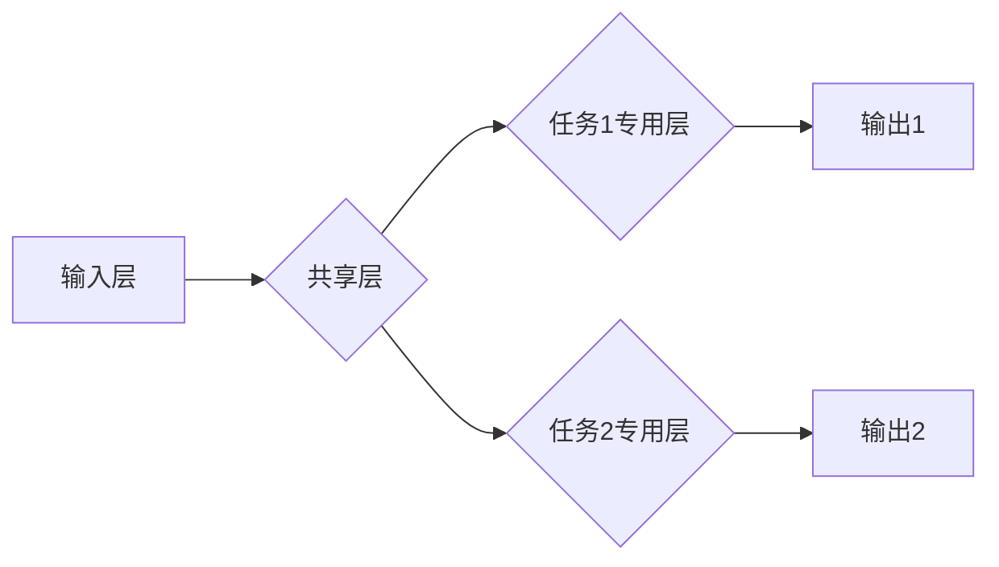

> 多任务学习，自动驾驶，感知能力，深度学习，计算机视觉，目标检测，语义分割

## 1. 背景介绍

自动驾驶技术作为未来交通运输的重要发展方向，其核心之一是感知能力。感知能力是指自动驾驶系统对周围环境的理解和认知，包括目标检测、路径规划、环境地图构建等。传统的自动驾驶感知系统通常采用单任务学习方法，针对每个任务单独训练模型，这存在以下问题：

* **数据效率低:** 每个任务都需要大量的特定数据进行训练，而现实中获取特定任务数据的成本较高。
* **模型泛化能力差:** 单任务模型训练后对特定任务表现良好，但对其他任务的泛化能力较差。
* **模型结构复杂:** 每个任务都需要设计独立的模型结构，导致模型结构复杂，难以维护和更新。

多任务学习 (Multi-Task Learning, MTL) 作为一种新型的深度学习方法，旨在同时训练多个相关任务的模型，通过共享底层特征和知识，提高模型的整体性能和泛化能力。

## 2. 核心概念与联系

多任务学习的核心思想是将多个相关任务联合训练，共享一部分模型参数，从而实现知识迁移和数据共享。

**多任务学习的架构:**



**核心概念:**

* **共享层:** 多个任务共享的底层特征提取网络，负责提取通用特征。
* **专用层:** 每个任务特定的上层网络，负责对共享特征进行特定任务的处理。
* **任务相关性:** 多个任务之间存在一定的相关性，例如目标检测和语义分割任务都依赖于图像特征提取。

## 3. 核心算法原理 & 具体操作步骤

### 3.1  算法原理概述

多任务学习的算法原理主要基于以下几个方面:

* **知识迁移:** 通过共享底层特征，将已学习到的知识迁移到其他任务中，提高学习效率。
* **正则化:** 在训练过程中，通过对共享层参数进行正则化，防止模型过拟合，提高模型泛化能力。
* **任务权重:** 根据不同任务的重要性，分配不同的权重，平衡不同任务的学习效果。

### 3.2  算法步骤详解

多任务学习的具体操作步骤如下:

1. **数据预处理:** 对训练数据进行预处理，例如图像裁剪、数据增强等。
2. **模型构建:** 设计多任务学习模型架构，包括共享层和专用层。
3. **参数初始化:** 对模型参数进行随机初始化。
4. **训练过程:**

* 使用训练数据进行反向传播训练，更新模型参数。
* 计算每个任务的损失函数，并根据任务权重进行加权求和。
* 使用优化算法更新模型参数，例如Adam优化器。

5. **模型评估:** 使用测试数据评估模型性能，例如准确率、召回率等。

### 3.3  算法优缺点

**优点:**

* **数据效率高:** 通过共享数据，可以有效降低训练数据量。
* **模型泛化能力强:** 通过知识迁移，可以提高模型对未知数据的适应能力。
* **模型结构简洁:** 相比于单独训练多个模型，多任务学习模型结构更简洁，更容易维护和更新。

**缺点:**

* **任务相关性:** 多个任务之间需要有一定的相关性，否则效果不佳。
* **任务权重设置:** 需要合理设置任务权重，平衡不同任务的学习效果。
* **训练复杂度:** 多任务学习模型的训练复杂度较高，需要更强大的计算资源。

### 3.4  算法应用领域

多任务学习在自动驾驶感知能力进化中具有广泛的应用场景，例如:

* **目标检测与语义分割:** 将目标检测和语义分割任务联合训练，提高目标识别和场景理解能力。
* **路径规划与地图构建:** 将路径规划和地图构建任务联合训练，提高路径规划的准确性和地图构建的效率。
* **驾驶行为预测与决策:** 将驾驶行为预测和决策任务联合训练，提高自动驾驶系统的安全性。

## 4. 数学模型和公式 & 详细讲解 & 举例说明

### 4.1  数学模型构建

多任务学习的数学模型可以表示为一个多输出的神经网络，其中每个输出对应一个任务。

假设有N个任务，每个任务的输出为y_i，输入为x，共享层参数为θ，专用层参数为φ_i。则多任务学习模型的输出可以表示为:

$$
y_i = f_i(x, θ, φ_i)
$$

其中，f_i()为每个任务的专用层函数。

### 4.2  公式推导过程

多任务学习的损失函数通常是所有任务损失函数的加权求和，权重根据任务的重要性进行设置。

$$
L = \sum_{i=1}^{N} w_i L_i
$$

其中，L为总损失函数，w_i为第i个任务的权重，L_i为第i个任务的损失函数。

### 4.3  案例分析与讲解

例如，在目标检测和语义分割任务联合训练中，可以将目标检测的损失函数为IoU损失，语义分割的损失函数为交叉熵损失。

$$
L = w_1 L_{IoU} + w_2 L_{CrossEntropy}
$$

其中，w_1和w_2分别为目标检测和语义分割任务的权重。

## 5. 项目实践：代码实例和详细解释说明

### 5.1  开发环境搭建

* 操作系统: Ubuntu 20.04
* Python 版本: 3.8
* 深度学习框架: PyTorch 1.7

### 5.2  源代码详细实现

```python
import torch
import torch.nn as nn

class SharedLayer(nn.Module):
    def __init__(self):
        super(SharedLayer, self).__init__()
        self.conv1 = nn.Conv2d(3, 64, kernel_size=3, padding=1)
        self.relu = nn.ReLU()
        self.maxpool = nn.MaxPool2d(kernel_size=2, stride=2)

    def forward(self, x):
        x = self.conv1(x)
        x = self.relu(x)
        x = self.maxpool(x)
        return x

class Task1Layer(nn.Module):
    def __init__(self):
        super(Task1Layer, self).__init__()
        self.fc1 = nn.Linear(64 * 16 * 16, 128)
        self.relu = nn.ReLU()
        self.fc2 = nn.Linear(128, 10)

    def forward(self, x):
        x = x.view(x.size(0), -1)
        x = self.fc1(x)
        x = self.relu(x)
        x = self.fc2(x)
        return x

class Task2Layer(nn.Module):
    def __init__(self):
        super(Task2Layer, self).__init__()
        self.fc1 = nn.Linear(64 * 16 * 16, 128)
        self.relu = nn.ReLU()
        self.fc2 = nn.Linear(128, 20)

    def forward(self, x):
        x = x.view(x.size(0), -1)
        x = self.fc1(x)
        x = self.relu(x)
        x = self.fc2(x)
        return x

class MultiTaskLearningModel(nn.Module):
    def __init__(self):
        super(MultiTaskLearningModel, self).__init__()
        self.shared_layer = SharedLayer()
        self.task1_layer = Task1Layer()
        self.task2_layer = Task2Layer()

    def forward(self, x):
        x = self.shared_layer(x)
        task1_output = self.task1_layer(x)
        task2_output = self.task2_layer(x)
        return task1_output, task2_output
```

### 5.3  代码解读与分析

* **SharedLayer:** 共享层，负责提取图像特征。
* **Task1Layer, Task2Layer:** 每个任务的专用层，负责对共享特征进行特定任务的处理。
* **MultiTaskLearningModel:** 多任务学习模型，包含共享层和两个专用层。

### 5.4  运行结果展示

通过训练模型，可以得到目标检测和语义分割的预测结果，并评估模型性能。

## 6. 实际应用场景

### 6.1  自动驾驶感知能力进化

多任务学习在自动驾驶感知能力进化中具有广泛的应用场景，例如:

* **目标检测与语义分割:** 将目标检测和语义分割任务联合训练，提高目标识别和场景理解能力。
* **路径规划与地图构建:** 将路径规划和地图构建任务联合训练，提高路径规划的准确性和地图构建的效率。
* **驾驶行为预测与决策:** 将驾驶行为预测和决策任务联合训练，提高自动驾驶系统的安全性。

### 6.2  其他应用场景

* **医疗图像分析:** 将病灶检测、肿瘤分割等任务联合训练，提高医疗诊断的准确性。
* **自然语言处理:** 将文本分类、情感分析等任务联合训练，提高自然语言理解能力。
* **机器人控制:** 将物体识别、路径规划等任务联合训练，提高机器人控制的效率和鲁棒性。

### 6.4  未来应用展望

随着深度学习技术的不断发展，多任务学习在自动驾驶感知能力进化中的应用场景将更加广泛，例如:

* **多模态感知:** 将图像、激光雷达、传感器等多模态数据联合训练，提高感知系统的鲁棒性和可靠性。
* **场景理解与预测:** 将目标检测、语义分割、驾驶行为预测等任务联合训练，实现对场景的更深入理解和预测。
* **个性化驾驶体验:** 根据用户的驾驶习惯和偏好，个性化训练多任务学习模型，提供更舒适和安全的驾驶体验。

## 7. 工具和资源推荐

### 7.1  学习资源推荐

* **书籍:**
    * Deep Learning by Ian Goodfellow, Yoshua Bengio, and Aaron Courville
    * Hands-On Machine Learning with Scikit-Learn, Keras & TensorFlow by Aurélien Géron
* **在线课程:**
    * Stanford CS231n: Convolutional Neural Networks for Visual Recognition
    * Deep Learning Specialization by Andrew Ng on Coursera

### 7.2  开发工具推荐

* **深度学习框架:** PyTorch, TensorFlow
* **数据处理工具:** OpenCV, NumPy
* **可视化工具:** Matplotlib, Seaborn

### 7.3  相关论文推荐

* **Multi-Task Learning** by Richard S. Sutton and Andrew G. Barto
* **Domain Adaptation for Multi-Task Learning** by  Yan Zhang et al.
* **Multi-Task Learning with Deep Networks** by  Chelsea Finn et al.

## 8. 总结：未来发展趋势与挑战

### 8.1  研究成果总结

多任务学习在自动驾驶感知能力进化中取得了显著的成果，例如:

* **提高了模型的泛化能力和数据效率。**
* **实现了对复杂场景的更深入理解和预测。**
* **为自动驾驶系统的安全性、可靠性和智能化提供了重要的技术支撑。**

### 8.2  未来发展趋势

* **多模态多任务学习:** 将图像、激光雷达、传感器等多模态数据联合训练，提高感知系统的鲁棒性和可靠性。
* **场景理解与预测:** 将目标检测、语义分割、驾驶行为预测