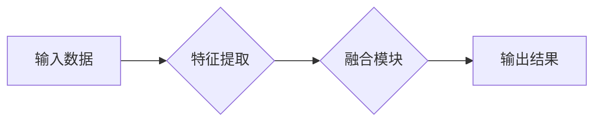

> 多模态数据、数据表示、数据融合、深度学习、计算机视觉、自然语言处理

## 1. 背景介绍

随着信息技术的飞速发展，数据已成为现代社会不可或缺的资源。然而，现实世界中的数据往往以多种形式存在，例如文本、图像、音频、视频等，这些数据被称为多模态数据。多模态数据蕴含着丰富的语义信息，能够提供更全面的理解和分析。

传统的数据处理方法主要针对单一模态数据，难以有效地处理多模态数据的复杂性和多样性。因此，如何有效地表示和融合多模态数据成为了一个重要的研究课题。

## 2. 核心概念与联系

**2.1 多模态数据表示**

多模态数据表示是指将不同模态的数据映射到一个统一的表示空间，以便于进行融合和分析。常用的多模态数据表示方法包括：

* **特征提取:** 从每个模态数据中提取特征向量，例如使用卷积神经网络提取图像特征，使用词嵌入模型提取文本特征。
* **联合嵌入:** 将不同模态的数据映射到同一个低维嵌入空间，例如使用多模态自编码器或多模态注意机制。

**2.2 多模态数据融合**

多模态数据融合是指将不同模态的数据进行结合，以获得更准确、更全面的信息。常用的多模态数据融合方法包括：

* **早期融合:** 在特征提取阶段将不同模态的数据进行融合，例如将图像特征和文本特征进行拼接。
* **晚期融合:** 在决策阶段将不同模态的数据进行融合，例如将不同模态的预测结果进行加权平均。
* **跨模态注意力机制:** 学习不同模态之间的关系，并根据重要性分配权重，例如使用注意力机制对图像和文本进行交互。

**2.3 多模态数据融合架构**



## 3. 核心算法原理 & 具体操作步骤

### 3.1 算法原理概述

多模态数据融合的核心算法原理是学习不同模态数据之间的关系，并根据这些关系进行数据融合。常用的算法包括：

* **多模态自编码器:** 使用自编码器结构学习不同模态数据的联合表示。
* **多模态注意机制:** 学习不同模态之间的注意力权重，并根据权重进行数据融合。
* **多模态图神经网络:** 使用图神经网络学习不同模态之间的关系，并进行数据融合。

### 3.2 算法步骤详解

以多模态自编码器为例，其具体操作步骤如下：

1. **编码器:** 将不同模态的数据分别输入到各自的编码器中，提取特征向量。
2. **解码器:** 将编码器输出的特征向量进行融合，并输入到解码器中，重建原始数据。
3. **损失函数:** 使用重建误差作为损失函数，训练模型。

### 3.3 算法优缺点

**优点:**

* 可以学习不同模态数据的联合表示。
* 可以有效地融合不同模态的数据。

**缺点:**

* 训练复杂度较高。
* 需要大量的训练数据。

### 3.4 算法应用领域

多模态数据融合算法广泛应用于以下领域：

* **图像字幕生成:** 将图像与文本进行融合，生成图像字幕。
* **视频理解:** 将视频中的图像、音频和文本进行融合，理解视频内容。
* **情感分析:** 将文本、图像和音频进行融合，分析情感。

## 4. 数学模型和公式 & 详细讲解 & 举例说明

### 4.1 数学模型构建

假设我们有两种模态数据，分别是图像数据 $X$ 和文本数据 $T$。我们希望将它们融合到一个统一的表示空间 $Z$ 中。

我们可以使用以下数学模型来表示多模态数据融合：

$$
Z = f(X, T)
$$

其中，$f$ 是一个多模态融合函数，它将图像数据 $X$ 和文本数据 $T$ 作为输入，输出一个统一的表示 $Z$。

### 4.2 公式推导过程

具体的融合函数 $f$ 可以根据不同的算法设计。例如，我们可以使用多模态自编码器来构建融合函数。

多模态自编码器的结构如下：

* **编码器:** 将图像数据 $X$ 和文本数据 $T$ 分别编码成特征向量 $h_x$ 和 $h_t$。
* **解码器:** 将特征向量 $h_x$ 和 $h_t$ 融合成一个新的特征向量 $h$，然后解码成最终的表示 $Z$。

### 4.3 案例分析与讲解

例如，我们可以使用多模态自编码器来进行图像字幕生成任务。

1. 将图像数据 $X$ 和文本数据 $T$ 分别输入到编码器中，提取特征向量 $h_x$ 和 $h_t$。
2. 将特征向量 $h_x$ 和 $h_t$ 融合成一个新的特征向量 $h$。
3. 将特征向量 $h$ 输入到解码器中，解码成最终的字幕文本 $Z$。

## 5. 项目实践：代码实例和详细解释说明

### 5.1 开发环境搭建

* Python 3.7+
* TensorFlow 2.0+
* PyTorch 1.0+
* CUDA 10.0+

### 5.2 源代码详细实现

```python
# 导入必要的库
import tensorflow as tf

# 定义多模态自编码器模型
class MultimodalAutoencoder(tf.keras.Model):
    def __init__(self, image_dim, text_dim):
        super(MultimodalAutoencoder, self).__init__()
        # 定义图像编码器
        self.image_encoder = tf.keras.Sequential([
            tf.keras.layers.Conv2D(32, (3, 3), activation='relu', input_shape=(image_dim, image_dim, 3)),
            tf.keras.layers.MaxPooling2D((2, 2)),
            tf.keras.layers.Conv2D(64, (3, 3), activation='relu'),
            tf.keras.layers.MaxPooling2D((2, 2)),
            tf.keras.layers.Flatten(),
            tf.keras.layers.Dense(128, activation='relu')
        ])
        # 定义文本编码器
        self.text_encoder = tf.keras.Sequential([
            tf.keras.layers.Embedding(text_dim, 64),
            tf.keras.layers.GlobalAveragePooling1D(),
            tf.keras.layers.Dense(128, activation='relu')
        ])
        # 定义融合层
        self.fusion_layer = tf.keras.layers.Dense(256, activation='relu')
        # 定义解码器
        self.decoder = tf.keras.Sequential([
            tf.keras.layers.Dense(128, activation='relu'),
            tf.keras.layers.Dense(image_dim * image_dim * 3, activation='sigmoid')
        ])

    def call(self, images, texts):
        # 编码图像和文本
        image_features = self.image_encoder(images)
        text_features = self.text_encoder(texts)
        # 融合特征
        fused_features = self.fusion_layer(tf.concat([image_features, text_features], axis=-1))
        # 解码
        reconstructed_images = self.decoder(fused_features)
        return reconstructed_images

# 实例化模型
model = MultimodalAutoencoder(image_dim=224, text_dim=10000)

# 训练模型
model.compile(optimizer='adam', loss='mse')
model.fit(images, texts, epochs=10)
```

### 5.3 代码解读与分析

* 代码首先定义了多模态自编码器模型，包括图像编码器、文本编码器、融合层和解码器。
* 然后，实例化模型并使用均方误差损失函数进行训练。

### 5.4 运行结果展示

训练完成后，我们可以使用模型对新的图像和文本数据进行融合，并生成相应的重建图像。

## 6. 实际应用场景

### 6.1 图像字幕生成

多模态数据融合技术可以用于生成图像字幕，例如将图像与文本进行融合，生成图像字幕。

### 6.2 视频理解

多模态数据融合技术可以用于视频理解，例如将视频中的图像、音频和文本进行融合，理解视频内容。

### 6.3 情感分析

多模态数据融合技术可以用于情感分析，例如将文本、图像和音频进行融合，分析情感。

### 6.4 未来应用展望

随着多模态数据融合技术的不断发展，其应用场景将会更加广泛，例如：

* **智能客服:** 使用多模态数据融合技术，开发更智能的客服机器人，能够理解用户的语音、文本和图像信息。
* **医疗诊断:** 使用多模态数据融合技术，辅助医生进行诊断，例如将患者的医学影像、病历和症状进行融合。
* **教育教学:** 使用多模态数据融合技术，开发更生动的教育教学内容，例如将文本、图像、音频和视频进行融合。

## 7. 工具和资源推荐

### 7.1 学习资源推荐

* **书籍:**
    * Deep Learning with Python by Francois Chollet
    * Multimodal Machine Learning by Tinne Tuytelaars
* **课程:**
    * Stanford CS230: Convolutional Neural Networks for Visual Recognition
    * MIT 6.S191: Introduction to Deep Learning

### 7.2 开发工具推荐

* **TensorFlow:** https://www.tensorflow.org/
* **PyTorch:** https://pytorch.org/
* **Keras:** https://keras.io/

### 7.3 相关论文推荐

* **Show, Attend and Tell: Neural Image Captioning with Visual Attention** by Xu et al. (2015)
* **Multimodal Deep Learning: A Survey** by Kiela et al. (2018)

## 8. 总结：未来发展趋势与挑战

### 8.1 研究成果总结

近年来，多模态数据表示和融合方法取得了显著进展，例如：

* **深度学习模型的进步:** 深度学习模型的性能不断提升，能够更好地学习多模态数据的复杂关系。
* **新的融合方法:** 出现了新的多模态融合方法，例如跨模态注意力机制和多模态图神经网络。
* **应用领域的扩展:** 多模态数据融合技术应用于越来越多的领域，例如图像字幕生成、视频理解和情感分析。

### 8.2 未来发展趋势

未来，多模态数据表示和融合方法将朝着以下方向发展:

* **更强大的模型:** 开发更强大的深度学习模型，能够更好地学习多模态数据的复杂关系。
* **更有效的融合方法:** 研究更有效的融合方法，能够更好地融合不同模态的数据。
* **更广泛的应用:** 将多模态数据融合技术应用于更多领域，例如智能客服、医疗诊断和教育教学。

### 8.3 面临的挑战

多模态数据表示和融合方法仍然面临一些挑战:

* **数据标注:** 多模态数据的标注成本较高，难以获得大量的标注数据。
* **模态间关系:** 不同模态之间存在复杂的语义关系，难以学习和建模。
* **计算复杂度:** 多模态数据融合算法的计算复杂度较高，难以在资源有限的设备上运行。

### 8.4 研究展望

未来，我们将继续致力于多模态数据表示和融合方法的研究，希望能够克服上述挑战，开发更强大的模型和更有效的融合方法，并将多模态数据融合技术应用于更多领域，为人类社会带来更多价值。

## 9. 附录：常见问题与解答

**Q1: 多模态数据融合有哪些常见的算法？**

**A1:** 多模态数据融合