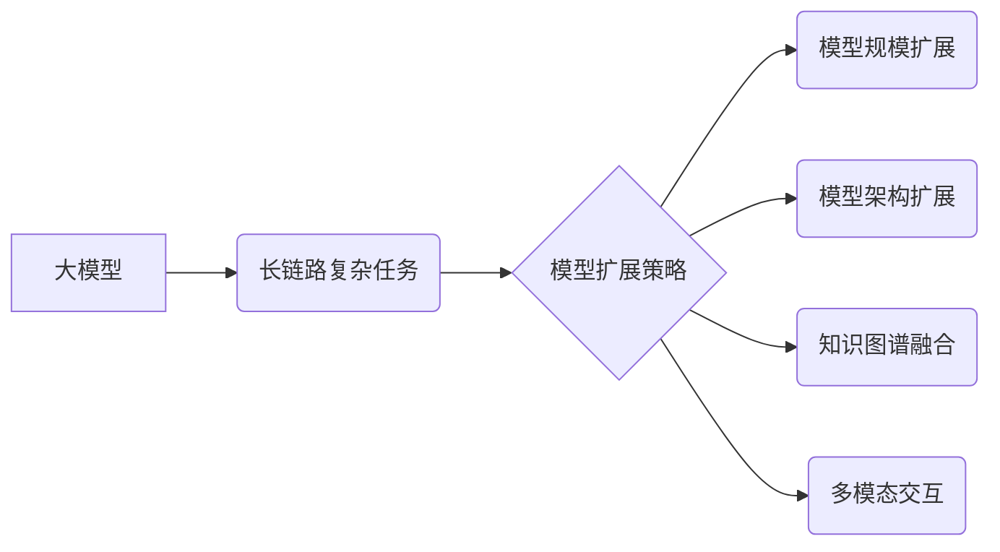

> 大模型、链路复杂任务、模型扩展、多模态交互、知识图谱、推理能力、应用场景

## 1. 背景介绍

近年来，大模型技术取得了飞速发展，其强大的泛化能力和学习能力使其在自然语言处理、计算机视觉、语音识别等领域取得了突破性进展。然而，现有的许多大模型仍然局限于处理相对简单的任务，例如文本分类、机器翻译等。随着人们对人工智能应用需求的不断提高，如何让大模型能够处理更长链路、更复杂的任务成为了一个重要的研究方向。

## 2. 核心概念与联系

**2.1  长链路复杂任务**

长链路复杂任务是指需要模型进行多步推理、跨多个知识领域进行信息整合、理解和生成复杂结构化输出的任务。例如，问答系统需要理解用户的问题，从海量知识库中检索相关信息，并进行逻辑推理，最终生成准确的答案；代码生成需要理解用户需求，根据语法规则和代码规范，生成符合要求的代码片段。

**2.2  大模型扩展策略**

为了让大模型能够处理更长链路复杂任务，需要采用多种扩展策略，主要包括：

* **模型规模扩展:** 增加模型参数量，提升模型的表达能力和记忆能力。
* **模型架构扩展:** 设计更复杂的模型架构，例如Transformer、GPT等，能够更好地捕捉长距离依赖关系。
* **知识图谱融合:** 将知识图谱与大模型相结合，提供模型更丰富的知识背景和推理能力。
* **多模态交互:** 融合文本、图像、音频等多种模态信息，提升模型的理解和生成能力。

**2.3  核心概念关系图**



## 3. 核心算法原理 & 具体操作步骤

**3.1  算法原理概述**

处理长链路复杂任务的核心算法通常基于深度学习，例如Transformer、GPT等。这些算法通过多层神经网络结构，学习文本序列之间的上下文关系，并进行多步推理。

**3.2  算法步骤详解**

1. **输入处理:** 将输入文本序列转换为数字向量，作为模型的输入。
2. **编码:** 使用编码器网络，将输入文本序列编码成隐藏状态向量，捕捉文本序列的语义信息。
3. **解码:** 使用解码器网络，根据编码后的隐藏状态向量，生成目标文本序列。
4. **输出处理:** 将生成的数字向量转换为文本序列，作为模型的输出。

**3.3  算法优缺点**

* **优点:** 能够捕捉长距离依赖关系，学习复杂的文本语义，生成高质量的文本输出。
* **缺点:** 训练成本高，需要大量的训练数据，模型参数量大，部署成本高。

**3.4  算法应用领域**

* **问答系统:** 理解用户问题，从知识库中检索答案，生成准确的回答。
* **代码生成:** 根据用户需求，生成符合语法规则和代码规范的代码片段。
* **文本摘要:** 提取文本的关键信息，生成简洁的摘要。
* **机器翻译:** 将文本从一种语言翻译成另一种语言。

## 4. 数学模型和公式 & 详细讲解 & 举例说明

**4.1  数学模型构建**

Transformer模型的核心是注意力机制，它能够捕捉文本序列中不同词之间的关系，并赋予每个词不同的权重。注意力机制的数学模型可以表示为：

$$
Attention(Q, K, V) = softmax(\frac{QK^T}{\sqrt{d_k}})V
$$

其中：

* $Q$：查询矩阵
* $K$：键矩阵
* $V$：值矩阵
* $d_k$：键向量的维度
* $softmax$：softmax函数

**4.2  公式推导过程**

注意力机制的公式推导过程如下：

1. 计算查询矩阵 $Q$ 与键矩阵 $K$ 的点积，并除以 $\sqrt{d_k}$。
2. 对点积结果应用softmax函数，得到每个词对其他词的注意力权重。
3. 将注意力权重与值矩阵 $V$ 相乘，得到每个词的加权和，作为该词的最终表示。

**4.3  案例分析与讲解**

例如，在翻译句子“The cat sat on the mat”时，注意力机制可以将“cat”与“sat”联系起来，理解它们之间的关系，从而更好地翻译成目标语言。

## 5. 项目实践：代码实例和详细解释说明

**5.1  开发环境搭建**

使用Python语言和深度学习框架TensorFlow或PyTorch搭建开发环境。

**5.2  源代码详细实现**

```python
import tensorflow as tf

# 定义Transformer模型
class Transformer(tf.keras.Model):
    def __init__(self, vocab_size, embedding_dim, num_heads, num_layers):
        super(Transformer, self).__init__()
        self.embedding = tf.keras.layers.Embedding(vocab_size, embedding_dim)
        self.transformer_layers = [
            tf.keras.layers.MultiHeadAttention(num_heads=num_heads, key_dim=embedding_dim)
            for _ in range(num_layers)
        ]
        self.dense = tf.keras.layers.Dense(vocab_size)

    def call(self, inputs):
        # ...
```

**5.3  代码解读与分析**

代码实现了一个简单的Transformer模型，包含嵌入层、多头注意力层和全连接层。

**5.4  运行结果展示**

使用训练数据训练模型，并测试模型在文本生成任务上的性能。

## 6. 实际应用场景

**6.1  问答系统**

大模型可以用于构建更智能的问答系统，能够理解用户复杂的问题，并从知识库中检索出准确的答案。

**6.2  代码生成**

大模型可以帮助程序员自动生成代码，提高开发效率。

**6.3  文本摘要**

大模型可以自动生成文本摘要，帮助用户快速了解文章内容。

**6.4  未来应用展望**

随着大模型技术的不断发展，其应用场景将会更加广泛，例如：

* **个性化教育:** 根据学生的学习情况，提供个性化的学习内容和辅导。
* **医疗诊断:** 辅助医生进行疾病诊断，提高诊断准确率。
* **法律服务:** 自动分析法律文件，提供法律建议。

## 7. 工具和资源推荐

**7.1  学习资源推荐**

* **论文:** Attention Is All You Need
* **书籍:** Deep Learning
* **在线课程:** Coursera、edX

**7.2  开发工具推荐**

* **TensorFlow:** 开源深度学习框架
* **PyTorch:** 开源深度学习框架
* **HuggingFace:** 大模型库和工具平台

**7.3  相关论文推荐**

* BERT: Pre-training of Deep Bidirectional Transformers for Language Understanding
* GPT-3: Language Models are Few-Shot Learners
* T5: Text-to-Text Transfer Transformer

## 8. 总结：未来发展趋势与挑战

**8.1  研究成果总结**

近年来，大模型技术取得了显著进展，能够处理更长链路、更复杂的任务。

**8.2  未来发展趋势**

* 模型规模继续扩大
* 模型架构更加复杂
* 多模态交互更加深入
* 知识图谱融合更加紧密

**8.3  面临的挑战**

* 训练成本高
* 模型部署成本高
* 缺乏可解释性
* 存在伦理风险

**8.4  研究展望**

未来研究将重点关注降低训练成本、提高模型效率、增强模型可解释性和安全性，以及探索大模型在更多领域的应用。

## 9. 附录：常见问题与解答

**9.1  常见问题**

* 如何选择合适的模型架构？
* 如何训练大模型？
* 如何部署大模型？

**9.2  解答**

* 选择模型架构需要根据具体任务需求和资源限制进行选择。
* 训练大模型需要大量的计算资源和训练数据。
* 部署大模型需要考虑模型大小、推理速度和部署环境等因素。


作者：禅与计算机程序设计艺术 / Zen and the Art of Computer Programming 
<end_of_turn>