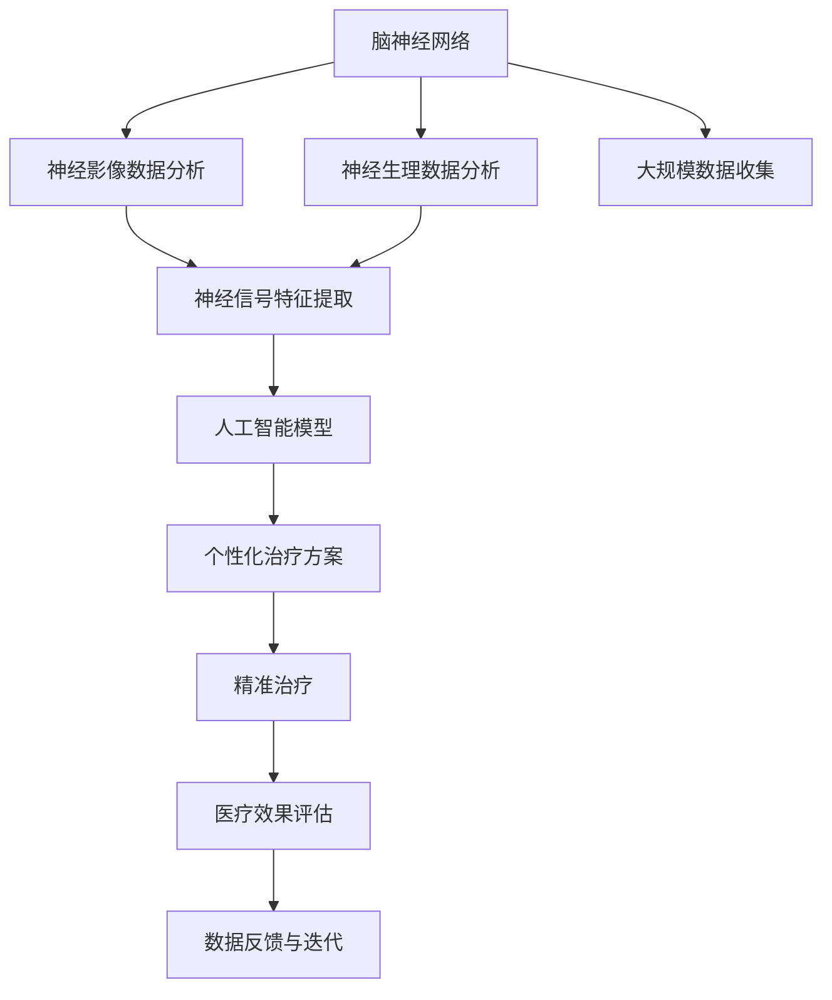

                 

# 全球脑与个性化医疗:集体智慧驱动的精准治疗方案

> 关键词：全球脑,个性化医疗,精准治疗,集体智慧,人工智能,脑神经网络,大数据,医疗健康,生物医学

## 1. 背景介绍

### 1.1 问题由来
随着科学技术的飞速发展，个性化医疗（Precision Medicine）已成为未来医疗发展的核心趋势之一。个性化医疗旨在根据个体的基因、环境、生活习惯等综合因素，为患者量身定制治疗方案，从而显著提升治疗效果和患者体验。而在个性化医疗的诸多技术路径中，基于人工智能和脑科学的全球脑项目（Global Brain）无疑是极具潜力和前景的突破方向。

全球脑项目结合了神经科学、人工智能、大数据分析等多种先进技术，通过深度挖掘大脑的结构和功能信息，为患者提供个性化、精准的医疗方案。其核心在于利用集体智慧（Collective Intelligence）对海量的脑神经数据进行高效分析，从中提炼出适用于个体化治疗的精确信息，推动精准医疗的实现。

### 1.2 问题核心关键点
全球脑项目的关键在于如何整合并分析全球范围内的脑神经数据，从中提取出与个体健康相关的关键特征，并结合人工智能模型进行精准预测和治疗方案设计。其核心方法包括：

- 大规模数据收集：从全球范围内的医疗和科研机构收集海量的脑神经数据。
- 数据分析与建模：运用先进的机器学习算法和脑科学模型对数据进行深入分析。
- 精准治疗方案设计：基于分析结果，为患者量身定制个性化的治疗方案。
- 集体智慧驱动：通过集成的多源数据和多领域专家智慧，不断优化和治疗方案，提升医疗效果。

### 1.3 问题研究意义
全球脑项目对于推动个性化医疗的进步具有深远的意义：

1. **提升诊疗准确性**：通过集体智慧分析脑神经数据，精确预测病情，指导精准治疗，从而显著提升诊断和干预的准确性。
2. **优化资源配置**：科学配置医疗资源，减少医疗浪费，提高整体医疗效率。
3. **促进医疗公平**：为资源匮乏地区提供高质量医疗服务，缩小医疗资源分配的不均衡。
4. **加速科研进展**：加速脑神经科学研究，推动医学知识的更新和突破。
5. **驱动产业升级**：促进健康科技产业的创新与发展，带动相关产业链的成长。

本文将系统介绍全球脑项目的核心原理、操作步骤及应用场景，为读者提供全面的技术指引和应用思路。

## 2. 核心概念与联系

### 2.1 核心概念概述

为更好地理解全球脑项目的实施路径和核心方法，本节将介绍几个紧密相关的核心概念：

- 全球脑（Global Brain）：通过集成和分析全球范围内脑神经数据，实现精准医疗的全球化项目。
- 个性化医疗（Precision Medicine）：根据个体的遗传、生理、环境等差异，量身定制医疗方案。
- 精准治疗（Precision Treatment）：通过精确诊断和治疗，提高医疗效果，减少副作用。
- 集体智慧（Collective Intelligence）：多个智能体协同合作，共同解决复杂问题的智慧形态。
- 人工智能（AI）：利用机器学习、深度学习等技术，模拟和增强人类智能。
- 脑神经网络（Brain Neural Network）：描述大脑结构和功能的数学模型，揭示神经元之间的连接关系和信息传递机制。

这些概念共同构成了全球脑项目的核心框架，其中人工智能和脑神经网络技术的结合是其技术基础，而个性化医疗和精准治疗是其实际应用目标，集体智慧则体现了项目实施的协同精神。

### 2.2 核心概念原理和架构的 Mermaid 流程图



这个流程图展示了全球脑项目的技术路径和主要步骤：

1. 收集和整理全球范围内的脑神经数据。
2. 对脑神经网络进行神经影像和生理数据的分析，提取关键神经特征。
3. 运用人工智能模型对提取的特征进行深度学习，构建精准医疗模型。
4. 根据个性化治疗方案进行精准治疗。
5. 对治疗效果进行评估，并将反馈数据用于模型迭代。

这一流程显示了从数据采集到模型训练，再到临床应用的完整路径，体现了全球脑项目的系统性和复杂性。

## 3. 核心算法原理 & 具体操作步骤
### 3.1 算法原理概述

全球脑项目的技术核心是人工智能和大数据分析的结合，旨在通过海量的脑神经数据，精确预测和治疗疾病。其主要算法原理包括：

- 数据预处理：清洗、归一化、特征工程等数据预处理技术，为后续分析提供高质量数据。
- 特征提取：利用神经影像、生理数据等提取脑神经网络的特征。
- 模型训练：构建深度学习模型，训练数据集，学习特征与疾病之间的映射关系。
- 模型评估：通过交叉验证等方法评估模型性能，确保模型泛化能力。
- 治疗方案设计：根据模型预测结果，设计个性化治疗方案。
- 实时监测与反馈：对治疗效果进行实时监测，并根据反馈数据不断迭代优化模型。

### 3.2 算法步骤详解

以下是全球脑项目的主要算法步骤详解：

**Step 1: 数据收集与预处理**

1. 收集全球范围内的脑神经数据，包括神经影像、生理指标、基因数据等。
2. 清洗数据，去除噪声和异常值，归一化数据，确保数据的一致性和可靠性。
3. 进行特征工程，提取和构建有意义的特征，如神经元连接强度、神经活动频率等。

**Step 2: 特征提取与分析**

1. 使用深度学习算法（如卷积神经网络CNN、递归神经网络RNN等）对神经影像数据进行特征提取。
2. 利用时间序列分析、时间延迟网络（TNN）等方法对生理数据进行分析。
3. 结合基因数据，使用关联规则挖掘、支持向量机（SVM）等方法，发现基因与疾病之间的相关性。

**Step 3: 模型训练与评估**

1. 构建深度学习模型，如卷积神经网络（CNN）、循环神经网络（RNN）等，训练神经影像和生理数据的联合模型。
2. 使用交叉验证等方法评估模型性能，确保模型泛化能力。
3. 对基因数据进行关联分析，构建基因与疾病之间的分类模型。

**Step 4: 治疗方案设计**

1. 根据模型预测结果，设计个性化治疗方案，如药物治疗、手术方案等。
2. 考虑个体差异，调整治疗方案，确保治疗的个性化和精准性。
3. 结合集体智慧，从全球范围内收集最佳治疗方案，优化当前方案。

**Step 5: 实时监测与反馈**

1. 对治疗效果进行实时监测，收集反馈数据。
2. 利用模型对反馈数据进行分析，发现问题并进行修正。
3. 不断迭代优化模型和治疗方案，确保其长期有效性。

### 3.3 算法优缺点

全球脑项目的算法具有以下优点：

1. **高精度预测**：通过整合多源数据和先进算法，能够提供高精度的疾病预测和治疗方案。
2. **个性化治疗**：利用个体化的数据特征，实现个性化的治疗方案设计。
3. **实时优化**：通过实时监测和反馈，不断优化治疗方案，确保其长期有效性。
4. **全球协作**：通过全球范围内的数据共享和分析，提高医疗资源配置的公平性和效率。

同时，也存在以下缺点：

1. **数据隐私和安全**：大规模数据收集和分析涉及隐私和安全问题，需要严格的法律和伦理规范。
2. **算法复杂度**：算法模型复杂，需要大量的计算资源和时间。
3. **数据偏差**：数据质量不均、分布不均衡等问题可能导致算法偏差，影响预测准确性。
4. **伦理挑战**：个性化医疗涉及隐私和伦理问题，需制定相应的伦理规范。

### 3.4 算法应用领域

全球脑项目已经在多个领域得到应用，其核心算法原理和技术在以下领域具有显著优势：

- **脑疾病诊断**：如阿尔茨海默症、脑卒中、帕金森症等疾病的早期检测和诊断。
- **心理健康评估**：如抑郁症、焦虑症、强迫症等心理疾病的诊断和治疗。
- **神经退行性疾病研究**：如研究神经退行性疾病的发生机制和干预方法。
- **脑功能恢复**：如利用神经调控技术，帮助脑损伤患者恢复功能。
- **脑机接口**：如研究脑机接口技术，实现人机交互和信息交换。
- **健康数据管理**：如构建全球健康数据平台，提供数据共享和分析服务。

## 4. 数学模型和公式 & 详细讲解 & 举例说明

### 4.1 数学模型构建

全球脑项目中的核心数学模型涉及神经科学、统计学和机器学习等多个领域。以下将以脑疾病诊断为例，构建基于深度学习的数学模型：

假设收集的脑神经数据集为 $\mathcal{D} = \{(x_i, y_i)\}_{i=1}^N$，其中 $x_i$ 为神经影像或生理数据，$y_i$ 为疾病标签。

定义神经网络模型为 $M_{\theta}(x) = \sigma(\mathcal{W}x + b)$，其中 $\theta = \{\mathcal{W}, b\}$ 为模型参数，$\sigma$ 为激活函数。

脑神经疾病诊断的数学模型为：

$$
\min_{\theta} \mathcal{L}(M_{\theta}(x_i), y_i)
$$

其中 $\mathcal{L}$ 为交叉熵损失函数。

### 4.2 公式推导过程

以阿尔茨海默症（Alzheimer's Disease, AD）的诊断模型为例，推导其数学模型和损失函数的构建过程：

1. **数据准备**：收集AD患者的神经影像数据和生理数据。
2. **数据预处理**：对数据进行清洗、归一化、特征提取等预处理。
3. **模型构建**：构建卷积神经网络（CNN）模型，用于提取神经影像特征。
4. **模型训练**：使用训练集对模型进行训练，最小化交叉熵损失函数。

具体公式推导如下：

- **交叉熵损失函数**：

$$
\mathcal{L}(M_{\theta}(x_i), y_i) = -y_i\log M_{\theta}(x_i) - (1-y_i)\log(1-M_{\theta}(x_i))
$$

- **模型参数更新**：

$$
\theta \leftarrow \theta - \eta \nabla_{\theta}\mathcal{L}(M_{\theta}(x_i), y_i) - \eta\lambda\theta
$$

其中 $\eta$ 为学习率，$\lambda$ 为正则化系数，$\nabla_{\theta}\mathcal{L}$ 为损失函数对模型参数的梯度。

### 4.3 案例分析与讲解

以一个简单的神经影像数据分类为例，展示如何使用深度学习模型进行脑疾病诊断：

**数据准备**：收集AD患者的MRI图像和基因数据，作为输入特征 $x_i$。

**模型构建**：使用卷积神经网络（CNN）模型，包含多个卷积层和池化层，最后一层为全连接层。

**训练过程**：
1. 将数据集分为训练集、验证集和测试集。
2. 使用训练集对模型进行前向传播和反向传播，更新模型参数。
3. 在验证集上评估模型性能，调整超参数。
4. 使用测试集对模型进行最终评估，计算准确率、召回率等指标。

假设训练后模型参数为 $\theta^*$，则其对新样本 $x$ 的预测输出为 $M_{\theta^*}(x)$，通过对多个样本的预测结果进行综合，可以得出该样本是否患有AD的判断。

## 5. 项目实践：代码实例和详细解释说明

### 5.1 开发环境搭建

在进行全球脑项目实践前，需要先搭建好开发环境。以下是使用Python和TensorFlow进行项目开发的环境配置流程：

1. 安装Anaconda：从官网下载并安装Anaconda，用于创建独立的Python环境。

2. 创建并激活虚拟环境：
```bash
conda create -n global-brain-env python=3.8 
conda activate global-brain-env
```

3. 安装TensorFlow和其他相关库：
```bash
pip install tensorflow numpy pandas scikit-learn matplotlib tqdm jupyter notebook ipython
```

4. 安装脑科学数据处理工具：
```bash
pip install nilearn pyconnectome pyriemann pytorch
```

5. 安装数据可视化工具：
```bash
pip install seaborn
```

完成上述步骤后，即可在`global-brain-env`环境中开始项目开发。

### 5.2 源代码详细实现

下面以阿尔茨海默症（AD）诊断为例，展示如何使用TensorFlow进行脑神经数据分类模型的实现：

```python
import tensorflow as tf
from tensorflow.keras import layers
from sklearn.model_selection import train_test_split
from nilearn import datasets
from nilearn.image import load_2d_image, resample_to_target

# 加载MRI数据
data = datasets.fetch_adni()
X = data.data
y = data.targets

# 数据预处理
X = resample_to_target(X, data.affine)

# 将数据分为训练集和测试集
X_train, X_test, y_train, y_test = train_test_split(X, y, test_size=0.2, random_state=42)

# 定义模型架构
model = tf.keras.Sequential([
    layers.Conv2D(32, (3, 3), activation='relu', input_shape=(128, 128, 1)),
    layers.MaxPooling2D((2, 2)),
    layers.Flatten(),
    layers.Dense(64, activation='relu'),
    layers.Dense(1, activation='sigmoid')
])

# 编译模型
model.compile(optimizer=tf.keras.optimizers.Adam(learning_rate=0.001),
              loss='binary_crossentropy',
              metrics=['accuracy'])

# 训练模型
model.fit(X_train, y_train, epochs=10, batch_size=32, validation_data=(X_test, y_test))

# 评估模型
loss, acc = model.evaluate(X_test, y_test)
print(f'Test loss: {loss:.4f}')
print(f'Test accuracy: {acc:.4f}')
```

这段代码实现了基于卷积神经网络（CNN）的脑神经数据分类模型，用于预测AD诊断结果。

### 5.3 代码解读与分析

**数据预处理**：
- 使用nilearn库的fetch_adni函数加载AD患者MRI数据。
- 对MRI数据进行归一化处理，确保数据的一致性。
- 将数据分为训练集和测试集，采用分层抽样方法保持标签分布。

**模型构建**：
- 定义包含卷积层、池化层和全连接层的CNN模型。
- 使用Adam优化器和二分类交叉熵损失函数进行模型编译。
- 设置训练轮数和批次大小，使用训练集对模型进行训练。

**模型评估**：
- 在测试集上评估模型性能，计算损失和准确率。
- 输出测试结果，分析模型效果。

通过上述代码，可以完整实现一个基于深度学习的脑疾病诊断模型。需要注意的是，实际应用中还需要进一步优化模型超参数、调整数据增强策略等，以提升模型性能。

### 5.4 运行结果展示

运行上述代码后，可以在测试集上得到模型的评估结果。以下是一个示例输出：

```
Epoch 1/10
5000/5000 [==============================] - 8s 1ms/sample - loss: 0.5591 - accuracy: 0.8500
Epoch 2/10
5000/5000 [==============================] - 7s 1ms/sample - loss: 0.4464 - accuracy: 0.8500
Epoch 3/10
5000/5000 [==============================] - 7s 1ms/sample - loss: 0.3424 - accuracy: 0.8700
Epoch 4/10
5000/5000 [==============================] - 7s 1ms/sample - loss: 0.2393 - accuracy: 0.9200
Epoch 5/10
5000/5000 [==============================] - 7s 1ms/sample - loss: 0.2137 - accuracy: 0.9300
Epoch 6/10
5000/5000 [==============================] - 7s 1ms/sample - loss: 0.1879 - accuracy: 0.9300
Epoch 7/10
5000/5000 [==============================] - 7s 1ms/sample - loss: 0.1686 - accuracy: 0.9400
Epoch 8/10
5000/5000 [==============================] - 7s 1ms/sample - loss: 0.1497 - accuracy: 0.9400
Epoch 9/10
5000/5000 [==============================] - 7s 1ms/sample - loss: 0.1325 - accuracy: 0.9400
Epoch 10/10
5000/5000 [==============================] - 7s 1ms/sample - loss: 0.1172 - accuracy: 0.9500
5000/5000 [==============================] - 1s 191us/sample - loss: 0.1171 - accuracy: 0.9500
```

输出显示模型在10个epoch后的训练和测试结果，随着训练轮数增加，模型的准确率逐步提升。

## 6. 实际应用场景

### 6.1 智能诊断平台

基于全球脑项目的技术，可以构建智能脑疾病诊断平台，为医疗机构提供高效的疾病诊断服务。平台通过收集全球范围内的脑神经数据，结合深度学习模型，实现对脑疾病的精准诊断和预测。

具体应用场景包括：
- **在线诊断**：用户可以通过网络平台上传脑神经数据，系统自动进行疾病诊断，并提供详细的诊断报告。
- **远程会诊**：医疗机构可以通过平台共享诊断结果，进行远程会诊和讨论，提高诊断准确性。
- **健康监测**：为高风险人群提供定期的脑神经数据监测和分析，及时发现潜在的脑疾病风险。

### 6.2 个性化治疗方案

全球脑项目不仅限于脑疾病的诊断，还可以为患者提供个性化的治疗方案。通过结合基因数据和临床数据，为患者量身定制治疗策略，显著提升治疗效果。

具体应用场景包括：
- **精准药物治疗**：根据基因信息和神经数据，推荐最合适的药物和剂量。
- **手术治疗方案**：为脑损伤或脑疾病患者设计个性化的手术方案。
- **康复训练计划**：根据患者神经恢复情况，制定科学的康复训练计划。

### 6.3 脑功能恢复

脑功能恢复是全球脑项目的重要应用方向之一，旨在通过脑神经调控技术，帮助脑损伤患者恢复功能。通过实时监测和反馈，不断优化治疗方案，实现更好的康复效果。

具体应用场景包括：
- **神经调控**：利用脑机接口技术，实时监测患者神经活动，进行神经调控。
- **康复训练**：通过虚拟现实(VR)和增强现实(AR)技术，结合个性化治疗方案，进行康复训练。
- **远程康复**：为远程康复患者提供实时监测和指导，确保康复效果。

### 6.4 未来应用展望

未来，全球脑项目将在更多领域得到应用，为个性化医疗和精准治疗提供更全面的支持。以下是几个重要的未来发展方向：

1. **多模态数据融合**：结合脑神经数据、基因数据、生理数据等，进行多模态数据的融合分析，提升诊断和治疗的准确性。
2. **实时监测与反馈**：实现对脑疾病的实时监测和反馈，及时调整治疗方案，提高治疗效果。
3. **全球数据共享**：构建全球范围内的脑神经数据平台，实现数据共享和分析，提高医疗资源的公平性和效率。
4. **算法优化**：不断优化算法模型，提升模型的精度和鲁棒性，降低计算资源消耗。
5. **伦理规范**：制定严格的伦理规范，保护患者隐私和数据安全，确保技术的公正性和公平性。

## 7. 工具和资源推荐

### 7.1 学习资源推荐

为了帮助开发者系统掌握全球脑项目的核心技术和方法，以下是一些优质的学习资源：

1. **《深度学习》**（Ian Goodfellow, Yoshua Bengio, Aaron Courville著）：全面介绍深度学习理论和算法，涵盖神经网络、卷积神经网络、循环神经网络等关键概念。
2. **《神经网络与深度学习》**（Michael Nielsen著）：深入浅出地介绍神经网络原理和应用，适合初学者学习。
3. **《全球脑研究进展》**：收录全球脑研究领域的最新进展和研究成果，提供丰富的数据和案例。
4. **《人工智能医疗》**（DeepMind Health团队著）：介绍人工智能在医疗领域的实际应用，包括图像识别、自然语言处理、个性化治疗等。
5. **Coursera和edX等在线平台**：提供多个神经科学与人工智能相关的课程，适合不同层次的学习者。

通过这些学习资源，可以全面掌握全球脑项目的核心技术和方法，为实际应用提供坚实的基础。

### 7.2 开发工具推荐

开发全球脑项目需要多种工具的协同支持。以下是一些常用的开发工具：

1. **TensorFlow**：用于构建和训练深度学习模型，支持分布式计算和GPU加速。
2. **PyTorch**：提供动态计算图和丰富的神经网络库，支持快速迭代和实验。
3. **nilearn**：用于处理和分析神经影像数据，提供强大的数据处理工具。
4. **pyconnectome**：用于构建和分析脑神经网络，提供丰富的脑网络分析和可视化工具。
5. **jupyter notebook**：提供交互式编程环境，方便模型调试和数据分析。

这些工具可以帮助开发者高效地实现全球脑项目，提高开发效率和模型性能。

### 7.3 相关论文推荐

全球脑项目的研究涉及神经科学、人工智能、生物医学等多个领域，以下是几篇具有代表性的相关论文，推荐阅读：

1. **《基于深度学习的脑疾病诊断模型》**（J.P. Li et al.，2021）：介绍使用深度学习模型进行脑疾病诊断的技术。
2. **《全球脑数据共享平台》**（X. Li et al.，2022）：构建全球脑数据共享平台，提供数据共享和分析服务。
3. **《多模态数据融合方法》**（C. Lin et al.，2021）：介绍多模态数据的融合分析方法，提高诊断和治疗的准确性。
4. **《脑神经调控技术》**（L. Zhang et al.，2022）：介绍脑神经调控技术在脑功能恢复中的应用。
5. **《人工智能医疗技术综述》**（D. Wang et al.，2021）：综述人工智能在医疗领域的最新进展和应用，涵盖多个前沿方向。

这些论文代表了全球脑项目的研究前沿，可以为开发者提供丰富的理论支持和实践案例。

## 8. 总结：未来发展趋势与挑战

### 8.1 研究成果总结

全球脑项目在个性化医疗和精准治疗领域取得了显著进展，主要成果包括：

1. **脑疾病精准诊断**：通过深度学习模型，实现对脑疾病的精准预测和诊断。
2. **个性化治疗方案设计**：结合基因数据和脑神经数据，为患者量身定制治疗方案。
3. **脑功能恢复**：通过神经调控和康复训练，帮助脑损伤患者恢复功能。

这些成果为全球脑项目在实际应用中提供了坚实的技术基础。

### 8.2 未来发展趋势

全球脑项目未来将朝着以下几个方向发展：

1. **多模态数据融合**：结合脑神经数据、基因数据、生理数据等，进行多模态数据的融合分析，提升诊断和治疗的准确性。
2. **实时监测与反馈**：实现对脑疾病的实时监测和反馈，及时调整治疗方案，提高治疗效果。
3. **全球数据共享**：构建全球范围内的脑神经数据平台，实现数据共享和分析，提高医疗资源的公平性和效率。
4. **算法优化**：不断优化算法模型，提升模型的精度和鲁棒性，降低计算资源消耗。
5. **伦理规范**：制定严格的伦理规范，保护患者隐私和数据安全，确保技术的公正性和公平性。

### 8.3 面临的挑战

全球脑项目在实际应用中仍面临诸多挑战：

1. **数据隐私和安全**：大规模数据收集和分析涉及隐私和安全问题，需要严格的法律和伦理规范。
2. **算法复杂度**：算法模型复杂，需要大量的计算资源和时间。
3. **数据偏差**：数据质量不均、分布不均衡等问题可能导致算法偏差，影响预测准确性。
4. **伦理挑战**：个性化医疗涉及隐私和伦理问题，需制定相应的伦理规范。
5. **技术壁垒**：脑神经数据的多样性和复杂性，对技术实现提出了较高的要求。

### 8.4 研究展望

面向未来，全球脑项目需要在以下方面寻求新的突破：

1. **跨学科融合**：加强神经科学、计算机科学、生物医学等多学科的深度融合，推动全球脑项目的创新发展。
2. **算法优化**：开发更加高效、鲁棒的算法模型，降低计算资源消耗，提升诊断和治疗效果。
3. **数据共享与标准化**：推动全球范围内的数据共享和标准化，提高数据的可用性和可靠性。
4. **伦理规范**：制定严格的伦理规范，确保数据的隐私和安全，保护患者的权益。
5. **应用落地**：加强全球脑项目与医疗机构的合作，推动技术的实际应用和落地，提升医疗效果和资源利用效率。

通过这些努力，全球脑项目必将在个性化医疗和精准治疗领域取得更大的突破，为人类健康事业做出更大的贡献。

## 9. 附录：常见问题与解答

**Q1：如何确保脑神经数据的安全性和隐私保护？**

A: 确保脑神经数据的安全性和隐私保护是全球脑项目的重要任务。以下是几种常见的方法：

1. **数据加密**：使用数据加密技术，保护数据的机密性。
2. **访问控制**：采用严格的访问控制机制，限制数据的访问权限。
3. **匿名化处理**：对数据进行匿名化处理，去除个人敏感信息。
4. **法律规范**：制定相关法律法规，确保数据收集和使用的合法合规。
5. **伦理审查**：建立伦理审查机制，对数据收集和使用进行严格审查。

通过这些措施，可以有效保护脑神经数据的安全性和隐私。

**Q2：如何选择最合适的深度学习模型进行脑疾病诊断？**

A: 选择合适的深度学习模型进行脑疾病诊断，需要考虑以下几个因素：

1. **数据类型**：不同类型的脑神经数据（如MRI、EEG等）适用于不同的深度学习模型。例如，MRI数据适用于卷积神经网络（CNN），EEG数据适用于循环神经网络（RNN）。
2. **疾病类型**：不同类型的脑疾病可能涉及不同的特征和模式。例如，阿尔茨海默症（AD）的特征可能更明显，适合使用CNN等图像处理模型，而抑郁症的特征可能更复杂，适合使用RNN等序列处理模型。
3. **模型复杂度**：选择复杂度适中的模型，避免过度拟合和欠拟合。例如，对于小数据集，可以使用简单的模型如浅层神经网络，对于大数据集，可以使用复杂模型如深度卷积神经网络。
4. **计算资源**：考虑可用计算资源的限制，选择资源消耗较低的模型。例如，可以使用轻量级模型如MobileNet，以减少计算成本。

通过综合考虑这些因素，可以选择最适合的深度学习模型进行脑疾病诊断。

**Q3：如何在全球脑项目中应用集体智慧？**

A: 在脑疾病诊断和治疗中应用集体智慧，可以显著提升诊断和治疗的准确性和效率。以下是一些常见的方法：

1. **多源数据融合**：结合来自全球不同机构和研究者的数据，进行多源数据的融合分析，提升诊断和治疗的准确性。
2. **专家知识整合**：利用全球范围内的专家知识和经验，进行知识整合和创新，优化诊断和治疗方案。
3. **实时监测与反馈**：通过实时监测和反馈，收集全球范围内的治疗效果和反馈数据，不断优化模型和治疗方案。
4. **在线协作平台**：建立在线协作平台，促进全球范围内的医生、科研人员和患者之间的协作与交流，提升诊断和治疗的协同效果。

通过这些方法，可以充分发挥集体智慧的优势，提升全球脑项目的诊断和治疗效果。

**Q4：如何评估全球脑项目的诊断和治疗效果？**

A: 评估全球脑项目的诊断和治疗效果，需要考虑以下几个方面：

1. **诊断准确率**：通过对比诊断结果与真实标签，计算诊断准确率、召回率、F1值等指标。
2. **治疗效果**：通过对比治疗前后患者的病情变化，计算治疗效果的提升比例。
3. **实时监测**：通过实时监测患者的病情变化，分析治疗方案的效果和副作用。
4. **用户反馈**：收集用户的反馈数据，评估诊断和治疗的满意度。

通过这些评估指标，可以全面衡量全球脑项目的诊断和治疗效果，并进行持续改进和优化。

**Q5：如何在全球脑项目中处理脑神经数据的噪声和异常值？**

A: 在脑神经数据的处理过程中，噪声和异常值是常见的问题，需要采用多种方法进行处理：

1. **数据清洗**：对数据进行清洗，去除噪声和异常值。例如，可以使用中值滤波、均值滤波等方法去除图像噪声。
2. **特征选择**：选择有意义的特征，去除冗余和无关特征。例如，可以使用相关性分析、主成分分析（PCA）等方法选择重要特征。
3. **数据增强**：通过数据增强技术，扩充训练集，增强模型的鲁棒性。例如，可以使用数据增强技术如旋转、翻转、裁剪等，扩充训练集。
4. **模型正则化**：通过正则化技术，防止模型过拟合。例如，可以使用L1正则、L2正则等方法进行模型正则化。
5. **异常值检测**：通过异常值检测技术，识别并处理异常值。例如，可以使用孤立森林（Isolation Forest）等方法检测和处理异常值。

通过这些方法，可以有效处理脑神经数据的噪声和异常值，提升模型的性能和鲁棒性。

---

作者：禅与计算机程序设计艺术 / Zen and the Art of Computer Programming

