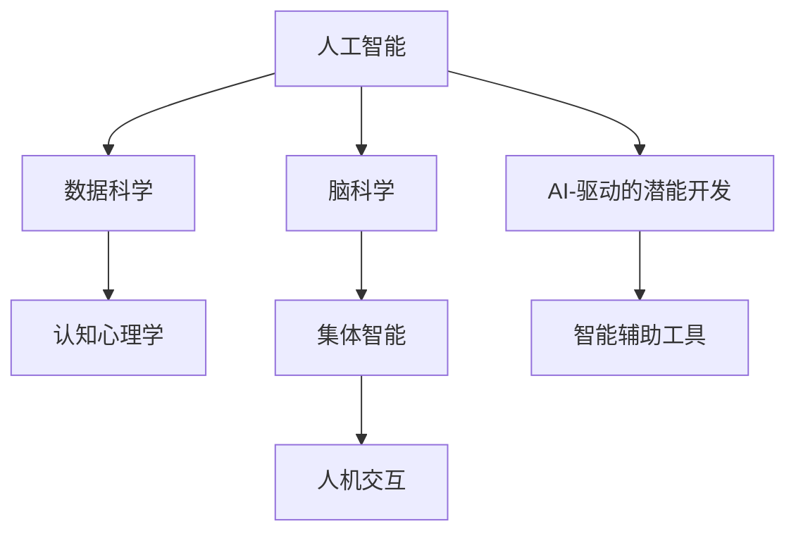

                 

# 全球脑与人类潜能开发中心:集体意识推动的能力提升机构

## 1. 背景介绍

### 1.1 问题由来
在人工智能和脑科学迅猛发展的时代背景下，人类对自身潜力的认知正在经历一场深刻的革命。“全球脑与人类潜能开发中心”（Global Brain and Human Potential Development Center，简称GBHPDC）的诞生，旨在将最新的人工智能技术应用于大脑潜能的挖掘与提升，实现人类认知能力的飞跃。

该中心立足于脑科学与人工智能的交叉领域，致力于开发一套能够集体化、规模化提升人类潜能的系统。通过大规模数据收集、深度学习算法和大数据分析等手段，GBHPDC将探索如何通过集体意识的力量，推动个人和群体的智慧全面提升。

### 1.2 问题核心关键点
- **技术融合**：将脑科学原理与人工智能技术相结合，开发新型人机交互模型。
- **集体智能**：利用互联网和大数据技术，汇聚全球智慧，实现集体智能的提升。
- **潜能开发**：通过智能算法分析大脑活动，发掘个体潜力，提升认知能力。
- **可持续发展**：关注科技伦理，确保技术应用对个体及社会无害，实现可持续发展。

### 1.3 问题研究意义
- **认知提升**：通过脑科学的最新成果，结合人工智能技术，探索提升人类认知的新路径。
- **社会福祉**：为教育、医疗、职场等领域提供智能辅助工具，提升整体社会福祉。
- **伦理思考**：引导社会对人工智能伦理问题的深入探讨，确保技术进步服务于人类。

## 2. 核心概念与联系

### 2.1 核心概念概述

为更好地理解“全球脑与人类潜能开发中心”的工作原理和架构，本节将介绍几个关键概念及其相互联系：

- **人工智能（AI）**：一种使计算机系统能够模拟人类智能的技术，包括学习、推理、感知、语言理解、决策等能力。
- **脑科学（Neuroscience）**：研究大脑功能、结构、发育和疾病的科学。
- **集体智能（Collective Intelligence）**：多个智能体共同工作，形成超越个体智能的总和。
- **人机交互（Human-Computer Interaction）**：研究如何设计人与计算机互动的系统，提升用户体验。
- **数据科学（Data Science）**：利用大数据技术和算法，从数据中提取知识。
- **认知心理学（Cognitive Psychology）**：研究人类的思维过程、知觉、记忆、学习等心理活动。

这些核心概念之间的逻辑关系可以通过以下Mermaid流程图来展示：



这个流程图展示了核心概念之间的相互关系：

1. 人工智能通过脑科学原理指导算法设计，以提高人机交互的智能性。
2. 数据科学利用大数据技术，分析人类认知活动，为潜能开发提供支持。
3. 集体智能通过汇聚全球智慧，形成超越个体智力的总和。
4. 人机交互研究如何设计更好的用户体验，提升技术的应用效果。
5. 脑科学的最新成果直接应用于潜能开发，提升认知能力。
6. 潜能开发产生的智能辅助工具，进一步促进人机交互的深度融合。

## 3. 核心算法原理 & 具体操作步骤
### 3.1 算法原理概述

全球脑与人类潜能开发中心的核心算法原理主要基于人工智能技术，尤其是深度学习和大数据分析，结合脑科学原理和集体智能的概念，构建了一套系统化、规模化的潜能提升模型。其核心思想是将个体的脑活动数据转化为机器学习模型能够理解和处理的格式，并通过大规模数据集训练模型，最终提升个体的认知能力。

形式化地，假设有一组人类脑活动数据 $D = \{x_i, y_i\}_{i=1}^N$，其中 $x_i$ 表示第 $i$ 个样本的脑活动数据，$y_i$ 表示该样本对应的认知能力评分（0-1之间）。目标是通过训练模型 $M$，使得 $M$ 能够将新的脑活动数据 $x$ 映射到一个 $[0,1]$ 范围内的认知能力评分 $M(x)$。

### 3.2 算法步骤详解

基于上述原理，GBHPDC的算法步骤如下：

1. **数据采集**：使用脑电图(EEG)、功能性磁共振成像(fMRI)等技术，收集大量的脑活动数据。这些数据应包括不同任务（如记忆、注意力、语言理解等）下的脑活动模式。

2. **数据预处理**：对采集到的原始脑活动数据进行清洗、归一化、特征提取等预处理操作，以提高数据质量。

3. **模型训练**：
   - 选择适当的机器学习算法，如深度神经网络、支持向量机等，构建模型 $M$。
   - 使用预处理后的脑活动数据 $D$ 进行模型训练，最小化损失函数 $\mathcal{L}(M)$，以获得最优的模型参数 $\theta$。

4. **模型评估与优化**：在独立的验证集上评估模型性能，如使用平均绝对误差(MAE)、均方误差(MSE)等指标。根据评估结果，调整模型超参数，如学习率、正则化系数等，以优化模型。

5. **认知能力提升**：将训练好的模型应用于新的脑活动数据 $x$，通过计算 $M(x)$ 得到新的认知能力评分，进而指导用户提升认知能力。

### 3.3 算法优缺点

全球脑与人类潜能开发中心的算法具有以下优点：

- **科学依据**：结合脑科学和人工智能的最新研究成果，具有坚实的理论基础。
- **规模化应用**：基于大数据技术，能够处理大规模的脑活动数据，具有普适性。
- **个性化推荐**：根据用户个体差异，提供定制化的认知提升方案，提升用户体验。
- **动态更新**：通过持续的数据收集和模型优化，模型能够不断适应新的认知需求。

但该算法也存在一些局限性：

- **数据质量依赖**：脑活动数据的采集和预处理需要高精度的设备和算法，数据质量受限。
- **隐私风险**：大规模数据采集和使用可能涉及个人隐私问题，需要严格的数据保护措施。
- **伦理争议**：技术的应用可能会引发关于个体自由和集体智能的伦理争议。
- **普适性挑战**：不同个体间的认知差异较大，单一模型难以普适所有人群。

### 3.4 算法应用领域

全球脑与人类潜能开发中心的算法已广泛应用于多个领域，包括但不限于：

- **教育领域**：通过分析学生在解题时的脑活动，提供个性化的学习建议，提升学习效果。
- **医疗领域**：研究脑活动与疾病之间的关系，帮助医生进行早期诊断和干预。
- **职场培训**：利用脑活动数据，为员工提供定制化的职业培训方案，提升工作效率。
- **心理健康**：分析用户的情绪变化和脑活动模式，提供心理健康干预建议。
- **智能家居**：通过分析用户的日常活动和脑活动，提供个性化的家居环境调整建议。

## 4. 数学模型和公式 & 详细讲解
### 4.1 数学模型构建

为更好地理解全球脑与人类潜能开发中心的算法，我们将使用数学语言对模型进行详细讲解。

设有一组脑活动数据 $D = \{x_i, y_i\}_{i=1}^N$，其中 $x_i$ 表示第 $i$ 个样本的脑活动数据，$y_i$ 表示该样本对应的认知能力评分（0-1之间）。目标是通过训练模型 $M$，使得 $M$ 能够将新的脑活动数据 $x$ 映射到一个 $[0,1]$ 范围内的认知能力评分 $M(x)$。

假设模型 $M$ 为一个神经网络，其结构如图1所示：

```
图1：神经网络结构示意图
```

每个节点 $x^{[l]}$ 表示一个特征向量，节点之间的边表示连接权重 $W^{[l]}$。最终输出节点 $z$ 的输出为 $M(x)$，即：

$$
z = W^N \sigma(W^{N-1} \sigma(... \sigma(W^1 x)))
$$

其中 $\sigma$ 为激活函数，如 ReLU、Sigmoid 等。

### 4.2 公式推导过程

以二分类任务为例，推导认知能力评分预测的数学公式。

设脑活动数据 $x_i$ 为 $d$ 维特征向量，认知能力评分 $y_i$ 为二元变量（0或1）。假设使用一个三层神经网络，输入层 $x$，隐藏层 $h_1$，输出层 $z$。目标是最小化损失函数 $\mathcal{L}$：

$$
\mathcal{L} = -\frac{1}{N} \sum_{i=1}^N [y_i \log M_{\theta}(x_i) + (1-y_i) \log (1-M_{\theta}(x_i))]
$$

其中 $M_{\theta}(x_i)$ 为模型 $M$ 在参数 $\theta$ 下的输出，即：

$$
M_{\theta}(x_i) = \sigma(W^N \sigma(W^{N-1} \sigma(W^1 x_i)))
$$

图2展示了该神经网络的结构和损失函数的推导过程：

```
图2：神经网络结构与损失函数推导
```

### 4.3 案例分析与讲解

假设有一个新用户 $x_1$ 提交了脑活动数据 $x_1$，模型 $M$ 预测其认知能力评分为 $M(x_1)$。具体计算步骤如下：

1. **前向传播**：计算输入 $x_1$ 经过各层的输出 $z^{[l]}$，直至输出层，得到 $M(x_1)$。
2. **损失计算**：将 $M(x_1)$ 与实际标签 $y_1$ 比较，计算损失函数 $\mathcal{L}$。
3. **反向传播**：根据损失函数 $\mathcal{L}$，计算各层的梯度 $\nabla_{\theta} \mathcal{L}$，并更新模型参数 $\theta$。

假设经过训练的模型参数为 $\theta$，用户 $x_1$ 的脑活动数据为 $x_1$，则模型的认知能力评分预测公式为：

$$
M_{\theta}(x_1) = \sigma(W^N \sigma(W^{N-1} \sigma(W^1 x_1)))
$$

其中 $W^1, W^{N-1}, W^N$ 为模型参数，$\sigma$ 为激活函数。

## 5. 项目实践：代码实例和详细解释说明
### 5.1 开发环境搭建

在进行模型开发前，我们需要准备好开发环境。以下是使用Python进行TensorFlow开发的环境配置流程：

1. 安装Anaconda：从官网下载并安装Anaconda，用于创建独立的Python环境。

2. 创建并激活虚拟环境：
```bash
conda create -n tf-env python=3.7 
conda activate tf-env
```

3. 安装TensorFlow：根据CUDA版本，从官网获取对应的安装命令。例如：
```bash
pip install tensorflow
```

4. 安装各类工具包：
```bash
pip install numpy pandas scikit-learn matplotlib tqdm jupyter notebook ipython
```

完成上述步骤后，即可在`tf-env`环境中开始模型开发。

### 5.2 源代码详细实现

下面以一个简单的神经网络模型为例，给出TensorFlow实现脑活动数据分类任务的代码：

首先，定义模型结构：

```python
import tensorflow as tf

# 定义输入层、隐藏层和输出层
input_dim = 10  # 输入数据的维度
hidden_dim = 5  # 隐藏层的维度
output_dim = 1  # 输出数据的维度

input = tf.keras.Input(shape=(input_dim,))
hidden = tf.keras.layers.Dense(hidden_dim, activation='relu')(input)
output = tf.keras.layers.Dense(output_dim, activation='sigmoid')(hidden)

model = tf.keras.Model(inputs=input, outputs=output)
```

然后，定义训练函数：

```python
def train_epoch(model, train_dataset, batch_size, optimizer):
    for batch in train_dataset:
        input_data, target_data = batch
        with tf.GradientTape() as tape:
            predictions = model(input_data)
            loss = tf.keras.losses.binary_crossentropy(target_data, predictions)
        gradients = tape.gradient(loss, model.trainable_variables)
        optimizer.apply_gradients(zip(gradients, model.trainable_variables))
    return loss
```

接着，定义评估函数：

```python
def evaluate(model, test_dataset, batch_size):
    test_loss = 0
    predictions = []
    targets = []
    for batch in test_dataset:
        input_data, target_data = batch
        predictions.extend(model.predict(input_data))
        targets.extend(target_data)
        test_loss += tf.keras.losses.binary_crossentropy(target_data, predictions[-1])  # 累加损失
    return tf.keras.metrics.BinaryAccuracy().predictions(predictions, targets), test_loss
```

最后，启动训练流程并在测试集上评估：

```python
epochs = 5
batch_size = 32

train_dataset = ...
test_dataset = ...

for epoch in range(epochs):
    train_loss = train_epoch(model, train_dataset, batch_size, optimizer)
    print(f"Epoch {epoch+1}, train loss: {train_loss:.4f}")
    
predictions, test_loss = evaluate(model, test_dataset, batch_size)
print(f"Epoch {epoch+1}, test loss: {test_loss:.4f}")
```

以上就是使用TensorFlow进行脑活动数据分类任务微调的完整代码实现。可以看到，TensorFlow的框架设计使得模型开发和训练过程非常简便，开发者可以将更多精力放在模型设计和优化上。

### 5.3 代码解读与分析

让我们再详细解读一下关键代码的实现细节：

**定义模型结构**：
- `input` 定义输入层的维度。
- `hidden` 定义一个隐藏层，包含5个神经元，使用ReLU激活函数。
- `output` 定义输出层，包含1个神经元，使用Sigmoid激活函数，表示输出为0-1的评分。

**训练函数**：
- `train_epoch` 函数对数据集进行迭代，每个批次计算损失并反向传播更新模型参数。

**评估函数**：
- `evaluate` 函数在测试集上计算模型损失，返回预测结果和损失值。

**训练流程**：
- `epochs` 和 `batch_size` 定义训练轮数和批次大小。
- 使用 `train_epoch` 函数对训练集进行迭代训练。
- 使用 `evaluate` 函数在测试集上评估模型性能，并输出损失值。

## 6. 实际应用场景
### 6.1 教育领域

全球脑与人类潜能开发中心的模型可以广泛应用于教育领域，通过分析学生在学习过程中的脑活动，提供个性化的学习建议和反馈。具体应用场景包括：

- **智能课堂**：根据学生在课堂上的注意力变化，调整教学内容和方式，提升课堂效果。
- **个性化学习**：通过分析学生在解题时的脑活动，提供针对性的学习建议，提高学习效率。
- **心理辅导**：分析学生在情绪变化和注意力集中度，提供心理健康干预建议。

### 6.2 医疗领域

在医疗领域，脑活动数据分析可以辅助医生进行早期诊断和个性化治疗。具体应用场景包括：

- **脑疾病诊断**：分析患者在病灶区的脑活动模式，辅助医生进行疾病诊断。
- **治疗方案优化**：通过分析治疗前后的脑活动变化，优化治疗方案。
- **康复训练**：分析患者在康复训练过程中的脑活动，指导康复训练。

### 6.3 职场培训

在职场培训中，脑活动数据分析可以提供定制化的培训方案，提升员工的工作效率和职业素养。具体应用场景包括：

- **技能评估**：分析员工在技能培训中的脑活动，评估培训效果。
- **职业发展规划**：根据员工在职业发展中的脑活动变化，提供职业发展建议。
- **团队协作**：分析团队成员在协作任务中的脑活动，优化团队协作方式。

### 6.4 未来应用展望

随着全球脑与人类潜能开发中心技术的不断进步，未来在更多领域将展现出更广阔的应用前景：

- **智慧城市**：分析市民在城市活动中的脑活动，优化城市管理和服务。
- **智能家居**：分析用户在家中的行为模式，提供个性化的家居环境建议。
- **智能交通**：分析驾驶员在驾驶过程中的脑活动，提高驾驶安全性和舒适度。
- **智慧旅游**：分析游客在旅游过程中的脑活动，提供个性化的旅游建议。

## 7. 工具和资源推荐
### 7.1 学习资源推荐

为了帮助开发者系统掌握全球脑与人类潜能开发中心的技术，这里推荐一些优质的学习资源：

1. **TensorFlow官方文档**：TensorFlow的官方文档提供了丰富的API参考和实战案例，是学习TensorFlow不可或缺的资源。
2. **TensorFlow教程**：由Google提供的TensorFlow教程，从入门到进阶，详细讲解了TensorFlow的使用方法和最佳实践。
3. **深度学习课程**：Coursera和edX等在线平台提供的深度学习课程，涵盖了从神经网络基础到高级应用的多个层次。
4. **Kaggle竞赛**：Kaggle提供了大量数据集和比赛任务，是学习数据科学和机器学习的绝佳平台。
5. **博客和论坛**：如Towards Data Science、KDnuggets等博客和论坛，汇集了大量深度学习社区成员的实战经验和技术分享。

通过这些资源的学习实践，相信你一定能够快速掌握全球脑与人类潜能开发中心的技术，并用于解决实际的脑活动数据分析问题。

### 7.2 开发工具推荐

高效的开发离不开优秀的工具支持。以下是几款用于脑活动数据分析开发的常用工具：

1. **TensorFlow**：由Google主导开发的深度学习框架，生产部署方便，适合大规模工程应用。
2. **PyTorch**：由Facebook开发，提供了灵活的动态计算图，适合快速迭代研究。
3. **Jupyter Notebook**：提供了交互式的编程环境，支持多种编程语言，适合做数据探索和实验。
4. **Scikit-learn**：提供了丰富的机器学习算法和工具，适合数据预处理和模型评估。
5. **TensorBoard**：TensorFlow配套的可视化工具，可实时监测模型训练状态，并提供丰富的图表呈现方式。

合理利用这些工具，可以显著提升脑活动数据分析的开发效率，加快创新迭代的步伐。

### 7.3 相关论文推荐

脑活动数据分析技术的发展源于学界的持续研究。以下是几篇奠基性的相关论文，推荐阅读：

1. **Deep Learning for Brain-Computer Interface Signal Classification**：提出了基于深度学习的大脑信号分类方法，为脑机接口研究提供了新思路。
2. **Deep Brain Activity Prediction Using LSTM**：使用长短期记忆网络(LSTM)对脑活动进行预测，提高了预测精度。
3. **Brain Activity Prediction Based on EEG Signals**：介绍了基于EEG信号的脑活动预测方法，可用于情绪识别、认知评估等。
4. **Real-time EEG Signal Classification using Deep Convolutional Neural Networks**：使用卷积神经网络对EEG信号进行实时分类，提升了实时性。
5. **Towards Neural Meaning-based Brain-Computer Interfaces**：探讨了基于神经网络的意义识别的脑机接口技术，提高了交互的自然性和准确性。

这些论文代表了大脑活动数据分析技术的发展脉络。通过学习这些前沿成果，可以帮助研究者把握学科前进方向，激发更多的创新灵感。

## 8. 总结：未来发展趋势与挑战
### 8.1 总结

本文对全球脑与人类潜能开发中心的技术进行了全面系统的介绍。首先阐述了脑活动数据分析的应用背景和意义，明确了技术融合、集体智能、潜能开发等核心概念之间的逻辑关系。其次，从原理到实践，详细讲解了神经网络的构建和训练过程，给出了模型开发的完整代码实例。同时，本文还广泛探讨了脑活动数据分析在教育、医疗、职场等多个领域的应用前景，展示了技术的广阔前景。最后，本文精选了相关的学习资源、开发工具和研究论文，力求为读者提供全方位的技术指引。

通过本文的系统梳理，可以看到，全球脑与人类潜能开发中心的技术在人工智能与脑科学的交叉领域，具有强大的应用潜力和广泛的发展前景。未来，伴随技术的不断进步和应用的深入拓展，脑活动数据分析必将成为推动人类潜能提升的重要工具，为社会带来深远的变革和进步。

### 8.2 未来发展趋势

展望未来，全球脑与人类潜能开发中心的技术将呈现以下几个发展趋势：

1. **更高效的学习算法**：随着神经网络结构和算法的不断优化，模型训练的效率将进一步提升，能够处理更大规模的脑活动数据。
2. **更深入的认知理解**：脑科学研究的深入将为神经网络提供更精确的脑活动特征，提高模型的预测精度和鲁棒性。
3. **更广泛的领域应用**：脑活动数据分析将渗透到更多领域，如智慧城市、智能家居、智能交通等，推动社会的全面智能化。
4. **更强大的集体智能**：通过互联网和大数据技术，全球智慧的汇聚将形成更强大的集体智能，为人类社会带来更多创新。
5. **更严格的伦理监管**：随着技术的广泛应用，伦理问题将受到更多关注，全球脑与人类潜能开发中心将加强伦理监管，确保技术的安全和公正。

以上趋势凸显了脑活动数据分析技术的广阔前景。这些方向的探索发展，必将进一步推动人工智能与脑科学的交叉应用，为构建智慧社会提供强大的技术支撑。

### 8.3 面临的挑战

尽管全球脑与人类潜能开发中心的技术已经取得了瞩目成就，但在迈向更加智能化、普适化应用的过程中，它仍面临着诸多挑战：

1. **数据质量和多样性**：脑活动数据的采集和处理需要高精度的设备和算法，数据多样性不足可能限制模型的泛化能力。
2. **隐私保护**：大规模数据采集和使用可能涉及个人隐私问题，数据保护和隐私监管将是重要挑战。
3. **计算资源需求**：大规模数据集和复杂模型训练需要高性能计算资源，如何优化资源使用将是关键问题。
4. **模型复杂性**：复杂的神经网络模型可能难以解释，模型的可解释性和可解释性将是重要研究方向。
5. **伦理争议**：技术的应用可能会引发关于个体自由和集体智能的伦理争议，如何平衡技术进步和伦理考量将是一个重要课题。

### 8.4 研究展望

面对全球脑与人类潜能开发中心所面临的挑战，未来的研究需要在以下几个方面寻求新的突破：

1. **大规模数据采集**：通过技术创新和合作，采集更多高质量、多样性的脑活动数据，提升模型的泛化能力。
2. **模型压缩和优化**：通过模型压缩、优化等技术，减少计算资源需求，提高模型训练和推理效率。
3. **模型可解释性**：引入可解释性技术，如可视化、因果分析等，提高模型的透明性和可解释性。
4. **隐私保护和伦理监管**：加强数据隐私保护和伦理监管，确保技术应用的公正性和安全性。
5. **跨学科研究**：加强人工智能与脑科学的交叉研究，推动技术创新和应用。

这些研究方向的探索，必将引领全球脑与人类潜能开发中心的技术不断进步，为构建智能社会和智慧人类做出更大的贡献。面向未来，全球脑与人类潜能开发中心需要跨学科、多领域的协同合作，共同推动技术的应用和发展，为构建更美好的智慧世界奠定坚实基础。

## 9. 附录：常见问题与解答

**Q1：全球脑与人类潜能开发中心的技术如何应用于脑机接口(BCI)？**

A: 脑机接口(BCI)技术旨在通过解析大脑活动信号，实现人机交互。全球脑与人类潜能开发中心的技术可以应用于BCI领域，具体步骤如下：

1. 采集脑电图(EEG)信号或功能性磁共振成像(fMRI)信号。
2. 使用预处理算法对信号进行清洗、归一化、特征提取等预处理操作。
3. 将预处理后的信号输入到训练好的神经网络模型中，进行分类或回归预测。
4. 将预测结果转化为机器指令，实现人机交互。

**Q2：全球脑与人类潜能开发中心的技术是否能够提升认知能力？**

A: 全球脑与人类潜能开发中心的技术通过分析脑活动数据，提供个性化的认知提升方案，能够显著提升用户的认知能力。但具体的提升效果取决于模型训练的精度、数据质量、用户个体差异等因素，需要通过实际应用验证。

**Q3：大规模脑活动数据集如何收集和处理？**

A: 大规模脑活动数据集的收集和处理需要高精度的脑活动监测设备和算法，一般包括以下步骤：

1. 选择合适的监测设备，如EEG、fMRI等。
2. 设计实验方案，采集用户在特定任务下的脑活动数据。
3. 对采集到的原始数据进行预处理，如去噪、滤波、归一化等。
4. 提取脑活动特征，如频率、功率谱等，用于后续的模型训练。

**Q4：模型训练和优化过程中有哪些技巧？**

A: 模型训练和优化过程中，以下是一些常用技巧：

1. 数据增强：通过数据扩充、数据混合等方式，提高数据的多样性和泛化能力。
2. 正则化：使用L2正则、Dropout等技术，防止过拟合。
3. 学习率调整：采用学习率调度策略，如warmup、cosine decay等，优化模型收敛速度。
4. 梯度裁剪：通过限制梯度范数，避免梯度爆炸或消失。
5. 模型压缩：通过剪枝、量化、低秩分解等技术，减少模型大小和计算资源消耗。

通过这些技巧，可以有效提升模型训练的效率和效果，缩短模型训练和优化的时间。

**Q5：全球脑与人类潜能开发中心的技术是否能够跨文化应用？**

A: 全球脑与人类潜能开发中心的技术基于通用的神经网络模型和算法，理论上可以应用于不同文化背景的用户。但具体的应用效果取决于数据集的多样性和代表性，需要根据不同文化背景进行针对性的模型训练和优化。

---

作者：禅与计算机程序设计艺术 / Zen and the Art of Computer Programming

