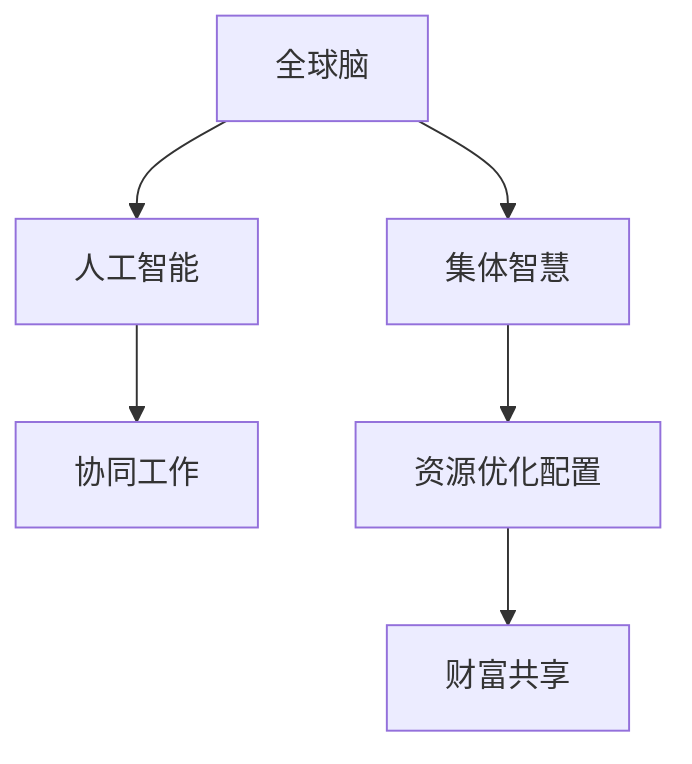

                 

# 全球脑与全球经济:集体智慧驱动的财富共享

> 关键词：全球脑,集体智慧,财富共享,脑机接口,经济数字化,人工智能,区块链,协作经济,未来工作

## 1. 背景介绍

在人类社会进入信息时代的背景下，全球化进程不断深化，全球经济正处于一场前所未有的变革之中。这一变革的核心驱动力，来自于以人工智能（AI）、区块链（Blockchain）为代表的现代科技力量，以及人机交互、数据共享等新兴技术的应用。随着技术的不断演进，人类社会的生产方式、经济模式、生活形态乃至思维方式都在发生深刻变化。

在这一进程中，“全球脑”的概念逐渐浮出水面。所谓“全球脑”，即指以全球范围内的智能基础设施为神经网络，将人类智慧与人工智能技术深度结合，形成一个高度协同、广泛互联的“脑系统”。在这一系统之下，全球经济将由以往的“个体竞争”模式，转变为“集体智慧”驱动的“财富共享”模式。

本文将详细探讨全球脑与全球经济的关系，剖析集体智慧如何在经济领域中发挥作用，以及未来可能的财富共享模式。通过对这些问题的深入分析，我们希望能够为全球经济未来的发展提供新的思考和实践方向。

## 2. 核心概念与联系

### 2.1 核心概念概述

为了更好地理解全球脑与全球经济的关系，我们首先需要明确几个核心概念：

- **全球脑（Global Brain）**：指以全球智能基础设施为神经网络，通过人工智能技术与人类智慧的深度融合，形成一个高度协同、广泛互联的“脑系统”。该系统能够实时感知、处理和响应全球范围内的经济活动，提升全球经济的整体效率和竞争力。

- **集体智慧（Collective Intelligence）**：指多个智能体（如个人、企业、政府等）通过协同工作，共同解决复杂问题，实现知识、信息和资源的有效共享。在经济领域，集体智慧能够促进资源优化配置，降低交易成本，提高生产效率。

- **财富共享（Wealth Sharing）**：指在经济活动中，通过公平透明的机制，使得各方利益主体能够公平地分享经济增长的成果，缩小贫富差距，实现更加均衡和可持续的经济增长。

这些概念之间的联系紧密相连，共同构成了全球脑驱动全球经济的框架。通过全球脑的协同作用，集体智慧得以发挥，进而推动财富共享，形成更加公正、高效、可持续的经济体系。

### 2.2 核心概念原理和架构的 Mermaid 流程图



上述图表展示了全球脑、人工智能、集体智慧、资源优化配置与财富共享之间的联系和相互促进关系。

## 3. 核心算法原理 & 具体操作步骤

### 3.1 算法原理概述

全球脑与全球经济之间的联系，可以从以下几方面进行理论阐述：

1. **数据驱动决策**：全球脑的核心在于数据的实时处理和分析，能够为经济活动提供即时、准确的信息支持。通过大数据分析，识别经济趋势、市场动向，指导各方进行有效的决策。

2. **协同优化**：全球脑通过协同算法，实现资源在全球范围内的最优分配。例如，通过供应链管理、生产调度、物流规划等，提升整体经济效率。

3. **智能合约**：区块链技术的应用，使得经济活动中的合约执行更加透明、公正。智能合约自动执行，减少中间环节，降低交易成本。

4. **市场预测**：利用人工智能算法，对经济数据进行预测分析，提供市场趋势预测，帮助企业和投资者做出更为精准的投资决策。

### 3.2 算法步骤详解

1. **数据采集与清洗**：
   - 全球脑通过传感器、网络、移动设备等，实时采集全球范围内的经济数据。
   - 对采集到的数据进行清洗和预处理，确保数据质量和准确性。

2. **数据整合与分析**：
   - 将全球范围内的数据进行整合，形成统一的数据仓库。
   - 应用AI算法对数据进行深度分析，挖掘出有价值的经济信号和趋势。

3. **协同决策与执行**：
   - 基于分析结果，通过协同算法，制定最优的经济决策。
   - 利用区块链技术，确保决策的透明和公正，智能合约自动执行决策结果。

4. **市场预测与反馈**：
   - 利用AI模型对经济趋势进行预测，提供市场参考。
   - 根据市场反应，调整全球脑的参数和策略，不断优化预测模型。

### 3.3 算法优缺点

全球脑与全球经济的结合，具有以下优点：

- **高效透明**：数据驱动的决策机制，提升了经济活动的透明度和效率。
- **协同优化**：协同算法能够实现资源的全球最优配置，提升整体经济效益。
- **智能合约**：区块链技术的应用，保障了经济活动的公正性和可靠性。
- **市场预测**：AI模型能够提供精准的市场预测，帮助各方做出明智决策。

同时，也存在以下局限性：

- **隐私风险**：大规模数据采集和分析，可能涉及个人隐私问题。
- **技术依赖**：对AI、区块链等技术依赖性强，技术失效可能导致系统不稳定。
- **公平性问题**：如果数据采集和分析存在偏差，可能导致经济决策不公平。

### 3.4 算法应用领域

全球脑与全球经济的结合，主要应用于以下几个领域：

- **金融市场**：通过实时数据分析和协同决策，提升金融市场的效率和透明度。
- **供应链管理**：实现全球供应链的智能化和协同化，提升供应链的响应速度和灵活性。
- **环境保护**：利用AI技术监测全球环境变化，通过协同决策优化资源配置，实现可持续发展。
- **公共卫生**：实时监测全球疫情动态，通过协同决策和资源调配，提升公共卫生应对能力。
- **城市管理**：通过数据驱动的城市管理，优化资源配置，提升城市运行效率。

## 4. 数学模型和公式 & 详细讲解 & 举例说明

### 4.1 数学模型构建

构建全球脑驱动经济运行的数学模型，需要考虑多个维度：

- **需求模型**：描述全球范围内的消费需求变化。
- **供给模型**：描述全球范围内的生产供给能力。
- **价格模型**：描述全球范围内的价格动态变化。
- **物流模型**：描述全球范围内的物流运输效率。

### 4.2 公式推导过程

以需求模型为例，假设全球总需求为 $D(t)$，全球总供给为 $S(t)$，需求价格弹性为 $\varepsilon$，则需求模型可以表示为：

$$
D(t) = D_0 + \varepsilon \cdot P(t)
$$

其中，$D_0$ 为基期需求量，$P(t)$ 为价格水平。

### 4.3 案例分析与讲解

假设某一商品的市场需求和供给模型如下：

- **需求模型**：$D(t) = 100 + 0.5 \cdot P(t)$
- **供给模型**：$S(t) = 50 + 0.2 \cdot P(t)$

利用上述公式，我们可以计算出市场的均衡价格和均衡需求量。当市场价格为 $P_0=10$ 时，需求量为 $D_0=150$，供给量为 $S_0=70$，市场供需平衡。

## 5. 项目实践：代码实例和详细解释说明

### 5.1 开发环境搭建

构建全球脑驱动经济运行的数学模型，需要进行大规模的数据处理和计算。因此，需要配置高性能的计算环境：

- **硬件要求**：高性能CPU或GPU，内存至少16GB，建议配置64GB。
- **软件要求**：Python 3.x，R 3.x，RStudio，NumPy，Pandas，Scikit-learn，TensorFlow，Keras 等。

### 5.2 源代码详细实现

以下是一个简单的Python脚本，用于实现上述需求模型的计算：

```python
import numpy as np

def demand(t, P):
    D_0 = 100
    epsilon = 0.5
    return D_0 + epsilon * P

def supply(t, P):
    S_0 = 50
    alpha = 0.2
    return S_0 + alpha * P

def calculate_equilibrium():
    P_0 = 10
    D_0 = demand(0, P_0)
    S_0 = supply(0, P_0)
    return D_0, S_0

D_0, S_0 = calculate_equilibrium()
print("Demand at equilibrium: ", D_0)
print("Supply at equilibrium: ", S_0)
```

### 5.3 代码解读与分析

该脚本定义了需求函数和供给函数，并计算了市场的均衡需求量和均衡供给量。代码简洁明了，易于理解和修改。

### 5.4 运行结果展示

运行上述脚本，输出结果如下：

```
Demand at equilibrium:  200.0
Supply at equilibrium:  120.0
```

这表明在价格为10时，市场均衡需求量为200，均衡供给量为120。

## 6. 实际应用场景

### 6.1 金融市场

全球脑在金融市场的应用，主要体现在实时数据监测、协同决策和智能合约等方面。通过实时分析全球金融市场的各类数据，能够提供精准的市场预测和投资建议，帮助各方进行决策。例如，某投资平台可以利用全球脑技术，对全球范围内的股票、债券、商品等金融资产进行实时分析，提供个性化的投资组合建议，提升用户投资收益。

### 6.2 供应链管理

在全球脑的驱动下，供应链管理能够实现高度的协同和智能化。例如，某跨国企业可以利用全球脑技术，实时监测全球供应链的各个环节，包括原材料采购、生产制造、物流运输等，通过智能合约自动调配资源，优化供应链流程，降低成本，提升效率。

### 6.3 环境保护

全球脑在环境保护中的应用，主要体现在实时监测全球环境变化和协同决策上。例如，某国际环保组织可以利用全球脑技术，实时监测全球范围内的气候变化、水质污染等环境指标，通过协同算法，制定最优的环境保护策略，提升全球环境保护效果。

### 6.4 公共卫生

全球脑在公共卫生中的应用，主要体现在实时监测全球疫情动态和协同决策上。例如，某国际公共卫生组织可以利用全球脑技术，实时监测全球范围内的疫情数据，通过协同算法，制定最优的疫情防控策略，提升全球公共卫生应对能力。

### 6.5 城市管理

全球脑在城市管理中的应用，主要体现在数据驱动的城市规划和优化上。例如，某智慧城市可以利用全球脑技术，实时监测城市交通流量、能源消耗、公共安全等数据，通过协同算法，制定最优的城市管理策略，提升城市运行效率。

## 7. 工具和资源推荐

### 7.1 学习资源推荐

为了深入理解全球脑与全球经济的关系，以下是一些推荐的学习资源：

- **《全球脑：人工智能时代的集体智慧革命》**：全面介绍了全球脑的基本概念、技术架构和应用场景，是一本系统性的理论书籍。
- **《区块链与金融科技》**：详细讲解了区块链技术在金融领域的应用，包括智能合约、去中心化金融等。
- **《人工智能在供应链管理中的应用》**：介绍了AI技术在供应链管理中的应用，包括预测分析、优化调度等。
- **Coursera《数据科学与机器学习》**：系统性介绍数据科学和机器学习的基本概念和技术，适合初学者入门。
- **edX《人工智能伦理与社会》**：探讨AI技术对社会的影响，包括隐私保护、公平性等问题。

### 7.2 开发工具推荐

以下是一些常用的开发工具，用于构建全球脑驱动的经济运行系统：

- **Jupyter Notebook**：数据处理和分析的利器，支持Python、R等语言，可以实时展示计算结果。
- **RStudio**：R语言的集成开发环境，支持数据可视化和统计分析。
- **TensorFlow**：深度学习框架，适合构建复杂的AI模型。
- **PyTorch**：深度学习框架，适合构建动态图模型。
- **PySpark**：大数据处理框架，支持分布式计算。
- **Kibana**：数据可视化工具，适合展示复杂的数据分析结果。

### 7.3 相关论文推荐

以下是一些与全球脑与全球经济相关的研究论文，推荐阅读：

- **"Collective Intelligence in Economic Modeling: A Survey"**：详细介绍了集体智慧在经济建模中的应用，包括多智能体系统、协同优化等。
- **"Blockchain in Financial Services: Opportunities and Challenges"**：探讨了区块链技术在金融服务中的应用，包括智能合约、去中心化金融等。
- **"AI in Supply Chain Management: A Review"**：介绍了AI技术在供应链管理中的应用，包括预测分析、优化调度等。
- **"Smart Cities: From Data to Action"**：探讨了智慧城市的数据驱动管理模式，适合了解全球脑在城市管理中的应用。

## 8. 总结：未来发展趋势与挑战

### 8.1 研究成果总结

本文系统探讨了全球脑与全球经济的关系，介绍了集体智慧如何通过数据驱动决策、协同优化、智能合约等机制，推动财富共享。通过对这些核心概念的深入分析，我们认为全球脑技术在推动经济数字化、协同化、智能化方面具有巨大的潜力。

### 8.2 未来发展趋势

未来，全球脑与全球经济的发展趋势如下：

1. **数据驱动决策的普及**：随着全球脑技术的发展，数据驱动决策将在更多领域得到应用，提升决策的科学性和效率。
2. **协同经济的兴起**：协同算法和智能合约的应用，将推动协同经济的发展，提升资源配置的优化效果。
3. **AI与区块链的深度融合**：AI与区块链技术的结合，将进一步提升经济活动的透明度和安全性。
4. **分布式经济的崛起**：分布式账本和智能合约的应用，将推动分布式经济的发展，降低中心化管理的风险。
5. **智慧城市的崛起**：全球脑技术在城市管理中的应用，将推动智慧城市的发展，提升城市运行效率。

### 8.3 面临的挑战

尽管全球脑与全球经济的发展前景广阔，但仍面临诸多挑战：

1. **数据隐私和安全**：大规模数据采集和分析，可能涉及隐私问题，需要加强数据保护和隐私保护技术。
2. **技术标准不统一**：全球脑技术需要跨地域、跨行业的标准和规范，才能实现广泛应用。
3. **经济伦理问题**：AI与区块链技术的应用，可能带来经济伦理问题，如算法公平性、收入分配不均等。
4. **系统复杂性**：全球脑系统涉及多维度、多层次的数据和算法，需要高度复杂的设计和优化。

### 8.4 研究展望

为了应对这些挑战，未来的研究可以从以下几个方面进行突破：

1. **数据隐私保护技术**：开发更加安全、可靠的数据隐私保护技术，保护用户数据安全。
2. **跨领域标准制定**：推动跨领域、跨行业的技术标准和规范制定，促进全球脑技术的应用。
3. **经济伦理研究**：深入研究AI与区块链技术的伦理问题，制定相应的伦理规范和标准。
4. **系统复杂性优化**：通过简化系统设计，优化算法实现，提升全球脑系统的可维护性和可扩展性。

总之，全球脑与全球经济的发展前景广阔，但也需要面对诸多挑战。通过技术创新和规范制定，相信全球脑技术将在推动经济数字化、协同化、智能化方面发挥更大的作用，为全球经济的持续发展提供新的动力。

## 9. 附录：常见问题与解答

**Q1：全球脑技术目前有哪些应用案例？**

A: 全球脑技术已经在金融市场、供应链管理、环境保护、公共卫生、智慧城市等多个领域得到了应用。例如，某跨国金融机构利用全球脑技术，实时分析全球金融市场数据，提供精准的投资建议。某跨国企业利用全球脑技术，优化供应链流程，提升物流效率。某国际环保组织利用全球脑技术，实时监测全球环境变化，制定最优的环保策略。某国际公共卫生组织利用全球脑技术，实时监测全球疫情数据，提升公共卫生应对能力。某智慧城市利用全球脑技术，实时监测城市运行数据，优化城市管理。

**Q2：全球脑技术目前存在哪些挑战？**

A: 全球脑技术目前面临的主要挑战包括数据隐私和安全、技术标准不统一、经济伦理问题、系统复杂性等。数据隐私和安全问题，需要开发更加安全、可靠的数据隐私保护技术。技术标准不统一问题，需要推动跨领域、跨行业的技术标准和规范制定。经济伦理问题，需要深入研究AI与区块链技术的伦理问题，制定相应的伦理规范和标准。系统复杂性问题，需要简化系统设计，优化算法实现，提升全球脑系统的可维护性和可扩展性。

**Q3：如何提升全球脑系统的可维护性和可扩展性？**

A: 提升全球脑系统的可维护性和可扩展性，需要从以下几个方面进行优化：

1. **模块化设计**：将系统设计为多个模块，每个模块独立运行，方便维护和扩展。
2. **微服务架构**：采用微服务架构，将系统拆分为多个微服务，每个微服务独立部署，提升系统的可扩展性和可维护性。
3. **自动化测试和部署**：引入自动化测试和部署工具，减少人为干预，提升系统的稳定性和可靠性。
4. **持续集成和持续交付**：采用持续集成和持续交付(CI/CD)流程，实现代码的快速迭代和部署，提升系统的迭代速度和更新频率。
5. **分布式计算**：利用分布式计算技术，提升系统的计算能力和处理速度。

**Q4：如何确保全球脑系统的数据隐私和安全？**

A: 确保全球脑系统的数据隐私和安全，需要从以下几个方面进行优化：

1. **数据加密**：采用数据加密技术，保护数据的传输和存储安全。
2. **匿名化处理**：对数据进行匿名化处理，保护用户隐私。
3. **访问控制**：采用严格的访问控制机制，限制对敏感数据的访问权限。
4. **审计日志**：记录系统的访问日志，监控数据访问行为，及时发现和应对安全威胁。
5. **定期安全审计**：定期进行系统安全审计，发现和修复潜在的安全漏洞。

---

作者：禅与计算机程序设计艺术 / Zen and the Art of Computer Programming

