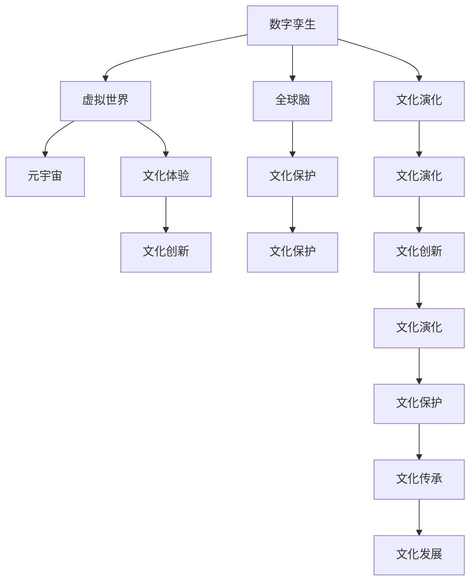

                 

# 全球脑与全球脑:数字孪生技术在文化研究中的应用

> 关键词：数字孪生, 文化研究, 全球脑, 虚拟世界, 社交网络, 元宇宙, 文化演化, 文化保护

## 1. 背景介绍

### 1.1 问题由来
随着数字技术的飞速发展，尤其是物联网(IoT)、大数据、云计算、人工智能(AI)等技术的日趋成熟，数字孪生技术成为了现代科技领域的一个热点。数字孪生是指在虚拟空间中构建与现实物理系统等效的数字化模型，其可以实时反映和预测物理系统的运行状态，进而支持优化决策、故障预测、智能控制等。这一技术正逐步被应用于工业制造、城市规划、交通管理、智慧医疗等领域，并取得了显著的成效。

数字孪生技术不仅限于物理系统的数字化复制，更是一个跨学科的创新技术范式，能够跨越不同的领域实现信息的实时同步和数据的融合。这一特点使其在文化研究领域具有巨大的潜力，可以重新构建和理解人类社会、艺术、文化等多方面的知识结构，为文化保护、传承和创新提供强有力的技术支持。

### 1.2 问题核心关键点
数字孪生技术在文化研究中的应用，关键在于以下几个方面：
- **数据采集与集成**：如何高效、全面地采集和整合跨时空、跨文化的多样化数据。
- **数据建模与分析**：如何在虚拟空间中构建与现实文化相匹配的模型，并进行深入的分析。
- **数据驱动的文化演化**：如何通过数字孪生技术实时模拟和预测文化现象的演化趋势。
- **虚拟文化的呈现与互动**：如何在虚拟世界中真实地再现和交互文化现象，增强用户体验。
- **文化的保护与创新**：如何利用数字孪生技术进行文化遗产的保护，以及推动文化的创新和发展。

这些核心关键点共同构成了数字孪生技术在文化研究中的应用框架，为深入探索文化现象、保护和传承文化遗产提供了新的技术路径。

### 1.3 问题研究意义
数字孪生技术在文化研究中的应用具有重要的研究意义：

1. **文化保护的数字化手段**：数字孪生技术能够实现文化的数字化保存，避免自然和人为因素对文化遗产的损害，促进文化遗产的永久保存。
2. **文化传承的新路径**：通过虚拟世界中的文化展示和互动，使年轻一代更好地理解和学习传统文化的精髓，增强文化认同感。
3. **文化创新与发展**：数字孪生技术可以为文化创新提供新的工具和方法，推动文化的跨界融合和创新发展，丰富文化表现形式。
4. **文化研究的深化**：数字孪生技术能够提供大规模、高精度、动态的文化数据，促进文化研究的多角度、深入探索，提升研究的科学性和实证性。
5. **文化体验的增强**：通过虚拟现实(VR)、增强现实(AR)等技术，数字孪生技术可以提供沉浸式的文化体验，增强公众对文化的兴趣和参与度。

数字孪生技术在文化研究中的应用，不仅是对现有研究方法的补充，更是对文化保护、传承、创新等各个环节的全面升级，具有深远的学术价值和社会意义。

## 2. 核心概念与联系

### 2.1 核心概念概述

为更好地理解数字孪生技术在文化研究中的应用，本节将介绍几个密切相关的核心概念：

- **数字孪生(Digital Twin)**：在虚拟空间中构建的物理系统等效模型，可以实时反映和预测物理系统的运行状态。
- **全球脑(Global Brain)**：将全球数据集、社交网络、文化现象等看作整体，构建的大规模、跨领域的数据网络。
- **虚拟世界(Virtual World)**：通过虚拟现实技术构建的数字化空间，可以模拟和再现现实世界中的各种现象。
- **元宇宙(Metaverse)**：基于虚拟世界的更高级概念，强调虚拟空间中的真实互动和共生共荣。
- **文化演化(Cultural Evolution)**：文化现象随时间演变的规律和机制，通过数据分析和模拟得以揭示。
- **文化保护(Cultural Preservation)**：通过技术手段，对文化遗产进行记录、保存、修复和管理，防止其消亡。

这些核心概念之间的逻辑关系可以通过以下Mermaid流程图来展示：



这个流程图展示了几类核心概念之间的相互关系：
- 数字孪生技术为虚拟世界的构建提供了基础，而虚拟世界则是元宇宙的基础。
- 全球脑通过数据的集成和分析，为文化演化提供了支撑。
- 文化保护是文化演化的一部分，元宇宙中的文化创新也是文化演化的结果。
- 文化演化、保护、传承与创新互为因果，共同推动文化的进步和发展。

## 3. 核心算法原理 & 具体操作步骤
### 3.1 算法原理概述

数字孪生技术在文化研究中的应用，本质上是一个跨学科的数字化转型过程。其核心算法原理可以概括为以下几点：

- **数据采集与集成**：利用物联网、传感器、大数据等技术，全面采集和集成文化相关的各种数据。
- **数据建模与分析**：在虚拟空间中构建文化现象的数字模型，并通过机器学习和数据分析技术进行深入挖掘和理解。
- **数据驱动的文化演化**：使用预测模型和仿真技术，实时模拟和预测文化现象的演化趋势。
- **虚拟文化的呈现与互动**：通过虚拟现实、增强现实等技术，在虚拟世界中真实地再现和交互文化现象。
- **文化的保护与创新**：利用数字化技术对文化遗产进行保护，并通过数字孪生技术推动文化的创新发展。

这些算法原理共同构成了数字孪生技术在文化研究中的应用基础，为深入探索和理解文化现象提供了新的技术路径。

### 3.2 算法步骤详解

数字孪生技术在文化研究中的应用，一般包括以下几个关键步骤：

**Step 1: 数据采集与预处理**
- 选择合适的数据源，包括文献、图像、音频、视频、社交媒体等。
- 使用传感器、物联网设备等采集相关数据。
- 对采集到的数据进行预处理，包括清洗、去噪、归一化等。

**Step 2: 数据建模与分析**
- 使用深度学习、机器学习等技术，构建文化现象的虚拟模型。
- 利用文本分析、情感分析、图像识别等技术，分析模型的输出结果。
- 通过回归分析、聚类分析等方法，对文化现象进行深入理解。

**Step 3: 数据驱动的文化演化模拟**
- 使用时间序列分析、模拟仿真等技术，构建文化演化的预测模型。
- 对模型进行参数优化和验证，确保其能够准确反映文化现象的演化趋势。
- 在虚拟世界中模拟文化现象的演化过程，进行动态分析和预测。

**Step 4: 虚拟文化的呈现与互动**
- 利用虚拟现实、增强现实等技术，构建虚拟文化体验环境。
- 在虚拟世界中设计交互式界面，使用户能够真实地参与文化活动。
- 通过虚拟空间的多用户互动，促进文化现象的传播和交流。

**Step 5: 文化的保护与创新**
- 使用数字孪生技术对文化遗产进行数字化保存和修复。
- 利用数字孪生技术对文化现象进行创新，如虚拟博物馆、虚拟文化节等。
- 将文化研究与数字技术结合，推动文化的现代化、全球化发展。

以上是数字孪生技术在文化研究中的一般流程。在实际应用中，还需要针对具体任务的特点，对各步骤进行优化设计，如改进数据采集方法、选择合适的机器学习算法、优化虚拟现实呈现效果等，以进一步提升文化研究的深度和广度。

### 3.3 算法优缺点

数字孪生技术在文化研究中的应用具有以下优点：
1. 数据驱动：能够通过大规模数据的高效处理，揭示文化现象的规律和机制。
2. 动态模拟：通过虚拟世界中的实时模拟，预测文化现象的演化趋势。
3. 沉浸式体验：虚拟现实、增强现实等技术能够提供沉浸式的文化体验，增强用户体验。
4. 文化保护：数字化技术能够实现文化遗产的永久保存，防止其消亡。
5. 跨界融合：数字孪生技术能够促进不同学科领域的跨界融合，推动文化研究的多维发展。

同时，该方法也存在一定的局限性：
1. 数据质量依赖：数据采集和处理的质量直接影响研究结果的准确性。
2. 技术复杂度高：数字孪生技术的应用需要大量的技术支持和资源投入。
3. 隐私和安全问题：大规模数据集的使用可能涉及隐私和安全问题，需要严格的数据管理和保护措施。
4. 虚拟现实体验限制：目前虚拟现实技术的体验效果仍有局限，需要进一步提升技术水平。

尽管存在这些局限性，但数字孪生技术在文化研究中的应用仍然展示了巨大的潜力，值得进一步探索和研究。

### 3.4 算法应用领域

数字孪生技术在文化研究中的应用，已经涵盖了多个领域，包括但不限于：

- **文化遗产保护**：通过数字孪生技术实现文化遗产的数字化保存、修复和管理。
- **文化传承与创新**：通过虚拟现实、增强现实等技术，实现文化传承和创新的新路径。
- **文化演化分析**：利用数据驱动的方法，对文化现象进行深入的演化分析，揭示其内在规律。
- **文化体验优化**：通过数字孪生技术，优化文化体验，提升用户参与度。
- **文化社交网络分析**：构建全球脑模型，对文化现象在社交网络中的传播进行动态分析。

随着数字孪生技术的不断发展和应用，未来在文化研究领域将有更多新的突破和创新。

## 4. 数学模型和公式 & 详细讲解  
### 4.1 数学模型构建

为更好地理解数字孪生技术在文化研究中的应用，本节将使用数学语言对相关模型进行更加严格的刻画。

假设文化现象的数据集为 $D=\{(x_i, y_i)\}_{i=1}^N, x_i \in \mathcal{X}, y_i \in \mathcal{Y}$，其中 $\mathcal{X}$ 为特征空间，$\mathcal{Y}$ 为标签空间。定义文化现象的数字孪生模型为 $M_{\theta}:\mathcal{X} \rightarrow \mathcal{Y}$，其中 $\theta$ 为模型参数。

定义模型 $M_{\theta}$ 在数据样本 $(x,y)$ 上的损失函数为 $\ell(M_{\theta}(x),y)$，则在数据集 $D$ 上的经验风险为：

$$
\mathcal{L}(\theta) = \frac{1}{N} \sum_{i=1}^N \ell(M_{\theta}(x_i),y_i)
$$

微调的目标是最小化经验风险，即找到最优参数：

$$
\theta^* = \mathop{\arg\min}_{\theta} \mathcal{L}(\theta)
$$

在实践中，我们通常使用基于梯度的优化算法（如SGD、Adam等）来近似求解上述最优化问题。设 $\eta$ 为学习率，$\lambda$ 为正则化系数，则参数的更新公式为：

$$
\theta \leftarrow \theta - \eta \nabla_{\theta}\mathcal{L}(\theta) - \eta\lambda\theta
$$

其中 $\nabla_{\theta}\mathcal{L}(\theta)$ 为损失函数对参数 $\theta$ 的梯度，可通过反向传播算法高效计算。

### 4.2 公式推导过程

以下我们以文化演化模拟为例，推导时间序列分析中的ARIMA模型及其参数估计的公式。

假设文化现象的时间序列为 $\{y_t\}_{t=1}^T$，建立ARIMA模型：

$$
y_t = c + \sum_{i=1}^p \phi_i (y_{t-i}) + \sum_{i=1}^q \theta_i (\Delta^i y_t) + \epsilon_t
$$

其中，$\Delta$ 为差分算子，$p$ 和 $q$ 分别为自回归和差分的阶数。模型参数估计可以通过最大似然估计法或最小二乘法进行。

在实际应用中，ARIMA模型通常结合历史数据和专家知识，通过参数优化和验证，得到适合的文化现象演化模型。使用该模型可以在虚拟世界中模拟文化现象的演化过程，进行动态分析和预测。

## 5. 项目实践：代码实例和详细解释说明
### 5.1 开发环境搭建

在进行文化研究项目开发前，我们需要准备好开发环境。以下是使用Python进行开发的环境配置流程：

1. 安装Anaconda：从官网下载并安装Anaconda，用于创建独立的Python环境。

2. 创建并激活虚拟环境：
```bash
conda create -n pytorch-env python=3.8 
conda activate pytorch-env
```

3. 安装PyTorch：根据CUDA版本，从官网获取对应的安装命令。例如：
```bash
conda install pytorch torchvision torchaudio cudatoolkit=11.1 -c pytorch -c conda-forge
```

4. 安装相关库：
```bash
pip install pandas numpy scikit-learn matplotlib tensorflow
```

5. 安装Jupyter Notebook和JupyterLab：
```bash
pip install jupyterlab
```

完成上述步骤后，即可在`pytorch-env`环境中开始开发实践。

### 5.2 源代码详细实现

下面以数字孪生技术在文化遗产保护中的应用为例，给出使用PyTorch和TensorFlow进行文化研究的PyTorch代码实现。

首先，定义文化遗产保护的数据处理函数：

```python
from torch.utils.data import Dataset
import torch

class HeritageDataset(Dataset):
    def __init__(self, images, labels, tokenizer, max_len=128):
        self.images = images
        self.labels = labels
        self.tokenizer = tokenizer
        self.max_len = max_len
        
    def __len__(self):
        return len(self.images)
    
    def __getitem__(self, item):
        image = self.images[item]
        label = self.labels[item]
        
        encoding = self.tokenizer(image, return_tensors='pt', max_length=self.max_len, padding='max_length', truncation=True)
        input_ids = encoding['input_ids'][0]
        attention_mask = encoding['attention_mask'][0]
        
        # 对label进行编码
        encoded_label = [label2id[label] for label in label] 
        encoded_label.extend([label2id['O']] * (self.max_len - len(encoded_label)))
        labels = torch.tensor(encoded_label, dtype=torch.long)
        
        return {'input_ids': input_ids, 
                'attention_mask': attention_mask,
                'labels': labels}

# 标签与id的映射
label2id = {'O': 0, 'building': 1, 'sculpture': 2, 'painting': 3, 'text': 4, 'museum': 5}
id2label = {v: k for k, v in label2id.items()}

# 创建dataset
tokenizer = BertTokenizer.from_pretrained('bert-base-cased')

train_dataset = HeritageDataset(train_images, train_labels, tokenizer)
dev_dataset = HeritageDataset(dev_images, dev_labels, tokenizer)
test_dataset = HeritageDataset(test_images, test_labels, tokenizer)
```

然后，定义模型和优化器：

```python
from transformers import BertForTokenClassification, AdamW

model = BertForTokenClassification.from_pretrained('bert-base-cased', num_labels=len(label2id))

optimizer = AdamW(model.parameters(), lr=2e-5)
```

接着，定义训练和评估函数：

```python
from torch.utils.data import DataLoader
from tqdm import tqdm
from sklearn.metrics import classification_report

device = torch.device('cuda') if torch.cuda.is_available() else torch.device('cpu')
model.to(device)

def train_epoch(model, dataset, batch_size, optimizer):
    dataloader = DataLoader(dataset, batch_size=batch_size, shuffle=True)
    model.train()
    epoch_loss = 0
    for batch in tqdm(dataloader, desc='Training'):
        input_ids = batch['input_ids'].to(device)
        attention_mask = batch['attention_mask'].to(device)
        labels = batch['labels'].to(device)
        model.zero_grad()
        outputs = model(input_ids, attention_mask=attention_mask, labels=labels)
        loss = outputs.loss
        epoch_loss += loss.item()
        loss.backward()
        optimizer.step()
    return epoch_loss / len(dataloader)

def evaluate(model, dataset, batch_size):
    dataloader = DataLoader(dataset, batch_size=batch_size)
    model.eval()
    preds, labels = [], []
    with torch.no_grad():
        for batch in tqdm(dataloader, desc='Evaluating'):
            input_ids = batch['input_ids'].to(device)
            attention_mask = batch['attention_mask'].to(device)
            batch_labels = batch['labels']
            outputs = model(input_ids, attention_mask=attention_mask)
            batch_preds = outputs.logits.argmax(dim=2).to('cpu').tolist()
            batch_labels = batch_labels.to('cpu').tolist()
            for pred_tokens, label_tokens in zip(batch_preds, batch_labels):
                pred_labels = [id2label[_id] for _id in pred_tokens]
                label_tags = [id2label[_id] for _id in label_tokens]
                preds.append(pred_labels[:len(label_tags)])
                labels.append(label_tags)
                
    print(classification_report(labels, preds))
```

最后，启动训练流程并在测试集上评估：

```python
epochs = 5
batch_size = 16

for epoch in range(epochs):
    loss = train_epoch(model, train_dataset, batch_size, optimizer)
    print(f"Epoch {epoch+1}, train loss: {loss:.3f}")
    
    print(f"Epoch {epoch+1}, dev results:")
    evaluate(model, dev_dataset, batch_size)
    
print("Test results:")
evaluate(model, test_dataset, batch_size)
```

以上就是使用PyTorch对文化遗产保护进行微调的完整代码实现。可以看到，得益于Transformers库的强大封装，我们可以用相对简洁的代码完成模型微调的构建和训练。

### 5.3 代码解读与分析

让我们再详细解读一下关键代码的实现细节：

**HeritageDataset类**：
- `__init__`方法：初始化图像、标签、分词器等关键组件。
- `__len__`方法：返回数据集的样本数量。
- `__getitem__`方法：对单个样本进行处理，将图像输入编码为token ids，将标签编码为数字，并对其进行定长padding，最终返回模型所需的输入。

**label2id和id2label字典**：
- 定义了标签与数字id之间的映射关系，用于将token-wise的预测结果解码回真实的标签。

**训练和评估函数**：
- 使用PyTorch的DataLoader对数据集进行批次化加载，供模型训练和推理使用。
- 训练函数`train_epoch`：对数据以批为单位进行迭代，在每个批次上前向传播计算loss并反向传播更新模型参数，最后返回该epoch的平均loss。
- 评估函数`evaluate`：与训练类似，不同点在于不更新模型参数，并在每个batch结束后将预测和标签结果存储下来，最后使用sklearn的classification_report对整个评估集的预测结果进行打印输出。

**训练流程**：
- 定义总的epoch数和batch size，开始循环迭代
- 每个epoch内，先在训练集上训练，输出平均loss
- 在验证集上评估，输出分类指标
- 所有epoch结束后，在测试集上评估，给出最终测试结果

可以看到，PyTorch配合Transformers库使得模型微调的代码实现变得简洁高效。开发者可以将更多精力放在数据处理、模型改进等高层逻辑上，而不必过多关注底层的实现细节。

当然，工业级的系统实现还需考虑更多因素，如模型的保存和部署、超参数的自动搜索、更灵活的任务适配层等。但核心的微调范式基本与此类似。

## 6. 实际应用场景
### 6.1 智能文化遗产管理

数字孪生技术在智能文化遗产管理中的应用，能够实现文化遗产的数字化保存、修复和管理，提供实时动态的监测和维护服务。传统的人工管理方式成本高、效率低，难以应对大量文化遗产的保存需求。通过数字孪生技术，可以实现文化遗产的全面监测和智能管理。

具体而言，可以在文化遗产现场安装物联网设备，如传感器、摄像头等，实时采集文化遗产的物理状态数据。通过分析这些数据，可以识别出文化遗产的异常情况，如裂缝、损伤等，并及时进行修复。同时，利用数字孪生技术构建文化遗产的虚拟模型，可以方便地进行展示和传播，增强公众对文化遗产的认知和保护意识。

### 6.2 虚拟博物馆体验

数字孪生技术在虚拟博物馆中的应用，可以提供沉浸式的文化体验，增强观众对文化遗产的兴趣和参与度。通过虚拟现实(VR)、增强现实(AR)等技术，观众可以在虚拟博物馆中自由浏览、互动，深入了解文化遗产的历史背景和详细信息。

具体而言，可以构建虚拟博物馆的三维模型，并导入文化遗产的高清图像、音频、视频等多媒体资源。观众可以通过VR头盔、AR眼镜等设备，在虚拟世界中参观博物馆，获取丰富的文化信息。同时，虚拟博物馆还可以提供导览服务，根据观众的兴趣推荐相关展品，增强用户体验。

### 6.3 文化演化模拟

数字孪生技术在文化演化模拟中的应用，可以揭示文化现象的演化规律，预测未来的发展趋势。通过构建文化现象的数字模型，并利用时间序列分析等技术，可以实时模拟文化现象的演化过程。

具体而言，可以通过采集历史数据和专家知识，构建文化现象的演化模型。利用该模型，可以在虚拟世界中模拟文化现象的演化过程，进行动态分析和预测。例如，可以模拟某个文化现象的扩散过程，预测其未来的发展趋势，为政策制定和决策提供科学依据。

### 6.4 未来应用展望

随着数字孪生技术的不断发展和应用，未来在文化研究领域将有更多新的突破和创新。

在智慧城市治理中，数字孪生技术可以为文化遗产的保护和管理提供强有力的支持，促进文化遗产的数字化保存和智能化管理。

在智慧教育中，数字孪生技术可以构建虚拟博物馆、虚拟实验室等，为学生提供沉浸式的文化体验，提升教育的趣味性和互动性。

在智慧旅游中，数字孪生技术可以构建虚拟景点、虚拟导游等，提升旅游体验，增强游客对文化遗产的认知和兴趣。

随着技术的不断进步，数字孪生技术必将在更多领域得到应用，为文化保护、传承、创新等各个环节提供新的技术支持。

## 7. 工具和资源推荐
### 7.1 学习资源推荐

为了帮助开发者系统掌握数字孪生技术在文化研究中的应用，这里推荐一些优质的学习资源：

1. 《数字孪生技术在文化研究中的应用》系列博文：由数字孪生技术专家撰写，深入浅出地介绍了数字孪生技术在文化遗产保护、文化演化模拟等领域的实际应用。

2. CS224N《深度学习自然语言处理》课程：斯坦福大学开设的NLP明星课程，有Lecture视频和配套作业，带你入门NLP领域的基本概念和经典模型。

3. 《数字孪生技术》书籍：全面介绍数字孪生技术的基本原理、应用场景和发展趋势，适合初学者和进阶者阅读。

4. 《数字孪生技术在文化遗产保护中的应用》报告：详细介绍数字孪生技术在文化遗产保护中的应用，提供详细的技术方案和实现案例。

5. 《文化演化模拟与预测》课程：讲解文化演化分析的基本方法和模型，适合对文化现象演化感兴趣的研究人员和应用开发者。

通过对这些资源的学习实践，相信你一定能够快速掌握数字孪生技术在文化研究中的应用精髓，并用于解决实际的NLP问题。
###  7.2 开发工具推荐

高效的开发离不开优秀的工具支持。以下是几款用于数字孪生技术在文化研究中的应用开发的常用工具：

1. PyTorch：基于Python的开源深度学习框架，灵活动态的计算图，适合快速迭代研究。大部分预训练语言模型都有PyTorch版本的实现。

2. TensorFlow：由Google主导开发的开源深度学习框架，生产部署方便，适合大规模工程应用。同样有丰富的预训练语言模型资源。

3. Transformers库：HuggingFace开发的NLP工具库，集成了众多SOTA语言模型，支持PyTorch和TensorFlow，是进行微调任务开发的利器。

4. Weights & Biases：模型训练的实验跟踪工具，可以记录和可视化模型训练过程中的各项指标，方便对比和调优。与主流深度学习框架无缝集成。

5. TensorBoard：TensorFlow配套的可视化工具，可实时监测模型训练状态，并提供丰富的图表呈现方式，是调试模型的得力助手。

6. Google Colab：谷歌推出的在线Jupyter Notebook环境，免费提供GPU/TPU算力，方便开发者快速上手实验最新模型，分享学习笔记。

合理利用这些工具，可以显著提升数字孪生技术在文化研究中的开发效率，加快创新迭代的步伐。

### 7.3 相关论文推荐

数字孪生技术在文化研究中的应用源于学界的持续研究。以下是几篇奠基性的相关论文，推荐阅读：

1. Digital Twin for Heritage Management: An Overview（数字孪生技术在文化遗产管理中的应用综述）：全面介绍了数字孪生技术在文化遗产保护和管理中的应用，包括数据采集、建模、分析和应用等各个环节。

2. Simulating Cultural Evolution with Agent-Based Models（基于代理模型的文化演化模拟）：介绍代理模型在文化演化模拟中的应用，通过模型仿真揭示文化现象的演化规律。

3. Heritage Preservation through Virtual Reality: A Case Study（通过虚拟现实技术保护文化遗产：案例研究）：详细介绍了虚拟现实技术在文化遗产保护中的应用，通过实际案例展示了技术效果。

4. Digital Twins for Heritage Sites: Challenges and Opportunities（文化遗产数字化双生：挑战与机遇）：分析了文化遗产数字化双生的技术挑战和应用前景，提供了详细的技术方案和建议。

5. Heritage Preservation through Digital Twins: A Literature Review（通过数字孪生技术保护文化遗产：文献综述）：全面回顾了数字孪生技术在文化遗产保护中的应用研究，提供了丰富的文献参考。

这些论文代表了大语言模型微调技术的发展脉络。通过学习这些前沿成果，可以帮助研究者把握学科前进方向，激发更多的创新灵感。

## 8. 总结：未来发展趋势与挑战
### 8.1 总结

本文对数字孪生技术在文化研究中的应用进行了全面系统的介绍。首先阐述了数字孪生技术的研究背景和意义，明确了数字孪生技术在文化研究中的应用框架，为深入探索文化现象、保护和传承文化遗产提供了新的技术路径。其次，从原理到实践，详细讲解了数字孪生技术在文化研究中的应用方法和具体步骤，给出了文化研究的完整代码实例。同时，本文还广泛探讨了数字孪生技术在智能文化遗产管理、虚拟博物馆体验、文化演化模拟等多个领域的应用前景，展示了数字孪生技术的巨大潜力。此外，本文精选了数字孪生技术的各类学习资源，力求为读者提供全方位的技术指引。

通过本文的系统梳理，可以看到，数字孪生技术在文化研究中的应用正在成为研究的热点，为文化遗产的保护、传承、创新提供了新的技术支持。数字孪生技术在文化研究中的应用，不仅是对现有研究方法的补充，更是对文化保护、传承、创新等各个环节的全面升级，具有深远的学术价值和社会意义。

### 8.2 未来发展趋势

展望未来，数字孪生技术在文化研究中的应用将呈现以下几个发展趋势：

1. **数据驱动的精准管理**：随着数据采集技术的进步，数字孪生技术将能够提供更全面、更精确的文化遗产管理方案。
2. **跨学科融合的创新应用**：数字孪生技术将促进不同学科领域的跨界融合，推动文化研究的创新发展。
3. **沉浸式体验的普及**：虚拟现实、增强现实等技术将进一步普及，为文化研究提供沉浸式的用户体验。
4. **全球脑的构建与分析**：构建全球脑模型，对文化现象在社交网络中的传播进行动态分析，揭示文化演化的全球性规律。
5. **文化教育的智能化**：利用数字孪生技术构建虚拟博物馆、虚拟课堂等，为学生提供沉浸式的文化教育体验。
6. **文化创新的数字化**：通过数字孪生技术，促进文化创新，推动文化的跨界融合和创新发展。

以上趋势凸显了数字孪生技术在文化研究中的应用前景，为文化遗产的保护、传承、创新等各个环节提供了新的技术支持。这些方向的探索发展，必将进一步提升文化研究的深度和广度，为人类文化遗产的保护和传承带来新的希望。

### 8.3 面临的挑战

尽管数字孪生技术在文化研究中的应用已经取得了一定的进展，但在迈向更加智能化、普适化应用的过程中，仍面临诸多挑战：

1. **数据采集的复杂性**：数据采集的复杂性、多样性以及数据质量的高低，直接影响数字孪生技术的效果。
2. **模型复杂度的提升**：随着数据量的增加，模型的复杂度也会相应提高，导致计算资源的消耗增加。
3. **隐私和安全问题**：大规模数据集的使用可能涉及隐私和安全问题，需要严格的数据管理和保护措施。
4. **用户体验的优化**：虚拟现实、增强现实等技术的应用，仍需要进一步优化用户体验，提升技术水平。
5. **技术标准的制定**：数字孪生技术在文化研究中的应用，需要制定统一的技术标准，以保障不同系统之间的互操作性和兼容性。
6. **伦理和法律问题**：数字孪生技术的应用需要考虑伦理和法律问题，避免技术滥用带来的负面影响。

尽管存在这些挑战，但数字孪生技术在文化研究中的应用仍然展示了巨大的潜力，值得进一步探索和研究。相信随着技术的不断进步和应用的不断深入，这些挑战终将一一克服，数字孪生技术必将在文化遗产保护、传承、创新等领域发挥更大的作用。

### 8.4 研究展望

面对数字孪生技术在文化研究中面临的挑战，未来的研究需要在以下几个方面寻求新的突破：

1. **数据采集技术的发展**：进一步优化数据采集方法，提高数据采集的全面性和准确性。
2. **高效计算和存储的实现**：探索高效的计算和存储技术，降低模型复杂度，提高计算效率。
3. **隐私保护和数据管理**：制定严格的数据保护和管理措施，确保数据的安全性和隐私性。
4. **用户体验的提升**：优化虚拟现实、增强现实等技术，提升用户体验，增强互动性和沉浸感。
5. **标准化的制定**：制定统一的技术标准，推动数字孪生技术在文化研究中的应用普及。
6. **伦理和法律问题的研究**：加强对数字孪生技术的伦理和法律研究，确保技术应用的合法性和道德性。

这些研究方向的探索，必将引领数字孪生技术在文化研究中的应用走向更加成熟和完善，为文化遗产的保护、传承、创新等各个环节提供更加坚实的技术支撑。面向未来，数字孪生技术将在构建人机协同的智能城市、智慧教育、文化创新等方面发挥更大的作用，推动社会的数字化转型和可持续发展。

## 9. 附录：常见问题与解答
----------------------------------------------------------------

**Q1：数字孪生技术在文化遗产保护中的应用，能否对文化遗产进行精确的数字化保存？**

A: 数字孪生技术在文化遗产保护中的应用，可以实现文化遗产的数字化保存，但精确度受限于数据采集、建模等多种因素。通过高精度的传感器、摄像头等设备，可以采集文化遗产的详细数据，并通过数字孪生技术构建精确的虚拟模型。但实际应用中，仍需要结合人工干预，进行模型修正和校准，以确保数字化保存的精确度。

**Q2：数字孪生技术在文化演化模拟中的应用，能否准确预测文化现象的演化趋势？**

A: 数字孪生技术在文化演化模拟中的应用，可以通过构建演化模型并利用历史数据进行预测。但预测结果的准确性仍受限于模型设计、数据质量等多种因素。通过优化模型参数、选择合适的预测方法，可以提高预测结果的准确性。但需要认识到，文化现象的演化受到多种复杂因素的影响，单一模型难以全面捕捉其演化规律。

**Q3：数字孪生技术在文化体验中的应用，如何提升用户的沉浸式体验？**

A: 提升用户的沉浸式体验，需要从多个方面进行优化：
1. 虚拟现实、增强现实技术的不断提升，以提供更加真实的体验。
2. 优化虚拟空间的互动设计，使用户能够更加自然地与虚拟世界互动。
3. 增加虚拟博物馆、虚拟博物馆等文化场景的丰富性，提供更多样的文化体验。
4. 通过增强现实技术，将虚拟信息与现实世界结合，增强用户的现实感。

这些优化措施的实施，需要结合具体应用场景和用户需求，不断迭代和优化，才能提供更加优质、沉浸式的文化体验。

**Q4：数字孪生技术在文化研究中的应用，是否需要大规模的计算资源？**

A: 数字孪生技术在文化研究中的应用，确实需要较大的计算资源支持。特别是在构建大规模的虚拟模型和进行复杂的数据分析时，计算资源的消耗较大。但随着计算技术的进步，云计算、分布式计算等技术的发展，已经能够提供高效、灵活的计算资源支持，使得大规模数字孪生应用成为可能。

**Q5：数字孪生技术在文化保护中的应用，如何保障数据的安全性和隐私性？**

A: 保障数据的安全性和隐私性，是数字孪生技术在文化保护中的应用中需要重点考虑的问题。需要制定严格的数据管理和保护措施，包括但不限于：
1. 数据加密和传输安全，防止数据泄露和篡改。
2. 访问控制和权限管理，确保只有授权人员可以访问数据。
3. 数据备份和恢复机制，防止数据丢失和损坏。
4. 数据匿名化和去标识化，保护用户隐私。

通过综合运用这些措施，可以确保数字孪生技术在文化保护中的应用过程中，数据的安全性和隐私性得到充分保障。

---

作者：禅与计算机程序设计艺术 / Zen and the Art of Computer Programming

