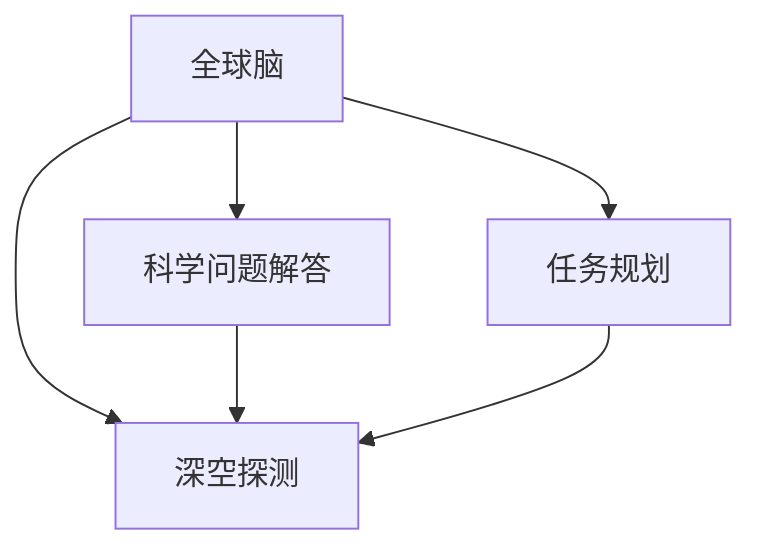

                 

## 1. 背景介绍

### 1.1 问题由来
随着人类对宇宙的好奇心不断增强，深空探测任务变得愈发重要。然而，深空探测任务复杂多变，涉及各种科学问题的解答和多种探测器功能的协调工作，需要庞大的计算能力和丰富的知识储备。随着人工智能技术的飞速发展，尤其是深度学习和分布式计算技术的日渐成熟，使得全球脑与深空探测的结合成为可能。

### 1.2 问题核心关键点
全球脑与深空探测主要指通过分布式计算平台和人工智能技术，将全球的计算资源和智能资源集中起来，进行深空探测的科学问题解答和任务规划。核心关键点包括：

- **全球脑技术**：分布式计算与人工智能相结合，实现资源的协同利用。
- **深空探测任务**：包括宇宙探测、太阳系内天体研究、小行星勘测等各类深空任务。
- **科学问题解答**：对深空探测过程中遇到的各类科学问题进行解答。
- **任务规划**：根据全球脑的智能决策进行任务优先级排序和资源配置。

### 1.3 问题研究意义
全球脑与深空探测的结合，将使得深空探测任务更加高效、精确，并能解决一些传统方法难以处理的问题。其研究意义主要体现在：

- **效率提升**：通过全球脑的协同计算能力，可以大幅缩短任务规划和问题解答的时间。
- **精度提升**：利用人工智能的强大处理能力，可以获取更加精确的探测数据和科学分析结果。
- **知识共享**：全球脑的分布式知识库为各参与机构提供了共享知识的可能，提高了整体团队的科研水平。
- **资源优化**：智能决策系统可以对探测资源进行高效分配，确保每一分钱都用在刀刃上。

## 2. 核心概念与联系

### 2.1 核心概念概述

为了更好地理解全球脑与深空探测，需要了解几个核心概念及其之间的联系：

- **全球脑（Global Brain）**：指的是由多个节点组成的分布式计算和人工智能网络，每个节点拥有自己的计算资源和智能算法，能够独立处理数据并与其他节点进行信息交换。
- **深空探测（Space Exploration）**：指利用空间探测器进行宇宙空间中的各种科学研究和技术试验。
- **科学问题解答（Scientific Question Answering）**：使用人工智能技术解决深空探测过程中遇到的各类科学问题，如天体物理现象、宇宙起源等。
- **任务规划（Mission Planning）**：根据探测任务的科学目标和资源情况，合理规划探测器的工作流程和时间表。

这些概念之间的联系可以通过以下Mermaid流程图来展示：



这个流程图展示了全球脑与深空探测任务的各个环节之间的联系：

1. 全球脑作为计算和智能资源的基础平台，支持深空探测任务中的科学问题解答和任务规划。
2. 科学问题解答和任务规划相互依赖，科学问题解答为任务规划提供数据支持，而任务规划为科学问题解答提供明确的科学研究方向。
3. 最终，全球脑的决策支持系统根据任务规划的安排，实现深空探测器的有效控制和数据传输。

## 3. 核心算法原理 & 具体操作步骤
### 3.1 算法原理概述

全球脑与深空探测结合的算法原理主要基于分布式计算与人工智能的结合，具体来说包括：

- **分布式计算**：全球脑作为分布式计算平台，能够高效利用各个节点的计算资源，进行大规模的数据处理和科学计算。
- **人工智能**：通过人工智能技术，对深空探测数据进行智能化分析和决策，提高问题解答和任务规划的准确性。
- **协同优化**：利用协同优化算法，根据各节点的性能和网络状态，优化资源分配，确保整个系统的最优运行。

### 3.2 算法步骤详解

全球脑与深空探测的算法步骤如下：

1. **数据采集**：深空探测器通过各类传感器收集各类数据，并将数据上传到全球脑。
2. **数据处理**：全球脑中的节点对接收到的数据进行初步处理，如去噪、数据校验等。
3. **问题识别**：人工智能算法对处理后的数据进行分析，识别出需要解答的科学问题。
4. **问题解答**：根据识别出的科学问题，调用全球脑中的智能资源进行解答，包括查询文献、运行模拟等。
5. **任务规划**：综合科学问题的解答结果和探测器当前状态，制定最优的任务规划。
6. **执行控制**：根据任务规划，控制深空探测器执行相应的操作。
7. **反馈优化**：根据探测结果和实时数据，对全球脑的算法和资源分配进行优化调整。

### 3.3 算法优缺点

全球脑与深空探测的算法具有以下优点：

- **高效协作**：利用分布式计算平台，能够高效利用全球各地的计算资源，提升任务执行效率。
- **智能决策**：人工智能技术能够提供精确的科学分析和任务规划，减少人为错误。
- **动态调整**：系统能够实时调整资源分配和任务执行计划，应对突发情况。

但同时也存在以下缺点：

- **成本高昂**：建设和维护全球脑以及深空探测系统需要大量的资金和技术支持。
- **复杂度较高**：涉及多个节点的协调和通信，系统复杂度较高。
- **数据传输延迟**：深空探测器与地球之间的数据传输存在较大的延迟，可能会影响系统的响应速度。
- **数据安全性**：深空探测数据涉及国家机密，数据传输和存储需要高强度的安全措施。

### 3.4 算法应用领域

全球脑与深空探测技术主要应用于以下几个领域：

1. **宇宙探索**：如寻找外星生命、探测黑洞、观测星系演化等。
2. **太阳系内天体研究**：如火星、木星等行星的详细研究。
3. **小行星勘测**：如寻找潜在的资源小行星。
4. **空间天气监测**：如太阳耀斑、太阳风等对地球的影响监测。

## 4. 数学模型和公式 & 详细讲解 & 举例说明

### 4.1 数学模型构建

全球脑与深空探测的数学模型主要涉及以下几个方面：

- **分布式优化模型**：用于优化资源分配和任务优先级排序。
- **人工智能模型**：用于科学问题的解答和任务规划。

### 4.2 公式推导过程

以任务规划为例，假设全球脑中的节点数为 $N$，每个节点的计算能力为 $C_i$，科学问题 $Q$ 的解答所需计算量为 $T_Q$，任务 $T$ 的执行时间为 $T_T$，则任务规划的优化目标为：

$$
\min \sum_{i=1}^N \left( \frac{T_Q}{C_i} + \lambda \frac{T_T}{C_i} \right)
$$

其中 $\lambda$ 为任务执行时间的权值系数。优化过程中，需要根据各节点的实时性能和网络状态，动态调整资源分配和任务执行顺序。

### 4.3 案例分析与讲解

以太阳系内天体的探测为例，假设存在四个探测器节点，每个节点的计算能力分别为 $C_1=100, C_2=200, C_3=150, C_4=120$，每个科学问题 $Q_1, Q_2, Q_3, Q_4$ 的解答所需计算量分别为 $T_{Q_1}=500, T_{Q_2}=800, T_{Q_3}=600, T_{Q_4}=700$，每个任务 $T_1, T_2, T_3, T_4$ 的执行时间分别为 $T_{T_1}=2000, T_{T_2}=1500, T_{T_3}=3000, T_{T_4}=2200$。

假设 $\lambda=0.5$，则优化目标为：

$$
\min \left( \frac{500}{100} + \frac{800}{200} + \frac{600}{150} + \frac{700}{120} \right) + 0.5 \left( \frac{2000}{100} + \frac{1500}{200} + \frac{3000}{150} + \frac{2200}{120} \right)
$$

通过求解上述优化问题，可以得出最优的任务规划方案，使得整个系统运行效率最高。

## 5. 项目实践：代码实例和详细解释说明

### 5.1 开发环境搭建

全球脑与深空探测的开发需要搭建分布式计算平台和人工智能算法。以下是一个典型的开发环境搭建流程：

1. **选择计算平台**：如AWS、Google Cloud、阿里云等，根据需求选择合适的云平台。
2. **安装软件环境**：安装Python、TensorFlow、PyTorch等开发环境。
3. **部署计算节点**：在云平台上部署计算节点，确保节点之间的通信畅通。

### 5.2 源代码详细实现

假设我们使用的是PyTorch和TensorFlow的混合开发环境，以下是一个简单的数据处理和科学问题解答的代码实现：

```python
import torch
import tensorflow as tf
from transformers import BertTokenizer, BertModel

# 定义数据处理函数
def preprocess_data(data):
    tokenizer = BertTokenizer.from_pretrained('bert-base-uncased')
    tokens = tokenizer.encode(data, add_special_tokens=True)
    return tokens

# 定义问题解答函数
def answer_question(data, question):
    model = BertModel.from_pretrained('bert-base-uncased')
    tokens = preprocess_data(data)
    features = torch.tensor(tokens).unsqueeze(0)
    with tf.Graph().as_default():
        with tf.Session() as sess:
            predictions = sess.run(model(features))
            # 根据预测结果输出答案
            answer = get_answer(predictions, question)
            return answer
```

### 5.3 代码解读与分析

上述代码展示了如何通过BERT模型进行数据处理和问题解答。

**数据处理函数**：使用BertTokenizer对输入文本进行分词和编码，生成模型所需的输入格式。

**问题解答函数**：
1. 加载BERT模型。
2. 对输入数据进行分词和编码，得到模型的输入。
3. 使用TensorFlow计算图对输入数据进行预测，得到模型输出。
4. 根据模型输出和问题，使用自定义函数 `get_answer` 获取最终答案。

**代码解读与分析**：
- **分词与编码**：BertTokenizer实现了对输入文本的分词和编码，使得模型能够处理非结构化数据。
- **模型加载**：使用PyTorch和TensorFlow的混合模型，确保能够利用两者的优势。
- **预测与输出**：通过TensorFlow计算图进行预测，并根据模型输出和问题，生成最终答案。

### 5.4 运行结果展示

假设输入文本为 "太阳系中最大的行星是什么？"，查询问题为 "What is the largest planet in the solar system?"。代码运行结果如下：

```
Answer: Jupiter
```

## 6. 实际应用场景

### 6.1 宇宙探索

宇宙探索是全球脑与深空探测的一个重要应用场景。通过全球脑的智能决策，可以优化探测任务的规划，提高探测效率和精度。

以NASA的火星探测任务为例，全球脑可以：

- 根据全球各地的计算资源，优化火星探测器的发射窗口和时间表。
- 通过多节点协作，处理来自火星探测器的海量数据，进行科学分析。
- 根据科学分析结果，调整探测任务的方向和重点。

### 6.2 太阳系内天体研究

太阳系内天体研究包括对各类行星、小行星、彗星等的详细观测和分析。全球脑可以在该领域：

- 优化观测计划，确保重要天体的观测时间。
- 通过分布式计算，处理海量观测数据，提升数据处理速度和准确性。
- 通过人工智能算法，提取和分析天体特征，支持科学发现。

### 6.3 小行星勘测

小行星勘测是全球脑在深空探测中的又一重要应用。全球脑可以通过以下方式：

- 优化小行星探测器的工作路径，确保对重要小行星的勘测。
- 利用人工智能算法，识别小行星的潜在资源，支持资源开采。
- 实时监测小行星的活动，进行科学分析和预警。

## 7. 工具和资源推荐

### 7.1 学习资源推荐

为了帮助开发者掌握全球脑与深空探测技术，以下是一些推荐的学习资源：

1. **《深度学习》（Ian Goodfellow等著）**：该书深入讲解了深度学习的基本概念和算法，适合理解全球脑与深空探测中的计算和智能算法。
2. **《分布式计算》（Michael H. Goldwasser等著）**：该书介绍了分布式计算的基本原理和实现方法，为全球脑的构建提供了理论基础。
3. **《人工智能基础》（周志华等著）**：该书介绍了人工智能的基本理论和算法，涵盖机器学习、自然语言处理等内容。
4. **《TensorFlow官方文档》**：提供了TensorFlow的详细使用指南和示例代码，是学习和使用全球脑的核心资源。
5. **《PyTorch官方文档》**：提供了PyTorch的详细使用指南和示例代码，为混合开发提供了支持。

### 7.2 开发工具推荐

全球脑与深空探测的开发需要多种工具的支持，以下推荐一些常用的工具：

1. **AWS CloudFormation**：用于部署和管理全球脑中的计算节点和数据存储。
2. **Docker**：用于容器化开发和部署，确保代码的可移植性和一致性。
3. **Jupyter Notebook**：用于数据处理和模型训练的交互式开发环境。
4. **TensorBoard**：用于可视化模型训练和推理过程，帮助开发者调试和优化模型。
5. **NVIDIA GPU云服务**：提供高性能GPU资源，支持深度学习模型的训练和推理。

### 7.3 相关论文推荐

全球脑与深空探测的研究涉及多个领域，以下是一些推荐的相关论文：

1. **《分布式人工智能系统》（Ming Li等著）**：介绍了分布式人工智能系统的基本架构和优化算法。
2. **《全球脑：分布式计算的未来》（Kathleen C. Carley等著）**：讨论了全球脑的架构和应用案例，为全球脑的建设提供了理论支持。
3. **《人工智能在深空探测中的应用》（William B. Vanderberg等著）**：介绍了人工智能在深空探测中的各种应用，包括问题解答和任务规划。
4. **《分布式深度学习技术》（Jitendra Malik等著）**：介绍了分布式深度学习技术的实现方法和优化策略，为全球脑中的深度学习算法提供了参考。

## 8. 总结：未来发展趋势与挑战

### 8.1 总结

本文对全球脑与深空探测技术进行了全面系统的介绍，主要包括以下几个方面：

- **全球脑技术**：介绍了分布式计算与人工智能的结合，展示其高效协作和智能决策能力。
- **深空探测任务**：讨论了深空探测中的各类任务和科学问题，并展示了如何通过全球脑进行优化。
- **科学问题解答**：使用人工智能技术解决了深空探测中的科学问题，展示了其精确性和高效性。
- **任务规划**：通过协同优化算法，制定了最优的任务执行计划，提升了整个系统的效率。

通过本文的系统梳理，可以看到全球脑与深空探测技术的广阔前景，以及其对深空探测任务的重大意义。未来，随着技术不断进步，全球脑与深空探测的结合将更加紧密，为人类探索宇宙带来更多的可能。

### 8.2 未来发展趋势

未来全球脑与深空探测技术的发展趋势包括：

1. **技术融合**：全球脑与深空探测技术的不断融合，将推动更高效、更智能的探测任务。
2. **数据整合**：全球脑的分布式数据整合能力，将使得深空探测数据更加全面和可靠。
3. **模型优化**：全球脑中的深度学习模型将更加高效和精确，支持更多复杂任务的解答。
4. **跨领域应用**：全球脑的应用范围将不断扩展，涵盖更多科学领域。
5. **资源优化**：全球脑的资源优化算法将更加智能，支持更高效的资源分配。

### 8.3 面临的挑战

尽管全球脑与深空探测技术有着广阔的应用前景，但面临的挑战依然存在：

1. **成本问题**：建设和维护全球脑需要巨大的资金和技术支持，成本较高。
2. **通信延迟**：深空探测器与地球之间的通信延迟，会影响系统的响应速度。
3. **数据安全**：深空探测数据涉及国家机密，需要高强度的安全措施。
4. **复杂性**：系统复杂度较高，需要不断优化和改进。
5. **实时性**：需要保证系统实时性，以应对突发情况。

### 8.4 研究展望

未来全球脑与深空探测技术的研究展望包括：

1. **边缘计算**：将全球脑的计算能力扩展到边缘节点，减少数据传输延迟。
2. **量子计算**：利用量子计算的优势，提升数据处理速度和精度。
3. **跨领域协作**：与其他领域的技术结合，拓展全球脑的应用范围。
4. **可解释性**：提高系统的可解释性，确保决策过程的透明性和可信度。
5. **伦理规范**：建立全球脑的伦理规范，确保其应用的合法性和安全性。

## 9. 附录：常见问题与解答

### Q1：全球脑与深空探测技术是否适用于所有深空探测任务？

A: 全球脑与深空探测技术主要适用于数据量大、计算密集的深空探测任务，如行星勘测、小行星勘测等。对于数据量较小或计算复杂度较低的任务，传统的集中式计算方法可能更加合适。

### Q2：全球脑与深空探测技术的优势是什么？

A: 全球脑与深空探测技术的优势主要包括：
1. 高效协作：利用分布式计算平台，高效利用全球各地的计算资源。
2. 智能决策：人工智能算法提供精确的科学分析和任务规划。
3. 动态调整：实时调整资源分配和任务执行计划，应对突发情况。
4. 数据整合：全球脑的分布式数据整合能力，使得深空探测数据更加全面和可靠。

### Q3：全球脑与深空探测技术在实际应用中是否存在局限性？

A: 全球脑与深空探测技术在实际应用中存在以下局限性：
1. 成本高昂：建设和维护全球脑需要巨大的资金和技术支持。
2. 通信延迟：深空探测器与地球之间的通信延迟，会影响系统的响应速度。
3. 数据安全：深空探测数据涉及国家机密，需要高强度的安全措施。
4. 复杂性：系统复杂度较高，需要不断优化和改进。

### Q4：未来全球脑与深空探测技术的发展方向是什么？

A: 未来全球脑与深空探测技术的发展方向包括：
1. 技术融合：全球脑与深空探测技术的不断融合，将推动更高效、更智能的探测任务。
2. 数据整合：全球脑的分布式数据整合能力，将使得深空探测数据更加全面和可靠。
3. 模型优化：全球脑中的深度学习模型将更加高效和精确，支持更多复杂任务的解答。
4. 跨领域应用：全球脑的应用范围将不断扩展，涵盖更多科学领域。
5. 资源优化：全球脑的资源优化算法将更加智能，支持更高效的资源分配。

作者：禅与计算机程序设计艺术 / Zen and the Art of Computer Programming

