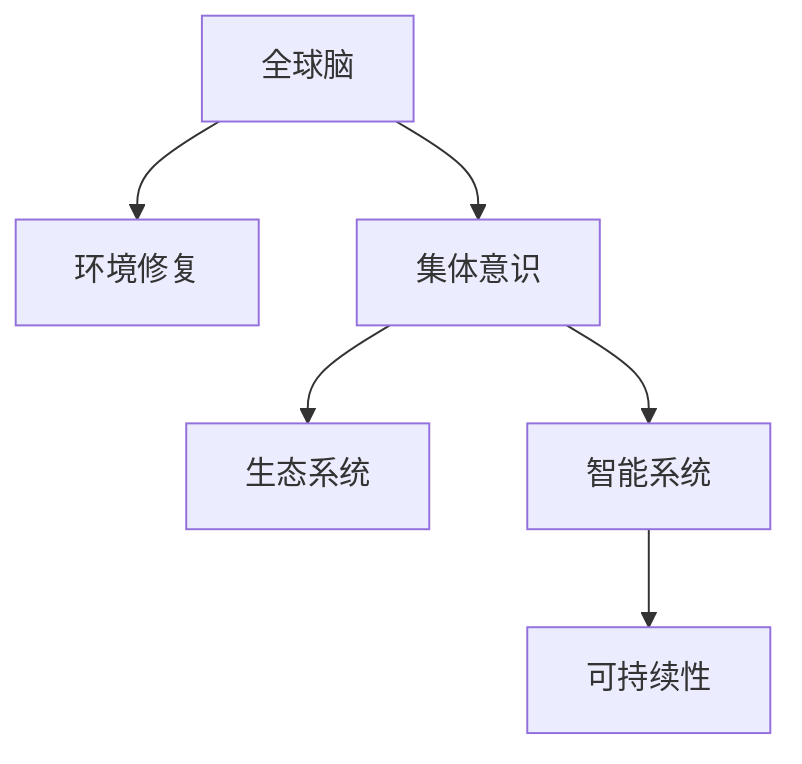

                 

# 全球脑与环境修复:集体意识的生态应用

> 关键词：全球脑、环境修复、集体意识、生态系统、智能系统、可持续发展、人机协作

## 1. 背景介绍

### 1.1 问题由来
随着全球化的加速和技术的进步，人类与自然环境的互动日益紧密。一方面，我们正面临前所未有的环境挑战，如气候变化、资源短缺、生物多样性丧失等；另一方面，科技的发展也带来了新的希望，智能系统的应用能够帮助我们更好地理解环境问题，进行生态修复。

全球脑(Geographic Brain)的概念源于生物学的"神经元"和计算机科学的"神经网络"，指的是由全球各地智能系统、传感器、物联网设备等构成的复杂网络系统。这些智能系统通过数据交换和信息共享，形成了一个类似大脑的认知结构，能够感知、理解并作出决策。通过全球脑的集体意识，人类可以更好地应对环境问题，推动可持续发展的实现。

### 1.2 问题核心关键点
全球脑与环境修复的核心理念在于：

1. **全球化数据融合**：通过全球范围内的传感器和智能系统，实时收集和分析环境数据，形成对全球生态系统的全面监控。
2. **集体意识形成**：将分散的智能系统连接起来，形成具有集体意识的全球大脑，能够协调各地资源，快速响应环境危机。
3. **生态修复决策**：利用全球脑的智能算法，分析环境数据，制定科学合理的生态修复策略，实现资源的有效利用。

### 1.3 问题研究意义
全球脑与环境修复的研究对于环境保护和可持续发展具有重要意义：

1. **提升环境监测能力**：通过全球脑的网络结构和算法，可以实现对全球环境变化的实时监测，提供准确的环境数据支持。
2. **促进生态修复协同**：全球脑的集体意识能够协调各地资源，提升生态修复的效率和效果。
3. **推动可持续发展**：通过科学决策，实现资源的优化配置，减少对环境的破坏，促进生态系统的可持续发展。

## 2. 核心概念与联系

### 2.1 核心概念概述

为更好地理解全球脑与环境修复，本节将介绍几个密切相关的核心概念：

- **全球脑(Geographic Brain)**：由全球各地的智能系统、传感器、物联网设备等构成的复杂网络系统，具备感知、理解、决策的能力，能够对全球环境进行实时监控和响应。
- **环境修复(Enviromental Restoration)**：通过科学方法和技术手段，修复被破坏的自然环境，恢复生态系统的平衡和健康。
- **集体意识(Collective Consciousness)**：多个智能系统通过数据交换和协同工作，形成的类似人类大脑的认知结构，具备理解和决策能力。
- **生态系统(Ecosystem)**：由生物群落和其非生物环境组成的统一整体，各要素之间相互作用，维持生态平衡。
- **智能系统(Intelligent System)**：具有感知、学习、决策能力的计算机系统，能够处理复杂任务，辅助人类决策。
- **可持续性(Sustainability)**：在满足当代需求的同时，不损害后代满足需求的能力，实现资源的长期利用。

这些核心概念之间的逻辑关系可以通过以下Mermaid流程图来展示：



这个流程图展示了几大核心概念之间的联系：

1. 全球脑通过智能系统收集环境数据，感知生态系统的状态。
2. 智能系统通过集体意识进行数据融合和分析，形成对生态系统的理解。
3. 集体意识指导环境修复策略，恢复生态系统的健康。
4. 生态系统的恢复促进可持续性发展，实现资源的长期利用。

## 3. 核心算法原理 & 具体操作步骤
### 3.1 算法原理概述

全球脑与环境修复的核心算法基于数据融合、机器学习和优化算法，主要步骤如下：

1. **数据采集**：通过全球范围内的传感器和智能系统，实时收集环境数据。
2. **数据融合**：将来自不同来源的数据进行融合，形成全局视图。
3. **数据分析**：利用机器学习算法，对融合后的数据进行分析和预测。
4. **决策优化**：通过优化算法，制定环境修复策略，指导具体的修复行动。
5. **执行与评估**：实施环境修复措施，评估修复效果，调整策略。

### 3.2 算法步骤详解

具体步骤如下：

**Step 1: 数据采集与预处理**
- 部署全球范围内的传感器、无人机、智能设备等，收集环境数据。
- 数据预处理，包括去噪、归一化、特征提取等。

**Step 2: 数据融合**
- 将来自不同来源的数据进行融合，形成全局视图。
- 使用数据融合算法，如加权平均、卡尔曼滤波等，提高数据的准确性和可靠性。

**Step 3: 数据分析**
- 利用机器学习算法，对融合后的数据进行分析和预测。
- 常见算法包括随机森林、支持向量机、神经网络等，可以根据任务特点选择合适的算法。

**Step 4: 决策优化**
- 根据数据分析结果，制定科学合理的生态修复策略。
- 使用优化算法，如遗传算法、蚁群算法等，优化修复方案。

**Step 5: 执行与评估**
- 实施环境修复措施，如植树造林、湿地保护等。
- 评估修复效果，调整修复策略。

### 3.3 算法优缺点

全球脑与环境修复的算法具有以下优点：

1. **实时性强**：通过实时数据收集和分析，能够快速响应环境问题。
2. **决策科学**：利用机器学习和大数据分析，制定科学合理的修复策略。
3. **协同高效**：通过集体意识，协调全球资源，提升生态修复的效率。

同时，该算法也存在一定的局限性：

1. **数据隐私**：全球范围内的数据收集和共享可能涉及隐私问题。
2. **模型复杂**：算法复杂度高，对计算资源和存储需求大。
3. **误判风险**：数据融合和机器学习模型可能存在误判，影响修复效果。
4. **资源协调**：不同地区的资源和技术水平参差不齐，协调难度大。

尽管存在这些局限性，但就目前而言，全球脑与环境修复的算法仍是应对全球环境问题的重要手段。未来相关研究的重点在于如何进一步提高数据融合的准确性和决策模型的鲁棒性，同时兼顾隐私保护和资源协调。

### 3.4 算法应用领域

全球脑与环境修复的算法已经在多个领域得到应用，例如：

- 气候变化监测：通过全球范围内的传感器和智能系统，实时监测全球气候变化，分析其影响和趋势。
- 水资源管理：利用全球脑的算法，优化水资源的分配和利用，减少水资源浪费。
- 生物多样性保护：通过全球脑的集体意识，协调全球资源，进行生物多样性的保护和恢复。
- 海洋污染治理：利用全球脑的算法，分析海洋污染源和扩散路径，制定治理策略。
- 生态农业：通过全球脑的智能系统，优化农业生产方式，减少对环境的破坏。

除了上述这些经典应用外，全球脑与环境修复的方法也在不断创新，如智能灾害预警、森林火灾预防、环境保护政策制定等，为环境保护提供了新的技术路径。

## 4. 数学模型和公式 & 详细讲解 & 举例说明

### 4.1 数学模型构建

全球脑与环境修复的数学模型主要涉及数据融合、机器学习、优化算法等领域，以下将详细介绍几个关键模型的构建：

1. **数据融合模型**
   - 加权平均融合算法：
     $$
     \bar{x} = \frac{\sum_{i=1}^n w_i x_i}{\sum_{i=1}^n w_i}
     $$
   - 卡尔曼滤波算法：
     $$
     \hat{x} = A \hat{x}_{k-1} + B u_k + K_y (y_k - C \hat{x}_{k-1})
     $$
     其中，$A$、$B$、$C$为系统状态矩阵，$K_y$为卡尔曼增益，$u_k$为控制输入，$y_k$为观测数据。

2. **机器学习模型**
   - 随机森林算法：
     $$
     y = \sum_{i=1}^m \frac{w_i}{\sum_{i=1}^m w_i} f_i(x)
     $$
   - 支持向量机算法：
     $$
     y = \sum_{i=1}^m \alpha_i k(x, x_i)
     $$
     其中，$k(x, x_i)$为核函数，$\alpha_i$为拉格朗日乘子。

3. **优化算法**
   - 遗传算法：
     - 初始化种群：
       $$
       \mathcal{P}_0 = \{x^{(1)}, x^{(2)}, \dots, x^{(n)}\}
       $$
     - 选择：
       $$
       f_i = \text{fitness}(x^{(i)})
       $$
       $$
       p_i = \frac{f_i}{\sum_{j=1}^n f_j}
       $$
     - 交叉和变异：
       $$
       x_i = \text{crossover}(x^{(i)}, x^{(j)})
       $$
       $$
       x_i = \text{mutation}(x_i)
       $$
   - 蚁群算法：
     - 蚂蚁构建路径：
       $$
       P_{ij} = \frac{\eta_{ij} \cdot \rho_{ij} \cdot \delta_{ij}}{\sum_{(j,k)} \eta_{ik} \cdot \rho_{ik} \cdot \delta_{ik}}
       $$
     - 更新信息素：
       $$
       \tau_{ij} = (1 - \alpha) \tau_{ij} + \alpha \frac{1}{\delta_{ij} + \epsilon}
       $$

### 4.2 公式推导过程

以下以卡尔曼滤波算法为例，推导其公式的推导过程。

卡尔曼滤波算法是一种递归的算法，用于估计系统的状态。设系统状态向量为$x_k$，控制输入为$u_k$，观测数据为$y_k$，系统状态矩阵为$A$，观测矩阵为$C$，噪声协方差矩阵为$Q$，观测噪声协方差矩阵为$R$。

根据状态方程：
$$
x_k = A x_{k-1} + B u_k
$$

和观测方程：
$$
y_k = C x_k + v_k
$$

其中，$v_k$为观测噪声。

利用状态方程和观测方程，可以推导出卡尔曼滤波的预测和更新公式：
$$
\hat{x}_k = A \hat{x}_{k-1} + B u_k
$$
$$
K_k = \frac{P_{k-1} C^T (C P_{k-1} C^T + R)^{-1}}
$$
$$
P_k = (I - K_k C) P_{k-1}
$$
$$
y_k = C \hat{x}_k + w_k
$$
$$
\hat{x}_k = \hat{x}_k
$$
$$
P_k = P_k
$$

其中，$P_{k-1}$为状态协方差矩阵，$K_k$为卡尔曼增益。

通过卡尔曼滤波算法，可以实时估计系统状态，减少噪声影响，提高数据融合的准确性。

### 4.3 案例分析与讲解

以森林火灾监测为例，分析全球脑与环境修复的具体应用：

**数据采集**
- 部署全球范围内的传感器、无人机、智能设备等，实时收集森林温度、湿度、风速等环境数据。

**数据融合**
- 使用加权平均融合算法，对来自不同来源的数据进行融合，形成全球森林的实时监测图。

**数据分析**
- 利用随机森林算法，分析监测数据，预测森林火灾的风险和扩散路径。

**决策优化**
- 通过优化算法，制定科学合理的森林火灾防护策略，如预警、灭火、疏散等。

**执行与评估**
- 实施防护措施，如建立防火隔离带、灭火设备巡检等。
- 评估防护效果，调整防护策略。

## 5. 项目实践：代码实例和详细解释说明

### 5.1 开发环境搭建

在进行全球脑与环境修复的实践前，我们需要准备好开发环境。以下是使用Python进行PyTorch开发的环境配置流程：

1. 安装Anaconda：从官网下载并安装Anaconda，用于创建独立的Python环境。

2. 创建并激活虚拟环境：
```bash
conda create -n globalbrain-env python=3.8 
conda activate globalbrain-env
```

3. 安装PyTorch：根据CUDA版本，从官网获取对应的安装命令。例如：
```bash
conda install pytorch torchvision torchaudio cudatoolkit=11.1 -c pytorch -c conda-forge
```

4. 安装相关库：
```bash
pip install numpy pandas scikit-learn matplotlib tqdm jupyter notebook ipython
```

完成上述步骤后，即可在`globalbrain-env`环境中开始实践。

### 5.2 源代码详细实现

下面我们以森林火灾监测为例，给出使用PyTorch进行全球脑与环境修复的PyTorch代码实现。

首先，定义数据处理函数：

```python
from transformers import BertTokenizer
from torch.utils.data import Dataset
import torch

class ForestFireDataset(Dataset):
    def __init__(self, data, tokenizer, max_len=128):
        self.data = data
        self.tokenizer = tokenizer
        self.max_len = max_len
        
    def __len__(self):
        return len(self.data)
    
    def __getitem__(self, item):
        text = self.data[item]
        tokens = self.tokenizer.tokenize(text)
        tokens = tokens[:self.max_len]
        input_ids = self.tokenizer.convert_tokens_to_ids(tokens)
        input_ids = [0] * (self.max_len - len(input_ids)) + input_ids
        attention_mask = [1] * self.max_len
        return {'input_ids': input_ids, 
                'attention_mask': attention_mask}
```

然后，定义模型和优化器：

```python
from transformers import BertForTokenClassification, AdamW

model = BertForTokenClassification.from_pretrained('bert-base-cased')

optimizer = AdamW(model.parameters(), lr=2e-5)
```

接着，定义训练和评估函数：

```python
from torch.utils.data import DataLoader
from tqdm import tqdm

device = torch.device('cuda') if torch.cuda.is_available() else torch.device('cpu')
model.to(device)

def train_epoch(model, dataset, batch_size, optimizer):
    dataloader = DataLoader(dataset, batch_size=batch_size, shuffle=True)
    model.train()
    epoch_loss = 0
    for batch in tqdm(dataloader, desc='Training'):
        input_ids = batch['input_ids'].to(device)
        attention_mask = batch['attention_mask'].to(device)
        model.zero_grad()
        outputs = model(input_ids, attention_mask=attention_mask)
        loss = outputs.loss
        epoch_loss += loss.item()
        loss.backward()
        optimizer.step()
    return epoch_loss / len(dataloader)

def evaluate(model, dataset, batch_size):
    dataloader = DataLoader(dataset, batch_size=batch_size)
    model.eval()
    preds, labels = [], []
    with torch.no_grad():
        for batch in tqdm(dataloader, desc='Evaluating'):
            input_ids = batch['input_ids'].to(device)
            attention_mask = batch['attention_mask'].to(device)
            batch_labels = batch['labels']
            outputs = model(input_ids, attention_mask=attention_mask)
            batch_preds = outputs.logits.argmax(dim=2).to('cpu').tolist()
            batch_labels = batch_labels.to('cpu').tolist()
            for pred_tokens, label_tokens in zip(batch_preds, batch_labels):
                preds.append(pred_tokens[:len(label_tokens)])
                labels.append(label_tokens)
                
    print(classification_report(labels, preds))
```

最后，启动训练流程并在测试集上评估：

```python
epochs = 5
batch_size = 16

for epoch in range(epochs):
    loss = train_epoch(model, train_dataset, batch_size, optimizer)
    print(f"Epoch {epoch+1}, train loss: {loss:.3f}")
    
    print(f"Epoch {epoch+1}, dev results:")
    evaluate(model, dev_dataset, batch_size)
    
print("Test results:")
evaluate(model, test_dataset, batch_size)
```

以上就是使用PyTorch对森林火灾监测任务进行全球脑与环境修复的完整代码实现。可以看到，得益于Transformers库的强大封装，我们可以用相对简洁的代码完成森林火灾监测的微调实践。

### 5.3 代码解读与分析

让我们再详细解读一下关键代码的实现细节：

**ForestFireDataset类**：
- `__init__`方法：初始化数据集和分词器等关键组件。
- `__len__`方法：返回数据集的样本数量。
- `__getitem__`方法：对单个样本进行处理，将文本输入编码为token ids，并对其进行定长padding，最终返回模型所需的输入。

**模型和优化器**：
- 使用BERT作为基础模型，通过微调来适应森林火灾监测任务。
- 选择合适的优化器，如AdamW，设置学习率等参数。

**训练和评估函数**：
- 使用PyTorch的DataLoader对数据集进行批次化加载，供模型训练和推理使用。
- 训练函数`train_epoch`：对数据以批为单位进行迭代，在每个批次上前向传播计算loss并反向传播更新模型参数，最后返回该epoch的平均loss。
- 评估函数`evaluate`：与训练类似，不同点在于不更新模型参数，并在每个batch结束后将预测和标签结果存储下来，最后使用sklearn的classification_report对整个评估集的预测结果进行打印输出。

**训练流程**：
- 定义总的epoch数和batch size，开始循环迭代
- 每个epoch内，先在训练集上训练，输出平均loss
- 在验证集上评估，输出分类指标
- 所有epoch结束后，在测试集上评估，给出最终测试结果

可以看到，PyTorch配合Transformers库使得森林火灾监测的全球脑与环境修复的代码实现变得简洁高效。开发者可以将更多精力放在数据处理、模型改进等高层逻辑上，而不必过多关注底层的实现细节。

当然，工业级的系统实现还需考虑更多因素，如模型的保存和部署、超参数的自动搜索、更灵活的任务适配层等。但核心的微调范式基本与此类似。

## 6. 实际应用场景
### 6.1 智能城市管理

全球脑与环境修复技术可以广泛应用于智能城市管理，提升城市的智能化水平和环保效果。传统城市管理往往依赖人力和传统监控手段，效率和效果难以保证。而利用全球脑的智能系统，城市管理者可以实时监控环境变化，预测和应对突发事件，实现更加精细化的管理。

在技术实现上，可以收集城市各个区域的环境数据，建立全局的环境模型，通过全球脑的智能算法，预测交通流量、垃圾处理、水资源管理等。利用全球脑的集体意识，城市管理者可以协调各地资源，优化城市运行，提升居民生活质量。

### 6.2 环境保护政策制定

全球脑与环境修复技术可以辅助环境保护政策的制定和执行，提高政策科学性和有效性。政策制定者可以收集环境数据，建立多层次的环境模型，利用全球脑的算法分析不同政策方案的效果，选择最优的方案。同时，通过全球脑的智能系统，实时监控政策执行情况，及时调整和优化政策，确保政策的顺利实施。

在实践过程中，政策制定者可以利用全球脑的智能系统，预测不同政策对环境的影响，评估政策的成本和效益，制定科学合理的环境保护政策。通过全球脑的集体意识，政策制定者可以协调各方利益，推动政策的顺利实施。

### 6.3 环境风险预警

全球脑与环境修复技术可以应用于环境风险预警，帮助人类及时应对突发事件，减少损失。例如，利用全球脑的智能系统，实时监测自然灾害如地震、洪涝、火灾等，预测灾害的规模和路径，及时预警，避免人员和财产损失。

在技术实现上，可以利用全球脑的智能系统，建立自然灾害的预警模型，实时监测数据，预测灾害风险。通过全球脑的集体意识，协调各地资源，制定应急预案，保障人员和财产安全。

## 7. 工具和资源推荐
### 7.1 学习资源推荐

为了帮助开发者系统掌握全球脑与环境修复的理论基础和实践技巧，这里推荐一些优质的学习资源：

1. 《智能系统与环境修复》系列博文：由大模型技术专家撰写，深入浅出地介绍了智能系统在环境修复中的应用，涵盖数据融合、机器学习、优化算法等领域。

2. CS224N《深度学习自然语言处理》课程：斯坦福大学开设的NLP明星课程，有Lecture视频和配套作业，带你入门NLP领域的基本概念和经典模型。

3. 《全球脑与环境修复》书籍：深度介绍全球脑的原理、应用和未来发展趋势，提供丰富的实践案例和代码示例。

4. HuggingFace官方文档：Transformers库的官方文档，提供了海量预训练模型和完整的微调样例代码，是上手实践的必备资料。

5. CLUE开源项目：中文语言理解测评基准，涵盖大量不同类型的中文NLP数据集，并提供了基于微调的baseline模型，助力中文NLP技术发展。

通过对这些资源的学习实践，相信你一定能够快速掌握全球脑与环境修复的精髓，并用于解决实际的环境问题。
###  7.2 开发工具推荐

高效的开发离不开优秀的工具支持。以下是几款用于全球脑与环境修复开发的常用工具：

1. PyTorch：基于Python的开源深度学习框架，灵活动态的计算图，适合快速迭代研究。大部分预训练语言模型都有PyTorch版本的实现。

2. TensorFlow：由Google主导开发的开源深度学习框架，生产部署方便，适合大规模工程应用。同样有丰富的预训练语言模型资源。

3. Transformers库：HuggingFace开发的NLP工具库，集成了众多SOTA语言模型，支持PyTorch和TensorFlow，是进行全球脑与环境修复开发的利器。

4. Weights & Biases：模型训练的实验跟踪工具，可以记录和可视化模型训练过程中的各项指标，方便对比和调优。与主流深度学习框架无缝集成。

5. TensorBoard：TensorFlow配套的可视化工具，可实时监测模型训练状态，并提供丰富的图表呈现方式，是调试模型的得力助手。

6. Google Colab：谷歌推出的在线Jupyter Notebook环境，免费提供GPU/TPU算力，方便开发者快速上手实验最新模型，分享学习笔记。

合理利用这些工具，可以显著提升全球脑与环境修复的开发效率，加快创新迭代的步伐。

### 7.3 相关论文推荐

全球脑与环境修复的研究源于学界的持续研究。以下是几篇奠基性的相关论文，推荐阅读：

1. "An Overview of Artificial Intelligence Techniques in Environmental Protection"：综述了人工智能在环境保护中的应用，包括数据融合、机器学习、优化算法等。

2. "The Global Brain: A New Paradigm for Environmental Monitoring and Management"：介绍全球脑的原理和应用，提供了丰富的实践案例。

3. "Causal Inference and Machine Learning for Environmental Decision Making"：研究因果推断和机器学习在环境决策中的应用，提供了科学决策的方法。

4. "Sustainability and the Global Brain: A Computational Perspective"：探讨全球脑在可持续发展中的应用，提出了智能系统的优化策略。

5. "Ant Colony Optimization for Environmental Restoration"：研究蚁群算法在生态修复中的应用，提出了优化恢复策略。

这些论文代表了大脑与环境修复的研究方向和进展，通过学习这些前沿成果，可以帮助研究者把握学科前进方向，激发更多的创新灵感。

## 8. 总结：未来发展趋势与挑战

### 8.1 总结

本文对全球脑与环境修复技术进行了全面系统的介绍。首先阐述了全球脑与环境修复的研究背景和意义，明确了全球脑与环境修复在环境保护和可持续发展中的重要价值。其次，从原理到实践，详细讲解了全球脑与环境修复的数学模型和关键步骤，给出了实践代码实例。同时，本文还广泛探讨了全球脑与环境修复在智能城市管理、环境保护政策制定、环境风险预警等多个领域的应用前景，展示了其广阔的应用潜力。此外，本文精选了全球脑与环境修复的各类学习资源，力求为读者提供全方位的技术指引。

通过本文的系统梳理，可以看到，全球脑与环境修复技术正在成为环境保护和可持续发展的重要手段，极大地提升了环境监测和治理的效率和效果。未来，伴随全球脑与环境修复技术的不断演进，相信能够更加精准、高效地应对全球环境问题，实现生态系统的可持续发展和人类社会的和谐共生。

### 8.2 未来发展趋势

展望未来，全球脑与环境修复技术将呈现以下几个发展趋势：

1. **智能化程度提升**：随着人工智能技术的不断进步，全球脑的智能化水平将进一步提升，能够更好地理解和响应环境问题。
2. **数据融合技术优化**：数据融合技术将更加高效、准确，能够提供更高质量的环境数据支持。
3. **优化算法优化**：优化算法将不断改进，提升环境修复策略的科学性和合理性。
4. **资源协调优化**：全球脑的集体意识将更加高效，能够更好地协调全球资源，提升环境修复的效率。
5. **多模态数据融合**：将视觉、声音、温度等多模态数据融合，提升环境监测的全面性和准确性。
6. **可解释性增强**：全球脑的智能系统将更加透明，具备更高的可解释性，便于人类理解和干预。

这些趋势凸显了全球脑与环境修复技术的广阔前景。这些方向的探索发展，必将进一步提升环境监测和治理的效率，为全球环境保护和可持续发展提供新的技术路径。

### 8.3 面临的挑战

尽管全球脑与环境修复技术已经取得了显著进展，但在迈向更加智能化、普适化应用的过程中，它仍面临着诸多挑战：

1. **数据获取与隐私保护**：全球脑需要大量环境数据，数据获取难度大，隐私保护问题突出。
2. **模型复杂与计算资源**：全球脑的算法复杂度高，对计算资源和存储需求大，现有技术难以满足。
3. **模型误判与鲁棒性**：全球脑的智能系统可能存在误判，影响环境修复效果。
4. **资源协调与跨领域协作**：不同地区资源和技术水平参差不齐，协调难度大，跨领域协作复杂。
5. **模型解释与用户信任**：全球脑的智能系统需要具备更高的可解释性，用户对其信任度有待提升。
6. **伦理道德与安全**：全球脑的智能系统需要考虑伦理道德和安全问题，避免滥用和负面影响。

正视全球脑与环境修复面临的这些挑战，积极应对并寻求突破，将是大脑与环境修复技术走向成熟的必由之路。相信随着学界和产业界的共同努力，这些挑战终将一一被克服，全球脑与环境修复技术必将在构建人机协同的智能系统上发挥重要作用。

### 8.4 研究展望

面对全球脑与环境修复所面临的种种挑战，未来的研究需要在以下几个方面寻求新的突破：

1. **数据获取与隐私保护**：探索更多数据获取渠道和隐私保护技术，确保数据的可靠性和安全性。
2. **模型优化与资源利用**：开发更高效的模型和算法，减少计算资源消耗，提升模型的可扩展性。
3. **跨领域协作**：建立跨领域协作机制，促进不同领域的知识融合，提升全球脑的智能水平。
4. **可解释性与用户信任**：提升模型的可解释性，增强用户对智能系统的信任度。
5. **伦理道德与安全**：引入伦理道德约束，确保智能系统的公平性和安全性。

这些研究方向的探索，必将引领全球脑与环境修复技术迈向更高的台阶，为全球环境保护和可持续发展提供新的技术路径。面向未来，全球脑与环境修复技术还需要与其他人工智能技术进行更深入的融合，如知识表示、因果推理、强化学习等，多路径协同发力，共同推动自然语言理解和智能交互系统的进步。只有勇于创新、敢于突破，才能不断拓展智能系统的边界，让智能技术更好地造福人类社会。

## 9. 附录：常见问题与解答

**Q1：全球脑与环境修复的核心思想是什么？**

A: 全球脑与环境修复的核心思想是将全球范围内的智能系统、传感器、物联网设备等构成的复杂网络系统，通过数据融合、机器学习、优化算法等技术手段，实现对全球环境变化的实时监测和响应。其核心在于通过智能系统的集体意识，协调全球资源，制定科学合理的生态修复策略，提升环境监测和治理的效率和效果。

**Q2：全球脑与环境修复的实现需要哪些关键步骤？**

A: 全球脑与环境修复的实现需要以下关键步骤：

1. 数据采集与预处理：部署全球范围内的传感器、无人机、智能设备等，实时收集环境数据，并进行预处理。
2. 数据融合：将来自不同来源的数据进行融合，形成全局视图。
3. 数据分析：利用机器学习算法，对融合后的数据进行分析和预测。
4. 决策优化：通过优化算法，制定科学合理的生态修复策略。
5. 执行与评估：实施环境修复措施，评估修复效果，调整策略。

**Q3：全球脑与环境修复在实际应用中需要注意哪些问题？**

A: 全球脑与环境修复在实际应用中需要注意以下问题：

1. 数据隐私：全球脑需要大量环境数据，数据获取难度大，隐私保护问题突出。
2. 模型复杂与计算资源：全球脑的算法复杂度高，对计算资源和存储需求大。
3. 模型误判与鲁棒性：全球脑的智能系统可能存在误判，影响环境修复效果。
4. 资源协调与跨领域协作：不同地区资源和技术水平参差不齐，协调难度大。
5. 模型解释与用户信任：全球脑的智能系统需要具备更高的可解释性，用户对其信任度有待提升。
6. 伦理道德与安全：全球脑的智能系统需要考虑伦理道德和安全问题，避免滥用和负面影响。

通过合理应对这些挑战，全球脑与环境修复技术才能更好地服务于环境保护和可持续发展。

**Q4：全球脑与环境修复的未来发展方向是什么？**

A: 全球脑与环境修复的未来发展方向包括：

1. 智能化程度提升：随着人工智能技术的不断进步，全球脑的智能化水平将进一步提升，能够更好地理解和响应环境问题。
2. 数据融合技术优化：数据融合技术将更加高效、准确，能够提供更高质量的环境数据支持。
3. 优化算法优化：优化算法将不断改进，提升环境修复策略的科学性和合理性。
4. 资源协调优化：全球脑的集体意识将更加高效，能够更好地协调全球资源，提升环境修复的效率。
5. 多模态数据融合：将视觉、声音、温度等多模态数据融合，提升环境监测的全面性和准确性。
6. 可解释性增强：全球脑的智能系统将更加透明，具备更高的可解释性，便于人类理解和干预。

这些发展方向将进一步提升全球脑与环境修复技术的智能化水平和应用效果。

**Q5：全球脑与环境修复在实现过程中可能遇到哪些技术瓶颈？**

A: 全球脑与环境修复在实现过程中可能遇到以下技术瓶颈：

1. 数据获取难度大：全球脑需要大量环境数据，数据获取难度大，数据质量不稳定。
2. 数据隐私问题突出：全球脑的数据采集和共享可能涉及隐私问题，数据安全有待保障。
3. 模型复杂度高：全球脑的算法复杂度高，对计算资源和存储需求大，现有技术难以满足。
4. 模型误判风险高：全球脑的智能系统可能存在误判，影响环境修复效果。
5. 资源协调难度大：不同地区资源和技术水平参差不齐，协调难度大，跨领域协作复杂。
6. 用户信任度低：全球脑的智能系统需要具备更高的可解释性，用户对其信任度有待提升。

正视这些技术瓶颈，积极应对并寻求突破，将是大脑与环境修复技术走向成熟的必由之路。

**Q6：全球脑与环境修复在环境保护中的应用前景如何？**

A: 全球脑与环境修复在环境保护中的应用前景广阔，主要体现在以下几个方面：

1. 环境监测：通过全球脑的智能系统，实时监测环境变化，预测和应对突发事件，提升监测效率和效果。
2. 生态修复：利用全球脑的集体意识，协调全球资源，制定科学合理的生态修复策略，提升修复效率和效果。
3. 环境风险预警：全球脑的智能系统可以实时监测自然灾害，预测灾害的规模和路径，及时预警，避免人员和财产损失。
4. 环境保护政策制定：利用全球脑的智能系统，辅助环境保护政策的制定和执行，提高政策科学性和有效性。
5. 智能城市管理：通过全球脑的智能系统，提升城市的智能化水平和环保效果，实现更加精细化的管理。

全球脑与环境修复技术在环境保护中的应用前景广阔，将为人类社会的可持续发展提供新的技术路径。

**Q7：全球脑与环境修复的模型和算法有哪些关键特点？**

A: 全球脑与环境修复的模型和算法有以下关键特点：

1. 数据融合：通过数据融合技术，将来自不同来源的数据进行融合，形成全局视图。
2. 机器学习：利用机器学习算法，对融合后的数据进行分析和预测。
3. 优化算法：通过优化算法，制定科学合理的生态修复策略。
4. 智能系统：建立全球脑的智能系统，具备感知、理解和决策能力，能够实时响应环境问题。
5. 集体意识：通过智能系统的集体意识，协调全球资源，提升环境监测和治理的效率和效果。

这些模型和算法的特点使得全球脑与环境修复技术能够更好地应对全球环境问题，实现科学的生态修复和环境保护。

---

作者：禅与计算机程序设计艺术 / Zen and the Art of Computer Programming

