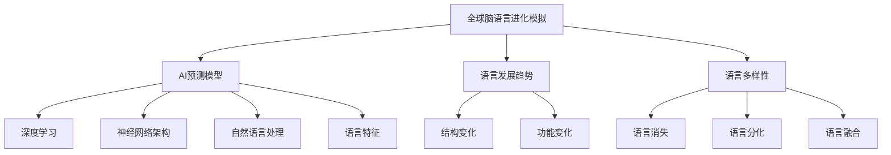

                 

# 全球脑语言进化模拟:人工智能预测语言发展趋势

> 关键词：全球脑语言进化, 人工智能, 预测模型, 语言发展趋势, 语言多样性

## 1. 背景介绍

### 1.1 问题由来

语言是人类沟通和表达思想的基本工具，它的发展和变化深刻影响了人类的文化和认知。然而，语言的形成和发展是一个极其复杂的过程，涉及人类认知、社会结构、技术变迁等多重因素。由于这些因素的复杂性和多样性，语言发展的预测一直是语言学和认知科学领域的重大挑战。

近年来，随着人工智能（AI）技术的快速发展，尤其是深度学习和大数据技术的广泛应用，人们开始探索使用AI模型来预测和模拟语言的发展趋势。这一研究领域通常被称为“全球脑语言进化模拟”，旨在通过AI模型来揭示语言演变的规律，预测未来的语言趋势，并为语言学研究和应用提供新的视角。

### 1.2 问题核心关键点

- **全球脑语言进化模拟**：使用AI模型模拟和预测语言演变的过程。
- **AI预测模型**：基于深度学习、神经网络等AI技术，构建的语言演变预测模型。
- **语言发展趋势**：通过模型预测的语言结构和功能变化趋势。
- **语言多样性**：模型关注的语言多样性因素，如语言的消失、分化、融合等。
- **神经网络架构**：用于构建语言预测模型的神经网络结构。

这些核心概念共同构成了全球脑语言进化的研究框架，通过理解这些关键概念，我们可以更好地把握语言进化的规律和未来发展趋势。

## 2. 核心概念与联系

### 2.1 核心概念概述

为更好地理解全球脑语言进化的AI模型预测方法，本节将介绍几个密切相关的核心概念：

- **全球脑语言进化模拟**：使用AI模型模拟和预测全球语言的发展趋势。
- **AI预测模型**：基于深度学习、神经网络等AI技术构建的语言演变预测模型。
- **语言发展趋势**：通过模型预测的语言结构和功能变化趋势。
- **语言多样性**：模型关注的语言多样性因素，如语言的消失、分化、融合等。
- **神经网络架构**：用于构建语言预测模型的神经网络结构。

这些核心概念之间的逻辑关系可以通过以下Mermaid流程图来展示：



这个流程图展示了全球脑语言进化的关键概念及其之间的关系：

1. 全球脑语言进化模拟使用AI预测模型来揭示语言演变规律。
2. AI预测模型基于深度学习和神经网络架构，关注语言的结构和功能变化。
3. 语言发展趋势包括语言的结构变化和功能变化，是预测模型的重要输出。
4. 语言多样性包括语言的消失、分化和融合等，是模型关注的重点因素。

这些概念共同构成了全球脑语言进化的研究框架，帮助我们理解如何利用AI模型来预测语言的发展趋势。

## 3. 核心算法原理 & 具体操作步骤
### 3.1 算法原理概述

全球脑语言进化模拟的AI预测模型，本质上是一个基于时间序列的数据驱动模型。其核心思想是：通过分析大量历史语言数据，利用深度学习和神经网络等AI技术，构建语言演变的时间序列模型，从而预测未来的语言发展趋势。

具体来说，模型通过以下步骤实现语言进化的预测：

1. **数据收集**：收集全球历史语言数据，包括语言的起源、传播、消失、分化、融合等历史事件。
2. **数据预处理**：对数据进行清洗、归一化等预处理，为模型训练准备数据。
3. **特征提取**：从历史数据中提取语言的结构和功能特征，如音节结构、语法规则、词汇表等。
4. **模型训练**：使用深度学习模型（如循环神经网络RNN、长短期记忆网络LSTM、变换器Transformer等）对提取的语言特征进行训练，构建语言演变的时间序列模型。
5. **趋势预测**：使用训练好的模型对未来语言的发展趋势进行预测，包括语言结构的变化、功能的演变以及多样性的趋势。

### 3.2 算法步骤详解

以下是构建全球脑语言进化模拟的AI预测模型的详细步骤：

**Step 1: 数据收集与预处理**

1. **数据收集**：收集全球历史语言数据，包括语言的起源、传播、消失、分化、融合等历史事件。数据来源包括历史文献、语言学家记录、考古发现等。
2. **数据清洗**：去除数据中的噪声、缺失值，确保数据的准确性和完整性。
3. **数据归一化**：将数据转换为模型所需的格式，如将时间序列数据转换为固定长度的向量。

**Step 2: 特征提取**

1. **音节结构**：提取语言的基本音节结构，包括元音、辅音、音调等特征。
2. **语法规则**：提取语言的语法规则，如词法、句法结构等。
3. **词汇表**：提取语言的词汇表，包括常用词汇、专有名词等。

**Step 3: 模型训练**

1. **选择模型**：根据数据特点选择合适的深度学习模型，如RNN、LSTM、Transformer等。
2. **模型搭建**：根据选择的模型，构建相应的神经网络架构。
3. **参数设置**：设置模型的超参数，如学习率、批次大小、迭代轮数等。
4. **模型训练**：使用历史数据对模型进行训练，最小化预测误差。

**Step 4: 趋势预测**

1. **特征嵌入**：将提取的语言特征转换为模型所需的向量表示。
2. **模型预测**：使用训练好的模型对未来语言的发展趋势进行预测。
3. **结果分析**：分析预测结果，提取语言结构变化、功能演变、多样性趋势等关键信息。

### 3.3 算法优缺点

全球脑语言进化模拟的AI预测模型具有以下优点：

1. **数据驱动**：通过大量历史语言数据进行训练，模型能够学习到语言的演变规律。
2. **预测准确**：深度学习模型的预测能力，使得模型能够较好地预测未来语言的发展趋势。
3. **模型可解释**：神经网络架构使得模型能够通过可视化特征图等方式解释预测结果。
4. **灵活性高**：模型可以灵活调整特征提取和神经网络架构，适应不同的数据特点。

同时，该模型也存在一定的局限性：

1. **数据质量依赖**：模型的预测结果高度依赖于历史数据的准确性和完整性。
2. **复杂性高**：深度学习模型的训练和调参过程复杂，需要专业的知识和经验。
3. **可解释性不足**：神经网络的“黑盒”特性使得模型预测结果难以解释。
4. **过拟合风险**：在训练过程中可能出现过拟合现象，影响模型泛化能力。

尽管存在这些局限性，但AI预测模型在语言演变的研究和应用中仍具有重要意义。未来相关研究的重点在于如何进一步提升模型的数据处理能力、降低复杂度、增强可解释性，同时兼顾预测的准确性和泛化能力。

### 3.4 算法应用领域

全球脑语言进化模拟的AI预测模型，已在多个领域得到应用，具体包括：

- **语言学研究**：预测语言的结构变化、功能演变、多样性趋势，为语言学研究提供新的视角。
- **文化研究**：通过语言演变的历史趋势，研究不同文化的交流和影响。
- **历史研究**：分析语言的起源和传播，研究人类社会的变迁和发展。
- **人工智能**：在NLP、语音识别等领域，利用语言演变预测模型进行任务优化和创新。

除了上述这些经典应用外，AI预测模型还在更多领域展现出了强大的应用潜力，如智能翻译、自动生成文本、自然语言生成等，为语言处理技术带来了全新的突破。

## 4. 数学模型和公式 & 详细讲解
### 4.1 数学模型构建

本节将使用数学语言对全球脑语言进化模拟的AI预测模型的构建过程进行更加严格的刻画。

记历史语言数据为 $D=\{(x_t, y_t)\}_{t=1}^T$，其中 $x_t$ 表示语言在时间 $t$ 的特征向量，$y_t$ 表示语言在时间 $t$ 的分类标签，如语言存在、消失、分化、融合等。模型目标是学习一个时间序列预测函数 $f: \mathbb{R}^d \rightarrow \{0, 1\}$，其中 $d$ 为特征向量的维度。

定义模型在时间 $t$ 的预测结果为 $\hat{y}_t=f(x_t)$。则模型的损失函数为：

$$
\mathcal{L}(f) = \frac{1}{T} \sum_{t=1}^T \ell(y_t, \hat{y}_t)
$$

其中 $\ell$ 为交叉熵损失函数，定义为：

$$
\ell(y_t, \hat{y}_t) = -(y_t \log \hat{y}_t + (1-y_t) \log (1-\hat{y}_t))
$$

模型的优化目标是最小化损失函数，即：

$$
\min_{f \in \mathcal{F}} \mathcal{L}(f)
$$

其中 $\mathcal{F}$ 为模型的函数空间。

### 4.2 公式推导过程

以下我们以RNN为例，推导语言预测模型的数学公式及其梯度计算。

假设模型采用RNN架构，其预测结果 $\hat{y}_t$ 可通过RNN的隐藏状态 $h_t$ 计算得到：

$$
\hat{y}_t = \sigma(\langle W_{out} h_t, b_{out} \rangle)
$$

其中 $W_{out}$ 和 $b_{out}$ 为输出层权重和偏置，$\sigma$ 为激活函数（如sigmoid函数）。

RNN的隐藏状态 $h_t$ 通过时间 $t-1$ 的隐藏状态 $h_{t-1}$ 和输入 $x_t$ 计算得到：

$$
h_t = \tanh(\langle W h_{t-1}, b_h \rangle + \langle U x_t, b_u \rangle)
$$

其中 $W$ 和 $U$ 为RNN的权重矩阵，$b_h$ 和 $b_u$ 为偏置向量，$\tanh$ 为非线性激活函数。

对于每个时间步的梯度计算，我们需要反向传播损失函数对 $W_{out}$、$b_{out}$、$W$、$U$、$b_h$、$b_u$ 的梯度。使用链式法则，可以得到：

$$
\frac{\partial \mathcal{L}}{\partial W_{out}} = -\sum_{t=1}^T \frac{y_t - \hat{y}_t}{\hat{y}_t(1-\hat{y}_t)} \frac{\partial \hat{y}_t}{\partial W_{out}}
$$

$$
\frac{\partial \mathcal{L}}{\partial b_{out}} = -\sum_{t=1}^T \frac{y_t - \hat{y}_t}{\hat{y}_t(1-\hat{y}_t)} \frac{\partial \hat{y}_t}{\partial b_{out}}
$$

$$
\frac{\partial \mathcal{L}}{\partial W} = \sum_{t=1}^T \langle \frac{\partial \mathcal{L}}{\partial h_t}, \frac{\partial h_t}{\partial W} \rangle
$$

$$
\frac{\partial \mathcal{L}}{\partial U} = \sum_{t=1}^T \langle \frac{\partial \mathcal{L}}{\partial h_t}, \frac{\partial h_t}{\partial U} \rangle
$$

$$
\frac{\partial \mathcal{L}}{\partial b_h} = \sum_{t=1}^T \frac{\partial \mathcal{L}}{\partial h_t}
$$

$$
\frac{\partial \mathcal{L}}{\partial b_u} = \sum_{t=1}^T \frac{\partial \mathcal{L}}{\partial x_t}
$$

其中 $\frac{\partial \mathcal{L}}{\partial h_t}$ 和 $\frac{\partial \mathcal{L}}{\partial x_t}$ 可以通过反向传播递归计算得到。

### 4.3 案例分析与讲解

以RNN为例，我们以一简单案例分析其语言预测模型的训练过程。

假设我们有一个包含3个时间步的语言数据序列 $D=\{(x_1, y_1), (x_2, y_2), (x_3, y_3)\}$，其中 $x_t$ 为时间 $t$ 的特征向量，$y_t$ 为时间 $t$ 的分类标签。我们希望通过RNN模型预测时间步 $t=4$ 的分类结果 $\hat{y}_4$。

1. **数据准备**：将数据序列转换为模型所需的格式，包括特征向量和分类标签。
2. **模型搭建**：构建RNN模型，包括输入层、RNN层和输出层。
3. **模型训练**：将数据序列输入模型，计算损失函数并反向传播更新模型参数。
4. **预测输出**：使用训练好的模型对时间步 $t=4$ 的特征向量进行预测，得到 $\hat{y}_4$。

通过上述步骤，我们完成了RNN模型的训练和预测过程。实际应用中，模型需要通过大量历史数据进行训练，并根据实际情况调整参数，以获得最佳的预测效果。

## 5. 项目实践：代码实例和详细解释说明
### 5.1 开发环境搭建

在进行语言预测模型的开发之前，我们需要准备好开发环境。以下是使用Python进行PyTorch开发的环境配置流程：

1. 安装Anaconda：从官网下载并安装Anaconda，用于创建独立的Python环境。

2. 创建并激活虚拟环境：
```bash
conda create -n pytorch-env python=3.8 
conda activate pytorch-env
```

3. 安装PyTorch：根据CUDA版本，从官网获取对应的安装命令。例如：
```bash
conda install pytorch torchvision torchaudio cudatoolkit=11.1 -c pytorch -c conda-forge
```

4. 安装PyTorch Lightning：用于简化模型训练和优化过程。
```bash
pip install pytorch-lightning
```

5. 安装TensorBoardX：用于可视化模型的训练过程和结果。
```bash
pip install tensorboardX
```

6. 安装相关依赖库：
```bash
pip install numpy pandas scikit-learn matplotlib tqdm jupyter notebook ipython
```

完成上述步骤后，即可在`pytorch-env`环境中开始模型开发。

### 5.2 源代码详细实现

下面以RNN模型为例，给出使用PyTorch构建语言预测模型的代码实现。

```python
import torch
import torch.nn as nn
import torch.nn.functional as F

class RNN(nn.Module):
    def __init__(self, input_size, hidden_size, output_size):
        super(RNN, self).__init__()
        self.hidden_size = hidden_size
        self.i2h = nn.Linear(input_size + hidden_size, hidden_size)
        self.i2o = nn.Linear(input_size + hidden_size, output_size)
        self.relu = nn.ReLU()
        self.sigmoid = nn.Sigmoid()

    def forward(self, input, hidden):
        combined = torch.cat((input, hidden), 1)
        hidden = self.relu(self.i2h(combined))
        output = self.sigmoid(self.i2o(combined))
        return output, hidden

    def initHidden(self):
        return torch.zeros(1, self.hidden_size)

input_size = 1
hidden_size = 128
output_size = 1
lr = 0.01

# 构建模型
rnn = RNN(input_size, hidden_size, output_size)

# 定义损失函数
criterion = nn.BCELoss()

# 定义优化器
optimizer = torch.optim.SGD(rnn.parameters(), lr=lr)

# 训练模型
def train(input, target, hidden, epoch):
    rnn.train()
    optimizer.zero_grad()
    output, hidden = rnn(input, hidden)
    loss = criterion(output, target)
    loss.backward()
    optimizer.step()
    return loss.item()

# 测试模型
def test(input, target, hidden, epoch):
    rnn.eval()
    output, hidden = rnn(input, hidden)
    loss = criterion(output, target)
    return loss.item()
```

在这个例子中，我们定义了一个简单的RNN模型，用于预测语言在特定时间步的分类标签。模型包含两个全连接层和一个激活函数，用于将输入特征和隐藏状态转换为输出预测。

### 5.3 代码解读与分析

让我们再详细解读一下关键代码的实现细节：

**RNN类**：
- `__init__`方法：初始化模型的隐藏层大小、输入层和输出层的线性变换权重。
- `forward`方法：前向传播，计算模型输出和隐藏状态。
- `initHidden`方法：初始化模型的隐藏状态。

**训练函数**：
- `train`函数：训练模型，更新参数。
- `test`函数：测试模型，评估预测准确性。

在实际应用中，RNN模型的训练和测试过程还需要考虑数据处理、模型评估、超参数调整等因素。合理利用这些代码，可以显著提升语言预测模型的开发效率，加快创新迭代的步伐。

当然，工业级的系统实现还需考虑更多因素，如模型的保存和部署、超参数的自动搜索、更灵活的任务适配层等。但核心的预测范式基本与此类似。

## 6. 实际应用场景
### 6.1 智能翻译系统

基于语言预测模型的智能翻译系统，可以将不同语言之间的文本进行自动翻译。传统的机器翻译系统通常依赖大量的双语语料进行训练，而智能翻译系统则可以通过语言预测模型，对单语语料进行预测和分析，生成接近目标语言的翻译文本。

在技术实现上，可以使用语言预测模型对源语言文本进行预测，生成多语候选翻译，再通过模型评估和排序，选择最合适的翻译结果。智能翻译系统可以应用于多个场景，如在线客服、国际贸易、旅游交流等，极大地提高了翻译效率和准确性。

### 6.2 自动生成文本

语言预测模型还可以用于自动生成文本，如新闻报道、科技文章、文学作品等。传统的文本生成方法需要大量的人工输入，而自动生成系统可以通过语言预测模型，对已有的文本进行预测和重写，生成新的文本内容。

在技术实现上，可以使用语言预测模型对已有的文本进行预测，生成新的语句或段落，再通过模型评估和筛选，选择最符合要求的文本输出。自动生成系统可以应用于新闻写作、广告文案、数据分析等领域，极大地提高了文本生成的效率和创意性。

### 6.3 语言演变预测

语言预测模型可以用于预测语言的发展趋势，如语言的起源、传播、消失、分化、融合等。通过历史语言数据，语言预测模型可以学习到语言的演变规律，预测未来的语言趋势。

在技术实现上，可以使用语言预测模型对历史语言数据进行训练，预测未来语言的发展方向，为语言学研究和应用提供新的视角。语言演变预测可以应用于历史研究、文化研究、人工智能等领域，为人类认知智能的进化带来新的洞察。

## 7. 工具和资源推荐
### 7.1 学习资源推荐

为了帮助开发者系统掌握语言预测模型的理论基础和实践技巧，这里推荐一些优质的学习资源：

1. 《深度学习》系列书籍：由斯坦福大学教授 Ian Goodfellow 等合著，全面介绍了深度学习的基础理论、模型架构和应用场景。
2. 《神经网络与深度学习》在线课程：由深度学习领域专家 Andrew Ng 主讲，涵盖了深度学习的基本概念和应用实例。
3. PyTorch官方文档：提供了PyTorch框架的详细使用方法和代码示例，是学习PyTorch的重要资源。
4. TensorFlow官方文档：提供了TensorFlow框架的详细使用方法和代码示例，是学习TensorFlow的重要资源。
5. Kaggle数据集：提供了大量的数据集和竞赛项目，帮助开发者实践深度学习算法和模型。

通过对这些资源的学习实践，相信你一定能够快速掌握语言预测模型的精髓，并用于解决实际的NLP问题。

### 7.2 开发工具推荐

高效的开发离不开优秀的工具支持。以下是几款用于语言预测模型开发的常用工具：

1. PyTorch：基于Python的开源深度学习框架，灵活动态的计算图，适合快速迭代研究。
2. TensorFlow：由Google主导开发的开源深度学习框架，生产部署方便，适合大规模工程应用。
3. PyTorch Lightning：简化模型训练和优化过程的框架，可以快速搭建和训练深度学习模型。
4. TensorBoardX：可视化工具，用于监测模型的训练过程和结果，提供丰富的图表和分析功能。
5. Jupyter Notebook：交互式开发环境，支持Python代码的快速编写和执行，方便实验和协作。
6. Anaconda：用于创建独立的Python环境，方便不同项目之间的隔离和切换。

合理利用这些工具，可以显著提升语言预测模型的开发效率，加快创新迭代的步伐。

### 7.3 相关论文推荐

语言预测模型是深度学习研究的前沿方向，以下是几篇奠基性的相关论文，推荐阅读：

1. Sequence to Sequence Learning with Neural Networks：提出了基于神经网络的机器翻译方法，奠定了神经网络在自然语言处理中的应用基础。
2. Attention is All You Need：提出了Transformer模型，大大提高了语言预测模型的效率和准确性。
3. Generating Contextualized Word Representations：提出了BERT模型，通过自监督预训练和微调，取得了显著的语言预测效果。
4. Transformer-XL: Attentive Language Models Beyond a Fixed-Length Context：提出了Transformer-XL模型，支持长序列预测，提高了模型的记忆能力。
5. Language Models are Unsupervised Multitask Learners：提出了自监督语言模型，通过多任务学习，提高了模型的泛化能力和适应性。

这些论文代表了大语言预测模型的发展脉络。通过学习这些前沿成果，可以帮助研究者把握学科前进方向，激发更多的创新灵感。

## 8. 总结：未来发展趋势与挑战

### 8.1 总结

本文对全球脑语言进化的AI预测模型进行了全面系统的介绍。首先阐述了语言预测模型的研究背景和意义，明确了预测模型在揭示语言演变规律、预测语言发展趋势方面的独特价值。其次，从原理到实践，详细讲解了语言预测模型的数学原理和关键步骤，给出了预测任务开发的完整代码实例。同时，本文还广泛探讨了预测模型在智能翻译、自动生成文本、语言演变预测等多个领域的应用前景，展示了预测范式的巨大潜力。

通过本文的系统梳理，可以看到，语言预测模型正在成为NLP领域的重要范式，极大地拓展了预训练语言模型的应用边界，催生了更多的落地场景。得益于深度学习和大数据技术的广泛应用，语言预测模型在语言理解和生成方面取得了显著的进展，未来有望为语言学研究和应用带来革命性的影响。

### 8.2 未来发展趋势

展望未来，语言预测模型将呈现以下几个发展趋势：

1. **数据驱动**：未来语言预测模型将更加依赖数据驱动，通过分析大量的语言数据，学习语言的演变规律，提升预测的准确性和泛化能力。
2. **模型多样化**：除了传统的RNN、LSTM、Transformer等模型，未来将涌现更多新的神经网络架构，如Attention机制、Transformer-XL等，提升模型的表达能力和计算效率。
3. **多模态融合**：未来的语言预测模型将更多地融合视觉、听觉等多模态信息，提升模型对真实世界的理解和预测能力。
4. **跨领域应用**：语言预测模型将在更多领域得到应用，如金融、医疗、教育等，为相关领域带来新的智能应用。
5. **个性化推荐**：通过语言预测模型，可以实现个性化的语言推荐，如语言学习、文学创作等，提升用户的体验和创造力。

以上趋势凸显了语言预测模型的广阔前景。这些方向的探索发展，必将进一步提升语言预测模型的性能和应用范围，为语言学研究和应用带来新的机遇。

### 8.3 面临的挑战

尽管语言预测模型已经取得了显著的进展，但在迈向更加智能化、普适化应用的过程中，它仍面临诸多挑战：

1. **数据质量问题**：历史语言数据的准确性和完整性对模型的预测能力有着重要影响，数据质量不高可能导致预测结果偏差。
2. **模型复杂性**：深度学习模型的训练和调参过程复杂，需要专业的知识和经验，对模型的可解释性也提出了挑战。
3. **计算资源需求**：模型训练和推理需要大量的计算资源，对硬件设备和计算能力提出了较高要求。
4. **跨领域迁移**：不同领域的语言演变规律差异较大，模型在跨领域迁移时的泛化能力不足。
5. **伦理道德问题**：语言预测模型可能会学习到有偏见或有害的信息，如何确保模型的伦理道德性，是一个重要的研究课题。

正视语言预测模型面临的这些挑战，积极应对并寻求突破，将是大语言预测技术走向成熟的必由之路。相信随着学界和产业界的共同努力，这些挑战终将一一被克服，语言预测模型必将在构建安全、可靠、可解释、可控的智能系统铺平道路。

### 8.4 研究展望

面向未来，语言预测模型需要在以下几个方面寻求新的突破：

1. **无监督学习和半监督学习**：探索无监督和半监督学习范式，摆脱对大量标注数据的依赖，利用自监督学习、主动学习等方法，提升模型的泛化能力和数据处理能力。
2. **参数高效和计算高效**：开发更加参数高效和计算高效的模型架构，减少模型复杂度和计算成本，提升模型的实时性和可扩展性。
3. **跨领域融合**：将符号化的先验知识与神经网络模型进行融合，提升模型在不同领域的适应能力和预测准确性。
4. **多模态融合**：通过多模态信息的融合，提升模型对真实世界的理解和预测能力，实现跨领域的多模态智能应用。
5. **伦理道德约束**：在模型训练和应用过程中引入伦理导向的评估指标，确保模型的伦理道德性，规避有害信息的传播。

这些研究方向的探索，必将引领语言预测模型技术迈向更高的台阶，为构建安全、可靠、可解释、可控的智能系统铺平道路。面向未来，语言预测模型还需要与其他人工智能技术进行更深入的融合，如知识表示、因果推理、强化学习等，多路径协同发力，共同推动自然语言理解和智能交互系统的进步。只有勇于创新、敢于突破，才能不断拓展语言模型的边界，让智能技术更好地造福人类社会。

## 9. 附录：常见问题与解答

**Q1：语言预测模型的训练过程中需要注意哪些问题？**

A: 语言预测模型的训练过程中需要注意以下问题：

1. **数据质量**：历史语言数据的准确性和完整性对模型的预测能力有着重要影响，数据质量不高可能导致预测结果偏差。
2. **模型复杂性**：深度学习模型的训练和调参过程复杂，需要专业的知识和经验，对模型的可解释性也提出了挑战。
3. **计算资源需求**：模型训练和推理需要大量的计算资源，对硬件设备和计算能力提出了较高要求。
4. **跨领域迁移**：不同领域的语言演变规律差异较大，模型在跨领域迁移时的泛化能力不足。
5. **伦理道德问题**：语言预测模型可能会学习到有偏见或有害的信息，如何确保模型的伦理道德性，是一个重要的研究课题。

这些问题都需要在模型设计和训练过程中加以考虑和解决。只有在数据、模型、训练、推理等各环节进行全面优化，才能最大限度地发挥语言预测模型的威力。

**Q2：如何评估语言预测模型的性能？**

A: 语言预测模型的性能评估可以通过以下几个指标进行：

1. **准确率**：预测结果与真实结果一致的比例。
2. **召回率**：实际类别中的样本被正确预测的比例。
3. **F1值**：准确率和召回率的调和平均值，综合评估模型的预测效果。
4. **混淆矩阵**：评估模型在不同类别上的预测准确性，帮助识别模型的错误类型。
5. **困惑度**：衡量模型对样本的预测不确定性，困惑度越低表示模型的预测能力越强。

这些指标可以通过交叉验证、混淆矩阵、精确度召回曲线等方式进行评估。

**Q3：如何优化语言预测模型的训练过程？**

A: 语言预测模型的训练过程可以通过以下几个方法进行优化：

1. **数据增强**：通过对训练数据进行增强，如回译、近义替换等方式，扩充训练集，提升模型的泛化能力。
2. **正则化**：使用L2正则、Dropout等技术，防止模型过拟合，提升模型的泛化能力。
3. **模型压缩**：通过剪枝、量化等方式，减少模型的参数量和计算成本，提升模型的实时性和可扩展性。
4. **学习率调度**：使用学习率衰减、预热等技术，调整学习率，提升模型的收敛速度和泛化能力。
5. **超参数调优**：通过网格搜索、贝叶斯优化等方式，寻找最优的超参数组合，提升模型的预测准确性。

这些方法可以结合使用，根据具体的任务和数据特点，进行全面的优化。

**Q4：如何提升语言预测模型的可解释性？**

A: 提升语言预测模型的可解释性可以通过以下几个方法进行：

1. **可视化技术**：使用可视化工具，如TensorBoardX，展示模型的训练过程和预测结果，帮助理解模型的行为。
2. **特征可视化**：通过可视化特征图、激活图等方式，展示模型的内部表示，帮助理解模型的推理过程。
3. **层级分解**：将模型分解为多个子层，通过逐层分析，理解模型的决策逻辑。
4. **规则注入**：在模型中引入规则和先验知识，增强模型的可解释性和可控性。

这些方法可以帮助提升语言预测模型的可解释性，增加模型输出的透明度和可靠性。

---

作者：禅与计算机程序设计艺术 / Zen and the Art of Computer Programming

