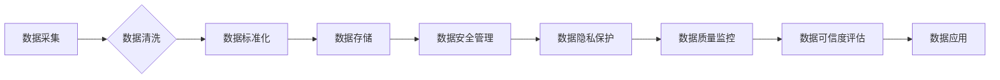

> 大模型、数据治理、企业应用、风险控制、伦理规范、数据安全、数据质量、数据可信度、数据隐私

## 1. 背景介绍

近年来，大模型技术蓬勃发展，其强大的泛化能力和应用潜力引发了各行各业的广泛关注。从自然语言处理到图像识别，从药物研发到金融预测，大模型正在深刻地改变着我们的生活和工作方式。然而，大模型的应用也带来了新的挑战，特别是数据治理方面。

企业在利用大模型的过程中，需要面对海量数据、数据质量、数据安全、数据隐私等一系列问题。如何有效地管理和治理大模型的数据，确保其安全、可靠、可信，是企业应用大模型的关键所在。

## 2. 核心概念与联系

**2.1 数据治理概述**

数据治理是指企业对数据生命周期的全方位管理，包括数据定义、数据质量、数据安全、数据隐私、数据可用性等方面。其目标是确保数据质量、数据安全、数据一致性和数据可信度，为企业决策提供可靠的数据支撑。

**2.2 大模型与数据治理的关系**

大模型的训练和应用都依赖于海量数据。数据质量直接影响大模型的性能和可靠性。因此，数据治理对于大模型的应用至关重要。

**2.3 数据治理流程图**



**2.4 数据治理关键要素**

* **数据标准化:** 建立统一的数据定义、数据格式和数据编码规范，确保数据的一致性和可交换性。
* **数据质量管理:** 实施数据质量监控、数据质量评估和数据质量改进机制，确保数据准确性、完整性和一致性。
* **数据安全管理:** 建立数据安全策略、数据访问控制机制和数据加密技术，保护数据免受未授权访问、篡改和泄露。
* **数据隐私保护:** 遵守相关法律法规，保护个人隐私信息，确保数据的使用符合伦理规范。
* **数据可信度评估:** 建立数据可信度评估体系，评估数据的准确性、可靠性和可信度，为数据应用提供可靠的依据。

## 3. 核心算法原理 & 具体操作步骤

**3.1 算法原理概述**

数据治理涉及多种算法和技术，例如数据清洗算法、数据标准化算法、数据安全算法等。这些算法的原理和实现方式各有不同，但都旨在解决数据治理中的特定问题。

**3.2 算法步骤详解**

以数据清洗为例，其步骤通常包括：

1. 数据识别：识别需要清洗的数据源和数据类型。
2. 数据预处理：对数据进行格式转换、缺失值处理和异常值处理等预处理操作。
3. 数据清洗规则定义：根据业务需求和数据特点，定义数据清洗规则，例如去除重复数据、规范数据格式、修复数据错误等。
4. 数据清洗执行：根据定义的规则，对数据进行清洗操作。
5. 数据验证：验证清洗结果，确保数据质量符合预期要求。

**3.3 算法优缺点**

不同的数据治理算法各有优缺点，需要根据实际情况选择合适的算法。例如，规则式数据清洗算法易于理解和实施，但难以处理复杂的数据清洗场景；机器学习式数据清洗算法能够自动学习数据清洗规则，但需要大量的训练数据。

**3.4 算法应用领域**

数据治理算法广泛应用于各个领域，例如金融、医疗、电商等。在金融领域，数据治理算法用于清洗和标准化客户数据，提高风险控制的准确性；在医疗领域，数据治理算法用于清洗和标准化患者数据，提高医疗诊断的准确性；在电商领域，数据治理算法用于清洗和标准化商品数据，提高商品推荐的精准度。

## 4. 数学模型和公式 & 详细讲解 & 举例说明

**4.1 数学模型构建**

数据治理过程可以抽象为一个数学模型，其中数据作为输入，经过一系列的处理操作，最终输出高质量的数据。

**4.2 公式推导过程**

例如，数据清洗过程可以表示为一个数学公式：

```latex
Data_{cleaned} = f(Data_{raw}, Rule_{set})
```

其中：

* $Data_{cleaned}$ 表示清洗后的数据。
* $Data_{raw}$ 表示原始数据。
* $Rule_{set}$ 表示数据清洗规则集。
* $f$ 表示数据清洗函数。

**4.3 案例分析与讲解**

假设我们有一组客户数据，其中包含一些重复客户记录。我们可以使用数据清洗规则来去除重复客户记录。例如，我们可以定义一个规则：如果两个客户记录的姓名、身份证号码和联系方式都相同，则视为重复记录，需要删除其中一个记录。

## 5. 项目实践：代码实例和详细解释说明

**5.1 开发环境搭建**

可以使用Python语言和相关库来实现数据治理功能。例如，可以使用Pandas库进行数据清洗和标准化，可以使用Scikit-learn库进行数据质量评估。

**5.2 源代码详细实现**

```python
import pandas as pd

# 数据加载
data = pd.read_csv('customer_data.csv')

# 数据清洗
# 去除重复记录
data.drop_duplicates(subset=['name', 'id_card', 'phone'], inplace=True)

# 数据标准化
# 将日期格式统一
data['birthday'] = pd.to_datetime(data['birthday'])

# 数据保存
data.to_csv('cleaned_customer_data.csv', index=False)
```

**5.3 代码解读与分析**

这段代码首先加载了客户数据，然后使用Pandas库的`drop_duplicates()`函数去除重复记录，使用`to_datetime()`函数将日期格式统一。最后，将清洗后的数据保存到新的CSV文件。

**5.4 运行结果展示**

运行这段代码后，将生成一个新的CSV文件，其中包含清洗后的客户数据。

## 6. 实际应用场景

**6.1 金融领域**

在金融领域，数据治理可以用于：

* **风险控制:** 清洗和标准化客户数据，提高风险评估的准确性。
* **欺诈检测:** 识别异常交易行为，降低欺诈风险。
* **个性化服务:** 分析客户数据，提供个性化的金融产品和服务。

**6.2 医疗领域**

在医疗领域，数据治理可以用于：

* **疾病诊断:** 清洗和标准化患者数据，提高疾病诊断的准确性。
* **药物研发:** 分析患者数据，加速药物研发进程。
* **医疗管理:** 优化医疗资源配置，提高医疗服务效率。

**6.3 电商领域**

在电商领域，数据治理可以用于：

* **商品推荐:** 清洗和标准化商品数据，提高商品推荐的精准度。
* **客户画像:** 分析客户数据，构建客户画像，提供个性化的营销服务。
* **库存管理:** 优化库存管理，降低库存成本。

**6.4 未来应用展望**

随着大模型技术的不断发展，数据治理将发挥越来越重要的作用。未来，数据治理将更加智能化、自动化和个性化，能够更好地满足企业对数据管理的需求。

## 7. 工具和资源推荐

**7.1 学习资源推荐**

* **书籍:**
    * 《数据治理：企业数据管理的最佳实践》
    * 《数据质量管理》
* **在线课程:**
    * Coursera: Data Governance
    * Udemy: Data Governance Fundamentals

**7.2 开发工具推荐**

* **数据清洗工具:**
    * Trifacta Wrangler
    * Paxata
* **数据标准化工具:**
    * Apache Data Catalog
    * Collibra Data Governance Center

**7.3 相关论文推荐**

* **Data Governance for Big Data: A Survey**
* **Data Quality Management: A Comprehensive Review**

## 8. 总结：未来发展趋势与挑战

**8.1 研究成果总结**

本文介绍了大模型企业的数据治理最佳实践，包括数据治理概述、核心概念与联系、核心算法原理、项目实践、实际应用场景、工具和资源推荐等方面。

**8.2 未来发展趋势**

未来，数据治理将更加智能化、自动化和个性化，能够更好地满足企业对数据管理的需求。

**8.3 面临的挑战**

数据治理面临着一些挑战，例如数据孤岛、数据安全风险、数据隐私保护等。

**8.4 研究展望**

未来，需要进一步研究数据治理的自动化、智能化和个性化技术，以更好地应对数据治理的挑战。

## 9. 附录：常见问题与解答

**9.1 如何选择合适的算法？**

选择合适的算法需要根据实际情况进行评估，例如数据规模、数据类型、业务需求等。

**9.2 如何保证数据安全？**

需要建立数据安全策略、数据访问控制机制和数据加密技术，保护数据免受未授权访问、篡改和泄露。

**9.3 如何保护数据隐私？**

需要遵守相关法律法规，保护个人隐私信息，确保数据的使用符合伦理规范。


作者：禅与计算机程序设计艺术 / Zen and the Art of Computer Programming 
<end_of_turn>