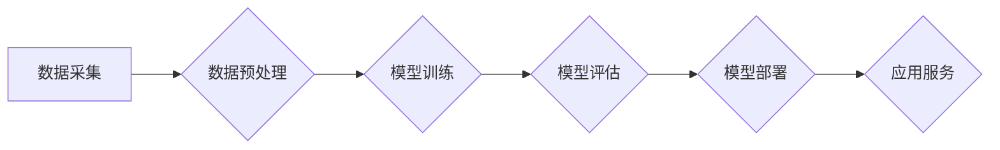

> 大模型、创业、挑战、机遇、商业化、伦理、可持续发展

## 1. 背景介绍

近年来，人工智能（AI）领域取得了飞速发展，其中大模型（Large Language Model，LLM）作为其重要组成部分，展现出强大的学习和推理能力，在自然语言处理、图像识别、代码生成等领域取得了突破性进展。大模型的出现为创业者带来了前所未有的机遇，但也带来了新的挑战。

大模型的商业化应用正逐渐成为现实。从聊天机器人、智能客服到内容创作、代码生成，大模型正在改变着人们的工作方式和生活方式。越来越多的创业公司涌入大模型领域，试图利用大模型的强大能力创造新的价值。

## 2. 核心概念与联系

大模型是指参数量巨大、训练数据海量的人工智能模型。其核心概念包括：

* **深度学习:** 大模型基于深度神经网络架构，通过多层神经元进行特征提取和学习。
* **Transformer:** Transformer是一种新型的神经网络架构，能够有效处理序列数据，是构建大模型的关键技术之一。
* **预训练:** 大模型通常采用预训练的方式进行训练，先在海量文本数据上进行预训练，然后在特定任务上进行微调。

**Mermaid 流程图:**



## 3. 核心算法原理 & 具体操作步骤

### 3.1  算法原理概述

大模型的训练主要基于深度学习算法，其中Transformer架构是其核心。Transformer通过自注意力机制（Self-Attention）和多头注意力机制（Multi-Head Attention）能够捕捉序列数据中的长距离依赖关系，从而实现更准确的文本理解和生成。

### 3.2  算法步骤详解

1. **数据预处理:** 收集和清洗数据，将其转换为模型可理解的格式。
2. **模型构建:** 根据预定的模型架构，搭建深度神经网络模型。
3. **模型训练:** 使用训练数据对模型进行训练，调整模型参数以最小化损失函数。
4. **模型评估:** 使用验证数据评估模型的性能，并根据评估结果进行模型调优。
5. **模型部署:** 将训练好的模型部署到服务器或云平台，提供服务。

### 3.3  算法优缺点

**优点:**

* 强大的学习能力，能够处理复杂的任务。
* 可迁移性强，在不同领域和任务上都能取得良好效果。
* 持续改进，随着训练数据的增加和算法的优化，性能不断提升。

**缺点:**

* 训练成本高，需要大量的计算资源和时间。
* 数据依赖性强，模型性能受训练数据质量影响较大。
* 可解释性差，难以理解模型的决策过程。

### 3.4  算法应用领域

大模型在多个领域都有广泛的应用，包括：

* **自然语言处理:** 文本分类、情感分析、机器翻译、文本摘要等。
* **图像识别:** 图像分类、目标检测、图像分割等。
* **代码生成:** 自动生成代码、代码修复等。
* **语音识别:** 语音转文本、语音合成等。

## 4. 数学模型和公式 & 详细讲解 & 举例说明

### 4.1  数学模型构建

大模型的训练基于深度学习算法，其数学模型主要包括：

* **激活函数:** 用于引入非线性，使模型能够学习复杂关系。常见的激活函数包括ReLU、Sigmoid、Tanh等。
* **损失函数:** 用于衡量模型预测结果与真实值的差距。常见的损失函数包括交叉熵损失、均方误差等。
* **优化算法:** 用于更新模型参数，使损失函数最小化。常见的优化算法包括梯度下降、Adam等。

### 4.2  公式推导过程

**损失函数:**

假设模型的预测结果为 $y_i$，真实值 $y_i^*$，则交叉熵损失函数可以表示为：

$$
L = -\sum_{i=1}^{N} y_i^* \log(y_i) + (1-y_i^*) \log(1-y_i)
$$

其中 $N$ 为样本数量。

**梯度下降:**

梯度下降算法用于更新模型参数，其更新公式为：

$$
\theta = \theta - \alpha \nabla L(\theta)
$$

其中 $\theta$ 为模型参数， $\alpha$ 为学习率， $\nabla L(\theta)$ 为损失函数对参数 $\theta$ 的梯度。

### 4.3  案例分析与讲解

假设我们训练一个二分类模型，用于判断文本是否为垃圾邮件。

* **数据:** 收集大量文本数据，标记为垃圾邮件或正常邮件。
* **模型:** 使用深度神经网络模型，包含多个隐藏层和一个输出层。
* **训练:** 使用交叉熵损失函数和梯度下降算法训练模型。
* **评估:** 使用验证数据评估模型的准确率、召回率和F1-score等指标。

## 5. 项目实践：代码实例和详细解释说明

### 5.1  开发环境搭建

* **操作系统:** Linux 或 macOS
* **编程语言:** Python
* **深度学习框架:** TensorFlow 或 PyTorch
* **硬件:** GPU 

### 5.2  源代码详细实现

```python
import tensorflow as tf

# 定义模型结构
model = tf.keras.models.Sequential([
    tf.keras.layers.Embedding(input_dim=vocab_size, output_dim=embedding_dim),
    tf.keras.layers.LSTM(units=128),
    tf.keras.layers.Dense(units=1, activation='sigmoid')
])

# 编译模型
model.compile(optimizer='adam', loss='binary_crossentropy', metrics=['accuracy'])

# 训练模型
model.fit(x_train, y_train, epochs=10, batch_size=32)

# 评估模型
loss, accuracy = model.evaluate(x_test, y_test)
print('Loss:', loss)
print('Accuracy:', accuracy)
```

### 5.3  代码解读与分析

* **Embedding层:** 将单词转换为稠密的向量表示。
* **LSTM层:** 用于处理序列数据，捕捉文本中的长距离依赖关系。
* **Dense层:** 全连接层，用于输出预测结果。
* **Adam优化器:** 用于更新模型参数。
* **Binary Crossentropy损失函数:** 用于二分类任务。
* **Accuracy指标:** 用于评估模型的准确率。

### 5.4  运行结果展示

训练完成后，可以将模型应用于新的文本数据，进行分类预测。

## 6. 实际应用场景

### 6.1  聊天机器人

大模型可以用于构建智能聊天机器人，能够与用户进行自然流畅的对话。

### 6.2  智能客服

大模型可以用于构建智能客服系统，自动回答用户常见问题，提高客户服务效率。

### 6.3  内容创作

大模型可以用于生成各种类型的文本内容，例如文章、故事、诗歌等。

### 6.4  未来应用展望

大模型的应用场景还在不断扩展，未来可能应用于：

* **个性化教育:** 根据学生的学习情况提供个性化的学习内容和辅导。
* **医疗诊断:** 辅助医生进行疾病诊断和治疗方案制定。
* **科学研究:** 加速科学研究进程，发现新的知识和规律。

## 7. 工具和资源推荐

### 7.1  学习资源推荐

* **书籍:**
    * 《深度学习》
    * 《自然语言处理》
* **在线课程:**
    * Coursera
    * edX
* **开源项目:**
    * TensorFlow
    * PyTorch

### 7.2  开发工具推荐

* **IDE:** PyCharm, VS Code
* **深度学习框架:** TensorFlow, PyTorch
* **云平台:** AWS, Azure, GCP

### 7.3  相关论文推荐

* **Attention Is All You Need**
* **BERT: Pre-training of Deep Bidirectional Transformers for Language Understanding**
* **GPT-3: Language Models are Few-Shot Learners**

## 8. 总结：未来发展趋势与挑战

### 8.1  研究成果总结

近年来，大模型在多个领域取得了突破性进展，展现出强大的学习和推理能力。

### 8.2  未来发展趋势

* **模型规模继续扩大:** 随着计算资源的提升，大模型的规模将继续扩大，性能将进一步提升。
* **多模态学习:** 大模型将融合文本、图像、音频等多模态数据，实现更全面的理解和生成。
* **可解释性增强:** 研究者将致力于提高大模型的可解释性，使模型的决策过程更加透明。

### 8.3  面临的挑战

* **数据安全和隐私:** 大模型的训练需要海量数据，如何保证数据安全和隐私是一个重要挑战。
* **算法偏见:** 大模型可能存在算法偏见，需要采取措施 mitigate 偏见的影响。
* **伦理问题:** 大模型的应用可能引发伦理问题，需要制定相应的规范和制度。

### 8.4  研究展望

未来，大模型研究将继续深入，探索更强大的模型架构、更有效的训练方法和更广泛的应用场景。


## 9. 附录：常见问题与解答

**Q1: 如何选择合适的深度学习框架？**

**A1:** TensorFlow 和 PyTorch 是两个主流的深度学习框架， TensorFlow 更适合于生产环境，PyTorch 更灵活，适合于研究和开发。

**Q2: 如何处理大规模数据集？**

**A2:** 可以使用分布式训练技术，将数据分发到多个机器上进行训练。

**Q3: 如何评估大模型的性能？**

**A3:** 可以使用准确率、召回率、F1-score 等指标评估模型的性能。

**Q4: 如何避免大模型的算法偏见？**

**A4:** 可以使用多样化的训练数据，并进行数据清洗和预处理，以减少偏见的影响。


作者：禅与计算机程序设计艺术 / Zen and the Art of Computer Programming 
<end_of_turn>