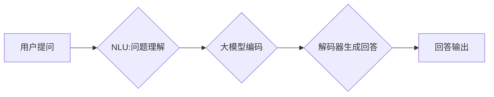

> 大模型、问答机器人、回答生成、自然语言处理、Transformer模型、BERT、GPT

## 1. 背景介绍

近年来，人工智能技术取得了飞速发展，自然语言处理（NLP）领域也取得了突破性进展。大模型问答机器人作为一种新型的智能交互系统，能够理解用户的问题，并生成准确、流畅、富有逻辑的回答，在客服、教育、娱乐等领域展现出巨大的应用潜力。

传统的问答系统主要依赖于规则引擎和知识库，难以应对复杂、开放式的用户问题。而大模型问答机器人则通过训练海量文本数据，学习语言的语义和结构，能够理解用户意图，并生成更自然、更符合语境的回答。

## 2. 核心概念与联系

大模型问答机器人的回答生成技术主要涉及以下核心概念：

* **大模型 (Large Model):** 指参数量庞大的深度学习模型，例如BERT、GPT等。大模型能够学习到更丰富的语言知识和语义表示，从而提升问答系统的性能。
* **Transformer模型:**  一种新型的深度学习架构，能够有效处理序列数据，例如文本。Transformer模型通过自注意力机制，能够捕捉文本中的长距离依赖关系，提升语言理解能力。
* **编码器-解码器架构:**  一种常见的深度学习架构，用于机器翻译、文本摘要等任务。编码器负责将输入文本编码成语义表示，解码器则根据编码结果生成输出文本。
* **自然语言理解 (NLU):**  指机器理解人类语言的能力，包括词义理解、句法分析、语义分析等。NLU是问答系统的重要组成部分，负责理解用户的问题意图。
* **自然语言生成 (NLG):**  指机器生成自然语言的能力，例如文本摘要、机器翻译、对话系统等。NLG是问答系统另一个重要组成部分，负责生成流畅、自然的回答。

**Mermaid 流程图:**



## 3. 核心算法原理 & 具体操作步骤

### 3.1  算法原理概述

大模型问答机器人的回答生成技术主要基于Transformer模型和编码器-解码器架构。

* **Transformer模型:**  Transformer模型通过自注意力机制，能够捕捉文本中的长距离依赖关系，提升语言理解能力。
* **编码器-解码器架构:**  编码器负责将用户问题编码成语义表示，解码器则根据编码结果生成回答。

### 3.2  算法步骤详解

1. **预处理:** 对用户问题进行预处理，例如分词、词性标注、去除停用词等。
2. **编码:** 使用Transformer模型的编码器部分，将预处理后的用户问题编码成语义表示。
3. **解码:** 使用Transformer模型的解码器部分，根据编码结果生成回答。
4. **后处理:** 对生成的回答进行后处理，例如语法检查、格式化等。

### 3.3  算法优缺点

**优点:**

* 能够理解复杂、开放式的用户问题。
* 生成回答更加自然、流畅。
* 性能优于传统的规则引擎和知识库问答系统。

**缺点:**

* 训练数据量大，训练成本高。
* 容易受到训练数据质量的影响。
* 对于一些特定领域的知识，可能缺乏足够的理解能力。

### 3.4  算法应用领域

大模型问答机器人技术在以下领域具有广泛的应用前景:

* **客服:** 自动回答用户常见问题，提高客服效率。
* **教育:** 提供个性化的学习辅导，帮助学生理解知识。
* **娱乐:** 开发智能聊天机器人，提供更丰富的互动体验。
* **搜索引擎:** 提升搜索结果的准确性和相关性。

## 4. 数学模型和公式 & 详细讲解 & 举例说明

### 4.1  数学模型构建

Transformer模型的核心是自注意力机制，其数学模型可以表示为：

$$
Attention(Q, K, V) = \frac{exp(Q \cdot K^T / \sqrt{d_k})}{exp(Q \cdot K^T / \sqrt{d_k})} \cdot V
$$

其中：

* $Q$：查询矩阵
* $K$：键矩阵
* $V$：值矩阵
* $d_k$：键向量的维度

### 4.2  公式推导过程

自注意力机制通过计算查询向量与键向量的点积，并使用softmax函数进行归一化，得到每个键向量的权重。然后，将权重与值向量相乘，得到最终的注意力输出。

### 4.3  案例分析与讲解

假设我们有一个句子 "The cat sat on the mat"，我们想要计算 "cat" 这个词对于整个句子的注意力权重。

1. 将句子中的每个词都转换为词向量。
2. 将词向量作为查询向量 $Q$，键向量 $K$ 和值向量 $V$。
3. 计算 $Q$ 与 $K$ 的点积，并使用softmax函数进行归一化，得到每个键向量的权重。
4. 将权重与 $V$ 相乘，得到最终的注意力输出。

通过分析注意力输出，我们可以发现 "cat" 这个词对于 "sat" 和 "mat" 两个词的注意力权重较高，说明 "cat" 这个词与这两个词语义上相关。

## 5. 项目实践：代码实例和详细解释说明

### 5.1  开发环境搭建

* Python 3.7+
* TensorFlow 2.0+
* PyTorch 1.0+
* CUDA 10.0+

### 5.2  源代码详细实现

```python
import tensorflow as tf

# 定义编码器模型
class Encoder(tf.keras.Model):
    def __init__(self, vocab_size, embedding_dim, hidden_dim, num_layers):
        super(Encoder, self).__init__()
        self.embedding = tf.keras.layers.Embedding(vocab_size, embedding_dim)
        self.lstm = tf.keras.layers.LSTM(hidden_dim, return_sequences=True)
        self.num_layers = num_layers

    def call(self, inputs):
        x = self.embedding(inputs)
        for _ in range(self.num_layers):
            x = self.lstm(x)
        return x

# 定义解码器模型
class Decoder(tf.keras.Model):
    def __init__(self, vocab_size, embedding_dim, hidden_dim, num_layers):
        super(Decoder, self).__init__()
        self.embedding = tf.keras.layers.Embedding(vocab_size, embedding_dim)
        self.lstm = tf.keras.layers.LSTM(hidden_dim)
        self.dense = tf.keras.layers.Dense(vocab_size)
        self.num_layers = num_layers

    def call(self, inputs, encoder_outputs):
        x = self.embedding(inputs)
        x = tf.concat([x, encoder_outputs], axis=-1)
        x = self.lstm(x)
        x = self.dense(x)
        return x

# 定义模型
model = tf.keras.Model(inputs=[encoder_inputs, decoder_inputs], outputs=decoder_outputs)

# 编译模型
model.compile(optimizer='adam', loss='sparse_categorical_crossentropy', metrics=['accuracy'])

# 训练模型
model.fit(train_data, epochs=10)

```

### 5.3  代码解读与分析

* **Encoder:** 负责编码用户问题，将文本转换为语义表示。
* **Decoder:** 负责解码语义表示，生成回答。
* **模型:** 将编码器和解码器连接起来，构成完整的问答模型。
* **训练:** 使用训练数据训练模型，使其能够生成准确、流畅的回答。

### 5.4  运行结果展示

训练完成后，可以将模型应用于实际场景，例如回答用户的问题。

## 6. 实际应用场景

### 6.1  客服机器人

大模型问答机器人可以用于构建客服机器人，自动回答用户常见问题，例如订单查询、退换货流程等。

### 6.2  教育辅助系统

大模型问答机器人可以用于构建教育辅助系统，帮助学生理解知识，例如回答学生的问题，提供学习辅导等。

### 6.3  智能聊天机器人

大模型问答机器人可以用于构建智能聊天机器人，提供更丰富的互动体验，例如进行对话、分享故事等。

### 6.4  未来应用展望

随着大模型技术的不断发展，大模型问答机器人将在更多领域得到应用，例如医疗诊断、法律咨询、金融分析等。

## 7. 工具和资源推荐

### 7.1  学习资源推荐

* **书籍:**
    * 《深度学习》
    * 《自然语言处理》
* **在线课程:**
    * Coursera: 自然语言处理
    * edX: 深度学习
* **博客:**
    * The Gradient
    * Towards Data Science

### 7.2  开发工具推荐

* **TensorFlow:** 开源深度学习框架
* **PyTorch:** 开源深度学习框架
* **Hugging Face:** 提供预训练模型和工具

### 7.3  相关论文推荐

* **BERT: Pre-training of Deep Bidirectional Transformers for Language Understanding**
* **GPT: Generative Pre-trained Transformer**
* **T5: Text-to-Text Transfer Transformer**

## 8. 总结：未来发展趋势与挑战

### 8.1  研究成果总结

大模型问答机器人技术取得了显著进展，能够理解复杂、开放式的用户问题，生成更加自然、流畅的回答。

### 8.2  未来发展趋势

* **模型规模更大:** 训练更大规模的模型，提升语言理解和生成能力。
* **多模态交互:** 将文本、图像、音频等多模态信息融合到问答系统中，提升交互体验。
* **个性化定制:** 根据用户的需求和偏好，定制个性化的问答系统。

### 8.3  面临的挑战

* **数据质量:** 训练大模型需要海量高质量的文本数据，数据质量直接影响模型性能。
* **计算资源:** 训练大模型需要大量的计算资源，成本较高。
* **伦理问题:** 大模型问答机器人可能存在偏见、误导等伦理问题，需要进行充分的评估和监管。

### 8.4  研究展望

未来，大模型问答机器人技术将继续发展，在更多领域得到应用，为人类社会带来更多便利。

## 9. 附录：常见问题与解答

* **Q: 如何训练大模型问答机器人？**

A: 训练大模型问答机器人需要准备海量文本数据，并使用深度学习框架进行训练。

* **Q: 大模型问答机器人有哪些应用场景？**

A: 大模型问答机器人可以应用于客服、教育、娱乐等领域。

* **Q: 大模型问答机器人有哪些挑战？**

A: 大模型问答机器人面临数据质量、计算资源、伦理问题等挑战。


作者：禅与计算机程序设计艺术 / Zen and the Art of Computer Programming 
<end_of_turn>