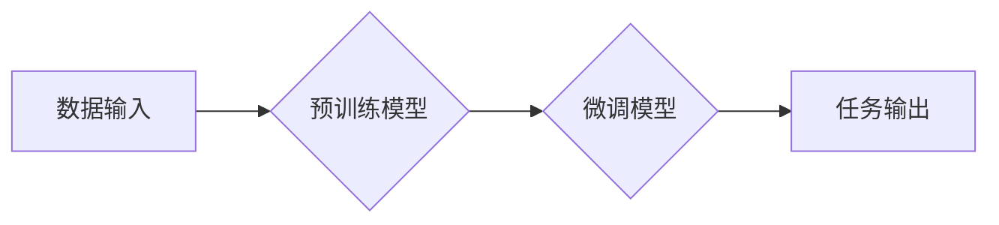

> 大模型、深度学习、Transformer、自然语言处理、计算机视觉、生成式模型、数据驱动、人工智能

## 1. 背景介绍

人工智能（AI）近年来取得了令人瞩目的进展，其中大模型扮演着越来越重要的角色。大模型是指参数规模庞大、训练数据海量的人工智能模型，其强大的学习能力和泛化能力使其在自然语言处理、计算机视觉、语音识别等多个领域展现出令人惊叹的性能。

从早期的小规模模型到如今的数十亿甚至千亿参数的大模型，模型规模的不断增长是推动AI发展的重要趋势。这得益于以下几个方面：

* **数据爆炸:**  互联网时代的到来带来了海量数据，为大模型的训练提供了充足的燃料。
* **计算能力提升:**  GPU和TPU等高性能计算硬件的不断发展，使得训练大模型成为可能。
* **算法创新:**  Transformer等新型神经网络架构的出现，有效提升了大模型的学习效率和性能。

大模型的出现标志着人工智能进入了一个新的时代，它将深刻地改变我们生活和工作的方式。

## 2. 核心概念与联系

大模型的核心概念包括：

* **深度学习:**  大模型基于深度神经网络，通过多层神经元网络学习数据中的复杂模式。
* **Transformer:**  Transformer是一种新型的神经网络架构，其自注意力机制能够有效捕捉长距离依赖关系，为大模型的训练提供了强大的工具。
* **预训练:**  大模型通常采用预训练的方式进行训练，即在大量通用数据上进行预训练，然后在特定任务上进行微调。
* **迁移学习:**  预训练的大模型可以迁移到其他任务上，无需从头开始训练，大大降低了训练成本和时间。

**大模型架构示意图:**



## 3. 核心算法原理 & 具体操作步骤

### 3.1  算法原理概述

大模型的核心算法是深度学习，其原理是通过多层神经网络学习数据中的复杂模式。每个神经元接收来自前一层神经元的输入，并通过激活函数进行处理，输出到下一层神经元。通过不断调整神经元的权重，模型能够学习到数据的规律，并进行预测或分类。

### 3.2  算法步骤详解

大模型的训练过程通常包括以下步骤：

1. **数据预处理:**  收集和清洗数据，将其转换为模型可以理解的格式。
2. **模型构建:**  根据任务需求选择合适的模型架构，并初始化模型参数。
3. **模型训练:**  使用训练数据训练模型，通过反向传播算法调整模型参数，使模型的预测结果与真实值尽可能接近。
4. **模型评估:**  使用测试数据评估模型的性能，并根据评估结果进行模型调优。
5. **模型部署:**  将训练好的模型部署到实际应用场景中。

### 3.3  算法优缺点

**优点:**

* **强大的学习能力:**  深度学习模型能够学习到数据中的复杂模式，并进行精准的预测或分类。
* **泛化能力强:**  预训练的大模型能够迁移到其他任务上，无需从头开始训练。
* **不断进步:**  随着算法和硬件的不断发展，大模型的性能将持续提升。

**缺点:**

* **训练成本高:**  大模型的训练需要大量的计算资源和时间。
* **数据依赖性强:**  大模型的性能取决于训练数据的质量和数量。
* **可解释性差:**  深度学习模型的内部机制复杂，难以解释其决策过程。

### 3.4  算法应用领域

大模型在多个领域都有广泛的应用，例如：

* **自然语言处理:**  机器翻译、文本摘要、问答系统、聊天机器人等。
* **计算机视觉:**  图像识别、物体检测、图像生成等。
* **语音识别:**  语音转文本、语音合成等。
* **药物研发:**  药物发现、药物设计等。

## 4. 数学模型和公式 & 详细讲解 & 举例说明

### 4.1  数学模型构建

大模型的数学模型通常基于深度神经网络，其核心是多层感知机（MLP）和卷积神经网络（CNN）。

* **多层感知机 (MLP):**  MLP由多个全连接层组成，每个层的神经元都与上一层的每个神经元连接。

* **卷积神经网络 (CNN):**  CNN利用卷积核对输入数据进行卷积操作，提取特征，并通过池化层降低数据维度。

### 4.2  公式推导过程

大模型的训练过程基于梯度下降算法，其目标是最小化模型的损失函数。损失函数衡量模型预测结果与真实值的差距。

**损失函数:**

$$L = \frac{1}{N} \sum_{i=1}^{N} loss(y_i, \hat{y}_i)$$

其中：

* $L$ 为损失函数
* $N$ 为样本数量
* $y_i$ 为真实值
* $\hat{y}_i$ 为模型预测值
* $loss(y_i, \hat{y}_i)$ 为单个样本的损失

**梯度下降算法:**

$$\theta = \theta - \alpha \nabla L(\theta)$$

其中：

* $\theta$ 为模型参数
* $\alpha$ 为学习率
* $\nabla L(\theta)$ 为损失函数对参数的梯度

### 4.3  案例分析与讲解

例如，在机器翻译任务中，大模型可以将英文句子翻译成中文句子。训练过程中，模型会学习到英文和中文之间的语义关系，并根据输入的英文句子生成相应的中文句子。

## 5. 项目实践：代码实例和详细解释说明

### 5.1  开发环境搭建

大模型的开发环境通常需要强大的计算资源，例如GPU或TPU。常用的开发框架包括TensorFlow、PyTorch等。

### 5.2  源代码详细实现

以下是一个简单的TensorFlow代码示例，用于训练一个简单的文本分类模型：

```python
import tensorflow as tf

# 定义模型
model = tf.keras.models.Sequential([
    tf.keras.layers.Embedding(input_dim=10000, output_dim=128),
    tf.keras.layers.LSTM(128),
    tf.keras.layers.Dense(1, activation='sigmoid')
])

# 编译模型
model.compile(optimizer='adam', loss='binary_crossentropy', metrics=['accuracy'])

# 训练模型
model.fit(x_train, y_train, epochs=10)

# 评估模型
loss, accuracy = model.evaluate(x_test, y_test)
print('Loss:', loss)
print('Accuracy:', accuracy)
```

### 5.3  代码解读与分析

这段代码定义了一个简单的文本分类模型，其结构包括嵌入层、LSTM层和全连接层。嵌入层将单词转换为向量表示，LSTM层捕捉文本序列中的长距离依赖关系，全连接层进行分类。

### 5.4  运行结果展示

训练完成后，模型可以用于预测新的文本样本的类别。

## 6. 实际应用场景

大模型在多个领域都有广泛的应用，例如：

### 6.1  自然语言处理

* **机器翻译:**  Google Translate、DeepL等机器翻译工具使用大模型进行翻译，能够实现更准确、更流畅的翻译。
* **文本摘要:**  大模型可以自动生成文本摘要，例如新闻文章的摘要、会议记录的摘要等。
* **问答系统:**  大模型可以理解自然语言问题，并从知识库中找到答案，例如智能客服系统、搜索引擎等。

### 6.2  计算机视觉

* **图像识别:**  大模型可以识别图像中的物体、场景、人物等，例如自动驾驶、医疗诊断等。
* **物体检测:**  大模型可以定位图像中的物体，并识别物体的类别，例如安防监控、无人零售等。
* **图像生成:**  大模型可以生成逼真的图像，例如艺术作品、产品设计等。

### 6.3  语音识别

* **语音转文本:**  大模型可以将语音转换为文本，例如语音助手、语音输入等。
* **语音合成:**  大模型可以将文本转换为语音，例如语音播报、虚拟助手等。

### 6.4  未来应用展望

大模型的应用前景广阔，未来将应用于更多领域，例如：

* **个性化教育:**  根据学生的学习情况，提供个性化的学习内容和辅导。
* **精准医疗:**  根据患者的基因信息和病史，提供个性化的医疗方案。
* **科学研究:**  加速科学发现，例如药物研发、材料科学等。

## 7. 工具和资源推荐

### 7.1  学习资源推荐

* **书籍:**
    * 《深度学习》
    * 《自然语言处理》
    * 《计算机视觉》
* **在线课程:**
    * Coursera
    * edX
    * Udacity

### 7.2  开发工具推荐

* **TensorFlow:**  开源深度学习框架
* **PyTorch:**  开源深度学习框架
* **Jupyter Notebook:**  交互式编程环境

### 7.3  相关论文推荐

* **Attention Is All You Need:**  Transformer模型的提出论文
* **BERT: Pre-training of Deep Bidirectional Transformers for Language Understanding:**  BERT模型的提出论文
* **GPT-3: Language Models are Few-Shot Learners:**  GPT-3模型的提出论文

## 8. 总结：未来发展趋势与挑战

### 8.1  研究成果总结

大模型在人工智能领域取得了令人瞩目的进展，其强大的学习能力和泛化能力为多个领域带来了革命性的改变。

### 8.2  未来发展趋势

* **模型规模继续增长:**  随着计算能力的提升，大模型的规模将继续增长，模型性能将进一步提升。
* **模型架构创新:**  新的模型架构将不断涌现，例如混合模型、联邦学习等，提升模型的效率和鲁棒性。
* **应用场景拓展:**  大模型将应用于更多领域，例如教育、医疗、金融等，为人类社会带来更多价值。

### 8.3  面临的挑战

* **数据安全和隐私:**  大模型的训练需要海量数据，如何保证数据安全和隐私是一个重要挑战。
* **模型可解释性:**  大模型的决策过程难以解释，如何提高模型的可解释性是一个重要的研究方向。
* **伦理问题:**  大模型的应用可能带来一些伦理问题，例如算法偏见、信息操控等，需要引起社会广泛关注和讨论。

### 8.4  研究展望

未来，大模型研究将继续朝着更强大、更安全、更可解释的方向发展，为人类社会带来更多福祉。

## 9. 附录：常见问题与解答

**常见问题:**

* **什么是大模型？**

大模型是指参数规模庞大、训练数据海量的人工智能模型。

* **大模型的训练成本高吗？**

是的，大模型的训练需要大量的计算资源和时间，成本较高。

* **大模型的应用场景有哪些？**

大模型在多个领域都有广泛的应用，例如自然语言处理、计算机视觉、语音识别等。

* **大模型的未来发展趋势是什么？**

大模型的规模将继续增长，模型架构将不断创新，应用场景将不断拓展。

**作者：禅与计算机程序设计艺术 / Zen and the Art of Computer Programming**


<end_of_turn>