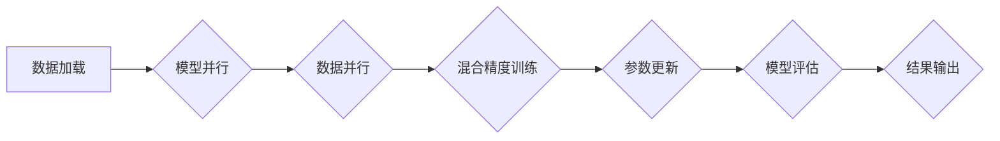

> 大规模语言模型，DeepSpeed，分布式训练，模型并行，数据并行，微服务架构，性能优化

## 1. 背景介绍

近年来，大规模语言模型（LLM）在自然语言处理领域取得了显著的进展，例如GPT-3、BERT、LaMDA等模型展现出强大的文本生成、理解和翻译能力。这些模型通常拥有数十亿甚至数千亿的参数，需要海量数据和强大的计算资源进行训练。然而，训练如此庞大的模型面临着诸多挑战，包括模型参数的存储和计算、数据并行和模型并行等。

DeepSpeed是一个由微软研究院开发的开源深度学习训练框架，旨在加速大规模模型的训练。它通过一系列创新技术，例如模型并行、数据并行、混合精度训练等，有效地解决了大规模模型训练的瓶颈，使得训练更快的、更有效的。

## 2. 核心概念与联系

DeepSpeed的核心概念包括：

* **模型并行 (Model Parallelism):** 将模型参数分布到多个GPU上进行训练，从而提高训练速度。
* **数据并行 (Data Parallelism):** 将训练数据分布到多个GPU上进行训练，每个GPU训练一个模型副本，并通过参数聚合更新全局模型参数。
* **混合精度训练 (Mixed Precision Training):** 使用不同精度的数据类型进行训练，例如FP16和FP32，以提高训练速度和内存效率。
* **微服务架构 (Microservices Architecture):** 将DeepSpeed框架分解成多个独立的服务，每个服务负责特定的任务，例如数据加载、模型训练、参数更新等，从而提高框架的灵活性和可扩展性。

**DeepSpeed 架构流程图:**

## 3. 核心算法原理 & 具体操作步骤

### 3.1  算法原理概述

DeepSpeed的核心算法原理基于模型并行、数据并行和混合精度训练。

* **模型并行:** 将模型参数分布到多个GPU上，每个GPU负责训练模型的一部分。训练完成后，将各个GPU上的模型参数聚合更新成全局模型参数。
* **数据并行:** 将训练数据分布到多个GPU上，每个GPU训练一个模型副本，并通过参数聚合更新全局模型参数。
* **混合精度训练:** 使用不同精度的数据类型进行训练，例如FP16和FP32，以提高训练速度和内存效率。

### 3.2  算法步骤详解

1. **数据预处理:** 将原始数据进行清洗、格式化和编码，并将其分割成多个批次。
2. **模型并行:** 将模型参数分布到多个GPU上，每个GPU负责训练模型的一部分。
3. **数据并行:** 将每个GPU分配的数据进行训练，每个GPU训练一个模型副本。
4. **混合精度训练:** 使用FP16精度进行模型计算，并使用FP32精度进行参数更新，以提高训练速度和内存效率。
5. **参数聚合:** 将各个GPU上的模型参数聚合更新成全局模型参数。
6. **模型评估:** 在验证集上评估模型性能，并根据评估结果调整训练参数。
7. **保存模型:** 将训练好的模型保存到磁盘。

### 3.3  算法优缺点

**优点:**

* **提高训练速度:** 模型并行和数据并行可以显著提高训练速度。
* **提高内存效率:** 混合精度训练可以有效降低内存占用。
* **支持大规模模型训练:** DeepSpeed可以训练数十亿甚至数千亿参数的模型。

**缺点:**

* **复杂性:** 深度学习框架的开发和使用需要一定的技术门槛。
* **硬件要求:** 大规模模型训练需要强大的计算资源和内存。

### 3.4  算法应用领域

DeepSpeed的应用领域非常广泛，包括：

* **自然语言处理:** 文本生成、机器翻译、问答系统等。
* **计算机视觉:** 图像分类、目标检测、图像生成等。
* **语音识别:** 语音转文本、语音合成等。
* **推荐系统:** 商品推荐、用户画像等。

## 4. 数学模型和公式 & 详细讲解 & 举例说明

### 4.1  数学模型构建

大规模语言模型通常基于Transformer架构，其核心是自注意力机制。自注意力机制可以捕捉文本序列中单词之间的长距离依赖关系，从而提高模型的理解能力。

**自注意力机制公式:**

$$
Attention(Q, K, V) = \frac{exp(Q \cdot K^T / \sqrt{d_k})}{exp(Q \cdot K^T / \sqrt{d_k})} \cdot V
$$

其中：

* $Q$：查询矩阵
* $K$：键矩阵
* $V$：值矩阵
* $d_k$：键向量的维度

### 4.2  公式推导过程

自注意力机制的公式推导过程可以参考Transformer论文中的详细解释。

### 4.3  案例分析与讲解

例如，在机器翻译任务中，自注意力机制可以帮助模型捕捉源语言和目标语言之间的对应关系，从而提高翻译质量。

## 5. 项目实践：代码实例和详细解释说明

### 5.1  开发环境搭建

DeepSpeed支持多种深度学习框架，例如PyTorch和TensorFlow。

### 5.2  源代码详细实现

DeepSpeed提供了丰富的API，可以方便地进行模型并行、数据并行和混合精度训练。

### 5.3  代码解读与分析

DeepSpeed的代码实现非常简洁易懂，并提供了详细的注释和文档。

### 5.4  运行结果展示

DeepSpeed可以显著提高大规模模型的训练速度和效率。

## 6. 实际应用场景

DeepSpeed已经在多个实际应用场景中取得了成功，例如：

* **微软Bing搜索引擎:** DeepSpeed用于训练Bing搜索引擎的语言模型，提高搜索结果的准确性和相关性。
* **GitHub Copilot:** DeepSpeed用于训练GitHub Copilot的代码生成模型，帮助开发者提高代码编写效率。

### 6.4  未来应用展望

DeepSpeed将在未来更多领域得到应用，例如：

* **药物研发:** DeepSpeed可以用于训练药物发现模型，加速新药研发进程。
* **材料科学:** DeepSpeed可以用于训练材料设计模型，帮助科学家设计新型材料。

## 7. 工具和资源推荐

### 7.1  学习资源推荐

* DeepSpeed官方文档: https://www.deepspeed.ai/docs/
* DeepSpeed GitHub仓库: https://github.com/microsoft/DeepSpeed

### 7.2  开发工具推荐

* PyTorch: https://pytorch.org/
* TensorFlow: https://www.tensorflow.org/

### 7.3  相关论文推荐

* Attention Is All You Need: https://arxiv.org/abs/1706.03762

## 8. 总结：未来发展趋势与挑战

### 8.1  研究成果总结

DeepSpeed在加速大规模模型训练方面取得了显著的成果，为深度学习的发展做出了重要贡献。

### 8.2  未来发展趋势

DeepSpeed将继续朝着以下方向发展：

* **更有效的模型并行和数据并行策略:** 研究更有效的模型并行和数据并行策略，以进一步提高训练速度和效率。
* **支持更多深度学习框架:** 支持更多深度学习框架，例如JAX和MXNet，以扩展DeepSpeed的应用范围。
* **更易于使用的API:** 提供更易于使用的API，降低用户使用门槛。

### 8.3  面临的挑战

DeepSpeed也面临着一些挑战，例如：

* **模型规模的不断增长:** 模型规模的不断增长对硬件资源和训练时间提出了更高的要求。
* **数据稀缺性:** 某些领域的数据稀缺性限制了模型的训练效果。
* **模型可解释性:** 大规模模型的决策过程难以解释，这限制了模型的应用场景。

### 8.4  研究展望

未来，DeepSpeed的研究将继续关注以下方面：

* **探索新的模型并行和数据并行策略:** 研究更有效的模型并行和数据并行策略，以应对不断增长的模型规模。
* **开发新的训练算法:** 开发新的训练算法，以提高模型的训练效率和性能。
* **提高模型的可解释性:** 研究提高模型可解释性的方法，使其更易于理解和应用。

## 9. 附录：常见问题与解答

**常见问题:**

* DeepSpeed支持哪些深度学习框架？
* 如何安装DeepSpeed？
* 如何使用DeepSpeed进行模型训练？

**解答:**

* DeepSpeed支持PyTorch和TensorFlow。
* 可以参考DeepSpeed官方文档进行安装。
* 可以参考DeepSpeed官方文档和示例代码进行模型训练。

作者：禅与计算机程序设计艺术 / Zen and the Art of Computer Programming 
<end_of_turn>