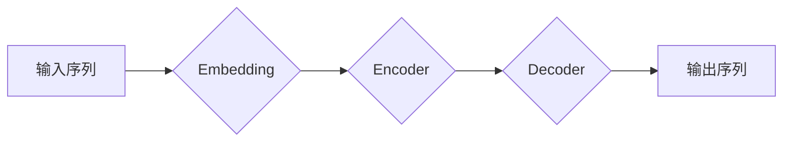

> 大规模语言模型，Transformer，深度学习，自然语言处理，文本生成，机器翻译，预训练模型

## 1. 背景介绍

近年来，人工智能领域取得了令人瞩目的进展，其中大规模语言模型（Large Language Models，LLMs）作为一种重要的突破，展现出强大的文本理解和生成能力，引发了广泛的关注和研究。从早期基于统计方法的语言模型到如今基于深度学习的Transformer架构，LLMs的发展历程充满了创新和挑战。

### 1.1  语言模型的演变

语言模型旨在学习语言的统计规律，并根据这些规律预测下一个词或句子。早期语言模型主要基于统计方法，例如N-gram模型，通过统计词语之间的出现频率来预测下一个词。然而，这些模型受限于有限的上下文信息，难以捕捉长距离依赖关系。

### 1.2  深度学习的兴起

深度学习的兴起为语言模型的发展带来了革命性的改变。深度神经网络能够学习更复杂的特征表示，并有效地捕捉长距离依赖关系。2017年，Google发布了基于Transformer架构的BERT模型，标志着LLMs进入了一个新的时代。

### 1.3  大规模语言模型的特征

大规模语言模型通常具有以下特征：

* **规模庞大:** 参数数量巨大，通常包含数十亿甚至千亿个参数。
* **预训练能力:** 通过大量的文本数据进行预训练，学习到丰富的语言知识。
* **多任务学习:** 可以用于多种自然语言处理任务，例如机器翻译、文本摘要、问答系统等。
* **强大的文本生成能力:** 可以生成流畅、连贯、富有创意的文本。

## 2. 核心概念与联系

大规模语言模型的核心概念包括Transformer架构、自注意力机制、预训练和微调。

**Mermaid 流程图:**



### 2.1  Transformer架构

Transformer是一种新型的神经网络架构，专门设计用于处理序列数据，例如文本。它摒弃了传统的循环神经网络（RNN）的顺序处理方式，采用自注意力机制，能够并行处理整个序列，从而提高训练效率和模型性能。

### 2.2  自注意力机制

自注意力机制是Transformer架构的核心，它允许模型关注输入序列中的不同位置，并学习它们之间的关系。通过计算每个词与其他词之间的注意力权重，模型可以更好地理解上下文信息。

### 2.3  预训练和微调

预训练是指在大量文本数据上训练语言模型，学习到通用的语言知识。微调是指在特定任务数据上对预训练模型进行进一步训练，使其能够适应特定任务的需求。

## 3. 核心算法原理 & 具体操作步骤

### 3.1  算法原理概述

大规模语言模型的训练主要基于深度学习的监督学习方法。模型的目标是预测下一个词或句子，并通过反向传播算法调整模型参数，使预测结果与真实值尽可能接近。

### 3.2  算法步骤详解

1. **数据预处理:** 将文本数据进行清洗、分词、标记等预处理操作，使其能够被模型理解。
2. **模型构建:** 根据Transformer架构构建模型，并设置模型参数。
3. **模型训练:** 使用预处理后的数据训练模型，并通过反向传播算法调整模型参数。
4. **模型评估:** 使用测试数据评估模型的性能，并根据评估结果调整模型参数或训练策略。
5. **模型部署:** 将训练好的模型部署到实际应用场景中。

### 3.3  算法优缺点

**优点:**

* 能够学习到丰富的语言知识。
* 性能优异，在多种自然语言处理任务中取得了突破性进展。
* 可用于多种任务，具有良好的泛化能力。

**缺点:**

* 训练成本高，需要大量的计算资源和数据。
* 模型参数量巨大，部署成本较高。
* 存在潜在的偏差和误差，需要进行仔细的评估和监控。

### 3.4  算法应用领域

大规模语言模型在以下领域具有广泛的应用前景：

* **机器翻译:** 自动翻译不同语言的文本。
* **文本摘要:** 自动生成文本的简要摘要。
* **问答系统:** 回答用户提出的问题。
* **对话系统:** 与用户进行自然语言对话。
* **文本生成:** 生成各种类型的文本，例如诗歌、小说、代码等。

## 4. 数学模型和公式 & 详细讲解 & 举例说明

### 4.1  数学模型构建

大规模语言模型通常基于深度神经网络，其数学模型可以表示为一个多层的神经网络结构，其中每一层都包含多个神经元。每个神经元接收来自上一层的输入，并通过激活函数进行处理，输出到下一层。

### 4.2  公式推导过程

模型的输出可以表示为输入序列经过多层神经网络处理后的结果。每个神经元的输出可以表示为：

$$
y_i = f(W_i \cdot x_i + b_i)
$$

其中：

* $y_i$ 是神经元 $i$ 的输出。
* $f$ 是激活函数。
* $W_i$ 是神经元 $i$ 的权重矩阵。
* $x_i$ 是神经元 $i$ 的输入。
* $b_i$ 是神经元 $i$ 的偏置项。

### 4.3  案例分析与讲解

例如，在Transformer架构中，自注意力机制的计算公式可以表示为：

$$
Attention(Q, K, V) = softmax(\frac{QK^T}{\sqrt{d_k}})V
$$

其中：

* $Q$, $K$, $V$ 分别是查询矩阵、键矩阵和值矩阵。
* $d_k$ 是键向量的维度。

通过计算每个词与其他词之间的注意力权重，模型可以更好地理解上下文信息。

## 5. 项目实践：代码实例和详细解释说明

### 5.1  开发环境搭建

使用Python语言开发大规模语言模型，需要安装以下软件包：

* TensorFlow 或 PyTorch
* Numpy
* Pandas
* HuggingFace Transformers

### 5.2  源代码详细实现

以下是一个使用HuggingFace Transformers库加载预训练模型并进行文本生成的简单代码示例：

```python
from transformers import pipeline

generator = pipeline("text-generation", model="gpt2")

text = "The quick brown fox jumps over the"
output = generator(text, max_length=30, num_return_sequences=3)

for sequence in output:
    print(sequence["generated_text"])
```

### 5.3  代码解读与分析

* `pipeline("text-generation", model="gpt2")`：加载预训练的GPT-2模型，并将其封装成一个文本生成管道。
* `generator(text, max_length=30, num_return_sequences=3)`：使用加载的模型生成文本，输入文本为`text`，最大长度为30个词，生成3个不同的文本序列。
* `sequence["generated_text"]`：获取每个文本序列的生成文本内容。

### 5.4  运行结果展示

运行上述代码，将输出3个不同的文本序列，例如：

```
The quick brown fox jumps over the lazy dog.
The quick brown fox jumps over the fence.
The quick brown fox jumps over the moon.
```

## 6. 实际应用场景

### 6.1  机器翻译

大规模语言模型可以用于机器翻译，例如将英文翻译成中文。

### 6.2  文本摘要

大规模语言模型可以用于自动生成文本的简要摘要，例如将一篇长篇文章总结成几句话。

### 6.3  问答系统

大规模语言模型可以用于构建问答系统，例如回答用户提出的问题。

### 6.4  未来应用展望

大规模语言模型在未来将有更广泛的应用场景，例如：

* **个性化教育:** 根据学生的学习情况提供个性化的学习内容和辅导。
* **医疗诊断:** 辅助医生进行疾病诊断和治疗方案制定。
* **法律服务:** 自动分析法律文件，提供法律建议。

## 7. 工具和资源推荐

### 7.1  学习资源推荐

* **书籍:**
    * 《深度学习》
    * 《自然语言处理》
    * 《Transformer模型》
* **在线课程:**
    * Coursera
    * edX
    * fast.ai

### 7.2  开发工具推荐

* **TensorFlow:** 开源深度学习框架。
* **PyTorch:** 开源深度学习框架。
* **HuggingFace Transformers:** 预训练模型库和工具。

### 7.3  相关论文推荐

* **Attention Is All You Need:** https://arxiv.org/abs/1706.03762
* **BERT: Pre-training of Deep Bidirectional Transformers for Language Understanding:** https://arxiv.org/abs/1810.04805
* **GPT-3: Language Models are Few-Shot Learners:** https://arxiv.org/abs/2005.14165

## 8. 总结：未来发展趋势与挑战

### 8.1  研究成果总结

大规模语言模型在自然语言处理领域取得了显著的进展，展现出强大的文本理解和生成能力。

### 8.2  未来发展趋势

* **模型规模进一步扩大:** 预计未来将出现规模更大的语言模型，拥有更强的能力和更广泛的应用场景。
* **多模态学习:** 将文本与其他模态数据（例如图像、音频）进行融合，构建更全面的理解模型。
* **可解释性增强:** 研究如何提高语言模型的可解释性，使其决策过程更加透明和可理解。

### 8.3  面临的挑战

* **数据获取和标注:** 大规模语言模型需要大量的文本数据进行训练，数据获取和标注成本较高。
* **计算资源需求:** 训练大规模语言模型需要大量的计算资源，成本高昂。
* **伦理和安全问题:** 大规模语言模型可能存在潜在的偏见和误差，需要进行仔细的评估和监控，确保其安全和伦理使用。

### 8.4  研究展望

未来研究将继续探索大规模语言模型的潜力，解决其面临的挑战，并将其应用于更广泛的领域，推动人工智能技术的发展。

## 9. 附录：常见问题与解答

### 9.1  什么是Transformer架构？

Transformer是一种新型的神经网络架构，专门设计用于处理序列数据，例如文本。它摒弃了传统的循环神经网络（RNN）的顺序处理方式，采用自注意力机制，能够并行处理整个序列，从而提高训练效率和模型性能。

### 9.2  什么是自注意力机制？

自注意力机制是Transformer架构的核心，它允许模型关注输入序列中的不同位置，并学习它们之间的关系。通过计算每个词与其他词之间的注意力权重，模型可以更好地理解上下文信息。

### 9.3  如何训练大规模语言模型？

大规模语言模型的训练主要基于深度学习的监督学习方法。模型的目标是预测下一个词或句子，并通过反向传播算法调整模型参数，使预测结果与真实值尽可能接近。

### 9.4  大规模语言模型有哪些应用场景？

大规模语言模型在以下领域具有广泛的应用前景：

* **机器翻译**
* **文本摘要**
* **问答系统**
* **对话系统**
* **文本生成**

### 9.5  大规模语言模型有哪些挑战？

大规模语言模型面临的挑战包括：

* **数据获取和标注成本高**
* **计算资源需求大**
* **伦理和安全问题**


作者：禅与计算机程序设计艺术 / Zen and the Art of Computer Programming 
<end_of_turn>